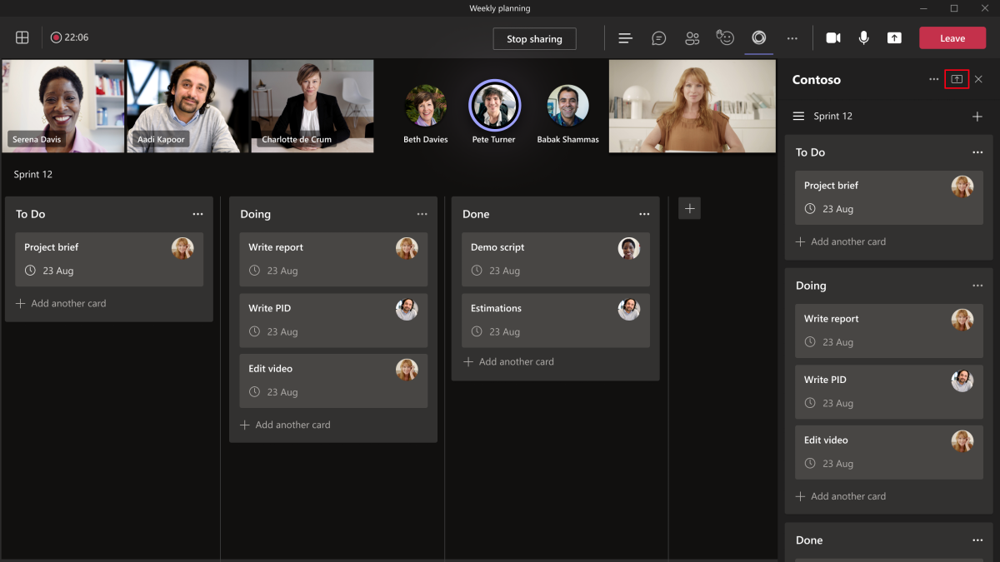
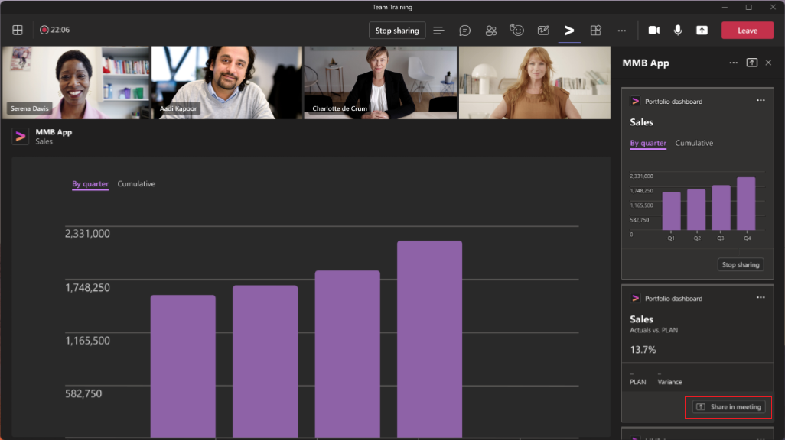

# <a name="enable-and-configure-your-apps-for-teams-meetings"></a>Включение и настройка приложений для собраний Teams

У каждой команды есть разные способы взаимодействия и совместной работы. Для выполнения различных задач настройте Teams с использованием приложений для собраний. Включите свои приложения для собраний Teams и настройте их доступность в области собраний в манифесте приложения.

## <a name="prerequisites"></a>Предварительные требования

С помощью приложений для собраний Teams вы можете расширить возможности своих приложений в жизненном цикле собрания. Прежде чем работать с приложениями для собраний Teams, необходимо выполнить следующие предварительные требования.

* Ознакомьтесь с разработкой приложений Teams. Дополнительные сведения о разработке приложений Teams см. в статье [Разработка приложения Teams](../overview.md).

* Используйте приложение, которое поддерживает настраиваемые вкладки в области группового чата. Дополнительные сведения см. в разделе об [области группового чата](../resources/schema/manifest-schema.md#configurabletabs) и [создании вкладки группы](../build-your-first-app/build-channel-tab.md).

* Соблюдайте общие [руководства по разработке вкладок Teams](../tabs/design/tabs.md) для сценариев до и после собрания. Сведения о взаимодействиях во время собраний см. в [руководствах по разработке вкладок в собрании](../apps-in-teams-meetings/design/designing-apps-in-meetings.md#use-an-in-meeting-tab) и [руководствах по разработке диалоговых окон в собрании](../apps-in-teams-meetings/design/designing-apps-in-meetings.md#use-an-in-meeting-dialog).

* Чтобы ваше приложение обновлялось в режиме реального времени, оно должно обновляться на основе действий, связанных с событиями в собрании. Эти события могут быть в диалоговых окнах во время собрания и в других сценах жизненного цикла собрания. Сведения о диалоговых окнах во время собрания см. в описании параметра `completionBotId` в [полезных данных уведомления на собрании](API-references.md#send-an-in-meeting-notification).

## <a name="enable-your-app-for-teams-meetings"></a>Включение приложения для собраний Teams

Чтобы включить свое приложение для собраний Teams, обновите манифест своего приложения и используйте свойства контекста, чтобы определить, где должно отображаться приложение.

### <a name="update-your-app-manifest"></a>Обновление манифеста приложения

Возможности приложения для собраний объявляются в манифесте приложения с помощью массивов `configurableTabs`, `scopes` и `context`. Область определяет, у кого есть доступ, а контекст определяет, где доступно ваше приложение.

> [!NOTE]
>
> * Приложениям на собраниях требуется область `groupchat`. Область `team` работает только для вкладок в каналах.
> * Приложения на собраниях могут использовать следующие контексты: `meetingChatTab`, `meetingDetailsTab`, `meetingSidePanel` и `meetingStage`.

Следующий фрагмент кода является примером настраиваемой вкладки, используемой в приложении для собраний Teams:

```json

"configurableTabs": [
    {
      "configurationUrl": "https://contoso.com/teamstab/configure",
      "canUpdateConfiguration": true,
      "scopes": [
        "team",
        "groupchat"
      ],
      "context":[
        "channelTab",
        "privateChatTab",
        "meetingChatTab",
        "meetingDetailsTab",
        "meetingSidePanel",
        "meetingStage"
     ]
    }
  ]
```

### <a name="context-property"></a>Свойство контекста

Свойство `context` определяет, что должно отображаться, когда пользователь вызывает приложение на собрании в зависимости от того, где пользователь вызывает приложение. Свойства `context` и `scopes` вкладки позволяют определить, где должно отображаться приложение. Вкладки в области `team` или `groupchat` могут иметь несколько контекстов.

Обеспечьте поддержку области `groupchat`, чтобы включить свое приложение в чатах перед собранием и после собрания. С помощью интерфейса приложения для взаимодействия до собрания вы можете найти и добавить приложения для собраний, а также выполнить задачи перед собранием. С помощью интерфейса приложения для взаимодействия после собрания вы можете просматривать результаты собрания, например результаты опроса или оплату.

 Ниже приведены значения для свойства `context`. Вы можете использовать некоторые или все эти значения.

|Значение|Описание|
|---|---|
| **channelTab** | Вкладка в заголовке канала команды. |
| **privateChatTab** | Вкладка в заголовке группового чата между группой пользователей, а не в контексте команды или собрания. |
| **meetingChatTab** | Вкладка в заголовке группового чата между группой пользователей для запланированного собрания. Вы можете указать **meetingChatTab** или **meetingDetailsTab**, чтобы убедиться, что приложения работают на мобильных устройствах. |
| **meetingDetailsTab** | Вкладка в заголовке представления сведений о собрании календаря. Вы можете указать **meetingChatTab** или **meetingDetailsTab**, чтобы убедиться, что приложения работают на мобильных устройствах. |
| **meetingSidePanel** | Панель на собрании, открытая через единую панель (панель U-bar). |
| **meetingStage** | Приложение из `meetingSidePanel` можно продемонстрировать на сцене собрания. Это приложение нельзя использовать в клиентах на мобильных устройствах или клиентах комнат Teams. |

После включения своего приложения для собраний Teams, настройте его для взаимодействия перед собранием, во время собрания и после собрания.

## <a name="configure-your-app-for-meeting-scenarios"></a>Настройка приложения для сценариев собраний

Собрания Teams обеспечивают интерфейс взаимодействия для вашей организации. Настройте свое приложение для различных сценариев собраний и улучшите интерфейс собрания. Теперь вы можете определить, какие действия можно предпринять в следующих сценариях собраний.

* [Перед собранием](#before-a-meeting)
* [Во время собрания](#during-a-meeting)
* [После собрания](#after-a-meeting)

### <a name="before-a-meeting"></a>Перед собранием

Перед собранием пользователи могут добавлять вкладки, боты и расширения для сообщений. Пользователи с ролями организатора и докладчика могут добавлять вкладки для собрания.

Чтобы добавить вкладку для собрания:

1. В календаре выберите собрание, для которого нужно добавить вкладку.
1. Выберите вкладку **Сведения** и нажмите .

    

1. В появившейся коллекции вкладок выберите приложение, которое нужно добавить, и выполните необходимые действия. Приложение устанавливается как вкладка.

Чтобы добавить расширение для сообщений в собрание:

1. Щелкните многоточие &#x25CF;&#x25CF;&#x25CF; в области создания сообщения в чате.
1. Выберите приложение, которое нужно добавить, и выполните необходимые действия. Приложение устанавливается как расширение для сообщений.

Чтобы добавить бота для собрания:

В чате собрания введите ключ **@** и выберите **Скачать ботов**.

> [!NOTE]
>
> * В диалоговом окне на собрании отображается диалог собрания и одновременно публикуется адаптивная карточка в чате собрания, к которой пользователи могут получить доступ. Адаптивная карточка в чате собрания помогает пользователям при присутствии на собрании или если приложение Teams свернуто.
> * Удостоверение пользователя должно быть подтверждено с помощью [единого входа для вкладок](../tabs/how-to/authentication/tab-sso-overview.md). После проверки подлинности приложение может получить роль пользователя с помощью API `GetParticipant`.
> * В зависимости от роли пользователя приложение может предоставлять возможности для определенной роли. Например, приложение для опросов позволяет создавать опрос только организаторам и докладчикам.
> * Назначения ролей можно изменить во время собрания. Дополнительные сведения см. в статье [Роли в собраниях Teams](https://support.microsoft.com/office/roles-in-a-teams-meeting-c16fa7d0-1666-4dde-8686-0a0bfe16e019).

### <a name="during-a-meeting"></a>Во время собрания

Во время собрания вы можете использовать `meetingSidePanel` или уведомление на собрании для создания уникальных интерфейсов для своих приложений.

#### <a name="meeting-sidepanel"></a>Боковая панель собрания

`meetingSidePanel` позволяет настраивать интерфейс собрания, что дает возможность организаторам и докладчикам использовать различные наборы представлений и действий. В манифесте своего приложения добавьте `meetingSidePanel` в массив контекста. Во время собрания и во всех сценариях приложение отображается на вкладке во время собрания шириной 320 пикселей. Дополнительные сведения см. в статье [Интерфейс FrameContext](/javascript/api/@microsoft/teams-js/microsoftteams.framecontext?view=msteams-client-js-latest&preserve-view=true).

Сведения об использовании API `userContext` для маршрутизации запросов см. в разделе о [пакете SDK Teams](../tabs/how-to/access-teams-context.md#user-context). Дополнительные сведения см. в статье [Поток проверки подлинности для вкладок в Teams](../tabs/how-to/authentication/auth-flow-tab.md). Поток проверки подлинности для вкладок аналогичен потоку проверки подлинности для веб-сайтов. Поэтому вкладки могут напрямую использовать OAuth 2.0. Дополнительные сведения см. в статье [Платформа удостоверений Майкрософт и поток кода авторизации OAuth 2.0](/azure/active-directory/develop/v2-oauth2-auth-code-flow).

Расширение для сообщений работает правильно, когда пользователь находится в представлении собрания. Пользователь может публиковать карточки расширения для создания сообщения. AppName в собрании — это подсказка, которая указывает имя приложения на панели U-bar во время собрания.

> [!NOTE]
> Используйте [пакет SDK Teams](/javascript/api/overview/msteams-client?view=msteams-client-js-latest&preserve-view=true) версии 1.7.0 или более поздней, так как предыдущие версии не поддерживают боковую панель.

#### <a name="in-meeting-notification"></a>Уведомление на собрании

Уведомление на собрании используется для задействования участников во время собрания и сбора сведений или отзывов во время собрания. Используйте [полезные данные уведомления на собрании](API-references.md#send-an-in-meeting-notification), чтобы активировать уведомление на собрании. В составе полезных данных запроса на уведомление укажите URL-адрес, где размещается отображаемое содержимое.

Уведомление на собрании не должно использовать модуль задач. Модуль задач не вызывается в чате собрания. Для отображения уведомления на собрании используется URL-адрес внешнего ресурса. Вы можете использовать метод `submitTask` для отправки данных в чате собрания.

:::image type="content" source="../assets/images/apps-in-meetings/in-meeting-dialogbox.png" alt-text="В примере показано, как можно использовать диалоговое окно на собрании." border="true":::

#### <a name="shared-meeting-stage"></a>Общая сцена собрания

Общая сцена собрания позволяет участникам собрания взаимодействовать с содержимым приложения и совместно работать над ним в режиме реального времени. Вы можете поделиться своими приложениями на сцене собрания для совместной работы следующими способами.

* [Демонстрация всего приложения на сцене](#share-entire-app-to-stage) с помощью кнопки демонстрации на сцене в клиенте Teams.
* [Демонстрация определенных частей приложения на сцене](#share-specific-parts-of-the-app-to-stage) с помощью API в клиентском пакете SDK Teams.

##### <a name="share-entire-app-to-stage"></a>Демонстрация всего приложения на сцене

Участники могут демонстрировать все приложение на сцене собрания для совместной работы, используя кнопку демонстрации на сцене на боковой панели приложения.



Чтобы продемонстрировать все приложение на сцене, в манифесте приложения настройте `meetingStage` и `meetingSidePanel` в качестве контекста кадров. Например:

```json
"configurableTabs": [
    {
      "configurationUrl": "https://contoso.com/teamstab/configure",
      "canUpdateConfiguration": true,
      "scopes": [
        "groupchat"
      ],
      "context":[
        "meetingSidePanel",
        "meetingStage"
     ]
    }
  ]
```

Дополнительные сведения см. в [манифесте приложения](../resources/schema/manifest-schema-dev-preview.md#configurabletabs).

##### <a name="share-specific-parts-of-the-app-to-stage"></a>Демонстрация определенных частей приложения на сцене

Участники могут демонстрировать определенные части приложения на сцене собрания для совместной работы, используя API демонстрации на сцене. API-интерфейсы доступны в клиентском пакете SDK Teams и вызываются из боковой панели приложения.



Чтобы продемонстрировать определенные части приложения на сцене, необходимо вызвать связанные API в библиотеке клиентского пакета SDK Teams. Дополнительные сведения см. в [справочнике по API](API-references.md).

> [!NOTE]
>
> * Чтобы продемонстрировать определенные части приложения на сцене, используйте манифест Teams версии 1.12 или более поздней.
> * Демонстрация определенных частей приложения на сцене поддерживается только для классических клиентов Teams.

### <a name="after-a-meeting"></a>После собрания

Конфигурации после и [до собраний](#before-a-meeting) одинаковы.

## <a name="code-sample"></a>Пример кода

|Название примера | Описание | C# | Node.js |
|----------------|-----------------|--------------|----------------|
| Приложение для собраний | Демонстрирует, как использовать приложение генератора маркеров собраний для запроса маркера. Маркер создается последовательно, чтобы каждый участник обладал равными возможностями участия в собрании. Маркер удобен в таких сценариях, как собрания Scrum и сеансы вопросов с ответами. | [Просмотр](https://github.com/OfficeDev/Microsoft-Teams-Samples/tree/main/samples/meetings-token-app/csharp) | [Просмотр](https://github.com/OfficeDev/Microsoft-Teams-Samples/tree/main/samples/meetings-token-app/nodejs) |
|Пример сцены собрания | Пример приложения для отображения вкладки на сцене собрания для совместной работы | [Просмотр](https://github.com/OfficeDev/Microsoft-Teams-Samples/tree/main/samples/meetings-stage-view/csharp) | [Просмотр](https://github.com/OfficeDev/Microsoft-Teams-Samples/tree/main/samples/meetings-stage-view/nodejs) |
|Боковая панель собрания | Пример приложения для демонстрации добавления повестки дня на боковой панели во время собрания | [Просмотр](https://github.com/OfficeDev/Microsoft-Teams-Samples/tree/main/samples/meetings-sidepanel/csharp) |-|

## <a name="step-by-step-guides"></a>Пошаговые руководства

* Следуйте [пошаговым инструкциям](../sbs-meeting-token-generator.yml), чтобы создать маркер собрания в своем собрании Teams.
* Следуйте [пошаговым инструкциям](../sbs-meetings-sidepanel.yml), чтобы создать боковую панель собрания в своем собрании Teams.
* Следуйте [пошаговым инструкциям](../sbs-meetings-stage-view.yml), чтобы поделиться представлением сцены собрания в своем собрании Teams.
* Следуйте [пошаговым инструкциям](../sbs-meeting-content-bubble.yml), чтобы создать пузырек содержимого собрания в своем собрании Teams.

## <a name="next-step"></a>Следующий этап

> [!div class="nextstepaction"]
> [Справочные материалы по API приложений для собраний](API-references.md)

## <a name="see-also"></a>Дополнительные ресурсы

* [Руководства по проектированию диалоговых окон на собрании](design/designing-apps-in-meetings.md#use-an-in-meeting-dialog)
* [Поток проверки подлинности Teams для вкладок](../tabs/how-to/authentication/auth-flow-tab.md)
* [Руководства по проектированию общего интерфейса сцены собрания](~/apps-in-teams-meetings/design/designing-apps-in-meetings.md)
* [Добавление приложений для собраний с помощью Microsoft Graph](/graph/api/chat-post-installedapps?view=graph-rest-1.0&tabs=http&preserve-view=true)
