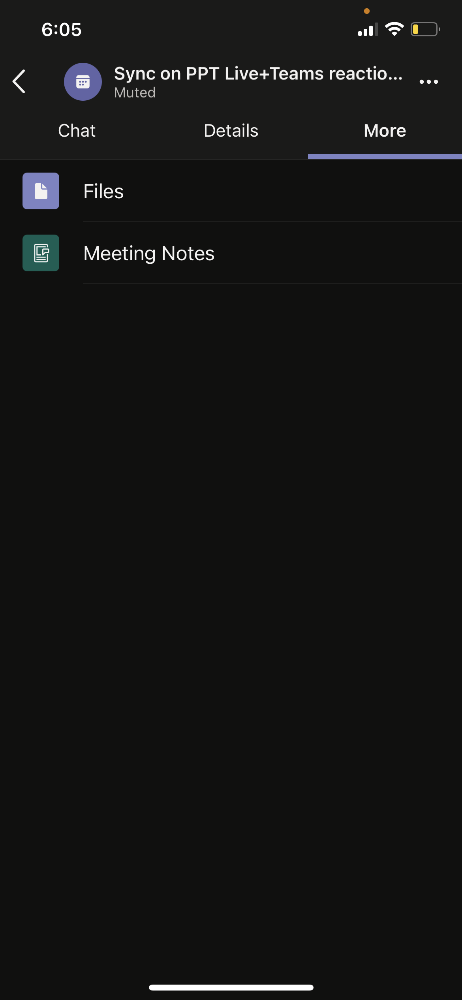

# Расширяемость приложения для собранийMeeting app extensibility

Teams приложения для собраний основана на следующих понятиях:Teams’ meeting app extensibility is based on the following concepts:

* Жизненный цикл собрания имеет различные этапы, такие как предварительное собрание, собрание и после собрания.Meeting lifecycle has different stages such as pre-meeting, in-meeting, and post-meeting.  
* В собрании присутствуют три различные роли участников: организатор, презент и участник.There are three distinct participant roles in a meeting: organizer, presenter, and attendee. Дополнительные сведения см. [в Teams собрания.](https://support.microsoft.com/office/roles-in-a-teams-meeting-c16fa7d0-1666-4dde-8686-0a0bfe16e019)For more information, see [roles in a Teams meeting](https://support.microsoft.com/office/roles-in-a-teams-meeting-c16fa7d0-1666-4dde-8686-0a0bfe16e019).  
* На собрании [существуют различные типы](/microsoftteams/non-standard-users#:~:text=An%20anonymous%20user%20is%20a,their%20Microsoft%20or%20organization's%20account.) пользователей: клиент, [гость,](/microsoftteams/guest-access) [федераированный и](/microsoftteams/manage-external-access)анонимный пользователь.There are various [user types](/microsoftteams/non-standard-users#:~:text=An%20anonymous%20user%20is%20a,their%20Microsoft%20or%20organization's%20account.) in a meeting: in-tenant, [guest](/microsoftteams/guest-access), [federated](/microsoftteams/manage-external-access), and anonymous users.

В этой статье освещаются сведения о жизненном цикле собраний и об интеграции вкладок, ботов и расширений обмена сообщениями на собрании.This article covers information about meeting lifecycle and how to integrate tabs, bots, and messaging extensions in the meeting. Он предоставляет сведения для определения различных ролей участников и различных типов пользователей для выполнения задач.It provides information to identify different participant roles and different user types to perform tasks.

## Жизненный цикл встречиMeeting lifecycle

Жизненный цикл собрания состоит из предварительного собрания, в собрании и после собрания.Meeting lifecycle consists of pre-meeting, in-meeting, and post-meeting app experience. На каждом этапе жизненного цикла собрания можно интегрировать вкладки, боты и расширения обмена сообщениями.You can integrate tabs, bots, and messaging extensions in each stage of the meeting lifecycle.

### Интеграция вкладок в жизненный цикл собранияIntegrate tabs into the meeting lifecycle

Вкладки позволяют членам группы получать доступ к службам и содержимому в определенном пространстве в собрании.Tabs allow team members to access services and content in a specific space within a meeting. Группа работает непосредственно со вкладками и беседы о средствах и данных, доступных в вкладке.The team works directly with tabs and has conversations about the tools and data available within tabs. В Teams собрания пользователи могут добавить вкладку, выбравIn Teams meeting, users can add a tab by selecting и выбор приложения, которое они хотят установить., and choosing the app that they want to install.

> [!IMPORTANT]
> Если вы интегрировали вкладку со своей встречей, ваше приложение должно следовать Teams единого потока проверки подлинности для [вкладок](../tabs/how-to/authentication/auth-aad-sso.md).If you have integrated a tab with your meeting, then your app must follow the Teams [single sign-on (SSO) authentication flow for tabs](../tabs/how-to/authentication/auth-aad-sso.md).

> [!NOTE]
> Приложения поддерживаются только на закрытых запланированных собраниях.Apps are supported in private scheduled meetings only.

#### Предварительная встреча с приложениемPre-meeting app experience

С помощью предварительного собрания приложения можно найти и добавить приложения для собраний и выполнить предсессию, например, разработать опрос для участников собрания.With the pre-meeting app experience, you can find and add meeting apps and perform pre-meeting tasks, such as developing a poll to survey meeting participants.

**Добавление вкладок к существующему собранию****To add tabs to an existing meeting**

1. В календаре выберите собрание, на которое нужно добавить вкладку.In your calendar, select a meeting to which you want to add a tab.
1. Выберите **вкладку Details** и выберитеSelect the **Details** tab and select .. Отображается галерея вкладок.The tab gallery appears.

    

1. В галерее вкладок выберите приложение, которое необходимо добавить, и выполните необходимые действия.In the tab gallery, select the app that you want to add and follow the steps as required. Приложение устанавливается в качестве вкладки.The app is installed as a tab.

    > [!NOTE]
    > * Вы также можете добавить вкладку с помощью вкладки **Чат** собрания в существующем собрании.You can also add a tab using the meeting **Chat** tab in an existing meeting.
    > * Макет вкладки должен быть в организованном состоянии, если имеется более десяти опросов или опросов.Tab layout must be in an organized state, if there are more than ten polls or surveys.

# [Классическая версияDesktop](#tab/desktop)

# [Мобильная версияMobile](#tab/mobile)

После того, как вкладки будут добавлены к существующему собранию на рабочем столе или в Интернете, вы можете увидеть те же приложения в предварительном собрании в разделе **Дополнительные** сведения о собрании.After the tabs are added to an existing meeting on desktop or web, you can see the same apps in pre-meeting experience under **More** section of the meeting details.

  

---

#### Опыт приложения на собранииIn-meeting app experience

С помощью приложения на собрании вы можете привлекать участников во время собрания с помощью приложений и диалоговое окно на собрании.With the in-meeting app experience, you can engage participants during the meeting by using apps and the in-meeting dialog box. Приложения для собраний находятся в верхней верхней панели окна собраний в качестве вкладки на собрании. Используйте диалоговое окно на собрании для демонстрации контента для участников собраний.Meeting apps are hosted in the top upper bar of the meeting window as an in-meeting tab. Use the in-meeting dialog box to showcase actionable content for meeting participants. Дополнительные сведения см. в [дополнительных сведениях о создании приложений для Teams собраний.](create-apps-for-teams-meetings.md)For more information, see [create apps for Teams meetings](create-apps-for-teams-meetings.md).

Для мобильных устройств приложения для собраний доступны из **>,** &#x25CF;&#x25CF;&#x25CF; на собрании.For mobile, meeting apps are available from **Apps** > ellipses &#x25CF;&#x25CF;&#x25CF; in the meeting. Выберите **Приложения** для просмотра всех приложений, доступных на собрании.Select **Apps** to view all the apps available in the meeting.

**Использование вкладок во время собрания****To use tabs during a meeting**

1. Перейдите в Teams.Go to Teams.
1. В календаре выберите собрание, на котором нужно использовать вкладку.In your calendar, select a meeting where you want to use a tab.
1. После ввода собрания из верхней верхней панели окна чата выберите необходимое приложение.After entering the meeting, from the top upper bar of the chat window, select the required app.
    Приложение отображается на собрании Teams панели или диалоговом окне на собрании.An app is visible in a Teams meeting in the side panel or the in-meeting dialog box.
1. В диалоговом окне на собрании введите ответ в качестве обратной связи.In the in-meeting dialog box, enter your response as a feedback.

# [Классическая версияDesktop](#tab/desktop)

# [Мобильная версияMobile](#tab/mobile)

После ввода собрания и добавления приложения с рабочего стола или веб-сайта приложение отображается в Teams собрании в разделе **Приложения.**After entering the meeting and adding the app from desktop or web, the app is visible in mobile Teams meeting under the **Apps** section. Выберите **Приложения,** чтобы показать список приложений.Select **Apps** to show the list of apps. Пользователь может запустить любое из приложений в качестве боковой панели приложения на собрании.User can launch any of the apps as an in-meeting side panel of the app.

Диалоговое окно на собрании отображается, где можно ввести ответ в качестве обратной связи.The in-meeting dialog box is displayed where you can enter your response as a feedback.

> [!NOTE]
> Чтобы приложения работали на мобильных устройствах, не нужно менять манифест приложения.You need not change the app manifest for the apps to work on mobile.

---

> [!NOTE]
> * Приложения могут использовать Teams клиентской SDK для доступа к `meetingId` , и отрисовки `userMri` опыта `frameContext` надлежащим образом.Apps can leverage the Teams Client SDK to access the `meetingId`, `userMri`, and `frameContext` to render the experience appropriately.
> * Если диалоговое окно на собрании успешно отрисовка, вы получите уведомление об успешной загрузке результатов.If the in-meeting dialog box is rendered successfully, you will get a notification that the results are successfully downloaded.
> * Манифест приложения указывает места, которые вы хотите, чтобы они появились.Your app manifest specifies the places that you want them to appear. Для этого используется поле контекста.The context field is used for this purpose. Он также является частью работы с share-tray с учетом указанных рекомендаций по проектированию.It is also the part of a share-tray experience, subject to specified design guidelines.

На следующем изображении иллюстрируется боковая панель на собрании:The following image illustrates the in-meeting side panel:

В следующей таблице описывается поведение приложения, если оно утверждено и не утверждено:The following table describes the behavior of app when it is approved and not approved:

|Возможности приложенияApp capability | Приложение утвержденоApp is approved | Приложение не утвержденоApp is not approved |
|---|---|---|
| Размязаемость собранияMeeting extensibility | Приложение будет отображаться на собраниях.The app will appear in meetings. | Приложение не будет отображаться на собраниях для мобильных клиентов.The app will not appear in meetings for the mobile clients. |

#### Опыт приложения после собранияPost-meeting app experience

С помощью приложения после собрания можно просмотреть результаты собрания, такие как результаты опроса или отзывы.With post-meeting app experience, you can view the results of the meeting, such as poll survey results or feedback. ВыборSelect  чтобы добавить вкладку, получить заметки о собраниях и результаты, по которым организаторы и участники должны принять меры.to add a tab, get meeting notes, and results on which organizers and attendees must take action.

На следующем изображении отображается вкладка **Contoso** с результатами опроса и отзывами, полученными от участников собрания:The following image displays the **Contoso** tab with results of poll and feedback received from meeting attendees:

# [Классическая версияDesktop](#tab/desktop)

# [Мобильная версияMobile](#tab/mobile)

---

> [!NOTE]
> Макет вкладки должен быть организован при более чем 10 опросах или опросах.Tab layout must be organized when there are more than 10 polls or surveys.

### Интеграция ботов в жизненный цикл собранияIntegrate bots into the meeting lifecycle

Боты, включенные в область группового чата, начинают работать на собраниях.Bots enabled in groupchat scope start functioning in meetings. Чтобы реализовать боты, сначала [создайте бот,](../build-your-first-app/build-bot.md) а затем создайте приложения [для Teams собраний.](../apps-in-teams-meetings/create-apps-for-teams-meetings.md#meeting-apps-api-references)To implement bots, start with [build a bot](../build-your-first-app/build-bot.md) and then continue with [create apps for Teams meetings](../apps-in-teams-meetings/create-apps-for-teams-meetings.md#meeting-apps-api-references).

### Интеграция расширений обмена сообщениями в жизненный цикл собранияIntegrate messaging extensions into the meeting lifecycle

Чтобы реализовать расширения обмена сообщениями, сначала создайте расширение обмена сообщениями, а затем создайте приложения для Teams [собраний.](../apps-in-teams-meetings/create-apps-for-teams-meetings.md#meeting-apps-api-references) To implement messaging extensions, start with [build a messaging extension](../messaging-extensions/how-to/create-messaging-extension.md) and then continue with [create apps for Teams meetings](../apps-in-teams-meetings/create-apps-for-teams-meetings.md#meeting-apps-api-references).

Возможность Teams приложения для собраний позволяет разработать приложение на основе ролей участников собрания.The Teams meeting app extensibility allows you to design your app based on participant roles in a meeting.

## Роли участников собранияParticipant roles in a meeting

Параметры участников по умолчанию определяются ИТ-администратором организации.Default participant settings are determined by an organization's IT administrator. Ниже следующую роль участника собрания:The following are the participant roles in a meeting:

* **Организатор.** Организатор назначает собрание, задает параметры собрания, назначает роли собраний и начинает собрание.**Organizer**: The organizer schedules a meeting, sets the meeting options, assigns meeting roles, and starts the meeting. Только пользователи с учетной записью M365 и Teams лицензией могут быть организаторами и управлять разрешениями участников.Only users with M365 account and Teams license can be organizers, and control attendee permissions. Организатор собрания может изменить параметры для определенного собрания.A meeting organizer can change the settings for a specific meeting. Организаторы могут вносить эти изменения на веб-странице **Параметры** собрания.Organizers can make these changes on the **Meeting options** web page.
* **Presenter**: Presenters have same capabilities of organisers with exclusions.**Presenter**: Presenters have same capabilities of organizers with exclusions. Презентер не может удалить организатора из сеанса или изменить параметры собрания для сеанса.A presenter cannot remove an organizer from the session or modify meeting options for the session. По умолчанию участники, присоединяясь к собранию, имеют роль презента.By default, participants joining a meeting have the presenter role.
* **Участник.** Участник — это пользователь, которому было предложено принять участие в собрании, но не уполномочено выступать в качестве презентера.**Attendee**: An attendee is a user who has been invited to attend a meeting but is not authorized to act as a presenter. Участники могут взаимодействовать с другими участниками собрания, но не могут управлять любыми из параметров собрания или делиться содержимым.Attendees can interact with other meeting members but cannot manage any of the meeting settings or share content.

> [!NOTE]
> Только организатор или презент может добавлять, удалять или удалять приложения.Only an organizer or presenter can add, remove, or uninstall apps.

Дополнительные сведения см. [в Teams собрания.](https://support.microsoft.com/office/roles-in-a-teams-meeting-c16fa7d0-1666-4dde-8686-0a0bfe16e019)For more information, see [roles in a Teams meeting](https://support.microsoft.com/office/roles-in-a-teams-meeting-c16fa7d0-1666-4dde-8686-0a0bfe16e019).

После разработки приложения на основе ролей участников собрания можно определить тип каждого пользователя для собраний и выбрать, к чему он может получить доступ.After you design your app based on participant roles in a meeting, you can identify each user type for meetings and select what they can access.

## Типы пользователей на собранииUser types in a meeting

> [!NOTE]
> Тип пользователя не входит в **API getParticipantRole.**The user type is not included in the **getParticipantRole** API.

Типы пользователей, такие как, организатор, презент или участник собрания, могут выполнять одну из ролей участника [собрания.](#participant-roles-in-a-meeting)User types, such as, organizer, presenter, or attendee in a meeting can perform one of the [participant roles in a meeting](#participant-roles-in-a-meeting).

В следующем списке подробно по-разному типы пользователей, а также их доступность и производительность:The following list details the different user types along with their accessibility and performance:

* **In-tenant.** Пользователи-клиенты принадлежат к организации и имеют учетные данные в Azure Active Directory (AAD) для клиента.**In-tenant**: In-tenant users belong to the organization and have credentials in Azure Active Directory (AAD) for the tenant. Обычно это сотрудники, работающие полный рабочий день, на месте или удаленные сотрудники.They are usually full-time, onsite, or remote employees. Пользователь, наемный клиент, может быть организатором, презентером или посетителем.An in-tenant user can be an organizer, presenter, or attendee.
* **Гость.** Гость — это участник из другой организации, Teams доступ к ресурсам или другим ресурсам в клиенте организации.**Guest**: A guest is a participant from another organization invited to access Teams or other resources in the organization's tenant. Гости добавляются в AAD организации и имеют те же Teams, что и родной член команды с доступом к чатым, собраниям и файлам группы.Guests are added to the organization’s AAD and have same Teams capabilities as a native team member with access to team chats, meetings, and files. Гостевой пользователь может быть организатором, презентером или посетителем.A guest user can be an organizer, presenter, or attendee. Дополнительные сведения см. в [гостевом доступе в Teams.](/microsoftteams/guest-access)For more information, see [guest access in Teams](/microsoftteams/guest-access).
* **Федераированный** или внешний. Федераированный пользователь — это внешний Teams в другой организации, которому было предложено присоединиться к собранию.**Federated or external**: A federated user is an external Teams user in another organization who has been invited to join a meeting. Федераированные пользователи имеют действительные учетные данные с федерательными партнерами и уполномочены Teams.Federated users have valid credentials with federated partners and are authorized by Teams. Они не имеют доступа к вашим командам или другим общим ресурсам из вашей организации.They do not have access to your teams or other shared resources from your organization. Гостевой доступ является лучшим вариантом для внешних пользователей, чтобы иметь доступ к группам и каналам.Guest access is a better option for external users to have access to teams and channels. Дополнительные сведения см. в дополнительных сведениях об управлении внешним [доступом в Teams.](/microsoftteams/manage-external-access)For more information, see [manage external access in Teams](/microsoftteams/manage-external-access).

    > [!NOTE]
    > Ваши Teams могут добавлять приложения при организации собраний или чатов с другими организациями.Your Teams users can add apps when they host meetings or chats with other organizations. Пользователи могут использовать приложения, общие внешним пользователям, когда пользователи присоединяются к собраниям или чатам, которые организованы другими организациями.The users can use apps shared by external users when your users join meetings or chats hosted by other organizations. Будут действовать политики данных организации хостинг-пользователя, а также методы обмена данными сторонних приложений, совместно с организацией этого пользователя.The data policies of the hosting user's organization, as well as the data sharing practices of the third-party apps shared by that user's organization, will be in effect.

* **Анонимные.** Анонимные пользователи не имеют удостоверения AAD и не федератированы с клиентом.**Anonymous**: Anonymous users do not have an AAD identity and are not federated with a tenant. Анонимные участники похожи на внешних пользователей, но их удостоверение не запроектировали на собрании.The anonymous participants are like external users, but their identity is not projected in the meeting. Анонимные пользователи не могут получить доступ к приложениям в окне собраний.Anonymous users are not able to access apps in a meeting window. Анонимный пользователь не может быть организатором, но может быть презентером или посетителем.An anonymous user cannot be an organizer but can be a presenter or attendee.

    > [!NOTE]
    > Анонимные пользователи наследуют глобальную политику разрешений на использование приложений на уровне пользователя по умолчанию.Anonymous users inherit the global default user-level app permission policy. Дополнительные сведения см. в [веб-сведениях управление приложениями.](/microsoftteams/non-standard-users#anonymous-user-in-meetings-access)For more information, see [manage Apps](/microsoftteams/non-standard-users#anonymous-user-in-meetings-access).

Гость или анонимный пользователь не может добавлять, удалять или удалять приложения.A guest or anonymous user cannot add, remove, or uninstall apps.

В следующей таблице представлены типы пользователей и к каким функциям каждый пользователь может получить доступ:The following table provides the user types and what features each user can access:

| Тип пользователяUser type | ВкладкиTabs | боты;Bots | расширения для обмена сообщениями;Messaging extensions | Адаптивные карточкиAdaptive Cards | Модули задачTask modules | Диалоговое окно собранияIn-meeting dialog |
| :-- | :-- | :-- | :-- | :-- | :-- | :-- |
| Анонимный пользовательAnonymous user | НедоступноNot available | НедоступноNot available | НедоступноNot available | Разрешено взаимодействие в чате собраний.Interactions in the meeting chat are allowed. | Разрешены взаимодействия в чате собраний с адаптивной карты.Interactions in the meeting chat from an Adaptive Card are allowed. | НедоступноNot available |
| Гость, который является частью AAD клиентаGuest that is part of the tenant AAD | Взаимодействие разрешено.Interaction is allowed. Создание, обновление и удаление запрещены.Creating, updating, and deleting are not allowed. | НедоступноNot available | НедоступноNot available | Разрешено взаимодействие в чате собраний.Interactions in the meeting chat are allowed. | Разрешены взаимодействия в чате собраний с адаптивной карты.Interactions in the meeting chat from an Adaptive Card are allowed. | AvailableAvailable |
| Федераированный пользователь.Federated user. Дополнительные сведения см. в [нестандартных пользователях.](/microsoftteams/non-standard-users)For more information, see [non-standard users](/microsoftteams/non-standard-users). | Взаимодействие разрешено.Interaction is allowed. Создание, обновление и удаление запрещены.Creating, updating, and deleting are not allowed. | Взаимодействие разрешено.Interaction is allowed. Приобретение, обновление и удаление не допускаются.Acquiring, updating, and deleting are not allowed. | НедоступноNot available | Разрешено взаимодействие в чате собраний.Interactions in the meeting chat are allowed. | Разрешены взаимодействия в чате собраний с адаптивной карты.Interactions in the meeting chat from an Adaptive Card are allowed. | НедоступноNot available |

## См. такжеSee also

* [TabTab](../tabs/what-are-tabs.md#understand-how-tabs-work)
* [BotBot](../bots/what-are-bots.md)
* [Расширение для обмена сообщениямиMessaging extension](../messaging-extensions/what-are-messaging-extensions.md)
* [Создание приложенияDesign your app](../apps-in-teams-meetings/design/designing-apps-in-meetings.md)

## Следующий этапNext step

> [!div class="nextstepaction"]
> [Необходимые условия и ссылки на API для приложений в собраниях TeamsPrerequisites and API references for apps in Teams meetings](create-apps-for-teams-meetings.md)