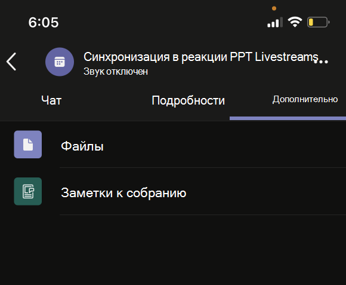

# Приложения объединенных собраний

Teams унифицированных собраний основаны на следующих понятиях:

* Жизненный цикл собрания состоит из нескольких этапов: перед собранием, во время собрания и после собрания.  
* На собрании существуют три различные роли: организатор, докладчик и участник. Дополнительные сведения см. в статье [Роли в собраниях Teams](https://support.microsoft.com/office/roles-in-a-teams-meeting-c16fa7d0-1666-4dde-8686-0a0bfe16e019).  
* На [собрании есть](/microsoftteams/non-standard-users#:~:text=An%20anonymous%20user%20is%20a,their%20Microsoft%20or%20organization's%20account.) различные типы пользователей: пользователи в клиенте, [гостевые](/microsoftteams/guest-access), [федеративные](/microsoftteams/manage-external-access) и анонимные пользователи.

В этой статье рассматриваются сведения о жизненном цикле собраний и интеграции вкладок, ботов и расширений сообщений. Он определяет различные роли участников и типы пользователей.

## Жизненный цикл собрания

Жизненный цикл собрания состоит из взаимодействия с приложением перед собранием, во время собрания и после собрания. На каждом этапе жизненного цикла собрания можно добавлять вкладки, боты и расширения для обмена сообщениями.

> [!NOTE]
> Расширения собраний, такие как боты, карточки, расширения сообщений и действия с сообщениями, поддерживаются в веб-клиенте. Однако в настоящее время размещенные функции, такие как вкладки, пузырьки содержимого и общий доступ, в настоящее время не полностью поддерживаются.

### Интеграция вкладок в жизненный цикл собрания

Вкладки позволяют участникам группы получать доступ к службам и контенту в определенном пространстве на собрании. Группа работает непосредственно с вкладками и обсуждает инструменты и данные, доступных на вкладках. В Teams можно добавить вкладку, выбрав и выберите приложение, которое требуется установить.

> [!IMPORTANT]
> Если вы интегрировали вкладку с собранием, ваше приложение должно следовать Teams проверки подлинности единого входа для [вкладок](../tabs/how-to/authentication/tab-sso-overview.md).

> [!NOTE]
>
> * Частные запланированные собрания поддерживают только приложения.
> * Параметр добавления приложения для Teams расширения собрания не поддерживается в Teams веб-клиенте.

#### Взаимодействие с приложением перед собранием

Благодаря взаимодействию с приложением перед собранием можно найти и добавить приложения для собраний. Вы также можете выполнять задачи перед собранием, например, разработать опрос для анкетирования участников собрания.

Чтобы добавить вкладки к существующему собранию:

1. В календаре выберите собрание, для которого нужно добавить вкладку.
1. Выберите вкладку **Сведения** и нажмите . Появится галерея вкладок.

    :::image type="content" source="~/assets/images/apps-in-meetings/Pre-Meeting-002.png" alt-text="Взаимодействие с приложением перед собранием":::

1. В коллекции вкладок выберите приложение, которое вы хотите добавить, и выполните необходимые действия. Приложение устанавливается как вкладка.

   > [!NOTE]
   >
   > * Вы также можете добавить вкладку к существующему собранию с помощью вкладки **"Чат** собрания".
   > * Макет вкладки должен находиться в упорядоченной структуре, если имеется более 10 опросов или опросов.

# [Компьютер](#tab/desktop)

:::image type="content" source="~/assets/images/apps-in-meetings/PreMeetingTab.png" alt-text="Вкладки во время собрания":::

# [Мобильные устройства](#tab/mobile)

После добавления вкладок к существующему собранию на мобильном устройстве вы можете увидеть те же приложения в режиме предварительного собрания в разделе "Дополнительные сведения о собрании".

  

---

#### Взаимодействие с приложением во время собрания

Благодаря взаимодействию с приложением во время собрания вы можете привлекать участников во время собрания с помощью приложений и диалогового окна на собрании. Приложения для собраний располагаются на панели инструментов окна собрания в виде вкладки во время собрания. Используйте диалоговое окно во время собрания для демонстрации полезного контента участникам собрания. Дополнительные сведения см. в статье "Включение и настройка приложений [для Teams собраний"](enable-and-configure-your-app-for-teams-meetings.md).

Для мобильных устройств приложения для собраний доступны в приложениях **>** многоточие &#x25CF;&#x25CF;&#x25CF; на собрании. Выберите **"** Приложения", чтобы просмотреть все приложения, доступные на собрании.

Чтобы использовать вкладки во время собрания, выполните следующие действия.

1. Перейдите к Teams.
1. В календаре выберите собрание, в котором вы хотите использовать вкладку.
1. После входа в собрание на панели инструментов окна чата выберите необходимое приложение.
    Приложение отображается в собрании Teams на боковой панели или в диалоговом окне собрания.
1. В диалоговом окне собрания введите свой ответ в качестве отзыва.

# [Компьютер](#tab/desktop)

:::image type="content" source="~/assets/images/apps-in-meetings/desktop-in-meeting-dialog-view.png" alt-text="Представление рабочего стола":::

# [Мобильные устройства](#tab/mobile)

После входа в собрание и добавления приложения с рабочего стола или из Интернета приложение отображается на мобильном Teams собрании в разделе **"Приложения**". Выберите **"Приложения** ", чтобы отобразить список приложений. Пользователь может запускать любое из приложений в качестве боковой панели приложения на собрании.

Отобразится диалоговое окно собрания, в котором вы можете ввести свой ответ в качестве отзыва.

> [!NOTE]
> Вам не нужно изменять манифест приложения для работы на мобильных устройствах.

---

> [!NOTE]
>
> * Приложения могут использовать Teams клиентского пакета SDK `meetingId``userMri``frameContext` для доступа к интерфейсу и отрисовки соответствующего интерфейса.
> * Если диалоговое окно "Собрание" успешно отображается, оно отправляет уведомление об успешной загрузке результатов.
> * Манифест приложения указывает места, в которых должны отображаться приложения. Это можно сделать, указав поле контекста в манифесте. Он также является частью общего взаимодействия на этапе собрания с учетом указанных рекомендаций [по проектированию](~\apps-in-teams-meetings\design\designing-apps-in-meetings.md).
> * Этап собрания не поддерживается для анонимных пользователей и Teams веб-клиента.

На следующем рисунке показана панель на стороне собрания:

# [Компьютер](#tab/desktop)

# [Мобильные устройства](#tab/mobile)

---

В следующей таблице описывается поведение приложения, когда оно проверяется и не проверяется:

|Возможности приложения | Приложение проверено | Приложение не проверено |
|---|---|---|
| Расширяемость собраний | Приложение будет отображаться на собраниях. | Приложение не будет отображаться на собраниях для мобильных клиентов. |

Дополнительные сведения см [. в рекомендациях по проверке хранилища](../concepts/deploy-and-publish/appsource/prepare/teams-store-validation-guidelines.md).

#### Взаимодействие с приложением после собрания

С помощью приложения после собрания вы можете просматривать результаты собрания, такие как результаты опроса или отзывы. Выбор  для добавления вкладки, получения заметок к собранию и просмотра результатов, по которым организаторы и участники должны принять меры.

На следующем рисунке показана **вкладка Contoso** с результатами опроса и отзывами, полученными от участников собрания:

# [Компьютер](#tab/desktop)

:::image type="content" source="~/assets/images/apps-in-meetings/post.png" alt-text="Вкладка Contoso с результатами":::

# [Мобильные устройства](#tab/mobile)

:::image type="content" source="~/assets/images/apps-in-meetings/mobilepremeeting.png" alt-text="Взаимодействие с приложением после собрания":::

---

> [!NOTE]
> Макет табуляции должен быть упорядочен при наличии более 10 опросов или опросов.

### Интеграция ботов в жизненный цикл собрания

Боты, включенные в области группового чата, начинают работать на собраниях. Чтобы реализовать боты, начните с [создания бота](../build-your-first-app/build-bot.md), а затем создайте приложения [для Teams собраний](../apps-in-teams-meetings/API-references.md#meeting-apps-api-references).

### Интеграция расширений сообщений в жизненный цикл собрания

Чтобы реализовать расширение сообщения, [начните с создания](../messaging-extensions/how-to/create-messaging-extension.md) расширения сообщений, а затем создайте приложения для Teams [собраний](../apps-in-teams-meetings/API-references.md#meeting-apps-api-references).

Приложения Teams унифицированных собраний позволяют проектировать приложение на основе ролей участников собрания.

## Роли участников собрания

:::image type="content" source="~/assets/images/apps-in-meetings/participant-roles.png" alt-text="Роли участников собрания":::

Параметры участника по умолчанию определяются ИТ-администратором организации. Ниже перечислены роли участников собрания:

* **Организатор**: организатор планирует собрание, задает параметры собрания, назначает роли собрания и запускает собрание. Пользователи с Microsoft 365 учетной записью и Teams лицензией могут быть только организаторами и управлять разрешениями участников. Организатор собрания может изменить параметры для определенного собрания. Организаторы могут внести эти изменения на веб-странице **параметров** собрания.

* **Выступающий**: выступающие имеют те же возможности организаторов с исключениями. Выступающий не может удалить организатора из сеанса или изменить параметры собрания для сеанса. По умолчанию участники, присоединяемые к собранию, имеют роль докладчика.

* **Участник**: участник — это пользователь, приглашенный для участия в собрании. Участники имеют ограниченные возможности во время собрания, такие как:
  * Они могут взаимодействовать с другими участниками собрания, но не могут управлять параметрами собрания или предоставлять общий доступ к содержимому.  
  * Они могут просматривать и взаимодействовать с приложением вкладки на этапе собрания в Teams клиенте без установки приложения или без каких-либо прав приложения. Они не могут просматривать приложение на этапе собрания или взаимодействовать с ним в Teams веб-клиенте.
  * Они не могут просматривать и взаимодействовать с приложением на боковой панели без каких-либо прав приложения.
  * Они не могут выступать в качестве выступающих.
  * Если участник присоединяется как анонимный пользователь, он не может просматривать приложение табуляции и взаимодействовать с ним на этапе собрания Teams веб-клиентах и настольных компьютерах.

> [!NOTE]
> Только организатор или выступающий может добавлять, удалять или удалять приложения.

Дополнительные сведения см. в статье [Роли в собраниях Teams](https://support.microsoft.com/office/roles-in-a-teams-meeting-c16fa7d0-1666-4dde-8686-0a0bfe16e019).

После разработки приложения на основе ролей участников собрания вы можете определить каждый тип пользователя для собраний и выбрать, к каков он может получить доступ.

## Типы пользователей на собрании

Типы пользователей, такие как организатор, выступающий или участник собрания, могут выполнять одну из ролей участников [собрания](#participant-roles-in-a-meeting).

> [!NOTE]
> Тип пользователя не включен в **API getParticipantRole** .

В следующем списке подробно описаны различные типы пользователей, а также их специальные возможности и производительность.

* **В клиенте**: пользователи в клиенте принадлежат к организации и имеют учетные данные в Microsoft Azure Active Directory (Azure AD) для клиента. Это сотрудники, работающие на месте, на месте или удаленные сотрудники. Пользователь в клиенте может быть организатором, выступающим или участником.
* **Гость**: гость — это участник из другой организации, приглашенный для доступа Teams другим ресурсам в клиенте организации. Гости добавляются в службу поддержки Azure AD и имеют те же Teams, что и участники собственной команды. У них есть доступ к чатам, собраниям и файлам группы. Гость может быть организатором, выступающим или участником. Дополнительные сведения см[. в статье о гостевом доступе Teams](/microsoftteams/guest-access).
* **Федеративный или внешний**: федеративный пользователь является внешним Teams в другой организации, которому было предложено присоединиться к собранию. Федеративные пользователи имеют действительные учетные данные у федеративных партнеров и авторизируются Teams. У них нет доступа к вашим командам или другим общим ресурсам из вашей организации. Гостевой доступ — это лучший вариант для доступа внешних пользователей к командам и каналам. Дополнительные сведения см. в [статье об управлении внешним доступом в Teams](/microsoftteams/manage-external-access).

    > [!NOTE]
    > Ваши Teams могут добавлять приложения при размещении собраний или чатов с другими организациями. Пользователи могут использовать приложения, которыми поделились внешние пользователи, когда пользователи присоединяются к собраниям или чатам, размещенным в других организациях. Будут действовать политики данных организации размещенного пользователя, а также методы совместного использования данных сторонних приложений, совместно используемых организацией этого пользователя.

    > [!IMPORTANT]
    > Сейчас сторонние приложения доступны в облаке государственного сообщества (GCC), но недоступны для GCC-High и Министерства обороны (DOD). Сторонние приложения для GCC по умолчанию отключены. Чтобы включить сторонние приложения для GCC, см. раздел [Управление политиками разрешений приложений](/microsoftteams/teams-app-permission-policies) и [Управление приложениями](/microsoftteams/manage-apps).

* **Анонимный**: анонимные пользователи не имеют удостоверения Azure AD и не являются федеративными с клиентом. Анонимные участники являются внешними пользователями, но их удостоверение не отображается на собрании. Анонимные пользователи не могут получить доступ к приложениям в окне собрания и на этапе собрания. Анонимный пользователь не может быть организатором, но может быть выступающим или участником.

    > [!NOTE]
    > Анонимные пользователи наследуют глобальную политику разрешений приложения на уровне пользователя по умолчанию. Дополнительные сведения см. в разделе ["Управление приложениями"](/microsoftteams/non-standard-users#anonymous-user-in-meetings-access).

Гостевой или анонимный пользователь не может добавлять, удалять или удалять приложения.

В следующей таблице перечислены типы пользователей и перечислены функции, к которые может получить доступ каждый пользователь:

| Тип пользователя | Вкладки | боты; | Расширения для сообщений | Адаптивные карточки | Модули задач | Диалоговое окно собрания | Сцена собрания |
| :-- | :-- | :-- | :-- | :-- | :-- | :-- | :-- |
| Анонимный пользователь | Недоступно | Недоступно | Недоступно | Взаимодействие в чате собрания разрешено. | Взаимодействие в чате собрания из адаптивной карточки разрешено. | Недоступно | Недоступно |
| Гость, часть клиентского Azure AD | Взаимодействие разрешено. Создание, обновление и удаление не разрешены. | Недоступно | Недоступно | Взаимодействие в чате собрания разрешено. | Взаимодействие в чате собрания из адаптивной карточки разрешено. | Available | Может запускать, просматривать и взаимодействовать с приложением на этапе собрания только на Teams настольном клиенте |
| Федеративные пользователи. Дополнительные сведения см. в статье о [нестандартных пользователях](/microsoftteams/non-standard-users). | Взаимодействие разрешено. Создание, обновление и удаление не разрешены. | Взаимодействие разрешено. Приобретение, обновление и удаление не разрешены. | Недоступно | Взаимодействие в чате собрания разрешено. | Взаимодействие в чате собрания из адаптивной карточки разрешено. | Недоступно | Может запускать, просматривать и взаимодействовать с приложением на этапе собрания только на Teams настольном клиенте. |

## Следующее действие

> [!div class="nextstepaction"]
> [Включение и настройка приложений для собраний Teams](enable-and-configure-your-app-for-teams-meetings.md)

## См. также

* [Вкладка](../tabs/what-are-tabs.md#understand-how-tabs-work)
* [Бот](../bots/what-are-bots.md)
* [Расширение для обмена сообщениями](../messaging-extensions/what-are-messaging-extensions.md)
* [Создание приложения](../apps-in-teams-meetings/design/designing-apps-in-meetings.md)
