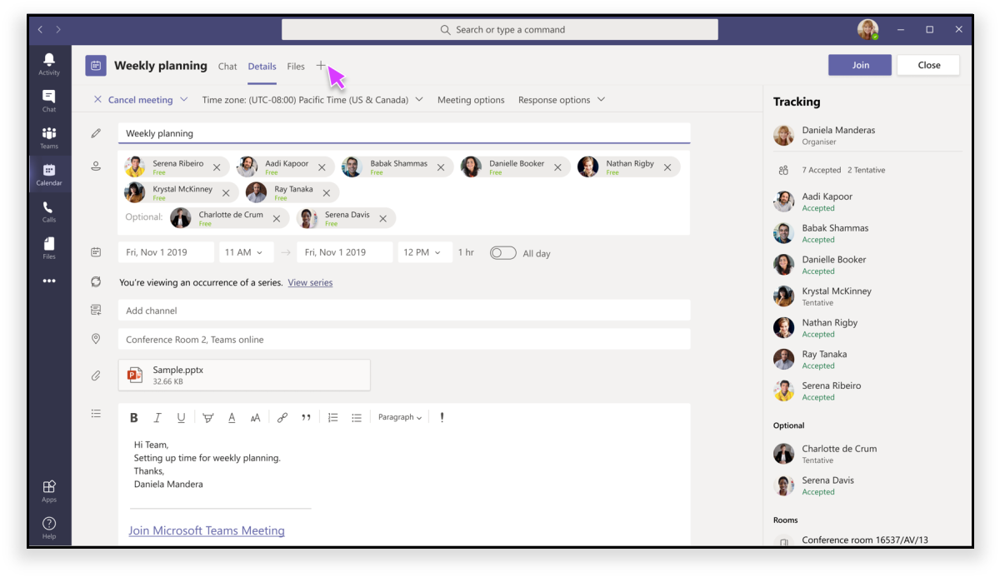

# Приложения в собраниях Teams

Собрания являются ключевыми для повышения производительности в Teams. Они обеспечивают совместную работу, партнерство, информационное общение и общие отзывы на инклюзивном и активном форуме. Как разработчик вы можете создавать настраиваемые приложения  вкладок, ботов и расширений сообщений, чтобы улучшить и улучшить возможности собраний Teams.  Пользователи собраний могут получать доступ к приложениям через галерею вкладок, чтобы включить соответствующие сценарии, такие как предварительная постановка доски Канбрана, запуск диалога с действиями в собрании или создание опроса после собрания. Ваше приложение для собраний может предоставлять пользователю интерфейс для каждого этапа жизненного цикла собрания в зависимости от состояния участника.

В центре возможностей приложения для собраний Teams три понятия:

✔ собрания **—** до, во время и после собрания.  
✔ **участника** — организатор собрания, участник или участник.  
✔ пользователя **—** в клиенте, гостевом, федераированном или анонимном пользователе Teams.

<!-- markdownlint-disable MD001 -->
### Сценарии жизненного цикла собраний

## Вкладки

> [!IMPORTANT]
> Как и для всех приложений вкладок, вашему приложению необходимо следовать потоку проверки подлинности с помощью [SSO](../tabs/how-to/authentication/auth-aad-sso.md) Teams для вкладок.

> [!NOTE]
> Мобильные клиенты поддерживают вкладки только на поверхностях до и после собрания. The In-meeting experiences (in-meeting dialog and panel) on mobile will be available soon

### Предварительная встреча в приложении

**Предварительные собрания:**

**Вкладка "До собрания":**

✔ пользователи с разрешениями могут добавлять приложения на собрание через галерею вкладок двумя способами:

&emsp;&emsp;&#9679; на **вкладке "Сведения"** формы планирования Teams.

&emsp;&emsp;&#9679; на вкладке **"Чат** собрания" в существующем собрании.   

✔ tab доступны на страницах сведений  о  собраниях и чатах с помощью кнопки "плюс" (➕).|

✔ табули должны быть в уорганизованном состоянии при более чем десяти опросах или опросах.

### Приложение для собраний

✔ собрания будут работать в верхней верхней панели окна чата и в качестве вкладки "Собрание" на вкладке "Собрание". Когда пользователи добавляют вкладку на собрание через галерею вкладок, будут доступны приложения, которые находятся во время собраний. 

✔ пользователи с разрешениями могут добавлять приложения во время собрания.

✔ При загрузке в контексте собрания приложения смогут использовать клиентский SDK Teams для доступа к , и для правильной отрисовки `meetingId` `userMri` `frameContext` работы.

✔ экспорт результатов опроса или опросов должен уведомить пользователей о том, что результаты успешно загружены.

✔ Чтобы приложение было видно на собрании Teams в двух областях:

&emsp;&emsp;&#9679; **боковой панели.**  

> [!NOTE]
> Если манифест _вашего приложения_ указывает, что вкладка оптимизирована для боковой [панели,](create-apps-for-teams-meetings.md#during-a-meeting)в которой она будет отображаться. Она также может быть частью работы с совместной работы с учетом указанных рекомендаций по проектированию.

&emsp;&emsp;&#9679; **собрания.** Используйте диалоговое окно собрания для демонстрации действия содержимого для участников собрания. *См.* ["Создание приложений для собраний Teams".](create-apps-for-teams-meetings.md)

**В собрании:**

**Диалоговое окно с действиями при собрании для пользователей:**

### Приложение после собрания

**После собрания:**

✔ сценарий приложения после собрания схож с текущим опытом после собрания с дополнительным преимуществом на наличие вкладок, существующих на поверхности. 

✔ пользователи с разрешениями могут добавлять приложения из коллекции  вкладок на собрание с помощью вкладки "Сведения" формы планирования Teams и вкладки **"Чат"** в существующем собрании.

✔ табули должны быть в уорганизованном состоянии при более чем десяти опросах или опросах.

### Боты

Для реализации ботов см. документацию по [собраниям Teams с нашими ботами.](../bots/how-to/create-a-bot-for-teams.md#bots-in-teams-meetings)

### Расширения для сообщений

О реализации расширения обмена сообщениями см. в документации по собраниям [Teams.](../messaging-extensions/how-to/create-messaging-extension.md#messaging-extensions-in-teams-meetings)

## Роли участников и типы пользователей в собрании

### Роли участников

Вы можете разработать приложение с авторизацией, относяцией к конкретному участнику. Например, опрос на собраниях может создавать только организатор и/или presenter. Хотя параметры участников по умолчанию определяются ИТ-администратором организации, организатору собрания может потребоваться изменить параметры конкретного собрания. Организаторы могут внести эти изменения на веб-странице параметров собрания.

1. **Организатор .** Организатор создает расписание собрания, задает параметры собрания, назначает роли собраний и начинает собрание. Организаторами и разрешениями участников могут быть только пользователи с учетной записью M365 (обладая лицензией Teams).
1. **Presenter**. У presenters практически такие же возможности, как у организатора; тем не менее, он не может удалить организатора из сеанса или изменить параметры собрания для сеанса. По умолчанию участники, присоединяясь к собранию, имеют роль участника.
1. **Участник**. Участник — это пользователь, приглашенный на собрание, но не уполномоченный выступать в качестве участника. Участники могут взаимодействовать с другими участниками собрания, но не могут управлять любыми из параметров собрания или делиться содержимым.

_См._ [ **роли в собрании Teams**](https://support.microsoft.com/office/roles-in-a-teams-meeting-c16fa7d0-1666-4dde-8686-0a0bfe16e019)

Доступ к странице  **параметров собрания** можно получить следующим образом:

&#11200; в Teams перейдите  к логотипу календаря, выберите собрание, а затем  **параметры собрания.**

&#11200; в приглашении на собрание выберите **параметры собрания.**

&#11200; во время собрания выберите **"Показать** участников" и "Показать  элементе управления собрания. Затем над списком участников выберите **"Управление разрешениями".**

### Типы пользователей.

> [!NOTE]
> Типы пользователей могут присоединяться к собраниям и принимать на себя одну из ролей участников, описанных выше. Тип пользователя не является частью API **getParticipantRole.**

1. **В клиенте**. Эти пользователи принадлежат к организации и имеют учетные данные в Azure Active Directory для клиента. Обычно это сотрудники, работающие на месте или удаленные сотрудники.
1. **Гость.** Гость — это участник из другой организации, приглашенный на доступ к Teams или другим ресурсам в клиенте вашей организации. Гости добавляются в Active Directory вашей организации и могут получить практически все возможности Teams, что и участник команды с полным доступом к чатам, собраниям и файлам команды. _См._ [гостевой доступ в Microsoft Teams](/microsoftteams/guest-access)
1. **Federated/External**. Федераированный пользователь — это внешний пользователь Teams в другой организации, приглашенный к собранию. Так как эти пользователи имеют действительные учетные данные с федерательными партнерами, они рассматриваются как авторизации в Teams, но не имеют доступа к вашим командам или другим общим ресурсам из вашей организации. Если вы хотите, чтобы внешние пользователи могли получать доступ к командам и каналам, лучше использовать гостевой доступ. _См._ ["Управление внешним доступом в Microsoft Teams"](/microsoftteams/manage-external-access)
1. **Анонимный .** Анонимные пользователи не имеют удостоверения Active Directory и не являются федератными с клиентом. Анонимный участник похож на внешнего пользователя, но его удостоверение не проецируемых в собрание. Анонимные пользователи не смогут получить доступ к приложениям в окне собрания.

## Дальнейшие действия

> [!div class="nextstepaction"]
> [Создание приложения](create-apps-for-teams-meetings.md)
> [!div class="nextstepaction"]
> [Создание приложения](create-apps-for-teams-meetings.md)
