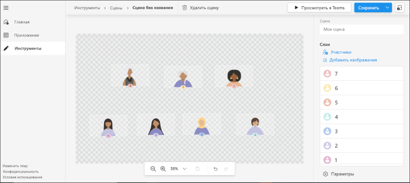
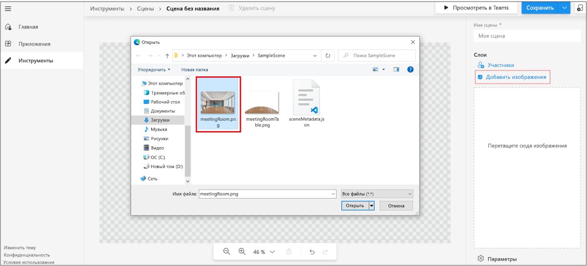
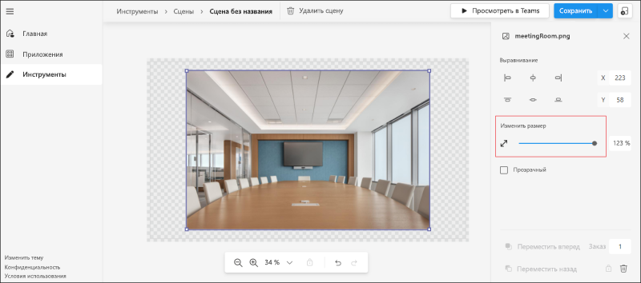
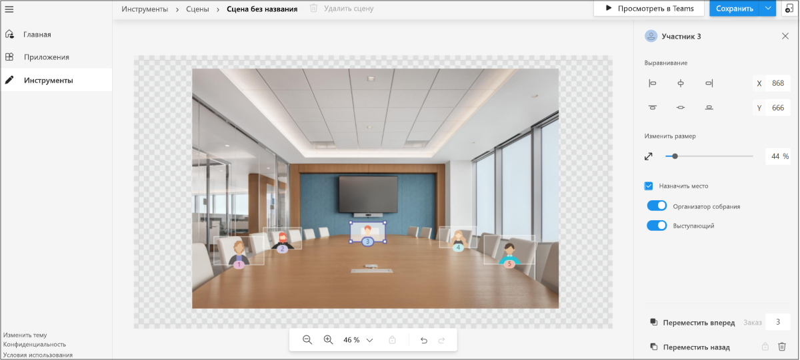
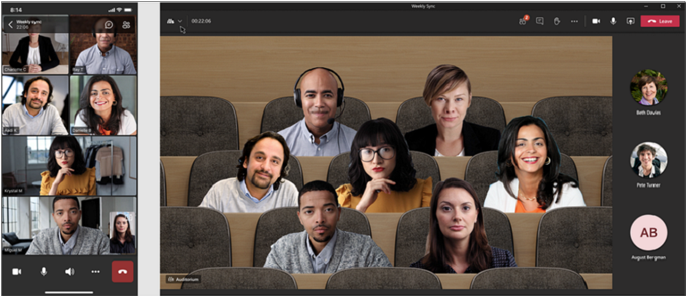
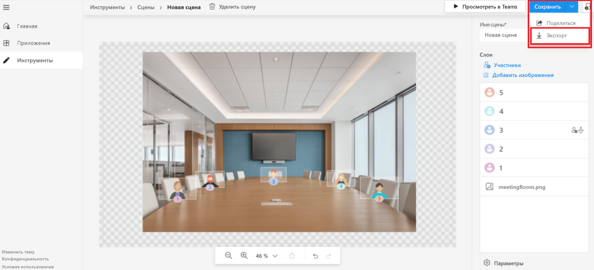

# <a name="custom-together-mode-scenes-in-teams"></a>Настраиваемые сцены режима "Вместе" в Teams

Настраиваемые сцены режима "Вместе" в Microsoft Teams обеспечивают иммерсивную и привлекаемую среду собраний со следующими действиями:

* Соберите пользователей вместе и предложите им включить видео. 
* Объедините участников в цифровом формате в единую виртуальную сцену. 
* Разместите видеопотоки участников в предварительно определенные расположения, разработанные и исправленные автором сцены.

В настраиваемых сценах режима "Вместе" сцена является артефактом. Сцена создается разработчиком сцены с помощью студии Microsoft Scene. В продуманной обстановке сцены у участников есть расположения с видеопотоками. Видео отображаются в этих расположениях. Рекомендуется использовать приложения только для сцен, так как работа с такими приложениями понятна.

Следующий процесс дает обзор создания приложения только для сцены:

:::image type="content" source="../assets/images/apps-in-meetings/create-together-mode-scene-flow.png" alt-text="Создание приложения только для сцены" border="false":::

Приложение только для сцены по-прежнему является приложением в Microsoft Teams. Студия Scene обрабатывает создание пакета приложения в фоновом режиме. Несколько сцен в одном пакете приложения отображаются для пользователей в виде плоского списка.

> [!NOTE]
> Пользователи не могут запустить режим "Вместе" с мобильного устройства. Однако после того, как пользователь присоединится к собранию через мобильное устройство, а режим "Вместе" будет включен с настольного компьютера, мобильные пользователи, включившие видео, появятся в режиме "Вместе" на настольном компьютере. 

## <a name="prerequisites"></a>Предварительные условия

Для использования настраиваемых сцен режима "Вместе" необходимо иметь базовое представление о следующих действиях:

* Определение сцены и мест в сцене.
* Наличие учетной записи Microsoft Developer и ознакомление с [порталом разработчика](../concepts/build-and-test/teams-developer-portal.md) Microsoft Teams и App Studio.
* Понимание [концепции загрузки неопубликованных приложений](../concepts/deploy-and-publish/apps-upload.md).
* Убедитесь, что администратор предоставил разрешение на [**загрузку пользовательского приложения**](../concepts/deploy-and-publish/apps-upload.md) и выбор всех фильтров в рамках политик настройки приложений и собраний соответственно.

## <a name="best-practices"></a>Лучшие методики

Рассмотрите следующие способы создания сцены:

* Убедитесь, что все изображения имеют формат PNG.
* Убедитесь, что окончательный пакет со всеми изображениями не превышает разрешение 1920x1080. Разрешение — это четное число. Это разрешение является требованием для успешного отображения сцен.
* Убедитесь, что максимальный размер сцены составляет 10 МБ.
* Убедитесь, что максимальный размер каждого изображения составляет 5 МБ. Сцена — это коллекция из нескольких изображений. Ограничение применяется для каждого отдельного изображения.
* Убедитесь, что выбран параметр **Прозрачный** (при необходимости). Этот флажок доступен на правой панели при выборе изображения. Перекрывающиеся изображения должны быть помечены как **прозрачные**, чтобы указать, что это перекрывающиеся изображения сцены.

## <a name="build-a-scene-using-the-scene-studio"></a>Создание сцены с помощью студии Scene

У корпорации Майкрософт есть студия Scene, которая позволяет создавать сцены. Он доступен в [редакторе Scenes — портале разработчика Teams](https://dev.teams.microsoft.com/scenes). Этот документ относится к студии Scene на портале разработчиков Microsoft Teams. Интерфейс и функциональные возможности в конструкторе сцен App Studio одинаковы.

Сцена в контексте студии Scene — это артефакт, который содержит следующие элементы:

* Места зарезервированы для организатора собрания и выступающих. Выступающий не ссылается на пользователя, который активно делится информацией. Это относится к [роли собрания](https://support.microsoft.com/en-us/office/roles-in-a-teams-meeting-c16fa7d0-1666-4dde-8686-0a0bfe16e019).

* Место и изображение для каждого участника с регулируемой шириной и высотой. Для изображения поддерживается только формат PNG.

* Координаты XYZ всех мест и изображений.

* Коллекция изображений, замаскированных как одно изображение.

На следующем изображении показано каждое место, которое представлено в качестве аватара для создания сцен:



**Создание сцены с помощью студии Scene**

1. Перейдите в [редактор сцены — портал разработчика Teams](https://dev.teams.microsoft.com/scenes).

    Кроме того, чтобы открыть студию Scene, вы можете перейти на домашнюю страницу [портала разработчика Teams](https://dev.teams.microsoft.com/home):
    * Выберите **Создать настраиваемые сцены для собраний**.
    * Выберите **Инструменты** в левом разделе и выберите **студия Scene** из раздела **Инструменты**.

1. В **редакторе "Сцены"** выберите **Создать новую сцену**.

1. В поле **Имя сцены** введите имя сцены.

    * Вы можете выбрать **Закрыть** для переключения между закрытием и повторным открытием правой области.
    * Вы можете увеличить или уменьшить масштаб сцены с помощью панели масштабирования для лучшего просмотра сцены.

1. Выберите **Добавить изображения**, чтобы добавить изображение в среду:

    

    >[!NOTE]
    > * Вы можете скачать файлы [SampleScene.zip](https://github.com/MicrosoftDocs/msteams-docs/tree/master/msteams-platform/apps-in-teams-meetings/SampleScene.zip) и [SampleApp.zip](https://github.com/MicrosoftDocs/msteams-docs/tree/master/msteams-platform/apps-in-teams-meetings/SampleApp.zip) с изображениями.

1. Выберите добавленное изображение.

1. На правой области выберите выравнивание изображения или используйте команду **Изменить размер** для корректировки размера изображения:

    

1. Выберите область за пределами изображения.

1. В правом верхнем углу выберите **Участники** в разделе **Слои**.

1. Выберите количество участников сцены в поле **Число участников** и выберите **Добавить**. После отправки сцены места размещения аватара заменяются реальными видеопотоками участников. Вы можете перетаскивать изображения участников по сцене и располагать их в нужном месте. Вы можете изменить их размер, используя стрелку изменения размера.

1. Выберите любое изображение участника и нажмите **Назначить пятно**, чтобы назначить место участнику.

1. Выберите роль **Организатор собрания** или **Выступающий** для участника. В собрании одному участнику должна быть назначена роль организатора собрания:

    

1. Выберите **Сохранить** и нажмите **Просмотреть в Teams**, чтобы быстро протестировать сцену в Microsoft Teams.

    * При выборе **Просмотреть в Teams** автоматически создается приложение Microsoft Teams, которое можно просмотреть на странице **Приложения** на портале разработчика Teams.
    * При выборе **Просмотреть в Teams** автоматически создается пакет приложения, который является appmanifest.json за сценой. Вы можете перейти к **Приложениям** из меню и получить доступ к автоматически созданному пакету приложений.
    * Чтобы удалить созданную сцену, выберите **Удалить сцену** на верхней панели.

1. В разделе **Просмотреть в Teams** выберите **Предварительный просмотр в Teams**.
1. В появившемся диалоговом окне выберите **Добавить**.

    Сцена тестируется или открывается путем создания тестового собрания и запуска настраиваемых сцен режима "Вместе". Дополнительные сведения см. в статье [Активация настраиваемых сцен режима "Вместе"](#activate-custom-together-mode-scenes):

    

    Затем сцену можно просмотреть в галерее настраиваемых сцен режима "Вместе".

Дополнительно можно выбрать **Поделиться** в раскрывающемся меню **Сохранить**. Вы можете создать общую ссылку, чтобы распространять сцены для использования другими пользователями. Пользователь может открыть ссылку для установки сцены и начать ее использовать.

После предварительного просмотра сцена отправляется как приложение в Teams, следуя инструкциям по отправке приложения. Этот шаг требует пакета приложения. Пакет приложения отличается от пакета сцены для сцены, которая была разработана. Автоматически созданный пакет приложений находится в разделе **Приложения** в Центре разработчиков Teams.

При необходимости пакет сцены можно получить, выбрав **Экспорт** в раскрывающемся меню **Сохранить**. Загружается **.zip**-файл, то есть пакет сцены. Пакет сцены включает в себя ресурсы scene.json и PNG, используемые для создания сцены. Пакет сцены проверяется на предмет включения других изменений:



Сложная сцена с использованием оси Z демонстрируется в пошаговом примере начала работы.

## <a name="sample-scenejson"></a>Пример scene.json

Scene.json вместе с изображениями указывает точное положение мест. Сцена состоит из растровых изображений, спрайтов и прямоугольников, в которые помещаются видео участников. Эти спрайты и поля участников определены в мировой системе координат. Ось X направлена вправо, а ось Y направлена вниз.

Настраиваемые сцены режима "Вместе" поддерживают увеличение текущих участников. Эта функция полезна для небольших собраний на большой сцене. Спрайт — это статическое растровое изображение, расположенное в мире. Значение Z спрайта определяет положение спрайта. Отрисовка начинается со спрайта с наименьшим значением Z, поэтому более высокое значение Z означает, что спрайт находится ближе к камере. У каждого участника есть собственный видеопоток, который сегментирован, поэтому отображается только передний план.

Ниже приводится пример scene.json:

```json
{
   "protocolVersion": "1.0",
   "id": "A",
   "autoZoom": true,
   "mirrorParticipants ": true,
   "extent":{
      "left":0.0,
      "top":0.0,
      "width":16.0,
      "height":9.0
   },
   "sprites":[
      {
         "filename":"background.png",
         "cx":8.0,
         "cy":4.5,
         "width":16.0,
         "height":9.0,
         "zOrder":0.0,
   "isAlpha":false
      },
      {
         "filename":"table.png",
         "cx":8.0,
         "cy":7.0,
         "width":12.0,
         "height":4.0,
         "zOrder":3.0,
   "isAlpha":true
      },
      {
         "filename":"row0.png",
         "cx":12.0,
         "cy":15.0,
         "width":8.0,
         "height":4.0,
         "zOrder":2.0,
   "isAlpha":true
      }

   ],
   "participants":[
      {
         "cx":5.0,
         "cy":4.0,
         "width":4.0,
         "height":2.25,
         "zOrder":1.0,
         "seatingOrder":0
      },
      {
         "cx":11.0,
         "cy":4.0,
         "width":4.0,
         "height":2.25,
         "zOrder":1.0,
         "seatingOrder":1
      }
   ]
}
```

Каждая сцена имеет уникальный идентификатор и имя. В сцене JSON также содержатся сведения обо всех ресурсах, используемых для сцены. Каждый ресурс содержит имя файла, ширину, высоту и положение по осям X и Y. Точно так же каждое место содержит его идентификатор, ширину, высоту и положение по осям X и Y. Порядок мест формируется автоматически и изменяется в соответствии с предпочтениями. Номер порядка мест соответствует порядку пользователей, присоединяющихся к вызову.

`zOrder` представляет порядок размещения изображений и мест по оси Z. Это дает ощущение глубины или разделения при необходимости. См. пошаговое руководство по началу работы. В примере используется `zOrder`.

Теперь, после ознакомления с образцом scene.json, можно активировать настраиваемые сцены режима "Вместе" для участия в сценах.

## <a name="activate-custom-together-mode-scenes"></a>Активация настраиваемых сцен режима "Вместе"

Дополнительные сведения о том, как пользователь взаимодействует со сценами в настраиваемых сценах режима "Вместе".

**Выбор сцен и активация настраиваемых сцен режима "Вместе"**

1. Создание тестового собрания.

    >[!NOTE]
    > При выборе **предварительного просмотра** в студии Scene сцена устанавливается как приложение в Microsoft Teams. Это модель, по которой разработчик может тестировать и опробовать сцены из студии Scene. После отправки сцены в виде приложения пользователи видят эти сцены в галерее сцен.

1. В раскрывающемся списке **Галерея** в верхнем левом углу выберите **режим "Вместе"**. Появится диалоговое окно **Средство выбора**, и добавленная сцена будет доступна.

1. Выберите **Изменить сцену**, чтобы изменить сцену по умолчанию.

1. В **галерее сцен** выберите сцену, которую хотите использовать для собрания.

    При желании организатор собрания и выступающий могут **изменить сцену для всех участников** собрания.

    >[!NOTE]
    > В любой момент времени для собрания используется только одна сцена. Если выступающий или организатор меняет сцену, она меняется для всех. Включение или выключение настраиваемых сцен режима "Вместе" зависит от отдельных участников, но в пользовательских сценах режима "Вместе" все участники имеют одну и ту же сцену.

1. Нажмите **Применить**. Teams устанавливает приложение для пользователя и применяет сцену.

## <a name="open-a-custom-together-mode-scenes-scene-package"></a>Откройте настраиваемый пакет сцен режима "Вместе"

Вы можете поделиться пакетом Scene, который представляет собой ZIP-файл, полученный из студии Scene, другим создателям для дальнейшего улучшения сцены. Функция **Импорт сцены** помогает развернуть пакет сцены, чтобы создатель мог продолжить создание сцены.


## <a name="see-also"></a>См. также

* [Приложения для собраний Teams](teams-apps-in-meetings.md)
* [Боты для звонков и собраний](~/bots/calls-and-meetings/calls-meetings-bots-overview.md)
* [Звонки и собрания в режиме реального времени с помощью Microsoft Teams](~/bots/calls-and-meetings/real-time-media-concepts.md)
