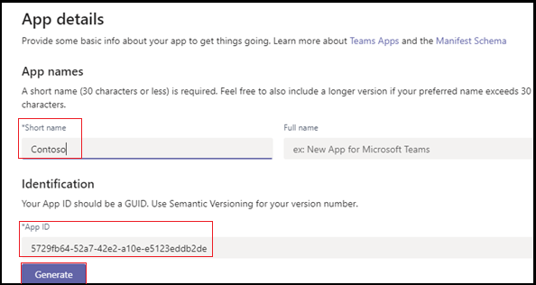

# <a name="add-power-virtual-agents-chatbot"></a><span data-ttu-id="505a1-103">Добавление чат-бота виртуальных агентов Power</span><span class="sxs-lookup"><span data-stu-id="505a1-103">Add Power Virtual Agents chatbot</span></span> 

<span data-ttu-id="505a1-104">Power Virtual Agents — это не кодовое решение графического интерфейса, которое позволяет каждому члену вашей команды создавать богатых чат-ботов, которые легко интегрируются с платформой Teams.</span><span class="sxs-lookup"><span data-stu-id="505a1-104">Power Virtual Agents is a no-code, guided graphical interface solution that empowers every member of your team to create rich, conversational chatbots that easily integrate with the Teams platform.</span></span> <span data-ttu-id="505a1-105">Все контенты, авторские в Power Virtual Agents, отрисовка естественно в Teams.</span><span class="sxs-lookup"><span data-stu-id="505a1-105">All content authored in Power Virtual Agents renders naturally in Teams.</span></span> <span data-ttu-id="505a1-106">Power Virtual Agents bots engage with users in the Teams native chat canvas.</span><span class="sxs-lookup"><span data-stu-id="505a1-106">Power Virtual Agents bots engage with users in the Teams native chat canvas.</span></span> <span data-ttu-id="505a1-107">ИТ-администраторы, бизнес-аналитики, специалисты по доменам и опытные разработчики приложений могут разрабатывать, разрабатывать и публиковать интеллектуальные виртуальные агенты для Teams без настройки среды разработки.</span><span class="sxs-lookup"><span data-stu-id="505a1-107">The IT administrators, business analysts, domain specialists, and skilled app developers can design, develop and publish intelligent virtual agents for Teams without having to setup a development environment.</span></span> <span data-ttu-id="505a1-108">Они могут создавать веб-службы или непосредственно регистрироваться в Bot Framework.</span><span class="sxs-lookup"><span data-stu-id="505a1-108">They can create a web service, or directly register with the Bot Framework.</span></span> 

<span data-ttu-id="505a1-109">В этом документе вы можете ознакомиться с тем, как сделать чат-бот доступным в Teams через портал виртуальных агентов Power и добавить бот в Teams с помощью App Studio.</span><span class="sxs-lookup"><span data-stu-id="505a1-109">This document guides you on how to make your chatbot available in Teams through the Power Virtual Agents portal, and add your bot to Teams using App Studio.</span></span> 

<span data-ttu-id="505a1-110">Виртуальные агенты Power позволяют создавать мощные чат-боты, которые могут отвечать на вопросы, заданные вашими клиентами, другими сотрудниками или посетителями веб-сайта или службы.</span><span class="sxs-lookup"><span data-stu-id="505a1-110">Power Virtual Agents lets you create powerful chatbots that can answer questions posed by your customers, other employees, or visitors to your website or service.</span></span>

<span data-ttu-id="505a1-111">Эти боты могут быть легко созданы без необходимости для ученых или разработчиков данных.</span><span class="sxs-lookup"><span data-stu-id="505a1-111">These bots can be created easily without the need for data scientists or developers.</span></span>

> [!NOTE]
> <span data-ttu-id="505a1-112">Добавляя чат-бота в Microsoft Teams, некоторые данные, такие как содержимое бота и содержимое пользовательского чата, делятся с Microsoft Teams.</span><span class="sxs-lookup"><span data-stu-id="505a1-112">By adding your chatbot to Microsoft Teams, some of the data, such as bot content and user chat content, is shared with Microsoft Teams.</span></span> <span data-ttu-id="505a1-113">Это означает, что ваши данные вытекают за пределы соответствия требованиям организации и [географических или региональных границ.](/power-virtual-agents/data-location)</span><span class="sxs-lookup"><span data-stu-id="505a1-113">It means that your data flows outside of your [organization’s compliance and geographic or regional boundaries](/power-virtual-agents/data-location).</span></span> <br/>

## <a name="make-your-chatbot-available-in-teams-through-the-power-virtual-agents-portal"></a><span data-ttu-id="505a1-114">Сделать чат-бот доступным в Teams через портал виртуальных агентов Power</span><span class="sxs-lookup"><span data-stu-id="505a1-114">Make your chatbot available in Teams through the Power Virtual Agents portal</span></span>

<span data-ttu-id="505a1-115">Чтобы сделать чат-бот доступным в Teams на портале виртуальных агентов Power, необходимо выполнить следующие действия:</span><span class="sxs-lookup"><span data-stu-id="505a1-115">To make your chatbot available in Teams through the Power Virtual Agents portal, you must perform the following process steps:</span></span>

<span data-ttu-id="505a1-116">**Чтобы сделать чат-бот доступным в Teams**</span><span class="sxs-lookup"><span data-stu-id="505a1-116">**To make the chatbot available in Teams**</span></span>

1. <span data-ttu-id="505a1-117">**Публикация последнего контента бота**</span><span class="sxs-lookup"><span data-stu-id="505a1-117">**Publish the latest bot content**</span></span>  
<span data-ttu-id="505a1-118">После создания чат-бота на портале виртуальных агентов Power необходимо опубликовать бот, прежде чем пользователи Teams смогут взаимодействовать с ним.</span><span class="sxs-lookup"><span data-stu-id="505a1-118">After creating a chatbot in the Power Virtual Agents portal, you must publish your bot before Teams users can interact with it.</span></span> <span data-ttu-id="505a1-119">Дополнительные сведения см. в [публикации последнего контента бота.](/power-virtual-agents/publication-fundamentals-publish-channels#publish-the-latest-bot-content)</span><span class="sxs-lookup"><span data-stu-id="505a1-119">For more information, see [Publish the latest bot content](/power-virtual-agents/publication-fundamentals-publish-channels#publish-the-latest-bot-content).</span></span>

   

1. <span data-ttu-id="505a1-121">**Настройка канала Teams**</span><span class="sxs-lookup"><span data-stu-id="505a1-121">**Configure the Teams channel**</span></span>  
<span data-ttu-id="505a1-122">После публикации бота добавьте канал Teams, чтобы сделать его доступным для пользователей Teams.</span><span class="sxs-lookup"><span data-stu-id="505a1-122">After publishing your bot, add the Teams channel to make the bot available to Teams users.</span></span>

   

1. <span data-ttu-id="505a1-124">**Создание ID приложения для чат-бота**</span><span class="sxs-lookup"><span data-stu-id="505a1-124">**Generate an App ID for your chatbot**</span></span>  
<span data-ttu-id="505a1-125">После добавления канала Teams в чат-бот в диалоговом окне создается **ID** приложения.</span><span class="sxs-lookup"><span data-stu-id="505a1-125">After adding the Teams channel to your chatbot, an **App ID** is generated in the dialog box.</span></span> <span data-ttu-id="505a1-126">Идентификатор приложения — уникальный идентификатор, созданный Корпорацией Майкрософт для вашего бота.</span><span class="sxs-lookup"><span data-stu-id="505a1-126">The App ID is a unique Microsoft generated identifier for your bot.</span></span> <span data-ttu-id="505a1-127">Сохраните ID приложения, чтобы создать пакет приложений для Teams.</span><span class="sxs-lookup"><span data-stu-id="505a1-127">Save the App ID to create an app package for Teams.</span></span>

## <a name="add-your-bot-to-teams-using-app-studio"></a><span data-ttu-id="505a1-128">Добавление бота в Teams с помощью App Studio</span><span class="sxs-lookup"><span data-stu-id="505a1-128">Add your bot to Teams using App Studio</span></span>

<span data-ttu-id="505a1-129">Если [в экземпляре](/microsoftteams/admin-settings) Teams включена загрузка настраиваемой программы, вы можете использовать Teams App Studio для непосредственной загрузки чат-бота и немедленного его использования.</span><span class="sxs-lookup"><span data-stu-id="505a1-129">If [uploading custom apps is enabled](/microsoftteams/admin-settings) in your Teams instance, you can use Teams App Studio to directly upload your chatbot and start using it immediately.</span></span> <span data-ttu-id="505a1-130">Чтобы поделиться своим чат-ботом, можно попросить администратора сделать бот доступным в каталоге приложений клиента или отправить пакет приложения другим и попросить их самостоятельно загрузить его.</span><span class="sxs-lookup"><span data-stu-id="505a1-130">To share your chatbot, you can request your admin to make your bot available in the tenant app catalog or you can send your app package to others and ask them to upload it independently.</span></span>

1. <span data-ttu-id="505a1-131">**Установка App Studio в Teams**</span><span class="sxs-lookup"><span data-stu-id="505a1-131">**Install App Studio in Teams**</span></span>  
<span data-ttu-id="505a1-132">App Studio — это приложение Teams.</span><span class="sxs-lookup"><span data-stu-id="505a1-132">App Studio is a Teams app.</span></span> <span data-ttu-id="505a1-133">Установка App Studio из магазина Teams, упрощает процесс создания и регистрации ботов в Teams:</span><span class="sxs-lookup"><span data-stu-id="505a1-133">Install App Studio from the Teams store that simplifies the process of bot creation and registration in Teams:</span></span> 

   1. <span data-ttu-id="505a1-134">Выберите значок магазина приложений из экземпляра Teams и выберите **App Studio.**</span><span class="sxs-lookup"><span data-stu-id="505a1-134">Select the app store icon from Teams instance, and search for **App Studio**.</span></span>

      &emsp;&emsp;    

   1. <span data-ttu-id="505a1-135">Выберите **плитку App Studio** и выберите **Установите** в диалоговом окне всплывающее окно.</span><span class="sxs-lookup"><span data-stu-id="505a1-135">Select the **App Studio** tile and select **Install** in the pop-up dialog box.</span></span>

      &emsp;&emsp; 

1. <span data-ttu-id="505a1-136">**Создание манифеста приложения Teams в App Studio**</span><span class="sxs-lookup"><span data-stu-id="505a1-136">**Create the Teams app manifest in App Studio**</span></span>  
<span data-ttu-id="505a1-137">Боты в Teams определяются файлом JSON манифеста приложения, который предоставляет основные сведения о вашем боте и его возможностях.</span><span class="sxs-lookup"><span data-stu-id="505a1-137">Bots in Teams are defined by an app manifest JSON file that provides the basic information about your bot and its capabilities.</span></span> <span data-ttu-id="505a1-138">В **App Studio** выберите редактор **Манифеста** и **выберите Создание нового приложения.**</span><span class="sxs-lookup"><span data-stu-id="505a1-138">In **App Studio**, select **Manifest editor**, and select **Create a new app**.</span></span>  
<span data-ttu-id="505a1-139">Ниже приводится руководство по созданию нового приложения в App Studio:</span><span class="sxs-lookup"><span data-stu-id="505a1-139">The following image guides you to create a new app in App Studio:</span></span>  

   

1. <span data-ttu-id="505a1-141">**Добавление сведений о боте**</span><span class="sxs-lookup"><span data-stu-id="505a1-141">**Add your bot details**</span></span>  
<span data-ttu-id="505a1-142">Выполните все необходимые поля.</span><span class="sxs-lookup"><span data-stu-id="505a1-142">Complete all the required fields.</span></span> <span data-ttu-id="505a1-143">Полное описание каждого поля см. в определении [схемы манифеста.](../../resources/schema/manifest-schema.md)</span><span class="sxs-lookup"><span data-stu-id="505a1-143">For a full description of each field see [manifest schema definition](../../resources/schema/manifest-schema.md).</span></span>   
<span data-ttu-id="505a1-144">Ниже приводится руководство по добавлению сведений о приложении:</span><span class="sxs-lookup"><span data-stu-id="505a1-144">The following image guides you to add the app details:</span></span>  

   

1. <span data-ttu-id="505a1-146">**Настройка бота** Чтобы настроить бот, выполните следующие действия:</span><span class="sxs-lookup"><span data-stu-id="505a1-146">**Set up your bot** To set-up the bot, perform the following steps:</span></span> 
     1. <span data-ttu-id="505a1-147">Откройте **вкладку Bots.**</span><span class="sxs-lookup"><span data-stu-id="505a1-147">Open the **Bots** tab.</span></span> 
     1. <span data-ttu-id="505a1-148">Выберите **настройка**  >  **существующего бота** и введите имя вашего бота.</span><span class="sxs-lookup"><span data-stu-id="505a1-148">Select **Setup** > **Existing bot** and enter the name of your bot.</span></span>

   <span data-ttu-id="505a1-149">На следующем изображении вы можете настроить бота:</span><span class="sxs-lookup"><span data-stu-id="505a1-149">The following image guides you to set-up a bot:</span></span>    

    

   <span data-ttu-id="505a1-151">Ниже приводится руководство по настройкам существующего бота:</span><span class="sxs-lookup"><span data-stu-id="505a1-151">The following image guides you to set-up an existing bot:</span></span>      

       
1. <span data-ttu-id="505a1-153">**Добавление ID приложения**</span><span class="sxs-lookup"><span data-stu-id="505a1-153">**Add your App ID**</span></span>  
<span data-ttu-id="505a1-154">Чтобы добавить свой ID приложения, выполните следующие действия:</span><span class="sxs-lookup"><span data-stu-id="505a1-154">To add your App ID, perform the following steps:</span></span>  
    1. <span data-ttu-id="505a1-155">Выберите **Подключение к другому бот-ид и** вклеить скопированные ранее **id** приложения.</span><span class="sxs-lookup"><span data-stu-id="505a1-155">Select **Connect to a different bot id** and paste the **App Id** you copied earlier.</span></span> 
    1. <span data-ttu-id="505a1-156">Выберите **Область личного**  >    >  **сохранения**.</span><span class="sxs-lookup"><span data-stu-id="505a1-156">Select **Scope** > **Personal** > **Save**.</span></span>      
<span data-ttu-id="505a1-157">Ниже приводится руководство по настройкам существующего бота:</span><span class="sxs-lookup"><span data-stu-id="505a1-157">The following image guides you to set-up an existing bot:</span></span>    

   

1. <span data-ttu-id="505a1-159">**Добавление допустимого домена для бота**</span><span class="sxs-lookup"><span data-stu-id="505a1-159">**Add valid domains for your bot**</span></span>  
<span data-ttu-id="505a1-160">Этот шаг необходим только в том случае, если бот требует от пользователя войти.</span><span class="sxs-lookup"><span data-stu-id="505a1-160">This step is only required if your bot requires the user to sign in.</span></span> <span data-ttu-id="505a1-161">Выберите **домены и разрешения** и в поле **Допустимые** домены ввести следующие сведения:</span><span class="sxs-lookup"><span data-stu-id="505a1-161">Select **Domains and permissions** and in the **Valid Domains** field, provide the following input:</span></span>

    ```bash
       token.botframework.com
    ```

7.  <span data-ttu-id="505a1-162">**Тестирование и распространение бота**</span><span class="sxs-lookup"><span data-stu-id="505a1-162">**Test and distribute your bot**</span></span>  
<span data-ttu-id="505a1-163">Откройте **тест и раздайте** вкладку и выберите **Установите,** чтобы добавить бот непосредственно в экземпляр Teams.</span><span class="sxs-lookup"><span data-stu-id="505a1-163">Open **Test and distribute** tab and select **Install** to add your bot directly to your Teams instance.</span></span> <span data-ttu-id="505a1-164">Кроме того, вы можете скачать завершенный пакет приложений для совместной работы с пользователями Teams или предоставить его администратору, чтобы сделать бот доступным в каталоге приложений клиента.</span><span class="sxs-lookup"><span data-stu-id="505a1-164">Alternately, you can download the completed app package to share with Teams users or provide it to your admin to make your bot available in the tenant app catalog.</span></span>

8. <span data-ttu-id="505a1-165">**Запуск чата** </span><span class="sxs-lookup"><span data-stu-id="505a1-165">**Start a chat** </span></span>  
<span data-ttu-id="505a1-166">Процесс настройка для добавления бота чата виртуальных агентов Power в Teams завершен.</span><span class="sxs-lookup"><span data-stu-id="505a1-166">The set-up process for adding your Power Virtual Agents chat bot to Teams is complete.</span></span> <span data-ttu-id="505a1-167">Теперь вы можете начать беседу с ботом в личном чате.</span><span class="sxs-lookup"><span data-stu-id="505a1-167">You can now start a conversation with your bot in a personal chat.</span></span>

## <a name="see-also"></a><span data-ttu-id="505a1-168">См. также</span><span class="sxs-lookup"><span data-stu-id="505a1-168">See also</span></span>
> [!div class="nextstepaction"]
> [<span data-ttu-id="505a1-169">Power Virtual Agents</span><span class="sxs-lookup"><span data-stu-id="505a1-169">Power Virtual Agents</span></span>](/power-virtual-agents/fundamentals-what-is-power-virtual-agents)  

> [!div class="nextstepaction"]
> <span data-ttu-id="505a1-170">[Создание чат-бота для Teams с виртуальными агентами Microsoft Power.](../bot-features.md#bots-and-the-microsoft-power-virtual-agents)</span><span class="sxs-lookup"><span data-stu-id="505a1-170">[Create a chatbot for Teams with Microsoft Power Virtual Agents](../bot-features.md#bots-and-the-microsoft-power-virtual-agents).</span></span>  

> [!div class="nextstepaction"]
>  [<span data-ttu-id="505a1-171">Портал Power Virtual Agents</span><span class="sxs-lookup"><span data-stu-id="505a1-171">Power Virtual Agents portal</span></span>](https://powervirtualagents.microsoft.com)

> [!div class="nextstepaction"]
> [<span data-ttu-id="505a1-172">Публикация бота виртуальных агентов Power</span><span class="sxs-lookup"><span data-stu-id="505a1-172">Publish your Power Virtual Agents bot</span></span>](/power-virtual-agents/publication-fundamentals-publish-channels)

> [!div class="nextstepaction"]
> <span data-ttu-id="505a1-173">[Безопасность и соответствие требованиям в Microsoft Teams](/MicrosoftTeams/security-compliance-overview).</span><span class="sxs-lookup"><span data-stu-id="505a1-173">[Security and compliance in Microsoft Teams](/MicrosoftTeams/security-compliance-overview).</span></span>

## <a name="next-step"></a><span data-ttu-id="505a1-174">Следующий шаг</span><span class="sxs-lookup"><span data-stu-id="505a1-174">Next step</span></span>

> [!div class="nextstepaction"]
> [<span data-ttu-id="505a1-175">Создание виртуального помощника</span><span class="sxs-lookup"><span data-stu-id="505a1-175">Create virtual assistant</span></span>](~/samples/virtual-assistant.md)

