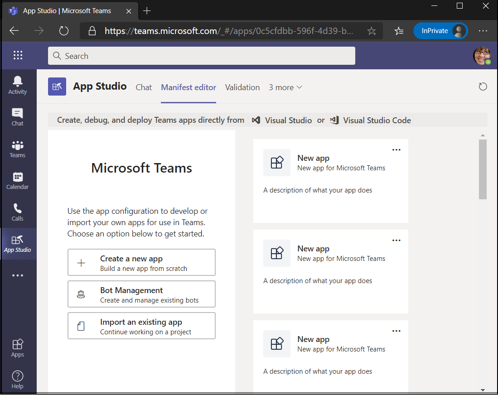

# <a name="integrate-a-power-virtual-agents-chatbot-with-microsoft-teams"></a>Интеграция виртуальных агентов Power чатбот с Microsoft Teams

[Power Virtual Agents](/power-virtual-agents/fundamentals-what-is-power-virtual-agents) — это решение с информационным графическим интерфейсом, которое позволяет каждому участнику группы создавать полнофункциональные, интерактивные чатботс, которые легко интегрируются с платформой Teams. Весь контент, созданный в виртуальном агенте, работает естественным образом в Microsoft Teams и Power Virtual Agents Боты участие пользователей в собственном холсте чата для Teams. ИТ-администраторы, бизнес-аналитики, специалисты по доменам и квалифицированные разработчики приложений могут разрабатывать, разрабатывать и публиковать интеллектуальные виртуальные агенты для Teams без необходимости настраивать среду разработки, создавать веб-службы или напрямую регистрироваться с помощью Bot Framework.  *Ознакомьтесь* [со статьей Создание чатбот для Teams с помощью Microsoft Power Virtual Agents](../what-are-bots.md#create-a-chatbot-for-teams-with-microsoft-power-virtual-agents).

> [!NOTE]
> Добавляя чатбот в Microsoft Teams, некоторые данные, например, содержимое Bot и содержимое чата для пользователей, будут доступны в Microsoft Teams (это значит, что данные будут передаваться за пределами [соответствия требованиям Организации, а также географическим и региональным границам](/power-virtual-agents/data-location)). <br/>
> Для получения дополнительных сведений ознакомьтесь с [безопасностью и соответствием требованиям в Microsoft Teams](/MicrosoftTeams/security-compliance-overview).

## <a name="make-your-chatbot-reachable-in-teams-in-the-power-virtual-agents-portal"></a>Обеспечение доступа к чатбот в Teams на портале виртуальных агентов управления питанием

1. **Опубликуйте Последнее содержимое Bot**.  После создания чатбот на [портале "агенты виртуального управления](https://powervirtualagents.microsoft.com)" необходимо опубликовать его по крайней мере один раз, прежде чем пользователи Team могут взаимодействовать с ним. Ознакомьтесь [со статьей публикация последнего содержимого Bot](/power-virtual-agents/publication-fundamentals-publish-channels#publish-the-latest-bot-content).


2. **Настройка канала Teams**. После публикации Bot можно добавить канал Teams, чтобы сделать Bot доступным для пользователей Teams.


3. **Создание идентификатора приложения для чатбот**  После успешного добавления канала Teams в чатбот в диалоговом окне будет создан **идентификатор приложения** . Идентификатор приложения — это уникальный идентификатор, созданный корпорацией Майкрософт для ленты.  Скопируйте и сохраните идентификатор приложения — он потребуется позже, чтобы создать пакет приложения для Teams.

## <a name="add-your-bot-to-teams-using-app-studio"></a>Добавление ленты в Teams с помощью App Studio

Если в экземпляре Teams [включена отправка настраиваемых приложений](/microsoftteams/admin-settings) , вы можете использовать Team Studio Studio, чтобы напрямую отправить чатбот и начать использовать его сразу. Если вы хотите предоставить общий доступ к чатбот, вы можете запросить у администратора, чтобы ваш Bot был доступен в каталоге приложений клиента, или вы можете отправить другим пользователям пакет приложения и попросить их отправить его независимо друг от друга.

1. **Установка App Studio в Teams**. App Studio — это приложение Teams, которое можно установить из хранилища Teams, которое упрощает создание и регистрацию ленты в teams: 

  * Выберите значок магазин приложений в нижней части левой панели навигации в экземпляре Teams и найдите **Приложение App Studio**.
>
&emsp;&emsp;     

  * Выберите плитку **app Studio** и нажмите кнопку **установить** во всплывающем диалоговом окне.
>
&emsp;&emsp; 

2. **Создайте манифест приложения Teams в App Studio**.  Боты в Teams определяются с помощью файла манифеста приложения (JSON), в котором представлены основные сведения о интерфейсе робота и его возможностях. В **app Studio** выберите **редактор манифеста**   =>  **, чтобы создать новое приложение**.
3. **Добавьте сведения о почтовом роботе**. Полное описание каждого поля представлено в статье [Определение схемы манифеста](../../resources/schema/manifest-schema.md). Обязательно заполните все обязательные поля.
4. **Настройка ленты**. Перейдите на вкладку **Боты** , нажмите кнопку **установить** , выберите пункт **существующий робот**и введите имя ленты.
5. **Добавьте идентификатор приложения**. Перейдите по адресу, чтобы **подключиться к другому идентификатору Bot** и вставьте **код приложения** , скопированный ранее. В разделе Область выберите пункт **Личные** , а затем нажмите кнопку **сохранить**.
6. **Добавьте Допустимые домены для ленты**.  Этот шаг необходим только в том случае, если для ленты необходимо войти в систему. Перейдите к разделу **домены и разрешения** и в поле **Допустимые домены** введите следующие данные:

```bash
token.botframework.com
```

7.  **Тестирование и распространение ленты**. Перейдите на вкладку **тест и распределение** и нажмите кнопку **установить** , чтобы добавить Bot непосредственно в экземпляр Teams. Кроме того, вы можете скачать завершенный пакет приложения, чтобы предоставить им доступ к пользователям Teams или предоставить своему администратору, чтобы сделать Bot доступным в каталоге приложений клиента.
8. **Запустите чат**. Процесс установки, позволяющий добавить свои агенты Power Virtual Bot в Microsoft Teams, будет завершен. Теперь вы можете начать беседу с роботом в личном чате.

> [!div class="nextstepaction"]
> [Узнайте больше о публикации агентов по виртуальному питанию Bot](/power-virtual-agents/publication-fundamentals-publish-channels)
