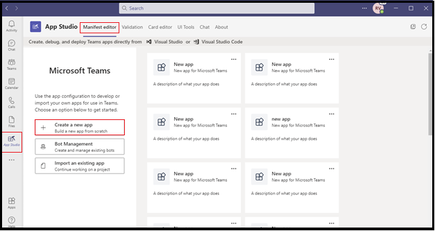

# <a name="add-power-virtual-agents-chatbot"></a>Добавление чатбота Power Virtual Agents 

Power Virtual Agents это решение без кода, управляемого графическим интерфейсом, которое позволяет каждому члену вашей команды создавать богатых разговорных чат-ботов, которые легко интегрируются с платформой Teams платформы. Все содержимое, автором Power Virtual Agents, естественно, в Teams. Power Virtual Agents боты взаимодействуют с пользователями в Teams чате холст. ИТ-администраторы, бизнес-аналитики, специалисты по доменам и квалифицированные разработчики приложений могут разрабатывать, разрабатывать и публиковать интеллектуальных виртуальных агентов для Teams без настройки среды разработки. Они могут создать веб-службу или напрямую зарегистрироваться в Bot Framework. 

Этот документ поможет вам сделать ваш чат-бот доступным в Teams через портал Power Virtual Agents, и добавить своего бота, чтобы Teams с помощью App Studio. 

Power Virtual Agents позволяет создавать мощные чат-боты, которые могут отвечать на вопросы ваших клиентов, других сотрудников или посетителей вашего сайта или службы.

Эти боты могут быть созданы легко без необходимости данных ученых или разработчиков.

> [!NOTE]
> Добавляя чат-бота в Microsoft Teams, некоторые данные, такие как бот-контент и содержимое чата пользователя, совместно Microsoft Teams. Это означает, что ваши данные вытекает за [пределы соответствия требованиям вашей организации и географических или региональных границ.](/power-virtual-agents/data-location) <br/>

## <a name="make-your-chatbot-available-in-teams-through-the-power-virtual-agents-portal"></a>Сделайте ваш чат-бот Teams в Power Virtual Agents портала

Чтобы сделать чат-бота доступным Teams через Power Virtual Agents портал, необходимо выполнить следующие этапы процесса:

**Чтобы сделать чат-бота доступным в Teams**

1. **Публикация последнего контента бота**  
После создания чат-бота на Power Virtual Agents, вы должны опубликовать свой бот, прежде чем Teams пользователи с ним свяются. Для получения дополнительной информации, [см. Публикация последнего содержания бота](/power-virtual-agents/publication-fundamentals-publish-channels#publish-the-latest-bot-content).

   

1. **Настройка Teams канала**  
После публикации бота добавьте Teams, чтобы бот был доступен Teams пользователям.

   

1. **Создание идентификатора приложения для чат-бота**  
После добавления Teams канала в чат-бот в **диалоговом поле** генерируется идентификатор App ID. Идентификатор App ID является уникальным идентификатором, генерируемым корпорацией Майкрософт для вашего бота. Сохраните идентификатор приложения для создания пакета приложений для Teams.

## <a name="add-your-bot-to-teams-using-app-studio"></a>Добавьте бота в Teams с помощью App Studio

Если [загрузка пользовательских приложений включена](/microsoftteams/admin-settings) в вашем Teams, вы можете использовать Teams App Studio, чтобы непосредственно загрузить чат-бота и начать использовать его немедленно. Чтобы поделиться своим чат-ботом, вы можете попросить администратора сделать вашего бота доступным в каталоге приложений арендатора или отправить пакет приложений другим и попросить их загрузить его самостоятельно.

1. **Установка App Studio в Teams**  
App Studio является Teams приложением. Установите App Studio из Teams магазина, который упрощает процесс создания и регистрации ботов в Teams: 

   1. Выберите значок магазина приложений из Teams например, и ищите **App Studio.**

      &emsp;&emsp;    

   1. Выберите **плитку App Studio** и **выберите Установить** во всплывающем диалоговом поле.

      &emsp;&emsp; 

1. **Создание Teams в App Studio**  
Боты в Teams определяются файлом JSON, который предоставляет основную информацию о вашем боте и его возможностях. В **App Studio** выберите редактора **Manifest** и выберите **Создать новое приложение.**

    

1. **Добавьте данные о боте**  
Выполните все необходимые поля. Для полного описания каждого [](../../resources/schema/manifest-schema.md)поля см.

    

1. **Настройка бота** Чтобы настроить бота, выполните следующие шаги: 
     1. Откройте **вкладку Bots.** 
     1. Выберите **Setup**  >  **Existing bot** и введите имя вашего бота.

    

   На следующем изображении помесят, как настроить существующего бота:      

   
       
1. **Добавить идентификатор приложения**  
Чтобы добавить идентификатор App ID, выполните следующие шаги:  
    1. Выберите **Подключение другому идентификатору бота и** вставьте App **Id, который** вы скопировали ранее. 
    1. Выберите **область**  >  **личного**  >  **сохранения**.

    

1. **Добавление действительных доменов для вашего бота**  
Этот шаг необходим только в том случае, если ваш бот требует от пользователя войти в компьютер. Выберите **домены и разрешения,** а также в **поле действительных доменов,** предоставьте следующие входные данные:

    ```bash
       token.botframework.com
    ```

1. **Тестирование и распространение бота**  
Откройте **тест и распределите** вкладку **и выберите Установить,** чтобы добавить ваш бот непосредственно к Teams например. Кроме того, вы можете скачать завершенный пакет приложений, чтобы поделиться с Teams пользователями или предоставить его администратору, чтобы сделать ваш бот доступен в каталоге приложений арендатора.

1. **Начало чата**   
Процесс настройки для добавления вашего чат-Power Virtual Agents в Teams завершен. Теперь вы можете начать разговор с ботом в личном чате.

## <a name="see-also"></a>См. также

- [Power Virtual Agents](/power-virtual-agents/fundamentals-what-is-power-virtual-agents)  

- [Создайте чат-бот для Teams с Microsoft Power Virtual Agents](../bot-features.md#bots-and-the-microsoft-power-virtual-agents).  

- [Power Virtual Agents портал](https://powervirtualagents.microsoft.com)

- [Опубликовать свой Power Virtual Agents бот](/power-virtual-agents/publication-fundamentals-publish-channels)

- [Безопасность и соблюдение в Microsoft Teams](/MicrosoftTeams/security-compliance-overview).

## <a name="next-step"></a>Следующий шаг

> [!div class="nextstepaction"]
> [Создание виртуального помощника](~/samples/virtual-assistant.md)

