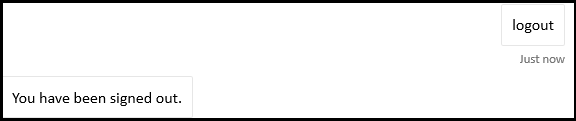

# <a name="add-authentication-to-your-teams-bot"></a>Добавление проверки подлинности для бота Teams

Иногда может потребоваться создать боты в Microsoft Teams, которые могут получать доступ к ресурсам от имени пользователя, например к почтовой службе.

В этой статье показано, как использовать проверку подлинности Azure Bot Service v4 SDK на основе OAuth 2.0. Это упрощает разработку бота, который может использовать маркеры проверки подлинности на основе учетных данных пользователя. Ключом во всем этом является использование поставщиков **удостоверений**, как мы увидим позже.

OAuth 2.0 — это открытый стандарт проверки подлинности и авторизации, используемый Microsoft Azure Active Directory (Azure AD) и многими другими поставщиками удостоверений. Базовое понимание OAuth 2.0 является обязательным условием для работы с проверкой подлинности в Teams.

В этой области см. упрощенную версию [OAuth 2](https://aka.ms/oauth2-simplified) для базового понимания и [OAuth 2.0](https://oauth.net/2/) для полной спецификации.

Дополнительные сведения о том, как служба Azure Bot обрабатывает проверку подлинности, см. в записи проверки подлинности пользователей [в ходе беседы](https://aka.ms/azure-bot-authentication).

В данной статье вы узнаете следующее.

- **Создание бота с поддержкой проверки подлинности**. Вы будете использовать [cs-auth-sample][teams-auth-bot-cs] для обработки учетных данных входа пользователя и создания маркера проверки подлинности.
- **Развертывание бота в Azure и его связывание с поставщиком удостоверений**. Поставщик выдает маркер на основе учетных данных входа пользователя. Бот может использовать маркер для доступа к ресурсам, например к почтовой службе, для которой требуется проверка подлинности. Дополнительные сведения [см. Microsoft Teams поток проверки подлинности для ботов](auth-flow-bot.md).
- **Интеграция бота в Microsoft Teams**. После интеграции бота можно войти и обмениваться сообщениями с ним в чате.

## <a name="prerequisites"></a>Предварительные условия

- Знание основ [бота][concept-basics], [управление состоянием][concept-state], библиотека диалогов [и реализация][concept-dialogs] [последовательного потока бесед][simple-dialog].
- Знание разработки Azure и OAuth 2.0.
- Текущие версии Microsoft Visual Studio Git.
- Учетная запись Azure. При необходимости можно создать бесплатную [учетную запись Azure](https://azure.microsoft.com/free/).
- Следующий пример:

    | Пример | Версия BotBuilder | Демонстрация |
    |:---|:---:|:---|
    | **Проверка подлинности ботов** [в cs-auth-sample][teams-auth-bot-cs] | v4 | Поддержка OAuthCard |
    | **Проверка подлинности ботов** [в примере js-auth][teams-auth-bot-js] | v4| Поддержка OAuthCard  |
    | **Проверка подлинности ботов** [в py-auth-sample][teams-auth-bot-py] | v4 | Поддержка OAuthCard |

## <a name="create-the-resource-group"></a>Создание группы ресурсов

Группа ресурсов и план службы не являются строго необходимыми, но они позволяют удобно выпускать ресурсы, которые вы создаете. Это хорошая практика для сохраняющихся и управляемых ресурсов.

Вы используете группу ресурсов для создания отдельных ресурсов для Bot Framework. Для производительности убедитесь, что эти ресурсы находятся в одном регионе Azure.

1. В браузере впишитесь на [**Microsoft Azure портал.**][azure-portal]
1. В левой панели навигации выберите **группы Ресурсов**.
1. В верхней левой части отображаемого окна выберите вкладку **Добавить** , чтобы создать новую группу ресурсов. Вам будет предложено предоставить следующее:
    1. **Подписка**. Используйте существующую подписку.
    1. **Группа ресурсов**. Введите имя группы ресурсов. Примером может быть  *TeamsResourceGroup*. Помните, что имя должно быть уникальным.
    1. Из **выпадаемого** меню Region выберите *Запад США* или регион, близкий к приложениям.
    1. Выберите **кнопку Обзор и создайте** кнопку. Вы должны увидеть баннер, который считывал *пройденную проверку*.
    1. Выберите **кнопку Создать** . Создание группы ресурсов может занять несколько минут.

> [!TIP]
> Как и в случае с ресурсами, которые будут создаваться в этом руководстве, для легкого доступа к этой группе ресурсов необходимо прикрепить эту группу ресурсов к панели мониторинга. Если вы хотите это сделать, выберите значок пин-кода &#128204; в правом верхнем справа от панели мониторинга.

## <a name="create-the-service-plan"></a>Создание плана службы

1. На [**портале Azure**][azure-portal] на левой панели навигации выберите **Создать ресурс**.
1. В поле поиска введите *план службы приложения*. Выберите карту **плана службы приложений** из результатов поиска.
1. Нажмите **Создать**.
1. Вам будет предложено предоставить следующие сведения:
    1. **Подписка**. Можно использовать существующую подписку.
    1. **Группа ресурсов**. Выберите группу, созданную ранее.
    1. **Имя**. Введите имя для плана службы. Примером может быть  *TeamsServicePlan*. Помните, что имя должно быть уникальным в группе.
    1. **Операционная система**. Выберите *Windows* или применимую ОС.
    1. **Область**. Выберите *Запад США* или регион, близкий к приложениям.
    1. **Уровень цен**. Убедитесь, *что выбран стандартный S1* . Это должно быть значение по умолчанию.
    1. Выберите **кнопку Обзор и создайте** кнопку. Вы должны увидеть баннер, который считывал *пройденную проверку*.
    1. Нажмите **Создать**. Создание плана службы приложений может занять несколько минут. План будет указан в группе ресурсов.

## <a name="create-azure-bot-resource-registration"></a>Создание регистрации ресурсов Azure Bot

Регистрация ресурсов Azure Bot регистрирует веб-службу в качестве бота с помощью bot Framework, которая предоставляет вам код Microsoft App и пароль приложения (секрет клиента).

> [!IMPORTANT]
> Необходимо зарегистрировать бот только в том случае, если он не находится в Azure. Если вы [создали бот через](/azure/bot-service/abs-quickstart?view=azure-bot-service-4.0&viewFallbackFrom=azure-bot-service-3.0&preserve-view=true) портал Azure, он уже зарегистрирован в службе. Если вы создали бот через [базу ботов](https://dev.botframework.com/bots/new) или [портал разработчика](../../../concepts/build-and-test/teams-developer-portal.md) , ваш бот не зарегистрирован в Azure.

1. Посетите [**портал Azure и**][azure-portal] найди **Azure Bot** в **разделе Создание раздела ресурсов** .
1. Откройте Azure **Bot и** выберите **Create**.
1. Введите имя ручки бота **в поле обработки ботов** .
1. Выберите **подписку** из списка выпаданий.
1. Выберите **группу Ресурсов из** списка выпаданий.
1. Выберите **тип приложения в качестве** **multi tenant** для **Microsoft App ID**.

    

1. Выберите **Проверить и создать**.

    

1. Если проверка пройдет, выберите **Создать**.

    Подготовка службы бота занимает несколько минут.

    

1. Выберите пункт **Перейти к ресурсу**. Бот и связанные ресурсы перечислены в группе ресурсов.

    

    Теперь создан бот Azure.

    

Создание секрета клиента:

1. В **Параметры** выберите **Конфигурация**. Сохраните **для будущей ссылки ID** приложения Майкрософт (клиентский ID).

    

1. Рядом с **microsoft App ID** выберите **Управление**.

    

1. В разделе **Секреты клиента** выберите **новый секрет клиента**. **Добавлено окно секрета** клиента.

    

1. **Введите Описание** и выберите **Добавить**.

    

1. В **столбце Значение** выберите **Копию для буфера обмена** данными и сохраните секретный ИД клиента для будущей ссылки.

    

Чтобы добавить Microsoft Teams канал:

1. Перейдите к **дому**.

    

1. Откройте бот, который указан в разделе **Последние ресурсы** .

1. Выберите **каналы в** левой области и **выберите Microsoft Teams**:::image type="icon" source="../../../assets/icons/teams-icon.png" border="false":::.

   :::image type="content" source="../../../assets/images/adaptive-cards/channel-teams.png" alt-text="Канал Teams":::

1. Выберите почтовый ящик, чтобы принять условия службы и выбрать **Согласование**.</br>

    

1. Нажмите кнопку **Сохранить**.

    

Дополнительные сведения см. в [дополнительных сведениях о создании бота для Teams](../create-a-bot-for-teams.md).

## <a name="create-the-identity-provider"></a>Создание поставщика удостоверений

Вам нужен поставщик удостоверений, который можно использовать для проверки подлинности.
В этой процедуре вы будете использовать поставщика Azure AD; другие поставщики удостоверений, поддерживаемые Azure AD, также могут использоваться.

1. На [**портале Azure**][azure-portal] на левой панели навигации **выберите Azure Active Directory.**
    > [!TIP]
    > Необходимо создать и зарегистрировать этот ресурс Azure AD в клиенте, в котором вы можете дать согласие на делегирование разрешений, запрашиваемого приложением.
    > Инструкции по созданию клиента см. в [сайте Access the portal и create a tenant](/azure/active-directory/fundamentals/active-directory-access-create-new-tenant).
1. В левой панели выберите **регистрацию приложения**.
1. В правой панели выберите вкладку **Новая регистрация** в верхней левой части.
1. Вам будет предложено предоставить следующие сведения:
   1. **Имя**. Введите имя приложения. Примером может быть  *botTeamsIdentity*. Помните, что имя должно быть уникальным.
   1. Выберите типы **поддерживаемых учетных записей** для приложения. Выберите учетные записи в любом организационном каталоге *(Microsoft Azure Active Directory (Azure AD) и личных учетных записях Майкрософт (например, Skype, Xbox)*.
   1. Для **URI перенаправления**:<br/>
       &#x2713;Выберите **Веб**. <br/>
       &#x2713; установите URL-адрес `https://token.botframework.com/.auth/web/redirect`.
   1. Нажмите **Зарегистрировать**.

1. После создания Azure отображает страницу **Обзор** для приложения. Копирование и сохранение следующих сведений в файле:

    1. Значение **ID приложения (клиента** ). Это значение будет позже использовать в качестве идентификатора клиента при регистрации этого приложения удостоверений Azure в боте.
    1. **ID-значение Directory (tenant**). Это значение также будет позже использовать в качестве идентификатора *клиента* для регистрации этого приложения удостоверений Azure в боте.

1. На левой панели выберите **сертификаты &,** чтобы создать секрет клиента для приложения.

   1. В **статье Секреты клиента** выберите &#x2795; **новый секрет клиента**.
   1. Добавьте описание, чтобы определить этот секрет от других пользователей, которые могут потребоваться создать для этого приложения, например приложения удостоверения *бота в Teams*.
   1. Срок **действия набора истекает** в выборе.
   1. Нажмите **Добавить**.
   1. Перед выходом на эту **страницу зафиксировать секрет**. Это значение будет позже использовать в качестве секрета *клиента* при регистрации приложения Azure AD в боте.

### <a name="configure-the-identity-provider-connection-and-register-it-with-the-bot"></a>Настройка подключения поставщика удостоверений и регистрация его с помощью бота

Примечание- Существует два варианта для поставщиков услуг здесь-Microsoft Azure Active Directory (Azure AD) V1 и Microsoft Azure Active Directory (Azure AD) V2.  Здесь резюмируют различия между двумя поставщиками [, но](/azure/active-directory/azuread-dev/azure-ad-endpoint-comparison) в целом V2 обеспечивает большую гибкость в отношении изменения разрешений ботов.  Graph API-разрешения перечислены в поле областей, а по мере их добавления боты позволяют пользователям соглашаться на новые разрешения при следующем входе.  Для V1 согласие бота должно быть удалено пользователем для получения новых разрешений, которые будут предложены в диалоговом окне OAuth.

#### <a name="microsoft-azure-active-directory-azure-ad-v1"></a>Microsoft Azure Active Directory (Azure AD) V1

1. На [**портале Azure**][azure-portal] выберите группу ресурсов из панели мониторинга.
1. Выберите ссылку на регистрацию бота.
1. Откройте страницу ресурса и выберите **Конфигурация** **в Параметры**.
1. Выберите **Добавить подключение OAuth Параметры**.
На следующей странице ресурса отображается соответствующий выбор:  

1. Заполните форму следующим образом:

    1. **Имя**. Введите имя подключения. Вы будете использовать это имя в боте в файле `appsettings.json` . Например *, BotTeamsAuthADv1*.
    1. **Поставщик услуг**. Выберите **Microsoft Azure Active Directory (Azure AD)**. После этого будут отображаться поля Azure AD.
    1. **ID клиента**. Введите идентификатор приложения (клиента), записанный для приложения-поставщика удостоверений Azure в вышеуказанных действиях.
    1. **Секрет клиента**. Введите секрет, записанный для приложения-поставщика удостоверений Azure в шагах выше.
    1. **Тип гранта**. Введите `authorization_code`.
    1. **URL-адрес входа**. Введите `https://login.microsoftonline.com`.
    1. **Идентификатор клиента** введите идентификатор **Directory (tenant),** записанный ранее для приложения удостоверений Azure или распространенный в зависимости от поддерживаемого типа учетной записи, выбранного при создания приложения поставщика удостоверений. Чтобы определить, какое значение назначить, выполните указанные критерии:

        - Если вы выбрали только учетные записи в этом организационном каталоге (только Microsoft — один клиент *)* или учетные записи в любом организационном каталоге *(Microsoft Azure Active Directory (Azure AD) — multi-клиенте)* введите **ID** клиента, который был записан ранее для Microsoft Azure Active Directory (Azure AD). ) приложение. Это будет клиент, связанный с пользователями, которые могут быть проверки подлинности.

        - Если вы выбрали учетные записи в любом организационном каталоге *(Any Microsoft Azure Active Directory (Azure AD) —* многоуровневые учетные записи клиента и личные учетные записи Майкрософт, например Skype, Xbox, Outlook) введите слово  общее вместо ID клиента. В противном случае приложение Microsoft Azure Active Directory Azure AD проверяется через клиента, у которого был выбран ID, и исключает личные учетные записи Майкрософт.

    з. Для **URL-адреса ресурса** введите `https://graph.microsoft.com/`. Это не используется в текущем примере кода.  
    и. **Оставьте области пустыми**. В качестве примера приводится следующее изображение:

    

1. Нажмите кнопку **Сохранить**.

#### <a name="microsoft-azure-active-directory-azure-ad-v2"></a>Microsoft Azure Active Directory (Azure AD) V2

1. На [**портале Azure**][azure-portal] выберите Azure Bot из панели мониторинга.
1. На странице ресурса выберите **Конфигурация** под **Параметры**.
1. Выберите **Добавить подключение OAuth Параметры**.  
На следующем изображении отображается соответствующий выбор на странице ресурса: 

1. Заполните форму следующим образом:

    1. **Имя**. Введите имя подключения. Вы будете использовать это имя в боте в файле `appsettings.json` . Например *, BotTeamsAuthADv2*.
    1. **Поставщик услуг**. Выберите **Microsoft Azure Active Directory v2**. После выбора этого будут отображаться Microsoft Azure Active Directory поля (Azure AD).
    1. **ID клиента**. Введите идентификатор приложения (клиента), записанный для приложения-поставщика удостоверений Azure в вышеуказанных действиях.
    1. **Секрет клиента**. Введите секрет, записанный для приложения-поставщика удостоверений Azure в шагах выше.
    1. **URL Exchange маркер.** Не заполняйте это поле.
    1. **Идентификатор клиента** введите идентификатор **Directory (tenant),** записанный ранее для приложения удостоверений Azure или распространенный в зависимости от поддерживаемого типа учетной записи, выбранного при создания приложения поставщика удостоверений. Чтобы определить, какое значение назначить, выполните указанные критерии:

        - Если вы выбрали только учетные записи в этом организационном каталоге (только Microsoft - один клиент *)* или учетные записи в любом организационном каталоге *(Microsoft Azure Active directory - Multi tenant)* введите **ID** клиента, который был записан ранее для приложения Microsoft Azure Active Directory Azure AD. Это будет клиент, связанный с пользователями, которые могут быть проверки подлинности.

        - Если вы выбрали учетные записи в любом организационном каталоге *(Any Microsoft Azure Active Directory (Azure AD) —* многоуровневые учетные записи клиента и личные учетные записи Майкрософт, например Skype, Xbox, Outlook) введите слово  общее вместо ID клиента. В противном случае приложение Microsoft Azure Active Directory Azure AD проверяется через клиента, у которого был выбран ID, и исключает личные учетные записи Майкрософт.

    1. Для **областей** введите список разрешений на график, относячимый к пространству, для этого приложения требуется, например: User.Read User.ReadBasic.All Mail.Read

1. Нажмите кнопку **Сохранить**.

### <a name="test-the-connection"></a>Тестирование подключения

1. Выберите запись подключения, чтобы открыть только что созданное подключение.
1. Выберите **подключение к тесту** в верхней части панели **параметра подключения поставщика** услуг.
1. При первом этом откроется новое окно браузера с просьбой выбрать учетную запись. Выберите тот, который вы хотите использовать.
1. Далее вам будет предложено разрешить поставщику удостоверений использовать данные (учетные данные). В качестве примера приводится следующее изображение:

    

1. Выберите **Принять**.
1. Это должно перенаправить вас на страницу **Тестовая подключение к \<your-connection-name> успешной** странице. Обновите страницу, если вы получите ошибку. В качестве примера приводится следующее изображение:

    

Имя подключения используется кодом бота для получения маркеров проверки подлинности пользователей.

## <a name="prepare-the-bot-sample-code"></a>Подготовка кода образца бота

С помощью предварительных параметров давайте сосредоточимся на создании бота, который будет использовать в этой статье.

# <a name="cnet"></a>[C#/.NET](#tab/dotnet)

1. [Клонировать cs-auth-sample][teams-auth-bot-cs].
1. Запуск Visual Studio.
1. На панели инструментов выберите **Файл -> Open -> Project/Solution** и откройте проект бота.
1. В C# **update appsettings.json** следующим образом:

    - Установите `ConnectionName` имя подключения поставщика удостоверений, добавленного в регистрацию бота. В этом примере используется имя *BotTeamsAuthADv1*.
    - Установите `MicrosoftAppId` для **бота ID приложения,** сохраненного во время регистрации бота.
    - Установите `MicrosoftAppPassword` секрет **клиента,** сохраненный во время регистрации бота.

    В зависимости от символов в секрете бота может потребоваться XML-пароль. Например, любые амперанды (&) должны быть закодированы как `&amp;`.

     [!code-json[appsettings](~/../botbuilder-samples/samples/csharp_dotnetcore/46.teams-auth/appsettings.json?range=1-5)]

1. В обозревателе решений перейдите `TeamsAppManifest` в папку, `botId` `manifest.json` `id` откройте и установите, а также в бот App **ID**, сохраненный во время регистрации бота.

# <a name="javascript"></a>[JavaScript](#tab/node-js)

1. [Клонировать узел-auth-sample][teams-auth-bot-js].
1. В консоли перейдите к проекту: </br></br>
`cd samples/javascript_nodejs/46.teams`  
1. Установка модулей</br></br>
`npm install`
1. Обновление **конфигурации .env** следующим образом:

    - Установите `MicrosoftAppId` для **бота ID приложения,** сохраненного во время регистрации бота.
    - Установите `MicrosoftAppPassword` секрет **клиента,** сохраненный во время регистрации бота.
    - Установите имя `connectionName` подключения поставщика удостоверений.
    В зависимости от символов в секрете бота может потребоваться XML-пароль. Например, любые амперанды (&) должны быть закодированы как `&amp;`.

     [!code-javascript[settings](~/../botbuilder-samples/samples/javascript_nodejs/46.teams-auth/.env)]

1. В папке `teamsAppManifest` откройте и `manifest.json` `id` установите свой **microsoft App ID** и бот App **ID**`botId`, сохраненный во время регистрации бота.

# <a name="python"></a>[Python](#tab/python)

1. [Клонировать py-auth-пример][teams-auth-bot-py] из хранилища github.
1. Обновление **config.py**:

    - Задайте `ConnectionName` имя параметра подключения OAuth, добавленного в бот.
    - Настройка `MicrosoftAppId` и `MicrosoftAppPassword` секрет приложения и ID приложения вашего бота.

      В зависимости от символов в секрете бота может потребоваться XML-пароль. Например, любые амперанды (&) должны быть закодированы как `&amp;`.

      [!code-python[config](~/../botbuilder-samples/samples/python/46.teams-auth/config.py?range=14-16)]

---

### <a name="deploy-the-bot-to-azure"></a>Развертывание бота в Azure

Чтобы развернуть бот, выполните действия по развертыванию бота [в Azure](https://aka.ms/azure-bot-deployment-cli).

Кроме того, в Visual Studio вы можете следовать следующим шагам:

1. В Visual Studio *Обозреватель решений* выберите и удерживайте (или правой кнопкой мыши) имя проекта.
1. В выпадаемом меню выберите **Опубликовать**.
1. В отображаемом окне выберите новую **ссылку** .
1. В диалоговом окне выберите **Службу приложений** слева и **создайте новое** справа.
1. Выберите **кнопку Публикация** .
1. В следующем диалоговом окне введите требуемую информацию. Ниже приведен пример.

    

1. Нажмите **Создать**.
1. Если развертывание успешно завершено, оно должно быть отражено в Visual Studio. Кроме того, страница отображается в браузере по умолчанию, говоря *, что ваш бот готов!*. URL-адрес будет похож на этот: `https://botteamsauth.azurewebsites.net/`. Сохраните его в файле.
1. В браузере перейдите на портал [**Azure**][azure-portal].
1. Проверьте группу ресурсов, бот должен быть указан вместе с другими ресурсами. В качестве примера приводится следующее изображение:

    

1. В группе ресурсов выберите имя регистрации бота (ссылка).
1. В левой **панели выберите Параметры**.
1. В **окне конечной точки обмена сообщениями** введите URL-адрес, полученный выше, а затем `api/messages`. Вот пример: `https://botteamsauth.azurewebsites.net/api/messages`.
    > [!NOTE]
    > Только одна конечная точка обмена сообщениями разрешена для бота
1. Выберите **кнопку Сохранить** в левом верхнем верхней части.

## <a name="test-the-bot-using-the-emulator"></a>Проверьте бот с помощью Emulator

Если вы еще не сделали этого, установите [Microsoft Bot Framework Emulator.](https://aka.ms/bot-framework-emulator-readme) См. [также отлагивание с помощью Emulator](https://aka.ms/bot-framework-emulator-debug-with-emulator).

Чтобы образец бота работал, необходимо настроить Emulator.

### <a name="configure-the-emulator-for-authentication"></a>Настройка Emulator проверки подлинности

Если боту требуется проверка подлинности, необходимо настроить Emulator. Настройка:

1. Запустите Emulator.
1. В Emulator выберите значок шестеренки &#9881; в левом нижнем низу или вкладку Emulator Параметры в правом  верхнем.
1. Проверьте поле с помощью **маркеров проверки подлинности версии 1.0**.
1. Введите локальный путь к **средству ngrok** . *См*. Bot Framework Emulator/ngrok tunneling integration [Wiki](https://github.com/Microsoft/BotFramework-Emulator/wiki/Tunneling-(ngrok)). Дополнительные сведения об инструментах см. [в сайте ngrok](https://ngrok.com/).
1. Проверьте поле run **ngrok, когда Emulator запускается**.
1. Выберите **кнопку Сохранить** .

Когда бот отображает карточку регистрации и пользователь выбирает кнопку вход, Emulator открывает страницу, которую пользователь может использовать для регистрации с поставщиком проверки подлинности.
После этого пользователь создает маркер пользователя и отправляет его боту. После этого бот может действовать от имени пользователя.

### <a name="test-the-bot-locally"></a>Локальное тестирование бота

После настройки механизма проверки подлинности можно выполнить фактическое тестирование бота.  

1. Запустите образец бота локально на компьютере, Visual Studio например.
1. Запустите Emulator.
1. Выберите **кнопку Открыть бот** .
1. В **URL-адресе Bot** введите локальный URL-адрес бота. Обычно . `http://localhost:3978/api/messages`
1. В **ID приложения Майкрософт введите ID** приложения бота из `appsettings.json`.
1. В пароле **Microsoft App** введите пароль приложения бота из `appsettings.json`.
1. Нажмите **Подключиться**.
1. После запуска бота введите любой текст, чтобы отобразить карту входа.
1. Нажмите кнопку **Войти**.
1. Для подтверждения url-адреса Open отображается **всплывающее диалоговое окно**. Это позволяет пользователю бота (вам) быть аутентификацией.  
1. Выберите **Подтвердить**.
1. При запросе выберите учетную запись соответствующего пользователя.
1. В зависимости от конфигурации, используемой для Emulator, вы получаете одну из следующих конфигураций:
    1. **Использование кода проверки входных данных**  
      &#x2713; открывается окно с кодом проверки.  
      &#x2713; и введите код проверки в поле чата для завершения входа.
    1. **Использование маркеров проверки подлинности**.  
      &#x2713; вы вошли в систему на основе учетных данных.

    Ниже приводится пример пользовательского интерфейса бота после входа в систему:

    

1. Если вы выберите **Да** , когда бот спросит, хотите ли вы просмотреть маркер *?*, вы получите ответ, аналогичный следующему:

    

1. **Введите вход в** поле входного чата, чтобы выйти из нее. Это освобождает маркер пользователя, и бот не сможет действовать от вашего имени, пока вы не вопишите снова.

> [!NOTE]
> Проверка подлинности ботов требует использования **службы соединителя ботов**. Служба имеет доступ к сведениям о регистрации ботов для вашего бота.

## <a name="test-the-deployed-bot"></a>Тестирование развернутого бота

<!--There are several testing scenarios here. Ideally, we'd have a separate article on the what, why, 
and when for these, and just reference that from here, along with the set of steps that exercises the bot code.-->

1. В браузере перейдите на портал [**Azure**][azure-portal].
1. Найдите группу ресурсов.
1. Выберите ссылку ресурса. Отображается страница ресурса.
1. На странице ресурса выберите **Тест в веб-чате**. Бот запускает и отображает заранее задавленные приветствия.
1. Введите что-либо в окне чата.
1. Выберите **вход в поле** .
1. Для подтверждения url-адреса Open отображается **всплывающее диалоговое окно**. Это позволяет пользователю бота (вам) быть аутентификацией.  
1. Выберите **Подтвердить**.
1. При запросе выберите учетную запись соответствующего пользователя.
    Ниже приводится пример пользовательского интерфейса бота после входа в систему:

    .

1. Выберите **кнопку Да** , чтобы отобразить маркер проверки подлинности. В качестве примера приводится следующее изображение:

    .

1. Введите вход, чтобы выйти.

    

> [!NOTE]
> Если у вас возникли проблемы с входом, попробуйте проверить подключение снова, как описано в предыдущих действиях. Это может воссоздать маркер проверки подлинности.
> С клиентом веб-чата Bot Framework в Azure вам может потребоваться несколько раз войти, прежде чем проверка подлинности будет установлена правильно.

## <a name="install-and-test-the-bot-in-teams"></a>Установка и тестирование бота в Teams

1. В проекте бота убедитесь, что папка `TeamsAppManifest` содержит вместе `manifest.json` с файлами и `outline.png` файлами `color.png` .
1. В Обозревателе решений перейдите в папку `TeamsAppManifest` . Изменить `manifest.json` , назначив следующие значения:
    1. Убедитесь, что вам назначен **бот-ИД** `id` приложения, полученный во время регистрации бота, и `botId`.
    1. Назначение этого значения: `validDomains: [ "token.botframework.com" ]`.
1. Выберите и **zip** , `manifest.json`и `outline.png`файлы `color.png` .
1. Откройте **Microsoft Teams**.
1. В левой панели в нижней части выберите **значок Apps**.
1. В правой панели внизу выберите Upload **настраиваемом приложении**.
1. Перейдите в папку `TeamsAppManifest` и загрузите манифест с молнией.
Отображается следующий мастер:

    

1. Нажмите кнопку **Добавить в группу**.
1. В следующем окне выберите команду, в которой нужно использовать бот.
1. Выберите **кнопку Настройка бота** .
1. Выберите три точки (&#x25cf;&#x25cf;&#x25cf;) в левой панели. Затем выберите **значок App Studio** .
1. Выберите **вкладку Редактор Манифеста** . Вы должны увидеть значок для загруженного бота.
1. Кроме того, вы должны иметь возможность видеть бота, перечисленных в качестве контакта в списке чата, который можно использовать для обмена сообщениями с ботом.

### <a name="testing-the-bot-locally-in-teams"></a>Тестирование бота локально в Teams

Microsoft Teams является полностью облачным продуктом, он требует, чтобы все доступные ему службы были доступны в облаке с помощью конечных точек HTTPS. Поэтому для того, чтобы бот (наш пример) работал в Teams, необходимо либо опубликовать код в облако по вашему выбору, либо сделать локально запущенный экземпляр внешне доступным с помощью средства тоннелей. Рекомендуется  [ngrok](https://ngrok.com/download), который создает внешне адресируемый URL-адрес для порта, который вы открываете локально на компьютере.
Чтобы настроить ngrok в процессе подготовки к локальному Microsoft Teams приложения, выполните следующие действия:

1. В окне терминала перейдите к каталогу, в котором вы установили `ngrok.exe` . Мы предлагаем указать на *него* путь переменной среды.
1. Запустите, например, `ngrok http 3978 --host-header=localhost:3978`. Замените номер порта по мере необходимости.
В этом случае запускается ngrok для прослушивания в порту, который вы указываете. Взамен он предоставляет внешне адресируемый URL-адрес, допустимый до тех пор, пока запущен ngrok. В качестве примера приводится следующее изображение:

    .

1. Скопируйте адрес HTTPS-переададки. Он должен быть похож на следующее: `https://dea822bf.ngrok.io/`.
1. Приложение для `/api/messages` получения `https://dea822bf.ngrok.io/api/messages`. Это **конечная** точка сообщений для бота, запущенного локально на вашем компьютере и достигаемого в Интернете в чате в Microsoft Teams.
1. Последний шаг для выполнения — обновление конечной точки сообщений развернутого бота. В примере мы развернули бот в Azure. Итак, давайте выполните следующие действия:
    1. В браузере перейдите на портал [**Azure**][azure-portal].
    1. Выберите **регистрацию бота**.
    1. В левой **панели выберите Параметры**.
    1. В правой панели в конечную точку **обмена** сообщениями введите URL-адрес ngrok в нашем примере `https://dea822bf.ngrok.io/api/messages`.
1. Запустите бот локально, например в режиме Visual Studio отлаживания.
1. Тестирование бота при локальном запуске с помощью тестового веб-чата портала Bot **Framework.** Как и Emulator, этот тест не позволяет получить доступ к Teams определенным функциям.
1. В окне терминала, `ngrok` где работает, можно увидеть трафик HTTP между ботом и клиентом веб-чата. Если вам нужно более подробное представление, в окно браузера `http://127.0.0.1:4040` введите вас, полученную из предыдущего окна терминала. В качестве примера приводится следующее изображение:

    .

> [!NOTE]
> Если остановить и перезапустить ngrok, URL-адрес изменится. Чтобы использовать ngrok в проекте и в зависимости от возможностей, которые вы используете, необходимо обновить все ссылки на URL-адрес.

## <a name="additional-information"></a>Дополнительные сведения

### <a name="teamsappmanifestmanifestjson"></a>TeamsAppManifest/manifest.json

Этот манифест содержит сведения, необходимые Microsoft Teams для подключения к боту:  

```json
{
  "$schema": "https://developer.microsoft.com/json-schemas/teams/v1.8/MicrosoftTeams.schema.json",
  "manifestVersion": "1.5",
  "version": "1.0.0",
  "id": "",
  "packageName": "com.teams.auth.bot",
  "developer": {
    "name": "TeamsBotAuth",
    "websiteUrl": "https://www.microsoft.com",
    "privacyUrl": "https://www.teams.com/privacy",
    "termsOfUseUrl": "https://www.teams.com/termsofuse"
  },
  "icons": {
    "color": "color.png",
    "outline": "outline.png"
  },
  "name": {
    "short": "TeamsBotAuth",
    "full": "Teams Bot Authentication"
  },
  "description": {
    "short": "TeamsBotAuth",
    "full": "Teams Bot Authentication"
  },
  "accentColor": "#FFFFFF",
  "bots": [
    {
      "botId": "",
      "scopes": [
        "groupchat",
        "team"
      ],
      "supportsFiles": false,
      "isNotificationOnly": false
    }
  ],
  "permissions": [
    "identity",
    "messageTeamMembers"
  ],
  "validDomains": [ "token.botframework.com" ]
}
```

При проверке подлинности Teams ведет себя немного иначе, чем по другим каналам, как поясняется ниже.

### <a name="handling-invoke-activity"></a>Обработка действия вызовов

Действие **invoke отправляется** боту, а не действию событий, используемой другими каналами.
Это делается путем подклассинга **ActivityHandler**.

# <a name="cnet"></a>[C#/.NET](#tab/dotnet-sample)

**Bots/DialogBot.cs**

[!code-csharp[ActivityHandler](~/../botbuilder-samples/samples/csharp_dotnetcore/46.teams-auth/Bots/DialogBot.cs?range=19-51)]

**Bots/TeamsBot.cs**

Если *используется* **OAuthPrompt** , в диалоговое окно необходимо перенаправлить действие Invoke Activity.

[!code-csharp[ActivityHandler](~/../botbuilder-samples/samples/csharp_dotnetcore/46.teams-auth/Bots/TeamsBot.cs?range=34-42)]

#### <a name="teamsactivityhandlercs"></a>TeamsActivityHandler.cs

```csharp

protected virtual Task OnInvokeActivityAsync(ITurnContext<IInvokeActivity> turnContext, CancellationToken cancellationToken)
{
    switch (turnContext.Activity.Name)
    {
        case "signin/verifyState":
            return OnSigninVerifyStateAsync(turnContext, cancellationToken);

        default:
            return Task.CompletedTask;
    }
}

protected virtual Task OnSigninVerifyStateAsync(ITurnContext<IInvokeActivity> turnContext, CancellationToken cancellationToken)
{
    return Task.CompletedTask;
}
```

# <a name="javascript"></a>[JavaScript](#tab/node-js-dialog-sample)

**bots/dialogBot.js**

[!code-javascript[ActivityHandler](~/../botbuilder-samples/samples/javascript_nodejs/46.teams-auth/bots/dialogBot.js?range=4-46)]

**bots/teamsBot.js**

Если *используется* **OAuthPrompt** , в диалоговое окно необходимо перенаправлить действие Invoke Activity.

[!code-javascript[ActivityHandler](~/../botbuilder-samples/samples/javascript_nodejs/46.teams-auth/bots/teamsBot.js?range=4-33)]

**диалоги/mainDialog.js**

В диалоговом шаге используйте `beginDialog` для запуска запроса OAuth, в котором пользователь должен войти.

- Если пользователь уже подписан, это создает событие отклика маркеров без запроса пользователя.
- В противном случае пользователь должен войти. Служба ботов Azure отправляет событие отклика маркера после попытки пользователя войти.

[!code-javascript[AddOAuthPrompt](~/../botbuilder-samples/samples/javascript_nodejs/46.teams-auth/dialogs/mainDialog.js?range=50-52)]

В следующем диалоговом шаге проверьте наличие маркера в результате предыдущего шага. Если это не null, пользователь успешно вписался.

[!code-javascript[AddOAuthPrompt](~/../botbuilder-samples/samples/javascript_nodejs/46.teams-auth/dialogs/mainDialog.js?range=50-64)]

**bots/logoutDialog.js**

[!code-javascript[allow-logout](~/../botbuilder-samples/samples/javascript_nodejs/46.teams-auth/dialogs/logoutDialog.js?range=31-42&highlight=7)]

# <a name="python"></a>[Python](#tab/python-sample)

**bots/dialog_bot.py**

[!code-python[ActivityHandler](~/../botbuilder-samples/samples/python/46.teams-auth/bots/dialog_bot.py?range=10-42)]

**bots/teams_bot.py**

Если *используется* **OAuthPrompt** , в диалоговое окно необходимо перенаправлить действие Invoke Activity.

[!code-python[on_token_response_event](~/../botbuilder-samples/samples/python/46.teams-auth/bots/teams_bot.py?range=38-45)]

**диалоги/main_dialog.py**

В диалоговом шаге используйте `begin_dialog` для запуска запроса OAuth, в котором пользователь должен войти.

- Если пользователь уже подписан, это создает событие отклика маркеров без запроса пользователя.
- В противном случае пользователь должен войти. Служба ботов Azure отправляет событие отклика маркера после попытки пользователя войти.

[!code-python[Add OAuthPrompt](~/../botbuilder-samples/samples/python/46.teams-auth/dialogs/main_dialog.py?range=48-49)]

В следующем диалоговом шаге проверьте наличие маркера в результате предыдущего шага. Если это не null, пользователь успешно вписался.

[!code-python[Add OAuthPrompt](~/../botbuilder-samples/samples/python/46.teams-auth/dialogs/main_dialog.py?range=51-61)]

**диалоги/logout_dialog.py**

[!code-python[allow logout](~/../botbuilder-samples/samples/python/46.teams-auth/dialogs/logout_dialog.py?range=29-36&highlight=6)]

---

## <a name="see-also"></a>См. также

[Добавление проверки подлинности через службу Azure Bot](https://aka.ms/azure-bot-add-authentication)

<!-- Footnote-style links -->

[azure-portal]: https://ms.portal.azure.com

[concept-basics]: /azure/bot-service/bot-builder-basics?view=azure-bot-service-4.0&preserve-view=true
[concept-state]: /azure/bot-service/bot-builder-concept-state?view=azure-bot-service-4.0&preserve-view=true
[concept-dialogs]: /azure/bot-service/bot-builder-concept-dialog?view=azure-bot-service-4.0&preserve-view=true
[simple-dialog]: /azure/bot-service/bot-builder-dialog-manage-conversation-flow?view=azure-bot-service-4.0&preserve-view=true

[teams-auth-bot-cs]: https://github.com/microsoft/BotBuilder-Samples/tree/master/samples/csharp_dotnetcore/46.teams-auth

[teams-auth-bot-py]: https://github.com/microsoft/BotBuilder-Samples/tree/master/samples/python/46.teams-auth

[teams-auth-bot-js]: https://github.com/microsoft/BotBuilder-Samples/tree/master/samples/javascript_nodejs/46.teams-auth

[azure-aad-blade]: https://ms.portal.azure.com/#blade/Microsoft_AAD_IAM/ActiveDirectoryMenuBlade/Overview
[aad-registration-blade]: https://ms.portal.azure.com/#blade/Microsoft_AAD_IAM/ActiveDirectoryMenuBlade/RegisteredAppsPreview
