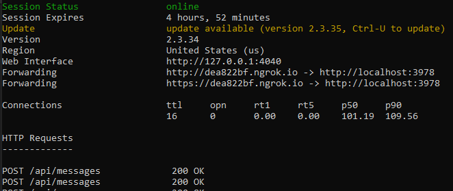

# <a name="add-authentication-to-your-teams-bot"></a><span data-ttu-id="fac76-103">Добавить аутентификацию к вашему Teams боту</span><span class="sxs-lookup"><span data-stu-id="fac76-103">Add authentication to your Teams bot</span></span>

<span data-ttu-id="fac76-104">Есть моменты, когда вам может понадобиться создать ботов в Microsoft Teams которые могут получить доступ к ресурсам от имени пользователя, таких как почтовая служба.</span><span class="sxs-lookup"><span data-stu-id="fac76-104">There are times when you may need to create bots in Microsoft Teams that can access resources on behalf of the user, such as a mail service.</span></span>

<span data-ttu-id="fac76-105">Эта статья демонстрирует, как использовать Azure Bot Service v4 SDK аутентификации, на основе OAuth 2.0.</span><span class="sxs-lookup"><span data-stu-id="fac76-105">This article demonstrates how to use Azure Bot Service v4 SDK authentication, based on OAuth 2.0.</span></span> <span data-ttu-id="fac76-106">Это упрощает разработку бота, который может использовать токены аутентификации на основе учетных данных пользователя.</span><span class="sxs-lookup"><span data-stu-id="fac76-106">This makes it easier to develop a bot that can use authentication tokens based on the user's credentials.</span></span> <span data-ttu-id="fac76-107">Ключевым во всем этом является использование идентификации **поставщиков,** как мы увидим позже.</span><span class="sxs-lookup"><span data-stu-id="fac76-107">Key in all this is the use of **identity providers**, as we will see later.</span></span>

<span data-ttu-id="fac76-108">OAuth 2.0 — это открытый стандарт проверки подлинности и авторизации, используемый Azure Active Directory (Azure AD) и многими другими поставщиками удостоверений.</span><span class="sxs-lookup"><span data-stu-id="fac76-108">OAuth 2.0 is an open standard for authentication and authorization used by Azure Active Directory (Azure AD) and many other identity providers.</span></span> <span data-ttu-id="fac76-109">Базовое понимание OAuth 2.0 является необходимым условием для работы с аутентификацией в Teams.</span><span class="sxs-lookup"><span data-stu-id="fac76-109">A basic understanding of OAuth 2.0 is a prerequisite for working with authentication in Teams.</span></span>

<span data-ttu-id="fac76-110">Смотрите [OAuth 2 Упрощенный для](https://aka.ms/oauth2-simplified) базового понимания, и [OAuth 2.0 для](https://oauth.net/2/) полной спецификации.</span><span class="sxs-lookup"><span data-stu-id="fac76-110">See [OAuth 2 Simplified](https://aka.ms/oauth2-simplified) for a basic understanding, and [OAuth 2.0](https://oauth.net/2/) for the complete specification.</span></span>

<span data-ttu-id="fac76-111">Для получения дополнительной информации о том, как служба Azure Bot обрабатывает аутентификацию, [см.](https://aka.ms/azure-bot-authentication)</span><span class="sxs-lookup"><span data-stu-id="fac76-111">For more information about how the Azure Bot Service handles authentication, see [User authentication within a conversation](https://aka.ms/azure-bot-authentication).</span></span>

<span data-ttu-id="fac76-112">В данной статье вы узнаете следующее.</span><span class="sxs-lookup"><span data-stu-id="fac76-112">In this article you'll learn:</span></span>

- <span data-ttu-id="fac76-113">**Как создать бот с поддержкой аутентификации.**</span><span class="sxs-lookup"><span data-stu-id="fac76-113">**How to create an authentication-enabled bot**.</span></span> <span data-ttu-id="fac76-114">Вы будете использовать [cs-auth-образец для][teams-auth-bot-cs] обработки учетных данных входа пользователя и генерации маркера аутентификации.</span><span class="sxs-lookup"><span data-stu-id="fac76-114">You'll use [cs-auth-sample][teams-auth-bot-cs] to handle user sign-in credentials and the generating the authentication token.</span></span>
- <span data-ttu-id="fac76-115">**Как развернуть бота в Azure и связать его с поставщиком идентификационных данных.**</span><span class="sxs-lookup"><span data-stu-id="fac76-115">**How to deploy the bot to Azure and associate it with an identity provider**.</span></span> <span data-ttu-id="fac76-116">Поставщик выдает токен на основе учетных данных входа пользователя.</span><span class="sxs-lookup"><span data-stu-id="fac76-116">The provider issues a token based on user sign-in credentials.</span></span> <span data-ttu-id="fac76-117">Бот может использовать токен для доступа к ресурсам, таким как почтовая служба, которые требуют проверки подлинности.</span><span class="sxs-lookup"><span data-stu-id="fac76-117">The bot can use the token to access resources, such as a mail service, which require authentication.</span></span> <span data-ttu-id="fac76-118">Для получения дополнительной информации [Microsoft Teams потока аутентификации для ботов.](auth-flow-bot.md)</span><span class="sxs-lookup"><span data-stu-id="fac76-118">For more information see  [Microsoft Teams authentication flow for bots](auth-flow-bot.md).</span></span>
- <span data-ttu-id="fac76-119">**Как интегрировать бота в Microsoft Teams.**</span><span class="sxs-lookup"><span data-stu-id="fac76-119">**How to integrate the bot within Microsoft Teams**.</span></span> <span data-ttu-id="fac76-120">После интеграции бота можно войти в систему и обменяться с ним сообщениями в чате.</span><span class="sxs-lookup"><span data-stu-id="fac76-120">Once the bot has been integrated, you can sign in and exchange messages with it in a chat.</span></span>

## <a name="prerequisites"></a><span data-ttu-id="fac76-121">Предварительные требования</span><span class="sxs-lookup"><span data-stu-id="fac76-121">Prerequisites</span></span>

- <span data-ttu-id="fac76-122">Знание основ [бота,][concept-basics] [управление состоянием,][concept-state] [библиотека диалогов,][concept-dialogs]и [как реализовать последовательный поток разговоров.][simple-dialog]</span><span class="sxs-lookup"><span data-stu-id="fac76-122">Knowledge of [bot basics][concept-basics], [managing state][concept-state], the [dialogs library][concept-dialogs], and how to [implement sequential conversation flow][simple-dialog].</span></span>
- <span data-ttu-id="fac76-123">Знание разработки Azure и OAuth 2.0.</span><span class="sxs-lookup"><span data-stu-id="fac76-123">Knowledge of Azure and OAuth 2.0 development.</span></span>
- <span data-ttu-id="fac76-124">Текущие версии Visual Studio Git.</span><span class="sxs-lookup"><span data-stu-id="fac76-124">The current versions of Visual Studio and Git.</span></span>
- <span data-ttu-id="fac76-125">Учетная запись Azure.</span><span class="sxs-lookup"><span data-stu-id="fac76-125">Azure account.</span></span> <span data-ttu-id="fac76-126">При необходимости можно создать бесплатную [учетную запись Azure.](https://azure.microsoft.com/free/)</span><span class="sxs-lookup"><span data-stu-id="fac76-126">If needed, you can create an [Azure free account](https://azure.microsoft.com/free/).</span></span>
- <span data-ttu-id="fac76-127">Следующий пример:</span><span class="sxs-lookup"><span data-stu-id="fac76-127">The following sample:</span></span>

    | <span data-ttu-id="fac76-128">Пример</span><span class="sxs-lookup"><span data-stu-id="fac76-128">Sample</span></span> | <span data-ttu-id="fac76-129">Версия Для Ботбилдер</span><span class="sxs-lookup"><span data-stu-id="fac76-129">BotBuilder version</span></span> | <span data-ttu-id="fac76-130">Показано</span><span class="sxs-lookup"><span data-stu-id="fac76-130">Demonstrates</span></span> |
    |:---|:---:|:---|
    | <span data-ttu-id="fac76-131">**Бот аутентификации** [в cs-auth-образец][teams-auth-bot-cs]</span><span class="sxs-lookup"><span data-stu-id="fac76-131">**Bot authentication** in [cs-auth-sample][teams-auth-bot-cs]</span></span> | <span data-ttu-id="fac76-132">v4</span><span class="sxs-lookup"><span data-stu-id="fac76-132">v4</span></span> | <span data-ttu-id="fac76-133">Поддержка OAuthCard</span><span class="sxs-lookup"><span data-stu-id="fac76-133">OAuthCard support</span></span> |
    | <span data-ttu-id="fac76-134">**Бот аутентификации** [в js-auth-образец][teams-auth-bot-js]</span><span class="sxs-lookup"><span data-stu-id="fac76-134">**Bot authentication** in [js-auth-sample][teams-auth-bot-js]</span></span> | <span data-ttu-id="fac76-135">v4</span><span class="sxs-lookup"><span data-stu-id="fac76-135">v4</span></span>| <span data-ttu-id="fac76-136">Поддержка OAuthCard</span><span class="sxs-lookup"><span data-stu-id="fac76-136">OAuthCard support</span></span>  |
    | <span data-ttu-id="fac76-137">**Бот аутентификации** [в py-auth-образец][teams-auth-bot-py]</span><span class="sxs-lookup"><span data-stu-id="fac76-137">**Bot authentication** in [py-auth-sample][teams-auth-bot-py]</span></span> | <span data-ttu-id="fac76-138">v4</span><span class="sxs-lookup"><span data-stu-id="fac76-138">v4</span></span> | <span data-ttu-id="fac76-139">Поддержка OAuthCard</span><span class="sxs-lookup"><span data-stu-id="fac76-139">OAuthCard support</span></span> |

## <a name="create-the-resource-group"></a><span data-ttu-id="fac76-140">Создание группы ресурсов</span><span class="sxs-lookup"><span data-stu-id="fac76-140">Create the resource group</span></span>

<span data-ttu-id="fac76-141">Группа ресурсов и план обслуживания не являются строго необходимыми, но они позволяют удобно выпускать ресурсы, которые вы создаете.</span><span class="sxs-lookup"><span data-stu-id="fac76-141">The resource group and the service plan aren't strictly necessary, but they allow you to conveniently release the resources you create.</span></span> <span data-ttu-id="fac76-142">Это хорошая практика для поддержания ваших ресурсов организованы и управляемым.</span><span class="sxs-lookup"><span data-stu-id="fac76-142">This is good practice for keeping your resources organized and manageable.</span></span>

<span data-ttu-id="fac76-143">Вы используете группу ресурсов для создания отдельных ресурсов для Bot Framework.</span><span class="sxs-lookup"><span data-stu-id="fac76-143">You use a resource group to create individual resources for the Bot Framework.</span></span> <span data-ttu-id="fac76-144">Для обеспечения производительности убедитесь, что эти ресурсы расположены в том же регионе Azure.</span><span class="sxs-lookup"><span data-stu-id="fac76-144">For performance, ensure that these resources are located in the same Azure region.</span></span>

1. <span data-ttu-id="fac76-145">В браузере вопишитесь на [**портал Azure.**][azure-portal]</span><span class="sxs-lookup"><span data-stu-id="fac76-145">In your browser, sign into the [**Azure portal**][azure-portal].</span></span>
1. <span data-ttu-id="fac76-146">В левой навигационной панели выберите **группы ресурсов.**</span><span class="sxs-lookup"><span data-stu-id="fac76-146">In the left navigation panel, select **Resource groups**.</span></span>
1. <span data-ttu-id="fac76-147">В левом верхнем левом верхнем левом от отображаемого окна выберите **вкладку Добавить** для создания новой группы ресурсов.</span><span class="sxs-lookup"><span data-stu-id="fac76-147">In the upper left of the displayed window, select **Add** tab to create a new resource group.</span></span> <span data-ttu-id="fac76-148">Вам будет предложено предоставить следующее:</span><span class="sxs-lookup"><span data-stu-id="fac76-148">You'll be prompted to provide the following:</span></span>
    1. <span data-ttu-id="fac76-149">**Подписка**.</span><span class="sxs-lookup"><span data-stu-id="fac76-149">**Subscription**.</span></span> <span data-ttu-id="fac76-150">Используйте существующую подписку.</span><span class="sxs-lookup"><span data-stu-id="fac76-150">Use your existing subscription.</span></span>
    1. <span data-ttu-id="fac76-151">**Ресурсная группа**.</span><span class="sxs-lookup"><span data-stu-id="fac76-151">**Resource group**.</span></span> <span data-ttu-id="fac76-152">Введите название группы ресурсов.</span><span class="sxs-lookup"><span data-stu-id="fac76-152">Enter the name for the resource group.</span></span> <span data-ttu-id="fac76-153">Примером может быть  *TeamsResourceGroup*.</span><span class="sxs-lookup"><span data-stu-id="fac76-153">An example could be  *TeamsResourceGroup*.</span></span> <span data-ttu-id="fac76-154">Помните, что имя должно быть уникальным.</span><span class="sxs-lookup"><span data-stu-id="fac76-154">Remember that the name must be unique.</span></span>
    1. <span data-ttu-id="fac76-155">Из **меню «Регион»** выберите *Западный США или* регион, близкий к вашим приложениям.</span><span class="sxs-lookup"><span data-stu-id="fac76-155">From the **Region** drop-down menu, select *West US*, or a region close to your applications.</span></span>
    1. <span data-ttu-id="fac76-156">Выберите **обзор и создайте кнопку.**</span><span class="sxs-lookup"><span data-stu-id="fac76-156">Select the **Review and create** button.</span></span> <span data-ttu-id="fac76-157">Вы должны увидеть баннер, который читает *Проверка прошла*.</span><span class="sxs-lookup"><span data-stu-id="fac76-157">You should see a banner that reads *Validation passed*.</span></span>
    1. <span data-ttu-id="fac76-158">Выберите **кнопку** «Создать».</span><span class="sxs-lookup"><span data-stu-id="fac76-158">Select the **Create** button.</span></span> <span data-ttu-id="fac76-159">Создание группы ресурсов может занять несколько минут.</span><span class="sxs-lookup"><span data-stu-id="fac76-159">It may take a few minutes to create the resource group.</span></span>

> [!TIP]
> <span data-ttu-id="fac76-160">Как и в случае с ресурсами, которые вы создадите позже в этом учебнике, это хорошая идея, чтобы приколоть эту группу ресурсов к панели мониторинга для легкого доступа.</span><span class="sxs-lookup"><span data-stu-id="fac76-160">As with the resources you'll create later in this tutorial, it's a good idea to pin this resource group to your dashboard for easy access.</span></span> <span data-ttu-id="fac76-161">Если вы хотите сделать это, выберите значок контактный &#128204; в правом верхнем правом верхнем справа от приборной панели.</span><span class="sxs-lookup"><span data-stu-id="fac76-161">If you'd like to do so, select the pin icon &#128204; in the upper right of the dashboard.</span></span>

## <a name="create-the-service-plan"></a><span data-ttu-id="fac76-162">Создание плана обслуживания</span><span class="sxs-lookup"><span data-stu-id="fac76-162">Create the service plan</span></span>

1. <span data-ttu-id="fac76-163">На портале [**Azure,**][azure-portal]на левой навигационной панели, **выберите Создать ресурс.**</span><span class="sxs-lookup"><span data-stu-id="fac76-163">In the [**Azure portal**][azure-portal], on the left navigation panel, select **Create a resource**.</span></span>
1. <span data-ttu-id="fac76-164">В поле поиска ввет *план обслуживания приложений.*</span><span class="sxs-lookup"><span data-stu-id="fac76-164">In the search box, type *App Service Plan*.</span></span> <span data-ttu-id="fac76-165">Выберите **карту Плана обслуживания** приложений из результатов поиска.</span><span class="sxs-lookup"><span data-stu-id="fac76-165">Select the **App Service Plan** card from the search results.</span></span>
1. <span data-ttu-id="fac76-166">Выберите пункт **Создать**.</span><span class="sxs-lookup"><span data-stu-id="fac76-166">Select **Create**.</span></span>
1. <span data-ttu-id="fac76-167">Вам будет предложено предоставить следующую информацию:</span><span class="sxs-lookup"><span data-stu-id="fac76-167">You'll be asked to provide the following information:</span></span>
    1. <span data-ttu-id="fac76-168">**Подписка**.</span><span class="sxs-lookup"><span data-stu-id="fac76-168">**Subscription**.</span></span> <span data-ttu-id="fac76-169">Можно использовать существующую подписку.</span><span class="sxs-lookup"><span data-stu-id="fac76-169">You can use an existing subscription.</span></span>
    1. <span data-ttu-id="fac76-170">**Ресурсная группа**.</span><span class="sxs-lookup"><span data-stu-id="fac76-170">**Resource Group**.</span></span> <span data-ttu-id="fac76-171">Выберите группу, которую вы создали ранее.</span><span class="sxs-lookup"><span data-stu-id="fac76-171">Select the group you created earlier.</span></span>
    1. <span data-ttu-id="fac76-172">**Имя**.</span><span class="sxs-lookup"><span data-stu-id="fac76-172">**Name**.</span></span> <span data-ttu-id="fac76-173">Введите название плана обслуживания.</span><span class="sxs-lookup"><span data-stu-id="fac76-173">Enter the name for the service plan.</span></span> <span data-ttu-id="fac76-174">Примером может быть  *TeamsServicePlan*.</span><span class="sxs-lookup"><span data-stu-id="fac76-174">An example could be  *TeamsServicePlan*.</span></span> <span data-ttu-id="fac76-175">Помните, что название должно быть уникальным, в группе.</span><span class="sxs-lookup"><span data-stu-id="fac76-175">Remember that the name must be unique, within the group.</span></span>
    1. <span data-ttu-id="fac76-176">**Операционная система**.</span><span class="sxs-lookup"><span data-stu-id="fac76-176">**Operating System**.</span></span> <span data-ttu-id="fac76-177">Выберите *Windows* или применимую ОС.</span><span class="sxs-lookup"><span data-stu-id="fac76-177">Select *Windows* or your applicable OS.</span></span>
    1. <span data-ttu-id="fac76-178">**Регион**.</span><span class="sxs-lookup"><span data-stu-id="fac76-178">**Region**.</span></span> <span data-ttu-id="fac76-179">Выберите *Западную США* или регион, близкий к вашим приложениям.</span><span class="sxs-lookup"><span data-stu-id="fac76-179">Select *West US* or a region close to your applications.</span></span>
    1. <span data-ttu-id="fac76-180">**Уровень ценообразования**.</span><span class="sxs-lookup"><span data-stu-id="fac76-180">**Pricing Tier**.</span></span> <span data-ttu-id="fac76-181">Убедитесь, *что выбран стандартный S1.*</span><span class="sxs-lookup"><span data-stu-id="fac76-181">Make sure that *Standard S1* is selected.</span></span> <span data-ttu-id="fac76-182">Это должно быть значение по умолчанию.</span><span class="sxs-lookup"><span data-stu-id="fac76-182">This should be the default value.</span></span>
    1. <span data-ttu-id="fac76-183">Выберите **обзор и создайте кнопку.**</span><span class="sxs-lookup"><span data-stu-id="fac76-183">Select the **Review and create** button.</span></span> <span data-ttu-id="fac76-184">Вы должны увидеть баннер, который читает *Проверка прошла*.</span><span class="sxs-lookup"><span data-stu-id="fac76-184">You should see a banner that reads *Validation passed*.</span></span>
    1. <span data-ttu-id="fac76-185">Выберите пункт **Создать**.</span><span class="sxs-lookup"><span data-stu-id="fac76-185">Select **Create**.</span></span> <span data-ttu-id="fac76-186">Создание плана обслуживания приложений может занять несколько минут.</span><span class="sxs-lookup"><span data-stu-id="fac76-186">It may take a few minutes to create the app service plan.</span></span> <span data-ttu-id="fac76-187">План будет указан в ресурсной группе.</span><span class="sxs-lookup"><span data-stu-id="fac76-187">The plan will be listed in the resource group.</span></span>

## <a name="create-the-bot-channels-registration"></a><span data-ttu-id="fac76-188">Создание регистрации бот-каналов</span><span class="sxs-lookup"><span data-stu-id="fac76-188">Create the bot channels registration</span></span>

<span data-ttu-id="fac76-189">Регистрация бот-каналов регистрирует ваш веб-сервис в качестве бота с Bot Framework, при условии, что у вас есть пароль Microsoft App Id и App (секрет клиента).</span><span class="sxs-lookup"><span data-stu-id="fac76-189">The bot channels registration registers your web service as a bot with the Bot Framework, provided you have a Microsoft App Id and App password (client secret).</span></span>

> [!IMPORTANT]
> <span data-ttu-id="fac76-190">Вам нужно зарегистрировать бота только в том случае, если он не размещен в Azure.</span><span class="sxs-lookup"><span data-stu-id="fac76-190">You only need to register your bot if it is not hosted in Azure.</span></span> <span data-ttu-id="fac76-191">Если [вы создали бота](/azure/bot-service/abs-quickstart?view=azure-bot-service-4.0&viewFallbackFrom=azure-bot-service-3.0&preserve-view=true) через портал Azure, то он уже зарегистрирован в службе.</span><span class="sxs-lookup"><span data-stu-id="fac76-191">If you [created a bot](/azure/bot-service/abs-quickstart?view=azure-bot-service-4.0&viewFallbackFrom=azure-bot-service-3.0&preserve-view=true) through the Azure portal then it is already registered with the service.</span></span> <span data-ttu-id="fac76-192">Если вы создали бота [через Bot Framework](https://dev.botframework.com/bots/new) или [AppStudio,](~/concepts/build-and-test/app-studio-overview.md) ваш бот не зарегистрирован в Azure.</span><span class="sxs-lookup"><span data-stu-id="fac76-192">If you created your bot through the [Bot Framework](https://dev.botframework.com/bots/new) or [AppStudio](~/concepts/build-and-test/app-studio-overview.md) your bot isn't registered in Azure.</span></span>

[!INCLUDE [bot channels registration steps](~/includes/bots/azure-bot-channels-registration.md)]

> [!NOTE]
> <span data-ttu-id="fac76-193">Ресурс регистрации Бот-каналов покажет Глобальный **регион,** даже если вы выбрали Западную США.</span><span class="sxs-lookup"><span data-stu-id="fac76-193">The Bot Channels Registration resource will show the **Global** region even if you selected West US.</span></span> <span data-ttu-id="fac76-194">Это ожидается.</span><span class="sxs-lookup"><span data-stu-id="fac76-194">This is expected.</span></span>

<span data-ttu-id="fac76-195">Для получения дополнительной информации [с Teams м.](../create-a-bot-for-teams.md)</span><span class="sxs-lookup"><span data-stu-id="fac76-195">For more information, see [Create a bot for Teams](../create-a-bot-for-teams.md).</span></span>

## <a name="create-the-identity-provider"></a><span data-ttu-id="fac76-196">Создание поставщика идентификационных данных</span><span class="sxs-lookup"><span data-stu-id="fac76-196">Create the identity provider</span></span>

<span data-ttu-id="fac76-197">Вам нужен поставщик идентификационных данных, который может быть использован для проверки подлинности.</span><span class="sxs-lookup"><span data-stu-id="fac76-197">You need an identity provider that can be used for authentication.</span></span>
<span data-ttu-id="fac76-198">В этой процедуре вы будете использовать поставщика AD Azure; могут также использоваться другие поддерживаемые Azure AD поставщики идентификаций.</span><span class="sxs-lookup"><span data-stu-id="fac76-198">In this procedure you'll use an Azure AD provider; other Azure AD supported identity providers can also be used.</span></span>

1. <span data-ttu-id="fac76-199">На портале [**Azure,**][azure-portal]на левой навигационной панели, **выберите Azure Active Directory.**</span><span class="sxs-lookup"><span data-stu-id="fac76-199">In the [**Azure portal**][azure-portal], on the left navigation panel, select **Azure Active Directory**.</span></span>
    > [!TIP]
    > <span data-ttu-id="fac76-200">Вам нужно будет создать и зарегистрировать этот ресурс Azure AD в арендаторе, в котором вы можете дать согласие на делегирование разрешений, запрошенных приложением.</span><span class="sxs-lookup"><span data-stu-id="fac76-200">You'll need to create and register this Azure AD resource in a tenant in which you can consent to delegate permissions requested by an application.</span></span>
    > <span data-ttu-id="fac76-201">Для получения инструкций по созданию [арендатора, см. Доступ к порталу и создать арендатора](/azure/active-directory/fundamentals/active-directory-access-create-new-tenant).</span><span class="sxs-lookup"><span data-stu-id="fac76-201">For instruction on creating a tenant, see [Access the portal and create a tenant](/azure/active-directory/fundamentals/active-directory-access-create-new-tenant).</span></span>
1. <span data-ttu-id="fac76-202">В левой панели выберите **регистрацию приложений.**</span><span class="sxs-lookup"><span data-stu-id="fac76-202">In the left panel, select **App registrations**.</span></span>
1. <span data-ttu-id="fac76-203">В правой панели выберите **новую регистрационную** вкладку в левом верхнем направлении.</span><span class="sxs-lookup"><span data-stu-id="fac76-203">In the right panel, select the **New registration** tab, in the upper left.</span></span>
1. <span data-ttu-id="fac76-204">Вам будет предложено предоставить следующую информацию:</span><span class="sxs-lookup"><span data-stu-id="fac76-204">You'll be asked to provide the following information:</span></span>
   1. <span data-ttu-id="fac76-205">**Имя**.</span><span class="sxs-lookup"><span data-stu-id="fac76-205">**Name**.</span></span> <span data-ttu-id="fac76-206">Введите название приложения.</span><span class="sxs-lookup"><span data-stu-id="fac76-206">Enter the name for the application.</span></span> <span data-ttu-id="fac76-207">Примером может быть  *BotTeamsIdentity*.</span><span class="sxs-lookup"><span data-stu-id="fac76-207">An example could be  *BotTeamsIdentity*.</span></span> <span data-ttu-id="fac76-208">Помните, что имя должно быть уникальным.</span><span class="sxs-lookup"><span data-stu-id="fac76-208">Remember that the name must be unique.</span></span>
   1. <span data-ttu-id="fac76-209">Выберите **типы поддерживаемых счетов** для приложения.</span><span class="sxs-lookup"><span data-stu-id="fac76-209">Select the **Supported account types** for your application.</span></span> <span data-ttu-id="fac76-210">Выберите *учетные записи в любом организационном каталоге (Любой каталог Azure AD - Multitenant) и личные учетные записи Майкрософт (например, Skype, Xbox).*</span><span class="sxs-lookup"><span data-stu-id="fac76-210">Select *Accounts in any organizational directory (Any Azure AD directory - Multitenant) and personal Microsoft accounts (e.g. Skype, Xbox)*.</span></span>
   1. <span data-ttu-id="fac76-211">Для **перенаправления URI**:</span><span class="sxs-lookup"><span data-stu-id="fac76-211">For the **Redirect URI**:</span></span><br/>
       <span data-ttu-id="fac76-212">&#x2713;Выберите **веб**.</span><span class="sxs-lookup"><span data-stu-id="fac76-212">&#x2713;Select **Web**.</span></span> <br/>
       <span data-ttu-id="fac76-213">&#x2713; Установите `https://token.botframework.com/.auth/web/redirect` URL-</span><span class="sxs-lookup"><span data-stu-id="fac76-213">&#x2713; Set the URL to `https://token.botframework.com/.auth/web/redirect`.</span></span>
   1. <span data-ttu-id="fac76-214">Нажмите **Зарегистрировать**.</span><span class="sxs-lookup"><span data-stu-id="fac76-214">Select **Register**.</span></span>

1. <span data-ttu-id="fac76-215">После его создания Azure отображает страницу **Обзора** для приложения.</span><span class="sxs-lookup"><span data-stu-id="fac76-215">Once it is created, Azure displays the **Overview** page for the app.</span></span> <span data-ttu-id="fac76-216">Копировать и сохранить следующую информацию в файл:</span><span class="sxs-lookup"><span data-stu-id="fac76-216">Copy and save the following information to a file:</span></span>

    1. <span data-ttu-id="fac76-217">**Идентификационное значение приложения (клиента).**</span><span class="sxs-lookup"><span data-stu-id="fac76-217">The **Application (client) ID** value.</span></span> <span data-ttu-id="fac76-218">Вы будете использовать это значение позже в качестве *идентификатора клиента* при регистрации этого приложения идентификации Azure с вашим ботом.</span><span class="sxs-lookup"><span data-stu-id="fac76-218">You'll use this value later as the *Client ID* when you register this Azure identity application with your bot.</span></span>
    1. <span data-ttu-id="fac76-219">Значение **идентификатора каталога (арендатора).**</span><span class="sxs-lookup"><span data-stu-id="fac76-219">The **Directory (tenant) ID** value.</span></span> <span data-ttu-id="fac76-220">Вы также будете использовать это значение позже в качестве *идентификатора арендатора для* регистрации этого приложения идентификации Azure с вашим ботом.</span><span class="sxs-lookup"><span data-stu-id="fac76-220">You'll also use this value later as the *Tenant ID* to register this Azure identity application with your bot.</span></span>

1. <span data-ttu-id="fac76-221">В левой панели **выберите сертификаты & секреты** для создания клиентской тайны для вашего приложения.</span><span class="sxs-lookup"><span data-stu-id="fac76-221">In the left panel, select **Certificates & secrets** to create a client secret for your application.</span></span>

   1. <span data-ttu-id="fac76-222">Под **секретами** клиента, выберите &#x2795; **секрет нового клиента.**</span><span class="sxs-lookup"><span data-stu-id="fac76-222">Under **Client secrets**, select &#x2795; **New client secret**.</span></span>
   1. <span data-ttu-id="fac76-223">Добавьте описание, чтобы идентифицировать этот секрет от других, которые вам могут понадобиться создать для этого приложения, *такие как приложение идентификации Bot в Teams.*</span><span class="sxs-lookup"><span data-stu-id="fac76-223">Add a description to identify this secret from others you might need to create for this app, such as *Bot identity app in Teams*.</span></span>
   1. <span data-ttu-id="fac76-224">Срок **действия набора** истекает в выборе.</span><span class="sxs-lookup"><span data-stu-id="fac76-224">Set **Expires** to your selection.</span></span>
   1. <span data-ttu-id="fac76-225">Нажмите **Добавить**.</span><span class="sxs-lookup"><span data-stu-id="fac76-225">Select **Add**.</span></span>
   1. <span data-ttu-id="fac76-226">Перед тем, как покинуть эту **страницу, завехать секрет**.</span><span class="sxs-lookup"><span data-stu-id="fac76-226">Before leaving this page, **record the secret**.</span></span> <span data-ttu-id="fac76-227">Вы будете использовать это значение позже в _качестве секрета Клиента_ при регистрации приложения Azure AD с вашим ботом.</span><span class="sxs-lookup"><span data-stu-id="fac76-227">You'll use this value later as the _Client secret_ when you register your Azure AD application with your bot.</span></span>

### <a name="configure-the-identity-provider-connection-and-register-it-with-the-bot"></a><span data-ttu-id="fac76-228">Настройте соединение поставщика идентификационных данных и зарегистрируйте его у бота</span><span class="sxs-lookup"><span data-stu-id="fac76-228">Configure the identity provider connection and register it with the bot</span></span>

<span data-ttu-id="fac76-229">Примечание-Есть два варианта для поставщиков услуг здесь-Azure AD V1 и Azure AD V2.</span><span class="sxs-lookup"><span data-stu-id="fac76-229">Note-there are two options for Service Providers here-Azure AD V1 and Azure AD V2.</span></span>  <span data-ttu-id="fac76-230">Различия между двумя поставщиками суммируются здесь, [но](/azure/active-directory/azuread-dev/azure-ad-endpoint-comparison)в целом, V2 обеспечивает большую гибкость в отношении изменения разрешений бота.</span><span class="sxs-lookup"><span data-stu-id="fac76-230">The differences between the two providers are summarized [here](/azure/active-directory/azuread-dev/azure-ad-endpoint-comparison), but in general, V2 provides more flexibility with respect to changing bot permissions.</span></span>  <span data-ttu-id="fac76-231">Graph Разрешения API перечислены в поле областей, и по мере добавления новых боты позволят пользователям соглашаться на новые разрешения при следующем вписав в систему.</span><span class="sxs-lookup"><span data-stu-id="fac76-231">Graph API permissions are listed in the scopes field, and as new ones are added, bots will allow users to consent to the new permissions on the next sign in.</span></span>  <span data-ttu-id="fac76-232">Для V1 согласие бота должно быть удалено пользователем для получения новых разрешений в диалоге OAuth.</span><span class="sxs-lookup"><span data-stu-id="fac76-232">For V1, the bot consent must be deleted by the user for new permissions to be prompted in the OAuth dialog.</span></span> 

#### <a name="azure-ad-v1"></a><span data-ttu-id="fac76-233">Лазурный АД V1</span><span class="sxs-lookup"><span data-stu-id="fac76-233">Azure AD V1</span></span>

1. <span data-ttu-id="fac76-234">На портале [**Azure выберите**][azure-portal]группу ресурсов из панели мониторинга.</span><span class="sxs-lookup"><span data-stu-id="fac76-234">In the [**Azure portal**][azure-portal], select your resource group from the dashboard.</span></span>
1. <span data-ttu-id="fac76-235">Выберите ссылку на регистрацию бот-канала.</span><span class="sxs-lookup"><span data-stu-id="fac76-235">Select your bot channel registration link.</span></span>
1. <span data-ttu-id="fac76-236">Откройте страницу ресурса и выберите **конфигурацию** под **Параметры**.</span><span class="sxs-lookup"><span data-stu-id="fac76-236">Open the resource page and select **Configuration** under **Settings**.</span></span> 
1. <span data-ttu-id="fac76-237">Выберите **Добавить OAuth Соединение Параметры**.</span><span class="sxs-lookup"><span data-stu-id="fac76-237">Select **Add OAuth Connection Settings**.</span></span>    
<span data-ttu-id="fac76-238">Следующее изображение отображает соответствующий выбор на странице ресурса:</span><span class="sxs-lookup"><span data-stu-id="fac76-238">The following image displays the corresponding selection in the resource page:</span></span>  
<span data-ttu-id="fac76-239"></span><span class="sxs-lookup"><span data-stu-id="fac76-239"></span></span>
1. <span data-ttu-id="fac76-240">Заполните форму следующим образом:</span><span class="sxs-lookup"><span data-stu-id="fac76-240">Complete the form as follows:</span></span>

    1. <span data-ttu-id="fac76-241">**Имя**.</span><span class="sxs-lookup"><span data-stu-id="fac76-241">**Name**.</span></span> <span data-ttu-id="fac76-242">Введите имя для соединения.</span><span class="sxs-lookup"><span data-stu-id="fac76-242">Enter a name for the connection.</span></span> <span data-ttu-id="fac76-243">Вы будете использовать это имя в вашем боте в `appsettings.json` файле.</span><span class="sxs-lookup"><span data-stu-id="fac76-243">You'll use this name in your bot in the `appsettings.json` file.</span></span> <span data-ttu-id="fac76-244">Например *BotTeamsAuthADv1*.</span><span class="sxs-lookup"><span data-stu-id="fac76-244">For example *BotTeamsAuthADv1*.</span></span>
    1. <span data-ttu-id="fac76-245">**Поставщик услуг**.</span><span class="sxs-lookup"><span data-stu-id="fac76-245">**Service Provider**.</span></span> <span data-ttu-id="fac76-246">Выберите **Azure Active Directory**.</span><span class="sxs-lookup"><span data-stu-id="fac76-246">Select **Azure Active Directory**.</span></span> <span data-ttu-id="fac76-247">После выбора этого поля Azure AD будут отображаться.</span><span class="sxs-lookup"><span data-stu-id="fac76-247">Once you select this, the Azure AD-specific fields will be displayed.</span></span>
    1. <span data-ttu-id="fac76-248">**Идентификатор клиента**. Введите идентификатор приложения (клиента), который вы записали для приложения поставщика идентификационных данных Azure в вышеуказанных шагах.</span><span class="sxs-lookup"><span data-stu-id="fac76-248">**Client id**. Enter the Application (client) ID that you recorded for your Azure identity provider app in the steps above.</span></span>
    1. <span data-ttu-id="fac76-249">**Секрет клиента**.</span><span class="sxs-lookup"><span data-stu-id="fac76-249">**Client secret**.</span></span> <span data-ttu-id="fac76-250">Введите секрет, записанный для приложения поставщика идентификационных данных Azure, в вышеуказанных шагах.</span><span class="sxs-lookup"><span data-stu-id="fac76-250">Enter the secret that you recorded for your Azure identity provider app in the steps above.</span></span>
    1. <span data-ttu-id="fac76-251">**Тип гранта**.</span><span class="sxs-lookup"><span data-stu-id="fac76-251">**Grant Type**.</span></span> <span data-ttu-id="fac76-252">Введите `authorization_code` .</span><span class="sxs-lookup"><span data-stu-id="fac76-252">Enter `authorization_code`.</span></span>
    1. <span data-ttu-id="fac76-253">**URL-адрес входа**.</span><span class="sxs-lookup"><span data-stu-id="fac76-253">**Login URL**.</span></span> <span data-ttu-id="fac76-254">Введите `https://login.microsoftonline.com` .</span><span class="sxs-lookup"><span data-stu-id="fac76-254">Enter `https://login.microsoftonline.com`.</span></span>
    1. <span data-ttu-id="fac76-255">**Идентификатор арендатора,** введите **идентификатор каталога (арендатора), который вы записали** ранее для приложения для идентификации Azure или общее в зависимости от поддерживаемого типа учетной записи, выбранного при создания приложения поставщика идентификационных данных. </span><span class="sxs-lookup"><span data-stu-id="fac76-255">**Tenant ID**, enter the **Directory (tenant) ID** that you recorded earlier for your Azure identity app or **common** depending on the supported account type selected when you created the identity provider app.</span></span> <span data-ttu-id="fac76-256">Чтобы решить, какое значение назначить следовать этим критериям:</span><span class="sxs-lookup"><span data-stu-id="fac76-256">To decide which value to assign follow these criteria:</span></span>

        - <span data-ttu-id="fac76-257">Если вы выбрали либо *учетные записи в этом организационном каталоге (только Microsoft - Единый арендатор),* либо учетные записи в любом *организационном каталоге (каталог Microsoft AAD - Multi tenant) введите* **идентификатор арендатора, который** вы записали ранее для приложения AAD.</span><span class="sxs-lookup"><span data-stu-id="fac76-257">If you selected either *Accounts in this organizational directory only (Microsoft only - Single tenant)* or *Accounts in any organizational directory(Microsoft AAD directory - Multi tenant)* enter the **tenant ID** you recorded earlier for the AAD app.</span></span> <span data-ttu-id="fac76-258">Это будет арендатор, связанный с пользователями, которые могут быть проверены.</span><span class="sxs-lookup"><span data-stu-id="fac76-258">This will be the tenant associated with the users who can be authenticated.</span></span>

        - <span data-ttu-id="fac76-259">Если вы выбрали *Учетные записи в любом организационном каталоге (Любой каталог AAD - Multi tenant и личные учетные записи Майкрософт, например, Skype, Xbox, Outlook) введите слово,* **распространенное** вместо идентификатора арендатора.</span><span class="sxs-lookup"><span data-stu-id="fac76-259">If you selected *Accounts in any organizational directory (Any AAD directory - Multi tenant and personal Microsoft accounts e.g. Skype, Xbox, Outlook)* enter the word **common** instead of a tenant ID.</span></span> <span data-ttu-id="fac76-260">В противном случае приложение AAD проверит через арендатора, чей идентификатор был выбран, и исключит личные учетные записи Майкрософт.</span><span class="sxs-lookup"><span data-stu-id="fac76-260">Otherwise, the AAD app will verify through the tenant whose ID was selected and exclude personal Microsoft accounts.</span></span>

    <span data-ttu-id="fac76-261">з.</span><span class="sxs-lookup"><span data-stu-id="fac76-261">h.</span></span> <span data-ttu-id="fac76-262">Для **ресурса URL**, введите `https://graph.microsoft.com/` .</span><span class="sxs-lookup"><span data-stu-id="fac76-262">For **Resource URL**, enter `https://graph.microsoft.com/`.</span></span> <span data-ttu-id="fac76-263">Это не используется в текущем образце кода.</span><span class="sxs-lookup"><span data-stu-id="fac76-263">This is not used in the current code sample.</span></span>  
    <span data-ttu-id="fac76-264">и.</span><span class="sxs-lookup"><span data-stu-id="fac76-264">i.</span></span> <span data-ttu-id="fac76-265">Оставьте **области пустыми.**</span><span class="sxs-lookup"><span data-stu-id="fac76-265">Leave **Scopes** blank.</span></span> <span data-ttu-id="fac76-266">Примером может быть следующее изображение:</span><span class="sxs-lookup"><span data-stu-id="fac76-266">The following image is an example:</span></span>

    

1. <span data-ttu-id="fac76-268">Нажмите **Сохранить**.</span><span class="sxs-lookup"><span data-stu-id="fac76-268">Select **Save**.</span></span>

#### <a name="azure-ad-v2"></a><span data-ttu-id="fac76-269">Лазурный АД V2</span><span class="sxs-lookup"><span data-stu-id="fac76-269">Azure AD V2</span></span>

1. <span data-ttu-id="fac76-270">На портале [**Azure выберите**][azure-portal]группу ресурсов из панели мониторинга.</span><span class="sxs-lookup"><span data-stu-id="fac76-270">In the [**Azure portal**][azure-portal], select your resource group from the dashboard.</span></span>
1. <span data-ttu-id="fac76-271">Выберите ссылку на регистрацию бот-канала.</span><span class="sxs-lookup"><span data-stu-id="fac76-271">Select your bot channel registration link.</span></span>
1. <span data-ttu-id="fac76-272">Откройте страницу ресурса и выберите **конфигурацию** под **Параметры**.</span><span class="sxs-lookup"><span data-stu-id="fac76-272">Open the resource page and select **Configuration** under **Settings**.</span></span> 
1. <span data-ttu-id="fac76-273">Выберите **Добавить OAuth Соединение Параметры**.</span><span class="sxs-lookup"><span data-stu-id="fac76-273">Select **Add OAuth Connection Settings**.</span></span>  
<span data-ttu-id="fac76-274">Следующее изображение отображает соответствующий выбор на странице ресурса:</span><span class="sxs-lookup"><span data-stu-id="fac76-274">The following image displays the corresponding selection in the resource page:</span></span>        
<span data-ttu-id="fac76-275"></span><span class="sxs-lookup"><span data-stu-id="fac76-275"></span></span> 

1. <span data-ttu-id="fac76-276">Заполните форму следующим образом:</span><span class="sxs-lookup"><span data-stu-id="fac76-276">Complete the form as follows:</span></span>

    1. <span data-ttu-id="fac76-277">**Имя**.</span><span class="sxs-lookup"><span data-stu-id="fac76-277">**Name**.</span></span> <span data-ttu-id="fac76-278">Введите имя для соединения.</span><span class="sxs-lookup"><span data-stu-id="fac76-278">Enter a name for the connection.</span></span> <span data-ttu-id="fac76-279">Вы будете использовать это имя в вашем боте в `appsettings.json` файле.</span><span class="sxs-lookup"><span data-stu-id="fac76-279">You'll use this name in your bot in the `appsettings.json` file.</span></span> <span data-ttu-id="fac76-280">Например *BotTeamsAuthADv2*.</span><span class="sxs-lookup"><span data-stu-id="fac76-280">For example *BotTeamsAuthADv2*.</span></span>
    1. <span data-ttu-id="fac76-281">**Поставщик услуг**.</span><span class="sxs-lookup"><span data-stu-id="fac76-281">**Service Provider**.</span></span> <span data-ttu-id="fac76-282">Выберите **Azure Active Directory v2**.</span><span class="sxs-lookup"><span data-stu-id="fac76-282">Select **Azure Active Directory v2**.</span></span> <span data-ttu-id="fac76-283">После выбора этого поля Azure AD будут отображаться.</span><span class="sxs-lookup"><span data-stu-id="fac76-283">Once you select this, the Azure AD-specific fields will be displayed.</span></span>
    1. <span data-ttu-id="fac76-284">**Идентификатор клиента**. Введите идентификатор приложения (клиента), который вы записали для приложения поставщика идентификационных данных Azure в вышеуказанных шагах.</span><span class="sxs-lookup"><span data-stu-id="fac76-284">**Client id**. Enter the Application (client) ID that you recorded for your Azure identity provider app in the steps above.</span></span>
    1. <span data-ttu-id="fac76-285">**Секрет клиента**.</span><span class="sxs-lookup"><span data-stu-id="fac76-285">**Client secret**.</span></span> <span data-ttu-id="fac76-286">Введите секрет, записанный для приложения поставщика идентификационных данных Azure, в вышеуказанных шагах.</span><span class="sxs-lookup"><span data-stu-id="fac76-286">Enter the secret that you recorded for your Azure identity provider app in the steps above.</span></span>
    1. <span data-ttu-id="fac76-287">**URL Exchange токенов.**</span><span class="sxs-lookup"><span data-stu-id="fac76-287">**Token Exchange URL**.</span></span> <span data-ttu-id="fac76-288">Оставьте это пустым.</span><span class="sxs-lookup"><span data-stu-id="fac76-288">Leave this blank.</span></span>
    1. <span data-ttu-id="fac76-289">**Идентификатор арендатора,** введите **идентификатор каталога (арендатора), который вы записали** ранее для приложения для идентификации Azure или общее в зависимости от поддерживаемого типа учетной записи, выбранного при создания приложения поставщика идентификационных данных. </span><span class="sxs-lookup"><span data-stu-id="fac76-289">**Tenant ID**, enter the **Directory (tenant) ID** that you recorded earlier for your Azure identity app or **common** depending on the supported account type selected when you created the identity provider app.</span></span> <span data-ttu-id="fac76-290">Чтобы решить, какое значение назначить следовать этим критериям:</span><span class="sxs-lookup"><span data-stu-id="fac76-290">To decide which value to assign follow these criteria:</span></span>

        - <span data-ttu-id="fac76-291">Если вы выбрали либо *учетные записи в этом организационном каталоге (только Microsoft - Единый арендатор),* либо учетные записи в любом *организационном каталоге (каталог Microsoft AAD - Multi tenant) введите* **идентификатор арендатора, который** вы записали ранее для приложения AAD.</span><span class="sxs-lookup"><span data-stu-id="fac76-291">If you selected either *Accounts in this organizational directory only (Microsoft only - Single tenant)* or *Accounts in any organizational directory(Microsoft AAD directory - Multi tenant)* enter the **tenant ID** you recorded earlier for the AAD app.</span></span> <span data-ttu-id="fac76-292">Это будет арендатор, связанный с пользователями, которые могут быть проверены.</span><span class="sxs-lookup"><span data-stu-id="fac76-292">This will be the tenant associated with the users who can be authenticated.</span></span>

        - <span data-ttu-id="fac76-293">Если вы выбрали *Учетные записи в любом организационном каталоге (Любой каталог AAD - Multi tenant и личные учетные записи Майкрософт, например, Skype, Xbox, Outlook) введите слово,* **распространенное** вместо идентификатора арендатора.</span><span class="sxs-lookup"><span data-stu-id="fac76-293">If you selected *Accounts in any organizational directory (Any AAD directory - Multi tenant and personal Microsoft accounts e.g. Skype, Xbox, Outlook)* enter the word **common** instead of a tenant ID.</span></span> <span data-ttu-id="fac76-294">В противном случае приложение AAD проверит через арендатора, чей идентификатор был выбран, и исключит личные учетные записи Майкрософт.</span><span class="sxs-lookup"><span data-stu-id="fac76-294">Otherwise, the AAD app will verify through the tenant whose ID was selected and exclude personal Microsoft accounts.</span></span>

    1. <span data-ttu-id="fac76-295">Для **сферы**, введите пространство-делимитирован список разрешений графика это приложение требует, например: User.Read User.ReadBasic.All Mail.Read</span><span class="sxs-lookup"><span data-stu-id="fac76-295">For **Scopes**, enter a space-delimited list of graph permissions this application requires e.g.: User.Read User.ReadBasic.All Mail.Read</span></span> 

1. <span data-ttu-id="fac76-296">Нажмите **Сохранить**.</span><span class="sxs-lookup"><span data-stu-id="fac76-296">Select **Save**.</span></span>

### <a name="test-the-connection"></a><span data-ttu-id="fac76-297">Проверить соединение</span><span class="sxs-lookup"><span data-stu-id="fac76-297">Test the connection</span></span>

1. <span data-ttu-id="fac76-298">Выберите вход соединения, чтобы открыть только что созданное соединение.</span><span class="sxs-lookup"><span data-stu-id="fac76-298">Select the connection entry to open the connection you just created.</span></span>
1. <span data-ttu-id="fac76-299">Выберите **тестовое** соединение в верхней части **панели настройки подключения поставщика** услуг.</span><span class="sxs-lookup"><span data-stu-id="fac76-299">Select **Test Connection** at the top of the **Service Provider Connection Setting** panel.</span></span>
1. <span data-ttu-id="fac76-300">При первом же открытии нового окна браузера вам будет отбирать учетную запись.</span><span class="sxs-lookup"><span data-stu-id="fac76-300">The first time you do this will open a new browser window asking you to select an account.</span></span> <span data-ttu-id="fac76-301">Выберите тот, который вы хотите использовать.</span><span class="sxs-lookup"><span data-stu-id="fac76-301">Select the one you want to use.</span></span>
1. <span data-ttu-id="fac76-302">Далее вас попросят разрешить поставщику идентификационных данных использовать ваши данные (учетные данные).</span><span class="sxs-lookup"><span data-stu-id="fac76-302">Next, you'll be asked to allow to the identity provider to use your data (credentials).</span></span> <span data-ttu-id="fac76-303">Примером может быть следующее изображение:</span><span class="sxs-lookup"><span data-stu-id="fac76-303">The following image is an example:</span></span>

    

1. <span data-ttu-id="fac76-305">Выберите **Принять**.</span><span class="sxs-lookup"><span data-stu-id="fac76-305">Select **Accept**.</span></span>
1. <span data-ttu-id="fac76-306">Это должно перенаправить вас на **тестовое соединение на \<your-connection-name> страницу Успешно.**</span><span class="sxs-lookup"><span data-stu-id="fac76-306">This should then redirect you to a **Test Connection to \<your-connection-name> Succeeded** page.</span></span> <span data-ttu-id="fac76-307">Обновите страницу, если вы получили ошибку.</span><span class="sxs-lookup"><span data-stu-id="fac76-307">Refresh the page if you get an error.</span></span> <span data-ttu-id="fac76-308">Примером может быть следующее изображение:</span><span class="sxs-lookup"><span data-stu-id="fac76-308">The following image is an example:</span></span>

    

<span data-ttu-id="fac76-310">Имя соединения используется кодом бота для получения токенов проверки подлинности пользователя.</span><span class="sxs-lookup"><span data-stu-id="fac76-310">The connection name is used by the bot code to retrieve user authentication tokens.</span></span>

## <a name="prepare-the-bot-sample-code"></a><span data-ttu-id="fac76-311">Подготовка кода образца бота</span><span class="sxs-lookup"><span data-stu-id="fac76-311">Prepare the bot sample code</span></span>

<span data-ttu-id="fac76-312">С предварительными настройками, давайте сосредоточимся на создании бота для использования в этой статье.</span><span class="sxs-lookup"><span data-stu-id="fac76-312">With the preliminary settings done, let's focus on the creation of the bot to use in this article.</span></span>

# <a name="cnet"></a>[<span data-ttu-id="fac76-313">C#/.NET</span><span class="sxs-lookup"><span data-stu-id="fac76-313">C#/.NET</span></span>](#tab/dotnet)

1. <span data-ttu-id="fac76-314">Клон [cs-auth-образец][teams-auth-bot-cs].</span><span class="sxs-lookup"><span data-stu-id="fac76-314">Clone [cs-auth-sample][teams-auth-bot-cs].</span></span>
1. <span data-ttu-id="fac76-315">Запуск Visual Studio.</span><span class="sxs-lookup"><span data-stu-id="fac76-315">Launch Visual Studio.</span></span>
1. <span data-ttu-id="fac76-316">Из панели инструментов **выберите Файл -> Open -> Project/Solution** и откройте проект бота.</span><span class="sxs-lookup"><span data-stu-id="fac76-316">From the toolbar select **File -> Open -> Project/Solution** and open the bot project.</span></span>
1. <span data-ttu-id="fac76-317">В обновлении **appsettings.jsна следующее:**</span><span class="sxs-lookup"><span data-stu-id="fac76-317">In C# Update **appsettings.json** as follows:</span></span>

    - <span data-ttu-id="fac76-318">Установите `ConnectionName` на имя поставщика идентификационных данных соединение, добавленное к регистрации канала бота.</span><span class="sxs-lookup"><span data-stu-id="fac76-318">Set `ConnectionName` to the name of the identity provider connection you added to the bot channel registration.</span></span> <span data-ttu-id="fac76-319">Имя, которое мы использовали в этом *примере BotTeamsAuthADv1*.</span><span class="sxs-lookup"><span data-stu-id="fac76-319">The name we used in this example is *BotTeamsAuthADv1*.</span></span>
    - <span data-ttu-id="fac76-320">Установите `MicrosoftAppId` на бот App ID **вы** сохранили во время регистрации канала бота.</span><span class="sxs-lookup"><span data-stu-id="fac76-320">Set `MicrosoftAppId` to the **bot App ID** you saved at the time of the bot channel registration.</span></span>
    - <span data-ttu-id="fac76-321">Установите `MicrosoftAppPassword` в секрет клиента **вы** сохранили во время регистрации канала бота.</span><span class="sxs-lookup"><span data-stu-id="fac76-321">Set `MicrosoftAppPassword` to the **customer secret** you saved at the time of the bot channel registration.</span></span>

    <span data-ttu-id="fac76-322">В зависимости от символов в вашем бот секрет, вам может понадобиться XML избежать пароля.</span><span class="sxs-lookup"><span data-stu-id="fac76-322">Depending on the characters in your bot secret, you may need to XML escape the password.</span></span> <span data-ttu-id="fac76-323">Например, любые амперсандры (&) должны быть закодированы как `&amp;` .</span><span class="sxs-lookup"><span data-stu-id="fac76-323">For example, any ampersands (&) will need to be encoded as `&amp;`.</span></span>

     [!code-json[appsettings](~/../botbuilder-samples/samples/csharp_dotnetcore/46.teams-auth/appsettings.json?range=1-5)]

1. <span data-ttu-id="fac76-324">В Solution Explorer перейдите к папке, откройте и установите и на `TeamsAppManifest` идентификатор приложения `manifest.json` `id` `botId` **бота, сохраненный** во время регистрации канала бота.</span><span class="sxs-lookup"><span data-stu-id="fac76-324">In the Solution Explorer, navigate to the `TeamsAppManifest` folder, open `manifest.json` and set `id` and `botId` to the **bot App ID** you saved at the time of the bot channel registration.</span></span>

# <a name="javascript"></a>[<span data-ttu-id="fac76-325">JavaScript</span><span class="sxs-lookup"><span data-stu-id="fac76-325">JavaScript</span></span>](#tab/node-js)

1. <span data-ttu-id="fac76-326">Узел [клонов-образец][teams-auth-bot-js].</span><span class="sxs-lookup"><span data-stu-id="fac76-326">Clone [node-auth-sample][teams-auth-bot-js].</span></span>
1. <span data-ttu-id="fac76-327">В консоли перейдите к проекту:</span><span class="sxs-lookup"><span data-stu-id="fac76-327">In a console, navigate to the project:</span></span> </br></br>
`cd samples/javascript_nodejs/46.teams`  
1. <span data-ttu-id="fac76-328">Установка модулей</span><span class="sxs-lookup"><span data-stu-id="fac76-328">Install modules</span></span></br></br>
`npm install`
1. <span data-ttu-id="fac76-329">Обновление **конфигурации .env** следующим образом:</span><span class="sxs-lookup"><span data-stu-id="fac76-329">Update the **.env** configuration as follows:</span></span>

    - <span data-ttu-id="fac76-330">Установите `MicrosoftAppId` на бот App ID **вы** сохранили во время регистрации канала бота.</span><span class="sxs-lookup"><span data-stu-id="fac76-330">Set `MicrosoftAppId` to the **bot App ID** you saved at the time of the bot channel registration.</span></span>
    - <span data-ttu-id="fac76-331">Установите `MicrosoftAppPassword` в секрет клиента **вы** сохранили во время регистрации канала бота.</span><span class="sxs-lookup"><span data-stu-id="fac76-331">Set `MicrosoftAppPassword` to the **customer secret** you saved at the time of the bot channel registration.</span></span>
    - <span data-ttu-id="fac76-332">Установите `connectionName` имя соединения поставщика идентификационных данных.</span><span class="sxs-lookup"><span data-stu-id="fac76-332">Set the `connectionName` to the name of the identity provider connection.</span></span>
    <span data-ttu-id="fac76-333">В зависимости от символов в вашем бот секрет, вам может понадобиться XML избежать пароля.</span><span class="sxs-lookup"><span data-stu-id="fac76-333">Depending on the characters in your bot secret, you may need to XML escape the password.</span></span> <span data-ttu-id="fac76-334">Например, любые амперсандры (&) должны быть закодированы как `&amp;` .</span><span class="sxs-lookup"><span data-stu-id="fac76-334">For example, any ampersands (&) will need to be encoded as `&amp;`.</span></span>

     [!code-javascript[settings](~/../botbuilder-samples/samples/javascript_nodejs/46.teams-auth/.env)]

1. <span data-ttu-id="fac76-335">В `teamsAppManifest` папке откройте и `manifest.json` установите `id`  на идентификатор Microsoft App ID **и** на идентификатор `botId` приложения **бота, сохраненный** во время регистрации канала бота.</span><span class="sxs-lookup"><span data-stu-id="fac76-335">In the `teamsAppManifest` folder, open `manifest.json` and set `id`  to your **Microsoft App ID** and `botId` to the **bot App ID** you saved at the time of the bot channel registration.</span></span>

# <a name="python"></a>[<span data-ttu-id="fac76-336">Python</span><span class="sxs-lookup"><span data-stu-id="fac76-336">Python</span></span>](#tab/python)

1. <span data-ttu-id="fac76-337">Клон [py-auth-образец][teams-auth-bot-py] из репозитория github.</span><span class="sxs-lookup"><span data-stu-id="fac76-337">Clone [py-auth-sample][teams-auth-bot-py] from the github repository.</span></span>
1. <span data-ttu-id="fac76-338">Обновление **config.py**:</span><span class="sxs-lookup"><span data-stu-id="fac76-338">Update **config.py**:</span></span>

    - <span data-ttu-id="fac76-339">Установите `ConnectionName` имя настройки соединения OAuth, которую вы добавили в бот.</span><span class="sxs-lookup"><span data-stu-id="fac76-339">Set `ConnectionName` to the name of the OAuth connection setting you added to your bot.</span></span>
    - <span data-ttu-id="fac76-340">Установите `MicrosoftAppId` и на идентификатор приложения вашего `MicrosoftAppPassword` бота и приложение секрет.</span><span class="sxs-lookup"><span data-stu-id="fac76-340">Set `MicrosoftAppId` and `MicrosoftAppPassword` to your bot's app ID and app secret.</span></span>

      <span data-ttu-id="fac76-341">В зависимости от символов в вашем бот секрет, вам может понадобиться XML избежать пароля.</span><span class="sxs-lookup"><span data-stu-id="fac76-341">Depending on the characters in your bot secret, you may need to XML escape the password.</span></span> <span data-ttu-id="fac76-342">Например, любые амперсандры (&) должны быть закодированы как `&amp;` .</span><span class="sxs-lookup"><span data-stu-id="fac76-342">For example, any ampersands (&) will need to be encoded as `&amp;`.</span></span>

      [!code-python[config](~/../botbuilder-samples/samples/python/46.teams-auth/config.py?range=14-16)]

---

### <a name="deploy-the-bot-to-azure"></a><span data-ttu-id="fac76-343">Развертывание бота в Azure</span><span class="sxs-lookup"><span data-stu-id="fac76-343">Deploy the bot to Azure</span></span>

<span data-ttu-id="fac76-344">Чтобы развернуть бота, следуйте шагам в том, как [развернуть бота в Azure.](https://aka.ms/azure-bot-deployment-cli)</span><span class="sxs-lookup"><span data-stu-id="fac76-344">To deploy the bot, follow the steps in the how to [Deploy your bot to Azure](https://aka.ms/azure-bot-deployment-cli).</span></span>

<span data-ttu-id="fac76-345">Кроме того, в то Visual Studio, вы можете следовать этим шагам:</span><span class="sxs-lookup"><span data-stu-id="fac76-345">Alternatively, while in Visual Studio, you can follow these steps:</span></span>

1. <span data-ttu-id="fac76-346">В Visual Studio *Solution Explorer выберите* и удерживайте (или нажмите правой кнопкой мыши) название проекта.</span><span class="sxs-lookup"><span data-stu-id="fac76-346">In Visual Studio *Solution Explorer* select and hold (or right-click) the project name.</span></span>
1. <span data-ttu-id="fac76-347">В меню высадки выберите **Publish**.</span><span class="sxs-lookup"><span data-stu-id="fac76-347">In the drop-down menu, select **Publish**.</span></span>
1. <span data-ttu-id="fac76-348">В отображаемом окне выберите **новую ссылку.**</span><span class="sxs-lookup"><span data-stu-id="fac76-348">In the displayed window, select the **New** link.</span></span>
1. <span data-ttu-id="fac76-349">В окне диалога выберите **Службу приложений** слева и **создайте новую** справа.</span><span class="sxs-lookup"><span data-stu-id="fac76-349">In the dialog window, select **App Service** on the left and **Create New** on the right.</span></span>
1. <span data-ttu-id="fac76-350">Выберите **кнопку Публикация.**</span><span class="sxs-lookup"><span data-stu-id="fac76-350">Select the **Publish** button.</span></span>
1. <span data-ttu-id="fac76-351">В следующем окне диалога введите необходимую информацию.</span><span class="sxs-lookup"><span data-stu-id="fac76-351">In the next dialog window, enter the required information.</span></span> <span data-ttu-id="fac76-352">Ниже приведен пример.</span><span class="sxs-lookup"><span data-stu-id="fac76-352">The following is an example:</span></span>

    

1. <span data-ttu-id="fac76-354">Выберите пункт **Создать**.</span><span class="sxs-lookup"><span data-stu-id="fac76-354">Select **Create**.</span></span>
1. <span data-ttu-id="fac76-355">Если развертывание завершается успешно, вы должны увидеть его отражение в Visual Studio.</span><span class="sxs-lookup"><span data-stu-id="fac76-355">If the deployment completes successfully, you should see it reflected in Visual Studio.</span></span> <span data-ttu-id="fac76-356">Кроме того, страница отображается в вашем браузере по умолчанию *говорят ваш бот готов!*.</span><span class="sxs-lookup"><span data-stu-id="fac76-356">Moreover, a page is displayed in your default browser saying *Your bot is ready!*.</span></span> <span data-ttu-id="fac76-357">URL будет похож на это: `https://botteamsauth.azurewebsites.net/` .</span><span class="sxs-lookup"><span data-stu-id="fac76-357">The URL will be similar to this: `https://botteamsauth.azurewebsites.net/`.</span></span> <span data-ttu-id="fac76-358">Сохраните его в файле.</span><span class="sxs-lookup"><span data-stu-id="fac76-358">Save it to a file.</span></span>
1. <span data-ttu-id="fac76-359">В браузере перейдите на [**портал Azure.**][azure-portal]</span><span class="sxs-lookup"><span data-stu-id="fac76-359">In your browser, navigate to the [**Azure portal**][azure-portal].</span></span>
1. <span data-ttu-id="fac76-360">Проверьте свою группу ресурсов, бот должен быть указан вместе с другими ресурсами.</span><span class="sxs-lookup"><span data-stu-id="fac76-360">Check your resource group, the bot should be listed along with the other resources.</span></span> <span data-ttu-id="fac76-361">Примером может быть следующее изображение:</span><span class="sxs-lookup"><span data-stu-id="fac76-361">The following image is an example:</span></span>

    

1. <span data-ttu-id="fac76-363">В группе ресурсов выберите имя регистрации бот-канала (ссылка).</span><span class="sxs-lookup"><span data-stu-id="fac76-363">In the resource group, select the bot channel registration name (link).</span></span>
1. <span data-ttu-id="fac76-364">В левой панели выберите **Параметры.**</span><span class="sxs-lookup"><span data-stu-id="fac76-364">In the left panel, select **Settings**.</span></span>
1. <span data-ttu-id="fac76-365">В поле **конечной точки обмена** сообщениями введите URL, полученный выше, а затем `api/messages` .</span><span class="sxs-lookup"><span data-stu-id="fac76-365">In the **Messaging endpoint** box, enter the URL obtained above followed by `api/messages`.</span></span> <span data-ttu-id="fac76-366">Вот пример: `https://botteamsauth.azurewebsites.net/api/messages` .</span><span class="sxs-lookup"><span data-stu-id="fac76-366">This is an example: `https://botteamsauth.azurewebsites.net/api/messages`.</span></span>
1. <span data-ttu-id="fac76-367">Выберите **кнопку** Сохранения в левом верхнем этаже.</span><span class="sxs-lookup"><span data-stu-id="fac76-367">Select the **Save** button in the upper left.</span></span>

## <a name="test-the-bot-using-the-emulator"></a><span data-ttu-id="fac76-368">Проверьте бота с помощью эмулятора</span><span class="sxs-lookup"><span data-stu-id="fac76-368">Test the bot using the Emulator</span></span>

<span data-ttu-id="fac76-369">Если вы еще не сделали это, установите [Microsoft Bot Framework Emulator](https://aka.ms/bot-framework-emulator-readme).</span><span class="sxs-lookup"><span data-stu-id="fac76-369">If you haven't done it already, install the [Microsoft Bot Framework Emulator](https://aka.ms/bot-framework-emulator-readme).</span></span> <span data-ttu-id="fac76-370">Смотрите также [отладка с эмулятором](https://aka.ms/bot-framework-emulator-debug-with-emulator).</span><span class="sxs-lookup"><span data-stu-id="fac76-370">See also [Debug with the Emulator](https://aka.ms/bot-framework-emulator-debug-with-emulator).</span></span>

<span data-ttu-id="fac76-371">Для того, чтобы логин образца бота работал, необходимо настроить эмулятор.</span><span class="sxs-lookup"><span data-stu-id="fac76-371">In order for the bot sample login to work you must configure the Emulator.</span></span>

### <a name="configure-the-emulator-for-authentication"></a><span data-ttu-id="fac76-372">Настройка эмулятора для проверки подлинности</span><span class="sxs-lookup"><span data-stu-id="fac76-372">Configure the Emulator for authentication</span></span>

<span data-ttu-id="fac76-373">Если бот требует аутентификации, необходимо настроить эмулятор.</span><span class="sxs-lookup"><span data-stu-id="fac76-373">If a bot requires authentication, you must configure the Emulator.</span></span> <span data-ttu-id="fac76-374">Настройка:</span><span class="sxs-lookup"><span data-stu-id="fac76-374">To configure:</span></span>

1. <span data-ttu-id="fac76-375">Запустите эмулятор.</span><span class="sxs-lookup"><span data-stu-id="fac76-375">Start the Emulator.</span></span>
1. <span data-ttu-id="fac76-376">В эмуляторе выберите значок шестерни, &#9881; в левом нижнем углу, **или Параметры** вкладку в правом верхнем углу.</span><span class="sxs-lookup"><span data-stu-id="fac76-376">In the Emulator, select the gear icon &#9881; in the bottom left, or the **Emulator Settings** tab in the upper right.</span></span>
1. <span data-ttu-id="fac76-377">Проверьте поле с **помощью токенов аутентификации версии 1.0.**</span><span class="sxs-lookup"><span data-stu-id="fac76-377">Check the box by **Use version 1.0 authentication tokens**.</span></span>
1. <span data-ttu-id="fac76-378">Введите локальный путь **к инструменту ngrok.**</span><span class="sxs-lookup"><span data-stu-id="fac76-378">Enter the local path to the **ngrok** tool.</span></span> <span data-ttu-id="fac76-379">*Смотрите* Bot Framework Emulator / ngrok туннелирования интеграции [Вики](https://github.com/Microsoft/BotFramework-Emulator/wiki/Tunneling-(ngrok)).</span><span class="sxs-lookup"><span data-stu-id="fac76-379">*See* the Bot Framework Emulator / ngrok tunneling integration [Wiki](https://github.com/Microsoft/BotFramework-Emulator/wiki/Tunneling-(ngrok)).</span></span> <span data-ttu-id="fac76-380">Для получения дополнительной информации об инструменте [см.](https://ngrok.com/)</span><span class="sxs-lookup"><span data-stu-id="fac76-380">For more tool information, see [ngrok](https://ngrok.com/).</span></span>
1. <span data-ttu-id="fac76-381">Проверьте поле **Run ngrok, когда эмулятор запускается.**</span><span class="sxs-lookup"><span data-stu-id="fac76-381">Check the box by **Run ngrok when the Emulator starts up**.</span></span>
1. <span data-ttu-id="fac76-382">Выберите **кнопку Сохранения.**</span><span class="sxs-lookup"><span data-stu-id="fac76-382">Select the **Save** button.</span></span>

<span data-ttu-id="fac76-383">Когда бот отображает карту в системе регистрации и пользователь выбирает кнопку ва-во, эмулятор открывает страницу, которую пользователь может использовать для регистрации в системе аутентификации.</span><span class="sxs-lookup"><span data-stu-id="fac76-383">When the bot displays a sign-in card and the user selects the sign-in button, the Emulator opens a page that the user can use to sign in with the authentication provider.</span></span>
<span data-ttu-id="fac76-384">Как только пользователь делает это, провайдер генерирует токен пользователя и отправляет его боту.</span><span class="sxs-lookup"><span data-stu-id="fac76-384">Once the user does so, the provider generates a user token and sends it to the bot.</span></span> <span data-ttu-id="fac76-385">После этого бот может действовать от имени пользователя.</span><span class="sxs-lookup"><span data-stu-id="fac76-385">After that, the bot can act on behalf of the user.</span></span>

### <a name="test-the-bot-locally"></a><span data-ttu-id="fac76-386">Проверьте бота локально</span><span class="sxs-lookup"><span data-stu-id="fac76-386">Test the bot locally</span></span>

<span data-ttu-id="fac76-387">После настройки механизма проверки подлинности можно выполнить тестирование бота.</span><span class="sxs-lookup"><span data-stu-id="fac76-387">After you have configured the authentication mechanism, you can perform the actual bot testing.</span></span>  

1. <span data-ttu-id="fac76-388">Запустите образец бота локально на вашей машине, Visual Studio например.</span><span class="sxs-lookup"><span data-stu-id="fac76-388">Run the bot sample locally on your machine, via Visual Studio for example.</span></span>
1. <span data-ttu-id="fac76-389">Запустите эмулятор.</span><span class="sxs-lookup"><span data-stu-id="fac76-389">Start the Emulator.</span></span>
1. <span data-ttu-id="fac76-390">Выберите **кнопку Открытый** бот.</span><span class="sxs-lookup"><span data-stu-id="fac76-390">Select the **Open bot** button.</span></span>
1. <span data-ttu-id="fac76-391">В **URL-адрес Bot** введите локальный URL бота.</span><span class="sxs-lookup"><span data-stu-id="fac76-391">In the **Bot URL**, enter the bot's local URL.</span></span> <span data-ttu-id="fac76-392">Как правило, `http://localhost:3978/api/messages` .</span><span class="sxs-lookup"><span data-stu-id="fac76-392">Usually, `http://localhost:3978/api/messages`.</span></span>
1. <span data-ttu-id="fac76-393">В **идентификатор приложения Microsoft введите** идентификатор приложения бота с `appsettings.json` .</span><span class="sxs-lookup"><span data-stu-id="fac76-393">In the **Microsoft App ID** enter the bot's app ID from `appsettings.json`.</span></span>
1. <span data-ttu-id="fac76-394">В **пароле Microsoft App** введите пароль приложения бота из `appsettings.json` .</span><span class="sxs-lookup"><span data-stu-id="fac76-394">In the **Microsoft App password** enter the bot's app password from the `appsettings.json`.</span></span>
1. <span data-ttu-id="fac76-395">Выберите **Подключение**.</span><span class="sxs-lookup"><span data-stu-id="fac76-395">Select **Connect**.</span></span>
1. <span data-ttu-id="fac76-396">После того, как бот запущен и запущен, введите любой текст для отображения карты входа.</span><span class="sxs-lookup"><span data-stu-id="fac76-396">After the bot is up and running, enter any text to display the sign-in card.</span></span>
1. <span data-ttu-id="fac76-397">Выберите **кнопку «Войти** в кнопку».</span><span class="sxs-lookup"><span data-stu-id="fac76-397">Select the **Sign in** button.</span></span>
1. <span data-ttu-id="fac76-398">Всплывающий диалог отображается для подтверждения **открытого URL.**</span><span class="sxs-lookup"><span data-stu-id="fac76-398">A pop-up dialog is displayed to **Confirm Open URL**.</span></span> <span data-ttu-id="fac76-399">Это необходимо для проверки подлинности пользователя бота (вас).</span><span class="sxs-lookup"><span data-stu-id="fac76-399">This is to allow the bot's user (you) to be authenticated.</span></span>  
1. <span data-ttu-id="fac76-400">Выберите **Подтвердить**.</span><span class="sxs-lookup"><span data-stu-id="fac76-400">Select **Confirm**.</span></span>
1. <span data-ttu-id="fac76-401">Если вас попросят, выберите учетную запись пользователя.</span><span class="sxs-lookup"><span data-stu-id="fac76-401">If asked, select the applicable user's account.</span></span>
1. <span data-ttu-id="fac76-402">В зависимости от конфигурации, используемой для эмулятора, вы получаете одно из следующих:</span><span class="sxs-lookup"><span data-stu-id="fac76-402">Depending which configuration you used for the Emulator, you get one of the following:</span></span>
    1. <span data-ttu-id="fac76-403">**Использование кода проверки ва-ге**</span><span class="sxs-lookup"><span data-stu-id="fac76-403">**Using sign-in verification code**</span></span>  
      <span data-ttu-id="fac76-404">&#x2713; открывается окно, отображая код проверки.</span><span class="sxs-lookup"><span data-stu-id="fac76-404">&#x2713; A window is opened displaying the validation code.</span></span>  
      <span data-ttu-id="fac76-405">&#x2713; Copy и введите код проверки в чат-бокс для завершения входа.</span><span class="sxs-lookup"><span data-stu-id="fac76-405">&#x2713; Copy and enter the validation code into the chat box to complete the sign-in.</span></span>
    1. <span data-ttu-id="fac76-406">**Использование токенов аутентификации**.</span><span class="sxs-lookup"><span data-stu-id="fac76-406">**Using authentication tokens**.</span></span>  
      <span data-ttu-id="fac76-407">&#x2713;, что вы вошли в систему на основе ваших учетных данных.</span><span class="sxs-lookup"><span data-stu-id="fac76-407">&#x2713; You're logged in based on your credentials.</span></span>

    <span data-ttu-id="fac76-408">Следующее изображение является примером пользовательского интерфейса бота после вошли в систему:</span><span class="sxs-lookup"><span data-stu-id="fac76-408">The following image is an example of the bot UI after you've logged in:</span></span>

    

1. <span data-ttu-id="fac76-410">Если вы **выберете** Да, когда *бот спросит Вы хотите просмотреть ваш токен?,* Вы получите ответ, похожий на следующий:</span><span class="sxs-lookup"><span data-stu-id="fac76-410">If you select **Yes** when the bot asks *Would you like to view your token?*, you'll get a response similar to the following:</span></span>

    

1. <span data-ttu-id="fac76-412">**Введите logout** в поле входного чата, чтобы выйти. Это освобождает токен пользователя, и бот не сможет действовать от вашего имени, пока вы не войнете снова.</span><span class="sxs-lookup"><span data-stu-id="fac76-412">Enter **logout** in the input chat box to sign out. This releases the user token, and the bot won't be able to act on your behalf until you sign in again.</span></span>

> [!NOTE]
> <span data-ttu-id="fac76-413">Бот аутентификации требует использования **Bot Connector службы**.</span><span class="sxs-lookup"><span data-stu-id="fac76-413">Bot authentication requires use of the **Bot Connector Service**.</span></span> <span data-ttu-id="fac76-414">Сервис получает доступ к информации о регистрации бот-каналов для вашего бота.</span><span class="sxs-lookup"><span data-stu-id="fac76-414">The service accesses the bot channels registration information for your bot.</span></span>

## <a name="test-the-deployed-bot"></a><span data-ttu-id="fac76-415">Проверьте развернутого бота</span><span class="sxs-lookup"><span data-stu-id="fac76-415">Test the deployed bot</span></span>

<!--There are several testing scenarios here. Ideally, we'd have a separate article on the what, why, 
and when for these, and just reference that from here, along with the set of steps that exercises the bot code.-->

1. <span data-ttu-id="fac76-416">В браузере перейдите на [**портал Azure.**][azure-portal]</span><span class="sxs-lookup"><span data-stu-id="fac76-416">In your browser, navigate to the [**Azure portal**][azure-portal].</span></span>
1. <span data-ttu-id="fac76-417">Найдите свою ресурсную группу.</span><span class="sxs-lookup"><span data-stu-id="fac76-417">Find your resource group.</span></span>
1. <span data-ttu-id="fac76-418">Выберите ссылку на ресурс.</span><span class="sxs-lookup"><span data-stu-id="fac76-418">Select the resource link.</span></span> <span data-ttu-id="fac76-419">Отображается страница ресурса.</span><span class="sxs-lookup"><span data-stu-id="fac76-419">The resource page is displayed.</span></span>
1. <span data-ttu-id="fac76-420">На странице ресурса выберите тест **в веб-чате.**</span><span class="sxs-lookup"><span data-stu-id="fac76-420">In the resource page, select **Test in Web Chat**.</span></span> <span data-ttu-id="fac76-421">Бот запускает и отображает предопределенные приветствия.</span><span class="sxs-lookup"><span data-stu-id="fac76-421">The bot starts and displays the predefined greetings.</span></span>
1. <span data-ttu-id="fac76-422">Ввеми что-нибудь в чате.</span><span class="sxs-lookup"><span data-stu-id="fac76-422">Type anything in the chat box.</span></span>
1. <span data-ttu-id="fac76-423">Выберите **знак в коробке.**</span><span class="sxs-lookup"><span data-stu-id="fac76-423">Select the **Sign in** box.</span></span>
1. <span data-ttu-id="fac76-424">Всплывающий диалог отображается для подтверждения **открытого URL.**</span><span class="sxs-lookup"><span data-stu-id="fac76-424">A pop-up dialog is displayed to **Confirm Open URL**.</span></span> <span data-ttu-id="fac76-425">Это необходимо для проверки подлинности пользователя бота (вас).</span><span class="sxs-lookup"><span data-stu-id="fac76-425">This is to allow the bot's user (you) to be authenticated.</span></span>  
1. <span data-ttu-id="fac76-426">Выберите **Подтвердить**.</span><span class="sxs-lookup"><span data-stu-id="fac76-426">Select **Confirm**.</span></span>
1. <span data-ttu-id="fac76-427">Если вас попросят, выберите учетную запись пользователя.</span><span class="sxs-lookup"><span data-stu-id="fac76-427">If asked, select the applicable user's account.</span></span>
    <span data-ttu-id="fac76-428">Следующее изображение является примером пользовательского интерфейса бота после вошли в систему:</span><span class="sxs-lookup"><span data-stu-id="fac76-428">The following image is an example of the bot UI after you have logged in:</span></span>

    <span data-ttu-id="fac76-430">.</span><span class="sxs-lookup"><span data-stu-id="fac76-430">.</span></span>

1. <span data-ttu-id="fac76-431">Выберите **кнопку «Да»** для отображения маркера аутентификации.</span><span class="sxs-lookup"><span data-stu-id="fac76-431">Select the **Yes** button to display your authentication token.</span></span> <span data-ttu-id="fac76-432">Примером может быть следующее изображение:</span><span class="sxs-lookup"><span data-stu-id="fac76-432">The following image is an example:</span></span>

    <span data-ttu-id="fac76-434">.</span><span class="sxs-lookup"><span data-stu-id="fac76-434">.</span></span>

1. <span data-ttu-id="fac76-435">Введите logout, чтобы выйти.</span><span class="sxs-lookup"><span data-stu-id="fac76-435">Enter logout to sign out.</span></span>

    

> [!NOTE]
> <span data-ttu-id="fac76-437">Если у вас возникли проблемы с войко-отношением, попробуйте проверить соединение снова, как описано в предыдущих шагах.</span><span class="sxs-lookup"><span data-stu-id="fac76-437">If you're having problems signing in, try to test the connection again as described in the previous steps.</span></span> <span data-ttu-id="fac76-438">Это может воссоздать маркер аутентификации.</span><span class="sxs-lookup"><span data-stu-id="fac76-438">This could recreate the authentication token.</span></span>
> <span data-ttu-id="fac76-439">С клиентом Бот Рамочного веб-чата в Azure возможно, потребуется войти в систему несколько раз, прежде чем проверка подлинности будет установлена правильно.</span><span class="sxs-lookup"><span data-stu-id="fac76-439">With the Bot Framework Web Chat client in Azure, you may need to sign in several times before the authentication is established correctly.</span></span>

## <a name="install-and-test-the-bot-in-teams"></a><span data-ttu-id="fac76-440">Установка и тестирование бота в Teams</span><span class="sxs-lookup"><span data-stu-id="fac76-440">Install and test the bot in Teams</span></span>

1. <span data-ttu-id="fac76-441">В вашем проекте бота убедитесь, что `TeamsAppManifest` папка содержит `manifest.json` вместе с `outline.png` файлами и `color.png` файлами.</span><span class="sxs-lookup"><span data-stu-id="fac76-441">In your bot project, ensure that the `TeamsAppManifest` folder contains the `manifest.json` along with an `outline.png` and `color.png` files.</span></span>
1. <span data-ttu-id="fac76-442">В Solution Explorer перейдите к `TeamsAppManifest` папке.</span><span class="sxs-lookup"><span data-stu-id="fac76-442">In Solution Explorer, navigate to the `TeamsAppManifest` folder.</span></span> <span data-ttu-id="fac76-443">`manifest.json`Редактировать, назначая следующие значения:</span><span class="sxs-lookup"><span data-stu-id="fac76-443">Edit `manifest.json` by assigning the following values:</span></span>
    1. <span data-ttu-id="fac76-444">Убедитесь, **что бот App ID** вы получили во время регистрации канала бот назначен и `id` `botId` .</span><span class="sxs-lookup"><span data-stu-id="fac76-444">Ensure that the **bot App ID** you received at the time of the bot channel registration is assigned to `id` and `botId`.</span></span>
    1. <span data-ttu-id="fac76-445">Присвоить это значение: `validDomains: [ "token.botframework.com" ]` .</span><span class="sxs-lookup"><span data-stu-id="fac76-445">Assign this value: `validDomains: [ "token.botframework.com" ]`.</span></span>
1. <span data-ttu-id="fac76-446">Выберите  и застегнуть `manifest.json` , и `outline.png` `color.png` файлы.</span><span class="sxs-lookup"><span data-stu-id="fac76-446">Select and **zip** the `manifest.json`, `outline.png`, and `color.png` files.</span></span>
1. <span data-ttu-id="fac76-447">Открытый **Microsoft Teams**.</span><span class="sxs-lookup"><span data-stu-id="fac76-447">Open **Microsoft Teams**.</span></span>
1. <span data-ttu-id="fac76-448">В левой панели, внизу, выберите **значок Apps.**</span><span class="sxs-lookup"><span data-stu-id="fac76-448">In the left panel, at the bottom, select the **Apps icon**.</span></span>
1. <span data-ttu-id="fac76-449">В правой панели, в нижней части, **выберите Upload пользовательского приложения**.</span><span class="sxs-lookup"><span data-stu-id="fac76-449">In the right panel, at the bottom, select **Upload a custom app**.</span></span>
1. <span data-ttu-id="fac76-450">Перейдите в `TeamsAppManifest` папку и загрузите манифест на молнии.</span><span class="sxs-lookup"><span data-stu-id="fac76-450">Navigate to the `TeamsAppManifest` folder and upload the zipped manifest.</span></span>
<span data-ttu-id="fac76-451">Отображается следующий мастер:</span><span class="sxs-lookup"><span data-stu-id="fac76-451">The following wizard is displayed:</span></span>

    

1. <span data-ttu-id="fac76-453">Нажмите кнопку **Добавить в группу**.</span><span class="sxs-lookup"><span data-stu-id="fac76-453">Select the **Add to a team** button.</span></span>
1. <span data-ttu-id="fac76-454">В следующем окне выберите команду, в которой вы хотите использовать бота.</span><span class="sxs-lookup"><span data-stu-id="fac76-454">In the next window, select the team where you want to use the bot.</span></span>
1. <span data-ttu-id="fac76-455">Выберите **кнопку Настройка бота.**</span><span class="sxs-lookup"><span data-stu-id="fac76-455">Select the **Set up a bot** button.</span></span>
1. <span data-ttu-id="fac76-456">Выберите три точки (&#x25cf;&#x25cf;&#x25cf;) в левой панели.</span><span class="sxs-lookup"><span data-stu-id="fac76-456">Select the three dots (&#x25cf;&#x25cf;&#x25cf;) in the left panel.</span></span> <span data-ttu-id="fac76-457">Затем выберите **значок App Studio.**</span><span class="sxs-lookup"><span data-stu-id="fac76-457">Then select the **App Studio** icon.</span></span>
1. <span data-ttu-id="fac76-458">Выберите **вкладку редактора** Manifest. Вы должны увидеть значок для бота вы загрузили.</span><span class="sxs-lookup"><span data-stu-id="fac76-458">Select the **Manifest editor** tab. You should see the icon for the bot you uploaded.</span></span>
1. <span data-ttu-id="fac76-459">Кроме того, вы должны быть в состоянии видеть бота, перечисленных в качестве контакта в списке чата, который можно использовать для обмена сообщениями с ботом.</span><span class="sxs-lookup"><span data-stu-id="fac76-459">Also, you should be able to see the bot listed as a contact in the chat list that you can use to exchange messages with the bot.</span></span>

### <a name="testing-the-bot-locally-in-teams"></a><span data-ttu-id="fac76-460">Тестирование бота локально в Teams</span><span class="sxs-lookup"><span data-stu-id="fac76-460">Testing the bot locally in Teams</span></span>

<span data-ttu-id="fac76-461">Microsoft Teams полностью облачный продукт, он требует, чтобы все службы, к ним по доступу, были доступны из облака с помощью конечных точек HTTPS.</span><span class="sxs-lookup"><span data-stu-id="fac76-461">Microsoft Teams is an entirely cloud-based product, it requires all services it accesses to be available from the cloud using HTTPS endpoints.</span></span> <span data-ttu-id="fac76-462">Таким образом, чтобы бот (наш образец) работал в Teams году, вам нужно либо опубликовать код в облаке по вашему выбору, либо сделать локально работающий экземпляр внешне доступным с **помощью инструмента туннелирования.**</span><span class="sxs-lookup"><span data-stu-id="fac76-462">Therefore, to enable the bot (our sample) to work in Teams, you need to either publish the code to the cloud of your choice, or make a locally running instance externally accessible via a **tunneling** tool.</span></span> <span data-ttu-id="fac76-463">Мы рекомендуем  [ngrok](https://ngrok.com/download), который создает внешне адресный URL для порта, который вы открываете локально на вашей машине.</span><span class="sxs-lookup"><span data-stu-id="fac76-463">We recommend  [ngrok](https://ngrok.com/download), which creates an externally addressable URL for a port you open locally on your machine.</span></span>
<span data-ttu-id="fac76-464">Чтобы настроить ngrok в рамках подготовки к запуску приложения Microsoft Teams локально, следуйте этим шагам:</span><span class="sxs-lookup"><span data-stu-id="fac76-464">To set up ngrok in preparation for running your Microsoft Teams app locally, follow these steps:</span></span>

1. <span data-ttu-id="fac76-465">В окне терминала зайдите в каталог, где вы `ngrok.exe` установили.</span><span class="sxs-lookup"><span data-stu-id="fac76-465">In a terminal window, go the directory where you have `ngrok.exe` installed.</span></span> <span data-ttu-id="fac76-466">Мы предлагаем установить переменный *путь среды,* чтобы указать на него.</span><span class="sxs-lookup"><span data-stu-id="fac76-466">We suggest setting the *environment variable* path to point to it.</span></span>
1. <span data-ttu-id="fac76-467">Запуск, например, `ngrok http 3978 --host-header=localhost:3978` .</span><span class="sxs-lookup"><span data-stu-id="fac76-467">Run, for example, `ngrok http 3978 --host-header=localhost:3978`.</span></span> <span data-ttu-id="fac76-468">По мере необходимости замените номер порта.</span><span class="sxs-lookup"><span data-stu-id="fac76-468">Replace the port number as needed.</span></span>
<span data-ttu-id="fac76-469">Это запускает ngrok слушать на порт вы указываете.</span><span class="sxs-lookup"><span data-stu-id="fac76-469">This launches ngrok to listen on the port you specify.</span></span> <span data-ttu-id="fac76-470">В свою очередь, он дает вам внешне адресный URL, действительный до тех пор, как ngrok работает.</span><span class="sxs-lookup"><span data-stu-id="fac76-470">In return, it gives you an externally addressable URL, valid for as long as ngrok is running.</span></span> <span data-ttu-id="fac76-471">Примером может быть следующее изображение:</span><span class="sxs-lookup"><span data-stu-id="fac76-471">The following image is an example:</span></span>

    <span data-ttu-id="fac76-473">.</span><span class="sxs-lookup"><span data-stu-id="fac76-473">.</span></span>

1. <span data-ttu-id="fac76-474">Копировать адрес переокамителя HTTPS.</span><span class="sxs-lookup"><span data-stu-id="fac76-474">Copy the forwarding HTTPS address.</span></span> <span data-ttu-id="fac76-475">Она должна быть похожа на следующее: `https://dea822bf.ngrok.io/` .</span><span class="sxs-lookup"><span data-stu-id="fac76-475">It should be similar to the following: `https://dea822bf.ngrok.io/`.</span></span>
1. <span data-ttu-id="fac76-476">Приложение для `/api/messages` получения `https://dea822bf.ngrok.io/api/messages` .</span><span class="sxs-lookup"><span data-stu-id="fac76-476">Append `/api/messages` to obtain `https://dea822bf.ngrok.io/api/messages`.</span></span> <span data-ttu-id="fac76-477">Это конечная **точка сообщения для бота,** работающих локально на вашей машине и достижимых через Интернет в чате в Microsoft Teams.</span><span class="sxs-lookup"><span data-stu-id="fac76-477">This is the **messages endpoint** for the bot running locally on your machine and reachable over the web in a chat in Microsoft Teams.</span></span>
1. <span data-ttu-id="fac76-478">Одним из последних шагов для выполнения является обновление конечной точки сообщения развернутого бота.</span><span class="sxs-lookup"><span data-stu-id="fac76-478">One final step to perform is to update the messages endpoint of the deployed bot.</span></span> <span data-ttu-id="fac76-479">В этом примере мы развернули бота в Azure.</span><span class="sxs-lookup"><span data-stu-id="fac76-479">In the example, we deployed the bot in Azure.</span></span> <span data-ttu-id="fac76-480">Итак, давайте выполнить следующие шаги:</span><span class="sxs-lookup"><span data-stu-id="fac76-480">So \*\*let's perform these steps:</span></span>
    1. <span data-ttu-id="fac76-481">В браузере перейдите на [**портал Azure.**][azure-portal]</span><span class="sxs-lookup"><span data-stu-id="fac76-481">In your browser navigate to the [**Azure portal**][azure-portal].</span></span>
    1. <span data-ttu-id="fac76-482">Выберите **регистрацию канала Bot**.</span><span class="sxs-lookup"><span data-stu-id="fac76-482">Select your **Bot Channel Registration**.</span></span>
    1. <span data-ttu-id="fac76-483">В левой панели выберите **Параметры.**</span><span class="sxs-lookup"><span data-stu-id="fac76-483">In the left panel, select **Settings**.</span></span>
    1. <span data-ttu-id="fac76-484">В правой панели, в **поле конечной точки** обмена сообщениями, введите URL ngrok, в нашем примере. `https://dea822bf.ngrok.io/api/messages`</span><span class="sxs-lookup"><span data-stu-id="fac76-484">In the right panel, in the **Messaging endpoint** box, enter the ngrok URL, in our example, `https://dea822bf.ngrok.io/api/messages`.</span></span>
1. <span data-ttu-id="fac76-485">Запустите бот локально, например, в Visual Studio отладки.</span><span class="sxs-lookup"><span data-stu-id="fac76-485">Start your bot locally, for example in Visual Studio debug mode.</span></span>
1. <span data-ttu-id="fac76-486">Проверьте бота во время локального запуска с помощью тестового **веб-чата портала Bot Framework.**</span><span class="sxs-lookup"><span data-stu-id="fac76-486">Test the bot while running locally using the Bot Framework portal's **Test Web chat**.</span></span> <span data-ttu-id="fac76-487">Как и эмулятор, этот тест не позволяет получить доступ Teams конкретной функциональности.</span><span class="sxs-lookup"><span data-stu-id="fac76-487">Like the Emulator, this test doesn't allow you to access Teams-specific functionality.</span></span>
1. <span data-ttu-id="fac76-488">В окне терминала, где `ngrok` работает вы можете увидеть трафик HTTP между ботом и клиентом веб-чата.</span><span class="sxs-lookup"><span data-stu-id="fac76-488">In the terminal window where `ngrok` is running you can see HTTP traffic between the bot and the web chat client.</span></span> <span data-ttu-id="fac76-489">Если вы хотите более подробное представление, в окно браузера введите `http://127.0.0.1:4040` вы получили из предыдущего окна терминала.</span><span class="sxs-lookup"><span data-stu-id="fac76-489">If you want a more detailed view, in a browser window enter `http://127.0.0.1:4040` you obtained from the previous terminal window.</span></span> <span data-ttu-id="fac76-490">Примером может быть следующее изображение:</span><span class="sxs-lookup"><span data-stu-id="fac76-490">The following image is an example:</span></span>

    <span data-ttu-id="fac76-492">.</span><span class="sxs-lookup"><span data-stu-id="fac76-492">.</span></span>

> [!NOTE]
> <span data-ttu-id="fac76-493">Если вы остановитесь и перезапустите ngrok, URL-адрес изменится.</span><span class="sxs-lookup"><span data-stu-id="fac76-493">If you stop and restart ngrok, the URL changes.</span></span> <span data-ttu-id="fac76-494">Чтобы использовать ngrok в проекте, и в зависимости от возможностей, которые вы используете, вы должны обновить все ссылки URL.</span><span class="sxs-lookup"><span data-stu-id="fac76-494">To use ngrok in your project, and depending on the capabilities you're using, you must update all URL references.</span></span>
 

## <a name="additional-information"></a><span data-ttu-id="fac76-495">Дополнительные сведения</span><span class="sxs-lookup"><span data-stu-id="fac76-495">Additional information</span></span>

### <a name="teamsappmanifestmanifestjson"></a><span data-ttu-id="fac76-496">TeamsAppManifest/manifest.jsна</span><span class="sxs-lookup"><span data-stu-id="fac76-496">TeamsAppManifest/manifest.json</span></span>

<span data-ttu-id="fac76-497">Этот манифест содержит информацию, необходимую Microsoft Teams, чтобы связаться с ботом:</span><span class="sxs-lookup"><span data-stu-id="fac76-497">This manifest contains information needed by Microsoft Teams to connect with the bot:</span></span>  

```json
{
  "$schema": "https://developer.microsoft.com/json-schemas/teams/v1.8/MicrosoftTeams.schema.json",
  "manifestVersion": "1.5",
  "version": "1.0.0",
  "id": "",
  "packageName": "com.teams.auth.bot",
  "developer": {
    "name": "TeamsBotAuth",
    "websiteUrl": "https://www.microsoft.com",
    "privacyUrl": "https://www.teams.com/privacy",
    "termsOfUseUrl": "https://www.teams.com/termsofuse"
  },
  "icons": {
    "color": "color.png",
    "outline": "outline.png"
  },
  "name": {
    "short": "TeamsBotAuth",
    "full": "Teams Bot Authentication"
  },
  "description": {
    "short": "TeamsBotAuth",
    "full": "Teams Bot Authentication"
  },
  "accentColor": "#FFFFFF",
  "bots": [
    {
      "botId": "",
      "scopes": [
        "groupchat",
        "team"
      ],
      "supportsFiles": false,
      "isNotificationOnly": false
    }
  ],
  "permissions": [
    "identity",
    "messageTeamMembers"
  ],
  "validDomains": [ "token.botframework.com" ]
}
```

<span data-ttu-id="fac76-498">При проверке подлинности Teams ведет себя несколько иначе, чем другие каналы, как поясняется ниже.</span><span class="sxs-lookup"><span data-stu-id="fac76-498">With authentication, Teams behaves slightly differently than other channels, as explained below.</span></span>

### <a name="handling-invoke-activity"></a><span data-ttu-id="fac76-499">Обработка действия вызова</span><span class="sxs-lookup"><span data-stu-id="fac76-499">Handling Invoke Activity</span></span>

<span data-ttu-id="fac76-500">Действие **вызова отправляется** боту, а не активности событий, используемой другими каналами.</span><span class="sxs-lookup"><span data-stu-id="fac76-500">An **Invoke Activity** is sent to the bot rather than the Event Activity used by other channels.</span></span>
<span data-ttu-id="fac76-501">Это делается путем подкласси классов **ActivityHandler**.</span><span class="sxs-lookup"><span data-stu-id="fac76-501">This is done by sub-classing the **ActivityHandler**.</span></span>

# <a name="cnet"></a>[<span data-ttu-id="fac76-502">C#/.NET</span><span class="sxs-lookup"><span data-stu-id="fac76-502">C#/.NET</span></span>](#tab/dotnet-sample)

<span data-ttu-id="fac76-503">**Боты/ДиалогБот.cs**</span><span class="sxs-lookup"><span data-stu-id="fac76-503">**Bots/DialogBot.cs**</span></span>

[!code-csharp[ActivityHandler](~/../botbuilder-samples/samples/csharp_dotnetcore/46.teams-auth/Bots/DialogBot.cs?range=19-51)]

<span data-ttu-id="fac76-504">**Боты/TeamsBot.cs**</span><span class="sxs-lookup"><span data-stu-id="fac76-504">**Bots/TeamsBot.cs**</span></span>

<span data-ttu-id="fac76-505">Действие *вызова должно* быть перенаправлено в диалог, **если используется OAuthPrompt.**</span><span class="sxs-lookup"><span data-stu-id="fac76-505">The *Invoke Activity* must be forwarded to the dialog if the **OAuthPrompt** is used.</span></span>

[!code-csharp[ActivityHandler](~/../botbuilder-samples/samples/csharp_dotnetcore/46.teams-auth/Bots/TeamsBot.cs?range=34-42)]

#### <a name="teamsactivityhandlercs"></a><span data-ttu-id="fac76-506">TeamsActivityHandler.cs</span><span class="sxs-lookup"><span data-stu-id="fac76-506">TeamsActivityHandler.cs</span></span>

```csharp

protected virtual Task OnInvokeActivityAsync(ITurnContext<IInvokeActivity> turnContext, CancellationToken cancellationToken)
{
    switch (turnContext.Activity.Name)
    {
        case "signin/verifyState":
            return OnSigninVerifyStateAsync(turnContext, cancellationToken);

        default:
            return Task.CompletedTask;
    }
}

protected virtual Task OnSigninVerifyStateAsync(ITurnContext<IInvokeActivity> turnContext, CancellationToken cancellationToken)
{
    return Task.CompletedTask;
}
```

# <a name="javascript"></a>[<span data-ttu-id="fac76-507">JavaScript</span><span class="sxs-lookup"><span data-stu-id="fac76-507">JavaScript</span></span>](#tab/node-js-dialog-sample)

<span data-ttu-id="fac76-508">**боты/dialogBot.js**</span><span class="sxs-lookup"><span data-stu-id="fac76-508">**bots/dialogBot.js**</span></span>

[!code-javascript[ActivityHandler](~/../botbuilder-samples/samples/javascript_nodejs/46.teams-auth/bots/dialogBot.js?range=4-46)]

<span data-ttu-id="fac76-509">**боты/teamsBot.js**</span><span class="sxs-lookup"><span data-stu-id="fac76-509">**bots/teamsBot.js**</span></span>

<span data-ttu-id="fac76-510">Действие *вызова должно* быть перенаправлено в диалог, **если используется OAuthPrompt.**</span><span class="sxs-lookup"><span data-stu-id="fac76-510">The *Invoke Activity* must be forwarded to the dialog if the **OAuthPrompt** is used.</span></span>

[!code-javascript[ActivityHandler](~/../botbuilder-samples/samples/javascript_nodejs/46.teams-auth/bots/teamsBot.js?range=4-33)]

<span data-ttu-id="fac76-511">**диалоги/mainDialog.js**</span><span class="sxs-lookup"><span data-stu-id="fac76-511">**dialogs/mainDialog.js**</span></span>

<span data-ttu-id="fac76-512">В рамках шага диалога `beginDialog` используйте для запуска подсказки OAuth, которая просит пользователя войти в нее.</span><span class="sxs-lookup"><span data-stu-id="fac76-512">Within a dialog step, use `beginDialog` to start the OAuth prompt, which asks the user to sign in.</span></span>

- <span data-ttu-id="fac76-513">Если пользователь уже венся, это приведет к созданию события отклика токенов, не вызывая пользователя.</span><span class="sxs-lookup"><span data-stu-id="fac76-513">If the user is already signed in, this will generate a token response event, without prompting the user.</span></span>
- <span data-ttu-id="fac76-514">В противном случае это покажет пользователю войти в нее.</span><span class="sxs-lookup"><span data-stu-id="fac76-514">Otherwise, this will prompt the user to sign in.</span></span> <span data-ttu-id="fac76-515">Служба Azure Bot отправляет событие отклика токена после попытки пользователя войти в систему.</span><span class="sxs-lookup"><span data-stu-id="fac76-515">The Azure Bot Service sends the token response event after the user attempts to sign in.</span></span>

[!code-javascript[AddOAuthPrompt](~/../botbuilder-samples/samples/javascript_nodejs/46.teams-auth/dialogs/mainDialog.js?range=50-52)]

<span data-ttu-id="fac76-516">В рамках следующего шага диалога проверьте наличие токена в результате предыдущего шага.</span><span class="sxs-lookup"><span data-stu-id="fac76-516">Within the following dialog step, check for the presence of a token in the result from the previous step.</span></span> <span data-ttu-id="fac76-517">Если он не является нулевым, пользователь успешно веннулся.</span><span class="sxs-lookup"><span data-stu-id="fac76-517">If it is not null, the user successfully signed in.</span></span>

[!code-javascript[AddOAuthPrompt](~/../botbuilder-samples/samples/javascript_nodejs/46.teams-auth/dialogs/mainDialog.js?range=50-64)]

<span data-ttu-id="fac76-518">**боты/logoutDialog.js**</span><span class="sxs-lookup"><span data-stu-id="fac76-518">**bots/logoutDialog.js**</span></span>

[!code-javascript[allow-logout](~/../botbuilder-samples/samples/javascript_nodejs/46.teams-auth/dialogs/logoutDialog.js?range=31-42&highlight=7)]

# <a name="python"></a>[<span data-ttu-id="fac76-519">Python</span><span class="sxs-lookup"><span data-stu-id="fac76-519">Python</span></span>](#tab/python-sample)

<span data-ttu-id="fac76-520">**боты/dialog_bot.py**</span><span class="sxs-lookup"><span data-stu-id="fac76-520">**bots/dialog_bot.py**</span></span>

[!code-python[ActivityHandler](~/../botbuilder-samples/samples/python/46.teams-auth/bots/dialog_bot.py?range=10-42)]

<span data-ttu-id="fac76-521">**боты/teams_bot.py**</span><span class="sxs-lookup"><span data-stu-id="fac76-521">**bots/teams_bot.py**</span></span>

<span data-ttu-id="fac76-522">Действие *вызова должно* быть перенаправлено в диалог, **если используется OAuthPrompt.**</span><span class="sxs-lookup"><span data-stu-id="fac76-522">The *Invoke Activity* must be forwarded to the dialog if the **OAuthPrompt** is used.</span></span>

[!code-python[on_token_response_event](~/../botbuilder-samples/samples/python/46.teams-auth/bots/teams_bot.py?range=38-45)]

<span data-ttu-id="fac76-523">**диалоги/main_dialog.py**</span><span class="sxs-lookup"><span data-stu-id="fac76-523">**dialogs/main_dialog.py**</span></span>

<span data-ttu-id="fac76-524">В рамках шага диалога `begin_dialog` используйте для запуска подсказки OAuth, которая просит пользователя войти в нее.</span><span class="sxs-lookup"><span data-stu-id="fac76-524">Within a dialog step, use `begin_dialog` to start the OAuth prompt, which asks the user to sign in.</span></span>

- <span data-ttu-id="fac76-525">Если пользователь уже венся, это приведет к созданию события отклика токенов, не вызывая пользователя.</span><span class="sxs-lookup"><span data-stu-id="fac76-525">If the user is already signed in, this will generate a token response event, without prompting the user.</span></span>
- <span data-ttu-id="fac76-526">В противном случае это покажет пользователю войти в нее.</span><span class="sxs-lookup"><span data-stu-id="fac76-526">Otherwise, this will prompt the user to sign in.</span></span> <span data-ttu-id="fac76-527">Служба Azure Bot отправляет событие отклика токена после попытки пользователя войти в систему.</span><span class="sxs-lookup"><span data-stu-id="fac76-527">The Azure Bot Service sends the token response event after the user attempts to sign in.</span></span>

[!code-python[Add OAuthPrompt](~/../botbuilder-samples/samples/python/46.teams-auth/dialogs/main_dialog.py?range=48-49)]

<span data-ttu-id="fac76-528">В рамках следующего шага диалога проверьте наличие токена в результате предыдущего шага.</span><span class="sxs-lookup"><span data-stu-id="fac76-528">Within the following dialog step, check for the presence of a token in the result from the previous step.</span></span> <span data-ttu-id="fac76-529">Если он не является нулевым, пользователь успешно веннулся.</span><span class="sxs-lookup"><span data-stu-id="fac76-529">If it is not null, the user successfully signed in.</span></span>

[!code-python[Add OAuthPrompt](~/../botbuilder-samples/samples/python/46.teams-auth/dialogs/main_dialog.py?range=51-61)]

<span data-ttu-id="fac76-530">**диалоги/logout_dialog.py**</span><span class="sxs-lookup"><span data-stu-id="fac76-530">**dialogs/logout_dialog.py**</span></span>

[!code-python[allow logout](~/../botbuilder-samples/samples/python/46.teams-auth/dialogs/logout_dialog.py?range=29-36&highlight=6)]

---

## <a name="see-also"></a><span data-ttu-id="fac76-531">См. также</span><span class="sxs-lookup"><span data-stu-id="fac76-531">See also</span></span>

[<span data-ttu-id="fac76-532">Добавление аутентификации через службу Azure Bot</span><span class="sxs-lookup"><span data-stu-id="fac76-532">Add authentication through Azure Bot Service</span></span>](https://aka.ms/azure-bot-add-authentication)

<!-- Footnote-style links -->

[azure-portal]: https://ms.portal.azure.com

[concept-basics]: /azure/bot-service/bot-builder-basics?view=azure-bot-service-4.0&preserve-view=true
[concept-state]: /azure/bot-service/bot-builder-concept-state?view=azure-bot-service-4.0&preserve-view=true
[concept-dialogs]: /azure/bot-service/bot-builder-concept-dialog?view=azure-bot-service-4.0&preserve-view=true
[simple-dialog]: /azure/bot-service/bot-builder-dialog-manage-conversation-flow?view=azure-bot-service-4.0&preserve-view=true

[teams-auth-bot-cs]: https://github.com/microsoft/BotBuilder-Samples/tree/master/samples/csharp_dotnetcore/46.teams-auth

[teams-auth-bot-py]: https://github.com/microsoft/BotBuilder-Samples/tree/master/samples/python/46.teams-auth

[teams-auth-bot-js]: https://github.com/microsoft/BotBuilder-Samples/tree/master/samples/javascript_nodejs/46.teams-auth

[azure-aad-blade]: https://ms.portal.azure.com/#blade/Microsoft_AAD_IAM/ActiveDirectoryMenuBlade/Overview
[aad-registration-blade]: https://ms.portal.azure.com/#blade/Microsoft_AAD_IAM/ActiveDirectoryMenuBlade/RegisteredAppsPreview
