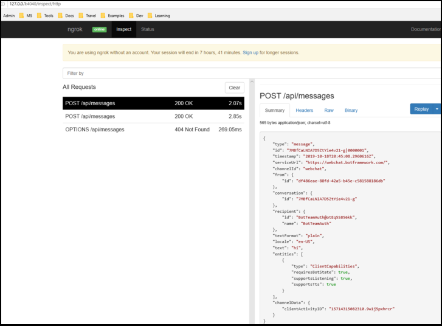

# <a name="add-authentication-to-your-teams-bot"></a>Добавление проверки подлинности для ленты Teams

Иногда может потребоваться создать боты в Microsoft Teams, которые могут получать доступ к ресурсам от имени пользователя, например к почтовой службе.

В этой статье показано, как использовать проверку подлинности SDK для Azure Bot службы Azure на основе OAuth 2,0. Это упрощает разработку Bot, который может использовать маркеры проверки подлинности на основе учетных данных пользователя. Ключевое значение ALL — это использование **поставщиков удостоверений**, как мы будем видеть позже.

OAuth 2,0 — это открытый стандарт проверки подлинности и авторизации, используемый Azure Active Directory (Azure AD) и многими другими поставщиками удостоверений. Базовое понимание OAuth 2,0 является необходимым условием для работы с проверкой подлинности в Teams.

В разделе [OAuth 2 упрощено](https://aka.ms/oauth2-simplified) основные сведения и [OAuth 2,0](https://oauth.net/2/) для полной спецификации.

Дополнительные сведения о том, как служба Azure Bot обрабатывает проверку подлинности, можно узнать [в статье Проверка подлинности пользователей в беседе](https://aka.ms/azure-bot-authentication).

В данной статье вы узнаете следующее.

- **Создание ленты с включенной проверкой подлинности**. Вы будете использовать [CS – auth – Sample][teams-auth-bot-cs] для обработки учетных данных пользователя и создания маркера проверки подлинности.
- **Как развернуть Bot в Azure и связать его с поставщиком удостоверений**. Поставщик выдает маркер, основанный на учетных данных пользователя для входа. С помощью маркера Bot можно получить доступ к ресурсам, таким как почтовая служба, которая требует проверки подлинности. Для получения дополнительных сведений см [процесс проверки подлинности Microsoft Teams для Боты](auth-flow-bot.md).
- **Интеграция программы Bot в Microsoft Teams**. После интеграции ленты вы сможете войти и обмениваться сообщениями в чате.

## <a name="prerequisites"></a>Необходимые компоненты

- Знание [основ Bot][concept-basics], [Управление состоянием][concept-state], [Библиотека диалоговых окон][concept-dialogs]и [реализация последовательного процесса беседы][simple-dialog].
- Сведения о разработке Azure и OAuth 2,0.
- Текущие версии Visual Studio и Git.
- Учетная запись Azure. При необходимости вы можете создать [бесплатную учетную запись Azure](https://azure.microsoft.com/free/).
- Приведенный ниже пример.

    | Пример | Версия Ботбуилдер | Демонстрирующего |
    |:---|:---:|:---|
    | **Проверка подлинности с помощью подлинности** в [CS – auth — пример][teams-auth-bot-cs] | IPv4 | Поддержка Оаускард |
    | **Проверка подлинности** на [основе кода JS — auth — пример][teams-auth-bot-js] | IPv4| Поддержка Оаускард  |
    | **Проверка подлинности с помощью подлинности** в [образце (auth][teams-auth-bot-py] ) | IPv4 | Поддержка Оаускард |

## <a name="create-the-resource-group"></a>Создание группы ресурсов

Группа ресурсов и план обслуживания не являются строго обязательными, но они позволяют удобно освобождать создаваемые ресурсы. Это хорошая практика по обеспечению упорядочения ресурсов и управления ими.

Группа ресурсов используется для создания отдельных ресурсов для Bot Framework. Для повышения производительности убедитесь, что эти ресурсы расположены в одном и том же регионе Azure.

1. В браузере Войдите на [**портал Azure**][azure-portal].
1. В левой панели навигации выберите пункт **группы ресурсов**.
1. В левом верхнем углу отображаемого окна выберите **Добавить** вкладку, чтобы создать новую группу ресурсов. Вам будет предложено указать следующее:
    1. **Подписка**. Используйте существующую подписку.
    1. **Группа ресурсов**. Введите имя группы ресурсов. Например, может быть *теамсресаурцеграуп*. Помните, что имя должно быть уникальным.
    1. В раскрывающемся меню **Region (регион** ) выберите *Запад США*или регион близко к приложениям.
    1. Нажмите кнопку " **Просмотр и создание** ". Вы должны увидеть баннер с прочтением *пройденной проверки*.
    1. Нажмите кнопку **создать** . Создание группы ресурсов может занять несколько минут.

> [!TIP]
> Как и в случае с ресурсами, которые вы создадите позже в этом руководстве, рекомендуется закрепить эту группу ресурсов на панели мониторинга для упрощения доступа. Если вы хотите сделать это, нажмите значок ПИН-кода & # 128204; в верхнем правом углу панели мониторинга.

## <a name="create-the-service-plan"></a>Создание плана обслуживания

1. На [**портале Azure**][azure-portal]в левой панели навигации выберите пункт **создать ресурс**.
1. В поле поиска введите *план обслуживания приложений*. Выберите карточку **плана обслуживания приложений** из результатов поиска.
1. Нажмите кнопку **Создать**.
1. Вам будет предложено указать следующие сведения:
    1. **Подписка**. Вы можете использовать существующую подписку.
    1. **Группа ресурсов**. Выберите ранее созданную группу.
    1. **Name (имя**). Введите имя для плана обслуживания. Например, может быть *теамссервицеплан*. Помните, что имя должно быть уникальным в пределах группы.
    1. **Операционная система**. Выберите *Windows* или применяемую ОС.
    1. **Область**. Выберите *Запад США* или регион, близкий к приложениям.
    1. **Ценовая**Категория. Убедитесь, что выбран пункт " *Стандартная S1* ". Это значение должно быть задано по умолчанию.
    1. Нажмите кнопку " **Просмотр и создание** ". Вы должны увидеть баннер с прочтением *пройденной проверки*.
    1. Нажмите кнопку **Создать**. Создание плана служб приложений может занять несколько минут. План будет указан в группе ресурсов.

## <a name="create-the-bot-channels-registration"></a>Создание регистрации каналов канала ленты

Регистрация каналов ленты регистрирует веб-службу в качестве ленты с помощью Bot Framework, если у вас есть идентификатор приложения Microsoft и пароль приложения (секрет клиента).

> [!IMPORTANT]
> Зарегистрировать его можно только в том случае, если он не размещен в Azure. Если вы [создали объект Bot](/azure/bot-service/abs-quickstart?view=azure-bot-service-4.0&viewFallbackFrom=azure-bot-service-3.0) через портал Azure, он уже зарегистрирован в службе. Если вы создали пошаговую [среду](https://dev.botframework.com/bots/new) с Bot или [аппстудио](~/concepts/build-and-test/app-studio-overview.md) , она не зарегистрирована в Azure.

[!INCLUDE [bot channels registration steps](~/includes/bots/azure-bot-channels-registration.md)]

> [!NOTE]
> В ресурсе регистрации каналов канала ленты будет отображаться **глобальный** регион, даже если вы выбрали Запад US. Это ожидается.

Более подробную информацию можно найти в статье Создание почтового [робота для Teams](../create-a-bot-for-teams.md).

## <a name="create-the-identity-provider"></a>Создание поставщика удостоверений

Вам необходим поставщик удостоверений, который можно использовать для проверки подлинности.
В этой процедуре используется поставщик Azure AD; Кроме того, можно использовать другие поставщики удостоверений, поддерживаемые службой Azure AD.

1. На [**портале Azure**][azure-portal]на левой панели навигации выберите **Azure Active Directory**.
    > [!TIP]
    > Вам потребуется создать и зарегистрировать этот ресурс Azure AD в клиенте, в котором вы можете предоставить согласие на делегирование разрешений, запрашиваемых приложением.
    > Инструкции по созданию клиента можно узнать в статье [доступ к порталу и создание клиента](/azure/active-directory/fundamentals/active-directory-access-create-new-tenant).
1. В левой панели выберите пункт **Регистрация приложений**.
1. На правой панели выберите **новую вкладку регистрация** в левом верхнем углу.
1. Вам будет предложено указать следующие сведения:
   1. **Name (имя**). Введите имя приложения. Например, может быть *боттеамсидентити*. Помните, что имя должно быть уникальным.
   1. Выберите **Поддерживаемые типы учетных записей** для вашего приложения. Выберите *учетные записи в любом каталоге организации (любой Azure AD Active Directory) и личных учетных записях Майкрософт (например, Skype, Xbox)*.
   1. Для **URI перенаправления**:<br/>
       &#x2713;выбрать **веб-сайт**. <br/>
       &#x2713; задать URL-адрес `https://token.botframework.com/.auth/web/redirect` .
   1. Выберите **регистр**.

1. После создания Azure отображает страницу **обзора** приложения. Скопируйте и сохраните следующие сведения в файле:

    1. Значение **идентификатора Application (Client)** . Это значение будет использоваться позже в качестве *идентификатора клиента* при регистрации этого приложения удостоверений Azure с помощью программы Bot.
    1. Значение **идентификатора каталога (клиента)** . Вы также можете использовать это значение позже, как *идентификатор клиента* для регистрации этого приложения удостоверения Azure с помощью программы Bot.

1. В левой панели выберите **сертификаты & секреты** , чтобы создать секрет клиента для приложения.

   1. В разделе **секреты клиента**выберите &#x2795; **новый секрет клиента**.
   1. Добавьте описание для идентификации этого секрета от других пользователей, которые, возможно, потребуется создать для этого приложения, например " *приложение идентификации Bot" в Teams*.
   1. Установите **срок действия** выбранных элементов.
   1. Нажмите кнопку **Добавить**.
   1. Перед выходом из этой страницы **запишите секрет**. Это значение будет использоваться позже в качестве _секрета клиента_ при регистрации приложения Azure AD с помощью программы Bot.

### <a name="configure-the-identity-provider-connection-and-register-it-with-the-bot"></a>Настройка подключения к поставщику удостоверений и его регистрация с помощью Bot

1. На [**портале Azure**][azure-portal]выберите группу ресурсов на панели мониторинга.
1. Выберите ссылку для регистрации канала ленты.
1. На странице ресурс выберите **Параметры**.
1. В разделе **Параметры подключения OAuth** в нижней части страницы нажмите кнопку **Добавить параметр**.
1. Заполните форму следующим образом:

    1. **Name (имя**). Введите имя подключения. Это имя будет использоваться в `appsettings.json` файле Bot. Например, *BotTeamsAuthADv1*.
    1. **Поставщик услуг**. Выберите **Azure Active Directory**. После выбора этого поля будут отображены поля, связанные с Azure AD.
    1. **Идентификатор клиента**. Введите идентификатор приложения (клиента), записанный для приложения поставщика удостоверений Azure, в описанных выше шагах.
    1. **Секрет клиента**. Введите секретный код, записанный для приложения поставщика удостоверений Azure, в описанных выше шагах.
    1. **Тип гранта**. Введите `authorization_code` .
    1. **URL-адрес для входа**. Введите `https://login.microsoftonline.com` .
    1. **Идентификатор клиента**введите **идентификатор каталога (клиента)** , записанный ранее для своего приложения-удостоверения Azure, или **Общий** , в зависимости от поддерживаемого типа учетной записи, выбранной при создании приложения поставщика удостоверений. Чтобы выбрать значение, которое нужно назначить, выполните следующие условия:

        - Если вы выбрали *учетные записи только в этом каталоге организации (только Microsoft AAD — один клиент)* или *учетные записи в любом организационном каталоге (Microsoft AAD Active Directory — несколько клиентов)* , введите **идентификатор клиента** , записанный ранее для приложения AAD. Это будет клиент, связанный с пользователями, которые могут пройти проверку подлинности.

        - Если вы выбрали *учетные записи в любом организационном каталоге (например, Skype, Xbox, Outlook)* , введите слово **Common** , а не идентификатор клиента. В противном случае приложение AAD проверит подлинность клиента, идентификатор которого был выбран и исключит личные учетные записи Майкрософт.

    высоты. Введите в поле **URL-адрес ресурса** `https://graph.microsoft.com/` . Этот параметр не используется в текущем примере кода.  
    i. Оставьте **области** пустыми. Ниже приведен пример такого изображения.

    

1. Нажмите кнопку **Сохранить**.

### <a name="test-the-connection"></a>Проверка подключения

1. Выберите запись подключения, чтобы открыть только что созданное подключение.
1. В верхней части панели **параметров подключения поставщика услуг** выберите пункт **проверить подключение** .
1. При первом запуске откроется новое окно браузера, предлагающее выбрать учетную запись. Выберите один из них.
1. После этого вам будет предложено разрешить поставщику удостоверений использовать ваши данные (учетные данные). Ниже приведен пример такого изображения.

    

1. Нажмите кнопку **принять**.
1. После этого необходимо перенаправить вас на страницу **тестового подключения для \<your-connection-name> успешного** завершения. Обновите страницу при возникновении ошибки. Ниже приведен пример такого изображения.

  

Имя подключения используется кодом ленты для получения маркеров проверки подлинности пользователей.

## <a name="prepare-the-bot-sample-code"></a>Подготовка примера кода для Bot

После выполнения предварительных настроек рассмотрим создание объекта Bot для использования в этой статье.

# <a name="cnet"></a>[C#/.NET](#tab/dotnet)

1. Clone [CS — auth — пример][teams-auth-bot-cs].
1. Запустите Visual Studio.
1. На панели инструментов выберите **файл > открыть > проект/решение** и откройте проект Bot.
1. В C# обновите **appSettings. JSON** следующим образом:

    - Задайте `ConnectionName` имя подключения поставщика удостоверений, добавленное к регистрации канала ленты. В этом примере используется имя *BotTeamsAuthADv1*.
    - Установите `MicrosoftAppId` для **идентификатора приложения** , сохраненного во время регистрации канала ленты.
    - Укажите `MicrosoftAppPassword` **секрет клиента** , сохраненный во время регистрации канала ленты.
    - Задайте `ConnectionName` для параметра имя подключения поставщика удостоверений.

    В зависимости от символов в тайне Bot может потребоваться, чтобы в XML-коде заменяться паролем. Например, любой амперсанд (&) необходимо закодировать как `&amp;` .

     [!code-json[appsettings](~/../botbuilder-samples/samples/csharp_dotnetcore/46.teams-auth/appsettings.json?range=1-5)]

1. В обозревателе решений перейдите к `TeamsAppManifest` папке, откройте `manifest.json` и установите `id` `botId` **идентификатор приложения** , сохраненного во время регистрации канала ленты.

# <a name="javascript"></a>[JavaScript](#tab/node-js)

1. Clone [node — auth — пример][teams-auth-bot-js].
1. В консоли перейдите к проекту: </br></br>
`cd samples/javascript_nodejs/46.teams`  
1. Установка модулей</br></br>
`npm install`
1. Обновите конфигурацию **. env** следующим образом.

    - Установите `MicrosoftAppId` для **идентификатора приложения** , сохраненного во время регистрации канала ленты.
    - Укажите `MicrosoftAppPassword` **секрет клиента** , сохраненный во время регистрации канала ленты.
    - Задайте `connectionName` для параметра имя подключения поставщика удостоверений.

    В зависимости от символов в тайне Bot может потребоваться, чтобы в XML-коде заменяться паролем. Например, любой амперсанд (&) необходимо закодировать как `&amp;` .

     [!code-javascript[settings](~/../botbuilder-samples/samples/javascript_nodejs/46.teams-auth/.env)]

1. В `teamsAppManifest` папке откройте `manifest.json` и укажите `id` **идентификатор приложения Microsoft** и `botId` **идентификатор приложения** , сохраненного во время регистрации канала ленты.

# <a name="python"></a>[Python](#tab/python)

1. Clone копировать [— AUTH — пример][teams-auth-bot-py] из репозитория GitHub.
1. Обновление **config.py**:

    - Укажите `ConnectionName` имя параметра подключения OAuth, добавленного к почтовому роботу.
    - Задайте `MicrosoftAppId` `MicrosoftAppPassword` идентификатор приложения и секрет приложения для пользователя Bot.

      В зависимости от символов в тайне Bot может потребоваться, чтобы в XML-коде заменяться паролем. Например, любой амперсанд (&) необходимо закодировать как `&amp;` .

      [!code-python[config](~/../botbuilder-samples/samples/python/46.teams-auth/config.py?range=14-16)]

---

### <a name="deploy-the-bot-to-azure"></a>Развертывание ленты в Azure

Чтобы развернуть Bot, выполните действия, описанные в разделе как [развернуть Bot в Azure](https://aka.ms/azure-bot-deployment-cli).

Кроме того, в Visual Studio можно выполнить следующие действия:

1. В *обозревателе решений* Visual Studio выберите и удерживайте (или щелкните правой кнопкой мыши) имя проекта.
1. В раскрывающемся меню выберите пункт **опубликовать**.
1. В отображаемом окне выберите **новую** ссылку.
1. В диалоговом окне в левой части окна выберите пункт **служба приложений** и **Создайте новую** .
1. Нажмите кнопку **опубликовать** .
1. В следующем диалоговом окне введите необходимые сведения. Ниже приведен пример.

   

1. Нажмите кнопку **Создать**.
1. Если развертывание завершается успешно, оно должно отображаться в Visual Studio. Кроме того, в браузере, используемом по умолчанию, отображается страница, в *которой выполняется подготовка ленты*. URL-адрес будет выглядеть следующим образом: `https://botteamsauth.azurewebsites.net/` . Сохраните его в файл.
1. В браузере перейдите на [**портал Azure**][azure-portal].
1. Проверьте группу ресурсов, элемент Bot должен быть указан вместе с другими ресурсами. Ниже приведен пример такого изображения.

    

1. В группе ресурсов выберите имя для регистрации канала канала ленты (ссылка).
1. В левой панели выберите **Параметры**.
1. В поле **Конечная точка для обмена сообщениями** введите URL-адрес, полученный выше `api/messages` . Пример: `https://botteamsauth.azurewebsites.net/api/messages` .
1. Нажмите кнопку **сохранить** в левом верхнем углу.

## <a name="test-the-bot-using-the-emulator"></a>Тестирование ленты с помощью эмулятора

Если вы еще не сделали этого, установите [эмулятор Microsoft Bot Framework](https://aka.ms/bot-framework-emulator-readme). См. также [Отладка с помощью эмулятора](https://aka.ms/bot-framework-emulator-debug-with-emulator).

Для работы с примером входа в качестве примера необходимо настроить эмулятор, как показано ниже.

### <a name="configure-the-emulator-for-authentication"></a>Настройка эмулятора для проверки подлинности

Если для ленты требуется проверка подлинности, необходимо настроить эмулятор, как показано ниже.

1. Запустите эмулятор.
1. В симуляторе выберите значок шестеренки &#9881; в левом нижнем углу или на вкладке **Параметры эмулятора** в правом верхнем углу.
1. Установите флажок, используя **токены проверки подлинности версии 1,0**.
1. Введите локальный путь к средству **ngrok** . *Посетите* [вики-сайт](https://github.com/Microsoft/BotFramework-Emulator/wiki/Tunneling-(ngrok))поngrokного туннелирования для ленты. Для получения дополнительных сведений о средстве обратитесь к разделу [ngrok](https://ngrok.com/).
1. Установите флажок, выполнив **ngrok при запуске эмулятора**.
1. Нажмите кнопку **сохранить** .

Когда Bot отображает карточку входа и пользователь выбирает кнопку входа, эмулятор открывает страницу, с помощью которой пользователь может войти в систему с помощью поставщика проверки подлинности.
После того как пользователь сделает это, поставщик создает маркер пользователя и отправляет его в Bot. После этого Bot может работать от имени пользователя.

### <a name="test-the-bot-locally"></a>Тестирование ленты на локальном компьютере

После того как вы настроили механизм проверки подлинности, вы можете выполнить собственно тестирование Bot.  

1. Запустите образец Bot на локальном компьютере, используя Visual Studio, например.
1. Запустите эмулятор.
1. Нажмите кнопку **Открыть Bot** .
1. В **URL-адресе Bot**введите локальный URL-адрес Bot. Как правило, `http://localhost:3978/api/messages` .
1. В поле **идентификатор приложения Microsoft** введите код приложения Bot из `appsettings.json` .
1. В поле **пароль Microsoft App** введите пароль приложения Bot в поле `appsettings.json` .
1. Нажмите кнопку **подключить**.
1. После завершения работы с Bot введите любой текст, чтобы отобразить карточку входа.
1. Нажмите кнопку **войти** .
1. Откроется всплывающее диалоговое окно для **подтверждения открытия URL-адреса**. Это необходимо для того, чтобы пользователь почтового робота (вы) мог пройти проверку подлинности.  
1. Нажмите кнопку **подтвердить**.
1. При появлении запроса выберите учетную запись соответствующей учетной записи пользователя.
1. В зависимости от того, какая конфигурация использовалась для эмулятора, вы получаете одно из следующих действий:
    1. **Использование кода проверки при входе**  
      &#x2713; открывается окно, в котором отображается код проверки.  
      &#x2713; скопировать и ввести код проверки в поле чата, чтобы завершить вход.
    1. **Использование маркеров проверки подлинности**.  
      &#x2713; вы вошли в систему в соответствии с вашими учетными данными.

    На следующем рисунке показан пример пользовательского интерфейса ленты после входа в систему.

    

1. Если вы выберете **Да** , когда приглашение *будет просматривать ваш маркер?*, вы получите ответ, аналогичный следующему:

    

1. Введите **logout** во входном поле чата, чтобы выйти из системы. Он освобождает маркер пользователя, и Bot не сможет действовать от вашего имени, пока вы не выполните вход в систему.

> [!NOTE]
> Для проверки подлинности с помощью Bot требуется **Служба соединителя Bot**. Служба получает доступ к сведениям о регистрации каналов ленты для Bot.

## <a name="test-the-deployed-bot"></a>Тестирование развернутой ленты

<!--There are several testing scenarios here. Ideally, we'd have a separate article on the what, why, 
and when for these, and just reference that from here, along with the set of steps that exercises the bot code.-->

1. В браузере перейдите на [**портал Azure**][azure-portal].
1. Найдите группу ресурсов.
1. Выберите ссылку ресурс. Отобразится страница ресурса.
1. На странице ресурс выберите пункт **Проверка в веб-чата**. Начнется запуск ленты и отображается предварительно заданные приветствия.
1. Введите что-либо в поле Chat.
1. Выберите поле **Вход** .
1. Откроется всплывающее диалоговое окно для **подтверждения открытия URL-адреса**. Это необходимо для того, чтобы пользователь почтового робота (вы) мог пройти проверку подлинности.  
1. Нажмите кнопку **подтвердить**.
1. При появлении запроса выберите учетную запись соответствующей учетной записи пользователя.
    На следующем рисунке показан пример пользовательского интерфейса ленты после входа:

    .

1. Нажмите кнопку **Да** , чтобы отобразить маркер проверки подлинности. Ниже приведен пример такого изображения.

    .

1. Введите Logout, чтобы выйти из системы.

    

> [!NOTE]
> Если у вас возникли проблемы с входом в систему, попробуйте снова проверить подключение, как описано в предыдущих шагах. Это может привести к повторному созданию маркера проверки подлинности.
> С помощью клиента веб-чата ленты в Azure может потребоваться выполнить вход несколько раз, чтобы проверка подлинности была установлена правильно.

## <a name="install-and-test-the-bot-in-teams"></a>Установка и тестирование программы Bot в Teams

1. В проекте Bot убедитесь, что `TeamsAppManifest` Папка содержит `manifest.json` вместе с `outline.png` `color.png` файлами и.
1. В обозревателе решений перейдите к `TeamsAppManifest` папке. Изменить `manifest.json` , назначая следующие значения:
    1. Убедитесь, что **код приложения-робота** , полученный во время регистрации канала ленты, назначен `id` и `botId` .
    1. Назначьте это значение: `validDomains: [ "token.botframework.com" ]` .
1. Выбор и **почтовые индексы** для и `manifest.json` `outline.png` `color.png` файлов.
1. Откройте **Microsoft Teams**.
1. В нижней панели слева щелкните **значок приложения**.
1. На правой панели в нижней части выберите **Отправить пользовательское приложение**.
1. Перейдите к `TeamsAppManifest` папке и отправьте манифест ZIP.
Отобразится следующий мастер:

    

1. Нажмите кнопку **Добавить в группу** .
1. В следующем окне выберите группу, в которой вы хотите использовать элемент Bot.
1. Нажмите кнопку **Настройка ленты** .
1. Выберите три точки (&#x25cf;&#x25cf;&#x25cf;) на левой панели. Затем выберите значок **app Studio (App Studio** ).
1. Перейдите на вкладку **редактор манифестов** . Вы увидите значок для отправленного ленты.
1. Кроме того, вы увидите, что в списке бесед, который вы можете использовать для обмена сообщениями с роботом, указан в качестве контакта.

### <a name="testing-the-bot-locally-in-teams"></a>Тестирование ленты на локальном компьютере в Teams

Microsoft Teams — это полностью облачный продукт, требующий, чтобы все службы, к которым он обращается, были доступны из облака с помощью конечных точек HTTPS. Таким образом, чтобы включить "bot" (наш образец) для работы в Teams, необходимо либо опубликовать код в выбранном вами облаке, либо сделать локальный экземпляр доступным извне с помощью средства **туннелирования** . Мы рекомендуем [ngrok](https://ngrok.com/download), который создает доступ к внешнему URL-адресу для порта, который вы откроете локально на вашем компьютере.
Чтобы настроить ngrok в процессе подготовки к запуску приложения Microsoft Teams, выполните следующие действия:

1. В окне терминала перейдите к каталогу, в котором `ngrok.exe` установлен. Рекомендуется установить для *переменной среды* путь, указывающий на нее.
1. Запустите, например `ngrok http 3978 --host-header=localhost:3978` . При необходимости замените номер порта.
Будет запущен ngrok для прослушивания указанного порта. В качестве возврата вы получите URL-адрес с внешним адресом, допустимый до тех пор, пока работает ngrok. Ниже приведен пример такого изображения.

    .

1. Скопируйте HTTPS адрес переадресации. Он должен иметь следующий вид: `https://dea822bf.ngrok.io/` .
1. Append — `/api/messages` Получение `https://dea822bf.ngrok.io/api/messages` . Это **Конечная точка сообщений** для Bot, выполняемая локально на компьютере и доступная через Интернет в чате в Microsoft Teams.
1. Один из последних действий — обновление конечной точки сообщений развернутой ленты. В этом примере мы развернули элемент Bot в Azure. Итак, * * выполните следующие действия:
    1. В браузере перейдите на [**портал Azure**][azure-portal].
    1. Выберите **регистрацию канала Bot**.
    1. В левой панели выберите **Параметры**.
    1. На правой панели в поле **Конечная точка обмена сообщениями** введите URL-адрес ngrok в нашем примере `https://dea822bf.ngrok.io/api/messages` .
1. Запустите Bot на локальном компьютере, например в режиме отладки Visual Studio.
1. Протестируйте Bot при локальном запуске с помощью **тестового веб-чата**портала Bot Framework. Как и эмулятор, этот тест не позволяет получить доступ к функциональным возможностям, характерным для Teams.
1. В окне терминала, где `ngrok` работает, можно видеть HTTP-трафик между Bot и клиентом веб-чата. Если требуется более подробное представление, в окне браузера введите `http://127.0.0.1:4040` , полученное из предыдущего окна терминала. Ниже приведен пример такого изображения.

    .

> [!NOTE]
> Если остановить и перезапустить ngrok, URL-адрес изменится. Чтобы использовать ngrok в проекте и в зависимости от используемых возможностей, необходимо обновить все URL-ссылки.

## <a name="additional-information"></a>Дополнительные сведения

### <a name="teamsappmanifestmanifestjson"></a>Теамсаппманифест/manifest. JSON

Этот манифест содержит сведения, необходимые Microsoft Teams для связи с Bot.  

```json
{
  "$schema": "https://developer.microsoft.com/json-schemas/teams/v1.7/MicrosoftTeams.schema.json",
  "manifestVersion": "1.5",
  "version": "1.0.0",
  "id": "",
  "packageName": "com.teams.auth.bot",
  "developer": {
    "name": "TeamsBotAuth",
    "websiteUrl": "https://www.microsoft.com",
    "privacyUrl": "https://www.teams.com/privacy",
    "termsOfUseUrl": "https://www.teams.com/termsofuse"
  },
  "icons": {
    "color": "color.png",
    "outline": "outline.png"
  },
  "name": {
    "short": "TeamsBotAuth",
    "full": "Teams Bot Authentication"
  },
  "description": {
    "short": "TeamsBotAuth",
    "full": "Teams Bot Authentication"
  },
  "accentColor": "#FFFFFF",
  "bots": [
    {
      "botId": "",
      "scopes": [
        "groupchat",
        "team"
      ],
      "supportsFiles": false,
      "isNotificationOnly": false
    }
  ],
  "permissions": [
    "identity",
    "messageTeamMembers"
  ],
  "validDomains": [ "token.botframework.com" ]
}
```

При использовании проверки подлинности Teams немного отличается от других каналов, как описано ниже.

### <a name="handling-invoke-activity"></a>Обработка действия Invoke

**Действие Invoke** отправляется на сервер робота, а не на событие, используемое другими каналами.
Это делается с помощью дочерних классов **активитихандлер**.

# <a name="cnet"></a>[C#/.NET](#tab/dotnet-sample)

**Боты/Диалогбот. CS**

[!code-csharp[ActivityHandler](~/../botbuilder-samples/samples/csharp_dotnetcore/46.teams-auth/Bots/DialogBot.cs?range=19-51)]

**Боты/Теамсбот. CS**

*Действие Invoke* необходимо перенаправить в диалоговое окно, если используется **оауспромпт** .

[!code-csharp[ActivityHandler](~/../botbuilder-samples/samples/csharp_dotnetcore/46.teams-auth/Bots/TeamsBot.cs?range=34-42)]

#### <a name="teamsactivityhandlercs"></a>TeamsActivityHandler.cs

```csharp

protected virtual Task OnInvokeActivityAsync(ITurnContext<IInvokeActivity> turnContext, CancellationToken cancellationToken)
{
    switch (turnContext.Activity.Name)
    {
        case "signin/verifyState":
            return OnSigninVerifyStateAsync(turnContext, cancellationToken);

        default:
            return Task.CompletedTask;
    }
}

protected virtual Task OnSigninVerifyStateAsync(ITurnContext<IInvokeActivity> turnContext, CancellationToken cancellationToken)
{
    return Task.CompletedTask;
}
```

# <a name="javascript"></a>[JavaScript](#tab/node-js-dialog-sample)

**Боты/Диалогбот. js**

[!code-javascript[ActivityHandler](~/../botbuilder-samples/samples/javascript_nodejs/46.teams-auth/bots/dialogBot.js?range=4-46)]

**Боты/Теамсбот. js**

*Действие Invoke* необходимо перенаправить в диалоговое окно, если используется **оауспромпт** .

[!code-javascript[ActivityHandler](~/../botbuilder-samples/samples/javascript_nodejs/46.teams-auth/bots/teamsBot.js?range=4-33)]

**Dialogs/Маиндиалог. js**

На шаге диалогового окна используйте `beginDialog` для запуска приглашения OAuth, в котором пользователю предлагается выполнить вход.

- Если пользователь уже выполнил вход, будет создано событие отклика маркера без запроса пользователя.
- В противном случае пользователю будет предложено выполнить вход. Служба Azure Bot отправляет событие ответа маркера после того, как пользователь попытается выполнить вход.

[!code-javascript[AddOAuthPrompt](~/../botbuilder-samples/samples/javascript_nodejs/46.teams-auth/dialogs/mainDialog.js?range=50-52)]

На следующем этапе диалога проверьте наличие маркера в результатах предыдущего действия. Если значение не равно null, пользователь успешно выполнил вход.

[!code-javascript[AddOAuthPrompt](~/../botbuilder-samples/samples/javascript_nodejs/46.teams-auth/dialogs/mainDialog.js?range=50-64)]

**Боты/Логаутдиалог. js**

[!code-javascript[allow-logout](~/../botbuilder-samples/samples/javascript_nodejs/46.teams-auth/dialogs/logoutDialog.js?range=31-42&highlight=7)]

# <a name="python"></a>[Python](#tab/python-sample)

**Боты/dialog_bot. Корректировка**

[!code-python[ActivityHandler](~/../botbuilder-samples/samples/python/46.teams-auth/bots/dialog_bot.py?range=10-42)]

**Боты/teams_bot. Корректировка**

*Действие Invoke* необходимо перенаправить в диалоговое окно, если используется **оауспромпт** .

[!code-python[on_token_response_event](~/../botbuilder-samples/samples/python/46.teams-auth/bots/teams_bot.py?range=38-45)]

**диалоговые окна/main_dialog. Корректировка**

На шаге диалогового окна используйте `begin_dialog` для запуска приглашения OAuth, в котором пользователю предлагается выполнить вход.

- Если пользователь уже выполнил вход, будет создано событие отклика маркера без запроса пользователя.
- В противном случае пользователю будет предложено выполнить вход. Служба Azure Bot отправляет событие ответа маркера после того, как пользователь попытается выполнить вход.

[!code-python[Add OAuthPrompt](~/../botbuilder-samples/samples/python/46.teams-auth/dialogs/main_dialog.py?range=48-49)]

На следующем этапе диалога проверьте наличие маркера в результатах предыдущего действия. Если значение не равно null, пользователь успешно выполнил вход.

[!code-python[Add OAuthPrompt](~/../botbuilder-samples/samples/python/46.teams-auth/dialogs/main_dialog.py?range=51-61)]

**диалоговые окна/logout_dialog. Корректировка**

[!code-python[allow logout](~/../botbuilder-samples/samples/python/46.teams-auth/dialogs/logout_dialog.py?range=29-36&highlight=6)]

---

> [!div class="nextstepaction"]
> [Узнайте, как добавить проверку подлинности через службу Azure Bot](https://aka.ms/azure-bot-add-authentication)

<!-- Footnote-style links -->

[azure-portal]: https://ms.portal.azure.com

[concept-basics]: https://docs.microsoft.com/azure/bot-service/bot-builder-basics?view=azure-bot-service-4.0
[concept-state]: https://docs.microsoft.com/azure/bot-service/bot-builder-concept-state?view=azure-bot-service-4.0
[concept-dialogs]: https://docs.microsoft.com/azure/bot-service/bot-builder-concept-dialog?view=azure-bot-service-4.0
[simple-dialog]: https://docs.microsoft.com/azure/bot-service/bot-builder-dialog-manage-conversation-flow?view=azure-bot-service-4.0

[teams-auth-bot-cs]: https://github.com/microsoft/BotBuilder-Samples/tree/master/samples/csharp_dotnetcore/46.teams-auth

[teams-auth-bot-py]: https://github.com/microsoft/BotBuilder-Samples/tree/master/samples/python/46.teams-auth

[teams-auth-bot-js]: https://github.com/microsoft/BotBuilder-Samples/tree/master/samples/javascript_nodejs/46.teams-auth

[azure-aad-blade]: https://ms.portal.azure.com/#blade/Microsoft_AAD_IAM/ActiveDirectoryMenuBlade/Overview
[aad-registration-blade]: https://ms.portal.azure.com/#blade/Microsoft_AAD_IAM/ActiveDirectoryMenuBlade/RegisteredAppsPreview
