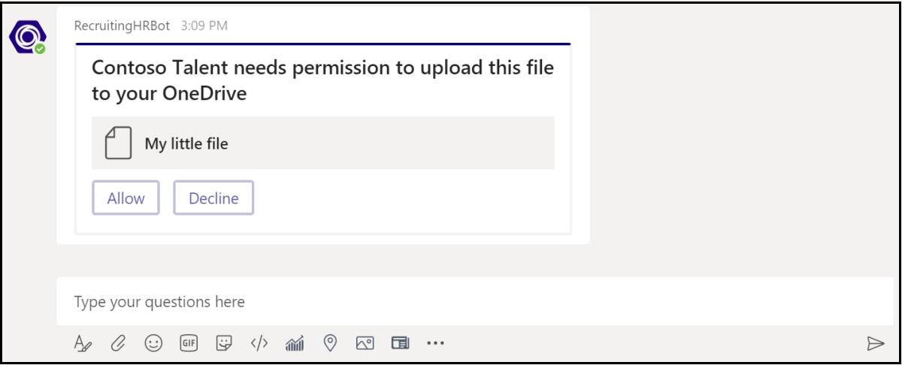
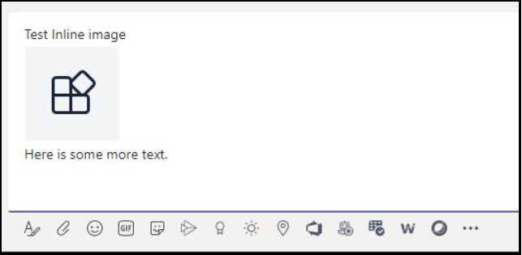

# <a name="send-and-receive-files-through-the-bot"></a><span data-ttu-id="40751-104">Отправка и получение файлов через бот</span><span class="sxs-lookup"><span data-stu-id="40751-104">Send and receive files through the bot</span></span>

> [!IMPORTANT]
> <span data-ttu-id="40751-105">Статьи в этом документе основаны на SDK bot Framework v4.</span><span class="sxs-lookup"><span data-stu-id="40751-105">The articles in this document are based on the v4 Bot Framework SDK.</span></span>

<span data-ttu-id="40751-106">Существует два способа отправки файлов и получения файлов от бота:</span><span class="sxs-lookup"><span data-stu-id="40751-106">There are two ways to send files to and receive files from a bot:</span></span>

* <span data-ttu-id="40751-107">[**Используйте API Microsoft Graph:**](#use-the-graph-apis) Этот метод работает для ботов во всех сферах Microsoft Teams:</span><span class="sxs-lookup"><span data-stu-id="40751-107">[**Use the Microsoft Graph APIs:**](#use-the-graph-apis) This method works for bots in all Microsoft Teams scopes:</span></span>
  * `personal`
  * `channel`
  * `groupchat`

* <span data-ttu-id="40751-108">[**Используйте API-API бота Teams:**](#use-the-teams-bot-apis) Это только файлы поддержки в `personal` контексте.</span><span class="sxs-lookup"><span data-stu-id="40751-108">[**Use the Teams bot APIs:**](#use-the-teams-bot-apis) These only support files in `personal` context.</span></span>

## <a name="use-the-graph-apis"></a><span data-ttu-id="40751-109">Использование API graph</span><span class="sxs-lookup"><span data-stu-id="40751-109">Use the Graph APIs</span></span>

<span data-ttu-id="40751-110">Сообщение сообщений с вложениями карт, которые относятся к существующим файлам SharePoint, с помощью API graph для [OneDrive и SharePoint.](/onedrive/developer/rest-api/)</span><span class="sxs-lookup"><span data-stu-id="40751-110">Post messages with card attachments that refer to existing SharePoint files, using the Graph APIs for [OneDrive and SharePoint](/onedrive/developer/rest-api/).</span></span> <span data-ttu-id="40751-111">Чтобы использовать API Graph, получите доступ к следующему через стандартный поток авторизации OAuth 2.0:</span><span class="sxs-lookup"><span data-stu-id="40751-111">To use the Graph APIs, obtain access to either of the following through the standard OAuth 2.0 authorization flow:</span></span>

* <span data-ttu-id="40751-112">Папка OneDrive пользователя и `personal` `groupchat` файлы.</span><span class="sxs-lookup"><span data-stu-id="40751-112">A user's OneDrive folder for `personal` and `groupchat` files.</span></span>
* <span data-ttu-id="40751-113">Файлы в канале группы для `channel` файлов.</span><span class="sxs-lookup"><span data-stu-id="40751-113">The files in a team's channel for `channel` files.</span></span>

<span data-ttu-id="40751-114">API-графики работают во всех сферах Teams.</span><span class="sxs-lookup"><span data-stu-id="40751-114">Graph APIs work in all Teams scopes.</span></span> <span data-ttu-id="40751-115">Дополнительные сведения см. в [сообщении отправки вложений в файл сообщений чата.](/graph/api/chatmessage-post?view=graph-rest-beta&tabs=http#example-4-file-attachments&preserve-view=true)</span><span class="sxs-lookup"><span data-stu-id="40751-115">For more information, see [send chat message file attachments](/graph/api/chatmessage-post?view=graph-rest-beta&tabs=http#example-4-file-attachments&preserve-view=true).</span></span>

<span data-ttu-id="40751-116">Кроме того, вы можете отправлять файлы и получать файлы от бота с помощью API-API бота Teams.</span><span class="sxs-lookup"><span data-stu-id="40751-116">Alternately, you can send files to and receive files from a bot using the Teams bot APIs.</span></span>

## <a name="use-the-teams-bot-apis"></a><span data-ttu-id="40751-117">Использование API бота Teams</span><span class="sxs-lookup"><span data-stu-id="40751-117">Use the Teams bot APIs</span></span>

> [!NOTE]
> <span data-ttu-id="40751-118">API-API-бота teams работают только в `personal` контексте.</span><span class="sxs-lookup"><span data-stu-id="40751-118">Teams bot APIs work only in the `personal` context.</span></span> <span data-ttu-id="40751-119">Они не работают в `channel` контексте или `groupchat` в контексте.</span><span class="sxs-lookup"><span data-stu-id="40751-119">They do not work in the `channel` or `groupchat` context.</span></span>

<span data-ttu-id="40751-120">С помощью API Teams бот может напрямую отправлять и получать файлы с пользователями в контексте, также известном `personal` как личные чаты.</span><span class="sxs-lookup"><span data-stu-id="40751-120">Using Teams APIs, the bot can directly send and receive files with users in the `personal` context, also known as personal chats.</span></span> <span data-ttu-id="40751-121">Реализуют такие функции, как отчет о расходах, распознавание изображений, архивные файлы и электронные подписи, связанные с редактированием контента файлов.</span><span class="sxs-lookup"><span data-stu-id="40751-121">Implement features, such as expense reporting, image recognition, file archival, and e-signatures involving the editing of file content.</span></span> <span data-ttu-id="40751-122">Файлы, общие в Teams, как правило, отображаются в качестве карт и позволяют просматривать в приложении.</span><span class="sxs-lookup"><span data-stu-id="40751-122">Files shared in Teams typically appear as cards and allow rich in-app viewing.</span></span>

<span data-ttu-id="40751-123">В следующих разделах описывается отправка контента файлов в качестве прямого взаимодействия с пользователем, например отправки сообщения.</span><span class="sxs-lookup"><span data-stu-id="40751-123">The next sections describe how to send file content as direct user interaction, like sending a message.</span></span> <span data-ttu-id="40751-124">Этот API предоставляется в рамках платформы бота Teams.</span><span class="sxs-lookup"><span data-stu-id="40751-124">This API is provided as part of the Teams bot platform.</span></span>

### <a name="configure-the-bot-to-support-files"></a><span data-ttu-id="40751-125">Настройка бота для поддержки файлов</span><span class="sxs-lookup"><span data-stu-id="40751-125">Configure the bot to support files</span></span>

<span data-ttu-id="40751-126">Чтобы отправить и получить файлы в боте, установите `supportsFiles` свойство в манифесте `true` .</span><span class="sxs-lookup"><span data-stu-id="40751-126">To send and receive files in the bot, set the `supportsFiles` property in the manifest to `true`.</span></span> <span data-ttu-id="40751-127">Это свойство описано в разделе [боты](~/resources/schema/manifest-schema.md#bots) в справке Манифест.</span><span class="sxs-lookup"><span data-stu-id="40751-127">This property is described in the [bots](~/resources/schema/manifest-schema.md#bots) section of the Manifest reference.</span></span>

<span data-ttu-id="40751-128">Определение выглядит `"supportsFiles": true` так.</span><span class="sxs-lookup"><span data-stu-id="40751-128">The definition looks like this, `"supportsFiles": true`.</span></span> <span data-ttu-id="40751-129">Если бот не `supportsFiles` включает, функции, перечисленные в этом разделе, не работают.</span><span class="sxs-lookup"><span data-stu-id="40751-129">If the bot does not enable `supportsFiles`, the features listed in this section do not work.</span></span>

### <a name="receive-files-in-personal-chat"></a><span data-ttu-id="40751-130">Получение файлов в личном чате</span><span class="sxs-lookup"><span data-stu-id="40751-130">Receive files in personal chat</span></span>

<span data-ttu-id="40751-131">Когда пользователь отправляет файл боту, он сначала отправляется в OneDrive пользователя для хранения бизнеса.</span><span class="sxs-lookup"><span data-stu-id="40751-131">When a user sends a file to the bot, the file is first uploaded to the user's OneDrive for business storage.</span></span> <span data-ttu-id="40751-132">Затем бот получает сообщение, уведомляя пользователя о загрузке пользователя.</span><span class="sxs-lookup"><span data-stu-id="40751-132">The bot then receives a message activity notifying the user about the user upload.</span></span> <span data-ttu-id="40751-133">Действие содержит метаданные файлов, такие как его имя и URL-адрес контента.</span><span class="sxs-lookup"><span data-stu-id="40751-133">The activity contains file metadata, such as its name and the content URL.</span></span> <span data-ttu-id="40751-134">Пользователь может напрямую читать с этого URL-адреса, чтобы получить двоичный контент.</span><span class="sxs-lookup"><span data-stu-id="40751-134">The user can directly read from this URL to fetch its binary content.</span></span>

#### <a name="message-activity-with-file-attachment-example"></a><span data-ttu-id="40751-135">Действие сообщения с примером вложения файлов</span><span class="sxs-lookup"><span data-stu-id="40751-135">Message activity with file attachment example</span></span>

<span data-ttu-id="40751-136">В следующем коде показан пример активности сообщения с вложением файлов:</span><span class="sxs-lookup"><span data-stu-id="40751-136">The following code shows an example of message activity with file attachment:</span></span>

```json
{
  "attachments": [{
    "contentType": "application/vnd.microsoft.teams.file.download.info",
    "contentUrl": "https://contoso.sharepoint.com/personal/johnadams_contoso_com/Documents/Applications/file_example.txt",
    "name": "file_example.txt",
    "content": {
      "downloadUrl" : "https://download.link",
      "uniqueId": "1150D938-8870-4044-9F2C-5BBDEBA70C9D",
      "fileType": "txt",
      "etag": "123"
    }
  }]
}
```

<span data-ttu-id="40751-137">В следующей таблице описываются свойства контента вложения:</span><span class="sxs-lookup"><span data-stu-id="40751-137">The following table describes the content properties of the attachment:</span></span>

| <span data-ttu-id="40751-138">Свойство</span><span class="sxs-lookup"><span data-stu-id="40751-138">Property</span></span> | <span data-ttu-id="40751-139">Назначение</span><span class="sxs-lookup"><span data-stu-id="40751-139">Purpose</span></span> |
| --- | --- |
| `downloadUrl` | <span data-ttu-id="40751-140">URL-адрес OneDrive для получения содержимого файла.</span><span class="sxs-lookup"><span data-stu-id="40751-140">OneDrive URL for fetching the content of the file.</span></span> <span data-ttu-id="40751-141">Пользователь может выдавать прямо `HTTP GET` из этого URL-адреса.</span><span class="sxs-lookup"><span data-stu-id="40751-141">The user can issue an `HTTP GET` directly from this URL.</span></span> |
| `uniqueId` | <span data-ttu-id="40751-142">Уникальный файл ID.</span><span class="sxs-lookup"><span data-stu-id="40751-142">Unique file ID.</span></span> <span data-ttu-id="40751-143">Это ID элемента диска OneDrive, если пользователь отправляет файл боту.</span><span class="sxs-lookup"><span data-stu-id="40751-143">This is the OneDrive drive item ID, in case the user sends a file to the bot.</span></span> |
| `fileType` | <span data-ttu-id="40751-144">Тип файла, например .pdf или .docx.</span><span class="sxs-lookup"><span data-stu-id="40751-144">Type of file, such as .pdf or .docx.</span></span> |

<span data-ttu-id="40751-145">В качестве наилучшей практики подтвердите отправку файла, отправив сообщение пользователю.</span><span class="sxs-lookup"><span data-stu-id="40751-145">As a best practice, acknowledge the file upload by sending a message back to the user.</span></span>

### <a name="upload-files-to-personal-chat"></a><span data-ttu-id="40751-146">Отправка файлов в личный чат</span><span class="sxs-lookup"><span data-stu-id="40751-146">Upload files to personal chat</span></span>

<span data-ttu-id="40751-147">**Отправка файла пользователю**</span><span class="sxs-lookup"><span data-stu-id="40751-147">**To upload a file to a user**</span></span>

1. <span data-ttu-id="40751-148">Отправьте сообщение пользователю с запросом разрешения на написание файла.</span><span class="sxs-lookup"><span data-stu-id="40751-148">Send a message to the user requesting permission to write the file.</span></span> <span data-ttu-id="40751-149">Это сообщение должно содержать `FileConsentCard` вложение с именем загружаемого файла.</span><span class="sxs-lookup"><span data-stu-id="40751-149">This message must contain a `FileConsentCard` attachment with the name of the file to be uploaded.</span></span>
2. <span data-ttu-id="40751-150">Если пользователь принимает загрузку файла, бот получает действие вызова с URL-адресом расположения.</span><span class="sxs-lookup"><span data-stu-id="40751-150">If the user accepts the file download, the bot receives an invoke activity with a location URL.</span></span>
3. <span data-ttu-id="40751-151">Чтобы передать файл, бот выполняет непосредственно в `HTTP POST` предоставленный URL-адрес расположения.</span><span class="sxs-lookup"><span data-stu-id="40751-151">To transfer the file, the bot performs an `HTTP POST` directly into the provided location URL.</span></span>
4. <span data-ttu-id="40751-152">Необязательно удалите исходную карточку согласия, если вы не хотите, чтобы пользователь принял дальнейшие загрузки того же файла.</span><span class="sxs-lookup"><span data-stu-id="40751-152">Optionally, remove the original consent card if you do not want the user to accept further uploads of the same file.</span></span>

#### <a name="message-requesting-permission-to-upload"></a><span data-ttu-id="40751-153">Сообщение с запросом разрешения на отправку</span><span class="sxs-lookup"><span data-stu-id="40751-153">Message requesting permission to upload</span></span>

<span data-ttu-id="40751-154">В следующем сообщении рабочего стола содержится простой объект вложения, запрашивающий разрешение пользователя на отправку файла:</span><span class="sxs-lookup"><span data-stu-id="40751-154">The following desktop message contains a simple attachment object requesting user permission to upload the file:</span></span>



<span data-ttu-id="40751-156">Следующее мобильное сообщение содержит объект вложения, запрашивающий разрешение пользователя на отправку файла:</span><span class="sxs-lookup"><span data-stu-id="40751-156">The following mobile message contains an attachment object requesting user permission to upload the file:</span></span>


```json
{
  "attachments": [{
    "contentType": "application/vnd.microsoft.teams.card.file.consent",
    "name": "file_example.txt",
    "content": {
      "description": "<Purpose of the file, such as: this is your monthly expense report>",
      "sizeInBytes": 1029393,
      "acceptContext": {
      },
      "declineContext": {
      }
    }
  }]
}
```

<span data-ttu-id="40751-157">В следующей таблице описываются свойства контента вложения:</span><span class="sxs-lookup"><span data-stu-id="40751-157">The following table describes the content properties of the attachment:</span></span>

| <span data-ttu-id="40751-158">Свойство</span><span class="sxs-lookup"><span data-stu-id="40751-158">Property</span></span> | <span data-ttu-id="40751-159">Назначение</span><span class="sxs-lookup"><span data-stu-id="40751-159">Purpose</span></span> |
| --- | --- |
| `description` | <span data-ttu-id="40751-160">Описывает назначение файла или суммирует его содержимое.</span><span class="sxs-lookup"><span data-stu-id="40751-160">Describes the purpose of the file or summarizes its content.</span></span> |
| `sizeInBytes` | <span data-ttu-id="40751-161">Предоставляет пользователю оценку размера файла и объема пространства, который он занимает в OneDrive.</span><span class="sxs-lookup"><span data-stu-id="40751-161">Provides the user an estimate of the file size and the amount of space it takes in OneDrive.</span></span> |
| `acceptContext` | <span data-ttu-id="40751-162">Дополнительный контекст, который безмолвно передается боту, когда пользователь принимает файл.</span><span class="sxs-lookup"><span data-stu-id="40751-162">Additional context that is silently transmitted to the bot when the user accepts the file.</span></span> |
| `declineContext` | <span data-ttu-id="40751-163">Дополнительный контекст, который безмолвно передается боту при отклонении файла пользователем.</span><span class="sxs-lookup"><span data-stu-id="40751-163">Additional context that is silently transmitted to the bot when the user declines the file.</span></span> |

#### <a name="invoke-activity-when-the-user-accepts-the-file"></a><span data-ttu-id="40751-164">Вызов активности при приеме файла пользователем</span><span class="sxs-lookup"><span data-stu-id="40751-164">Invoke activity when the user accepts the file</span></span>

<span data-ttu-id="40751-165">Действие вызова отправляется боту, если и когда пользователь принимает файл.</span><span class="sxs-lookup"><span data-stu-id="40751-165">An invoke activity is sent to the bot if and when the user accepts the file.</span></span> <span data-ttu-id="40751-166">Он содержит URL-адрес placeholder OneDrive для бизнеса, который бот может затем выдавать для передачи `PUT` содержимого файла.</span><span class="sxs-lookup"><span data-stu-id="40751-166">It contains the OneDrive for Business placeholder URL that the bot can then issue a `PUT` to transfer the file contents.</span></span> <span data-ttu-id="40751-167">Сведения о загрузке в URL-адрес OneDrive см. в добавлении [bytes к сеансу загрузки.](/onedrive/developer/rest-api/api/driveitem_createuploadsession#upload-bytes-to-the-upload-session)</span><span class="sxs-lookup"><span data-stu-id="40751-167">For information on uploading to the OneDrive URL, see [upload bytes to the upload session](/onedrive/developer/rest-api/api/driveitem_createuploadsession#upload-bytes-to-the-upload-session).</span></span>

<span data-ttu-id="40751-168">В следующем коде показан пример краткой версии действия вызова, получаемого ботом:</span><span class="sxs-lookup"><span data-stu-id="40751-168">The following code shows an example of a concise version of the invoke activity that the bot receives:</span></span>

```json
{
  "name": "fileConsent/invoke",
  "value": {
    "type": "fileUpload",
    "action": "accept",
    "context": {
    },
    "uploadInfo": {
      "contentUrl": "https://contoso.sharepoint.com/personal/johnadams_contoso_com/Documents/Applications/file_example.txt",
      "name": "file_example.txt",
      "uploadUrl": "https://upload.link",
      "uniqueId": "1150D938-8870-4044-9F2C-5BBDEBA70C8C",
      "fileType": "txt",
      "etag": "123"
    }
  }
}
```

<span data-ttu-id="40751-169">Аналогично, если пользователь отклонив файл, бот получает следующее событие с таким же общим именем действий:</span><span class="sxs-lookup"><span data-stu-id="40751-169">Similarly, if the user declines the file, the bot receives the following event with the same overall activity name:</span></span>

```json
{
  "name": "fileConsent/invoke",
  "value": {
    "type": "fileUpload",
    "action": "decline",
    "context": {
    }
  }
}
```

### <a name="notifying-the-user-about-an-uploaded-file"></a><span data-ttu-id="40751-170">Уведомление пользователя о загруженных файлах</span><span class="sxs-lookup"><span data-stu-id="40751-170">Notifying the user about an uploaded file</span></span>

<span data-ttu-id="40751-171">После отправки файла в OneDrive пользователя отправьте пользователю сообщение подтверждения.</span><span class="sxs-lookup"><span data-stu-id="40751-171">After uploading a file to the user's OneDrive, send a confirmation message to the user.</span></span> <span data-ttu-id="40751-172">Сообщение должно содержать следующее вложение, которое пользователь может выбрать для предварительного просмотра или открытия в OneDrive, или локальной `FileCard` загрузки:</span><span class="sxs-lookup"><span data-stu-id="40751-172">The message must contain the following `FileCard` attachment that the user can select, either to preview or open it in OneDrive, or download locally:</span></span>

```json
{
  "attachments": [{
    "contentType": "application/vnd.microsoft.teams.card.file.info",
    "contentUrl": "https://contoso.sharepoint.com/personal/johnadams_contoso_com/Documents/Applications/file_example.txt",
    "name": "file_example.txt",
    "content": {
      "uniqueId": "1150D938-8870-4044-9F2C-5BBDEBA70C8C",
      "fileType": "txt",
    }
  }]
}
```

<span data-ttu-id="40751-173">В следующей таблице описываются свойства контента вложения:</span><span class="sxs-lookup"><span data-stu-id="40751-173">The following table describes the content properties of the attachment:</span></span>

| <span data-ttu-id="40751-174">Свойство</span><span class="sxs-lookup"><span data-stu-id="40751-174">Property</span></span> | <span data-ttu-id="40751-175">Назначение</span><span class="sxs-lookup"><span data-stu-id="40751-175">Purpose</span></span> |
| --- | --- |
| `uniqueId` | <span data-ttu-id="40751-176">ID элемента диска OneDrive или SharePoint.</span><span class="sxs-lookup"><span data-stu-id="40751-176">OneDrive or SharePoint drive item ID.</span></span> |
| `fileType` | <span data-ttu-id="40751-177">Тип файла, например .pdf или .docx.</span><span class="sxs-lookup"><span data-stu-id="40751-177">Type of file, such as .pdf or .docx.</span></span> |

### <a name="fetch-inline-images-from-message"></a><span data-ttu-id="40751-178">Извлечение нестантных изображений из сообщения</span><span class="sxs-lookup"><span data-stu-id="40751-178">Fetch inline images from message</span></span>

<span data-ttu-id="40751-179">Извлекай в линию изображения, которые являются частью сообщения с помощью маркера доступа Бота.</span><span class="sxs-lookup"><span data-stu-id="40751-179">Fetch inline images that are part of the message using the Bot's access token.</span></span>



<span data-ttu-id="40751-181">В следующем коде показан пример получения изображений из сообщения:</span><span class="sxs-lookup"><span data-stu-id="40751-181">The following code shows an example of fetching inline images from message:</span></span>

```csharp
private async Task ProcessInlineImage(ITurnContext<IMessageActivity> turnContext, CancellationToken cancellationToken)
{
    var attachment = turnContext.Activity.Attachments[0];
    var client = _clientFactory.CreateClient();
    // Get Bot's access token to fetch inline image. 
    var token = await new MicrosoftAppCredentials(microsoftAppId, microsoftAppPassword).GetTokenAsync();
    client.DefaultRequestHeaders.Authorization = new AuthenticationHeaderValue("Bearer", token);
    var responseMessage = await client.GetAsync(attachment.ContentUrl);
    // Save the inline image to Files directory.
    var filePath = Path.Combine("Files", "ImageFromUser.png");
    using (var fileStream = new FileStream(filePath, FileMode.Create, FileAccess.Write, FileShare.None))
    {
        await responseMessage.Content.CopyToAsync(fileStream);
    }
    // Create reply with image.
    var reply = MessageFactory.Text($"Attachment of {attachment.ContentType} type and size of {responseMessage.Content.Headers.ContentLength} bytes received.");
    reply.Attachments = new List<Attachment>() { 
        GetInlineAttachment() 
    };
    await turnContext.SendActivityAsync(reply, cancellationToken);
}
private static Attachment GetInlineAttachment()
{
    var imagePath = Path.Combine("Files", "ImageFromUser.png");
    var imageData = Convert.ToBase64String(File.ReadAllBytes(imagePath));
    return new Attachment
    {
        Name = @"ImageFromUser.png",
        ContentType = "image/png",
        ContentUrl = $"data:image/png;base64,{imageData}",
    };
}
```

### <a name="basic-example-in-c"></a><span data-ttu-id="40751-182">Базовый пример в C #</span><span class="sxs-lookup"><span data-stu-id="40751-182">Basic example in C#</span></span>

<span data-ttu-id="40751-183">В следующем коде показан пример обработки отправки файлов и отправки запросов на согласие на файл в диалоговом окте бота:</span><span class="sxs-lookup"><span data-stu-id="40751-183">The following code shows an example of how to handle file uploads and send file consent requests in the bot's dialog:</span></span>

```csharp

protected override async Task OnMessageActivityAsync(ITurnContext<IMessageActivity> turnContext, CancellationToken cancellationToken)
{
    if (turnContext.Activity.Attachments?[0].ContentType.Contains("image/*") == true)
    {
        // Inline image.
        await ProcessInlineImage(turnContext, cancellationToken);
    }
    else
    {
        string filename = "teams-logo.png";
        string filePath = Path.Combine("Files", filename);
        long fileSize = new FileInfo(filePath).Length;
        await SendFileCardAsync(turnContext, filename, fileSize, cancellationToken);
    }
}
private async Task ProcessInlineImage(ITurnContext<IMessageActivity> turnContext, CancellationToken cancellationToken)
{
    var attachment = turnContext.Activity.Attachments[0];
    var client = _clientFactory.CreateClient();
    // Get Bot's access token to fetch inline image. 
    var token = await new MicrosoftAppCredentials(microsoftAppId, microsoftAppPassword).GetTokenAsync();
    client.DefaultRequestHeaders.Authorization = new AuthenticationHeaderValue("Bearer", token);
    var responseMessage = await client.GetAsync(attachment.ContentUrl);
    // Save the inline image to Files directory.
    var filePath = Path.Combine("Files", "ImageFromUser.png");
    using (var fileStream = new FileStream(filePath, FileMode.Create, FileAccess.Write, FileShare.None))
    {
        await responseMessage.Content.CopyToAsync(fileStream);
    }
    // Create reply with image.
    var reply = MessageFactory.Text($"Attachment of {attachment.ContentType} type and size of {responseMessage.Content.Headers.ContentLength} bytes received.");
    reply.Attachments = new List<Attachment>() { GetInlineAttachment() };
    await turnContext.SendActivityAsync(reply, cancellationToken);
}
private static Attachment GetInlineAttachment()
{
    var imagePath = Path.Combine("Files", "ImageFromUser.png");
    var imageData = Convert.ToBase64String(File.ReadAllBytes(imagePath));
    return new Attachment
    {
        Name = @"ImageFromUser.png",
        ContentType = "image/png",
        ContentUrl = $"data:image/png;base64,{imageData}",
    };
}
private async Task SendFileCardAsync(ITurnContext turnContext, string filename, long filesize, CancellationToken cancellationToken)
{
    var consentContext = new Dictionary<string, string>
    {
        { 
            "filename", filename 
        },
    };
    var fileCard = new FileConsentCard
    {
        Description = "This is the file I want to send you",
        SizeInBytes = filesize,
        AcceptContext = consentContext,
        DeclineContext = consentContext,
    };
    var asAttachment = new Attachment
    {
        Content = fileCard,
        ContentType = FileConsentCard.ContentType,
        Name = filename,
    };
    var replyActivity = turnContext.Activity.CreateReply();
    replyActivity.Attachments = new List<Attachment>() { asAttachment };
    await turnContext.SendActivityAsync(replyActivity, cancellationToken);
}
```

## <a name="code-sample"></a><span data-ttu-id="40751-184">Пример кода</span><span class="sxs-lookup"><span data-stu-id="40751-184">Code sample</span></span>

<span data-ttu-id="40751-185">В следующем примере кода показано, как получить согласие на файл и загрузить файлы в Teams от бота:</span><span class="sxs-lookup"><span data-stu-id="40751-185">The following code sample demonstrates how to obtain file consent and upload files to Teams from a bot:</span></span>

|<span data-ttu-id="40751-186">**Пример имени**</span><span class="sxs-lookup"><span data-stu-id="40751-186">**Sample name**</span></span> | <span data-ttu-id="40751-187">**Описание**</span><span class="sxs-lookup"><span data-stu-id="40751-187">**Description**</span></span> | <span data-ttu-id="40751-188">**.NET**</span><span class="sxs-lookup"><span data-stu-id="40751-188">**.NET**</span></span> | <span data-ttu-id="40751-189">**Javascript**</span><span class="sxs-lookup"><span data-stu-id="40751-189">**Javascript**</span></span> | <span data-ttu-id="40751-190">**Python**</span><span class="sxs-lookup"><span data-stu-id="40751-190">**Python**</span></span>|
|----------------|-----------------|--------------|----------------|-----------|
| <span data-ttu-id="40751-191">File upload</span><span class="sxs-lookup"><span data-stu-id="40751-191">File upload</span></span> | <span data-ttu-id="40751-192">Демонстрирует, как получить согласие на файл и загрузить файлы в Teams из бота.</span><span class="sxs-lookup"><span data-stu-id="40751-192">Demonstrates how to obtain file consent and upload files to Teams from a bot.</span></span> <span data-ttu-id="40751-193">Кроме того, как получить файл, отправленный боту.</span><span class="sxs-lookup"><span data-stu-id="40751-193">Also, how to receive a file sent to a bot.</span></span> | [<span data-ttu-id="40751-194">View</span><span class="sxs-lookup"><span data-stu-id="40751-194">View</span></span>](https://github.com/microsoft/BotBuilder-Samples/blob/main/samples/csharp_dotnetcore/56.teams-file-upload) | [<span data-ttu-id="40751-195">View</span><span class="sxs-lookup"><span data-stu-id="40751-195">View</span></span>](https://github.com/microsoft/BotBuilder-Samples/blob/main/samples/javascript_nodejs/56.teams-file-upload) | [<span data-ttu-id="40751-196">View</span><span class="sxs-lookup"><span data-stu-id="40751-196">View</span></span>](https://github.com/microsoft/BotBuilder-Samples/blob/main/samples/python/56.teams-file-upload) |

## <a name="next-step"></a><span data-ttu-id="40751-197">Следующий шаг</span><span class="sxs-lookup"><span data-stu-id="40751-197">Next step</span></span>

> [!div class="nextstepaction"]
> [<span data-ttu-id="40751-198">Оптимизация бота с ограничением скорости в Teams</span><span class="sxs-lookup"><span data-stu-id="40751-198">Optimize your bot with rate limiting in Teams</span></span>](~/bots/how-to/rate-limit.md)
