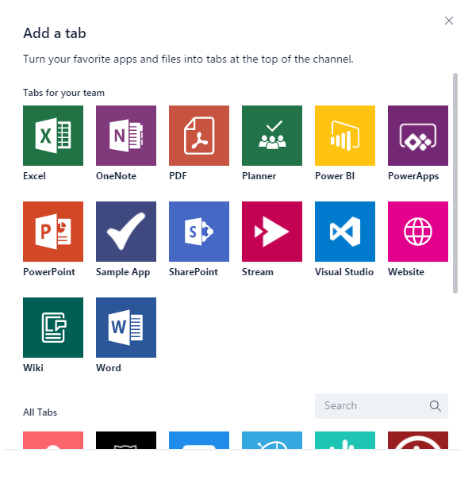

# Отправка пакета приложения в Microsoft TeamsUpload an app package to Microsoft Teams

Чтобы протестировать свое приложение в Microsoft Teams, необходимо отправить приложение в Teams.To test your app experience within Microsoft Teams, you need to upload your app to Teams. Отправка добавляет приложение в выбранную команду, и вы и участники вашей команды можете взаимодействовать с ним, как и с конечными пользователями.Uploading adds the app to the team you select, and you and your team members can interact with it like end users.

> [!NOTE]
> Отправка обновленного пакета для существующего приложения с помощью бота может не показывать изменения вкладки при просмотре в окне "Беседы".Uploading an updated package for an existing app with a bot might not show tab changes when viewed through the Conversations window. Доступ к нему лучше получить с помощью fly-out приложения или тестирования в чистой тестовой среде.It's better to access it via the Apps fly-out, or test on a clean test environment.

## Создание пакета отправкиCreate your upload package

Для разработки, а также отправки в AppSource (прежнее значение — Магазин Office) необходимо создать загружаемый пакет, содержащий сведения для описания вашего опыта.For development as well as AppSource (formerly Office Store) submission you must create an uploadable package that contains the information to describe your experience. Пакет , ZIP-файл, содержит манифест приложения и значки, которые однозначно определяют ваш опыт.The package, a .zip file, contains the application manifest and icons that uniquely define your experience.

Чтобы создать пакет отправки, см. [статью "Создание пакета для приложения Microsoft Teams".](../build-and-test/apps-package.md)To create an upload package, see [Create the package for your Microsoft Teams app](../build-and-test/apps-package.md).

После создания пакета вы можете отправить его в команду.With your package created, you can now upload it into a team. После отправки он будет доступен для всех пользователей в выбранной команде и только для пользователей этой команды.Once uploaded it will be available for all users in the selected team, and only the users of that team.

## Загрузка пакета в TeamsLoad your package into Teams

Вы можете протестировать пакет, загрузив его в Teams.You can test your package by uploading it into Teams.

> [!NOTE]
> Для отправки на работу администратор клиента должен сначала включить [отправку приложений.](/microsoftteams/admin-settings)For uploading to work, your tenant admin must first [enable uploading of apps](/microsoftteams/admin-settings).

Существует два способа отправки приложения в Teams:There are two ways to upload your app to Teams:

* Использование МагазинаUsing the Store
* Использование вкладки "Приложения"Using the Apps tab

## Отправка пакета в команду или беседу с помощью МагазинаUpload your package into a team or conversation using the Store

1. В левом нижнем углу Teams выберите значок Магазина.In the lower left corner of Teams, choose the Store icon. На странице Магазина выберите "Отправить пользовательское приложение".On the Store page, choose "Upload a custom app".

  

2. В *диалоговом* окте "Открыть" перейдите к пакету, который нужно отправить, и выберите *"Открыть".*In the *Open* dialog, navigate to the package you want to upload and choose *Open*.

   

Теперь загруженный пакет должен быть доступен для использования в команде или беседе, указанной в диалоговом оке согласия.The uploaded package should now be available for use in the team or conversation specified in the consent dialog. Если ваше приложение не появляется, наиболее распространенной причиной является ошибка в манифесте, особенно это ид для приложений, ботов и расширений обмена сообщениями.If your app does not appear, the most common reason is an error in the manifest, particularly ids for the app, bot and messaging extensions. Если область приложения не является областью для бесед, этот параметр не будет отображаться.If the app is not scoped for conversations, that option will not appear.

>[!NOTE]
> Приложения в беседах в настоящее [время Developer Preview,](../../resources/dev-preview/developer-preview-intro.md)и этот параметр не будет отображаться, если Teams не работает в этом режиме.Apps in conversations is currently in [Developer Preview](../../resources/dev-preview/developer-preview-intro.md), and the option will not appear if Teams is not running in that mode.

## Отправка пакета в команду с помощью вкладки "Приложения"Upload your package into a team using the Apps tab

1. В целевой команде выберите *"Дополнительные параметры"* **(&#8943;)** и *"Управление командой".*In the target team, choose *More options* (**&#8943;**) and choose *Manage team*.

   > [!NOTE]
   > Вы должны быть владельцем команды или разрешить пользователям добавлять соответствующие типы приложений для появления этой функции.You must be the team owner, or the owner must allow users to add the appropriate app types for this functionality to appear.

2. Выберите вкладку "Приложения" и выберите *"Отправить пользовательское приложение"* в правом нижнем правом конце.Select the Apps tab, and then choose *Upload a custom app* on the lower right.

   

3. Найдите и выберите ZIP-пакет на своем компьютере.Browse to and select your .zip package from your computer.

4. После короткой паузы вы увидите в списке загруженные приложения.After a brief pause you will see your uploaded app in the list.

   

Если ваше приложение не загружается, наиболее распространенной причиной является ошибка в манифесте, в частности, ид для приложений, ботов и расширений обмена сообщениями.If your app does not load, the most common reason is an error in the manifest, particularly ids for the app, bot and messaging extensions.

## Доступ к загруженной настраиваемой вкладкеAccessing your uploaded configurable tab

Если приложение содержит вкладки, пользователи могут закрепить их в любом канале беседы или команды с помощью стандартного потока коллекции вкладок:If the app contains tabs, users can pin them to any conversation or team channel using the standard tab gallery flow:

1. Перейдите на канал в команде.Go to a channel in the team. Choose *+* ( Add a *tab*) to the right of the existing tabs.Choose *+* (*Add a tab*) to the right of the existing tabs.

2. Выберите вкладку в галерее.Select your tab from the gallery that appears.

3. Примите приглашение на согласие.Accept the consent prompt.

4. Настройте вкладку на странице [конфигурации](../../tabs/how-to/create-tab-pages/configuration-page.md) и выберите *"Сохранить".*Configure your tab via its [configuration page](../../tabs/how-to/create-tab-pages/configuration-page.md) and choose *Save*.

  

## Доступ к загруженным ботамAccessing your uploaded bot

При добавлении бота в команду его должен использовать любой человек из этой команды, в каналах команды и за ее пределами, в зависимости от определения области бота.When you add a bot to a team, it should be usable by anyone on that team, inside and outside the team channels, depending on bot scope definition. You and other team members will see a post in the General channel indicating that the bot has been added to the team.You and other team members will see a post in the General channel indicating that the bot has been added to the team.

Для бота с поддержкой команд вы можете сначала @mentioning имя бота, который должен автозаполнеть.For a teams-enabled bot, you can start by invoking your bot by @mentioning the name of the bot, which should autocomplete.

Чтобы протестировать прямые чаты с ботом, вы можете получить к нему доступ через домашний сайт приложения, @mention его в канале или найти в окне **"Новый чат".**To test direct chats with your bot, you can either access it via the App home, @mention it in a channel, or search for it in the **New Chat** window.

При добавлении бота в беседу для тестирования прямых чатов с ботом вы можете @mention его в беседе или найти в окне **"Новый чат".**When you add your bot to a conversation To test direct chats with your bot, you can @mention it in a conversation, or search for it in the **New Chat** window.

## Доступ к загруженным соединителамAccessing your uploaded Connector

После загрузки приложения в команде или беседе пользователи могут настроить соединители с помощью стандартного потока коллекции соединитеев:With the app loaded in the team or conversation, users can set up a Connector using the standard Connectors gallery flow:

1. Перейдите на канал в команде.Go to a channel in the team. Выберите *дополнительные параметры* *(&#8943;)* и выберите *соединители.*Choose *More options* (*&#8943;*) and choose *Connectors*.

2. Выберите соединители в разделе **"Неогруженные"** внизу.Select your Connector from the **Sideloaded** section at the bottom.

3. Настройте соединитель на странице [конфигурации и](../../webhooks-and-connectors/how-to/connectors-creating.md) выберите *"Сохранить".*Configure your Connector via its [configuration page](../../webhooks-and-connectors/how-to/connectors-creating.md) and choose *Save*.

  

## Доступ к добавленным расширениям обмена сообщениямиAccessing your uploaded messaging extension

Загруженное приложение с расширением обмена сообщениями  автоматически отображается в меню "Дополнительные параметры"*(&#8943;)* в поле "Составление".An uploaded app with a messaging extension automatically appears in the *More options* (*&#8943;*) menu in the compose box.

## Удаление или обновление приложенияRemoving or updating your app

Если вы хотите удалить приложение, выберите значок корзины рядом с именем приложения в списке ботов "Просмотр Teams".If you want to remove your app, select the trash-can icon next to the app name in the View Teams bots list.

При изменении сведений о манифесте необходимо сначала удалить приложение, а затем добавить обновленный пакет (для каждого пакета в [команду).](#load-your-package-into-teams)If you change manifest information, you must first remove the app and then add the updated package (per [Load your package into a team](#load-your-package-into-teams)). Обратите внимание, что в целом изменения кода в службе не требуют повторной отправки манифеста, если только эти изменения не требуют обновления манифеста (например, изменения URL-адреса или кода приложения Майкрософт для бота).Note that, in general, code changes on your service do not require you to re-upload your manifest, unless those changes require manifest updates (such as changes to the URL or the Microsoft app ID for its bot).

> [!NOTE]
> Полностью удалить бота из личного контекста не существует.There is no way to completely remove a bot from personal context. Если бот будет удален и добавлен повторно, к предыдущей беседе будет добавлено дополнительное взаимодействие с ботом.If the bot is removed and re-added, additional communication with the bot will append to the previous conversation.

## Заметки по устранению неполадокTroubleshooting notes

* Если манифест не загружается, убедитесь, что вы следовали  всем инструкциям в окну "Создание пакета" и проверили манифест на [схеме.](../../resources/schema/manifest-schema.md)If the manifest doesn't load, please double-check that you followed all the instructions in [Create the package](../../concepts/build-and-test/apps-package.md) and validated your manifest against the [schema](../../resources/schema/manifest-schema.md).
