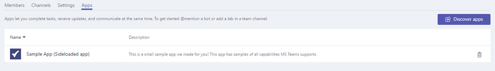

# Отправка пакета приложения в Microsoft Teams

Чтобы протестировать свое приложение в Microsoft Teams, необходимо загрузить приложение в Teams. Загрузка добавляет приложение в выбранную команду, и все члены группы могут взаимодействовать с ним, как и конечные пользователи.

> [!NOTE]
> Загрузка обновленного пакета для существующего приложения с помощью бота может не показывать изменения вкладки при просмотре в окне бесед. Вы можете получить доступ к приложению с помощью вылетов приложений или тестирования в чистой среде.

## Создание пакета отправки

Для разработки и отправки AppSource необходимо создать пакет, который можно загрузить. Пакет должен содержать сведения для описания вашего опыта. Пакет — это файл .zip, содержащий манифест приложения и значки, которые однозначно определяют ваш опыт.

Чтобы создать пакет отправки, [см. в приложении Create the package for your Microsoft Teams.](../build-and-test/apps-package.md)

После создания пакета загрузите его в команду. Загруженный пакет доступен только пользователям выбранной группы.

## Загрузка пакета в Teams

Вы можете протестировать пакет, загрузив его в Teams.

> [!NOTE]
> Для загрузки на работу администратор клиента должен сначала включить [загрузку приложений.](/microsoftteams/admin-settings)

Существует два способа отправки приложения в Teams:

* Использование магазина
* Использование вкладки Apps

## Отправка пакета в команду или беседу с помощью Магазина

1. В левом нижнем углу Команд выберите значок **Store.** На странице Магазин выберите **Загрузите настраиваемую приложение.**

  

2. В **диалоговом** окте Open перейдите к пакету, который необходимо загрузить, и выберите Open.

   

Загруженный пакет должен быть доступен для использования в группе или беседе, указанной в диалоговом окте согласия. Если приложение не появится, наиболее распространенной причиной является ошибка в манифесте, в частности, ID для расширений приложений, ботов и сообщений. Если приложение не является областью для бесед, этот параметр не появится.

>[!NOTE]
> Приложения в беседах в настоящее время [находятся в Developer Preview,](../../resources/dev-preview/developer-preview-intro.md)и этот параметр не появляется, если Teams не работает в этом режиме.

## Отправка пакета в команду с помощью вкладки Apps

1. В целевой группе выберите **дополнительные** параметры **(&#8943;)** и управляйте **командой**.

   > [!NOTE]
   > Вы должны быть владельцем группы или владелец должен предоставить доступ пользователям, чтобы добавить соответствующие типы приложений для появления этой функции.

2. Выберите **вкладку Apps** и **загрузите пользовательское приложение** в правом нижнем справа.

   

3. Выберите пакет .zip с компьютера.

4. Вы можете увидеть загруженные приложения в списке.

   

Если приложение не загружается, наиболее распространенной причиной является ошибка в манифесте, особенно ID для расширений приложений, ботов и сообщений.

## Доступ к загруженной настраиваемой вкладке

Если приложение содержит вкладки, пользователи могут прикрепить их к любому каналу беседы или группы с помощью стандартного потока галереи вкладок:

1. Перейдите на канал в команде. Выберите, **+** чтобы добавить вкладку справа от существующих вкладок.

2. Выберите вкладку из галереи, которая отображается.

3. Примите предложение о согласии.

4. Настройка вкладки через страницу [конфигурации и](../../tabs/how-to/create-tab-pages/configuration-page.md) выберите **Сохранить**.

  

## Доступ к загруженным ботам

После добавления бота в команду его должен использовать любой из этой группы, как внутри, так и за ее пределами, в зависимости от определения области бота. Все члены группы могут видеть сообщение в канале **General,** указывающее, что бот был добавлен в команду.

Для бота Teams вы можете начать с того, что вы @mentioning имя бота.

Чтобы протестировать прямые чаты с ботом, вы можете получить доступ к нему через дом Приложения, @mention его в канале, или найти его в окне **New Chat.**

Вы можете @mention бота в беседе или поискать его в окне **"Новый** чат", чтобы протестировать прямые чаты с ботом.

## Доступ к загруженной соединители

С помощью приложения, загруженного в группе или беседе, пользователи могут настроить соединителет с помощью стандартного потока галереи соединители:

1. Перейдите на канал в команде. Выберите **дополнительные** параметры *(&#8943;)* и **соединители.**

2. Выберите соединителен из раздела **Sideloaded** в нижней части.

3. Настройте соединитель через страницу [конфигурации и](../../webhooks-and-connectors/how-to/connectors-creating.md) выберите **Сохранить**.

  

## Доступ к расширению загруженных сообщений

Загруженное приложение с расширением обмена сообщениями  автоматически отображается в меню More *(&#8943;)* в окне составить.

## Добавление области установки по умолчанию и возможности групповой установки

> [!NOTE]
> Область установки по умолчанию и возможности групповой установки в настоящее время доступны только в предварительном просмотре разработчика.

Несмотря на то, что установка приложения в личной области работает для большинства приложений, некоторые приложения в Teams Store поддерживают как личные, так и командные области.
Некоторые из этих приложений предназначены для работы в команде, собраниях или групповом чате, при этом личный опыт приложения является второстепенным.
Выбор области установки по умолчанию позволяет указать приложения, которые `defaultInstallScope` вы публикуете. При установке приложения параметры по умолчанию доступны пользователю, а остальные перемещаются под шевроном, как посветлено на изображении.

Свойство поддерживает такие значения, как `defaultInstallScope` личные, командные, групповые или собрания.

> [!NOTE]
>`defaultGroupCapability` предоставляет возможность по умолчанию, добавляемую в команду, групповой чат или собрания. Выберите вкладку, бот или соединительщик в качестве возможности по умолчанию для приложения, но необходимо убедиться, что вы предоставили выбранную возможность в определении приложения.

## Удаление или обновление приложения

Чтобы удалить приложение, выберите значок удаления рядом с именем приложения в списке ботов **View Teams.** Если вы измените сведения манифеста, сначала удалите приложение, а затем добавьте обновленный пакет, см. в приложении [Load your package into a team.](#load-your-package-into-teams) Изменения кода в службе не требуют повторной отправки манифеста. Однако если изменения кода требуют обновлений манифеста, таких как изменения URL-адреса или ID приложения Майкрософт для бота, необходимо загрузить манифест снова.

> [!NOTE]
> Невозможно полностью удалить бот из личного контекста. Если бот удаляется и добавляется снова, дополнительная связь с ботом добавляется к предыдущему разговору.

## Заметки по устранению неполадок

Если манифест не загружается, проверьте, следовали ли вы всем инструкциям в [Create the package](../../concepts/build-and-test/apps-package.md) и проверили манифест на [схему](../../resources/schema/manifest-schema.md).
