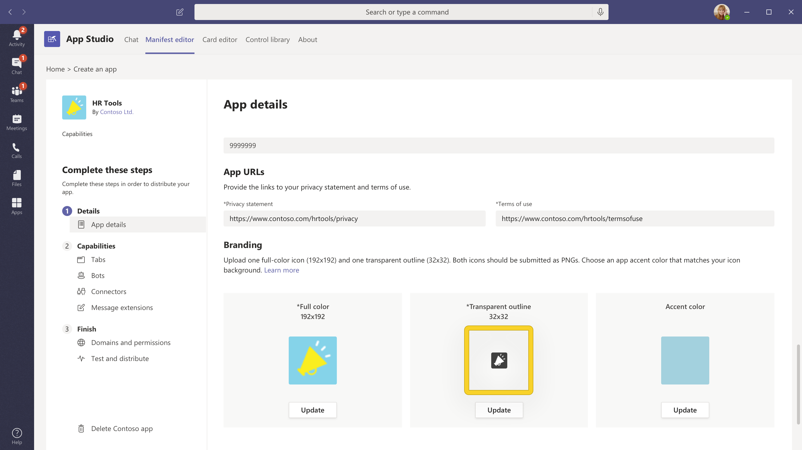

# Создание привлекательной страницы сведений о приложенииBuild a great app details page

Страница сведений представляет первое впечатление от пользователей приложения.The details page presents the first impression of your app to users. Каждый элемент страницы сведений можно использовать для передачи сведений о концепции и загружаемых дисках — Подумайте, как вы хотите, чтобы ваше приложение было в ограниченном объеме.Each element of your details page can be used to convey your vision and drive downloads — consider how you want to showcase your app in a limited space. Вот несколько советов и рекомендаций, которые помогут вам привлечь пользователей, прежде чем устанавливать ваше приложение.Here are some tips and tricks to help you engage your users before they even install your app.

> [!NOTE]
> Убедитесь, что информация о приложении соответствует нашим [рекомендациям по AppSource для создания списка эффективных хранилищ](/office/dev/store/create-effective-office-store-listings).Make sure your app information follows our [AppSource guidance for creating an effective store listing](/office/dev/store/create-effective-office-store-listings).

## Имя приложенияApp name

> [!div class="checklist"]
>
> * Имя приложения играет важную роль в том, как пользователи обнаруживают его в AppSource App Store.An app's name plays a critical role in how users discover it in the AppSource app store. Краткое имя приложения отображается на странице сведений.Your app's short name is displayed on the details page.
>* Имя приложения должно отражать ваше приложение без справочных материалов по продуктам корпорации Майкрософт или корпорации Майкрософт.The app name should reflect your app without any reference to Microsoft or Microsoft products.
>

> **Примечание**: Если ваше приложение является официальным партнерством с корпорацией Майкрософт, то сначала необходимо сначала название стороннего приложения, например, *соединителя salesforce для Microsoft Teams*.**Note**: If your app is an official partnership with Microsoft, then the name of the third-party app needs to be first, e.g., *Salesforce Connector for Microsoft Teams*.

> [!div class="checklist"]
>
>* Воспользуйтесь приведенными ниже ресурсами для получения рекомендаций.Use these resources for guidance:

* [Руководство по имени приложенияApp name guide](https://docs.microsoft.com/microsoftteams/platform/concepts/deploy-and-publish/appsource/prepare/detail-page-checklist#app-name)
* [Рекомендации по использованию товарных знаков и торговых марок корпорации МайкрософтMicrosoft Trademark and Brand Guidelines](https://www.microsoft.com/en-us/legal/intellectualproperty/trademarks/usage/general)

**Сделайте следующее:****Do's:**

* Выберите простое, запоминающееся имя, подсказка на то, что делает ваше приложение.Choose a simple, memorable name that hints at what your app does.
* Быть отличительными.Be distinctive.
* При необходимости используйте справочные материалы по Microsoft 365, а не Office 365.If needed, use Microsoft 365 references instead of Office 365.

**Запреты****Don'ts:**

* Не включайте пробелы, имеют неправильный регистр или содержат ошибки языка в имени приложения.Don't omit spaces, have an incorrect case, or contain language errors in the app name.
* Не используйте универсальные термины или имена, похожие на существующие приложения.Don't use generic terms or names similar to existing apps.
* Не используйте "Teams", "Microsoft", существующие или будущие названия продуктов Майкрософт или "приложение" в имени приложения.Don't use "Teams", "Microsoft", existing/upcoming Microsoft product names, or  "app" in your app name.
* Не используйте скобки, чтобы включить продукты корпорации Майкрософт, например, *имя приложения (для Microsoft Teams)*.Don't use parenthesis to include Microsoft products, e.g., *Your-App-Name (for Microsoft Teams)*.

## Значок цветаColor icon

Это один из первых элементов, которые видят пользователи.This is one of the first elements that users see. Он должен быть привлекательным и глазным при прокрутке в магазине приложений.It should be attractive and eye-catching when scrolling through the app store. Убедитесь, что он является хорошим первым впечатлением, а также передает изображение и цель вашей торговой марки.Be sure it makes a good first impression and also communicates your brand's image and purpose. В AppSource есть дополнительные советы по [созданию согласованного визуального идентификатора](/office/dev/store/create-effective-office-store-listings#create-a-consistent-visual-identity).AppSource has more tips on [creating a consistent visual identity](/office/dev/store/create-effective-office-store-listings#create-a-consistent-visual-identity).

**Запреты****Don'ts:**

* Ваш значок не должен имитировать невладельцами незаконно защищенные продукты.Your icon must not mimic any copyrighted products that you don't own.
* Ваш значок не должен выглядеть аналогично любому продукту или торговым маркам корпорации Майкрософт.Your icon must not look similar to any Microsoft product/brands.

## Значок структурыOutline icon

Используется в расширениях обмена сообщениями, приложениях, помеченных пользователем как избранные, а также в левом меню навигации.This is used in messaging extensions, apps marked as favorite by the user, and the left navigation menu. Убедитесь, что он простой и распознаваемый.Make sure it's simple and recognizable. Значок структуры должен содержать только белый цвет и быть прозрачным.Your outline icon must contain only white color and be transparent. Для получения требуемых спецификаций, *Ознакомьтесь* [со статьей Создание пакета приложения для значков приложения Microsoft Teams](../../../build-and-test/apps-package.md#icons).For required specifications, *See* [Create an app package for your Microsoft Teams app - Icons](../../../build-and-test/apps-package.md#icons).

 

**Запреты****Don'ts:**

* Ваш значок не должен имитировать все авторские права, которыми вы не владеете.Your icon must not mimic any copyrighted products you don't own.
* Ваш значок не должен выглядеть аналогично любому продукту или торговым маркам корпорации Майкрософт.Your icon must not look similar to any Microsoft product/brands.

## Краткое описаниеShort description

Это краткий обзор приложения.This is a concise summary of your app. Оно должно быть оригинальным, увлекательным и направленным на вашу целевую аудиторию.You want it to be original, engaging, and directed at your target audience. В идеале вы можете описать свое решение и его значение для пользователей в одном предложении.Ideally, try and describe your solution and its value to your users in one sentence.

**Сделайте следующее:****Do's:**

* Сначала разместите наиболее важные сведения.Put the most important information first.
* Включение ключевых слов, которые могут выполнять пользователи.Include keywords that customers are likely to search for.
* Если вам необходимо упомянуть о Microsoft Teams, первое упомянутое в Microsoft Teams должно быть написано в *Microsoft Teams*в полном объеме.If you need to mention Microsoft Teams, the first mention of Microsoft Teams should be written out in full as *Microsoft Teams*. Если вы уже упомянули Teams в одном и том же описании, имя может быть сокращено до *Teams*.If Teams is mentioned again in the same description, the name can be shortened to *Teams*.
* Все справочные материалы по Microsoft или Microsoft Teams могут быть частью описания и должны соответствовать стандартам и рекомендациям корпорации Майкрософт.Any references to Microsoft or Microsoft Teams can be part of the description and should follow Microsoft’s brand standards and guidelines.
* Все описания должны быть грамматикалли правильными без ошибок языка.All descriptions must be grammatically correct with no language errors.
* Избегайте ненужного использования прописных букв, например, "Пользователи", а не "Пользователи".Avoid unnecessary use of capitalizations, e.g., stating "Users" instead of "users".

**Запреты****Don'ts:**

* Не повторяйте название.Don't repeat the title.
* Не сокращайте Майкрософт до "MS".Don't abbreviate Microsoft to "MS".
* Не используйте жаргон или специализированную терминологию, вы не можете предположить, что пользователи знают, что искать.Don't use jargon or specialized terminology — you can't assume that users know what to look for.
* Избегайте ненужных ссылок на названия продуктов Майкрософт, если это не является обязательным условием.Avoid unnecessary reference to Microsoft product names unless absolutely necessary.
* Не следует указывать на то, что приложение является предложением от корпорации Майкрософт.Don't indicate or imply that the app is an offering from Microsoft.
* Не используйте фирменные названия, которые не владеете авторскими правами.Don't use copyrighted brand names you don't own.
* Не используйте краткое имя "для Teams".Don't  use "for Teams" in a short name.

Ниже представлено представление в [app Studio](https://aka.ms/InstallTeamsAppStudio):Here's a view in [App Studio](https://aka.ms/InstallTeamsAppStudio):

## Подробное описаниеLong description

> [!div class="checklist"]
>
>* Это позволяет выделять основные компоненты решения, проблемы, решаемые им, и целевую аудиторию.This provides an engaging narrative highlighting your solution's main features, the problems it solves, and the target audience. Нарисуйте в аудитории первое предложение, выполнив обмен данными о уникальных возможностях приложения.Draw in your audience with the first sentence by communicating your app's unique features. Описание должно содержать не более 4000 символов; Большинство пользователей считывает только те слова, которые находятся в пределах 300 и 500.Your description must be under 4000 characters; most users will only read between 300 and 500 words.
>* Что разрешено?What is allowed?

* `<your_app>`  "работа с Microsoft Teams"`<your_app>`  "works with Microsoft Teams"
* `<for users>`  "работа с Microsoft Teams"`<for users>`  "working with Microsoft Teams"
* `<for tasks>`  "в Microsoft Teams"`<for tasks>`  "within Microsoft Teams"
* `<an app>`  "для Microsoft Teams"`<an app>`  "for Microsoft Teams"
* `<your_app>`  "Интеграция с Microsoft Teams"`<your_app>`  "integrates with Microsoft Teams"
* "... Интеграция с Microsoft Teams"...integrated with Microsoft Teams"
* "... строится на... ""...built on…"
* "... работает в... ""...runs on…"
* "... включено по... ""…enabled by…"
* "... разработано для... ""…developed for…"
* "... предназначено для...»."…designed for…"

> **Note**: приведенные выше термины также применимы к использованию Microsoft 365.**Note**: The above terms also apply to the use of Microsoft 365. Теперь Office 365 называется Microsoft 365.Office 365 is now called Microsoft 365. Обновите описания приложений, чтобы отразить это.Please update your app descriptions to reflect this.

>[!IMPORTANT]
> Обязательно скопируйте описания, написанные в записи AppSource, в манифесте приложения — значения должны быть совпадают.Make sure to precisely copy the descriptions you wrote in your AppSource entry to your app manifest — the values must match. Microsoft Teams будет использовать только описания, которые вы задаете в манифесте приложения.Microsoft Teams will only use the descriptions you provide in the app manifest.

**Сделайте следующее:****Do's:**

* Используйте [Форматирование Markdown](https://support.office.com/article/use-markdown-formatting-in-teams-4d10bd65-55e2-4b2d-a1f3-2bebdcd2c772) для освещения вашего описания.Use [Markdown formatting](https://support.office.com/article/use-markdown-formatting-in-teams-4d10bd65-55e2-4b2d-a1f3-2bebdcd2c772) to illuminate your description.  
* Перечислите возможности, которые помогут читателям просканировать ваше описание.List features to aid readers in scanning your description.
* Используйте Active Voice и говорите пользователям напрямую.Use active voice and speak to users directly.
* Используйте точки маркеров для перечисления своих функций.Use bullet points to list out your features.
* Добавьте ссылку справки или поддержки, чтобы пользователи могли узнать, как связаться с вами, если у них возникнут вопросы.Include a help or support link so your users know how to reach you if they have questions.
* Убедитесь, что первое упоминание о Microsoft Teams написано в полном объеме как "*Microsoft Teams*".Make certain that the first mention of Microsoft Teams is written out in full as "*Microsoft Teams*". Если в этом описании еще раз упоминаются Teams, имя можно сократить до "*Teams*".If Teams is mentioned again later in the same description, the name can be shortened to "*Teams*".
* Любые ссылки на Microsoft Teams или Microsoft Teams (если это необходимо) могут быть частью длинного описания и соответствовать стандартам и рекомендациям корпорации Майкрософт.Any references to Microsoft or Microsoft Teams (only if necessary)  may be part of the long description and should follow Microsoft’s brand standards and guidelines.
* Все описания должны быть грамматикалли правильными без ошибок языка.All descriptions must be grammatically correct with no language errors.
* Избегайте ненужного использования прописных букв для терминов в вашем описании (например, "Пользователи", а не "Пользователи".Avoid unnecessary use of capitalizations for terms in your description (example: stating "Users" instead of "users".
* Не следует использовать акронимы.Avoid acronyms.
* Убедитесь, что вызываемые ограничения, зависимость учетных записей, Настройка конфигурации, будущие обновления в выпусках или любые ограничения использованияMake sure to call out limitations, account dependency, configuration set up, future updates in releases, or any usage constraints

>[!NOTE]
> Microsoft Teams поддерживает следующий синтаксис Markdown:Microsoft Teams supports the following Markdown syntax:  
> **Ссылки**.**Links**. `[title](url/address/here)`.`[title](url/address/here)`.  
>**Изображения**. `` .**Images**.``.  
> **Полужирный**.**Bold**. `**bold text**`   `__bold text__`.`**bold text**`   `__bold text__`.  
> **Курсив**.**Italics**. `*italicized text*`  `_italicized text`.`*italicized text*`  `_italicized text`.  
>**[Упорядоченные списки](https://www.markdownguide.org/basic-syntax/#ordered-lists)****[Ordered Lists](https://www.markdownguide.org/basic-syntax/#ordered-lists)** 
>`1. first` 
 ` 1. second ` 
 `1.third` 
>**[Неупорядоченный список](https://www.markdownguide.org/basic-syntax/#unordered-lists)****[Unordered List](https://www.markdownguide.org/basic-syntax/#unordered-lists)** 
` - short`  `- bulleted`  `- list` 
>**Новая строка**.**Newline**. `Place two empty spaces or a backslash \`  \
`at the end of a line.` 
 >**Переключен.****Escape.** Используйте встроенную обратную косую черту для экранирования специальных символов..Use an inline backslash to escape special characters.. `\*asterisk`.`\*asterisk`.

**Запреты****Don'ts:**

* Не размещайте слишком много ключевых слов в своем описании — это отвлекает внимание и не помогает обнаруживать ваше приложение.Don't put too many keywords in your description — it's distracting and won't help your app's discoverability.
* Не используйте сокращенное имя "*Teams*" или "*Microsoft Teams*".Don't use "*Teams*” or “*Microsoft Teams*” in a short name.
* Избегайте ненужных ссылок на названия продуктов Майкрософт, если это не является обязательным условием.Avoid unnecessary reference to Microsoft product names unless absolutely necessary.
* Не следует указывать на то, что приложение является предложением от Майкрософт.Don't indicate that the app is an offering from Microsoft.
* Не используйте фирменные названия, которые не владеете авторскими правами.Don't use copyrighted brand names you don't own.
* Не используйте следующий язык, если приложение не прошло официальный процесс сертификации:Don't use the following language unless the app has gone through an official certification process:

  * "... сертифицировано для...»"…certified for…"
  * "... на платформе... ""…powered by…"

* Не сокращайте "Майкрософт" до "MS" или "MSFT" — напишите Майкрософт в полном объеме.Don't abbreviate “Microsoft” to “MS” or “MSFT” — write Microsoft out in full.
* Ни часть описания, ни метаданные не могут указать, что приложение является официальным предложением Майкрософт.No part of description or metadata can indicate the app as an official Microsoft offering.
* Партнеры могут не использовать или имитировать любую рекламную фразу Майкрософт или использовать название любого продукта или службы Майкрософт в слоган или ключевой рекламной фразе.Partners may not use or imitate any Microsoft tagline, or use the name of any Microsoft product or service in the slogan or tagline.
* Эмблема не должна правильно расизображать приложение как официальный продукт или функцию Майкрософт или имитировать любой из существующих или будущих продуктов Майкрософт.Logo must not wrongly depict the app as an official Microsoft product/ feature or mimic any of the existing or upcoming Microsoft products.

Ниже представлено представление в [app Studio](https://aka.ms/InstallTeamsAppStudio):Here's a view in [App Studio](https://aka.ms/InstallTeamsAppStudio):

## Снимки экранаScreenshots

Снимки экрана, которые передаются в [центре партнеров](https://partner.microsoft.com) , отображаются как в [AppSource](https://appsource.microsoft.com/marketplace/apps?product=office%3Bteams&page=1) , так и в списке приложения в клиенте Teams.The screenshots uploaded on the [Partner Center](https://partner.microsoft.com) are displayed in both [AppSource](https://appsource.microsoft.com/marketplace/apps?product=office%3Bteams&page=1) and your app listing in the Teams client. Они предоставляют визуальный обзор приложения вместе с описанием приложения.They provide a visual preview of your app along with your app description.
Можно предоставить от одного до пяти снимков изображения в формате PNG, JPG или GIF.You can provide one to five screenshots formatted as .png, .jpg, or .gif files. Размер снимков экрана должен быть 1366 x 768 пикселей с максимальным размером 1024 КБ.Screenshots should be 1366 x 768 pixels with a maximum size of 1024 KB.

**Сделайте следующее:****Do's:**

* Сосредоточьтесь на выделении всех возможностей приложения.Focus on highlighting all your app's capabilities.
* Контент должен точно представлять ваше приложение.Content should accurately represent your app.
* Текст должен быть хорошо заполнен без избыточности.Text should be well-populated without being excessive.
* Вы можете разместить снимки экрана с фоновым цветом и добавить маркетинговый контент, похожий на пример [фрешдеск](https://appsource.microsoft.com/product/office/WA104381505?src=office&tab=Overview) ; Тем не менее, размеры снимка не будут относиться только к снимку экрана, но будут включать в себя общее изображение.You can surround your screenshots with a background color and add marketing content similar to the [Freshdesk](https://appsource.microsoft.com/product/office/WA104381505?src=office&tab=Overview) example; however, the dimensions won't be of the screenshot alone but will include the overall image.

**Запреты****Don'ts:**

* Не показывать конкретные устройства, например, телефоны и Ноутбуки.Don't show specific devices, like phones or laptops.
* Не выводите сведения о хроме и пользовательском интерфейсе извне приложения.Don't show any chrome/UI from outside of your app.
* Не заменяйте пользовательский интерфейс команд и браузеров в снимках экрана.Don't capture any Teams or browser UI in your screenshots.
* Не включайте в себя макеты, которые неточно соответствуют реальному пользовательскому интерфейсу приложений, например, на веб-сайте, а не на вкладке Teams.Don't include mock-ups that inaccurately reflect your apps actual UI such as showing your website instead of your Teams tab.

Дополнительные *рекомендации: создание* [эффективных изображений в магазине AppSource](/office/dev/store/craft-effective-appsource-store-images).For more best practices, *see*: [Crafting effective AppSource store images](/office/dev/store/craft-effective-appsource-store-images).

## ВидеоVideos

Если изображение стоит тысячи слов, то в видеоролике стоит тысячи изображений.If an image is worth a thousand words, then a video is worth a thousand images. Видео — самый эффективный способ общения с преимуществами использования вашего приложения.Videos are the most effective way to communicate the benefits of using your app. Он будет размещаться перед всеми снимками экрана на странице "сведения о приложении".It will be placed in front of all your screenshots on the app details page. Убедитесь, что вы упомянули следующее:Make sure you mention the following:

* Как работает ваше приложение.How your app works.
* Что можно сделать с приложением.What can be achieved with your app.
* Преимущества использования приложения.The benefits of using your app.
* От кого предназначено.Who your is for.

Помните, что ваша презентация должна быть короткой и упрощенной в промежутке между 30-90 секунд.Remember to keep your presentation short and sweet — somewhere between 30-90 seconds.

## ПодробнееLearn more

[Контрольный список для отправки приложения](~/concepts/deploy-and-publish/appsource/publish.md).[Checklist for app submission](~/concepts/deploy-and-publish/appsource/publish.md).  
[Создайте пакет приложения для приложения Microsoft Teams](~/concepts/build-and-test/apps-package.md).[Create an app package for your Microsoft Teams app](~/concepts/build-and-test/apps-package.md).  
[Используйте центр партнеров, чтобы послать решение в AppSource](/office/dev/store/use-partner-center-to-submit-to-appsource).[Use Partner Center to submit your solution to AppSource](/office/dev/store/use-partner-center-to-submit-to-appsource).
