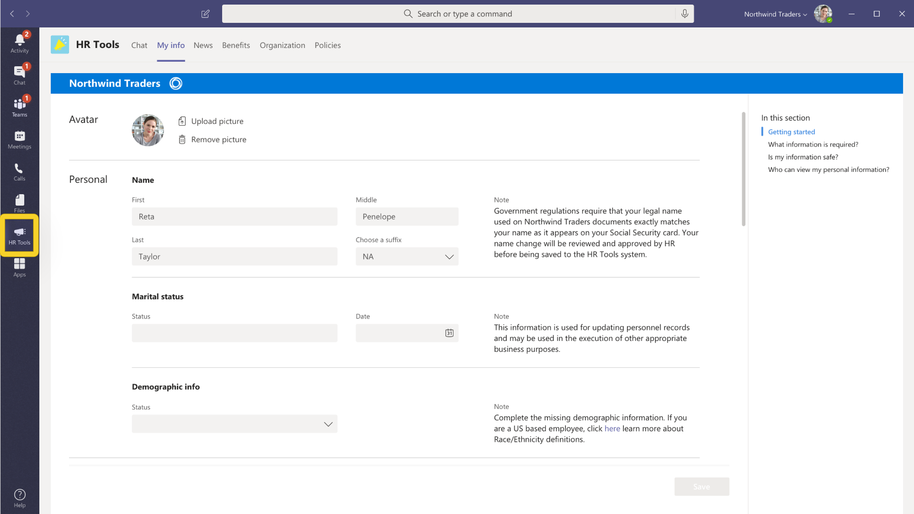

# Создание отличной страницы сведений о приложенииBuild a great app details page

На странице сведений представлено первое впечатление вашего приложения для пользователей.The details page presents the first impression of your app to users. Каждый элемент страницы сведений можно использовать для передачи вашего зрения и скачиваемых дисков— подумайте, как вы хотите продемонстрировать приложение в ограниченном пространстве.Each element of your details page can be used to convey your vision and drive downloads — consider how you want to showcase your app in a limited space. Вот несколько советов и советов, которые помогут вам привлечь пользователей, прежде чем они даже установят ваше приложение.Here are some tips and tricks to help you engage your users before they even install your app.

> [!NOTE]
> Убедитесь, что сведения о вашем приложении следуют нашим [рекомендациям AppSource по созданию эффективного описание в Магазине.](/office/dev/store/create-effective-office-store-listings)Make sure your app information follows our [AppSource guidance for creating an effective store listing](/office/dev/store/create-effective-office-store-listings).

## Имя приложенияApp name

> [!div class="checklist"]
>
> * Имя приложения играет важную роль в том, как пользователи обнаруживают его в магазине приложений AppSource.An app's name plays a critical role in how users discover it in the AppSource app store. Краткое имя приложения отображается на странице сведений.Your app's short name is displayed on the details page.
>* Имя приложения должно отражать ваше приложение без ссылки на продукты Майкрософт или Майкрософт.The app name should reflect your app without any reference to Microsoft or Microsoft products.
>

> **Примечание.** Если ваше приложение является официальным партнерством с корпорацией Майкрософт, имя стороннего приложения должно быть первым, *например, Salesforce Connector для Microsoft Teams.***Note**: If your app is an official partnership with Microsoft, then the name of the third-party app needs to be first, e.g., *Salesforce Connector for Microsoft Teams*.

> [!div class="checklist"]
>
>* Используйте эти ресурсы для указания:Use these resources for guidance:

* [Руководство по имени приложенияApp name guide](#app-name)
* [Руководство по товарным знакам и торговой марке МайкрософтMicrosoft Trademark and Brand Guidelines](https://www.microsoft.com/en-us/legal/intellectualproperty/trademarks/usage/general)

**Есть:****Do's:**

* Выберите простое запоминающееся имя, которое подсказает, что делает ваше приложение.Choose a simple, memorable name that hints at what your app does.
* Будьте отличительными.Be distinctive.
* При необходимости используйте ссылки на Microsoft 365 вместо Office 365.If needed, use Microsoft 365 references instead of Office 365.

**Не:****Don'ts:**

* Не опустить пробелы, неправильное дело или содержать языковые ошибки в имени приложения.Don't omit spaces, have an incorrect case, or contain language errors in the app name.
* Не используйте универсальные термины или имена, похожие на существующие приложения.Don't use generic terms or names similar to existing apps.
* Не используйте "Teams", "Microsoft", существующие/предстоящие названия продуктов Майкрософт или "app" в имени приложения.Don't use "Teams", "Microsoft", existing/upcoming Microsoft product names, or  "app" in your app name.
* Не используйте скобки для использования продуктов Майкрософт, например *Your-App-Name (для Microsoft Teams).*Don't use parenthesis to include Microsoft products, e.g., *Your-App-Name (for Microsoft Teams)*.

## Значок цветаColor icon

Это один из первых элементов, который видят пользователи.This is one of the first elements that users see. Она должна быть привлекательной и привлекательной при прокрутке магазина приложений.It should be attractive and eye-catching when scrolling through the app store. Убедитесь, что она создает хорошее первое впечатление, а также сообщает об образе и назначении вашей торговой марки.Be sure it makes a good first impression and also communicates your brand's image and purpose. AppSource имеет дополнительные советы по [созданию согласованного визуального удостоверения.](/office/dev/store/create-effective-office-store-listings#create-a-consistent-visual-identity)AppSource has more tips on [creating a consistent visual identity](/office/dev/store/create-effective-office-store-listings#create-a-consistent-visual-identity).

**Не:****Don'ts:**

* Ваш значок не должен ражать любые продукты, защищенные авторским правом, которыми вы не владеете.Your icon must not mimic any copyrighted products that you don't own.
* Ваш значок не должен выглядеть так же, как любой продукт или бренд Майкрософт.Your icon must not look similar to any Microsoft product/brands.

## Значок "Контур"Outline icon

Этот значок используется для закрепленных расширений обмена сообщениями и когда приложение отображается слева от Teams.This icon is used for pinned messaging extensions and when your app displays on the left of Teams. См. [руководство по проектированию значка контура.](../../../../concepts/build-and-test/apps-package.md#outline-icon)See [design guidance for the outline icon](../../../../concepts/build-and-test/apps-package.md#outline-icon).

 

**Не:****Don'ts:**

* Ваш значок не должен имитировать продукты, защищенные авторским правом, которыми вы не владеете.Your icon must not mimic any copyrighted products you don't own.
* Ваш значок не должен выглядеть так же, как любой продукт или бренд Майкрософт.Your icon must not look similar to any Microsoft product/brands.

## Краткое описаниеShort description

Это краткая сводка по вашему приложению.This is a concise summary of your app. Оно должно быть оригинальным, увлекательным и направленным на вашу целевую аудиторию.You want it to be original, engaging, and directed at your target audience. В идеале попробуйте описать свое решение и его ценность для пользователей в одном предложении.Ideally, try and describe your solution and its value to your users in one sentence.

**Есть:****Do's:**

* Сначала разместите наиболее важные сведения.Put the most important information first.
* Включаем ключевые слова, которые пользователи, скорее всего, будут искать.Include keywords that customers are likely to search for.
* Если вам нужно упомянуть Microsoft Teams, первое упоминание Microsoft Teams должно быть полностью записано как *Microsoft Teams.*If you need to mention Microsoft Teams, the first mention of Microsoft Teams should be written out in full as *Microsoft Teams*. Если Teams снова упоминается в том же описании, его имя можно сократить до *Teams.*If Teams is mentioned again in the same description, the name can be shortened to *Teams*.
* Любые ссылки на Microsoft или Microsoft Teams могут быть частью описания и должны следовать стандартам и рекомендациям Корпорации Майкрософт по торговой марке.Any references to Microsoft or Microsoft Teams can be part of the description and should follow Microsoft’s brand standards and guidelines.
* Все описания должны быть грамматически правильными без ошибок языка.All descriptions must be grammatically correct with no language errors.
* Избегайте ненужного использования закадров, например, с указанием "Пользователи", а не "пользователи".Avoid unnecessary use of capitalizations, e.g., stating "Users" instead of "users".

**Не:****Don'ts:**

* Не повторяйте заголовок.Don't repeat the title.
* Не задайте для Microsoft сокращение "MS" или "MSFT".Don't abbreviate Microsoft to "MS" or "MSFT".
* Не используйте жаргон или специальную терминологию — вы не можете предположить, что пользователи знают, что искать.Don't use jargon or specialized terminology — you can't assume that users know what to look for.
* Избегайте ненужных ссылок на названия продуктов Майкрософт, если это не является абсолютно необходимым.Avoid unnecessary reference to Microsoft product names unless absolutely necessary.
* Не следует указывать или подразумевать, что приложение предлагается корпорацией Майкрософт.Don't indicate or imply that the app is an offering from Microsoft.
* Не используйте фирменные имена, защищенные авторскими правами, которые вы не владеете.Don't use copyrighted brand names you don't own.
* Не используйте слово "для Teams" в коротком имени.Don't  use "for Teams" in a short name.

Вот представление в [App Studio:](https://aka.ms/InstallTeamsAppStudio)Here's a view in [App Studio](https://aka.ms/InstallTeamsAppStudio):

## Подробное описаниеLong description

> [!div class="checklist"]
>
>* Это обеспечивает привлекательное описание основных функций решения, проблем, которые оно решает, и целевой аудитории.This provides an engaging narrative highlighting your solution's main features, the problems it solves, and the target audience. Нарисуйте аудиторию с помощью первого предложения, сообщая об уникальных функциях вашего приложения.Draw in your audience with the first sentence by communicating your app's unique features. Описание должно быть менее 4000 символов; большинство пользователей читают от 300 до 500 слов.Your description must be under 4000 characters; most users will only read between 300 and 500 words.
>* Что разрешено?What is allowed?

* `<your_app>`  "работает с Microsoft Teams"`<your_app>`  "works with Microsoft Teams"
* `<for users>`  "работа с Microsoft Teams"`<for users>`  "working with Microsoft Teams"
* `<for tasks>`  "в Microsoft Teams"`<for tasks>`  "within Microsoft Teams"
* `<an app>`  "для Microsoft Teams"`<an app>`  "for Microsoft Teams"
* `<your_app>`  "интегрируется с Microsoft Teams"`<your_app>`  "integrates with Microsoft Teams"
* "... интегрировано с Microsoft Teams""...integrated with Microsoft Teams"
* "... встроено...""...built on…"
* "... выполняется в...""...runs on…"
* "... включено...""…enabled by…"
* "... разработано для...""…developed for…"
* "... предназначено для...""…designed for…"

> **Примечание.** Вышеперечисленные условия также применимы к использованию Microsoft 365.**Note**: The above terms also apply to the use of Microsoft 365. Office 365 теперь называется Microsoft 365.Office 365 is now called Microsoft 365. Обновите описания приложений, чтобы отразить это.Please update your app descriptions to reflect this.

>[!IMPORTANT]
> Обязательно скопируйте описания, которые вы написали в записи AppSource, в манифест приложения. Значения должны совпадать.Make sure to precisely copy the descriptions you wrote in your AppSource entry to your app manifest — the values must match. Microsoft Teams будет использовать только описания, которые вы предоставляете в манифесте приложения.Microsoft Teams will only use the descriptions you provide in the app manifest.

**Есть:****Do's:**

* Используйте [форматирование Markdown для](https://support.office.com/article/use-markdown-formatting-in-teams-4d10bd65-55e2-4b2d-a1f3-2bebdcd2c772) освещения описания.Use [Markdown formatting](https://support.office.com/article/use-markdown-formatting-in-teams-4d10bd65-55e2-4b2d-a1f3-2bebdcd2c772) to illuminate your description.  
* Список функций, которые помогают читателям при сканировании описания.List features to aid readers in scanning your description.
* Используйте активную голосовую речь и обращаться непосредственно к пользователям.Use active voice and speak to users directly.
* Используйте маркерные точки для списка функций.Use bullet points to list out your features.
* Включите ссылку на справку или поддержку, чтобы пользователи знали, как связаться с вами, если у них возникли вопросы.Include a help or support link so your users know how to reach you if they have questions.
* Убедитесь, что первое упоминание Microsoft Teams полностью записано как *"Microsoft Teams".*Make certain that the first mention of Microsoft Teams is written out in full as "*Microsoft Teams*". Если Teams упоминается позже в том же описании, его имя можно сократить до *"Teams".*If Teams is mentioned again later in the same description, the name can be shortened to "*Teams*".
* Любые ссылки на Microsoft или Microsoft Teams (только при необходимости) могут быть частью длинного описания и должны следовать стандартам и рекомендациям Корпорации Майкрософт по фирменности.Any references to Microsoft or Microsoft Teams (only if necessary)  may be part of the long description and should follow Microsoft’s brand standards and guidelines.
* Все описания должны быть грамматически правильными без ошибок языка.All descriptions must be grammatically correct with no language errors.
* Избегайте ненужного использования закалярий для терминов в описании (например, "Пользователи", а не "пользователи").Avoid unnecessary use of capitalizations for terms in your description (example: stating "Users" instead of "users".
* Избегайте акронимов.Avoid acronyms.
* Обязательно вызовите ограничения, зависимость учетной записи, настройку конфигурации, будущие обновления в выпусках или любые ограничения использованияMake sure to call out limitations, account dependency, configuration set up, future updates in releases, or any usage constraints

>[!NOTE]
> Microsoft Teams поддерживает следующий синтаксис Markdown:Microsoft Teams supports the following Markdown syntax:  
> **Ссылки.****Links**. `[title](url/address/here)`.`[title](url/address/here)`.  
>**Изображения.** `` .**Images**.``.  
> **Полужирный**.**Bold**. `**bold text**`   `__bold text__`.`**bold text**`   `__bold text__`.  
> **Italics**.**Italics**. `*italicized text*`  `_italicized text`.`*italicized text*`  `_italicized text`.  
>**[Упорядоченные списки](https://www.markdownguide.org/basic-syntax/#ordered-lists)****[Ordered Lists](https://www.markdownguide.org/basic-syntax/#ordered-lists)** 
>`1. first` 
 ` 1. second ` 
 `1.third` 
>**[Неусортванный список](https://www.markdownguide.org/basic-syntax/#unordered-lists)****[Unordered List](https://www.markdownguide.org/basic-syntax/#unordered-lists)** 
` - short`  `- bulleted`  `- list` 
>**Newline**.**Newline**. `Place   at the end of a line.`   \
 >\**Escape.** \
\**Escape.** Используйте линлину, чтобы избежать специальных символов.Use an inline backslash to escape special characters. `\*asterisk`.`\*asterisk`.

**Пример в формате Markdown****Example in Markdown format**

|Формат Markdown дляMarkdown format for |Формат MarkdownMarkdown format |Отображаемая текстоваяDisplayed text|
|:---------|:---------------|:-------------|
|ссылок.Link  |` [App name guide](#app-name)`| [Руководство по имени приложенияApp name guide](#app-name) |
|ImageImage |` `| |
|ПолужирныйBold |` **HR Tools**` | **Средства управления персоналом****HR Tools**  |
|КурсивItalics |`*HR Tools*` |*Средства управления персоналом**HR Tools*|
|NewlineNewline |` HR Tools provide wide range of solutions that help your organization to manage day-to-day HR activities effectively.   No more flipping through paper records or juggling among 5 different apps.` |Средства управления персоналом предоставляют широкий спектр решений, которые помогают организации эффективно управлять ежедневной деятельностью по управлению персоналом.HR Tools provide wide range of solutions that help your organization to manage day-to-day HR activities effectively.    Больше не перелистывание записей бумаги или переключение между 5 различными приложениями.No more flipping through paper records or juggling among 5 different apps.|
|EscapeEscape|`\*Payroll tools that help you manage your payroll and tax documents.` |\*Средства ведомости, которые помогают управлять зарплатой и налоговыми документами.\*Payroll tools that help you manage your payroll and tax documents. 

**Не:****Don'ts:**

* Не помещайте слишком много ключевых слов в свое описание— это отвлекает и не поможет вашему приложению обнаруживаемость.Don't put too many keywords in your description — it's distracting and won't help your app's discoverability.
* Не используйте *"Teams"* или *"Microsoft Teams"* в коротком имени.Don't use "*Teams*” or “*Microsoft Teams*” in a short name.
* Избегайте ненужных ссылок на названия продуктов Майкрософт, если это не является абсолютно необходимым.Avoid unnecessary reference to Microsoft product names unless absolutely necessary.
* Не указать, что приложение предлагается корпорацией Майкрософт.Don't indicate that the app is an offering from Microsoft.
* Не используйте фирменные имена, защищенные авторскими правами, которые вы не владеете.Don't use copyrighted brand names you don't own.
* Не используйте следующий язык, если приложение не прошло официальный процесс сертификации:Don't use the following language unless the app has gone through an official certification process:

  * "... сертифицировано для...""…certified for…"
  * "... питание от...""…powered by…"

* Не запишите "Майкрософт" в "MS" или "MSFT" полностью.Don't abbreviate “Microsoft” to “MS” or “MSFT” — write Microsoft out in full.
* Ни одна часть описания или метаданных не может указывать приложение как официальное предложение Корпорации Майкрософт.No part of description or metadata can indicate the app as an official Microsoft offering.
* Партнеры не могут использовать теги Майкрософт или имитировать их, а также использовать название какого-либо продукта или службы Майкрософт в теге или теге.Partners may not use or imitate any Microsoft tagline, or use the name of any Microsoft product or service in the slogan or tagline.
* Логотип не должен неправильно изобразить приложение в качестве официального продукта или функции Майкрософт или имитировать существующие или предстоящие продукты Майкрософт.Logo must not wrongly depict the app as an official Microsoft product/ feature or mimic any of the existing or upcoming Microsoft products.

Вот представление в [App Studio:](https://aka.ms/InstallTeamsAppStudio)Here's a view in [App Studio](https://aka.ms/InstallTeamsAppStudio):

## Снимки экранаScreenshots

Снимки экрана, загруженные в Центре партнеров, отображаются как в [AppSource,](https://appsource.microsoft.com/marketplace/apps?product=office%3Bteams&page=1) так и в вашем приложении в клиенте Teams. The screenshots uploaded on the [Partner Center](https://partner.microsoft.com) are displayed in both [AppSource](https://appsource.microsoft.com/marketplace/apps?product=office%3Bteams&page=1) and your app listing in the Teams client. Они предоставляют визуальную предварительную версию приложения вместе с описанием вашего приложения.They provide a visual preview of your app along with your app description.
Вы можете предоставить от одного до пяти снимков экрана в формате PNG, JPG или GIF-файлов.You can provide one to five screenshots formatted as .png, .jpg, or .gif files. Размер снимков экрана: 1366 x 768 пикселей, максимальный размер — 1024 КБ.Screenshots should be 1366 x 768 pixels with a maximum size of 1024 KB.

**Есть:****Do's:**

* Сосредоточься на выделении всех возможностей вашего приложения.Focus on highlighting all your app's capabilities.
* Содержимое должно точно представлять ваше приложение.Content should accurately represent your app.
* Текст должен быть заполнен без чрезмерного использования.Text should be well-populated without being excessive.
* Снимки экрана можно окружить цветом фона и добавить маркетинговое содержимое, аналогичное примеру [Freshdesk;](https://appsource.microsoft.com/product/office/WA104381505?src=office&tab=Overview) Однако размеры будут не только на снимке экрана, но и в целом.You can surround your screenshots with a background color and add marketing content similar to the [Freshdesk](https://appsource.microsoft.com/product/office/WA104381505?src=office&tab=Overview) example; however, the dimensions won't be of the screenshot alone but will include the overall image.

**Не:****Don'ts:**

* Не показывать определенные устройства, например телефоны или ноутбуки.Don't show specific devices, like phones or laptops.
* Не показыйте хром и пользовательский интерфейс из-за пределов приложения.Don't show any chrome/UI from outside of your app.
* Не фиксировать на снимках экрана пользовательский интерфейс Teams или браузера.Don't capture any Teams or browser UI in your screenshots.
* Не включайте макеты, которые неточно отражают фактический пользовательский интерфейс ваших приложений, например отображение веб-сайта вместо вкладки Teams.Don't include mock-ups that inaccurately reflect your apps actual UI such as showing your website instead of your Teams tab.

Дополнительные практические практики *см. в* подкассылке эффективных изображений [магазина AppSource.](/office/dev/store/craft-effective-appsource-store-images)For more best practices, *see*: [Crafting effective AppSource store images](/office/dev/store/craft-effective-appsource-store-images).

## ВидеоVideos

Если изображение стоит тысячи слов, видео стоит тысячи изображений.If an image is worth a thousand words, then a video is worth a thousand images. Видео — это наиболее эффективный способ сообщить о преимуществах использования приложения.Videos are the most effective way to communicate the benefits of using your app. Он будет размещен перед всеми снимками экрана на странице сведений о приложении.It will be placed in front of all your screenshots on the app details page. Не забудьте упомянуть следующее:Make sure you mention the following:

* Как работает ваше приложение.How your app works.
* Чего можно достичь с помощью вашего приложения.What can be achieved with your app.
* Преимущества использования приложения.The benefits of using your app.
* Для кого вы.Who your is for.

Не забудьте оставить презентацию короткой и приятной — где-то между 30–90 секундами.Remember to keep your presentation short and sweet — somewhere between 30-90 seconds.

## Дополнительные сведенияLearn more

[Контрольный список для отправки приложения.](~/concepts/deploy-and-publish/appsource/publish.md)[Checklist for app submission](~/concepts/deploy-and-publish/appsource/publish.md).  
[Создайте пакет приложения для приложения Microsoft Teams.](~/concepts/build-and-test/apps-package.md)[Create an app package for your Microsoft Teams app](~/concepts/build-and-test/apps-package.md).  
[Отправка решения в AppSource с помощью Центра партнеров.](/office/dev/store/use-partner-center-to-submit-to-appsource)[Use Partner Center to submit your solution to AppSource](/office/dev/store/use-partner-center-to-submit-to-appsource).
