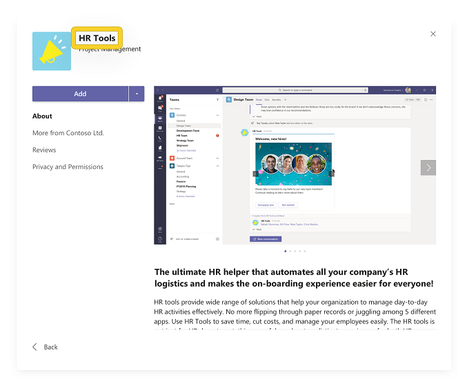

# Создание привлекательной страницы сведений о приложении

Страница сведений представляет первое впечатление от пользователей приложения. Каждый элемент страницы сведений можно использовать для передачи сведений о концепции и загружаемых дисках — Подумайте, как вы хотите, чтобы ваше приложение было в ограниченном объеме. Вот несколько советов и рекомендаций, которые помогут вам привлечь пользователей, прежде чем устанавливать ваше приложение.

> [!NOTE]
> Убедитесь, что информация о приложении соответствует нашим [рекомендациям по AppSource для создания списка эффективных хранилищ](/office/dev/store/create-effective-office-store-listings).

## Имя приложения

> [!div class="checklist"]
>
> * Имя приложения играет важную роль в том, как пользователи обнаруживают его в AppSource App Store. Краткое имя приложения отображается на странице сведений.
>* Имя приложения должно отражать ваше приложение без справочных материалов по продуктам корпорации Майкрософт или корпорации Майкрософт.
>

> **Примечание**: Если ваше приложение является официальным партнерством с корпорацией Майкрософт, то сначала необходимо сначала название стороннего приложения, например, *соединителя salesforce для Microsoft Teams*.

> [!div class="checklist"]
>
>* Воспользуйтесь приведенными ниже ресурсами для получения рекомендаций.

* [Руководство по имени приложения](https://docs.microsoft.com/microsoftteams/platform/concepts/deploy-and-publish/appsource/prepare/detail-page-checklist#app-name)
* [Рекомендации по использованию товарных знаков и торговых марок корпорации Майкрософт](https://www.microsoft.com/en-us/legal/intellectualproperty/trademarks/usage/general)

**Сделайте следующее:**

* Выберите простое, запоминающееся имя, подсказка на то, что делает ваше приложение.
* Быть отличительными.
* При необходимости используйте справочные материалы по Microsoft 365, а не Office 365.

**Запреты**

* Не включайте пробелы, имеют неправильный регистр или содержат ошибки языка в имени приложения.
* Не используйте универсальные термины или имена, похожие на существующие приложения.
* Не используйте "Teams", "Microsoft", существующие или будущие названия продуктов Майкрософт или "приложение" в имени приложения.
* Не используйте скобки, чтобы включить продукты корпорации Майкрософт, например, *имя приложения (для Microsoft Teams)*.

## Значок цвета

Это один из первых элементов, которые видят пользователи. Он должен быть привлекательным и глазным при прокрутке в магазине приложений. Убедитесь, что он является хорошим первым впечатлением, а также передает изображение и цель вашей торговой марки. В AppSource есть дополнительные советы по [созданию согласованного визуального идентификатора](/office/dev/store/create-effective-office-store-listings#create-a-consistent-visual-identity).

**Запреты**

* Ваш значок не должен имитировать невладельцами незаконно защищенные продукты.
* Ваш значок не должен выглядеть аналогично любому продукту или торговым маркам корпорации Майкрософт.

## Значок структуры

Используется в расширениях обмена сообщениями, приложениях, помеченных пользователем как избранные, а также в левом меню навигации. Убедитесь, что он простой и распознаваемый. Значок структуры должен содержать только белый цвет и быть прозрачным. Для получения требуемых спецификаций, *Ознакомьтесь* [со статьей Создание пакета приложения для значков приложения Microsoft Teams](../../../build-and-test/apps-package.md#icons).

 

**Запреты**

* Ваш значок не должен имитировать все авторские права, которыми вы не владеете.
* Ваш значок не должен выглядеть аналогично любому продукту или торговым маркам корпорации Майкрософт.

## Краткое описание

Это краткий обзор приложения. Оно должно быть оригинальным, увлекательным и направленным на вашу целевую аудиторию. В идеале вы можете описать свое решение и его значение для пользователей в одном предложении.

**Сделайте следующее:**

* Сначала разместите наиболее важные сведения.
* Включение ключевых слов, которые могут выполнять пользователи.
* Если вам необходимо упомянуть о Microsoft Teams, первое упомянутое в Microsoft Teams должно быть написано в *Microsoft Teams*в полном объеме. Если вы уже упомянули Teams в одном и том же описании, имя может быть сокращено до *Teams*.
* Все справочные материалы по Microsoft или Microsoft Teams могут быть частью описания и должны соответствовать стандартам и рекомендациям корпорации Майкрософт.
* Все описания должны быть грамматикалли правильными без ошибок языка.
* Избегайте ненужного использования прописных букв, например, "Пользователи", а не "Пользователи".

**Запреты**

* Не повторяйте название.
* Не сокращайте Майкрософт до "MS" или "MSFT".
* Не используйте жаргон или специализированную терминологию, вы не можете предположить, что пользователи знают, что искать.
* Избегайте ненужных ссылок на названия продуктов Майкрософт, если это не является обязательным условием.
* Не следует указывать на то, что приложение является предложением от корпорации Майкрософт.
* Не используйте фирменные названия, которые не владеете авторскими правами.
* Не используйте краткое имя "для Teams".

Ниже представлено представление в [app Studio](https://aka.ms/InstallTeamsAppStudio):

## Подробное описание

> [!div class="checklist"]
>
>* Это позволяет выделять основные компоненты решения, проблемы, решаемые им, и целевую аудиторию. Нарисуйте в аудитории первое предложение, выполнив обмен данными о уникальных возможностях приложения. Описание должно содержать не более 4000 символов; Большинство пользователей считывает только те слова, которые находятся в пределах 300 и 500.
>* Что разрешено?

* `<your_app>`  "работа с Microsoft Teams"
* `<for users>`  "работа с Microsoft Teams"
* `<for tasks>`  "в Microsoft Teams"
* `<an app>`  "для Microsoft Teams"
* `<your_app>`  "Интеграция с Microsoft Teams"
* "... Интеграция с Microsoft Teams
* "... строится на... "
* "... работает в... "
* "... включено по... "
* "... разработано для... "
* "... предназначено для...».

> **Note**: приведенные выше термины также применимы к использованию Microsoft 365. Теперь Office 365 называется Microsoft 365. Обновите описания приложений, чтобы отразить это.

>[!IMPORTANT]
> Обязательно скопируйте описания, написанные в записи AppSource, в манифесте приложения — значения должны быть совпадают. Microsoft Teams будет использовать только описания, которые вы задаете в манифесте приложения.

**Сделайте следующее:**

* Используйте [Форматирование Markdown](https://support.office.com/article/use-markdown-formatting-in-teams-4d10bd65-55e2-4b2d-a1f3-2bebdcd2c772) для освещения вашего описания.  
* Перечислите возможности, которые помогут читателям просканировать ваше описание.
* Используйте Active Voice и говорите пользователям напрямую.
* Используйте точки маркеров для перечисления своих функций.
* Добавьте ссылку справки или поддержки, чтобы пользователи могли узнать, как связаться с вами, если у них возникнут вопросы.
* Убедитесь, что первое упоминание о Microsoft Teams написано в полном объеме как "*Microsoft Teams*". Если в этом описании еще раз упоминаются Teams, имя можно сократить до "*Teams*".
* Любые ссылки на Microsoft Teams или Microsoft Teams (если это необходимо) могут быть частью длинного описания и соответствовать стандартам и рекомендациям корпорации Майкрософт.
* Все описания должны быть грамматикалли правильными без ошибок языка.
* Избегайте ненужного использования прописных букв для терминов в вашем описании (например, "Пользователи", а не "Пользователи".
* Не следует использовать акронимы.
* Убедитесь, что вызываемые ограничения, зависимость учетных записей, Настройка конфигурации, будущие обновления в выпусках или любые ограничения использования

>[!NOTE]
> Microsoft Teams поддерживает следующий синтаксис Markdown:  
> **Ссылки**. `[title](url/address/here)`.  
>**Изображения**. `` .  
> **Полужирный**. `**bold text**`   `__bold text__`.  
> **Курсив**. `*italicized text*`  `_italicized text`.  
>**[Упорядоченные списки](https://www.markdownguide.org/basic-syntax/#ordered-lists)** 
>`1. first` 
 ` 1. second ` 
 `1.third` 
>**[Неупорядоченный список](https://www.markdownguide.org/basic-syntax/#unordered-lists)** 
` - short`  `- bulleted`  `- list` 
>**Новая строка**. `Place two empty spaces or a backslash \`  \
`at the end of a line.` 
 >**Переключен.** Используйте встроенную обратную косую черту для экранирования специальных символов.. `\*asterisk`.

**Запреты**

* Не размещайте слишком много ключевых слов в своем описании — это отвлекает внимание и не помогает обнаруживать ваше приложение.
* Не используйте сокращенное имя "*Teams*" или "*Microsoft Teams*".
* Избегайте ненужных ссылок на названия продуктов Майкрософт, если это не является обязательным условием.
* Не следует указывать на то, что приложение является предложением от Майкрософт.
* Не используйте фирменные названия, которые не владеете авторскими правами.
* Не используйте следующий язык, если приложение не прошло официальный процесс сертификации:

  * "... сертифицировано для...»
  * "... на платформе... "

* Не сокращайте "Майкрософт" до "MS" или "MSFT" — напишите Майкрософт в полном объеме.
* Ни часть описания, ни метаданные не могут указать, что приложение является официальным предложением Майкрософт.
* Партнеры могут не использовать или имитировать любую рекламную фразу Майкрософт или использовать название любого продукта или службы Майкрософт в слоган или ключевой рекламной фразе.
* Эмблема не должна правильно расизображать приложение как официальный продукт или функцию Майкрософт или имитировать любой из существующих или будущих продуктов Майкрософт.

Ниже представлено представление в [app Studio](https://aka.ms/InstallTeamsAppStudio):

## Снимки экрана

Снимки экрана, которые передаются в [центре партнеров](https://partner.microsoft.com) , отображаются как в [AppSource](https://appsource.microsoft.com/marketplace/apps?product=office%3Bteams&page=1) , так и в списке приложения в клиенте Teams. Они предоставляют визуальный обзор приложения вместе с описанием приложения.
Можно предоставить от одного до пяти снимков изображения в формате PNG, JPG или GIF. Размер снимков экрана должен быть 1366 x 768 пикселей с максимальным размером 1024 КБ.

**Сделайте следующее:**

* Сосредоточьтесь на выделении всех возможностей приложения.
* Контент должен точно представлять ваше приложение.
* Текст должен быть хорошо заполнен без избыточности.
* Вы можете разместить снимки экрана с фоновым цветом и добавить маркетинговый контент, похожий на пример [фрешдеск](https://appsource.microsoft.com/product/office/WA104381505?src=office&tab=Overview) ; Тем не менее, размеры снимка не будут относиться только к снимку экрана, но будут включать в себя общее изображение.

**Запреты**

* Не показывать конкретные устройства, например, телефоны и Ноутбуки.
* Не выводите сведения о хроме и пользовательском интерфейсе извне приложения.
* Не заменяйте пользовательский интерфейс команд и браузеров в снимках экрана.
* Не включайте в себя макеты, которые неточно соответствуют реальному пользовательскому интерфейсу приложений, например, на веб-сайте, а не на вкладке Teams.

Дополнительные *рекомендации: создание* [эффективных изображений в магазине AppSource](/office/dev/store/craft-effective-appsource-store-images).

## Видео

Если изображение стоит тысячи слов, то в видеоролике стоит тысячи изображений. Видео — самый эффективный способ общения с преимуществами использования вашего приложения. Он будет размещаться перед всеми снимками экрана на странице "сведения о приложении". Убедитесь, что вы упомянули следующее:

* Как работает ваше приложение.
* Что можно сделать с приложением.
* Преимущества использования приложения.
* От кого предназначено.

Помните, что ваша презентация должна быть короткой и упрощенной в промежутке между 30-90 секунд.

## Подробнее

[Контрольный список для отправки приложения](~/concepts/deploy-and-publish/appsource/publish.md).  
[Создайте пакет приложения для приложения Microsoft Teams](~/concepts/build-and-test/apps-package.md).  
[Используйте центр партнеров, чтобы послать решение в AppSource](/office/dev/store/use-partner-center-to-submit-to-appsource).
