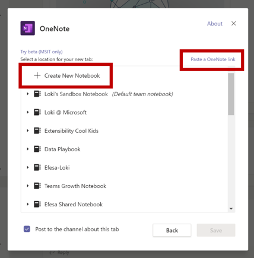

# Советы по успешной отправке приложения

В этой статье рассматриваются распространенные причины, по которым отправленные приложения не прошли проверку. Несмотря на то, что он не является исчерпывающим списком возможных проблем с вашим приложением, в этом руководстве увеличится вероятность того, что ваше приложение будет проходить в первый раз. Для получения обширного списка политик проверки, *Ознакомьтесь* со статьей [Политика сертификации коммерческих рынков](/legal/marketplace/certification-policies) .

>[!NOTE]
>**[Раздел 1140](/legal/marketplace/certification-policies#1140-teams)** относится только к Microsoft teams **[1140,4](https://docs.microsoft.com/legal/marketplace/certification-policies#11404-functionality)** и [! важно!] устраняет функциональные требования для приложений Teams.

## Рекомендации по проверке & наиболее неудачные тестовые случаи

### Общие сведения о &#9989;

*See also* [Раздел 100 — общие](/legal/marketplace/certification-policies#100-general) сведения

* Убедитесь, что вы используете [пакет SDK для Microsoft Teams](https://www.npmjs.com/package/@microsoft/teams-js)версии 1.4.1 или более поздней версии.
* Не вносите изменения в свое приложение во время выполнения процесса проверки. Для этого потребуется полная повторная проверка приложения.
* Ваше приложение не должно отвечать на запросы, неожиданно завершать работу или содержать программные ошибки. Если возникла ошибка, приложение должно корректно завершать работу и предоставлять пользователю действительное сообщение переадресации.
* Ваше приложение не должно автоматически скачивать, устанавливать или запускать исполняемый код в пользовательской среде. Все загружаемые файлы должны искать явное разрешение пользователя.
* Все материалы, которые вы связываете с вашим интерфейсом, такие как описания и документация по поддержке, должны быть точными. Описания и материалы должны быть написаны грамотно, без орфографических ошибок, с правильным использованием прописных букв и знаков препинания.
* Предоставление справочных сведений и сведений о поддержке. Настоятельно рекомендуется, чтобы приложение включало ссылку Справка/вопросы и ответы для первого запуска интерфейса пользователя. Для всех персональных приложений рекомендуем использовать страницу справки в качестве личной вкладки для улучшения взаимодействия с пользователем.
* Приложения не должны принимать пользователя из Teams для основных пользовательских сценариев. Использование модулей задач и вкладок рекомендуется для отображения сведений для пользователей в Teams.
* Увеличьте номер версии приложения в манифесте, если вы вносите изменения в манифест отправку.
* Приложение не должно брать пользователей из Teams для основных пользовательских сценариев. Конечные объекты ссылок в приложениях не должны ссылаться на внешний браузер, но должны ссылаться на элементы div, содержащиеся в Teams, например внутри модулей задач и вкладок.
* Персональные приложения позволяют пользователям обмениваться контентом из личного приложения с другими участниками группы.

### &#9989; предоставляют простой и простой вход/выход и регистрацию

*See also* [Раздел 1100,5 — элемент управления Customer](/legal/marketplace/certification-policies#11005-customer-control)

* Если приложение или надстройка зависят от внешних учетных записей или служб, то функция входа в систему, выхода из нее и входа в систему должна быть очевидна и достижима во всех возможностях приложения.
* Если для пользователя предоставлен явный параметр входа, должен быть установлен соответствующий параметр Sign-Out (даже если приложение использует [автоматическую проверку подлинности](../../../../tabs/how-to/authentication/auth-silent-aad.md)).
* Функция выхода должна подписывать пользователя только от возможности приложения, а не от клиента Teams.
* Как минимум, функция выхода должна подписывать пользователя на те же возможности, что и при входе. Например, если параметр входа содержит как расширение и вкладка обмена сообщениями, то параметр выхода должен содержать как расширение и вкладка обмена сообщениями, так и расширение.

* Убедитесь, что существует способ обратить следующие (или аналогичные) варианты поведения:
  * Вход => выход.
  * Link a Account/Service => отменить связь учетной записи или службы.
  * Connect a Account/Service => отключение учетной записи или службы.
  * Авторизация учетной записи или службы => отмена авторизации или отказа учетной записи или службы.
  * Зарегистрируйте учетную запись или службу => отменить регистрацию или отменить подписку на учетную запись или службу.
* Если для приложения требуется учетная запись или служба, необходимо предоставить пользователю способ регистрации или создания запроса на регистрацию. Если для приложения требуется лицензия на использование, может быть выдано исключение. Однако в таких сценариях необходимо предоставить простой способ пересылки для нового пользователя.
* Обязательно ознакомьтесь с инструкциями по четкому пересылке для нового пользователя о том, как подписаться на использование служб приложения. Если ссылка "готовая подписка" недоступна, может быть предоставлен простой способ пересылки в следующих областях.

> [!div class="checklist"]
>
> * в разделах описания приложения;
> * в приветственном сообщении приложения;
> * в справочном сообщении приложения;
> * в окне, в котором пользователь должен войти в службы;

* Приложения, для которых не используется простой процесс регистрации, могут также включать вкладку справки или ссылку на веб-страницу, где новый пользователь может просмотреть подробные инструкции по настройке приложения с помощью Microsoft Teams.  Это позволяет убедиться, что новый пользователь не блокируется при первом запуске приложения.
* Функции входа и выхода должны работать на мобильных клиентах. Убедитесь, что используется [Microsoft Teams SDK](https://www.npmjs.com/package/@microsoft/teams-js) версии 1.4.1 или более поздней версии.

Дополнительные сведения о проверке подлинности содержатся в следующих статьях:

* [Документация по проверке подлинности](../../../authentication/authentication.md)
* [Пример односерверной проверки подлинности в узле](https://github.com/OfficeDev/microsoft-teams-sample-auth-node)
* [Пример проверки подлинности на вкладке "узел"](https://github.com/OfficeDev/microsoft-teams-sample-complete-node)
* [Проверка подлинности с помощью вкладок и ленты в C#/.нет](https://github.com/OfficeDev/microsoft-teams-sample-complete-csharp)

### Время отклика &#9989; должно быть приемлемым

* **Вкладки**. Если ответ на действие длится более трех секунд, необходимо предоставить сообщение о загрузке или предупреждение.
* **Боты**. Ответ на команду пользователя должен выполняться в течение двух секунд. Если требуется более длительная обработка, приложение должно отображать индикатор ввода.
* **Создание расширений**. Ответ на команду пользователя должен выполняться в течение пяти секунд.

> [!TIP]
> Убедитесь, что приложение отображает индикатор загрузки или некоторую форму предупреждения, когда приложение занимает больше времени, чем ожидалось.

### &#9989; контент вкладки не должен иметь чрезмерно хрома или многоуровневую навигацию

* Вкладки должны предоставлять ориентированный контент и избегать ненужных элементов пользовательского интерфейса. Как правило, это обычно относится к необязательной вложенной или многоуровневой навигации, внешнему или недоступному пользовательскому интерфейсу рядом с содержимым или любым ссылкам, которые принимают пользователя к несвязанному контенту. Например, ниже представлен вид вкладки, в котором опущены меню навигации, и только демонстрируется основное содержимое:

  

* Вкладки должны быть светлыми в природе и не включать сложную навигацию.
* Вкладки каналов с сложными возможностями редактирования в приложении должны открыть представление редактора в нескольких окнах, а не на вкладке.
* Вкладки каналов не должны предоставлять панель приложения со значками в левой границе, которые конфликтуют с навигацией по основным командам Teams.
* Вкладки не должны показывать панель приложения со значками в левой границе, которые конфликтуют с навигацией по основным командам Teams.
* Вкладки с сложными возможностями редактирования в приложении должны открыть представление редактора в нескольких окнах, а не на вкладке.
* Если есть несколько вариантов представления, рассмотрите возможность выбора вкладки вкладки для пользователя. Например, вместо встраивания меню на вкладку разместите меню на странице Конфигурация, чтобы представление действительной вкладки было четким и ориентированным.
* Включите вкладку *Справка* в виде статической вкладки, чтобы уведомить пользователей о настройке, регистрации и использовании приложения.
* Перейдите на вкладку *Параметры* , которая доступна в заголовке приложения.

### Настройка вкладки &#9989; должна выполняться на экране конфигурации

* На экране "Конфигурация" должно быть четко объяснено значение взаимодействия и Настройка вкладки.
* Процесс настройки всегда должен предоставить пользователям способ продолжения работы пользователя. Например, не показывать пустую доску после того, как пользователь настроил вкладку
* Процесс входа пользователя в систему должен быть частью процесса настройки и должен завершаться в пользовательском интерфейсе вкладки. После того как пользователь завершит настройку и загрузил вкладку, никаких дополнительных действий не требуется.
* Не выводите всю веб-страницу во всплывающем окне Конфигурация входа.
* Пользователь всегда должен иметь возможность завершить настройку, даже если он не может сразу найти искомое содержимое.
* Конфигурация должна предоставлять пользователю параметры для поиска своего содержимого, закреплять URL-адрес или создавать новый контент, если он не существует.
* Настройка должна сохраняться в контексте Teams. Пользователю не нужно выходить из конфигурации, чтобы создать контент, а затем вернуться в Teams, чтобы закрепить его.
* Эффективное использование доступной области окна просмотра. Не излишнее использование огромных логотипов внутри всплывающей конфигурации

### &#9989; Боты всегда должны отвечать на запросы и завершаться некорректно

Ваш робот должен отвечать на команды, а не неработающие пользователя. Ниже приведено несколько советов, которые помогут вам пореагировать на поправку пользователей с помощью ленты.

* **Используйте списки команд**. Анализ вводимых пользователем данных или прогнозирования намерения пользователя очень сложно. Вместо того чтобы позволить пользователям угадать, что может сделать Bot, предоставьте список команд, распознаваемых с помощью Bot.

* **Добавьте команду Help**. Пользователи, скорее всего, будут вводить "Справка", когда она будет потеряна или не ответила должным образом. Добавьте команду Help, которая описывает, как будет изменяться значение приложения, а также все допустимые команды.

* **Включение справочных материалов или рекомендаций при потере ленты**. Если пользователь Bot не может распознать вводимые данные, он должен предложить альтернативное действие. Например, *"я не понимаю. Введите "Help" для получения дополнительных сведений. "* Не отвечайте на сообщение об ошибке или просто *"я не понимаю"*. Используйте эту возможность для обучения пользователей.

* **Использование адаптивных карт и модулей задач для очистки ответа от Bot и действий** 
 [Адаптивные карточки с кнопками, вызывающими модули задач](/task-modules-and-cards/task-modules/task-modules-bots) , улучшают интерфейс пользователя Bot. Эти карточки и кнопки проще использовать на мобильном устройстве, а не на вводе этих команд пользователем. Кроме того, ответы ленты не должны быть текстовыми с длинным текстом. Боты должны использовать адаптивные карты & модулях задач вместо пользовательского интерфейса на основе общения и продолжительных текстовых ответов.

* **Продумайте все области**. Убедитесь, что в приглашении `@*botname*` в канале и в личном беседе у вас есть соответствующие ответы. Если ваш робот не предоставляет осмысленный контекст в области личных или Teams, отключите эту область с помощью манифеста. (См `bots` . блок в [справочнике по схеме манифеста Microsoft Teams](../../../../resources/schema/manifest-schema.md#bots).)

* **Включение команды, группового чата или беседы по 1:1**. К уведомлениям Bot должен относиться команда, чат группы или беседа "один к одному" с релевантным контентом для аудитории.

* **Не надавите конфиденциальные данные**. Боты не должно помещать конфиденциальные данные в команду, участие в группе или беседу по 1:1, если у вас есть аудитория, которые не должны иметь возможность просматривать эти данные.

* **Введите приветственное сообщение**. Bot должен предоставить приветственное сообщение FRE, которое включает интерактивное руководство с карточками обоймы и кнопки "попробовать", чтобы способствовать задействованию.

### &#9989; Personal Боты всегда должно отправлять приветственное сообщение при первом запуске

Приветственные сообщения — это лучший способ задать тон для ленты личного или чата. Это первое взаимодействие пользователя с программой Bot. Хорошее приветственное сообщение может способствовать пользователю продолжить изучение приложения. Если приветственное или вступительное сообщение непонятны или неясно, пользователи не видят значение приложения немедленно и теряют интересы.
Требования к приветственному сообщению представлены в приведенном ниже разделе.

> [!Note]
> Приветственное сообщение необязательно для ленты канала.

### Требования к приветственному сообщению

* Включите предложение со значением в качестве начального курса.
* Предоставление последовательного руководства по использованию приложения.
* Включение рекомендаций по регистрации и настройке приложения
* Представление легко читаемого текста и легкое диалоговое окно — предпочтительная карточка с кнопкой обзора приветствия, которая загружает модуль задачи.
* Для простоты и использования с помощью кнопок и карточек Избегайте длинного текста, диалога беседы.
* Включите адаптивные карты и кнопки, чтобы сделать приветственное сообщение более пригодным для использования.
* Вызов приветственного сообщения с помощью одной команды ping, а не двух или более одновременных сеансов связи.
* Приветственное сообщение должно быть отображено только пользователю, который настроил приложение, желательно в 1:1 личном чате.
* Персональные приложения всегда должны предоставлять пользователю приветственное сообщение.
* Никогда не отправлять личный чат каждому участнику группы — это считается спамом.
* Никогда не отправлять приветственное сообщение больше одного раза. Повторение такого же приветственного сообщения через регулярные интервалы не допускается и считается нежелательным.

#### Избежание нежелательной почты в приветственном сообщении

* **Сообщение канала с помощью Bot**. Не спама, создавая отдельные новые записи чата. Создайте поток POST с ответами в одном и том же потоке.
* **Личный чат с помощью Bot**. Не отправлять несколько сообщений. Отправьте одно сообщение с полными сведениями. Повторение такого же приветственного сообщения через регулярные интервалы не допускается и считается нежелательным.

#### Приветственные сообщения ленты только для уведомлений

Только уведомления Боты должны отправлять приветственное сообщение, содержащее сообщение *"я получит сообщение" только для уведомления и не сможет отвечать на ваши беседы "*.

#### Приветственные сообщения в личной области

* **Сделайте сообщение кратким и информативным**.  Скорее всего, взаимодействие с пользователем и знание вашего приложения будут отличаться. Пользователь может использовать ваше приложение на другой платформе или ничего не знать о вашем приложении. Вы хотите настроить сообщение для всех аудиторий, а в паре предложений поясняется, что делает ваш Bot, и способы взаимодействия с ним. Кроме того, следует объяснить ценность приложения и то, как пользователи будут пользоваться им.

* **Сделайте сообщение действием**. Продумайте первую вещь, которую должны делать пользователи после установки приложения. Есть ли замечательная команда, которую следует предпринять? Есть ли еще у вас работа по входящей миграции? Требуется выполнить вход? Вы можете добавлять действия к адаптивной карточке или предоставлять конкретные примеры, такие как *"попробовать запрашивать...."* , *"это то, что можно сделать..."*.

#### Приветственные сообщения в области группы или канала

При первом добавлении ленты в канал некоторые из них отличаются. Обычно сообщение 1:1 не должно отправляться всем участникам команды, но в канале Bot можно отправить приветственное сообщение.

### &#9989; скорость отклика мобильных устройств без прямой продаж или оплаты

* Вкладки, адаптивные карты, сообщения Bot и контент в модулях задач должны отвечать на различные размеры экранов мобильных устройств.
* Приложения, поддерживающие iOS, должны быть полностью работоспособны на последнем устройстве iPad с помощью последней версии iOS.
* Не должны быть включены какие-либо прямые ссылки на покупки в приложениях, пробные предложения, предложения платных версий или ссылки на Интернет-магазины, где пользователи могут покупать или получать другие материалы, приложения или надстройки из приложения Teams в мобильную ОС (Android, iOS).
* Надстройка для iOS или Android не должна отображать пользовательский интерфейс или язык или ссылаться на другие приложения, надстройки или веб-сайт, которые запрашивают у пользователя оплату.
* Связанная политика конфиденциальности и условия использования также должны быть свободными от любой ссылки на интерфейс пользователя или хранилища Commerce.

### &#9989; не размещайте конфиденциальные данные в аудиторию, не предназначенную для просмотра данных

Ваше приложение Teams не должно учитывать конфиденциальные данные, такие как инструмент "кредитная карта/финансовая оплата", личные сведения (ПИН-код), работоспособность или трассировка контакта, на аудиторию, не предназначенную для просмотра этих данных.

### &#9989; не передавать сведения об финансовых платежах или завершать финансовые транзакции через приложение Teams

* Приложение Teams не должно попросить пользователей выполнить оплату непосредственно в интерфейсе Teams.
* Приложения не могут передавать сведения о финансовом инструменте через пользователя в интерфейсе приложения. Приложения могут передавать только ссылки на защищенные службы оплаты пользователям, если это указано в условиях использования приложения, политики конфиденциальности и любой страницы профиля или веб-сайта приложения до того, как пользователь соглашается использовать приложение.

### &#9989; очистить предупреждение перед загрузкой файлов и исполняемых файлов ( `.exe` ) в среду пользователя

Предупредите пользователей, прежде чем приложение загрузит файлы или исполняемые файлы ( `.exe`  ) на компьютер пользователя или в среду.

### &#9989; расширениями обмена сообщениями должен предоставляться текст справки, который легко читать

* Расширение обмена сообщениями на основе поиска должно предоставлять справочный текст по эффективному поиску (например, для отображения примера ввода).
* Модули задач должны включать значок и краткое имя, которое они содержат в приложении или созданы из него.
* `@mention`Исполняемые файлы расширения сообщения должны быть понятными, понятными и удобными для чтения.

## Сопоставление категорий приложений

| Категория Teams       | Категории ПК  |
|:---------------------|:---------------|
| Аналитики и бизнес-аналитики | Аналитика, Визуализация данных и бизнес-аналитика |
| Разработчик и ИТ | Средства разработчика, ИТ Admin |
| Образование | Образование |
| Кадры | Отдел кадров и комплектование персонала |
| Эффективность | Управление контентом, файлы и документы, производительность, обучение и учебные пособия и служебные программы |
| Управление проектами | Управление связью, управление проектом, Управление рабочими процессами и бизнес-процессами |
| Продажи и поддержка | Управление клиентами и контактами, поддержка клиентов, управление финансами, продажи и маркетинг |
| Социальные и развлечения | Графические и видеогалереи, образ жизни, Новости и погода, социальные сети, путешествия и Навигация |

> [!div class="nextstepaction"]
> [Дополнительные сведения о политиках утверждения приложений Teams](/legal/marketplace/certification-policies#1140-teams)
