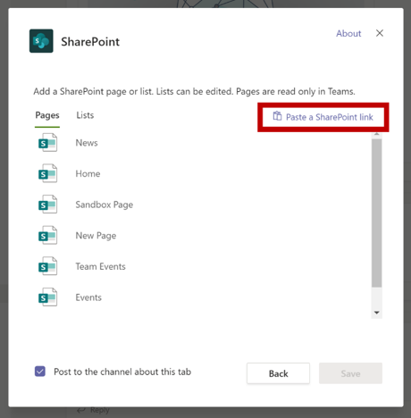

# Советы по успешной отправке приложений Microsoft TeamsTips for a successful Microsoft Teams app submission

В этой статье представлены распространенные причины неудачной проверки отправленных приложений.This article addresses common reasons submitted apps fail validation. Хотя это не исчерпывающий список всех потенциальных проблем с приложением, следуя этому руководству, вероятность того, что отправка приложения пройдет в первый раз, увеличится.While it's not intended to be an exhaustive list of all potential issues with your app, following this guide will increase the likelihood that your app submission will pass the first time. Дополнительный [список](/legal/marketplace/certification-policies) политик проверки см. в списке политик сертификации коммерческих рынков.See [Commercial marketplace certification policies](/legal/marketplace/certification-policies) for an extensive list of validation policies.

>[!NOTE]
>**[Раздел 1140 посвящен](/legal/marketplace/certification-policies#1140-teams)** Microsoft Teams, а в разделе **[1140.4](https://docs.microsoft.com/legal/marketplace/certification-policies#11404-functionality)** — требования к функциональным возможностям приложений Teams.**[Section 1140](/legal/marketplace/certification-policies#1140-teams)** is specific to Microsoft Teams and **[sub-section 1140.4](https://docs.microsoft.com/legal/marketplace/certification-policies#11404-functionality)** addresses functionality requirements for Teams apps.

## Рекомендации по проверке & наиболее неудачных тестовых случаевValidation guidelines & most failed test cases

### &#9989; общие соображения&#9989; General considerations

См. [также раздел 100 — Общие](/legal/marketplace/certification-policies#100-general)See also [Section 100 — General](/legal/marketplace/certification-policies#100-general)

* Убедитесь, что вы используете версию 1.4.1 или более поздней версии [SDK Microsoft Teams.](https://www.npmjs.com/package/@microsoft/teams-js)Ensure you are using version 1.4.1 or later of the [Microsoft Teams SDK](https://www.npmjs.com/package/@microsoft/teams-js).
* Не внося изменений в приложение во время процесса проверки.Don't make changes to your app while the validation process is in progress. Для этого потребуется полная переоценка приложения.Doing so will require a complete revalidation of your app.
* Ваше приложение не должно прекращать реагировать на действия пользователя, неожиданно завершать работу или содержать программные ошибки.Your app must not stop responding, end unexpectedly, or contain programming errors. Если возникает проблема, ваше приложение должно сбой и предоставить допустимые сведения для пути вперед к пользователю.If an issue occurs, your app must fail and provide valid information for the way-forward to the user.
* Ваше приложение не должно автоматически скачивать, устанавливать или запускать любой исполняемый код в пользовательской среде.Your app must not automatically download, install, or launch any executable code in the user environment. Все загрузки должны получить явное разрешение от пользователя.All downloads must seek explicit permission from the user.
* Любой материал, который вы связываете со своим опытом, например описания и документация по поддержке, должен быть точным.Any material that you associate with your experience, such as descriptions and support documentation, must be accurate. Описания и материалы должны быть написаны грамотно, без орфографических ошибок, с правильным использованием прописных букв и знаков препинания.Use correct spelling, capitalization, punctuation, and grammar in your descriptions and materials.
* Предоставление сведений о помощи и поддержке.Provide help and support information. Рекомендуется включить в приложение справку или ссылку faQ для первого запуска пользователя.It's highly recommended that your app include a help or FAQ link for the first-run user experience. Для всех личных приложений рекомендуется предоставить страницу справки в качестве личной вкладки для улучшения работы пользователей.For all personal apps, we recommend providing your help page as a personal tab for a better user experience.
* Все приложения должны иметь визуальный тур, например **Take a Tour** или App **Guide** на экране конфигурации, в который рассказывается о функции приложения и необходимой интеграции в следующих местах:All apps must have a visual tour, such as **Take a Tour** or an **App Guide** in its configuration screen that talks about the app features and necessary integration in the following places:
    * Страница листинга магазина (Длинное описание).The store listing page (Long Description).
    * Экран конфигурации вкладок.Tab configuration screen.
    * Приветствие для бота.Welcome message for a bot.
    * Метаданные источника приложения.App source metadata.
    * Экран конфигурации соединитела.Connector configuration screen.

* Визуальный тур может быть видео, скриншот, ссылка на статическую вкладку с сведениями о приложении.The visual tour can be a  video, screenshot, a link to a static tab with app details. Все эти ссылки должны быть в среде Teams.All these references must be within the Teams environment.

      

* При внесении каких-либо изменений в представление в манифесте приумношайте номер версии приложения.Increment your app version number in the manifest if you make any manifest changes to your submission.
* Приложение не должно принимать пользователей из Teams для основных сценариев пользователей.The app must not take users out of Teams for core user scenarios. Целевые объекты ссылок в приложениях не должны связываться с внешним браузером.Link targets in apps must not link to an external browser. Целевые объекты ссылок должны ссылаться на элементы div, содержащиеся в Teams, например, модули задач и вкладки.Link targets must link to div elements contained within Teams, for example, task modules and tabs. 
* С помощью модулей задач или вкладок предлагается отображать сведения пользователям в Teams.Using task modules or tabs is suggested to display information to users within Teams.
* Все основные и непрофильные сценарии должны быть завершены в среде Teams, за исключением:All core and non-core scenarios must be completed within the Teams environment except for:
  * Политика конфиденциальностиPrivacy Policy
  * Условия использования (TOU)Terms Of Use (TOU)
  * Ссылка на веб-сайтWebsite link
  * Процесс регистрацииSign-up process

* Личные приложения позволяют пользователям обмениваться контентом из личного приложения с другими участниками группы.Personal apps enable users to share content from a personal app experience with other team members.

### &#9989; обеспечить четкую и простую возможность регистрации, регистрации и регистрации&#9989; Provide a clear and simple sign-in, sign-out, and sign-up experience

См. [также раздел 1100.5 — управление клиентами](/legal/marketplace/certification-policies#11005-customer-control)See also [Section 1100.5 — Customer control](/legal/marketplace/certification-policies#11005-customer-control)

* Если ваше приложение или надстройка зависят от внешних учетных записей или служб, опыт регистрации, регистрации и регистрации должен быть очевидным и понятным для всех возможностей приложения.If your app or add-in depends on external accounts or services, the sign-in, sign-out, and sign-up experience must be apparent and reachable across all capabilities in your app.
* Если пользователю предоставляется явный параметр входной записи, должен быть соответствующий параметр выхода (даже если приложение использует бесшумную проверку [подлинности).](../../../../tabs/how-to/authentication/auth-silent-aad.md)If there is an explicit sign-in option provided to the user, there must be a corresponding sign-out option (even if the app is using [silent authentication](../../../../tabs/how-to/authentication/auth-silent-aad.md)).
* Параметр выхода должен подписывать пользователя только из возможностей приложения, а не из клиента Teams.The sign-out option must only sign the user out of your app's capability and not out of the Teams client.
* По крайней мере, параметр выхода должен подписать пользователя из тех же возможностей, доступных с помощью параметра вход.At a minimum, the sign-out option must sign the user out of the same capabilities accessed with the sign-in option. Например, если параметр входной платы включает расширение и вкладку обмена сообщениями, то параметр выхода должен включать расширение и вкладку обмена сообщениями.For example, if the sign-in option includes both messaging extension and tab, then the sign-out option must include both messaging extension and tab.

* Убедитесь, что всегда существует способ обратить вспять следующее (или аналогичное) поведение:Make sure there is always a way to reverse the following (or similar) behaviors:
  * Вход => регистрации.Sign-in => sign-out.
  * Ссылка учетной записи или службы => отвязать учетную запись или службу.Link an account/service => unlink an account/service.
  * Подключение учетной записи или службы => отключение учетной записи или службы.Connect an account/service => disconnect an account/service.
  * Авторизация учетной записи/службы => деавторизация/отказ в учетной записи/службе.Authorize an account/service => deauthorize/deny an account/service.
  * Регистрация учетной записи/службы => или отписать учетную запись/службу.Register an account/service => deregister/unsubscribe an account/service.
* Если вашему приложению требуется учетная запись или служба, необходимо предоставить пользователю способ регистрации или создания запроса на регистрацию.If your app requires an account or service, you must provide a way for the user to sign-up or create a sign-up request. Исключение может быть предоставлено, если вашему приложению требуется лицензия на использование.An exception may be granted if your app requires a license to use. В таких сценариях предопишите новому пользователю четкие инструкции по регистрации.In such scenarios, provide clear instructions for a new user to sign-up.
* Предоставление четких указаний по пути к новому пользователю о том, как зарегистрироваться для использования служб приложения.Provide clear guidance on the way-forward to a new user on how to sign-up to use your app services. Если готовая ссылка для регистрации недоступна, укажете точные указания в следующих областях:If a ready sign-up link is not available, provide precise guidance in the following areas:

> [!div class="checklist"]
>
> * в разделе описание приложения.within your app's description section.
> * в приветствуемом сообщении приложения.in your app's welcome message.
> * в справке приложения.in your app's help message.
> * в окне, где вы попросите пользователя войти в свои службы.in the window where you ask a user to sign-in to your services.

* Приложения без простого потока регистрации также должны включать вкладку справки или ссылку на веб-страницу, где новый пользователь может видеть подробные указания по настройке приложения Teams.Apps without an easy sign-up flow must also include a help tab or link to a web page, where a new user can see detailed guidance on configuring your Teams app. Предостереите подробные сведения, чтобы новый пользователь не был заблокирован при первой попытке приложения.Provide detailed information to ensure a new user is not blocked when trying your app for the first time.
* Функции входов и регистрации должны работать на мобильных клиентах.Sign-in and sign-out functionality must work on mobile clients. Убедитесь, что [используется версия SDK Microsoft Teams](https://www.npmjs.com/package/@microsoft/teams-js) 1.4.1 или более поздней версии.Ensure to use the [Microsoft Teams SDK](https://www.npmjs.com/package/@microsoft/teams-js) version 1.4.1 or later.

Дополнительные сведения о проверке подлинности см.:For additional information on authentication see:

* [Документация по проверке подлинностиAuthentication documentation](../../../authentication/authentication.md)
* [Пример проверки подлинности ботов в NodeBot authentication sample in Node](https://github.com/OfficeDev/microsoft-teams-sample-auth-node)
* [Пример проверки подлинности вкладок в NodeTab authentication sample in Node](https://github.com/OfficeDev/microsoft-teams-sample-complete-node)
* [Проверка подлинности tab/bot в C#/.NETTab/bot authentication in C#/.NET](https://github.com/OfficeDev/microsoft-teams-sample-complete-csharp)

### &#9989; время отклика должно быть разумным&#9989; Response times must be reasonable

* **Вкладки**.**Tabs**. Если ответ на действие занимает более трех секунд, необходимо предоставить сообщение о загрузке или предупреждение.If a response to an action takes more than three seconds, you must provide a loading message or warning.
* **Боты**.**Bots**. Ответ на команду пользователя должен произойти в течение двух секунд.A response to a user command must occur within two seconds. Если требуется более длинная обработка, приложение должно отображать индикатор ввода текста.If longer processing is required, your app must display a typing indicator.
* **Составить расширения**.**Compose extensions**. Ответ на команду пользователя должен произойти в течение пяти секунд.A response to a user command must occur within five seconds.

> [!TIP]
> Убедитесь, что ваше приложение отображает индикатор загрузки или предупреждение в том или ином виде, если ваше приложение отвечает дольше, чем ожидалось.Make sure your app displays a loading indicator or some form of warning when your app is taking longer than expected to respond.

### &#9989; Tab не должно иметь чрезмерного хрома или многоуровневой навигации&#9989; Tab content must not have excessive chrome or layered navigation

* Вкладки должны предоставлять сфокусированное содержимое и избегать необходимости элементов пользовательского интерфейса.Tabs must provide focused content and avoid needless UI elements. Обычно это относится к ненужной вложенной или многоуровневой навигации, дополнительному или нерелевантного пользовательского интерфейса рядом с содержимым или любым ссылкам, которые принимают пользователя к несвязанным содержимым.This usually refers to unnecessary nested or layered navigation, an extraneous or irrelevant UI next to the content, or any links that take the user to unrelated content. Например, в следующем представлении вкладки не рассматриваются меню навигации и демонстрируется только основное содержимое:For example, the following tab view omits navigation menus and only showcases the main content:

  

* Вкладки должны быть светлыми по своему характеру и не включать сложную навигацию.Tabs must be light in nature and not include complex navigation.
* Вкладки каналов, которые имеют сложные возможности редактирования в приложении, должны открывать представление редактора в нескольких окнах, а не на вкладке.Channel tabs that have complex editing capabilities within the app must open the editor view in a multi-window rather than a tab.
* Вкладки канала не должны предоставлять панели приложений с значками на левом рельсе, что противоречит основной навигации Teams.Channel tabs must not provide an app bar with icons in the left rail that conflicts with the main Teams navigation.
* Вкладки не должны представлять панели приложений с значками на левом рельсе, которые конфликтуют с основной навигацией Teams.Tabs must not present an app bar with icons in the left rail that conflict with the main Teams navigation.
* Вкладки со сложными возможностями редактирования в приложении должны открывать представление редактора в нескольких окнах, а не на вкладке.Tabs that have complex editing capabilities within the app must open the editor view in a multi-window rather than in the tab.
* Если существует несколько вариантов представления, рассмотрите возможность выбора меню конфигуры вкладок для пользователя.If there are multiple view options, consider having a tab config menu for the user to choose from. Например, вместо встраив меню в вкладку, поместите меню на страницу конфигурации, чтобы фактическое представление вкладки было чистым и сфокусированным.For example, instead of embedding a menu inside the tab, put the menu in the configuration page so the actual tab view is clean and focused.
* Включите *вкладку Справка* в качестве статической вкладки, чтобы сообщить пользователям, как настроить, зарегистрироваться и использовать приложение.Please include a *Help* tab as a static tab to advise users how to configure, sign-up, and use your app.
* Включайте *вкладку Параметры,* доступную в загонах приложения.Please include a *Settings* tab that is available from the app header.

### &#9989; конфигурация tab должна происходить на экране конфигурации&#9989; Tab configuration must happen in the configuration screen

* Экран конфигурации должен четко объяснить значение опыта и настройки вкладки.The configuration screen must clearly explain the value of the experience and how to configure the tab.
* Процесс настройки должен всегда предоставлять пользователям возможность продолжать работу и не прекратить работу пользователя.The configuration process must always provide a way for the users to continue and not end the user experience. Например, не показывать пустую доску после настройки вкладки пользователем.For example, do not show an empty board after the user has configured the tab.
* Процесс регистрации пользователя должен быть частью процесса настройки.The user sign-in process must be a part of the configuration process. Убедитесь, что она будет завершена в пользовательском интерфейсе Tab.Ensure to complete it in the Tab UI. После завершения конфигурации и загрузки вкладки никаких дополнительных действий не требуется.After the user has completed the configuration and loaded the tab, no further action is required.
* Не показывите всю веб-страницу в окне всплывающих окон конфигурации для регистрации.Don't show your entire webpage within the sign-in configuration pop-up window.
* Пользователь всегда должен иметь возможность завершить работу с конфигурацией, даже если он не может сразу найти нужное содержимое.A user must always be able to finish the configuration experience, even if they can’t immediately find the content they’re looking for.
* В интерфейсе конфигурации должны быть указаны параметры поиска контента, пин-кода URL-адреса или создания нового контента, если он не существует.The configuration experience must provide options for the user to find their content, pin a URL, or create new content if it doesn’t exist.
* Опыт настройки должен оставаться в контексте Teams.The configuration experience must remain within the Teams context. Пользователю не нужно оставлять интерфейс конфигурации для создания контента, а затем возвращаться в Teams, чтобы закрепить его.The user shouldn’t have to leave the configuration experience to create content and then return to Teams to pin it.
* Эффективно используйте доступную область представления.Use the available viewport area efficiently. Не тратьте его на использование огромных логотипов внутри всплывающее конфигурации.Do not waste it on using huge logos inside the configuration pop up.

### &#9989; вкладок в канале — доступ к члену&#9989; Tabs in channel - Member access

* Вкладка, настроенная участником в области канала, должна быть доступна другим участникам без необходимости обращаться за разрешениями к члену, настроившего вкладку.A tab configured by a member in a channel scope must be accessible to the other members without having to seek permissions from the member who configured the tab.
* Приложение должно предоставить параметры управления разрешениями заранее, если вкладка для частного или ограниченного использования или требует разрешений от участника, настроившего вкладку.The app must provide the permission management options upfront if the tab is for private or restricted use or requires any permissions from the member who configured the tab.

### &#9989; боты всегда должны быть отзывчивыми и неуявимы&#9989; Bots must always be responsive and fail gracefully

Бот должен реагировать на любую команду, а не на конечный пользователь.Your bot must be responsive to any command and not dead-end the user. Вот несколько советов, которые помогут боту грамотно реагировать на пользователей:Here are some tips to help your bot intelligently respond to users:

* **Используйте списки команд.****Use command lists**. Анализ входных данных пользователей или прогнозирование намерений пользователей — это сложно.Analyzing user input or predicting user intent is hard. Вместо того, чтобы позволить пользователям угадать, что может сделать бот, укайте список команд, понятных боту.Instead of letting users guess what your bot can do, provide a list of commands your bot understands.

* **Включи команду справки.****Include a help command**. Пользователи, скорее всего, введите "Справка", когда они потеряны или когда ваш бот не отвечает, как ожидалось.Users are likely to type "Help" when they are lost or when your bot doesn't respond as expected. Включите команду справки, которая описывает, как будет работать значение приложения, а также все допустимые команды.Include a help command that describes how your app's value will be experienced along with all valid commands.

* **Включите содержимое справки или руководство при проимации бота.****Include help content or guidance when your bot is lost**. Если ваш бот не может понять вход пользователя, он должен предложить альтернативное действие.When your bot cannot understand the user input, it must suggest an alternative action. Например, *"Мне жаль, я не понимаю. Введите "справку" для получения дополнительных сведений".*For example, *"I'm sorry, I don't understand. Type "help" for more information."* Не отвечайте сообщением об ошибке или просто *"Я не понимаю".*Don't respond with an error message or simply, *"I don't understand"*.

### &#9989; командный ответ справки&#9989; Help command response

* Команда справки должна быть точной, а ответы приложения должны быть в адаптивном формате карты с действием контента по крайней мере для шести команд.Help Command must be precise and the app responses must be in an adaptive card format with an actionable content for at least six commands.
* Если в приложении меньше шести команд, проверьте, присутствуют ли все команды в адаптивной карте.If an app has less than six commands, check if all the commands are present in the adaptive card.

  

* **Используйте адаптивные карты и модули задач, чтобы сделать ответ бота понятным и действий** 
 [Адаптивные карточки с кнопками](/task-modules-and-cards/task-modules/task-modules-bots) вызова модулей задач улучшают пользовательский интерфейс бота.**Use adaptive cards and task modules to make your bot response clear and actionable**
[Adaptive cards with buttons invoking task modules](/task-modules-and-cards/task-modules/task-modules-bots) enhance the bot user experience. Эти карточки и кнопки проще использовать на мобильном устройстве в отличие от ввода команд пользователем.These cards and buttons are easier to use in a mobile device as opposed to your user typing the commands. Кроме того, ответы бота не должны быть текстовыми с длинным текстом.Also bot responses must not be textual with long text. Боты должны использовать адаптивные карты и модули задач вместо пользовательского интерфейса на основе беседы и длительных текстовых откликов.Bots must make use of adaptive cards and task modules instead of conversational chat based user interface and lengthy text responses.

* **Продумайте все области.****Think through all scopes**. Убедитесь, что ваш бот предоставляет соответствующие ответы при упоминаний () в `@*botname*` канале и в личных беседах.Be sure that your bot provides appropriate responses when mentioned (`@*botname*`) in a channel and in personal conversations. Если ваш бот не обеспечивает значимый контекст в области личных или команд, отключите эту область с помощью манифеста.If your bot does not provide meaningful context within the personal or teams scope, disable that scope via the manifest. (См. `bots` блок в ссылке на [схему манифеста Microsoft Teams.)](../../../../resources/schema/manifest-schema.md#bots)(See the `bots` block in the [Microsoft Teams manifest schema reference](../../../../resources/schema/manifest-schema.md#bots).)

* **Включи команду, групповой чат или беседу 1:1.****Include team, group chat, or 1:1 conversation**. Уведомления бота должны включать группу, групповой чат или беседу с соответствующим контентом для аудитории.Bot notifications must include a team, a group chat, or a one-to-one conversation with relevant content for your audience.

* **Не нажимай конфиденциальные данные.****Do not push sensitive data**. Боты не должны нажимать конфиденциальные данные на команду, групповой чат или беседу 1:1, где есть аудитория, которая не должна просматривать эти данные.Bots must not push sensitive data to a team, a group chat, or a 1:1 conversation, where there is an audience who must not view that data.

* **Предоставление приветствия.****Provide a welcome message**. Бот должен предоставить приветствие FRE, которое включает интерактивный учебник с карусельными картами или кнопками "попробуйте", чтобы стимулировать вовлеченность.Bot must provide an FRE welcome message that includes an interactive tutorial with carousel cards or "try it" buttons, to encourage engagement.

### &#9989; личные боты всегда должны отправлять приветствие при первом запуске&#9989; Personal bots must always send a welcome message on first launch

Приветствие — это лучший способ настроить тон для личного бота чата.A welcome message is the best way to set the tone for your personal chat bot. Это первое взаимодействие пользователя с ботом.This is the first interaction a user has with the bot. Хорошее приветствие может стимулировать пользователя к изучению приложения.A good welcome message can encourage the user to keep exploring the app. Если приветствие или вводное сообщение является запутанным или неясным, пользователи не сразу увидят значение приложения и потеряют интерес.If the welcome or introductory message is confusing or unclear, users won't see the value of the app immediately and lose interest.
В следующем разделе вы можете узнать о требованиях к приветствуемом сообщении:See the following section for welcome message requirements:

> [!Note]
> Приветствие необязательно для бота канала.A welcome message is optional for a channel bot.

### Требования к приветствую сообщенийWelcome message requirements

* Включай предложение о значении в приветственный тур.Include a value proposition with the welcome tour.
* Руководство по использованию приложения.Provide way-forward guidance for using the app.
* Включите инструкции по регистрации и настройке приложения.Include guidance on how to sign-up and configure your app.
* Представляем простой для чтения текст и простой диалог — желательно карточку с кнопкой приветствия, загружаемой модулем задач.Present easy-to-read text and straightforward dialogue — preferably a card with an actionable welcome tour button that loads a task module.
* Держите его простым и понятным с помощью кнопок и карт — избегайте длинного текста, разговорного диалога.Keep it simple and usable with buttons and cards — avoid long text, chatty dialogue.
* Включай адаптивные карточки и кнопки, чтобы сделать приветствие более понятным.Include adaptive cards and buttons to make the welcome message more usable.
* Вызываем приветствие с помощью одного ping, а не двух или более одновременных pings.Invoke the welcome message  with one ping, not two or more simultaneous pings.
* Приветствие должно быть показано только пользователю, настроившего приложение, предпочтительно в личном чате 1:1.A welcome message must only be shown to the user who configured the app, preferably in a 1:1 personal chat.
* Личные приложения всегда должны предоставлять пользователю приветствие.Personal apps must always provide a welcome message to a user.
* Никогда не отправляйте личный чат каждому члену группы; считается нежелательной почтой.Never send a personal chat to every member of the team; it is considered spam.
* Никогда не отправлять приветствие более одного раза.Never send the welcome message more than once. Повторение одного и того же приветствия через регулярные интервалы не допускается и считается нежелательной почтой.Repeating the same welcome message over regular intervals is not allowed and is considered spamming.

#### Избегайте нежелательной почты приветствияAvoid welcome message spamming

* **Сообщение канала по боту**.**Channel message by bot**. Не нежелательной почты пользователей путем создания отдельных новых сообщений чата.Don't spam users by creating separate new chat posts. Создайте один столб потока с ответами в одном потоке.Create a single thread post with replies in the same thread.
* **Личный чат по боту**.**Personal chat by bot**. Не отправлять несколько сообщений.Don't send multiple messages. Отправьте одно сообщение с полной информацией.Send one message with complete information. Повторение одного и того же приветствия через регулярные интервалы не допускается и считается нежелательной почтой.Repeating the same welcome message over regular intervals is not allowed and is considered spamming.

#### Приветствия только для ботов, только для уведомленийNotification-only bot welcome messages

Только для уведомлений боты должны отправить приветствие, в которое входит сообщение с сообщением" "Я бот только для уведомлений и не смогу отвечать на ваши *чаты".*Notification-only bots must send a welcome message that includes a message conveying, *"I am a notification-only bot and will not be able to reply to your chats"*.

#### Приветствие сообщений в личной областиWelcome messages in the personal scope

   * **Сделайте сообщение кратким и информативным.****Make your message concise and informative**. Пользовательский опыт и знания вашего приложения будут отличаться.The user experience and the knowledge of your app will vary. Пользователь мог использовать ваше приложение на другой платформе или ничего не знать о вашем приложении.A user may have used your app on another platform or know nothing about your app. Вы хотите адаптировать свое сообщение для всех аудиторий и в нескольких предложениях объяснить, что ваш бот делает и способы взаимодействия с ним.You want to tailor your message to all audiences and in a couple sentences explain what your bot does and the ways to interact with it. Вы также должны объяснить значение приложения и то, как пользователи будут использовать его.You must also explain the value of the app and how the users will benefit from using it.

* **Сделайте ваше сообщение действий**.**Make your message actionable**. Подумайте о первой вещи, которую необходимо сделать пользователям после установки приложения.Think about the first thing you want users to do after installing your app. Есть ли у них классная команда?Is there a cool command they must try? Есть ли еще один опыт работы с бортом, о чем они должны знать?Is there another onboarding experience they must know about? Нужно ли им зарегистрироваться?Do they need to sign-in? Вы можете добавить действия на адаптивной карте или привести конкретные примеры, такие как *"Попробуйте спросить....",* *"Это то, что я могу сделать...".*You can add actions on an adaptive card or provide specific examples such as *“Try asking….”*, *“This is what I can do…”*.

#### Приветствие сообщений в области группы или каналаWelcome messages in the team or channel  scope

При первом добавлении бота в канал все немного по-другому.Things are a little bit different when the bot is first added to a channel. Обычно не следует отправлять сообщение 1:1 всем в команде, но бот может отправить приветствие в канале.Normally, you shouldn't send a 1:1 message to everyone on the team, but the bot can send a welcome message in the channel.

### &#9989; мобильной связи, без прямого upsell или оплаты&#9989; Mobile responsiveness, no direct upsell or payment

* Ваши вкладки, адаптивные карты, сообщения ботов и содержимое в модулях задач должны отвечать различным размерам экранов мобильных устройств.Your tabs, adaptive cards, bot messages and content in task modules must be responsive for a variety of mobile device screens sizes.
* Приложения, поддерживают iOS, должны быть полностью функциональными на последнем устройстве iPad с помощью последней версии iOS.Apps that support iOS must be fully functional on the latest iPad device using the latest version of iOS.
* Не должно включать прямых ссылок на покупки в приложении, пробные предложения, предложения для платных версий или ссылки на любые интернет-магазины, где пользователи могут приобрести или приобрести другой контент, приложения или надстройки из приложения Teams на мобильной ОС (Android, iOS).Must not include any direct references to in-app purchases, trial offers, offers for paid versions, or links to any online stores where users can purchase or acquire other content, apps, or add-ins from your Teams app on mobile OS (Android, iOS).
* Версия надстройки для iOS или Android не должна показывать пользовательский интерфейс или язык или ссылки на другие приложения, надстройки или веб-сайт, которые просят пользователя оплатить.The iOS or Android version of the add-in must not show any UI or language or link to any other apps, add-ins, or website that ask the user to pay.
* Связанные политики конфиденциальности и условия использования страниц также должны быть свободны от любых ссылок на пользовательский интерфейс или магазин.The associated Privacy Policy and Terms of Use pages must also be free of any commerce UI or Store links.

### &#9989; Не публикуй конфиденциальные данные в аудиторию, не предназначенную для просмотра данных&#9989; Do not post sensitive data to an audience not intended to view the data

Приложение Teams не должно размещать конфиденциальные данные, такие как кредитная карта или инструмент финансовых платежей, личная идентифицируемая информация (ПИН-код), сведения о состоянии здоровья или контактные данные отслеживания для аудитории, не предназначенной для просмотра этих данных.Your Teams app must not post sensitive data such as credit card or financial payment instrument, Personal Identifiable Information (PIN), health, or contact tracing information to an audience not intended to view that data.

### &#9989; Не передайте сведения о финансовых платежах и не завершайте финансовые транзакции через приложение Teams&#9989; Do not transmit financial payment details or complete financial transactions via your Teams app

* Приложение Teams не должно просить пользователей сделать оплату непосредственно в интерфейсе Teams.Your Teams app must not ask users to make a payment directly within Teams interface.
* Приложения не могут передавать сведения о финансовых инструментах через пользователя в интерфейсе приложения.Apps may not transmit financial instrument details through the user on the app interface. Приложения могут передавать ссылки на безопасные платежные службы пользователям только в том случае, если они раскрываются в правилах использования, политике конфиденциальности и любой странице профиля или веб-сайте приложения до того, как пользователь согласится использовать приложение.Apps may only transmit links to secure payment services to users if this is disclosed in the app's Terms of Use, Privacy Policy, and any profile page or website for the app before a user agrees to use the app.

### &#9989; clear warning before downloading any files or executable `.exe` () into a user's environment&#9989; Clear warning before downloading any files or executable (`.exe`) into a user’s environment

Пожалуйста, предупредите пользователей, прежде чем приложение загрузит любые файлы или исполняемые () в компьютер или `.exe`  среду пользователя.Please warn users before your app downloads any files or executable (`.exe`  )into the user's machine or environment.

### &#9989; расширения обмена сообщениями должны предоставлять текст справки и легко читать&#9989; Messaging extensions must provide help text and be easy to read

* Расширение обмена сообщениями на основе поиска должно предоставить текст справки о том, как эффективно искать (например, показывать ввод примера).The search-based messaging extension must provide help text on how to effectively search (e.g., show example input).
* Модули задач должны содержать значок и короткое имя, которые содержатся или создаются из приложения.Task modules must include an icon and a short name that they are contained in or created from the app.
* Исполняемые расширения сообщений должны `@mention` быть понятными, понятными и простыми для чтения.The message extension `@mention` executables must be clear, easy to understand, and easy to read.

## Тестирование издателя M365M365 Publisher Attestation

### &#9989; проверку издателя в Центре партнеров&#9989; Complete the Publisher Attestation in Partner Center

* Дополнительные сведения можно [получить](/microsoft-365-app-certification/docs/attestation) в документации по программе проверки полного издателя.Refer to the [Complete Publisher Attestation](/microsoft-365-app-certification/docs/attestation) program documentation for more details.
* Выполните действия в разделе [Рабочий](/microsoft-365-app-certification/docs/userguide#3publisher-attestation-workflow) процесс проверки проверки издателя, чтобы завершить процесс проверки издателя.Follow the steps in the [Publisher Attestation Workflow](/microsoft-365-app-certification/docs/userguide#3publisher-attestation-workflow) section to complete the publisher attestation process. Напишите appcert@microsoft.com для любых вопросов.Write to appcert@microsoft.com for any questions.
* Дополнительные сведения можно [найти в](/azure/active-directory/develop/troubleshoot-publisher-verification) руководстве по устранению неполадок.Refer to the [Troubleshooting guide](/azure/active-directory/develop/troubleshoot-publisher-verification) for additional information.
* Завершите самоаттестацию через центр партнеров.Complete the self attestation through partner center. Заполните Self-Assessment в **соответствии с приложением**.Fill the Self-Assessment questionnaire under **App Compliance**.

> [!div class="nextstepaction"]
> [Дополнительные новости о политиках утверждения приложений TeamsLearn more about Teams app approval policies](/legal/marketplace/certification-policies#1140-teams)
