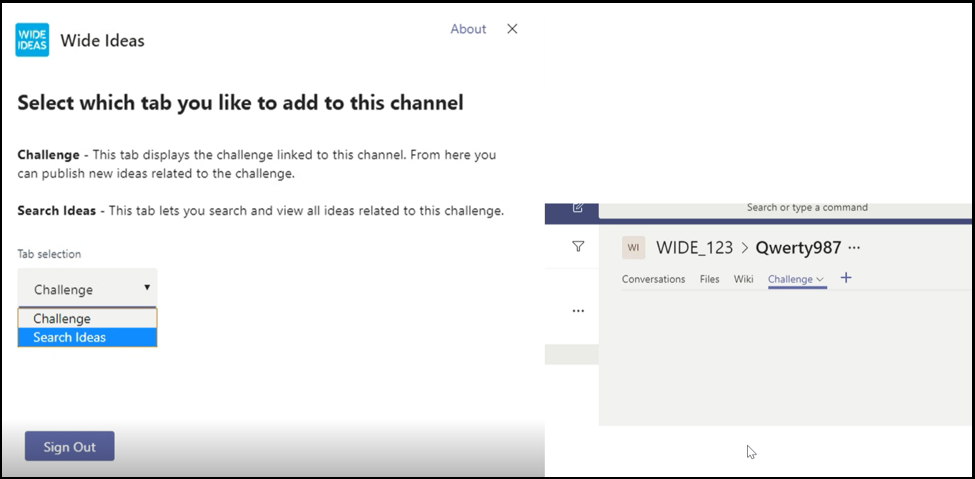

# Советы по успешной отправке приложения Microsoft TeamsTips for a successful Microsoft Teams app submission

В этой статье представлены распространенные причины неудачной проверки отправленных приложений.This article addresses common reasons submitted apps fail validation. Хотя он не является исчерпывающим списком всех потенциальных проблем с вашим приложением, это руководство повышает вероятность того, что отправка приложения пройдет в первый раз.While it's not intended to be an exhaustive list of all potential issues with your app, following this guide will increase the likelihood that your app submission will pass the first time. Список политик проверки см. в политиках сертификации Commercial [Marketplace.](/legal/marketplace/certification-policies)See [Commercial marketplace certification policies](/legal/marketplace/certification-policies) for an extensive list of validation policies.

>[!NOTE]
>**[Раздел 1140](/legal/marketplace/certification-policies#1140-teams)** касается Microsoft Teams, а в разделе **[1140.4](https://docs.microsoft.com/legal/marketplace/certification-policies#11404-functionality)** — требования к функциональности для приложений Teams.**[Section 1140](/legal/marketplace/certification-policies#1140-teams)** is specific to Microsoft Teams and **[sub-section 1140.4](https://docs.microsoft.com/legal/marketplace/certification-policies#11404-functionality)** addresses functionality requirements for Teams apps.

## Рекомендации по проверке & большинство неудачных тестовых случаевValidation guidelines & most failed test cases

### &#9989; общие соображения&#9989; General considerations

См. также [раздел 100 — общие](/legal/marketplace/certification-policies#100-general)See also [Section 100 — General](/legal/marketplace/certification-policies#100-general)

* Убедитесь, что вы используете версию 1.4.1 или более поздней версии [microsoft Teams SDK.](https://www.npmjs.com/package/@microsoft/teams-js)Ensure you are using version 1.4.1 or later of the [Microsoft Teams SDK](https://www.npmjs.com/package/@microsoft/teams-js).
* Не внося изменения в приложение во время проверки.Don't make changes to your app while the validation process is in progress. Для этого потребуется полная переоценка приложения.Doing so will require a complete revalidation of your app.
* Ваше приложение не должно прекращать реагировать на действия пользователя, неожиданно завершать работу или содержать программные ошибки.Your app must not stop responding, end unexpectedly, or contain programming errors. В случае возникновения проблемы ваше приложение должно не работать и предоставлять допустимые сведения о способе переад вперед пользователю.If an issue occurs, your app must fail and provide valid information for the way-forward to the user.
* Приложение не должно автоматически загружать, устанавливать и запускать исполняемый код в пользовательской среде.Your app must not automatically download, install, or launch any executable code in the user environment. Все скачиваемые приложения должны обращаться к пользователю за явным разрешением.All downloads must seek explicit permission from the user.
* Все материалы, которые вы связываете с вашим опытом, такие как описания и документация по поддержке, должны быть точными.Any material that you associate with your experience, such as descriptions and support documentation, must be accurate. Описания и материалы должны быть написаны грамотно, без орфографических ошибок, с правильным использованием прописных букв и знаков препинания.Use correct spelling, capitalization, punctuation, and grammar in your descriptions and materials.
* Предоставление справки и поддержки.Provide help and support information. Настоятельно рекомендуется, чтобы ваше приложение включало справку или ссылку на faq для первого запуска пользователя.It's highly recommended that your app include a help or FAQ link for the first-run user experience. Для всех личных приложений мы рекомендуем предоставить страницу справки в качестве личной вкладки для улучшения пользовательского интерфейса.For all personal apps, we recommend providing your help page as a personal tab for a better user experience.
* Все приложения должны иметь визуальный  просмотр, например  "Просмотр" или "Руководство по приложению" на экране настройки, в ходе который рассказывается о функциях приложения и необходимой интеграции в следующих местах:All apps must have a visual tour, such as **Take a Tour** or an **App Guide** in its configuration screen that talks about the app features and necessary integration in the following places:
    * Страница описания в Магазине (длинное описание).The store listing page (Long Description).
    * Экран настройки вкладок.Tab configuration screen.
    * Приветствие для бота.Welcome message for a bot.
    * Метаданные источника приложения.App source metadata.
    * Экран настройки соединители.Connector configuration screen.

* Визуальным видеокурсом может быть видео, снимок экрана, ссылка на статическую вкладку с подробными сведениями о приложении.The visual tour can be a  video, screenshot, a link to a static tab with app details. Все эти ссылки должны быть в среде Teams.All these references must be within the Teams environment.

      

* При внесении каких-либо изменений в манифест в отправку поможите номер версии приложения в манифесте.Increment your app version number in the manifest if you make any manifest changes to your submission.
* Приложение не должно отбирать пользователей из Teams для основных пользовательских сценариев.The app must not take users out of Teams for core user scenarios. Целевые объекты ссылок в приложениях не должны связываться с внешним браузером.Link targets in apps must not link to an external browser. Целевые объекты ссылок должны ссылаться на элементы div, содержащиеся в Teams, например модули задач и вкладки.Link targets must link to div elements contained within Teams, for example, task modules and tabs. 
* Использование модулей задач или вкладок предлагается для отображения сведений для пользователей в Teams.Using task modules or tabs is suggested to display information to users within Teams.
* Все основные и неядерные сценарии должны быть выполнены в среде Teams, за исключением:All core and non-core scenarios must be completed within the Teams environment except for:
  * Политика конфиденциальностиPrivacy Policy
  * Условия использования (TOU)Terms Of Use (TOU)
  * Ссылка на веб-сайтWebsite link
  * Процесс регистрацииSign-up process

* Личные приложения позволяют пользователям делиться содержимым из личного приложения с другими участниками группы.Personal apps enable users to share content from a personal app experience with other team members.

### &#9989; предоставление простого и понятного способов входов, выход и регистрации&#9989; Provide a clear and simple sign-in, sign-out, and sign-up experience

См. также [раздел 1100.5 — контроль клиентов](/legal/marketplace/certification-policies#11005-customer-control)See also [Section 1100.5 — Customer control](/legal/marketplace/certification-policies#11005-customer-control)

* Если ваше приложение или надстройка зависят от внешних учетных записей или служб, вход, выход и вход должны быть очевидными и досяжимыми для всех возможностей приложения.If your app or add-in depends on external accounts or services, the sign-in, sign-out, and sign-up experience must be apparent and reachable across all capabilities in your app.
* Если пользователю предоставлен явный параметр для входов, должен быть соответствующий параметр выхода (даже если приложение использует проверку подлинности без проверки [подлинности).](../../../../tabs/how-to/authentication/auth-silent-aad.md)If there is an explicit sign-in option provided to the user, there must be a corresponding sign-out option (even if the app is using [silent authentication](../../../../tabs/how-to/authentication/auth-silent-aad.md)).
* При выходе из приложения пользователь должен выйти только из клиента Teams, а не из него.The sign-out option must only sign the user out of your app's capability and not out of the Teams client.
* Как минимум, при выходе пользователь должен выйти из тех же возможностей, что и при входе.At a minimum, the sign-out option must sign the user out of the same capabilities accessed with the sign-in option. Например, если параметр вход включает расширение обмена сообщениями и вкладку, параметр выхода должен включать как расширение обмена сообщениями, так и вкладку.For example, if the sign-in option includes both messaging extension and tab, then the sign-out option must include both messaging extension and tab.

* Убедитесь, что всегда есть способ обратить следующее (или аналогичное) поведение:Make sure there is always a way to reverse the following (or similar) behaviors:
  * Вход => выход.Sign-in => sign-out.
  * Связывать учетную запись или службу => отвязать учетную запись или службу.Link an account/service => unlink an account/service.
  * Подключение учетной записи или службы => отключение учетной записи или службы.Connect an account/service => disconnect an account/service.
  * Авторизация учетной записи или службы => авторизации/запрета учетной записи или службы.Authorize an account/service => deauthorize/deny an account/service.
  * Регистрация учетной записи или службы => регистрации или отписки учетной записи или службы.Register an account/service => deregister/unsubscribe an account/service.
* Если вашему приложению требуется учетная запись или служба, необходимо предоставить пользователю способ регистрации или создания запроса на регистрацию.If your app requires an account or service, you must provide a way for the user to sign-up or create a sign-up request. Исключение может быть предоставлено, если вашему приложению требуется лицензия для использования.An exception may be granted if your app requires a license to use. В таких сценариях необходимо предоставить четкие инструкции для нового пользователя для регистрации.In such scenarios, provide clear instructions for a new user to sign-up.
* Предоставление четкого руководства по способу переададации новому пользователю о том, как зарегистрироваться для использования ваших служб приложений.Provide clear guidance on the way-forward to a new user on how to sign-up to use your app services. Если готовая ссылка для регистрации недоступна, укажете точные рекомендации по следующим вопросам:If a ready sign-up link is not available, provide precise guidance in the following areas:

> [!div class="checklist"]
>
> * в разделе описания приложения.within your app's description section.
> * в приветствие приложения.in your app's welcome message.
> * в сообщении справки приложения.in your app's help message.
> * в окне, где вы попросите пользователя войти в ваши службы.in the window where you ask a user to sign-in to your services.

* Приложения без простого потока регистрации также должны включать вкладку справки или ссылку на веб-страницу, где новый пользователь может получить подробные инструкции по настройке приложения Teams.Apps without an easy sign-up flow must also include a help tab or link to a web page, where a new user can see detailed guidance on configuring your Teams app. Предоставление подробных сведений, чтобы новый пользователь не блокировался при первой попытке приложения.Provide detailed information to ensure a new user is not blocked when trying your app for the first time.
* Функции входов и выходов должны работать на мобильных клиентах.Sign-in and sign-out functionality must work on mobile clients. Убедитесь, что [используется Microsoft Teams SDK](https://www.npmjs.com/package/@microsoft/teams-js) версии 1.4.1 или более поздней.Ensure to use the [Microsoft Teams SDK](https://www.npmjs.com/package/@microsoft/teams-js) version 1.4.1 or later.

Дополнительные сведения о проверке подлинности см. в:For additional information on authentication see:

* [Документация по проверке подлинностиAuthentication documentation](../../../authentication/authentication.md)
* [Пример проверки подлинности бота в NodeBot authentication sample in Node](https://github.com/OfficeDev/microsoft-teams-sample-auth-node)
* [Пример проверки подлинности tab в УзлеTab authentication sample in Node](https://github.com/OfficeDev/microsoft-teams-sample-complete-node)
* [Проверка подлинности с вкладками и ботами на C#/.NETTab/bot authentication in C#/.NET](https://github.com/OfficeDev/microsoft-teams-sample-complete-csharp)

### &#9989; время отклика должно быть разумным&#9989; Response times must be reasonable

* **Вкладки**.**Tabs**. Если ответ на действие занимает более трех секунд, необходимо предоставить сообщение о загрузке или предупреждение.If a response to an action takes more than three seconds, you must provide a loading message or warning.
* **Боты**.**Bots**. Ответ на команду пользователя должен произойти в течение двух секунд.A response to a user command must occur within two seconds. Если требуется более длинная обработка, приложение должно отобразить индикатор ввода текста.If longer processing is required, your app must display a typing indicator.
* **Расширения составить.****Compose extensions**. Ответ на команду пользователя должен происходить в течение пяти секунд.A response to a user command must occur within five seconds.

> [!TIP]
> Убедитесь, что ваше приложение отображает индикатор загрузки или предупреждение в том или ином виде, когда приложение отвечает дольше, чем ожидалось.Make sure your app displays a loading indicator or some form of warning when your app is taking longer than expected to respond.

### &#9989; вкладок не должно иметь чрезмерного хрома или многоуровневой навигации&#9989; Tab content must not have excessive chrome or layered navigation

* Вкладки должны предоставлять основное содержимое и избегать необходимости элементов пользовательского интерфейса.Tabs must provide focused content and avoid needless UI elements. Обычно это относится к ненужным вложенным или многоуровневым навигациям, к лишним или нерелевантным пользовательским интерфейсам рядом с содержимым, а также к ссылкам на несвязанные с пользователем материалы.This usually refers to unnecessary nested or layered navigation, an extraneous or irrelevant UI next to the content, or any links that take the user to unrelated content. Например, следующее представление вкладки не включает меню навигации и демонстрирует только основное содержимое:For example, the following tab view omits navigation menus and only showcases the main content:

  

* Вкладки должны быть светлыми и не включать сложную навигацию.Tabs must be light in nature and not include complex navigation.
* Вкладки каналов, которые имеют сложные возможности редактирования в приложении, должны открывать представление редактора в нескольких окнах, а не на вкладке.Channel tabs that have complex editing capabilities within the app must open the editor view in a multi-window rather than a tab.
* Вкладки каналов не должны предоставлять панели приложения со значками в левой панели, конфликтуя с главной навигацией Teams.Channel tabs must not provide an app bar with icons in the left rail that conflicts with the main Teams navigation.
* Вкладки не должны представлять на панели приложения значки в левой панели, конфликтуя с основной навигацией Teams.Tabs must not present an app bar with icons in the left rail that conflict with the main Teams navigation.
* Вкладки, которые имеют сложные возможности редактирования в приложении, должны открывать представление редактора в нескольких окнах, а не на вкладке.Tabs that have complex editing capabilities within the app must open the editor view in a multi-window rather than in the tab.
* Если имеется несколько параметров представления, рассмотрите возможность выбора пользователем меню настройки вкладок.If there are multiple view options, consider having a tab config menu for the user to choose from. Например, вместо того чтобы встраить меню в вкладку, поместите его на страницу конфигурации, чтобы фактическое представление вкладки было чисто и сфокусировано.For example, instead of embedding a menu inside the tab, put the menu in the configuration page so the actual tab view is clean and focused.
* *Включите вкладку "Справка"* в качестве статической вкладки, чтобы сообщить пользователям о настройке, регистрации и использовании приложения.Please include a *Help* tab as a static tab to advise users how to configure, sign-up, and use your app.
* Включайте *вкладку "Параметры",* доступную из загона приложения.Please include a *Settings* tab that is available from the app header.

### &#9989; вкладки должна происходить на экране конфигурации&#9989; Tab configuration must happen in the configuration screen

* На экране конфигурации необходимо четко объяснить значение работы и настройки вкладки.The configuration screen must clearly explain the value of the experience and how to configure the tab.
* Процесс настройки всегда должен предоставлять пользователям возможность продолжить работу, а не прекратить работу с пользователем.The configuration process must always provide a way for the users to continue and not end the user experience. Например, не показывать пустую доску после того, как пользователь настроит вкладку.For example, do not show an empty board after the user has configured the tab.
* Вход пользователя должен быть частью процесса настройки.The user sign-in process must be a part of the configuration process. Убедитесь, что она завершена в пользовательском интерфейсе tab.Ensure to complete it in the Tab UI. После завершения настройки и загрузки вкладки никаких дополнительных действий не требуется.After the user has completed the configuration and loaded the tab, no further action is required.
* Не показыйте всю веб-страницу во всплывающее окно конфигурации для регистрации.Don't show your entire webpage within the sign-in configuration pop-up window.
* Пользователь всегда должен иметь возможность завершить настройку, даже если он не может сразу найти нужное содержимое.A user must always be able to finish the configuration experience, even if they can’t immediately find the content they’re looking for.
* Интерфейс настройки должен предоставить пользователю возможность найти свое содержимое, закрепить URL-адрес или создать новый контент, если он не существует.The configuration experience must provide options for the user to find their content, pin a URL, or create new content if it doesn’t exist.
* Процесс настройки должен оставаться в контексте Teams.The configuration experience must remain within the Teams context. Пользователю не нужно оставлять интерфейс настройки для создания контента, а затем возвращаться в Teams, чтобы закрепить его.The user shouldn’t have to leave the configuration experience to create content and then return to Teams to pin it.
* Эффективно используйте доступную область просмотра.Use the available viewport area efficiently. Не попустим его на использование огромного логотипа внутри всплывающее всплывающее расположение конфигурации.Do not waste it on using huge logos inside the configuration pop up.

### &#9989; вкладок в канале доступ к членам&#9989; Tabs in channel - Member access

* Вкладка, настроенная участником в области канала, должна быть доступна другим участникам без необходимости искать разрешения у члена, настроившего вкладку.A tab configured by a member in a channel scope must be accessible to the other members without having to seek permissions from the member who configured the tab.
* Приложение должно заранее предоставить параметры управления разрешениями, если вкладка является закрытой или ограниченной или требует каких-либо разрешений от участника, настроившего вкладку.The app must provide the permission management options upfront if the tab is for private or restricted use or requires any permissions from the member who configured the tab.

### &#9989; боты должны всегда отвечать и корректно отвечать на запросы&#9989; Bots must always be responsive and fail gracefully

Бот должен отвечать на любую команду, а не конечный пользователь.Your bot must be responsive to any command and not dead-end the user. Вот несколько советов, которые помогут вашему боту интеллектуально реагировать на действия пользователей:Here are some tips to help your bot intelligently respond to users:

* **Используйте списки команд.****Use command lists**. Анализ пользовательского ввода или прогнозирование намерения пользователя сложно.Analyzing user input or predicting user intent is hard. Вместо того чтобы позволить пользователям угадать, что может сделать ваш бот, предопустите список команд, которые понимает ваш бот.Instead of letting users guess what your bot can do, provide a list of commands your bot understands.

* **Включит команду справки.****Include a help command**. Пользователи, скорее всего, будут ввести "Справка", когда они потеряются или бот не отвечает ожидаемым образом.Users are likely to type "Help" when they are lost or when your bot doesn't respond as expected. Включите команду справки, которая описывает, как будет работать значение вашего приложения, а также все допустимые команды.Include a help command that describes how your app's value will be experienced along with all valid commands.

* **Включите содержимое справки или инструкции при утере бота.****Include help content or guidance when your bot is lost**. Если бот не может понять входные данные пользователя, он должен предложить альтернативное действие.When your bot cannot understand the user input, it must suggest an alternative action. Например: *"К сожалению, я не знаю. Введите "справка" для получения дополнительных сведений".*For example, *"I'm sorry, I don't understand. Type "help" for more information."* Не отвечайте на сообщение об ошибке или *просто "Я не знаю".*Don't respond with an error message or simply, *"I don't understand"*.

### &#9989; команды справки&#9989; Help command response

* Команда справки должна быть точной, а ответы приложения должны быть в формате адаптивной карточки с контентом с действиями по крайней мере для шести команд.Help Command must be precise and the app responses must be in an adaptive card format with an actionable content for at least six commands.
* Если приложение имеет менее шести команд, проверьте, присутствуют ли все команды в адаптивной карточке.If an app has less than six commands, check if all the commands are present in the adaptive card.

  

* **Использование адаптивных карточек и модулей задач, чтобы сделать ответ бота понятным и понятным для действий** 
 [Адаптивные карточки с кнопками,](/task-modules-and-cards/task-modules/task-modules-bots) которые запускают модули задач, улучшают пользовательский интерфейс бота.**Use adaptive cards and task modules to make your bot response clear and actionable**
[Adaptive cards with buttons invoking task modules](/task-modules-and-cards/task-modules/task-modules-bots) enhance the bot user experience. Эти карточки и кнопки проще использовать на мобильном устройстве, а не вводить команды пользователем.These cards and buttons are easier to use in a mobile device as opposed to your user typing the commands. Кроме того, ответы ботов не должны быть текстовыми с длинным текстом.Also bot responses must not be textual with long text. Боты должны использовать адаптивные карточки и модули задач вместо пользовательского интерфейса на основе бесед и длинных текстовых ответов.Bots must make use of adaptive cards and task modules instead of conversational chat based user interface and lengthy text responses.

* **Продумайте все области.****Think through all scopes**. Убедитесь, что бот предоставляет соответствующие ответы при упоминаний () в канале и `@*botname*` в личных беседах.Be sure that your bot provides appropriate responses when mentioned (`@*botname*`) in a channel and in personal conversations. Если бот не предоставляет осмысленный контекст в области личных или команд, отключите эту область с помощью манифеста.If your bot does not provide meaningful context within the personal or teams scope, disable that scope via the manifest. (См. блок в справочнике по схеме `bots` [манифеста Microsoft Teams.)](../../../../resources/schema/manifest-schema.md#bots)(See the `bots` block in the [Microsoft Teams manifest schema reference](../../../../resources/schema/manifest-schema.md#bots).)

* **Включаем команду, групповой чат или беседу 1:1.****Include team, group chat, or 1:1 conversation**. Уведомления ботов должны включать команду, групповой чат или беседу "один к одному" с релевантным содержимым для вашей аудитории.Bot notifications must include a team, a group chat, or a one-to-one conversation with relevant content for your audience.

* **Не выдвигайте конфиденциальные данные.****Do not push sensitive data**. Боты не должны перенажимать конфиденциальные данные в команду, групповой чат или беседу "один к один", где есть аудитория, которая не должна просматривать эти данные.Bots must not push sensitive data to a team, a group chat, or a 1:1 conversation, where there is an audience who must not view that data.

* **Предоставление приветствия.****Provide a welcome message**. Бот должен предоставить приветствие FRE, которое включает интерактивное руководство с карточками карусели или кнопками "попробовать", чтобы обеспечить вовлечение.Bot must provide an FRE welcome message that includes an interactive tutorial with carousel cards or "try it" buttons, to encourage engagement.

### &#9989; личные боты всегда должны отправлять приветствие при первом запуске&#9989; Personal bots must always send a welcome message on first launch

Приветствие — лучший способ настроить тон для бота личного чата.A welcome message is the best way to set the tone for your personal chat bot. Это первое взаимодействие пользователя с ботом.This is the first interaction a user has with the bot. Хорошее приветствие может побудить пользователя продолжать изучать приложение.A good welcome message can encourage the user to keep exploring the app. Если приветствие или вводное сообщение является запутанным или нечетким, пользователи не сразу увидят значение приложения и потеряют интерес.If the welcome or introductory message is confusing or unclear, users won't see the value of the app immediately and lose interest.
Требования к приветствиям см. в следующем разделе:See the following section for welcome message requirements:

> [!Note]
> Приветствие для бота канала является необязательным.A welcome message is optional for a channel bot.

### Требования к приветствиямWelcome message requirements

* Включив предложение о значении в приветствие.Include a value proposition with the welcome tour.
* Предоставление рекомендаций по использованию приложения.Provide way-forward guidance for using the app.
* Включите инструкции по регистрации и настройке приложения.Include guidance on how to sign-up and configure your app.
* Представляет простой для чтения текст и понятный диалог — желательно карточку с кнопкой приветствия, которая загружает модуль задачи.Present easy-to-read text and straightforward dialogue — preferably a card with an actionable welcome tour button that loads a task module.
* С помощью кнопок и карточек сохраняем его простота и простота — избегайте длинного текста и диалогового общения.Keep it simple and usable with buttons and cards — avoid long text, chatty dialogue.
* Включаем адаптивные карточки и кнопки, чтобы сделать приветствие более понятным.Include adaptive cards and buttons to make the welcome message more usable.
* Вызов приветствия с помощью одной, а не двух или более одновременных.Invoke the welcome message  with one ping, not two or more simultaneous pings.
* Приветствие должно показываться только пользователю, который настроил приложение, предпочтительно в личном чате 1:1.A welcome message must only be shown to the user who configured the app, preferably in a 1:1 personal chat.
* Личные приложения всегда должны предоставлять пользователю приветствие.Personal apps must always provide a welcome message to a user.
* Никогда не отправлять личные беседы каждому участнику команды; он считается спамом.Never send a personal chat to every member of the team; it is considered spam.
* Никогда не отправлять приветствие более одного раза.Never send the welcome message more than once. Повтор одного и того же приветствия через регулярные интервалы не разрешен и считается спамом.Repeating the same welcome message over regular intervals is not allowed and is considered spamming.

#### Избегайте нежелательной почты для приветствия сообщенийAvoid welcome message spamming

* **Сообщение канала от бота**.**Channel message by bot**. Не рассылайте пользователям нежелательные сообщения, создавая отдельные записи чата.Don't spam users by creating separate new chat posts. Создайте одну публикацию потока с ответами в том же потоке.Create a single thread post with replies in the same thread.
* **Личный чат с помощью бота.****Personal chat by bot**. Не отправляйте несколько сообщений.Don't send multiple messages. Отправьте одно сообщение с полной информацией.Send one message with complete information. Повтор одного и того же приветствия через регулярные интервалы не разрешен и считается спамом.Repeating the same welcome message over regular intervals is not allowed and is considered spamming.

#### Приветствия бота только для уведомленийNotification-only bot welcome messages

Боты только для уведомлений должны отправлять приветствие с сообщением "Я бот только для уведомлений и не могу ответить на ваши *чаты".*Notification-only bots must send a welcome message that includes a message conveying, *"I am a notification-only bot and will not be able to reply to your chats"*.

#### Приветствия в личной областиWelcome messages in the personal scope

   * **Сделайте сообщение кратким и информативным.****Make your message concise and informative**. Пользовательский интерфейс и знания вашего приложения будут отличаться.The user experience and the knowledge of your app will vary. Пользователь мог использовать ваше приложение на другой платформе или ничего не знать о нем.A user may have used your app on another platform or know nothing about your app. Вы хотите адаптировать свое сообщение для всех аудиторий и в паре предложений объяснить, что делает ваш бот и как с ним взаимодействовать.You want to tailor your message to all audiences and in a couple sentences explain what your bot does and the ways to interact with it. Кроме того, необходимо объяснить ценность приложения и преимущества его использования пользователями.You must also explain the value of the app and how the users will benefit from using it.

* **Сделайте сообщение действительным.****Make your message actionable**. Подумайте о том, что нужно сделать пользователям после установки приложения.Think about the first thing you want users to do after installing your app. Есть ли у них классная команда?Is there a cool command they must try? Есть ли еще один опыт в подборе, о чем им необходимо знать?Is there another onboarding experience they must know about? Требуется ли им вход?Do they need to sign-in? Вы можете добавить действия на адаптивной карточке или предоставить определенные примеры, такие как *"Попробуйте спросить...",* *"Это то, что я могу сделать...".*You can add actions on an adaptive card or provide specific examples such as *“Try asking….”*, *“This is what I can do…”*.

#### Приветствия в области команды или каналаWelcome messages in the team or channel  scope

При первом добавлении бота в канал все немного по-другому.Things are a little bit different when the bot is first added to a channel. Как правило, не следует отправлять сообщение 1:1 всем в команде, но бот может отправить приветствие в канале.Normally, you shouldn't send a 1:1 message to everyone on the team, but the bot can send a welcome message in the channel.

### &#9989; отклика мобильных устройств, без прямого переоплаты и оплаты&#9989; Mobile responsiveness, no direct upsell or payment

* Вкладки, адаптивные карточки, сообщения ботов и содержимое в модулях задач должны отвечать на различные размеры экранов мобильных устройств.Your tabs, adaptive cards, bot messages and content in task modules must be responsive for a variety of mobile device screens sizes.
* Приложения, которые поддерживают iOS, должны быть полностью функциональны на последнем устройстве iPad с использованием последней версии iOS.Apps that support iOS must be fully functional on the latest iPad device using the latest version of iOS.
* Не должно включать прямую ссылку на покупки из приложения, пробные предложения, предложения для платных версий или ссылки на любые интернет-магазины, где пользователи могут приобрести другой контент, приложения или надстройки из приложения Teams на мобильной оси (Android, iOS).Must not include any direct references to in-app purchases, trial offers, offers for paid versions, or links to any online stores where users can purchase or acquire other content, apps, or add-ins from your Teams app on mobile OS (Android, iOS).
* Версия надстройки для iOS или Android не должна показывать пользовательский интерфейс или язык или ссылку на другие приложения, надстройки или веб-сайт, которые просит пользователя оплатить.The iOS or Android version of the add-in must not show any UI or language or link to any other apps, add-ins, or website that ask the user to pay.
* На связанных страницах политики конфиденциальности и условий использования также не должно быть коммерческих ссылок на пользовательский интерфейс или магазин.The associated Privacy Policy and Terms of Use pages must also be free of any commerce UI or Store links.

### &#9989; Не публикуть конфиденциальные данные в аудитории, которая не предназначена для просмотра данных&#9989; Do not post sensitive data to an audience not intended to view the data

Ваше приложение Teams не должно размещать конфиденциальные данные, такие как кредитная карта или инструмент финансового платежа, персональные данные (PIN-код), сведения о состоянии здоровья или контактные данные трассиры аудитории, не предназначенные для просмотра этих данных.Your Teams app must not post sensitive data such as credit card or financial payment instrument, Personal Identifiable Information (PIN), health, or contact tracing information to an audience not intended to view that data.

### &#9989; Не передавать финансовые данные о платежах и транзакциях с помощью приложения Teams&#9989; Do not transmit financial payment details or complete financial transactions via your Teams app

* Ваше приложение Teams не должно попросить пользователей внести платеж непосредственно в интерфейсе Teams.Your Teams app must not ask users to make a payment directly within Teams interface.
* Приложения могут не передавать сведения о финансовых инструментах через пользователя в интерфейсе приложения.Apps may not transmit financial instrument details through the user on the app interface. Приложения могут передавать ссылки на безопасные платежные службы пользователям, только если они разглашаются в условиях использования, политике конфиденциальности и любой странице профиля или веб-сайте приложения, прежде чем пользователь согласится использовать приложение.Apps may only transmit links to secure payment services to users if this is disclosed in the app's Terms of Use, Privacy Policy, and any profile page or website for the app before a user agrees to use the app.

### &#9989; очистить предупреждение перед загрузкой любых файлов или исполняемых файлов ( ) в `.exe` среду пользователя&#9989; Clear warning before downloading any files or executable (`.exe`) into a user’s environment

Предупредите пользователей, прежде чем ваше приложение загрузит файлы или исполняемые файлы ( )на компьютер `.exe`  или в среду пользователя.Please warn users before your app downloads any files or executable (`.exe`  )into the user's machine or environment.

### &#9989; сообщений должны предоставлять текст справки и быть простыми для чтения&#9989; Messaging extensions must provide help text and be easy to read

* Расширение обмена сообщениями на основе поиска должно предоставлять текст справки о том, как эффективно искать (например, показывать пример ввода).The search-based messaging extension must provide help text on how to effectively search (e.g., show example input).
* Модули задач должны содержать значок и короткое имя, которые содержатся в приложении или создаются из него.Task modules must include an icon and a short name that they are contained in or created from the app.
* Исполняемые исполняемые сообщения расширения сообщений должны быть понятными, понятными `@mention` и понятными.The message extension `@mention` executables must be clear, easy to understand, and easy to read.

## M365 Publisher AttestationM365 Publisher Attestation

### &#9989; завершения проверки издателя в Центре партнеров&#9989; Complete the Publisher Attestation in Partner Center

* Дополнительные сведения [можно найти](/microsoft-365-app-certification/docs/attestation) в документации по программе полной проверки издателя.Refer to the [Complete Publisher Attestation](/microsoft-365-app-certification/docs/attestation) program documentation for more details.
* Выполните действия, которые необходимо выполнить в разделе ["Рабочий](/microsoft-365-app-certification/docs/userguide#3publisher-attestation-workflow) процесс проверки издателя", чтобы завершить процесс проверки издателя.Follow the steps in the [Publisher Attestation Workflow](/microsoft-365-app-certification/docs/userguide#3publisher-attestation-workflow) section to complete the publisher attestation process. Напишите в appcert@microsoft.com для любых вопросов.Write to appcert@microsoft.com for any questions.
* Дополнительные сведения [можно найти в](/azure/active-directory/develop/troubleshoot-publisher-verification) руководстве по устранению неполадок.Refer to the [Troubleshooting guide](/azure/active-directory/develop/troubleshoot-publisher-verification) for additional information.
* Завершите самостоятель через Центр партнеров.Complete the self attestation through partner center. Заполните анкету Self-Assessment соответствия **требованиям приложений.**Fill the Self-Assessment questionnaire under **App Compliance**.

> [!div class="nextstepaction"]
> [Узнайте больше о политиках утверждения приложений TeamsLearn more about Teams app approval policies](/legal/marketplace/certification-policies#1140-teams)
