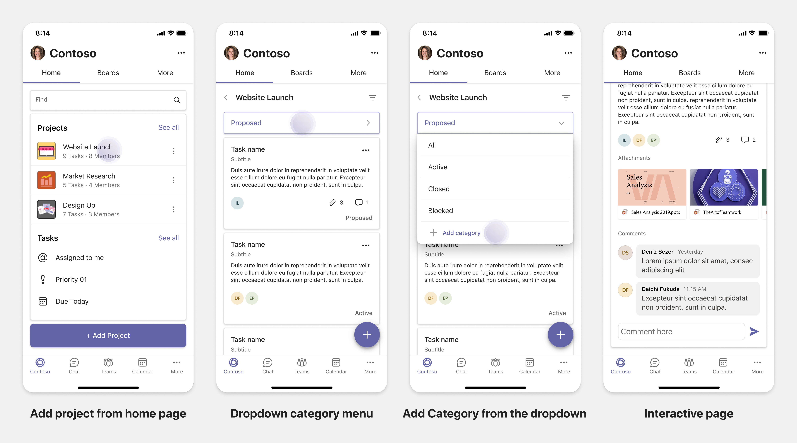

# Планирование адаптивных вкладок для мобильной версии Teams

 Teams платформа предоставляет возможность создавать приложения на мобильных устройствах и на рабочем столе. Пользователи приложения могут предпочесть рабочий стол или мобильный, или оба. Пользователи могут подготовить данные на рабочем столе, но потреблять и обмениваться данными с помощью мобильных устройств. Ключом к созданию любого приложения является понимание и удовлетворение потребностей пользователей. Существуют такие возможности, как боты, расширения обмена сообщениями и соединители, которые работают бесшовно на рабочем столе и на мобильных устройствах. Однако для создания вкладок и модулей задач требуется планирование размещения веб-Teams мобильных устройств. В документе содержится руководство по планированию отзывчивых веб-страниц на Teams мобильном телефоне.

## Определение области приложений

В следующем списке ключевых сведений для планирования создания приложений для мобильных Teams:

* Рассмотрите функции поперек устройства Teams приложения. Например, если у вас хорошо работает приложение на рабочем столе, вы можете изучить, чтобы создать аналогичное приложение на мобильном телефоне. На начальном этапе может быть трудно перенести весь рабочий стол на мобильный телефон. Вы можете начать с базовых, но распространенных сценариев. Добавьте функциональные возможности и возможности после сбора дополнительных данных и отзывов пользователей.

* Убедитесь в том, что на мобильных устройствах необходимо нацелить соответствующие пользовательские персоны. Например, если вы создаете приложение, которое предоставляет службу конечным пользователям, а также предоставляет доступ к данным для разработчиков и руководителей, конечные пользователи могут использовать приложение больше, пока вы начинаете создавать приложение на Teams мобильном телефоне. Вы можете удовлетворить все персоны, которые у вас есть на рабочем столе приложения однако, рекомендуется начать с persona с большей базой и возможными ранними усыновителей для меньшего экрана. В примере конечные пользователи являются подходящими пользователями. Вы можете постепенно добавлять функциональные возможности для поддержки других пользователей на Teams мобильном телефоне. 

## Понимание различных этапов создания приложений

После того, как вы определили область приложения, пришло время понять следующие три этапа планирования любого приложения на Teams и улучшения пользовательского интерфейса:

1. **Потребление**

   Просмотр приложений на мобильных устройствах. Чтобы создать приложение на мобильном устройстве, можно начать с использования. Так как мобильный мир сделал прокрутку для контента обычной практикой, вы можете показать соответствующую информацию. Для информирования об обновлениях используйте механизмы взаимодействия, такие как уведомления.

2. **Быстрые действия**

   Используйте приложение на мобильных устройствах. После того как пользователи начнут потреблять содержимое на мобильных устройствах, вы можете масштабировать приложение на следующий уровень, перенося некоторые действия из настольного приложения. Вы можете оптимизировать и создать новые действия для мобильных устройств.

3. **Включение**

   Предоставление полных опытом работы с приложениями для работы на мобильных устройствах. Во время работы с приложением пользователи предоставляют полный иммерсивный опыт на мобильных устройствах, как на уровне, так и лучше, чем на рабочем столе. Чтобы обеспечить хорошее впечатление для пользователей, сделайте все случаи использования отзывчивыми на мобильных устройствах.

> [!TIP]
> Чтобы получить сведения о руководствах по разработке, см. процесс разработки [Teams приложений.](design-teams-app-process.md)

## Варианты использования

Рассмотрим следующие случаи использования, чтобы понять, как планировать различные типы приложений для мобильных Teams:

 

<b>Приложения для мониторинга и визуализации данных</b>

Вы можете понять, как планировать адаптивные вкладки для приложений мониторинга и визуализации данных на Teams платформе.

**Потребление**

На первом этапе можно реализовать самый простой элемент потребления для просмотра данных. Целью любого приложения в домене является демонстрация данных в виде визуализаций. В приложении можно показать недавно просмотримые визуализации на рабочем столе или список всех разрешенных диаграмм для пользователей. После создания панелей мониторинга на рабочем столе пользователи могут получать доступ к информации с помощью мобильного телефона. Вы можете показать подробное представление любой диаграммы, выбранной пользователем в качестве расширенного представления на вкладке или с помощью модулей задач.

Вы можете показать следующую информацию: 

* Панели мониторинга и сводки
* Визуальные данные, карты и инфографика
* Диаграммы, графики и таблицы 

**Быстрые действия**

На втором этапе пользователи могут работать с существующими диаграммами и визуальными изображениями из рабочего стола. Можно ввести следующие действия:

* Содержимое поиска
* Фильтрация данных
* Создание закладок

**Включение**

На третьем этапе пользователи могут создавать такие контенты, как диаграммы и графики с нуля. Убедитесь, что в вашем приложении будут внедрены все возможности для мобильных устройств. Например, с помощью модулей задач можно получить доступ к определенным пунктам данных с подробным представлением.

Вы можете предоставить следующие доступы пользователям:
* Изменение названия и описания
* Вставка элементов данных для создания визуализаций
* Поделитесь визуализацией в канале или групповом чате

 

 

<b>Приложения для посадки задач</b>

Вы можете понять, как планировать адаптивные вкладки для приложений для посадки задач на Teams мобильной платформе.

**Потребление**

На первом этапе приложение может показывать список задач пользователю в вертикальном стеке. Если существует несколько категорий задач, таких как **Предлагаемые,** Активные и Закрытые, затем предоставляют фильтры для показа сгрупповых задач или в качестве заглавных, чтобы увидеть сгруппные задачи.  

**Быстрые действия**

На втором этапе вы можете предоставить пользователям следующий доступ к приложениям:
* Создание задач или элементов с обязательными полями для снижения познавательной нагрузки пользователей
* Изменение типа или представления доски
* Просмотр задач путем расширения представления
* Использование модулей задач для просмотра подробных представлений
* Перемещение задач в разные категории 
* Совместное выполнение соответствующих задач в чатах и каналах с помощью электронной почты и канала действий

**Включение**

На третьем этапе вы можете включить опыт пользователей в следующих действиях:
* Добавление новых проектов и советов
* Добавление и изменение различных категорий, таких как **Предлагаемые,** **Активные** и **Закрытые**
* Настройка задач для комментариев, вложений и других сложных функций

 

 

<b>Приложения для совместной платы и доски</b>

Вы можете понять, как планировать адаптивные вкладки для совместной работы и доски приложений на Teams платформе.

**Потребление**

На первом этапе можно рассмотреть возможность демонстрации контента и ресурсов в приложении.  Вы можете показать следующие функции:

* Комментарии или отзывы
* Увеличение или выход
* Текущий этап или ход ожидаемого документа

**Быстрые действия**

На втором этапе можно ввести следующие действия:

* Создание новой доски для совместной работы или новых документов для подписания
* Делитесь советами внутри страны, а также с гостями
* Настройка разрешений администратора

> [!TIP]
> Вы предоставляете действия, которые можно легко показать на маленьких экранах.

**Включение**

На третьем этапе предокавите пользователям полный доступ к данным. Вы можете включить опыт пользователей в следующих действиях:

* Добавление текста, фигур и быстрых заметок
* Навигация по контенту
* Добавление слоев и фильтров
* Удаление, отмена и повторное удаление операций
* Доступ к камере и микрофону с помощью API JS SDK. Дополнительные сведения о возможностях устройств см. в [обзоре возможностей устройств.](../device-capabilities/device-capabilities-overview.md)

 

## См. также

В зависимости от области приложения помогают следующие рекомендации по проектированию и проверке:

* [Проектирование вкладки](../../tabs/design/tabs.md)
* [Создание бота](../../bots/design/bots.md)
* [Проектирование модулей задач](../..//task-modules-and-cards/task-modules/design-teams-task-modules.md)
* [Рекомендации по проверке хранения](../deploy-and-publish/appsource/prepare/teams-store-validation-guidelines.md)
