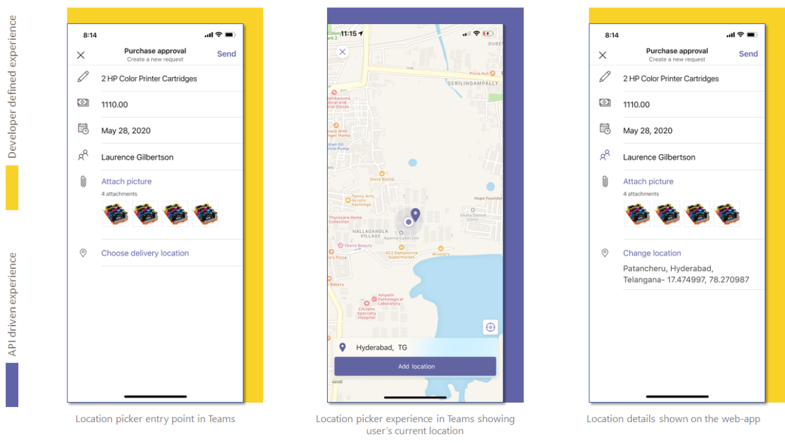

# <a name="integrate-location-capabilities"></a><span data-ttu-id="b1a83-104">Интеграция функций местонахождения</span><span class="sxs-lookup"><span data-stu-id="b1a83-104">Integrate location capabilities</span></span> 

<span data-ttu-id="b1a83-105">В этом документе вы можете узнать, как интегрировать возможности расположения родного устройства с приложением Teams.</span><span class="sxs-lookup"><span data-stu-id="b1a83-105">This document guides you on how to integrate the location capabilities of native device with your Teams app.</span></span>  

<span data-ttu-id="b1a83-106">Вы можете использовать [клиентскую SDK Microsoft Teams JavaScript,](/javascript/api/overview/msteams-client?view=msteams-client-js-latest&preserve-view=true)которая предоставляет средства, необходимые вашему приложению для доступа к возможностям родного [устройства пользователя.](native-device-permissions.md)</span><span class="sxs-lookup"><span data-stu-id="b1a83-106">You can use [Microsoft Teams JavaScript client SDK](/javascript/api/overview/msteams-client?view=msteams-client-js-latest&preserve-view=true), which provides the tools necessary for your app to access the user’s [native device capabilities](native-device-permissions.md).</span></span> <span data-ttu-id="b1a83-107">Используйте API расположения, такие как [getLocation](/javascript/api/@microsoft/teams-js/location?view=msteams-client-js-latest#getLocation_LocationProps___error__SdkError__location__Location_____void_&preserve-view=true) и [showLocation,](/javascript/api/@microsoft/teams-js/location?view=msteams-client-js-latest#showLocation_Location___error__SdkError__status__boolean_____void_&preserve-view=true) чтобы интегрировать возможности в приложении.</span><span class="sxs-lookup"><span data-stu-id="b1a83-107">Use the location APIs, such as [getLocation](/javascript/api/@microsoft/teams-js/location?view=msteams-client-js-latest#getLocation_LocationProps___error__SdkError__location__Location_____void_&preserve-view=true) and [showLocation](/javascript/api/@microsoft/teams-js/location?view=msteams-client-js-latest#showLocation_Location___error__SdkError__status__boolean_____void_&preserve-view=true) to integrate the capabilities within your app.</span></span> 

## <a name="advantages-of-integrating-location-capabilities"></a><span data-ttu-id="b1a83-108">Преимущества интеграции возможностей расположения</span><span class="sxs-lookup"><span data-stu-id="b1a83-108">Advantages of integrating location capabilities</span></span>

<span data-ttu-id="b1a83-109">Основное преимущество интеграции возможностей расположения в приложениях Teams заключается в том, что он позволяет разработчикам веб-приложений на платформе Teams использовать функции расположения с клиентом Microsoft Teams JavaScript SDK.</span><span class="sxs-lookup"><span data-stu-id="b1a83-109">The main advantage of integrating location capabilities in your Teams apps is that it allows web app developers on Teams platform to leverage location functionality with Microsoft Teams JavaScript client SDK.</span></span> 

<span data-ttu-id="b1a83-110">В следующих примерах покажите, как интеграция возможностей расположения используется в различных сценариях:</span><span class="sxs-lookup"><span data-stu-id="b1a83-110">Following examples show how the integration of location capabilities is used in different scenarios:</span></span>
* <span data-ttu-id="b1a83-111">На фабрике руководитель может отслеживать посещаемость рабочих, попросив их сделать селфи в непосредственной близости от фабрики и поделиться им через указанное приложение.</span><span class="sxs-lookup"><span data-stu-id="b1a83-111">In a factory, the supervisor can track the attendance of workers by asking them to take a selfie in the vicinity of the factory and share it through the specified app.</span></span> <span data-ttu-id="b1a83-112">Данные о расположении также захватываются и отправляются вместе с изображением.</span><span class="sxs-lookup"><span data-stu-id="b1a83-112">The location data also gets captured and sent along with the image.</span></span>
* <span data-ttu-id="b1a83-113">Возможности расположения позволяют обслуживаемом персоналу поставщика услуг обмениваться с руководством подлинными данными о состоянии здоровья вышек сотовой связи.</span><span class="sxs-lookup"><span data-stu-id="b1a83-113">The location capabilities enables the maintenance staff of a service provider to share authentic health data of cellular towers with the management.</span></span> <span data-ttu-id="b1a83-114">Руководство может сравнить любое несоответствие между захваченными сведениями о расположении и данными, представленными сотрудниками службы технического обслуживания.</span><span class="sxs-lookup"><span data-stu-id="b1a83-114">The management can compare any mismatch between captured location information and the data submitted by maintenance staff.</span></span>

<span data-ttu-id="b1a83-115">Чтобы интегрировать возможности расположения, необходимо обновить файл манифеста приложения и вызвать API.</span><span class="sxs-lookup"><span data-stu-id="b1a83-115">To integrate location capabilities, you must update the app manifest file and call the APIs.</span></span> <span data-ttu-id="b1a83-116">Для эффективной интеграции необходимо хорошо [](#code-snippets) понимать фрагменты кода для вызова API расположения.</span><span class="sxs-lookup"><span data-stu-id="b1a83-116">For effective integration, you must have a good understanding of [code snippets](#code-snippets) for calling the location APIs.</span></span> <span data-ttu-id="b1a83-117">Важно ознакомиться с ошибками [ответа API](#error-handling) для обработки ошибок в приложении Teams.</span><span class="sxs-lookup"><span data-stu-id="b1a83-117">It is important to familiarize yourself with the [API response errors](#error-handling) to handle the errors in your Teams app.</span></span>

> [!NOTE] 
> <span data-ttu-id="b1a83-118">В настоящее время поддержка microsoft Teams возможностей расположения доступна только для мобильных клиентов.</span><span class="sxs-lookup"><span data-stu-id="b1a83-118">Currently, Microsoft Teams support for location capabilities is only available for mobile clients.</span></span>

## <a name="update-manifest"></a><span data-ttu-id="b1a83-119">Манифест обновления</span><span class="sxs-lookup"><span data-stu-id="b1a83-119">Update manifest</span></span>

<span data-ttu-id="b1a83-120">Обновите приложение Teams [manifest.jsфайле,](../../resources/schema/manifest-schema.md#devicepermissions) добавив `devicePermissions` свойство и указав `geolocation` .</span><span class="sxs-lookup"><span data-stu-id="b1a83-120">Update your Teams app [manifest.json](../../resources/schema/manifest-schema.md#devicepermissions) file by adding the `devicePermissions` property and specifying `geolocation`.</span></span> <span data-ttu-id="b1a83-121">Это позволяет приложению запросить необходимые разрешения у пользователей, прежде чем они начнут использовать возможности расположения.</span><span class="sxs-lookup"><span data-stu-id="b1a83-121">It allows your app to ask for requisite permissions from users before they start using the location capabilities.</span></span>

``` json
"devicePermissions": [
    "geolocation",
],
```

> [!NOTE]
> <span data-ttu-id="b1a83-122">Запрос **разрешений** автоматически отображается при инициировании соответствующего API Teams.</span><span class="sxs-lookup"><span data-stu-id="b1a83-122">The **Request Permissions** prompt is automatically displayed when a relevant Teams API is initiated.</span></span> <span data-ttu-id="b1a83-123">Дополнительные сведения см. в [запросе разрешений устройств.](native-device-permissions.md)</span><span class="sxs-lookup"><span data-stu-id="b1a83-123">For more information, see [request device permissions](native-device-permissions.md).</span></span>

## <a name="location-apis"></a><span data-ttu-id="b1a83-124">API расположения</span><span class="sxs-lookup"><span data-stu-id="b1a83-124">Location APIs</span></span>

<span data-ttu-id="b1a83-125">Чтобы включить возможности расположения устройства, необходимо использовать следующий набор API:</span><span class="sxs-lookup"><span data-stu-id="b1a83-125">You must use the following set of APIs to enable your device's location capabilities:</span></span>

| <span data-ttu-id="b1a83-126">API</span><span class="sxs-lookup"><span data-stu-id="b1a83-126">API</span></span>      | <span data-ttu-id="b1a83-127">Описание</span><span class="sxs-lookup"><span data-stu-id="b1a83-127">Description</span></span>   |
| --- | --- |
|[<span data-ttu-id="b1a83-128">getLocation</span><span class="sxs-lookup"><span data-stu-id="b1a83-128">getLocation</span></span>](/javascript/api/@microsoft/teams-js/location?view=msteams-client-js-latest#getLocation_LocationProps___error__SdkError__location__Location_____void_&preserve-view=true) | <span data-ttu-id="b1a83-129">Предоставляет текущее расположение устройства или открывает выбор родного расположения и возвращает выбранное пользователем расположение.</span><span class="sxs-lookup"><span data-stu-id="b1a83-129">Gives user’s current device location or opens native location picker and returns the location chosen by the user.</span></span> |
|[<span data-ttu-id="b1a83-130">showLocation</span><span class="sxs-lookup"><span data-stu-id="b1a83-130">showLocation</span></span>](/javascript/api/@microsoft/teams-js/location?view=msteams-client-js-latest#showLocation&preserve-view=true) | <span data-ttu-id="b1a83-131">Отображает расположение на карте</span><span class="sxs-lookup"><span data-stu-id="b1a83-131">Shows location on map</span></span> |

> [!NOTE]

> <span data-ttu-id="b1a83-132">API `getLocation()` поставляется вместе со [следующими конфигурациями ввода](https://docs.microsoft.com/javascript/api/@microsoft/teams-js/locationprops?view=msteams-client-js-latest&preserve-view=true)и `allowChooseLocation` `showMap` .</span><span class="sxs-lookup"><span data-stu-id="b1a83-132">The `getLocation()` API comes along with following [input configurations](https://docs.microsoft.com/javascript/api/@microsoft/teams-js/locationprops?view=msteams-client-js-latest&preserve-view=true), `allowChooseLocation` and `showMap`.</span></span> <br/> <span data-ttu-id="b1a83-133">Если значение верно, пользователи могут выбрать `allowChooseLocation` любое расположение по своему выбору. </span><span class="sxs-lookup"><span data-stu-id="b1a83-133">If the value of `allowChooseLocation` is *true*, then the users can choose any location of their choice.</span></span><br/>  <span data-ttu-id="b1a83-134">Если значение *ложное,* пользователи не могут изменить текущее расположение.</span><span class="sxs-lookup"><span data-stu-id="b1a83-134">If the value is *false*, then the users cannot change their current location.</span></span><br/> <span data-ttu-id="b1a83-135">Если значение `showMap` false, текущее расположение извлекается без отображения карты.</span><span class="sxs-lookup"><span data-stu-id="b1a83-135">If the value of `showMap` is *false*, the current location is fetched without displaying the map.</span></span> <span data-ttu-id="b1a83-136">`showMap`игнорируется, `allowChooseLocation` если установлено, что это *верно.*</span><span class="sxs-lookup"><span data-stu-id="b1a83-136">`showMap` is ignored if `allowChooseLocation` is set to *true*.</span></span> 


<span data-ttu-id="b1a83-137">**Опыт работы с веб-приложениями для возможностей расположения** 
 </span><span class="sxs-lookup"><span data-stu-id="b1a83-137">**Web app experience for location capabilities**
</span></span>

## <a name="error-handling"></a><span data-ttu-id="b1a83-138">Обработка ошибок</span><span class="sxs-lookup"><span data-stu-id="b1a83-138">Error handling</span></span>

<span data-ttu-id="b1a83-139">Необходимо обеспечить надлежащее обработку этих ошибок в приложении Teams.</span><span class="sxs-lookup"><span data-stu-id="b1a83-139">You must ensure to handle these errors appropriately in your Teams app.</span></span> <span data-ttu-id="b1a83-140">В следующей таблице перечислены коды ошибок и условия, при которых создаются ошибки:</span><span class="sxs-lookup"><span data-stu-id="b1a83-140">The following table lists the error codes and the conditions under which the errors are generated:</span></span> 

|<span data-ttu-id="b1a83-141">Код ошибки</span><span class="sxs-lookup"><span data-stu-id="b1a83-141">Error code</span></span> |  <span data-ttu-id="b1a83-142">Имя ошибки</span><span class="sxs-lookup"><span data-stu-id="b1a83-142">Error name</span></span>     | <span data-ttu-id="b1a83-143">Условие</span><span class="sxs-lookup"><span data-stu-id="b1a83-143">Condition</span></span>|
| --------- | --------------- | -------- |
| <span data-ttu-id="b1a83-144">**100**</span><span class="sxs-lookup"><span data-stu-id="b1a83-144">**100**</span></span> | <span data-ttu-id="b1a83-145">NOT_SUPPORTED_ON_PLATFORM</span><span class="sxs-lookup"><span data-stu-id="b1a83-145">NOT_SUPPORTED_ON_PLATFORM</span></span> | <span data-ttu-id="b1a83-146">API не поддерживается на текущей платформе.</span><span class="sxs-lookup"><span data-stu-id="b1a83-146">API is not supported on the current platform.</span></span>|
| <span data-ttu-id="b1a83-147">**500**</span><span class="sxs-lookup"><span data-stu-id="b1a83-147">**500**</span></span> | <span data-ttu-id="b1a83-148">INTERNAL_ERROR</span><span class="sxs-lookup"><span data-stu-id="b1a83-148">INTERNAL_ERROR</span></span> | <span data-ttu-id="b1a83-149">При выполнении необходимой операции встречаются внутренние ошибки.</span><span class="sxs-lookup"><span data-stu-id="b1a83-149">Internal error is encountered while performing the required operation.</span></span>|
| <span data-ttu-id="b1a83-150">**1000**</span><span class="sxs-lookup"><span data-stu-id="b1a83-150">**1000**</span></span> | <span data-ttu-id="b1a83-151">PERMISSION_DENIED</span><span class="sxs-lookup"><span data-stu-id="b1a83-151">PERMISSION_DENIED</span></span> |<span data-ttu-id="b1a83-152">Пользователю отказано в разрешении на расположение в Командное приложение или веб-приложение.</span><span class="sxs-lookup"><span data-stu-id="b1a83-152">User denied location permissions to the Teams App or the web-app .</span></span>|
| <span data-ttu-id="b1a83-153">**4000**</span><span class="sxs-lookup"><span data-stu-id="b1a83-153">**4000**</span></span> | <span data-ttu-id="b1a83-154">INVALID_ARGUMENTS</span><span class="sxs-lookup"><span data-stu-id="b1a83-154">INVALID_ARGUMENTS</span></span> | <span data-ttu-id="b1a83-155">API вызывается с неправильными или недостаточными обязательными аргументами.</span><span class="sxs-lookup"><span data-stu-id="b1a83-155">API is invoked with wrong or insufficient mandatory arguments.</span></span>|
| <span data-ttu-id="b1a83-156">**8000**</span><span class="sxs-lookup"><span data-stu-id="b1a83-156">**8000**</span></span> | <span data-ttu-id="b1a83-157">USER_ABORT</span><span class="sxs-lookup"><span data-stu-id="b1a83-157">USER_ABORT</span></span> |<span data-ttu-id="b1a83-158">Пользователь отменил операцию.</span><span class="sxs-lookup"><span data-stu-id="b1a83-158">User cancelled the operation.</span></span>|
| <span data-ttu-id="b1a83-159">**9000**</span><span class="sxs-lookup"><span data-stu-id="b1a83-159">**9000**</span></span> | <span data-ttu-id="b1a83-160">OLD_PLATFORM</span><span class="sxs-lookup"><span data-stu-id="b1a83-160">OLD_PLATFORM</span></span> | <span data-ttu-id="b1a83-161">Пользователь находится на старой сборке платформы, где нет реализации API.</span><span class="sxs-lookup"><span data-stu-id="b1a83-161">User is on old platform build where implementation of the API is not present.</span></span> <span data-ttu-id="b1a83-162">Обновление сборки должно решить проблему.</span><span class="sxs-lookup"><span data-stu-id="b1a83-162">Upgrading the build should resolve the issue.</span></span>|

## <a name="code-snippets"></a><span data-ttu-id="b1a83-163">Фрагменты кода</span><span class="sxs-lookup"><span data-stu-id="b1a83-163">Code snippets</span></span>

<span data-ttu-id="b1a83-164">**Вызов `getLocation` API для получения расположения:**</span><span class="sxs-lookup"><span data-stu-id="b1a83-164">**Calling `getLocation` API to retrieve the location:**</span></span>

```javascript
let locationProps = {"allowChooseLocation":true,"showMap":true};
microsoftTeams.location.getLocation(locationProps, (err: microsoftTeams.SdkError, location: microsoftTeams.location.Location) => {
          if (err) {
            output(err);
            return;
          }
          output(JSON.stringify(location));
});
```

<span data-ttu-id="b1a83-165">**Вызов `showLocation` API для отображения расположения:**</span><span class="sxs-lookup"><span data-stu-id="b1a83-165">**Calling `showLocation` API to display the location:**</span></span>

```javascript
let location = {"latitude":17,"longitude":17};
microsoftTeams.location.showLocation(location, (err: microsoftTeams.SdkError, result: boolean) => {
          if (err) {
            output(err);
            return;
          }
     output(result);
});
```

## <a name="see-also"></a><span data-ttu-id="b1a83-166">См. также</span><span class="sxs-lookup"><span data-stu-id="b1a83-166">See also</span></span>

> [!div class="nextstepaction"]
> [<span data-ttu-id="b1a83-167">Интеграция возможностей мультимедиа в Teams</span><span class="sxs-lookup"><span data-stu-id="b1a83-167">Integrate media capabilities in Teams</span></span>](mobile-camera-image-permissions.md)

> [!div class="nextstepaction"]
> [<span data-ttu-id="b1a83-168">Интеграция функций сканера QR или штрихкодов в Teams</span><span class="sxs-lookup"><span data-stu-id="b1a83-168">Integrate QR or barcode scanner capability in Teams</span></span>](qr-barcode-scanner-capability.md)
