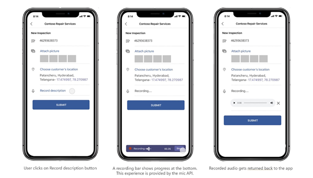

# <a name="integrate-media-capabilities"></a><span data-ttu-id="b4a18-104">Интеграция возможностей мультимедиа</span><span class="sxs-lookup"><span data-stu-id="b4a18-104">Integrate media capabilities</span></span> 

<span data-ttu-id="b4a18-105">В этом документе вы можете узнать, как интегрировать возможности мультимедиа.</span><span class="sxs-lookup"><span data-stu-id="b4a18-105">This document guides you on how to integrate media capabilities.</span></span> <span data-ttu-id="b4a18-106">Эта интеграция объединяет встроенные возможности  устройства, такие как камера и **микрофон,** с платформой Teams.</span><span class="sxs-lookup"><span data-stu-id="b4a18-106">This integration combines the native device capabilities, such as the **camera** and **microphone** with the Teams platform.</span></span>  

<span data-ttu-id="b4a18-107">Вы можете использовать [клиентский SDK JavaScript](/javascript/api/overview/msteams-client?view=msteams-client-js-latest&preserve-view=true)для Microsoft Teams, который предоставляет средства, необходимые приложению для доступа к разрешениям устройства [пользователя.](native-device-permissions.md)</span><span class="sxs-lookup"><span data-stu-id="b4a18-107">You can use [Microsoft Teams JavaScript client SDK](/javascript/api/overview/msteams-client?view=msteams-client-js-latest&preserve-view=true), that provides the tools necessary for your app to access a user’s [device permissions](native-device-permissions.md).</span></span> <span data-ttu-id="b4a18-108">Используйте **подходящие** API возможностей мультимедиа для интеграции встроенных  возможностей  устройств, таких как камера и микрофон, с платформой Teams в мобильном приложении Microsoft Teams, и создайте более богатые возможности.</span><span class="sxs-lookup"><span data-stu-id="b4a18-108">Use suitable  **media capability APIs** to integrate the native device capabilities, such as the **camera** and **microphone** with the Teams platform within your Microsoft Teams mobile app, and build a richer experience.</span></span> 

## <a name="advantage-of-integrating-media-capabilities"></a><span data-ttu-id="b4a18-109">Преимущества интеграции возможностей мультимедиа</span><span class="sxs-lookup"><span data-stu-id="b4a18-109">Advantage of integrating media capabilities</span></span>

<span data-ttu-id="b4a18-110">Основное преимущество интеграции возможностей устройств в приложения Teams заключается в том, что он использует встроенные элементы управления Teams, чтобы предоставить пользователям богатый и иммерсивный опыт.</span><span class="sxs-lookup"><span data-stu-id="b4a18-110">The main advantage of integrating device capabilities in your Teams apps is it leverages native Teams controls to provide a rich and immersive experience to your users.</span></span>
<span data-ttu-id="b4a18-111">Для интеграции возможностей мультимедиа необходимо обновить файл манифеста приложения и вызвать API возможностей мультимедиа.</span><span class="sxs-lookup"><span data-stu-id="b4a18-111">To integrate media capabilities you must update the app manifest file and call the media capability APIs.</span></span> 

<span data-ttu-id="b4a18-112">Для эффективной интеграции необходимо иметь [](#code-snippets) хорошее представление о фрагментах кода для вызова соответствующих API, которые позволяют использовать возможности нативных носителей.</span><span class="sxs-lookup"><span data-stu-id="b4a18-112">For effective integration, you must have a good understanding of [code snippets](#code-snippets) for calling the respective APIs, which allow you to use native media capabilities.</span></span>

<span data-ttu-id="b4a18-113">Важно ознакомиться с ошибками ответа [API](#error-handling) для обработки ошибок в приложении Teams.</span><span class="sxs-lookup"><span data-stu-id="b4a18-113">It is important to familiarize yourself with the [API response errors](#error-handling) to handle the errors in your Teams app.</span></span>

> [!NOTE] 
> <span data-ttu-id="b4a18-114">В настоящее время поддержка возможностей мультимедиа в Microsoft Teams доступна только для мобильных клиентов.</span><span class="sxs-lookup"><span data-stu-id="b4a18-114">Currently, Microsoft Teams support for media capabilities is only available for mobile clients.</span></span>

## <a name="update-manifest"></a><span data-ttu-id="b4a18-115">Обновление манифеста</span><span class="sxs-lookup"><span data-stu-id="b4a18-115">Update manifest</span></span>

<span data-ttu-id="b4a18-116">Обновите приложение Teams [manifest.jsв файле,](../../resources/schema/manifest-schema.md#devicepermissions) добавив `devicePermissions` свойство и указав `media` .</span><span class="sxs-lookup"><span data-stu-id="b4a18-116">Update your Teams app [manifest.json](../../resources/schema/manifest-schema.md#devicepermissions) file by adding the `devicePermissions` property and specifying `media`.</span></span> <span data-ttu-id="b4a18-117">Это позволяет приложению запросить необходимые разрешения у пользователей, прежде чем они начнут использовать камеру для захвата изображения, откройте  галерею, чтобы выбрать изображение для отправки в виде вложения, или используйте микрофон для записи беседы. </span><span class="sxs-lookup"><span data-stu-id="b4a18-117">It allows your app to ask for requisite permissions from users before they start using  the **camera** to capture the image, open the gallery to select an image to submit as an attachment, or use the **microphone** to record the conversation.</span></span>

``` json
"devicePermissions": [
    "media",
],
```

> [!NOTE]
> <span data-ttu-id="b4a18-118">Запрос **разрешений автоматически** отображается при инициировании соответствующего API Teams.</span><span class="sxs-lookup"><span data-stu-id="b4a18-118">The **Request Permissions** prompt is automatically displayed when a relevant Teams API is initiated.</span></span> <span data-ttu-id="b4a18-119">Дополнительные сведения см. в [запросе разрешений устройства.](native-device-permissions.md)</span><span class="sxs-lookup"><span data-stu-id="b4a18-119">For more information, see [Request device permissions](native-device-permissions.md).</span></span>

## <a name="media-capability-apis"></a><span data-ttu-id="b4a18-120">API возможностей мультимедиа</span><span class="sxs-lookup"><span data-stu-id="b4a18-120">Media capability APIs</span></span>

<span data-ttu-id="b4a18-121">API [selectMedia,](/javascript/api/@microsoft/teams-js/media?view=msteams-client-js-latest#selectMedia_MediaInputs___error__SdkError__attachments__Media_______void_&preserve-view=true) [getMedia](/javascript/api/@microsoft/teams-js/_media?view=msteams-client-js-latest#getMedia__error__SdkError__blob__Blob_____void_&preserve-view=true)и [viewImages](/javascript/api/@microsoft/teams-js/media?view=msteams-client-js-latest#viewImages_ImageUri_____error___SdkError_____void_&preserve-view=true) позволяют использовать возможности нативных носителей следующим образом:</span><span class="sxs-lookup"><span data-stu-id="b4a18-121">The [selectMedia](/javascript/api/@microsoft/teams-js/media?view=msteams-client-js-latest#selectMedia_MediaInputs___error__SdkError__attachments__Media_______void_&preserve-view=true), [getMedia](/javascript/api/@microsoft/teams-js/_media?view=msteams-client-js-latest#getMedia__error__SdkError__blob__Blob_____void_&preserve-view=true), and [viewImages](/javascript/api/@microsoft/teams-js/media?view=msteams-client-js-latest#viewImages_ImageUri_____error___SdkError_____void_&preserve-view=true) APIs enable you to use native media capabilities as follows:</span></span>

* <span data-ttu-id="b4a18-122">Используйте встроенный **микрофон,** чтобы разрешить пользователям записывать звук **(запись** 10 минут беседы) с устройства.</span><span class="sxs-lookup"><span data-stu-id="b4a18-122">Use the native **microphone** to allow users to **record audio** (record 10 minutes of conversation) from the device.</span></span>
* <span data-ttu-id="b4a18-123">Используйте **нативный контроль камеры,** чтобы разрешить пользователям **захватывать и присоединять изображения** в путь.</span><span class="sxs-lookup"><span data-stu-id="b4a18-123">Use native **camera control** to allow users to **capture and attach images** on the go.</span></span>
* <span data-ttu-id="b4a18-124">Используйте **поддержку коллекции,** чтобы разрешить пользователям выбирать изображения **устройств в** качестве вложений.</span><span class="sxs-lookup"><span data-stu-id="b4a18-124">Use native **gallery support** to allow users to **select device images** as attachments.</span></span>
* <span data-ttu-id="b4a18-125">Используйте **нативный контроль просмотра изображений** для **предварительного просмотра нескольких изображений** одновременно.</span><span class="sxs-lookup"><span data-stu-id="b4a18-125">Use native **image viewer control** to **preview multiple images** at one time.</span></span>
* <span data-ttu-id="b4a18-126">Поддержка **передачи больших изображений** (от 1 МБ до 50 МБ) через мост SDK.</span><span class="sxs-lookup"><span data-stu-id="b4a18-126">Support **large image transfer** (from 1 MB to 50 MB) through the SDK bridge.</span></span>
* <span data-ttu-id="b4a18-127">Поддержка **расширенных возможностей изображений,** позволяющих пользователям просматривать и редактировать изображения:</span><span class="sxs-lookup"><span data-stu-id="b4a18-127">Support **advanced image capabilities** allowing users to preview and edit images:</span></span>
  * <span data-ttu-id="b4a18-128">Сканирование документа, доски и визитных карточек с помощью камеры.</span><span class="sxs-lookup"><span data-stu-id="b4a18-128">Scan document, whiteboard, and business cards  through the camera.</span></span>
  
> [!IMPORTANT]
>*   <span data-ttu-id="b4a18-129">API , и могут вызываться из нескольких поверхностей Teams, таких как модули задач, вкладки `selectMedia` `getMedia` и `viewImages` личные приложения.</span><span class="sxs-lookup"><span data-stu-id="b4a18-129">The `selectMedia`, `getMedia`, and `viewImages` APIs can be invoked from multiple Teams surfaces such as task modules, tabs, and personal apps.</span></span> <span data-ttu-id="b4a18-130">Дополнительные сведения [см. в пунктах входа для приложений Teams.](../extensibility-points.md)</span><span class="sxs-lookup"><span data-stu-id="b4a18-130">For more details, see [Entry points for Teams apps](../extensibility-points.md).</span></span>
>* <span data-ttu-id="b4a18-131">`selectMedia` API был расширен для поддержки свойств микрофона и звука.</span><span class="sxs-lookup"><span data-stu-id="b4a18-131">`selectMedia` API has been extended to support mic and audio properties.</span></span>

<span data-ttu-id="b4a18-132">Чтобы включить возможности мультимедиа на устройстве, необходимо использовать следующий набор API:</span><span class="sxs-lookup"><span data-stu-id="b4a18-132">You must use the following set of APIs to enable your device's media capabilities:</span></span>

| <span data-ttu-id="b4a18-133">API</span><span class="sxs-lookup"><span data-stu-id="b4a18-133">API</span></span>      | <span data-ttu-id="b4a18-134">Описание</span><span class="sxs-lookup"><span data-stu-id="b4a18-134">Description</span></span>   |
| --- | --- |
| <span data-ttu-id="b4a18-135">[**selectMedia**](/javascript/api/@microsoft/teams-js/media?view=msteams-client-js-latest#selectMedia_MediaInputs___error__SdkError__attachments__Media_______void_&preserve-view=true) (**Camera)**</span><span class="sxs-lookup"><span data-stu-id="b4a18-135">[**selectMedia**](/javascript/api/@microsoft/teams-js/media?view=msteams-client-js-latest#selectMedia_MediaInputs___error__SdkError__attachments__Media_______void_&preserve-view=true) (**Camera)**</span></span>| <span data-ttu-id="b4a18-136">Этот API позволяет пользователям захватывать или выбирать **мультимедиа** с камеры устройства и возвращать его в веб-приложение.</span><span class="sxs-lookup"><span data-stu-id="b4a18-136">This API allows users to **capture or select media from the device camera** and return it to the web-app.</span></span> <span data-ttu-id="b4a18-137">Пользователи могут редактировать, обрезать, вращать, примечать или рисовать изображения перед отправкой.</span><span class="sxs-lookup"><span data-stu-id="b4a18-137">The users can edit, crop, rotate, annotate, or draw over images before submission.</span></span> <span data-ttu-id="b4a18-138">В ответ на **selectMedia** веб-приложение получает ид мультимедиа выбранных изображений и эскиз выбранного мультимедиа.</span><span class="sxs-lookup"><span data-stu-id="b4a18-138">In response to **selectMedia**, the web-app receives the media IDs of selected images and a thumbnail of the selected media.</span></span> <span data-ttu-id="b4a18-139">Этот API можно дополнительно настроить с помощью [конфигурации ImageProps.](/javascript/api/@microsoft/teams-js/imageprops?view=msteams-client-js-latest&preserve-view=true)</span><span class="sxs-lookup"><span data-stu-id="b4a18-139">This API can be further configured through the [ImageProps](/javascript/api/@microsoft/teams-js/imageprops?view=msteams-client-js-latest&preserve-view=true) configuration.</span></span> |
| <span data-ttu-id="b4a18-140">[**selectMedia**](/javascript/api/@microsoft/teams-js/media?view=msteams-client-js-latest#selectMedia_MediaInputs___error__SdkError__attachments__Media_______void_&preserve-view=true) **(микрофон)**</span><span class="sxs-lookup"><span data-stu-id="b4a18-140">[**selectMedia**](/javascript/api/@microsoft/teams-js/media?view=msteams-client-js-latest#selectMedia_MediaInputs___error__SdkError__attachments__Media_______void_&preserve-view=true) (**Microphone**)</span></span>| <span data-ttu-id="b4a18-141">Установите [для mediaType](/javascript/api/@microsoft/teams-js/mediatype?view=msteams-client-js-latest&preserve-view=true) в `4` **selectMedia** API для доступа к возможности микрофона.</span><span class="sxs-lookup"><span data-stu-id="b4a18-141">Set the [mediaType](/javascript/api/@microsoft/teams-js/mediatype?view=msteams-client-js-latest&preserve-view=true) to `4` in **selectMedia** API for accessing microphone  capability.</span></span> <span data-ttu-id="b4a18-142">Этот API также позволяет пользователям записывать звук с микрофона устройства и возвращать записанные клипы в веб-приложение.</span><span class="sxs-lookup"><span data-stu-id="b4a18-142">This API also allows users to record audio from the device microphone and return recorded clips to the web-app.</span></span> <span data-ttu-id="b4a18-143">Пользователи могут приостанавлить, повторно записывать и играть предварительный просмотр записи перед отправкой.</span><span class="sxs-lookup"><span data-stu-id="b4a18-143">The users can pause, re-record, and play recording preview before submission.</span></span> <span data-ttu-id="b4a18-144">В ответ на **selectMedia** веб-приложение получает ид мультимедиа выбранной аудиозаписи.</span><span class="sxs-lookup"><span data-stu-id="b4a18-144">In response to **selectMedia**, the web-app receives media IDs of the selected audio recording.</span></span> <br/> <span data-ttu-id="b4a18-145">Используйте , если требуется настроить длительность в минутах `maxDuration` для записи беседы.</span><span class="sxs-lookup"><span data-stu-id="b4a18-145">Use `maxDuration`, if you require to configure a duration in minutes for recording the conversation.</span></span> <span data-ttu-id="b4a18-146">Текущая продолжительность записи составляет 10 минут, после чего запись завершается.</span><span class="sxs-lookup"><span data-stu-id="b4a18-146">The current duration for recording is 10 minutes, after which the recording terminates.</span></span>  |
| [<span data-ttu-id="b4a18-147">**getMedia**</span><span class="sxs-lookup"><span data-stu-id="b4a18-147">**getMedia**</span></span>](/javascript/api/@microsoft/teams-js/_media?view=msteams-client-js-latest#getMedia__error__SdkError__blob__Blob_____void_&preserve-view=true)| <span data-ttu-id="b4a18-148">Этот API извлекает мультимедиа, захваченные **selectMedia** API, фрагментами, независимо от размера мультимедиа.</span><span class="sxs-lookup"><span data-stu-id="b4a18-148">This API retrieves the media captured by **selectMedia** API in chunks, irrespective of the media size.</span></span> <span data-ttu-id="b4a18-149">Эти блоки собираются и отправляются обратно в веб-приложение в качестве файла или BLOB-файла.</span><span class="sxs-lookup"><span data-stu-id="b4a18-149">These chunks are assembled and sent back to the web app as a file or blob.</span></span> <span data-ttu-id="b4a18-150">Размыв мультимедиа на меньшие блоки упрощает передачу больших файлов.</span><span class="sxs-lookup"><span data-stu-id="b4a18-150">Breaking of media into smaller chunks facilitates large file transfer.</span></span> |
| [<span data-ttu-id="b4a18-151">**viewImages**</span><span class="sxs-lookup"><span data-stu-id="b4a18-151">**viewImages**</span></span>](/javascript/api/@microsoft/teams-js/media?view=msteams-client-js-latest#viewImages_ImageUri_____error___SdkError_____void_&preserve-view=true)| <span data-ttu-id="b4a18-152">Этот API позволяет пользователю просматривать изображения в полноэкранном режиме в качестве прокручиваемого списка.</span><span class="sxs-lookup"><span data-stu-id="b4a18-152">This API enables the user to view images in  full-screen mode as a scrollable list.</span></span>|


<span data-ttu-id="b4a18-153">**Возможности веб-приложения для selectMedia API для функции изображений** 
 </span><span class="sxs-lookup"><span data-stu-id="b4a18-153">**Web app experience for selectMedia API for image capability**
</span></span>

<span data-ttu-id="b4a18-154">**Возможности веб-приложения для selectMedia API для возможности микрофона** 
 </span><span class="sxs-lookup"><span data-stu-id="b4a18-154">**Web app experience for selectMedia API for microphone capability**
</span></span>

## <a name="error-handling"></a><span data-ttu-id="b4a18-155">Обработка ошибок</span><span class="sxs-lookup"><span data-stu-id="b4a18-155">Error handling</span></span>

<span data-ttu-id="b4a18-156">В приложении Teams необходимо обеспечить соответствующую обработку этих ошибок.</span><span class="sxs-lookup"><span data-stu-id="b4a18-156">You must ensure to handle these errors appropriately in your Teams app.</span></span> <span data-ttu-id="b4a18-157">В следующей таблице перечислены коды ошибок и условия, при которых создаются ошибки:</span><span class="sxs-lookup"><span data-stu-id="b4a18-157">The following table lists the error codes and the conditions under which the errors are generated:</span></span> 


|<span data-ttu-id="b4a18-158">Код ошибки</span><span class="sxs-lookup"><span data-stu-id="b4a18-158">Error code</span></span> |  <span data-ttu-id="b4a18-159">Имя ошибки</span><span class="sxs-lookup"><span data-stu-id="b4a18-159">Error name</span></span>     | <span data-ttu-id="b4a18-160">Condition</span><span class="sxs-lookup"><span data-stu-id="b4a18-160">Condition</span></span>|
| --------- | --------------- | -------- |
| <span data-ttu-id="b4a18-161">**100**</span><span class="sxs-lookup"><span data-stu-id="b4a18-161">**100**</span></span> | <span data-ttu-id="b4a18-162">NOT_SUPPORTED_ON_PLATFORM</span><span class="sxs-lookup"><span data-stu-id="b4a18-162">NOT_SUPPORTED_ON_PLATFORM</span></span> | <span data-ttu-id="b4a18-163">API не поддерживается на текущей платформе.</span><span class="sxs-lookup"><span data-stu-id="b4a18-163">API is not supported on the current platform.</span></span>|
| <span data-ttu-id="b4a18-164">**404**</span><span class="sxs-lookup"><span data-stu-id="b4a18-164">**404**</span></span> | <span data-ttu-id="b4a18-165">FILE_NOT_FOUND</span><span class="sxs-lookup"><span data-stu-id="b4a18-165">FILE_NOT_FOUND</span></span> | <span data-ttu-id="b4a18-166">Указанный файл не найден в указанном расположении.</span><span class="sxs-lookup"><span data-stu-id="b4a18-166">File specified is not found in the given location.</span></span>|
| <span data-ttu-id="b4a18-167">**500**</span><span class="sxs-lookup"><span data-stu-id="b4a18-167">**500**</span></span> | <span data-ttu-id="b4a18-168">INTERNAL_ERROR</span><span class="sxs-lookup"><span data-stu-id="b4a18-168">INTERNAL_ERROR</span></span> | <span data-ttu-id="b4a18-169">При выполнении необходимой операции произошла внутренняя ошибка.</span><span class="sxs-lookup"><span data-stu-id="b4a18-169">Internal error is encountered while performing the required operation.</span></span>|
| <span data-ttu-id="b4a18-170">**1000**</span><span class="sxs-lookup"><span data-stu-id="b4a18-170">**1000**</span></span> | <span data-ttu-id="b4a18-171">PERMISSION_DENIED</span><span class="sxs-lookup"><span data-stu-id="b4a18-171">PERMISSION_DENIED</span></span> |<span data-ttu-id="b4a18-172">Пользователь отказано в разрешении.</span><span class="sxs-lookup"><span data-stu-id="b4a18-172">Permission is denied by the user.</span></span>|
| <span data-ttu-id="b4a18-173">**2000**</span><span class="sxs-lookup"><span data-stu-id="b4a18-173">**2000**</span></span> |<span data-ttu-id="b4a18-174">NETWORK_ERROR</span><span class="sxs-lookup"><span data-stu-id="b4a18-174">NETWORK_ERROR</span></span> | <span data-ttu-id="b4a18-175">Проблема с сетью.</span><span class="sxs-lookup"><span data-stu-id="b4a18-175">Network issue.</span></span>|
| <span data-ttu-id="b4a18-176">**3000**</span><span class="sxs-lookup"><span data-stu-id="b4a18-176">**3000**</span></span> | <span data-ttu-id="b4a18-177">NO_HW_SUPPORT</span><span class="sxs-lookup"><span data-stu-id="b4a18-177">NO_HW_SUPPORT</span></span> | <span data-ttu-id="b4a18-178">Аппаратное обеспечение не поддерживает эту возможность.</span><span class="sxs-lookup"><span data-stu-id="b4a18-178">Underlying hardware does not support the capability.</span></span>|
| <span data-ttu-id="b4a18-179">**4000**</span><span class="sxs-lookup"><span data-stu-id="b4a18-179">**4000**</span></span>| <span data-ttu-id="b4a18-180">INVALID_ARGUMENTS</span><span class="sxs-lookup"><span data-stu-id="b4a18-180">INVALID_ARGUMENTS</span></span> | <span data-ttu-id="b4a18-181">Один или несколько аргументов недопустимы.</span><span class="sxs-lookup"><span data-stu-id="b4a18-181">One or more arguments are invalid.</span></span>|
| <span data-ttu-id="b4a18-182">**5000**</span><span class="sxs-lookup"><span data-stu-id="b4a18-182">**5000**</span></span> | <span data-ttu-id="b4a18-183">UNAUTHORIZED_USER_OPERATION</span><span class="sxs-lookup"><span data-stu-id="b4a18-183">UNAUTHORIZED_USER_OPERATION</span></span> | <span data-ttu-id="b4a18-184">Пользователь не имеет права на завершение этой операции.</span><span class="sxs-lookup"><span data-stu-id="b4a18-184">User is not authorized to complete this operation.</span></span>|
| <span data-ttu-id="b4a18-185">**6000**</span><span class="sxs-lookup"><span data-stu-id="b4a18-185">**6000**</span></span> |<span data-ttu-id="b4a18-186">INSUFFICIENT_RESOURCES</span><span class="sxs-lookup"><span data-stu-id="b4a18-186">INSUFFICIENT_RESOURCES</span></span> | <span data-ttu-id="b4a18-187">Не удалось завершить операцию из-за недостатка ресурсов.</span><span class="sxs-lookup"><span data-stu-id="b4a18-187">Operation could not be completed due to insufficient resources.</span></span>|
|<span data-ttu-id="b4a18-188">**7000**</span><span class="sxs-lookup"><span data-stu-id="b4a18-188">**7000**</span></span> | <span data-ttu-id="b4a18-189">THROTTLE</span><span class="sxs-lookup"><span data-stu-id="b4a18-189">THROTTLE</span></span> | <span data-ttu-id="b4a18-190">Платформа регулирования запроса, так как API вызывался часто.</span><span class="sxs-lookup"><span data-stu-id="b4a18-190">Platform throttled the request as the API was invoked frequently.</span></span>|
|  <span data-ttu-id="b4a18-191">**8000**</span><span class="sxs-lookup"><span data-stu-id="b4a18-191">**8000**</span></span> | <span data-ttu-id="b4a18-192">USER_ABORT</span><span class="sxs-lookup"><span data-stu-id="b4a18-192">USER_ABORT</span></span> |<span data-ttu-id="b4a18-193">Пользователь прерывает операцию.</span><span class="sxs-lookup"><span data-stu-id="b4a18-193">User aborts the operation.</span></span>|
| <span data-ttu-id="b4a18-194">**9000**</span><span class="sxs-lookup"><span data-stu-id="b4a18-194">**9000**</span></span>| <span data-ttu-id="b4a18-195">OLD_PLATFORM</span><span class="sxs-lookup"><span data-stu-id="b4a18-195">OLD_PLATFORM</span></span> | <span data-ttu-id="b4a18-196">Код платформы устарел и не реализует этот API.</span><span class="sxs-lookup"><span data-stu-id="b4a18-196">Platform code is outdated and does not implement this API.</span></span>|
| <span data-ttu-id="b4a18-197">**10000**</span><span class="sxs-lookup"><span data-stu-id="b4a18-197">**10000**</span></span>| <span data-ttu-id="b4a18-198">SIZE_EXCEEDED</span><span class="sxs-lookup"><span data-stu-id="b4a18-198">SIZE_EXCEEDED</span></span> |  <span data-ttu-id="b4a18-199">Возвращаемая величина слишком велика и превысила границы размера платформы.</span><span class="sxs-lookup"><span data-stu-id="b4a18-199">Return value is too big and has exceeded the platform size boundaries.</span></span>|

## <a name="code-snippets"></a><span data-ttu-id="b4a18-200">Фрагменты кода</span><span class="sxs-lookup"><span data-stu-id="b4a18-200">Code snippets</span></span>

<span data-ttu-id="b4a18-201">**Вызов `selectMedia` API для** захвата изображений с помощью камеры:</span><span class="sxs-lookup"><span data-stu-id="b4a18-201">**Calling `selectMedia` API** for capturing images using camera:</span></span>

```javascript
let imageProp: microsoftTeams.media.ImageProps = {
    sources: [microsoftTeams.media.Source.Camera, microsoftTeams.media.Source.Gallery],
    startMode: microsoftTeams.media.CameraStartMode.Photo,
    ink: false,
    cameraSwitcher: false,
    textSticker: false,
    enableFilter: true,
};
let mediaInput: microsoftTeams.media.MediaInputs = {
    mediaType: microsoftTeams.media.MediaType.Image,
    maxMediaCount: 10,
    imageProps: imageProp
};
microsoftTeams.media.selectMedia(mediaInput, (error: microsoftTeams.SdkError, attachments: microsoftTeams.media.Media[]) => {
    if (error) {
        if (error.message) {
            alert(" ErrorCode: " + error.errorCode + error.message);
        } else {
            alert(" ErrorCode: " + error.errorCode);
        }
    }
    if (attachments) {
        let y = attachments[0];
        img.src = ("data:" + y.mimeType + ";base64," + y.preview);
    }
});
```

<span data-ttu-id="b4a18-202">**Вызов `getMedia` API для** получения больших объемов мультимедиа по частям:</span><span class="sxs-lookup"><span data-stu-id="b4a18-202">**Calling `getMedia` API** to retrieve large media in chunks:</span></span>

```javascript
let media: microsoftTeams.media.Media = attachments[0]
media.getMedia((error: microsoftTeams.SdkError, blob: Blob) => {
    if (blob) {
        if (blob.type.includes("image")) {
            img.src = (URL.createObjectURL(blob));
        }
    }
    if (error) {
        if (error.message) {
            alert(" ErrorCode: " + error.errorCode + error.message);
        } else {
            alert(" ErrorCode: " + error.errorCode);
        }
    }
});
```

<span data-ttu-id="b4a18-203">**Вызов `viewImages` API по ИД, возвращаемой `selectMedia` API:**</span><span class="sxs-lookup"><span data-stu-id="b4a18-203">**Calling `viewImages` API by ID returned by `selectMedia` API**:</span></span>

```javascript
// View images by id:
// Assumption: attachmentArray = select Media API Output
let uriList = [];
if (attachmentArray && attachmentArray.length > 0) {
    for (let i = 0; i < attachmentArray.length; i++) {
        let file = attachmentArray[i];
        if (file.mimeType.includes("image")) {
            let imageUri = {
                value: file.content,
                type: 1,
            }
            uriList.push(imageUri);
        } else {
            alert("File type is not image");
        }
    }
}
if (uriList.length > 0) {
    microsoftTeams.media.viewImages(uriList, (error: microsoftTeams.SdkError) => {
        if (error) {
            if (error.message) {
                output(" ErrorCode: " + error.errorCode + error.message);
            } else {
                output(" ErrorCode: " + error.errorCode);
            }
        }
    });
} else {
    output("Url list is empty");
}
```

<span data-ttu-id="b4a18-204">**Вызов `viewImages` API по URL-адресу:**</span><span class="sxs-lookup"><span data-stu-id="b4a18-204">**Calling `viewImages` API by URL**:</span></span>

```javascript
// View Images by URL:
// Assumption 2 urls, url1 and url2
let uriList = [];
if (URL1 != null && URL1.length > 0) {
    let imageUri = {
        value: URL1,
        type: 2,
    }
    uriList.push(imageUri);
}
if (URL2 != null && URL2.length > 0) {
    let imageUri = {
        value: URL2,
        type: 2,
    }
    uriList.push(imageUri);
}
if (uriList.length > 0) {
    microsoftTeams.media.viewImages(uriList, (error: microsoftTeams.SdkError) => {
        if (error) {
            if (error.message) {
                output(" ErrorCode: " + error.errorCode + error.message);
            } else {
                output(" ErrorCode: " + error.errorCode);
            }
        }
    });
} else {
    output("Url list is empty");
}
```

<span data-ttu-id="b4a18-205">**Вызовы `selectMedia` и `getMedia` API для записи звука с помощью микрофона:**</span><span class="sxs-lookup"><span data-stu-id="b4a18-205">**Calling `selectMedia` and `getMedia` APIs for recording audio through microphone**:</span></span>

```javascript
let mediaInput: microsoftTeams.media.MediaInputs = {
    mediaType: microsoftTeams.media.MediaType.Audio,
    maxMediaCount: 1,
};
microsoftTeams.media.selectMedia(mediaInput, (error: microsoftTeams.SdkError, attachments: microsoftTeams.media.Media[]) => {
    if (error) {
        if (error.message) {
            alert(" ErrorCode: " + error.errorCode + error.message);
        } else {
            alert(" ErrorCode: " + error.errorCode);
        }
    }
    // If you want to directly use the audio file (for smaller file sizes (~4MB))    if (attachments) {
    let audioResult = attachments[0];
    var videoElement = document.createElement("video");
    videoElement.setAttribute("src", ("data:" + y.mimeType + ";base64," + y.preview));
    //To use the audio file via get Media API for bigger audio file sizes greater than 4MB        audioResult.getMedia((error: microsoftTeams.SdkError, blob: Blob) => {
    if (blob) {
        if (blob.type.includes("video")) {
            videoElement.setAttribute("src", URL.createObjectURL(blob));
        }
    }
    if (error) {
        if (error.message) {
            alert(" ErrorCode: " + error.errorCode + error.message);
        } else {
            alert(" ErrorCode: " + error.errorCode);
        }
    }
});
```
