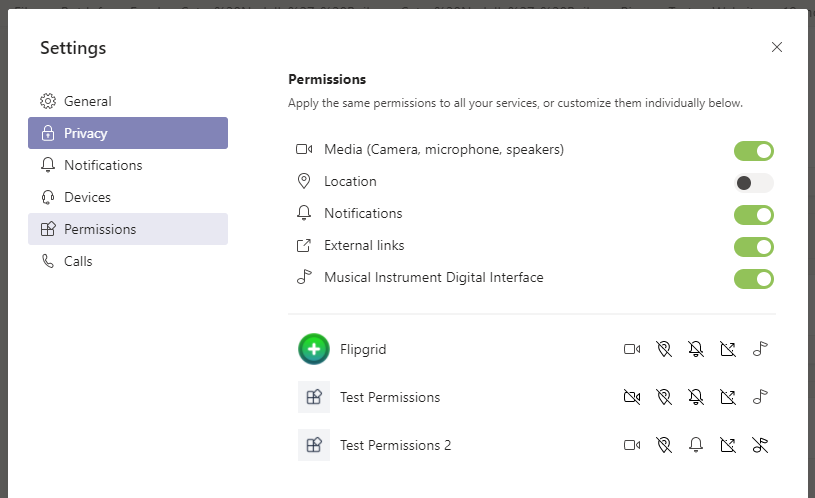

# <a name="request-device-permissions-for-your-microsoft-teams-app"></a><span data-ttu-id="a4e12-104">Запрос разрешений на устройство для Microsoft Teams приложения</span><span class="sxs-lookup"><span data-stu-id="a4e12-104">Request device permissions for your Microsoft Teams app</span></span>

<span data-ttu-id="a4e12-105">Вы можете обогатить Teams с помощью родных возможностей устройства, таких как камера, микрофон и расположение.</span><span class="sxs-lookup"><span data-stu-id="a4e12-105">You can enrich your Teams app with native device capabilities, such as camera, microphone, and location.</span></span> <span data-ttu-id="a4e12-106">В этом документе вы можете узнать, как запрашивать согласие пользователя и получать доступ к разрешениям на родных устройствах.</span><span class="sxs-lookup"><span data-stu-id="a4e12-106">This document guides you on how to request user consent and access the native device permissions.</span></span>

> [!NOTE]
> * <span data-ttu-id="a4e12-107">Чтобы интегрировать возможности мультимедиа в Microsoft Teams мобильном приложении, см. в приложении [Integrate media capabilities.](mobile-camera-image-permissions.md)</span><span class="sxs-lookup"><span data-stu-id="a4e12-107">To integrate media capabilities within your Microsoft Teams mobile app, see [Integrate media capabilities](mobile-camera-image-permissions.md).</span></span>
> * <span data-ttu-id="a4e12-108">Чтобы интегрировать функцию сканера [QR](qr-barcode-scanner-capability.md)или штрихкода в мобильном приложении Microsoft Teams см. в Teams.</span><span class="sxs-lookup"><span data-stu-id="a4e12-108">To integrate QR or barcode scanner capability within your Microsoft Teams mobile app, see [Integrate QR or barcode scanner capability in Teams](qr-barcode-scanner-capability.md).</span></span>
> * <span data-ttu-id="a4e12-109">Чтобы интегрировать возможности расположения в Microsoft Teams мобильном приложении, см. в [приложении Integrate location capabilities.](location-capability.md)</span><span class="sxs-lookup"><span data-stu-id="a4e12-109">To integrate location capabilities within your Microsoft Teams mobile app, see [Integrate location capabilities](location-capability.md).</span></span>

## <a name="native-device-permissions"></a><span data-ttu-id="a4e12-110">Разрешения на использование родных устройств</span><span class="sxs-lookup"><span data-stu-id="a4e12-110">Native device permissions</span></span>

<span data-ttu-id="a4e12-111">Необходимо запросить разрешения устройства для доступа к возможностям родного устройства.</span><span class="sxs-lookup"><span data-stu-id="a4e12-111">You must request the device permissions to access native device capabilities.</span></span> <span data-ttu-id="a4e12-112">Разрешения устройства работают аналогично для всех конструкций приложений, таких как вкладки, модули задач или расширения обмена сообщениями.</span><span class="sxs-lookup"><span data-stu-id="a4e12-112">The device permissions work similarly for all app constructs, such as tabs, task modules, or messaging extensions.</span></span> <span data-ttu-id="a4e12-113">Пользователь должен перейти на страницу разрешений в Teams параметров для управления разрешениями устройств.</span><span class="sxs-lookup"><span data-stu-id="a4e12-113">The user must go to the permissions page in Teams settings to manage device permissions.</span></span>
<span data-ttu-id="a4e12-114">Доступ к возможностям устройства позволяет создавать более богатые возможности на платформе Teams, например:</span><span class="sxs-lookup"><span data-stu-id="a4e12-114">By accessing the device capabilities, you can build richer experiences on the Teams platform, such as:</span></span>
* <span data-ttu-id="a4e12-115">Захват и просмотр изображений.</span><span class="sxs-lookup"><span data-stu-id="a4e12-115">Capture and view images.</span></span>
* <span data-ttu-id="a4e12-116">Сканирование QR или штрихкода.</span><span class="sxs-lookup"><span data-stu-id="a4e12-116">Scan QR or barcode.</span></span>
* <span data-ttu-id="a4e12-117">Запись и доля коротких видео.</span><span class="sxs-lookup"><span data-stu-id="a4e12-117">Record and share short videos.</span></span>
* <span data-ttu-id="a4e12-118">Запись аудиозаписей и сохранение их для более позднего использования.</span><span class="sxs-lookup"><span data-stu-id="a4e12-118">Record audio memos and save them for later use.</span></span>
* <span data-ttu-id="a4e12-119">Используйте сведения о расположении пользователя для отображения соответствующих сведений.</span><span class="sxs-lookup"><span data-stu-id="a4e12-119">Use the location information of the user to display relevant information.</span></span>

> [!NOTE]
> <span data-ttu-id="a4e12-120">В настоящее время Teams не поддерживает разрешения устройств для нескольких оконных приложений, вкладок и sidepanel собраний.</span><span class="sxs-lookup"><span data-stu-id="a4e12-120">Currently, Teams does not support device permissions for multi window apps, tabs, and the meeting sidepanel.</span></span> 

## <a name="access-device-permissions"></a><span data-ttu-id="a4e12-121">Разрешения на доступ к устройствам</span><span class="sxs-lookup"><span data-stu-id="a4e12-121">Access device permissions</span></span>

<span data-ttu-id="a4e12-122">Клиент [Microsoft Teams JavaScript SDK](/javascript/api/overview/msteams-client?view=msteams-client-js-latest&preserve-view=true) предоставляет средства, необходимые Teams мобильному приложению для [](#manage-permissions) доступа к разрешениям устройств пользователя и создания более насыщенного интерфейса.</span><span class="sxs-lookup"><span data-stu-id="a4e12-122">The [Microsoft Teams JavaScript client SDK](/javascript/api/overview/msteams-client?view=msteams-client-js-latest&preserve-view=true) provides the tools necessary for your Teams mobile app to access the user’s [device permissions](#manage-permissions) and build a richer experience.</span></span>

<span data-ttu-id="a4e12-123">Хотя доступ к этим функциям является стандартным в современных веб-браузерах, необходимо информировать Teams о свойствах, которые вы используете, обновив манифест приложения.</span><span class="sxs-lookup"><span data-stu-id="a4e12-123">While access to these features is standard in modern web browsers, you must inform Teams about the features you use by updating your app manifest.</span></span> <span data-ttu-id="a4e12-124">Это обновление позволяет спрашивать разрешения, пока приложение работает на Teams настольном клиенте.</span><span class="sxs-lookup"><span data-stu-id="a4e12-124">This update allows you to ask for permissions while your app runs on the Teams desktop client.</span></span>

> [!NOTE] 
> <span data-ttu-id="a4e12-125">В настоящее время Microsoft Teams средства массовой информации и возможности сканера штрихкодов QR доступны только для мобильных клиентов.</span><span class="sxs-lookup"><span data-stu-id="a4e12-125">Currently, Microsoft Teams support for media capabilities and QR barcode scanner capability is only available for mobile clients.</span></span>

## <a name="manage-permissions"></a><span data-ttu-id="a4e12-126">Управление разрешениями</span><span class="sxs-lookup"><span data-stu-id="a4e12-126">Manage permissions</span></span>

<span data-ttu-id="a4e12-127">Пользователь может управлять разрешениями устройств в Teams параметров,  выбрав **разрешить** или запретить разрешения для определенных приложений.</span><span class="sxs-lookup"><span data-stu-id="a4e12-127">A user can manage device permissions in Teams settings by selecting **Allow** or **Deny** permissions to specific apps.</span></span>
 
# <a name="desktop"></a>[<span data-ttu-id="a4e12-128">Рабочий стол</span><span class="sxs-lookup"><span data-stu-id="a4e12-128">Desktop</span></span>](#tab/desktop)

1. <span data-ttu-id="a4e12-129">Откройте приложение Teams.</span><span class="sxs-lookup"><span data-stu-id="a4e12-129">Open your Teams app.</span></span>
1. <span data-ttu-id="a4e12-130">Выберите значок профиля в правом верхнем углу окна.</span><span class="sxs-lookup"><span data-stu-id="a4e12-130">Select your profile icon in the upper right corner of the window.</span></span>
1. <span data-ttu-id="a4e12-131">Выберите **Параметры**  >  **разрешений** из выпадаемого меню.</span><span class="sxs-lookup"><span data-stu-id="a4e12-131">Select **Settings** > **Permissions** from the drop-down menu.</span></span>
1. <span data-ttu-id="a4e12-132">Выберите нужные параметры.</span><span class="sxs-lookup"><span data-stu-id="a4e12-132">Select your desired settings.</span></span>

   

# <a name="mobile"></a>[<span data-ttu-id="a4e12-134">Мобильные устройства</span><span class="sxs-lookup"><span data-stu-id="a4e12-134">Mobile</span></span>](#tab/mobile)

1. <span data-ttu-id="a4e12-135">Откройте Teams.</span><span class="sxs-lookup"><span data-stu-id="a4e12-135">Open Teams.</span></span>
1. <span data-ttu-id="a4e12-136">Перейдите **Параметры**  >  **разрешения на приложения.**</span><span class="sxs-lookup"><span data-stu-id="a4e12-136">Go to **Settings** > **App Permissions**.</span></span>
1. <span data-ttu-id="a4e12-137">Выберите приложение, для которого необходимо выбрать параметры.</span><span class="sxs-lookup"><span data-stu-id="a4e12-137">Select the app for which you need to choose the settings.</span></span>
1. <span data-ttu-id="a4e12-138">Выберите нужные параметры.</span><span class="sxs-lookup"><span data-stu-id="a4e12-138">Select your desired settings.</span></span>

    

---

## <a name="specify-permissions"></a><span data-ttu-id="a4e12-140">Указание разрешений</span><span class="sxs-lookup"><span data-stu-id="a4e12-140">Specify permissions</span></span>

<span data-ttu-id="a4e12-141">Обновите приложение, добавив и укажите, какие из пяти свойств вы `manifest.json` `devicePermissions` используете в приложении:</span><span class="sxs-lookup"><span data-stu-id="a4e12-141">Update your app's `manifest.json` by adding `devicePermissions` and specifying which of the five properties that you use in your application:</span></span>

``` json
"devicePermissions": [
    "media",
    "geolocation",
    "notifications",
    "midi",
    "openExternal"
],
```

<span data-ttu-id="a4e12-142">Каждое свойство позволяет задать пользователю запрос на его согласие:</span><span class="sxs-lookup"><span data-stu-id="a4e12-142">Each property allows you to prompt the user to ask for their consent:</span></span>

| <span data-ttu-id="a4e12-143">Свойство</span><span class="sxs-lookup"><span data-stu-id="a4e12-143">Property</span></span>      | <span data-ttu-id="a4e12-144">Описание</span><span class="sxs-lookup"><span data-stu-id="a4e12-144">Description</span></span>   |
| --- | --- |
| <span data-ttu-id="a4e12-145">мультимедиа</span><span class="sxs-lookup"><span data-stu-id="a4e12-145">media</span></span>         | <span data-ttu-id="a4e12-146">Разрешение на использование камеры, микрофона, динамиков и доступа к медиа-галерее.</span><span class="sxs-lookup"><span data-stu-id="a4e12-146">Permission to use the camera, microphone, speakers, and access media gallery.</span></span> |
| <span data-ttu-id="a4e12-147">геолокация</span><span class="sxs-lookup"><span data-stu-id="a4e12-147">geolocation</span></span>   | <span data-ttu-id="a4e12-148">Разрешение на возвращение расположения пользователя.</span><span class="sxs-lookup"><span data-stu-id="a4e12-148">Permission to return the user's location.</span></span>      |
| <span data-ttu-id="a4e12-149">уведомления</span><span class="sxs-lookup"><span data-stu-id="a4e12-149">notifications</span></span> | <span data-ttu-id="a4e12-150">Разрешение на отправку уведомлений пользователя.</span><span class="sxs-lookup"><span data-stu-id="a4e12-150">Permission to send the user notifications.</span></span>      |
| <span data-ttu-id="a4e12-151">midi</span><span class="sxs-lookup"><span data-stu-id="a4e12-151">midi</span></span>          | <span data-ttu-id="a4e12-152">Разрешение на отправку и получение сведений о цифровом интерфейсе музыкальных инструментов (MIDI) с цифрового музыкального инструмента.</span><span class="sxs-lookup"><span data-stu-id="a4e12-152">Permission to send and receive  Musical Instrument Digital Interface (MIDI) information from a digital musical instrument.</span></span>   |
| <span data-ttu-id="a4e12-153">openExternal</span><span class="sxs-lookup"><span data-stu-id="a4e12-153">openExternal</span></span>  | <span data-ttu-id="a4e12-154">Разрешение на открытие ссылок во внешних приложениях.</span><span class="sxs-lookup"><span data-stu-id="a4e12-154">Permission to open links in external applications.</span></span>  |

## <a name="check-permissions-from-your-app"></a><span data-ttu-id="a4e12-155">Проверка разрешений из приложения</span><span class="sxs-lookup"><span data-stu-id="a4e12-155">Check permissions from your app</span></span>

<span data-ttu-id="a4e12-156">После добавления в манифест приложения проверьте разрешения с помощью `devicePermissions` **API разрешений HTML5** без запроса:</span><span class="sxs-lookup"><span data-stu-id="a4e12-156">After adding `devicePermissions` to your app manifest, check permissions using the **HTML5 permissions API** without causing a prompt:</span></span>

``` Javascript
// Different query options:
navigator.permissions.query({ name: 'camera' });
navigator.permissions.query({ name: 'microphone' });
navigator.permissions.query({ name: 'geolocation' });
navigator.permissions.query({ name: 'notifications' });
navigator.permissions.query({ name: 'midi', sysex: true });

// Example:
navigator.permissions.query({name:'geolocation'}).then(function(result) {
  if (result.state == 'granted') {
    // Access granted
  } else if (result.state == 'prompt') {
    // Access has not been granted
  }
});
```

## <a name="use-teams-apis-to-get-device-permissions"></a><span data-ttu-id="a4e12-157">Используйте Teams API для получения разрешений на устройства</span><span class="sxs-lookup"><span data-stu-id="a4e12-157">Use Teams APIs to get device permissions</span></span>

<span data-ttu-id="a4e12-158">Используйте соответствующие HTML5 или Teams API, чтобы отобразить подсказку для получения согласия на доступ к разрешениям устройств.</span><span class="sxs-lookup"><span data-stu-id="a4e12-158">Leverage appropriate HTML5 or Teams API, to display a prompt for getting consent to access device permissions.</span></span>

> [!IMPORTANT]
> * <span data-ttu-id="a4e12-159">Поддержка `camera` , `gallery` и включен через `microphone` [**selectMedia API**](/javascript/api/@microsoft/teams-js/microsoftteams.media.media?view=msteams-client-js-latest&preserve-view=true).</span><span class="sxs-lookup"><span data-stu-id="a4e12-159">Support for `camera`, `gallery`, and `microphone` is enabled through [**selectMedia API**](/javascript/api/@microsoft/teams-js/microsoftteams.media.media?view=msteams-client-js-latest&preserve-view=true).</span></span> <span data-ttu-id="a4e12-160">Используйте [**API captureImage**](/javascript/api/@microsoft/teams-js/microsoftteams?view=msteams-client-js-latest#captureimage--error--sdkerror--files--file-------void-&preserve-view=true) для одного захвата изображения.</span><span class="sxs-lookup"><span data-stu-id="a4e12-160">Use [**captureImage API**](/javascript/api/@microsoft/teams-js/microsoftteams?view=msteams-client-js-latest#captureimage--error--sdkerror--files--file-------void-&preserve-view=true) for a single image capture.</span></span>
> * <span data-ttu-id="a4e12-161">Поддержка `location` включена через [**API getLocation.**](/javascript/api/@microsoft/teams-js/microsoftteams.location?view=msteams-client-js-latest#getLocation_LocationProps___error__SdkError__location__Location_____void_&preserve-view=true)</span><span class="sxs-lookup"><span data-stu-id="a4e12-161">Support for `location` is enabled through [**getLocation API**](/javascript/api/@microsoft/teams-js/microsoftteams.location?view=msteams-client-js-latest#getLocation_LocationProps___error__SdkError__location__Location_____void_&preserve-view=true).</span></span> <span data-ttu-id="a4e12-162">Это необходимо использовать для расположения, так как API геолокации HTML5 в настоящее время не полностью поддерживается на `getLocation API` Teams настольном клиенте.</span><span class="sxs-lookup"><span data-stu-id="a4e12-162">You must use this `getLocation API` for location, as HTML5 geolocation API is currently not fully supported on Teams desktop client.</span></span>

<span data-ttu-id="a4e12-163">Например:</span><span class="sxs-lookup"><span data-stu-id="a4e12-163">For example:</span></span>
 * <span data-ttu-id="a4e12-164">Чтобы подсказыть пользователю доступ к их расположению, необходимо `getCurrentPosition()` вызвать:</span><span class="sxs-lookup"><span data-stu-id="a4e12-164">To prompt the user to access their location you must call `getCurrentPosition()`:</span></span>

    ```Javascript
    navigator.geolocation.getCurrentPosition    (function (position) { /*... */ });
    ```

 * <span data-ttu-id="a4e12-165">Чтобы подсказыть пользователю доступ к камере на рабочем столе или в Интернете, необходимо `getUserMedia()` вызвать:</span><span class="sxs-lookup"><span data-stu-id="a4e12-165">To prompt the user to access their camera on desktop or web you must call `getUserMedia()`:</span></span>

    ```Javascript
    navigator.mediaDevices.getUserMedia({ audio: true, video: true });
    ```

 * <span data-ttu-id="a4e12-166">Чтобы захватить изображение на мобильном телефоне, Teams мобильный просит разрешения при `captureImage()` вызове:</span><span class="sxs-lookup"><span data-stu-id="a4e12-166">To capture the image on mobile, Teams mobile asks for permission when you call `captureImage()`:</span></span>

    ```Javascript
    microsoftTeams.media.captureImage((error: microsoftTeams.SdkError, files: microsoftTeams.media.File[]) => {
      /* ... */
    });
    ```

 * <span data-ttu-id="a4e12-167">Уведомления подскажут пользователю при `requestPermission()` вызове:</span><span class="sxs-lookup"><span data-stu-id="a4e12-167">Notifications will prompt the user when you call `requestPermission()`:</span></span>

    ```Javascript
    Notification.requestPermission(function(result) { /* ... */ });
    ```


* <span data-ttu-id="a4e12-168">Чтобы использовать камеру или доступ к фотогалерее, Teams мобильный просит разрешения при `selectMedia()` вызове:</span><span class="sxs-lookup"><span data-stu-id="a4e12-168">To use the camera or access photo gallery, Teams mobile asks permission when you call `selectMedia()`:</span></span>

    ```JavaScript
    microsoftTeams.media.selectMedia({ maxMediaCount: 10, mediaType: microsoftTeams.media.MediaType.Image }, (error: microsoftTeams.SdkError, attachments: microsoftTeams.media.Media[]) => {
      /* ... */
    );
    ```

* <span data-ttu-id="a4e12-169">Чтобы использовать микрофон, Teams мобильный спрашивает разрешения при `selectMedia()` вызове:</span><span class="sxs-lookup"><span data-stu-id="a4e12-169">To use the microphone, Teams mobile asks permission when you call `selectMedia()`:</span></span>

    ```JavaScript 
    microsoftTeams.media.selectMedia({ maxMediaCount: 1, mediaType: microsoftTeams.media.MediaType.Audio }, (error: microsoftTeams.SdkError, attachments: microsoftTeams.media.Media[]) => {
      /* ... */
    });
    ```

* <span data-ttu-id="a4e12-170">Чтобы побудить пользователя к совместному расположению в интерфейсе карты, Teams мобильный просит разрешения при `getLocation()` вызове:</span><span class="sxs-lookup"><span data-stu-id="a4e12-170">To prompt the user to share location on the map interface, Teams mobile asks permission when you call `getLocation()`:</span></span>

    ```JavaScript 
    microsoftTeams.location.getLocation({ allowChooseLocation: true, showMap: true }, (error: microsoftTeams.SdkError, location: microsoftTeams.location.Location) => {
      /* ... *
    /});
    ```
# <a name="desktop"></a>[<span data-ttu-id="a4e12-171">Рабочий стол</span><span class="sxs-lookup"><span data-stu-id="a4e12-171">Desktop</span></span>](#tab/desktop)

   

# <a name="mobile"></a>[<span data-ttu-id="a4e12-173">Мобильные устройства</span><span class="sxs-lookup"><span data-stu-id="a4e12-173">Mobile</span></span>](#tab/mobile)

   

* * * 

## <a name="permission-behavior-across-login-sessions"></a><span data-ttu-id="a4e12-175">Поведение разрешений в сеансах входа</span><span class="sxs-lookup"><span data-stu-id="a4e12-175">Permission behavior across login sessions</span></span>

<span data-ttu-id="a4e12-176">Разрешения устройства хранятся для каждого сеанса входа.</span><span class="sxs-lookup"><span data-stu-id="a4e12-176">Device permissions are stored for every login session.</span></span> <span data-ttu-id="a4e12-177">Это означает, что при входе в другой экземпляр Teams, например, на другом компьютере, разрешения на устройство с предыдущих сеансов недоступны.</span><span class="sxs-lookup"><span data-stu-id="a4e12-177">It means that if you sign in to another instance of Teams, for example, on another computer, your device permissions from your previous sessions are not available.</span></span> <span data-ttu-id="a4e12-178">Поэтому необходимо повторно согласиться на разрешения устройств для нового сеанса.</span><span class="sxs-lookup"><span data-stu-id="a4e12-178">Therefore, you must re-consent to device permissions for the new session.</span></span> <span data-ttu-id="a4e12-179">Это также означает, что если вы Teams или переключите клиентов в Teams, разрешения устройства удаляются из предыдущего сеанса входа.</span><span class="sxs-lookup"><span data-stu-id="a4e12-179">It also means, if you sign out of Teams or switch tenants in Teams, your device permissions are deleted from the previous login session.</span></span>  

> [!NOTE]
> <span data-ttu-id="a4e12-180">Если вы даете согласие на разрешения на родном устройстве, оно допустимо только для _текущего_ сеанса входа.</span><span class="sxs-lookup"><span data-stu-id="a4e12-180">When you consent to the native device permissions, it is valid only for your _current_ login session.</span></span>

## <a name="next-steps"></a><span data-ttu-id="a4e12-181">Дальнейшие действия</span><span class="sxs-lookup"><span data-stu-id="a4e12-181">Next steps</span></span>

> [!div class="nextstepaction"]
> [<span data-ttu-id="a4e12-182">Интеграция возможностей мультимедиа в Teams</span><span class="sxs-lookup"><span data-stu-id="a4e12-182">Integrate media capabilities in Teams</span></span>](mobile-camera-image-permissions.md)

> [!div class="nextstepaction"]
> [<span data-ttu-id="a4e12-183">Интеграция возможностей сканера QR или штрихкодов в Teams</span><span class="sxs-lookup"><span data-stu-id="a4e12-183">Integrate QR or barcode scanner capability in Teams</span></span>](qr-barcode-scanner-capability.md)

> [!div class="nextstepaction"]
> [<span data-ttu-id="a4e12-184">Интеграция возможностей расположения в Teams</span><span class="sxs-lookup"><span data-stu-id="a4e12-184">Integrate location capabilities in Teams</span></span>](location-capability.md)
