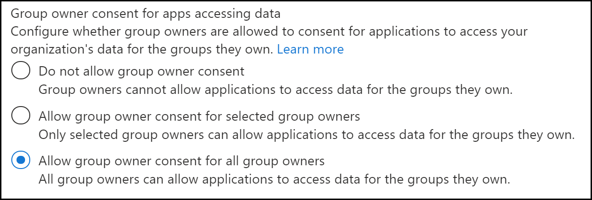

# <a name="resource-specific-consent-rsc"></a>Согласие на определенный ресурс (RSC)

Согласие для конкретного ресурса (RSC) — это интеграция Microsoft Teams и API microsoft Graph, которая позволяет приложению использовать конечные точки API для управления определенными группами в организации. Модель разрешений, определенных для ресурсов( RSC), позволяет владельцам команд предоставлять согласие для приложения на доступ и/или изменение данных группы.  Детальное, Teams, RSC-разрешения определяют, что приложение может сделать в определенной группе:

## <a name="resource-specific-permissions"></a>Разрешения, определенные для ресурсов

|Разрешение приложения| Действие |
| ----- | ----- |
|TeamSettings.Read.Group | Получите параметры для этой группы.|
|TeamSettings.ReadWrite.Group|Обновление параметров для команды.|
|ChannelSettings.Read.Group|Получите имена каналов, описания каналов и параметры канала для этой группы.|
|ChannelSettings.ReadWrite.Group|Обновление имен каналов, описаний каналов и параметров канала для этой группы.|
|Channel.Create.Group|Создание каналов в этой команде.|
|Channel.Delete.Group|Удаление каналов в этой группе.|
|ChannelMessage.Read.Group |Получите сообщения канала этой группы.|
|TeamsAppInstallation.Read.Group|Получите список установленных приложений этой группы.|
|TeamsTab.Read.Group|Получите список вкладок этой группы.|
|TeamsTab.Create.Group|Создание вкладок в этой команде.|
|TeamsTab.ReadWrite.Group|Обновление вкладок этой команды.|
|TeamsTab.Delete.Group|Удаление вкладок этой команды.|
|TeamMember.Read.Group|Получите членов этой группы.|

>[!NOTE]
>Разрешения на использование ресурсов доступны только Teams приложениям, установленным на клиенте Teams и в настоящее время не являются частью Azure Active Directory портала.

## <a name="enable-resource-specific-consent-in-your-application"></a>Включить в приложении согласие, определенное для ресурсов

Действия для включения RSC в приложении следующие:

1. [Настройка параметров согласия владельца группы на портале Azure Active Directory.](#configure-group-owner-consent-settings-in-the-azure-ad-portal)
1. [Зарегистрируйте свое приложение платформа удостоверений Майкрософт с помощью портала Azure AD.](#register-your-app-with-microsoft-identity-platform-via-the-azure-ad-portal)
1. [Просмотрите разрешения приложений на портале Azure AD.](#review-your-application-permissions-in-the-azure-ad-portal)
1. [Получение маркера доступа с платформы Microsoft Identity.](#obtain-an-access-token-from-the-microsoft-identity-platform)
1. [Обновление манифеста Teams приложения](#update-your-teams-app-manifest).
1. [Установите приложение непосредственно в Teams.](#sideload-your-app-in-teams)
1. [Проверьте приложение для дополнительных разрешений RSC](#check-your-app-for-added-rsc-permissions).

## <a name="configure-group-owner-consent-settings-in-the-azure-ad-portal"></a>Настройка параметров согласия владельца группы на портале Azure AD

Вы можете включить или отключить согласие владельца [группы](/azure/active-directory/manage-apps/configure-user-consent-groups?tabs=azure-portal) непосредственно на портале Azure:

> [!div class="checklist"]
>
>- Во входе на [портал Azure](https://portal.azure.com) в качестве [глобального администратора или администратора компании.](/azure/active-directory/users-groups-roles/directory-assign-admin-roles.md#global-administrator--company-administrator)  
 > - [Выберите](https://portal.azure.com/#blade/Microsoft_AAD_IAM/ConsentPoliciesMenuBlade/UserSettings) **Azure Active Directory**  =>  **Enterprise приложения** Consent и  =>  **permissions** User consent  =>  **settings.**
> - Включить, отключить или ограничить согласие пользователя с согласия владельца группы с меткой управления для доступа к данным **приложений** (по умолчанию разрешается согласие владельца группы для всех **владельцев групп).** Чтобы владелец группы устанавливал приложение с помощью RSC, для этого пользователя необходимо включить согласие владельца группы.



Чтобы включить или отключить согласие владельца группы с помощью PowerShell, выполните действия, описанные в Настройка согласия владельца группы [с помощью PowerShell.](/azure/active-directory/manage-apps/configure-user-consent-groups?tabs=azure-powershell)

## <a name="register-your-app-with-microsoft-identity-platform-via-the-azure-ad-portal"></a>Регистрация приложения с помощью платформа удостоверений Майкрософт на портале Azure AD

Портал Azure Active Directory предоставляет центральную платформу для регистрации и настройки приложений. Ваше приложение должно быть зарегистрировано на портале Azure AD, чтобы интегрироваться с платформа удостоверений Майкрософт и вызвать API Graph Microsoft. Дополнительные сведения [см. в приложении Register with the платформа удостоверений Майкрософт.](/graph/auth-register-app-v2)

>[!WARNING]
>Не регистрируйте несколько Teams приложений в один и тот же id приложения Azure AD. ID приложения должен быть уникальным для каждого приложения. Попытки установить несколько приложений в один и тот же id приложения не удастся.

## <a name="review-your-application-permissions-in-the-azure-ad-portal"></a>Просмотр разрешений приложения на портале Azure AD

Перейдите на **страницу**  =>  **регистрации домашнего приложения** и выберите приложение RSC. Выберите **разрешения API** из левой панели nav и изучите список настроенных разрешений для приложения. Если ваше приложение будет только делать вызовы API Graph RSC, удалите все разрешения на этой странице. Если ваше приложение также будет звонить не RSC, храните эти разрешения по мере необходимости.

>[!IMPORTANT]
>Портал Azure AD не может использоваться для запроса разрешений RSC. Разрешения RSC в настоящее время являются исключительными для Teams приложений, установленных в клиенте Teams и объявляются в файле манифеста приложения (JSON).

## <a name="obtain-an-access-token-from-the-microsoft-identity-platform"></a>Получение маркера доступа из платформа удостоверений Майкрософт

Чтобы сделать Graph API, необходимо получить маркер доступа для приложения с платформы удостоверений. Прежде чем приложение сможет получить маркер из платформа удостоверений Майкрософт, его необходимо зарегистрировать на портале Azure AD. Маркер доступа содержит сведения о приложении и его разрешениях на доступ к ресурсам и API, доступным через Microsoft Graph.

Для получения маркера доступа с платформы удостоверений необходимо иметь следующие значения из процесса регистрации Azure AD:

- ID **приложения,** присвоенный порталом регистрации приложений. Если приложение поддерживает один вход (SSO), необходимо использовать тот же ID приложения для приложения и SSO.
- Секрет **клиента или пароль** или пара ключей общего и частного доступа **(сертификат).** Это необязательно для нативных приложений;
- URI **перенаправления** (или URL-адрес ответа) для вашего приложения для получения ответов из Azure AD.

 *См.* [статью Получить](/graph/auth-v2-user?view=graph-rest-1.0#3-get-a-token&preserve-view=true) доступ от имени пользователя и [получить доступ без пользователя](/graph/auth-v2-service)

## <a name="update-your-teams-app-manifest"></a>Обновление манифеста Teams приложения

Разрешения RSC объявляются в файле манифеста приложения (JSON).  Добавьте ключ [webApplicationInfo](../../resources/schema/manifest-schema.md#webapplicationinfo) в манифест приложения со следующими значениями:

> [!div class="checklist"]
>
> - **id** — ваш id приложения Azure AD. Дополнительные сведения см. в сайте [Регистрация приложения на портале Azure AD.](resource-specific-consent.md#register-your-app-with-microsoft-identity-platform-via-the-azure-ad-portal)
> - **ресурс**  — любая строка. Это поле не имеет операции в RSC, но должно быть добавлено и иметь значение, чтобы избежать ответа на ошибку; любая строка будет делать.
> - **разрешения приложения** — разрешения RSC для вашего приложения. Дополнительные сведения см. [в специальном ресурсе Permissions.](resource-specific-consent.md#resource-specific-permissions)

>
>[!IMPORTANT]
> Разрешения не RSC хранятся на портале Azure. Не добавляйте их в манифест приложения.
>

```json
"webApplicationInfo": {
    "id": "XXxxXXXXX-XxXX-xXXX-XXxx-XXXXXXXxxxXX",
    "resource": "https://RscBasedStoreApp",
    "applicationPermissions": [
      "TeamSettings.Read.Group",
      "ChannelMessage.Read.Group",
      "TeamSettings.Edit.Group",
      "ChannelSettings.ReadWrite.Group",
      "Channel.Create.Group",
      "Channel.Delete.Group",
      "TeamsApp.Read.Group",
      "TeamsTab.Read.Group",
      "TeamsTab.Create.Group",
      "TeamsTab.ReadWrite.Group",
      "TeamsTab.Delete.Group",
      "Member.Read.Group",
      "Owner.Read.Group"
    ]
  }
```

## <a name="sideload-your-app-in-teams"></a>Sideload ваше приложение в Teams

Если администратор Teams позволяет настраивать загрузки приложений, [](~/concepts/deploy-and-publish/apps-upload.md) вы можете загрузить приложение непосредственно в определенную группу.

## <a name="check-your-app-for-added-rsc-permissions"></a>Проверьте приложение на дополнительные разрешения RSC

>[!IMPORTANT]
>Разрешения RSC не приписываются пользователю. Вызовы сделаны с разрешениями приложения, а не с делегированием разрешений пользователя. Таким образом, приложению может быть разрешено выполнять действия, которые не могут выполняться пользователем, например создание канала или удаление вкладки. Перед вызовами API RSC следует просмотреть намерения владельца группы по вашему делу использования. Дополнительные сведения [см. в Microsoft Teams API.](/graph/teams-concept-overview)

После установки приложения в команду можно использовать [Graph Explorer](https://developer.microsoft.com/graph/graph-explorer) для просмотра разрешений, предоставленных приложению в команде:

> [!div class="checklist"]
>
>- Получите **группуId** группы из Teams клиента.
> - В клиенте Teams выберите **Teams** из левого левого панели nav.
> - Выберите команду, в которой установлено приложение из выпадаемого меню.
> - Выберите **значок Дополнительные** параметры (&#8943;).
> - Выберите **Получить ссылку на команду**.
> - Скопируйте и сохраните **значение groupId** из строки.
> - Войдите **в Graph Explorer**.
> - Вызов **GET на** следующую конечную точку: `https://graph.microsoft.com/beta/groups/{teamGroupId}/permissionGrants` . Поле clientAppId в ответе будет соедино с приложением, указанным в манифесте Teams приложения.
  

## <a name="code-sample"></a>Пример кода
| **Пример имени** | **Описание** | **.NET** |**Node.js** |
|-----------------|-----------------|----------------|----------------|
| Конкретное согласие ресурса (RSC) | Используйте RSC для вызова Graph API. | [View](https://github.com/OfficeDev/Microsoft-Teams-Samples/tree/main/samples/graph-rsc/csharp)|[View](https://github.com/OfficeDev/Microsoft-Teams-Samples/tree/main/samples/graph-rsc/nodeJs)|


## <a name="see-also"></a>См. также
 
* [Тестирование разрешений на согласие для определенных ресурсов в Teams](test-resource-specific-consent.md)
* [Согласие на определенные ресурсы в Microsoft Teams для администраторов](/MicrosoftTeams/resource-specific-consent)


