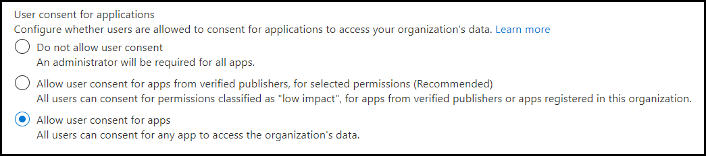
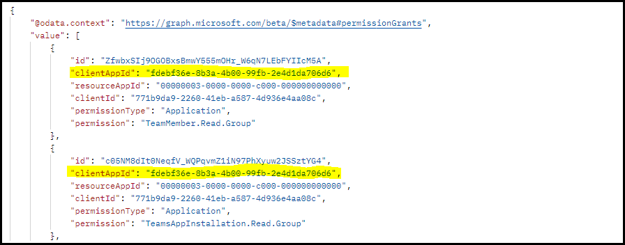
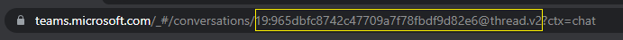
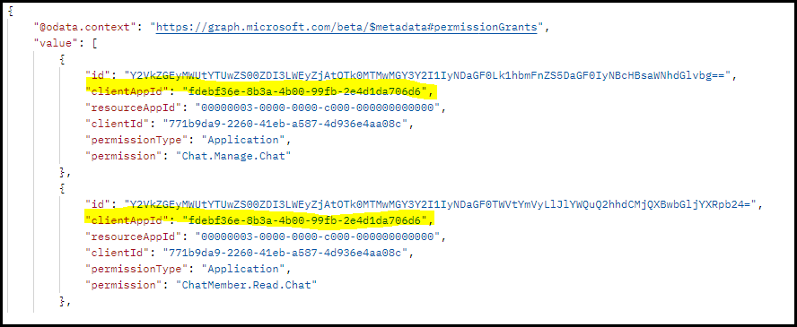

# <a name="resource-specific-consent"></a>Согласие для определенных ресурсов

> [!NOTE]
> Согласие на доступ к области чата с конкретными ресурсами доступно только для [предварительного просмотра общедоступных](../../resources/dev-preview/developer-preview-intro.md) разработчиков.

Согласие для конкретного ресурса (RSC) — это интеграция Microsoft Teams и microsoft Graph API, которая позволяет приложению использовать конечные точки API для управления определенными ресурсами, группами или чатами, в организации. Модель разрешений RSC позволяет владельцам команд  и владельцам чатов предоставлять согласие приложению на доступ и изменение данных группы и данных чата соответственно.

**Примечание:** Если в чате есть связанные с ним собрания или вызовы, соответствующие разрешения RSC применяются и к этим ресурсам.

## <a name="resource-specific-permissions"></a>Разрешения, определенные для ресурсов

Разрешения RSC, Teams, определяют, что приложение может сделать в определенном ресурсе.

### <a name="resource-specific-permissions-for-a-team"></a>Разрешения на использование ресурсов для группы

|Разрешение приложения| Действие |
| ----- | ----- |
|TeamSettings.Read.Group | Получите параметры этой группы.|
|TeamSettings.ReadWrite.Group|Обновление параметров этой группы.|
|ChannelSettings.Read.Group|Получите имена каналов этой группы, описания каналов и параметры канала.|
|ChannelSettings.ReadWrite.Group|Обновим имена каналов этой группы, описания каналов и параметры канала.|
|Channel.Create.Group|Создание каналов в этой команде. |
|Channel.Delete.Group|Удаление каналов в этой группе. |
|ChannelMessage.Read.Group |Получите сообщения канала этой группы. |
|TeamsAppInstallation.Read.Group|Получите список установленных приложений этой группы.|
|TeamsTab.Read.Group|Получите список вкладок этой группы.|
|TeamsTab.Create.Group|Создание вкладок в этой команде. |
|TeamsTab.ReadWrite.Group|Обновление вкладок этой команды. |
|TeamsTab.Delete.Group|Удаление вкладок этой команды. |
|TeamMember.Read.Group|Получите членов этой группы. |
|TeamsActivity.Send.Group|Создание новых уведомлений в каналах действий пользователей этой группы. |

Дополнительные сведения см. [в дополнительных сведениях о разрешениях, определенных ресурсами группы](/graph/permissions-reference#teams-resource-specific-consent-permissions).

### <a name="resource-specific-permissions-for-a-chat"></a>Разрешения на доступ к ресурсам для чата

В следующей таблице вы можете получить разрешения на доступ к ресурсам для чата:

|Разрешение приложения| Действие |
| ----- | ----- |
| ChatSettings.Read.Chat         | Получите параметры этого чата.                                    |
| ChatSettings.ReadWrite.Chat    | Обновление параметров этого чата.                          |
| ChatMessage.Read.Chat          | Получите сообщения этого чата.                                    |
| ChatMember.Read.Chat           | Получите участников этого чата.                                     |
| Chat.Manage.Chat               | Управление чатом.                                             |
| TeamsTab.Read.Chat             | Получите вкладки этого чата.                                        |
| TeamsTab.Create.Chat           | Создание вкладок в чате.                                     |
| TeamsTab.Delete.Chat           | Удаление вкладок чата.                                      |
| TeamsTab.ReadWrite.Chat        | Управление вкладками чата.                                      |
| TeamsAppInstallation.Read.Chat | Получите, какие приложения установлены в этом чате.                   |
| OnlineMeeting.ReadBasic.Chat   | Ознакомьтесь с основными свойствами, такими как имя, расписание, организатор, ссылка на соединение и уведомления о встрече, связанной с этим чатом. |
| Calls.AccessMedia.Chat         | Доступ к мультимедийным потокам в звонках, связанных с этим чатом или собранием.                                    |
| Calls.JoinGroupCalls.Chat         | Присоединение к звонкам, связанным с этим чатом или собранием.                                    |
| TeamsActivity.Send.Chat         | Создание новых уведомлений в каналах активности пользователей в этом чате. |

Дополнительные сведения см. в [специальном разрешении](/graph/permissions-reference#chat-resource-specific-consent-permissions) на доступ к ресурсам чата.

> [!NOTE]
> Разрешения на использование ресурсов доступны только Teams приложениям, установленным на клиенте Teams и в настоящее время не являются частью портала Azure Active Directory (AAD).

## <a name="enable-rsc-in-your-application"></a>Включить RSC в приложении

1. [Настройка параметров согласия на портале Azure AD](#configure-consent-settings-in-the-azure-ad-portal).
    1. [Настройка параметров согласия владельца группы для RSC в команде](#configure-group-owner-consent-settings-for-rsc-in-a-team).
    1. [Настройка параметров согласия пользователя для RSC в чате](#configure-user-consent-settings-for-rsc-in-a-chat).
1. [Зарегистрируйте свое приложение платформа удостоверений Майкрософт с помощью портала Azure AD](#register-your-app-with-microsoft-identity-platform-using-the-azure-ad-portal).
1. [Просмотрите разрешения приложений на портале Azure AD](#review-your-application-permissions-in-the-azure-ad-portal).
1. [Получение маркера доступа с платформы удостоверений](#obtain-an-access-token-from-the-microsoft-identity-platform).
1. [Обновите манифест Teams приложения](#update-your-teams-app-manifest).
1. [Установите приложение непосредственно в Teams](#sideload-your-app-in-teams).
1. [Проверьте приложение на дополнительные разрешения RSC](#check-your-app-for-added-rsc-permissions).
    1. [Проверьте приложение на дополнительные разрешения RSC в команде](#check-your-app-for-added-rsc-permissions-in-a-team).
    1. [Проверьте приложение на дополнительные разрешения RSC в чате](#check-your-app-for-added-rsc-permissions-in-a-chat).

## <a name="configure-consent-settings-in-the-azure-ad-portal"></a>Настройка параметров согласия на портале Azure AD

### <a name="configure-group-owner-consent-settings-for-rsc-in-a-team"></a>Настройка параметров согласия владельца группы для RSC в команде

Вы можете включить или отключить [согласие](/azure/active-directory/manage-apps/configure-user-consent-groups?tabs=azure-portal) владельца группы непосредственно на Microsoft Azure портале:

1. Во входе на [портал Azure](https://portal.azure.com) в качестве [глобального администратора или администратора компании](/azure/active-directory/roles/permissions-reference#global-administrator&preserve-view=true).
1. Выберите **Azure Active Directory** >  **Enterprise applicationsConsent** >  **и permissionsUser** > [**.**](https://portal.azure.com/#blade/Microsoft_AAD_IAM/ConsentPoliciesMenuBlade/UserSettings)
1. Включить, отключить или ограничить согласие пользователя с согласия владельца группы с меткой управления **для доступа к данным приложений**. По умолчанию **разрешается согласие владельца группы для всех владельцев групп**. Чтобы владелец группы устанавливал приложение с помощью RSC, для этого пользователя необходимо включить согласие владельца группы.

    

Кроме того, вы можете включить или отключить согласие владельца группы с помощью PowerShell, следуйте шагам, описанным в настройке согласия владельца группы [с помощью PowerShell](/azure/active-directory/manage-apps/configure-user-consent-groups?tabs=azure-powershell).

### <a name="configure-user-consent-settings-for-rsc-in-a-chat"></a>Настройка параметров согласия пользователя для RSC в чате

Вы можете включить или отключить [согласие пользователя непосредственно](/azure/active-directory/manage-apps/configure-user-consent?tabs=azure-portal) на портале Azure:

1. Во входе на [портал Azure](https://portal.azure.com) в качестве [глобального администратора или администратора компании](/azure/active-directory/roles/permissions-reference#global-administrator&preserve-view=true).
1. Выберите **Azure Active Directory** >  **Enterprise applicationsConsent** >  **и permissionsUser** > [**.**](https://portal.azure.com/#blade/Microsoft_AAD_IAM/ConsentPoliciesMenuBlade/UserSettings)
1. Включить, отключить или ограничить согласие пользователя с разрешением пользователя с меткой управления **для приложений**. По умолчанию **разрешается согласие пользователя для приложений**. Чтобы участник чата устанавливал приложение с помощью RSC, для этого пользователя необходимо включить согласие пользователя.

    

Кроме того, вы можете включить или отключить согласие пользователя с помощью PowerShell, следуйте шагам, описанным в настройке согласия пользователя [с помощью PowerShell](/azure/active-directory/manage-apps/configure-user-consent?tabs=azure-powershell).

## <a name="register-your-app-with-microsoft-identity-platform-using-the-azure-ad-portal"></a>Регистрация приложения с помощью платформа удостоверений Майкрософт с помощью портала Azure AD

Портал Azure AD предоставляет центральную платформу для регистрации и настройки приложений. Ваше приложение должно быть зарегистрировано на портале Azure AD для интеграции с платформой удостоверений и вызова API microsoft Graph API. Дополнительные сведения см. [в статью Регистрация приложения с платформой удостоверений](/graph/auth-register-app-v2).

> [!WARNING]
> ID приложения Azure AD не должен быть общим для нескольких Teams приложений. Должно быть сопоставление 1:1 между приложением Teams и приложением Azure AD. Попытки установить несколько Teams приложений, связанных с одинаковым ИД приложения Azure AD, могут привести к сбоям в установке или запуске.

## <a name="review-your-application-permissions-in-the-azure-ad-portal"></a>Просмотр разрешений приложения на портале Azure AD

1. Перейдите на **страницу регистрации HomeApp** >  и выберите приложение RSC.
1. Выберите **разрешения API** с левой области и перейдите по списку настроенных разрешений **для вашего** приложения. Если приложение делает вызовы API Graph RSC, удалите все разрешения на этой странице. Если ваше приложение также вызывает не RSC, храните эти разрешения по мере необходимости.

> [!IMPORTANT]
> Портал Azure AD не может использоваться для запроса разрешений RSC. Разрешения RSC в настоящее время являются исключительными для Teams приложений, установленных в клиенте Teams и объявляются в файле манифеста Teams приложения (JSON).

## <a name="obtain-an-access-token-from-the-microsoft-identity-platform"></a>Получение маркера доступа из платформа удостоверений Майкрософт

Чтобы Graph API, необходимо получить маркер доступа для приложения с платформы удостоверений. Прежде чем приложение сможет получить маркер с платформы удостоверений, его необходимо зарегистрировать на портале Azure AD. Маркер доступа содержит сведения о приложении и его разрешениях на доступ к ресурсам и API, доступным через Microsoft Graph.

Для получения маркера доступа с платформы удостоверений необходимо иметь следующие значения из процесса регистрации Azure AD:

* **ID приложения**, присвоенный порталом регистрации приложений. Если приложение поддерживает один вход (SSO), необходимо использовать тот же ИД приложения для приложения и SSO.
* Секрет **клиента или пароль** или пара ключей общего или частного доступа, которая является **сертификатом**. Это необязательно для нативных приложений;
* **URL-адрес URI** перенаправления или ответ для приложения для получения ответов из Azure AD.

Дополнительные сведения см. [в статью Получить](/graph/auth-v2-user?view=graph-rest-1.0#3-get-a-token&preserve-view=true) доступ от имени пользователя и [получить доступ без пользователя](/graph/auth-v2-service).

## <a name="update-your-teams-app-manifest"></a>Обновление манифеста Teams приложения

Разрешения RSC объявляются в файле JSON манифеста приложения.

> [!IMPORTANT]
> Разрешения не RSC хранятся на портале Azure. Не добавляйте их в манифест приложения.

### <a name="manifest-changes-for-resource-specific-consent"></a>Манифест изменений для согласия, определенного для ресурсов

<br>

<details>

<summary><b>Разрешения RSC для манифеста приложения версии 1.12</b></summary>

Добавьте ключ [webApplicationInfo](../../resources/schema/manifest-schema.md#webapplicationinfo) в манифест приложения со следующими значениями:

|Имя| Тип | Описание|
|---|---|---|
|`id` |String |ID приложения Azure AD. Дополнительные сведения см. в [приложении зарегистрировать на портале Azure AD](resource-specific-consent.md#register-your-app-with-microsoft-identity-platform-using-the-azure-ad-portal).|
|`resource`|String| Это поле не имеет операции в RSC, но должно быть добавлено и иметь значение, чтобы избежать ответа на ошибку; любая строка будет делать.|

Укажите разрешения, необходимые приложению.

|Имя| Тип | Описание|
|---|---|---|
|`authorization`|Object|Список разрешений, необходимых приложению для работы. Дополнительные сведения см. в [placeholder for link-authorization in manifest]

Пример RSC в команде

```json
"webApplicationInfo": {
    "id": "XXxxXXXXX-XxXX-xXXX-XXxx-XXXXXXXxxxXX",
    "resource": "https://RscBasedStoreApp"
    },
"authorization": {
    "permissions": {
        "resourceSpecific": [
            {
                "name": "TeamSettings.Read.Group",
                "type": "Application"
            },
            {
                "name": "TeamSettings.ReadWrite.Group",
                "type": "Application"
            },
            {
                "name": "ChannelSettings.Read.Group",
                "type": "Application"
            },
            {
                "name": "ChannelSettings.ReadWrite.Group",
                "type": "Application"
            },
            {
                "name": "Channel.Create.Group",
                "type": "Application"
            },
            {
                "name": "Channel.Delete.Group",
                "type": "Application"
            },
            {
                "name": "ChannelMessage.Read.Group",
                "type": "Application"
            },
            {
                "name": "TeamsAppInstallation.Read.Group",
                "type": "Application"
            },
            {
                "name": "TeamsTab.Read.Group",
                "type": "Application"
            },
            {
                "name": "TeamsTab.Create.Group",
                "type": "Application"
            },
            {
                "name": "TeamsTab.ReadWrite.Group",
                "type": "Application"
            },
            {
                "name": "TeamsTab.Delete.Group",
                "type": "Application"
            },
            {
                "name": "TeamMember.Read.Group",
                "type": "Application"
            },
            {
                "name": "TeamsActivity.Send.Group",
                "type": "Application"
            }
        ]    
    }
}
```

Пример RSC в чате

```json
"webApplicationInfo": {
    "id": "XXxxXXXXX-XxXX-xXXX-XXxx-XXXXXXXxxxXX",
    "resource": "https://RscBasedStoreApp"
    },
"authorization": {
    "permissions": {
        "resourceSpecific": [
            {
                "name": "ChatSettings.Read.Chat",
                "type": "Application"
            },
            {
                "name": "ChatSettings.ReadWrite.Chat",
                "type": "Application"
            },
            {
                "name": "ChatMessage.Read.Chat",
                "type": "Application"
            },
            {
                "name": "ChatMember.Read.Chat",
                "type": "Application"
            },
            {
                "name": "Chat.Manage.Chat",
                "type": "Application"
            },
            {
                "name": "TeamsTab.Read.Chat",
                "type": "Application"
            },
            {
                "name": "TeamsTab.Create.Chat",
                "type": "Application"
            },
            {
                "name": "TeamsTab.Delete.Chat",
                "type": "Application"
            },
            {
                "name": "TeamsTab.ReadWrite.Chat",
                "type": "Application"
            },
            {
                "name": "TeamsAppInstallation.Read.Chat",
                "type": "Application"
            },
            {
                "name": "OnlineMeeting.ReadBasic.Chat",
                "type": "Application"
            },
            {
                "name": "Calls.AccessMedia.Chat",
                "type": "Application"
            },
            {
                "name": "Calls.JoinGroupCalls.Chat",
                "type": "Application"
            },
            {
                "name": "TeamsActivity.Send.Chat",
                "type": "Application"
            }
        ]    
    }
}
```

> [!NOTE]
> Если приложение предназначено для поддержки установки в командных и чатных сферах, в одном манифесте могут быть указаны разрешения как группы, так и чата `authorization`.

<br>

</details>

<br>

<details>

<summary><b>Разрешения RSC для манифеста приложения версии 1.11 или более ранней версии</b></summary>

Добавьте ключ [webApplicationInfo](../../resources/schema/manifest-schema.md#webapplicationinfo) в манифест приложения со следующими значениями:

|Имя| Тип | Описание|
|---|---|---|
|`id` |String |ID приложения Azure AD. Дополнительные сведения см. в [приложении зарегистрировать на портале Azure AD](resource-specific-consent.md#register-your-app-with-microsoft-identity-platform-using-the-azure-ad-portal).|
|`resource`|String| Это поле не имеет операции в RSC, но должно быть добавлено и иметь значение, чтобы избежать ответа на ошибку; любая строка будет делать.|
|`applicationPermissions`|Массив строк|Разрешения RSC для вашего приложения. Дополнительные сведения см. [в дополнительных сведениях о разрешениях, определенных для ресурсов](resource-specific-consent.md#resource-specific-permissions).|

Пример RSC в команде

```json
"webApplicationInfo": {
    "id": "XXxxXXXXX-XxXX-xXXX-XXxx-XXXXXXXxxxXX",
    "resource": "https://RscBasedStoreApp",
    "applicationPermissions": [
        "TeamSettings.Read.Group",
        "TeamSettings.ReadWrite.Group",
        "ChannelSettings.Read.Group",
        "ChannelSettings.ReadWrite.Group",
        "Channel.Create.Group",
        "Channel.Delete.Group",
        "ChannelMessage.Read.Group",
        "TeamsAppInstallation.Read.Group",
        "TeamsTab.Read.Group",
        "TeamsTab.Create.Group",
        "TeamsTab.ReadWrite.Group",
        "TeamsTab.Delete.Group",
        "TeamMember.Read.Group",
        "TeamsActivity.Send.Group"
    ]
  }
```

Пример RSC в чате

```json
"webApplicationInfo": {
    "id": "XXxxXXXXX-XxXX-xXXX-XXxx-XXXXXXXxxxXX",
    "resource": "https://RscBasedStoreApp",
    "applicationPermissions": [
        "ChatSettings.Read.Chat",
        "ChatSettings.ReadWrite.Chat",
        "ChatMessage.Read.Chat",
        "ChatMember.Read.Chat",
        "Chat.Manage.Chat",
        "TeamsTab.Read.Chat",
        "TeamsTab.Create.Chat",
        "TeamsTab.Delete.Chat",
        "TeamsTab.ReadWrite.Chat",
        "TeamsAppInstallation.Read.Chat",
        "OnlineMeeting.ReadBasic.Chat",
        "Calls.AccessMedia.Chat",
        "Calls.JoinGroupCalls.Chat",
        "TeamsActivity.Send.Chat"
    ]
  }
```

> [!NOTE]
> Если приложение предназначено для поддержки установки в командных и чатных сферах, в одном манифесте могут быть указаны разрешения как группы, так и чата `applicationPermissions`.

<br>

</details>

## <a name="sideload-your-app-in-teams"></a>Загрузка неопубликованного приложения в Teams

Если администратор Teams позволяет настраивать загрузки приложений, вы можете загрузить приложение непосредственно [](~/concepts/deploy-and-publish/apps-upload.md) в определенную группу или чат.

## <a name="check-your-app-for-added-rsc-permissions"></a>Проверьте приложение на дополнительные разрешения RSC

> [!IMPORTANT]
> Разрешения RSC не приписываются пользователю. Вызовы сделаны с разрешениями приложения, а не с делегированием разрешений пользователя. Приложению может быть разрешено выполнять действия, которые пользователь не может выполнять, например удаление вкладки. Перед вызовами API RSC необходимо просмотреть намерения владельца группы или владельца чата. Дополнительные сведения см[. в Microsoft Teams API.](/graph/teams-concept-overview)

После установки приложения на ресурс можно использовать [Graph Explorer](https://developer.microsoft.com/graph/graph-explorer) для просмотра разрешений, предоставленных приложению на ресурсе.

### <a name="check-your-app-for-added-rsc-permissions-in-a-team"></a>Проверьте приложение на дополнительные разрешения RSC в команде

1. Получите группуId группы **из** Teams.
1. В Teams выберите **Teams** левой области.
1. Выберите команду, в которой будет установлено приложение.
1. Выберите эллипсы &#x25CF;&#x25CF;&#x25CF; для этой группы.
1. Выберите **Получить ссылку на команду** из меню отсев команды.
1. Скопируйте и сохраните **значение groupId** из ссылки на диалоговое окно **всплывающее** окно группы.
1. Вопишите в **Graph Explorer**.
1. Сделайте **вызов GET** в эту конечную точку: `https://graph.microsoft.com/beta/teams/{teamGroupId}/permissionGrants`. Поле `clientAppId` в ответе будет соедино `webApplicationInfo.id` с указанным в манифесте Teams приложения.

    

Дополнительные сведения о том, как получить сведения о приложениях, установленных в определенной группе, см. в материале "Имена и другие сведения о приложениях, установленных [в указанной группе"](/graph/api/team-list-installedapps#example-2-get-the-names-and-other-details-of-installed-apps).

### <a name="check-your-app-for-added-rsc-permissions-in-a-chat"></a>Проверьте приложение на дополнительные разрешения RSC в чате

1. Получите ID потока чата из Teams *веб-клиента*.
1. В веб Teams клиенте выберите **Чат** с левой области.
1. Выберите чат, в котором установлено приложение из меню отсев.
1. Скопируйте веб-URL-адрес и сохраните ID потока чата из строки.

    

1. Вопишите в **Graph Explorer**.
1. Вызов **GET на** следующую конечную точку: `https://graph.microsoft.com/beta/chats/{chatId}/permissionGrants`. Поле `clientAppId` в ответе будет соедино `webApplicationInfo.id` с указанным в манифесте Teams приложения.

    

Дополнительные сведения о том, как получить сведения о приложениях, установленных в определенном чате, см. в материале "Имена и другие сведения о приложениях, установленных в [указанном чате"](/graph/api/chat-list-installedapps#example-2-get-the-names-and-other-details-of-apps-installed-in-the-specified-chat).

## <a name="code-sample"></a>Пример кода

| **Название примера** | **Описание** | **.NET** |**Node.js** |
|-----------------|-----------------|----------------|----------------|
| Resource-Specific согласия (RSC) | Используйте RSC для вызова Graph API. | [View](https://github.com/OfficeDev/Microsoft-Teams-Samples/tree/main/samples/graph-rsc/csharp)|[Просмотр](https://github.com/OfficeDev/Microsoft-Teams-Samples/tree/main/samples/graph-rsc/nodeJs)|

## <a name="see-also"></a>Дополнительные ресурсы

* [Тестирование разрешений на согласие для определенных ресурсов в Teams](test-resource-specific-consent.md)
* [Согласие на определенные ресурсы в Microsoft Teams для администраторов](/MicrosoftTeams/resource-specific-consent)
