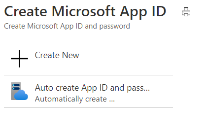

1. На [портале Azure](https://ms.portal.azure.com/#home) в разделе "Службы Azure" выберите **Создать ресурс**.In the [Azure portal](https://ms.portal.azure.com/#home), under Azure services, select **Create a resource**.
1. В поле поиска введите "бот".In the search box enter "bot". В раскрывающемся списке выберите **Регистрация каналов бота**.And in the drop-down list, select **Bot Channels Registration**.
1. Нажмите кнопку **Создать**.Select the **Create** button.
1. На вкладке **Регистрация канала бота** укажите необходимые сведения о боте.In the **Bot Channel Registration** blade, provide the requested information about your bot.
1. Оставьте поле **Конечная точка обмена сообщениями** пустым. Введите сюда необходимый URL-адрес после развертывания бота.Leave the **Messaging endpoint** box empty for now, you will enter the required URL after deploying the bot. На приведенном ниже рисунке показан пример параметров регистрации.The following picture shows an example of the registration settings:

    

1. Выберите **Идентификатор приложения Майкрософт и пароль** и нажмите **Создать**.Click **Microsoft App ID and password** and then **Create New**.

          

1. Щелкните ссылку **Создание идентификатора приложения на портале регистрации приложений**.Click **Create App ID in the App Registration Portal** link.

   
   
1. В появившемся окне **Регистрация приложения** щелкните вкладку **Новая регистрация** в левом верхнем углу.In the displayed **App registration** window, click the **New registration** tab in the upper left.
1. Введите имя приложения-бота, которое вы хотите зарегистрировать. В примере используется имя *BotTeamsAuth* (вам нужно выбрать свое уникальное имя).Enter the name of the bot application you are registering, we used *BotTeamsAuth* (you need to select your own unique name).
1. В разделе **Поддерживаемые типы учетных записей** выберите *Учетные записи в любом каталоге организации (любой каталог Azure AD — мультитенантный) и личные учетные записи Майкрософт (например, Skype, Xbox)*.For the **Supported account types** select *Accounts in any organizational directory (Any Azure AD directory - Multitenant) and personal Microsoft accounts (e.g. Skype, Xbox)*.
1. Нажмите кнопку **Зарегистрировать**.Click the **Register** button. После завершения Azure отобразит страницу для приложения *Общие сведения*.Once completed, Azure displays the *Overview* page for the application.
1. Скопируйте значение **идентификатора приложения (клиента)** и сохраните его в файле.Copy and save to a file the **Application (client) ID** value.
1. На панели слева щелкните **Сертификат и секреты**.In the left panel, click **Certificate and secrets**.
    1. В разделе *Секреты клиента* выберите **Новый секрет клиента**.Under *Client secrets*, click **New client secret**.
    1. Добавьте описание, чтобы отличать этот секрет от других секретов, которые могут вам понадобиться для создания этого приложения.Add a description to identify this secret from others you might need to create for this app.
    1. Задайте значение для параметра *Срок действия*.Set *Expires* to your selection.
    1. Нажмите **Добавить**.Click **Add**.
    1. Скопируйте секрет клиента и сохраните его в файле.Copy the client secret and save it to a file.
1. Вернитесь в окно **Регистрация канала бота** и вставьте значение *Идентификатора приложения* и *Секрета клиента* в поле **Идентификатор приложения Майкрософт** и **Пароль** соответственно.Go back to the **Bot Channel Registration** window and copy the *App ID* and the *Client secret* in the **Microsoft App ID** and **Password** boxes, respectively.
1. Нажмите **ОК**.Click **OK**.
1. Затем нажмите **Создать**.Finally, click **Create**.

После создания ресурса регистрации Azure он отобразится в списке группы ресурсов.After Azure has created the registration resource it will be included in the resource group list.  

После создания регистрации каналов бота необходимо включить канал Teams.Once your bot channels registration is created, you'll need to enable the Teams channel.

1. На [портале Azure](https://ms.portal.azure.com/#home) в разделе "Службы Azure" выберите **Регистрация канала бота**, который вы только что создали.In the [Azure portal](https://ms.portal.azure.com/#home), under Azure services, select the **Bot Channel Registration** you just created.
1. На панели слева щелкните **Каналы**.In the left panel, click **Channels**.
1. Выберите значок Microsoft Teams и нажмите **Сохранить**.Click the Microsoft Teams icon, then choose **Save**.
