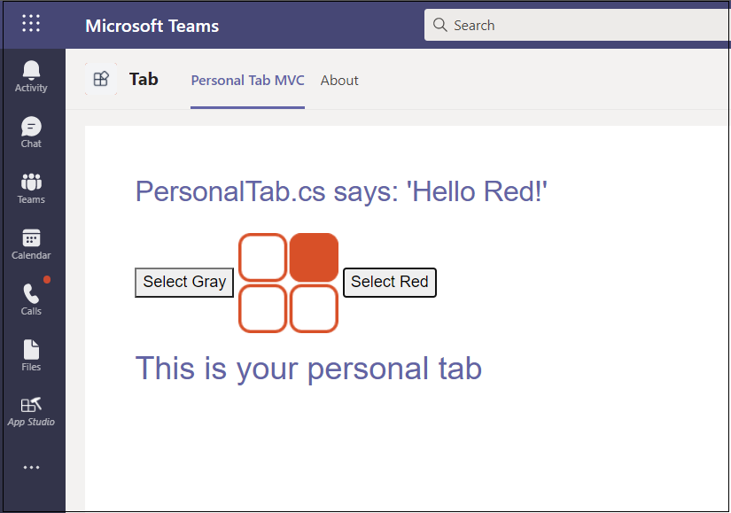

## <a name="upload-your-tab-with-app-studio"></a>Upload вкладку с Помощью App Studio

>[!NOTE]
> Мы используем **App Studio** для редактированияmanifest.js **файла** и отправки завершенного пакета в Teams. Вы также можете вручную **редактироватьmanifest.js.** Если это так, убедитесь, что вы создайте решение снова, чтобы создатьTab.zip **файл** для загрузки.

**Для загрузки вкладки в App Studio**

1. Перейдите Microsoft Teams. Если вы используете [веб-версию,](https://teams.microsoft.com) вы можете проверить исходный код с помощью средств разработчика [браузера.](~/tabs/how-to/developer-tools.md)

1. Перейдите **в App Studio и** выберите **вкладку Редактор Манифеста.**

1. Выберите **импорт существующего приложения в** **редакторе Манифеста,** чтобы приступить к обновлению пакета приложений для вкладки. Исходный код поставляется со своим частично полным манифестом. Имя вашего пакета приложений **tab.zip**. Он доступен по следующему пути:

    ```bash
    /bin/Debug/netcoreapp2.2/tab.zip
    ```

1. Upload **tab.zip** **App Studio**.

### <a name="update-your-app-package-with-manifest-editor"></a>Обновление пакета приложений с помощью редактора Manifest

После отправки пакета приложений в App Studio необходимо настроить его.

Выберите плитку для недавно импортируемой вкладки в правой панели приветствия редактора Манифеста.

В левой части редактора Манифеста имеется список действий, а справа — список свойств, которые должны иметь значения для каждого из этих действий. Большая часть сведений предоставлена вашими **manifest.js,** но есть поля, которые необходимо обновить.

#### <a name="details-app-details"></a>Сведения: сведения о приложении

В разделе **Сведения о приложении:**

1. В **статье Идентификация** выберите **Создание** для создания нового удостоверения приложения для вашего приложения.

1. По **сведениям разработчика,** **обновите веб-сайт** **url-адресом https ngrok.**

1. В **URL-адресах** приложений обнови заявление **конфиденциальности** и условия использования `https://<yourngrokurl>/privacy` **для** `https://<yourngrokurl>/tou`>.

#### <a name="capabilities-tabs"></a>Возможности: Вкладки

В разделе **Tabs:**

1. В **статье Добавить личную вкладку** выберите **Добавить**. Появляется всплывающее диалоговое окно.

1. Введите имя личной вкладки в **Name**.

1. Введите **ID объекта**.

1. Обновление **URL-адреса** контента `https://<yourngrokurl>/personalTab` с помощью .

    Оставьте **поле URL-адрес веб-сайта** пустым.

1. Нажмите **Сохранить**.

#### <a name="finish-domains-and-permissions"></a>Finish: Домены и разрешения

В разделе **Домены и** разрешения  домены из поля вкладок должны содержать URL-адрес ngrok без префикса `<yourngrokurl>.ngrok.io/` HTTPS.

##### <a name="finish-test-and-distribute"></a>Finish: Test and distribute

>[!IMPORTANT]
> Справа в **описании** см. следующее предупреждение:
>
> &#9888; массив **"validDomains" не может содержать сайт тоннелей...**
>
>Это предупреждение можно игнорировать при тестировании вкладки.

1. В разделе **Тест и распространение** выберите **Установите**.

1. В диалоговом окне всплывающее окно выберите **Добавить,** и вкладка отображается с двумя вариантами.

1. Из параметров на вкладке выберите **Выберите серый** или **выберите красный**. Вкладка отображается в соответствии с выбранным цветом.
 
    

## <a name="view-your-personal-tab"></a>Просмотр личной вкладки

1. В панели навигации, расположенной слева от Teams, выберите &#x25CF;&#x25CF;&#x25CF;. Показан список личных приложений.

1. Выберите вкладку из списка, чтобы просмотреть ее.
