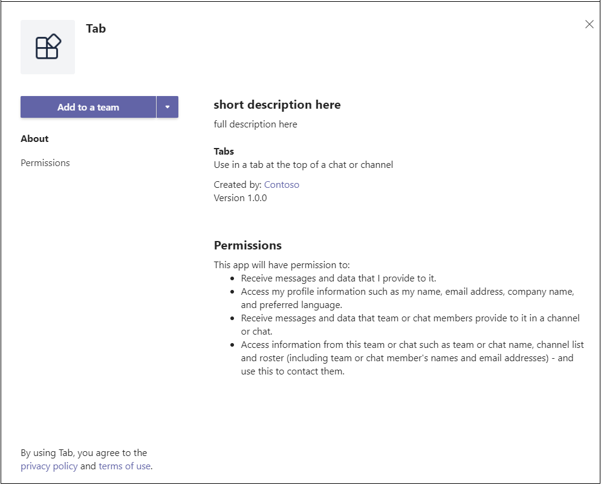

### <a name="_layoutcshtml"></a>_Layout.cshtml

Чтобы вкладка отображалась в Teams, необходимо включить Microsoft Teams **клиента JavaScript** и включить вызов после загрузки `microsoftTeams.initialize()` страницы. Это то, как ваша вкладка и Teams клиент:

Перейдите в **общую** папку, **откройте _Layout.cshtml** и добавьте в тег `<head>` следующее:

```html
<script src="https://ajax.aspnetcdn.com/ajax/jQuery/jquery-3.4.1.min.js"></script>
<script src="https://statics.teams.cdn.office.net/sdk/v1.6.0/js/MicrosoftTeams.min.js"></script>
```

>[!IMPORTANT]
> Не копируйте и не вделайте URL-адреса на этой странице, так как они могут `<script src="...">` не представлять последнюю версию. Чтобы получить последнюю версию SDK, всегда Microsoft Teams [API JavaScript](https://www.npmjs.com/package/@microsoft/teams-js).

### <a name="tabcshtml"></a>Tab.cshtml

**Обновление встроенного скрипта**

1. В Visual Studio откройте **Tab.cshtml** для обновления встроенного `<script>` .

1. В верхней части сценария позвоните `microsoftTeams.initialize()` .

1. Обновление `websiteUrl` `contentUrl` значений и значений в каждой функции с ПОМОЩЬЮ URL-адреса https ngrok на вкладке.

    Теперь код должен выглядеть следующим образом: **y8rCgT2b заменен** на URL-адрес ngrok:

    ```javascript
        microsoftTeams.initialize();
    
        let saveGray = () => {
            microsoftTeams.settings.registerOnSaveHandler(function (saveEvent) {
                microsoftTeams.settings.setSettings({
                    websiteUrl: `https://y8rCgT2b.ngrok.io`,
                    contentUrl: `https://y8rCgT2b.ngrok.io/gray/`,
                    entityId: "grayIconTab",
                    suggestedDisplayName: "MyNewTab"
                });
                saveEvent.notifySuccess();
            });
        }

        let saveRed = () => {
            microsoftTeams.settings.registerOnSaveHandler(function (saveEvent) {
                microsoftTeams.settings.setSettings({
                    websiteUrl: `https://y8rCgT2b.ngrok.io`,
                    contentUrl: `https://y8rCgT2b.ngrok.io/red/`,
                    entityId: "redIconTab",
                    suggestedDisplayName: "MyNewTab"
                });
                saveEvent.notifySuccess();
            });
        }
    ```

1. Обязательно сохраните обновленный **Tab.cshtml.**

## <a name="build-and-run-your-application"></a>Сборка и запуск приложения

В Visual Studio нажмите **кнопку F5** или выберите **Пуск** отладки из меню **отладки.** Убедитесь, что **ngrok** работает и работает должным образом, открыв браузер и переехав на страницу контента через URL-адрес https ngrok, который был представлен в окне командной подсказки.

> [!TIP]
> Необходимо, чтобы приложение было запущено как в Visual Studio, так и в ngrok. Если вам нужно перестать запускать приложение в Visual Studio работать над ней, продолжайте **работать ngrok**. После перезапуска в Visual Studio он будет продолжать прослушивать запрос приложения и возобновлять маршрутиза Visual Studio. Если вам придется перезапустить службу ngrok, она возвращает новый URL-адрес, и вам придется обновить приложение с помощью нового URL-адреса.

## <a name="upload-your-tab"></a>Upload вкладку

>[!Note]
> App Studio можно использовать для редактированияmanifest.js **файла** и отправки завершенного пакета в Teams. Вы также можете вручную редактировать **manifest.jsфайл,** если хотите. Если это так, обязательно создайте решение снова, чтобы создатьtab.zip **файл** для загрузки.

**Загрузка вкладки**

1. Перейдите Microsoft Teams. Если вы используете [веб-версию,](https://teams.microsoft.com) вы можете проверить исходный код с помощью средств разработчика [браузера.](~/tabs/how-to/developer-tools.md)

1. Перейдите **в App Studio и** выберите **вкладку Редактор Манифеста.**

1. Выберите **импорт существующего приложения в** редакторе Манифеста, чтобы приступить к обновлению пакета приложений для вкладки. Исходный код поставляется со своим частично полным манифестом. Имя вашего пакета приложений **tab.zip**. Он доступен здесь:

    ```bash
    /bin/Debug/netcoreapp2.2/tab.zip
    ```

1. Upload **tab.zip** App Studio.

### <a name="update-your-app-package-with-manifest-editor"></a>Обновление пакета приложений с помощью редактора Manifest

После отправки пакета приложений в App Studio необходимо завершить его настройку.

Выберите плитку для недавно импортируемой вкладки в правой панели приветствия редактора Манифеста.

В левой части редактора Манифеста имеется список действий, а справа — список свойств, которые должны иметь значения для каждого из этих действий. Большая часть сведений предоставлена вашими **manifest.js,** но есть несколько полей, которые необходимо обновить:

#### <a name="details-app-details"></a>Сведения: сведения о приложении

В разделе **Сведения о приложении:**

1. В **статье Идентификация** выберите **Создание** для замены удостоверения замещающего удостоверения на необходимый GUID для вкладки.

1. В **соответствии с сведениями разработчика** **обновите веб-сайт** **url-адресом https ngrok.**

1. В **URL-адресах** приложений обнови заявление **конфиденциальности** и условия использования `https://<yourngrokurl>/privacy` **для** `https://<yourngrokurl>/tou`>.

#### <a name="capabilities-tabs"></a>Возможности: Вкладки

В разделе **Tabs:**

1. В **вкладке Team** выберите **Добавить**.

1. В **всплывающее** окно вкладки "Команда" обнови **URL-адрес конфигурации** `https://<yourngrokurl>/tab` до .

1. Убедитесь, что конфигурация может **обновляться?**, **Командные** и **групповые** почтовые ящики чата выбраны и выберите **Сохранить**.

#### <a name="finish-domains-and-permissions"></a>Finish: Домены и разрешения

В разделе **Домены и**  разрешения домены с вкладок должны содержать URL-адрес ngrok без префикса `<yourngrokurl>.ngrok.io/` HTTPS.

#### <a name="finish-test-and-distribute"></a>Finish: Test and distribute

>[!IMPORTANT]
> Справа в **описании** см. следующее предупреждение:
>
> &#9888; массив **"validDomains"** не может содержать сайт тоннелей... "
>
> Это предупреждение можно игнорировать при тестировании вкладки.

1. В разделе **Тест и распространение** выберите **Установите**.

1. В диалоговом окне всплывающее окно выберите **Добавить** в команду или из выпадающее окно, выберите **Добавить в чат**.

1. Выберите команду или чат, где нужно отобразить вкладку, и выберите **Настройка вкладки.**

1. В следующем диалоговом окне всплывающее окно выберите **Выберите серый** или **выберите красный** цвет и выберите **Сохранить**.

1. Чтобы просмотреть вкладку, перейдите в команду, в которой установлена вкладка, и выберите ее из панели вкладок. Отображается страница, выбранная во время настройки.

    

