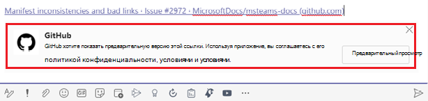

# Расширения для система обмена сообщениями

Расширения обмена сообщениями позволяют пользователям взаимодействовать с веб-службой с помощью кнопок и форм Microsoft Teams клиента. Они могут искать или инициировать действия во внешней системе из области композитного сообщения, командного окна или непосредственно из сообщения. Результаты этого взаимодействия можно отправить клиенту Microsoft Teams в виде богато отформатированной карты. В этом документе представлен обзор расширения обмена сообщениями, задач, выполняемых в различных сценариях, работы над расширением обмена сообщениями, команд действий и поиска и разгрузки ссылок.

На следующем изображении отображаются расположения, из которых вызываются расширения обмена сообщениями:

> [!NOTE]
> @mentioning расширения сообщений больше не поддерживаются в поле составить.

## Сценарии использования расширений обмена сообщениями

| Сценарий | Пример |
|:-----------------|:-----------------|
|Вы хотите, чтобы какая-то внешняя система для действий и результат действия были отправлены обратно в разговор.|Зарезервировать ресурс и разрешить каналу знать зарезервированный интервал времени.|
|Вы хотите найти что-то во внешней системе и поделиться результатами с беседой.|Поиск элемента работы в Azure DevOps и совместное его с группой в качестве адаптивной карты.|
|Вы хотите выполнить сложную задачу с несколькими шагами или большим количеством информации во внешней системе и поделиться результатами с беседой.|Создайте ошибку в системе отслеживания на основе сообщения Teams, назначьте эту ошибку Бобу и отправьте карту в поток беседы с подробными сведениями об ошибке.|

## Понимание работы расширений обмена сообщениями

Расширение обмена сообщениями состоит из веб-службы, на которой вы работаете, и манифеста приложения, который определяет, откуда вызывается веб-служба в клиенте Microsoft Teams клиента. Веб-служба воспользовалась схемой обмена сообщениями Bot Framework и протоколом безопасной связи, поэтому необходимо зарегистрировать веб-службу в качестве бота в bot Framework. 

> [!NOTE]
> Хотя веб-службу можно создавать вручную, используйте [bot Framework SDK](https://github.com/microsoft/botframework-sdk) для работы с протоколом.

В манифесте приложения для Microsoft Teams приложение одно расширение обмена сообщениями определяется с до десяти различными командами. Каждая команда определяет тип, например действие или поиск, а также расположения клиента, откуда он вызывается. Расположения ссылок — это область сообщений, командная планка и сообщение. При вызове веб-служба получает сообщение HTTPS с полезной нагрузкой JSON, включая всю соответствующую информацию. Отвечайте с помощью полезной нагрузки JSON, что позволяет Teams клиенту знать следующее взаимодействие, чтобы включить. 

## Типы команд расширения обмена сообщениями

Существует два типа команд расширения обмена сообщениями, команда действий и команда поиска. Тип команды расширения обмена сообщениями определяет элементы пользовательского интерфейса и потоки взаимодействия, доступные веб-службе. Для обоих типов команд доступны некоторые взаимодействия, например проверка подлинности и конфигурация.

### Команды действий

Команды действий используются, чтобы представить пользователям модальный всплывающий модуль для сбора или отображения сведений. Когда пользователь представляет форму, веб-служба отвечает, вставляя сообщение в беседу напрямую или вставляя сообщение в область составить сообщение. После этого пользователь может отправить сообщение. Для более сложных процессов можно сцепить несколько форм.

Команды действий запускаются из области составить сообщение, поле команды или из сообщения. При вызове команды из сообщения начальная полезной нагрузки JSON, отправленная боту, включает все сообщения, из которых она была вызвана. На следующем изображении отображается командный модуль командной задачи расширения обмена сообщениями: модуль командной задачи расширения 

### Команды поиска

Команды поиска позволяют пользователям искать информацию во внешней системе вручную через поле поиска или вставить ссылку на отслеживаемого домена в область составить сообщение и вставить результаты поиска в сообщение. В основном потоке команд поиска начальное сообщение вызова включает строку поиска, отправленную пользователем. Вы отвечаете со списком карт и предварительных просмотров карт. Клиент Teams отрисовку списка предварительных просмотров карт для пользователя. Когда пользователь выбирает карту из списка, полноразмерная карта вставляется в область составить сообщение.

Карточки запускаются из области составить сообщение или командное поле и не запускаются из сообщения. Их нельзя запускать из сообщения.
На следующем изображении отображается командный модуль командной задачи расширения обмена сообщениями:

> [!NOTE]
> Дополнительные сведения о картах см. [в том, что такое карточки.](../task-modules-and-cards/what-are-cards.md)

## Развертывание ссылки

Веб-служба вызывается, когда URL-адрес вклеен в области составить сообщение. Эта функция называется разгрузка ссылок. Вы можете подписаться, чтобы получить вызов, когда URL-адреса, содержащие определенный домен, вклеились в область составить сообщение. Веб-служба может "разверять" URL-адрес в подробную карту, предоставляя больше информации, чем стандартная карта предварительного просмотра веб-сайта. Вы можете добавить кнопки, чтобы пользователи могли немедленно принять меры, не покидая Microsoft Teams клиента.
На следующих изображениях отображается функция разгрузки ссылки при вклеии ссылки в расширении обмена сообщениями:
 

## Пример кода

| **Название примера** | **Описание** | **.NET** | **Node.js** | **Python** |
|------------|-------------|----------------|------------|
| Расширение обмена сообщениями с командами на основе действий | В этом примере показано, как создать расширение обмена сообщениями на основе действий. | [View](https://github.com/microsoft/BotBuilder-Samples/tree/master/samples/csharp_dotnetcore/51.teams-messaging-extensions-action) | [View](https://github.com/microsoft/BotBuilder-Samples/tree/master/samples/javascript_nodejs/51.teams-messaging-extensions-action) | [View](https://github.com/microsoft/BotBuilder-Samples/tree/main/samples/python/51.teams-messaging-extensions-action) |
| Расширение обмена сообщениями с командами на основе поиска | В этом примере показано, как создать расширение обмена сообщениями на основе поиска. | [View](https://github.com/microsoft/BotBuilder-Samples/tree/master/samples/csharp_dotnetcore/50.teams-messaging-extensions-search) | [View](https://github.com/microsoft/BotBuilder-Samples/tree/master/samples/javascript_nodejs/50.teams-messaging-extensions-search) | [Просмотр](https://github.com/microsoft/BotBuilder-Samples/tree/main/samples/python/50.teams-messaging-extension-search) |

## Дополнительные ресурсы

[Создание расширения для обмена сообщениями](../build-your-first-app/build-messaging-extension.md)

## Следующий этап

> [!div class="nextstepaction"]
> [Определение команды расширения обмена сообщениями действий](~/messaging-extensions/how-to/action-commands/define-action-command.md)

> [!div class="nextstepaction"]
> [Определение команды расширения обмена сообщениями поиска](~/messaging-extensions/how-to/search-commands/define-search-command.md)
