# Шаблоны приложений для Microsoft TeamsApp templates for Microsoft Teams

Шаблоны приложений — это примеры полных приложений для Microsoft Teams с открытым исходным кодом и доступных GitHub.App templates are examples of complete apps for Microsoft Teams that are open-source and available on GitHub. Каждый шаблон приложения содержит подробные инструкции по развертыванию и установке этого приложения для организации.Each app template contains detailed instructions for deploying and installing that app for your organization. Он также предоставляет пример приложения, которое можно установить и начать использовать немедленно.It also provides a sample app that you can install and start using immediately. Кроме того, доступен полный исходный код, который позволяет подробно изучить его или раздвоить код и изменить его, чтобы соответствовать определенным требованиям.The complete source code is also available, which allows you to explore it in detail or fork the code and alter it to meet your specific requirements.
Все шаблоны приложений предоставляются в соответствии с [условиями лицензии MIT.](https://github.com/OfficeDev/microsoft-teams-apps-eprescription/blob/master/LICENSE)All app templates are provided under the [MIT License](https://github.com/OfficeDev/microsoft-teams-apps-eprescription/blob/master/LICENSE) terms.

> [!NOTE] 
> Необходимо лицензировать и поддерживать приложения, созданные из шаблонов приложений для пользователей и организаций.You must license and support apps created from app templates for your users and organizations.

**&#9734; указывает только что выпущенные шаблоны приложений.****&#9734; Indicates newly released app templates.**

### Основные преимуществаKey benefits

* **Развертывание непосредственно в облаке:** Все шаблоны приложений включают сценарии развертывания, которые позволяют развертывать все необходимые службы в Microsoft Azure или на платформе Power.**Deploy directly to the cloud:** All app templates include deployment scripts that allows you to host all required services in Microsoft Azure or the Power Platform. 
* **Рекомендуемый пример кода:** Шаблоны приложений соответствуют рекомендуемой рекомендации по безопасности и инфраструктуре.**Recommended sample code:** The app templates conform to recommended best practices around security and infrastructure. Все внесенные сообществом изменения в шаблоны приложений проверяются для обеспечения соответствия.All community submitted changes to the app templates are reviewed to ensure conformance.
* **Настраиваемые и размязывные:** Несмотря на то, что все шаблоны приложений развернуты с минимальной конфигурацией, предоставляется вся база кода и сценарии развертывания, чтобы их можно было легко настроить или расширить, чтобы соответствовать вашим уникальным потребностям.**Customizable and extensible:** While all app templates are deployed with minimal configuration, the entire code base and deployment scripts are provided, so that you can easily customize or extend them to fit your unique needs.
* **Подробные документы:** Все шаблоны приложений сопровождаются документацией по архитектуре решений, развертыванию и этапам конфигурации.**Detailed documentation:** All app templates are accompanied by end-to-end documentation on solution architecture, deployment, and configuration steps.  

## Бот по внедрениюAdoption Bot 

Adoption Bot — это чат-бот по уходу за пользователями, построенный с помощью виртуального агента power для Teams PVA.Adoption Bot is a user care chat bot built with Power Virtual Agent for Teams PVA. Он считается PVA-версией FAQ Plus.It is considered as the PVA version of FAQ Plus. Бот-принятия отвечает на более 100 общих вопросов о Microsoft 365 и Teams.Adoption Bot answers 100+ common questions about Microsoft 365 and Teams. Можно редактировать существующие темы, добавлять собственные темы и гнать существующие вопросы.You can edit the existing topics, add your own topics, and ingest existing FAQs. Если пользователям нужна дополнительная помощь, Бот-пользователь может подключить их к экспертам или даже расширить доступ к билетам на обслуживание с соединиттелями потока премиум-класса.If users need additional help, Adoption Bot can connect them to experts or even be extended to open service tickets with premium flow connectors. Этот бот самостоятельно установлен или встроен в пользовательское приложение, например концентратор [принятия.](https://github.com/akporzondek/adoption_hub)This bot is self-installed or built into a custom app, such as the [Adoption Hub](https://github.com/akporzondek/adoption_hub).

[Получите его на GitHubGet it on GitHub](https://github.com/OfficeDev/microsoft-teams-apps-adopt-bot)

## Платформа управления средствами принятия и &#9734;Adoption Tool- Champion Management Platform &#9734;

Шаблон приложения Платформы управления чемпионами (CMP) помогает управлять, масштабировать и вдохновлять чемпионов командной работы, чтобы добиться большего.The Champion Management Platform (CMP) app template helps you manage, scale, and inspire your teamwork champions to achieve more. Этот шаблон приложения строится на SharePoint Framework и загружается на вкладку в команде.This app template is built on the SharePoint Framework and loaded into a tab within a team. Группы могут использовать этот инструмент для управления членством в программе, предоставления лидеров и типов событий для ведения журнала, а также инструментов для наложения цифровых значков для участников программы.Groups can leverage this tool to help manage program membership, provide a leaderboard and event types for logging, and tools to overlay digital badges to program participants.

[Получите его на GitHubGet it on GitHub](https://github.com/OfficeDev/microsoft-teams-apps-champion-management)

## Средства принятия Microsoft 365 (Начало работы) &#9734;Adoption Tool- Microsoft 365 Learning Pathways (Get Started) &#9734;

Шаблон Начало работы позволяет вам использовать Microsoft 365 пути обучения внутри Microsoft Teams.The Get Started app template allows you to bring the power of Microsoft 365 learning pathways inside of Microsoft Teams. Этот шаблон приложения позволяет легко получить доступ к определенным страницам обучения или другим активам интрасети и загрузить содержимое непосредственно в Teams.This app template allows you to grant easy access to specific training pages or other intranet assets and load the content directly within Teams. Вы также можете изменить имя или логотип приложения, чтобы соответствовать брендингу вашей компании.You can also change the app name or logo to match your company branding.

[Получите его на GitHubGet it on GitHub](https://github.com/msft-teams/tools/tree/master/M365%20Learning%20Pathways)

## Менеджер по встречамAppointment Manager 

Диспетчер назначений — это шаблон Teams, который помогает предприятиям создавать, управлять и проводить виртуальные встречи с потребителями через Teams.Appointment Manager is a Teams app template to help businesses create, manage, and conduct virtual appointments with consumers through Teams. Новые запросы на прием от потребителей видны в Teams каналах, где они быстро назначены и назначены сотрудникам в команде.New appointment requests from consumers are visible in Teams channels, where they are quickly assigned and reassigned to staff in a team. Запросы на назначение рассматриваются на командном или личном уровнях с помощью настраиваемой вкладки.Appointment requests are viewed at team or personal levels through custom tabs. Каждое собрание связано с Teams, поэтому сотрудники и потребители могут легко присоединиться к собранию в запланированное время.Every appointment is associated with a Teams online meeting, hence the staff and consumers can easily join the meeting at the scheduled time.

Шаблон приложения интегрируется с Microsoft Bookings для простого управления назначением.The app template integrates with Microsoft Bookings for easy appointment management. Запланированные встречи автоматически отображаются в календарях назначенного персонала, а потребители получают настраиваемые уведомления электронной почты и напоминания со встроенными ссылками на собрания.Scheduled appointments automatically appear on assigned staff members' calendars, and consumers receive customizable email notifications and reminders with embedded meeting links.

[Получите его на GitHubGet it on GitHub](https://github.com/OfficeDev/microsoft-teams-apps-appointment-manager)

 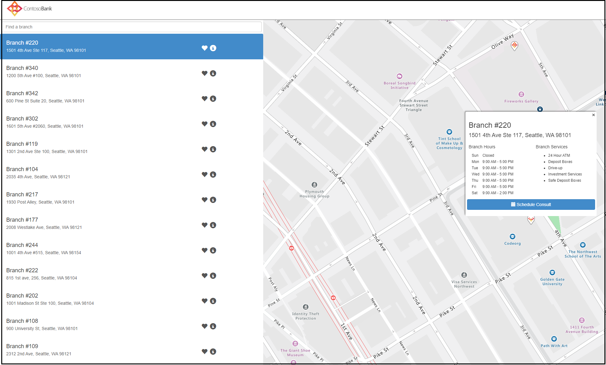

## Ask AwayAsk Away

Ask Away — это [Microsoft Teams бот,](../bots/what-are-bots.md) который позволяет пользователям проводить сеансы вопросы и ответы, называемые Q&A в Teams.Ask Away is a [Microsoft Teams bot](../bots/what-are-bots.md) that enables users to conduct Question and Answer, called Q&A sessions within Teams. С помощью бота Ask Away участники группы могут отправлять и задавать вопросы до голосования, общие коллегами, что позволяет Q&A-хостов для легкого сбора вопросов в канале или чате.Using the Ask Away bot, team members can submit and up-vote questions shared by colleagues allowing Q&A hosts to easily gather top-of-mind questions within a channel or chat. Бот используется для проведения сеанса Q&в режиме Teams в режиме реального времени и позволяет участникам отправлять вопросы в чате.The bot is used to conduct a real-time Q&A session in a Teams meeting and allows attendees to submit questions live through chat.

[Получите его на GitHubGet it on GitHub](https://github.com/OfficeDev/microsoft-teams-apps-askaway)

:::row:::
  :::column span="2":::
    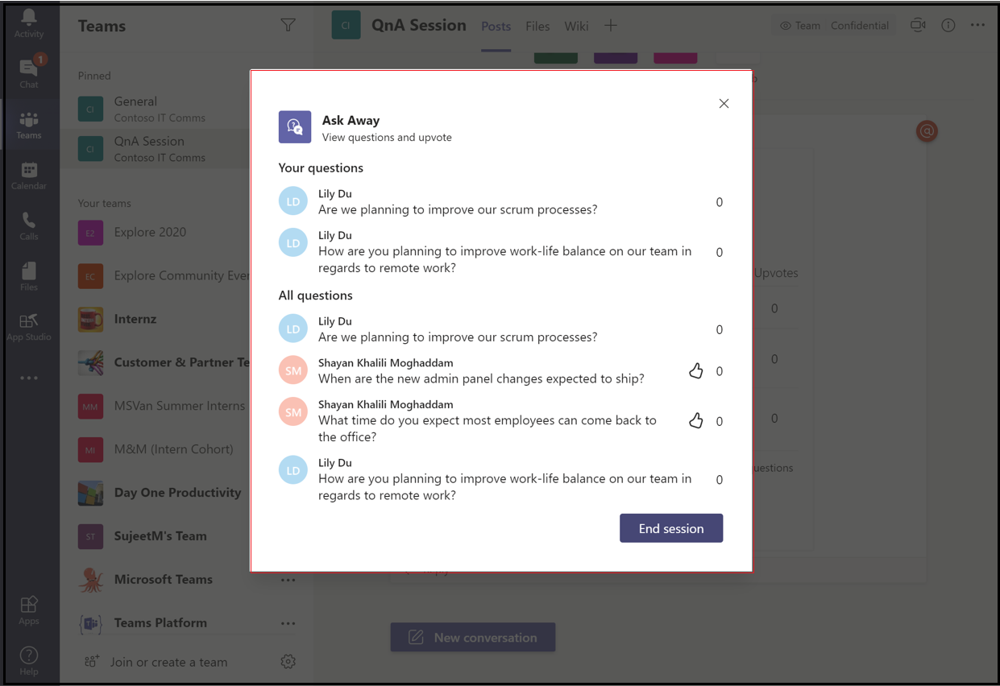  
:::column-end:::
:::row-end:::

## Вспомогательная аналитикаAssociate Insights

Associate Insights — это [Power Apps,](/powerapps/maker/canvas-apps/embed-teams-app) который позволяет сотрудникам firstline напрямую фиксировать и отправлять мнение клиентов, настроения и восприятие.Associate Insights is a [Power Apps](/powerapps/maker/canvas-apps/embed-teams-app) template that empowers firstline workers to directly capture and submit customer opinion, sentiment, and perception. Работники Firstline часто являются первым представителем компании, который может взаимодействовать с клиентами в контактной точке один к одному.Firstline workers are often the first company representative to engage with customers in a one-to-one point-of contact. Собранные данные совместно используются бизнес-группами, например с помощью вкладки Power BI Teams, для улучшения продукта и улучшения взаимодействия с клиентами.The collected data are shared and used collaboratively by business teams, such as through a Power BI Teams tab, for product improvement and enhancing the customer experience.

[Получите его на GitHubGet it on GitHub](https://github.com/OfficeDev/microsoft-teams-apps-associateinsights)

:::row:::
  :::column span="2":::
      
:::column-end:::
:::row-end:::
:::row:::
:::column span="2":::
    
:::column-end:::
:::row-end:::

## ПрисутствиеAttendance

Приложение Для участия — это [вкладка Power Apps,](/powerapps/maker/canvas-apps/embed-teams-app) закрепленная в команде.The Attendance app is a [Power Apps](/powerapps/maker/canvas-apps/embed-teams-app) tab that are pinned in a team. Он предназначен для записи присутствия в таких параметрах, как среды обучения и обучения.It is designed to record presence in settings, such as learning and training environments. Пользователи могут отмечать или изменять посещаемость в течение до 30 дней в прошлом и просматривать обобщенные отчеты о посещаемости для всей группы или отдельных участников.Users can mark or edit attendance for up to 30 days in the past and view summarized attendance reports for an entire group or individual attendees. Дополнительные сведения о посещаемости команд см. в [GitHub.](https://github.com/OfficeDev/microsoft-teams-apps-attendance)For more information on teams attendance, see [Get it on GitHub](https://github.com/OfficeDev/microsoft-teams-apps-attendance).

На следующем изображении отображается демонстрация приложения для посещаемости:The following image displays the attendance app demo:  

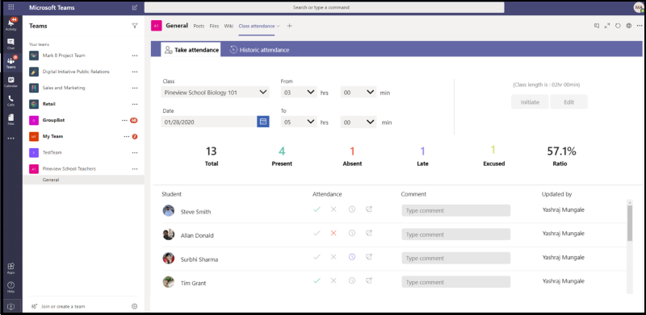

## Book-a-roomBook-a-room

Book-a-room —  это Microsoft Teams бот, который позволяет пользователям быстро находить и резервировать зал собраний на 30, 60 или 90 минут начиная с текущего времени.Book-a-room is a [Microsoft Teams bot](../bots/what-are-bots.md) that allows users quickly to find and reserve a meeting room for 30, 60, or 90 minutes starting from the current time. Время по умолчанию — 30 минут.The default time is 30 minutes. Область бота Book-a-room для личных или 1:1 бесед.The Book-a-room bot scopes to personal or 1:1 conversations. Дополнительные сведения о приложении Book-a-room см. в [GitHub.](https://github.com/OfficeDev/microsoft-teams-apps-bookaroom)For more information on Book-a-room app, see [Get it on GitHub](https://github.com/OfficeDev/microsoft-teams-apps-bookaroom).  
На следующем изображении отображается демо Book-a-room:The following image displays the Book-a-room demo:

## Доступ к зданиямBuilding Access

Building Access — это приложение, основанное на платформе Microsoft [Power Platform,](https://powerapps.microsoft.com/blog/now-in-preview-customize-teams-with-built-in-power-platform-capabilities/) которое поддерживает администрирование пороговых значений заполняемости зданий и норм социального расстановки, позволяя директорам объектов управлять присутствием сотрудников на месте, отслеживать и сообщать о них.Building Access is a Microsoft [Power Platform](https://powerapps.microsoft.com/blog/now-in-preview-customize-teams-with-built-in-power-platform-capabilities/) based app that supports the administration of building occupancy thresholds and social distancing norms by enabling facilities directors to manage, track, and report employee on-site presence. Приложение, построенное с помощью Microsoft [Power Apps](/powerapps/powerapps-overview)и [Power Automate,](/power-automate/getting-started)глубоко интегрируется с Microsoft Teams и позволяет организациям определять готовность к созданию, устанавливать критерии соответствия требованиям для доступа на сайте и собирать сведения о будущем планировании.The app, built using Microsoft [Power Apps](/powerapps/powerapps-overview), and [Power Automate](/power-automate/getting-started), deeply integrates with Microsoft Teams and enables organizations to determine building readiness, establish eligibility criteria for on-site access, and gather insights for future planning.

[Получите его на GitHubGet it on GitHub](https://github.com/OfficeDev/microsoft-teams-apps-buildingaccess)

:::row:::
   :::column span="":::
     
   :::column-end:::
   :::column span="":::
      
   :::column-end:::
:::row-end:::

## ПраздникиCelebrations

Celebrations — это приложение Teams, которое помогает участникам группы отмечать дни рождения, юбилеи и другие повторяющиеся события.Celebrations is a Teams app that helps team members to celebrate each others' birthdays, anniversaries, and other recurring events. Он запоминает особые случаи всех членов команды и отправляет приветственное сообщение во всех командах, выбранных во время создания событий, чтобы участники группы чувствовали себя особенными в свой день.It remembers special occasions of all the team members and sends a friendly message in all the teams selected at the time of event creation, to make the team members feel special on their day.

Приложение предоставляет простой интерфейс для всех членов группы, чтобы лично добавить и просмотреть свои события, а также позволяет пользователю выбрать команды, в которых события получают общий доступ.The app provides an easy interface for all the team members to personally add and view their events and also allows the user to select the teams in which the events gets shared.

[Получите его на GitHubGet it on GitHub](https://github.com/OfficeDev/microsoft-teams-celebrations-app)

## Контрольный списокChecklist

Контрольный список — это  настраиваемая программа расширения Microsoft Teams обмена сообщениями, которая позволяет вам сотрудничать с командой, создавая общий контрольный список в чате или канале.Checklist is a custom Microsoft Teams [messaging extension](../messaging-extensions/what-are-messaging-extensions.md) app that enables you to collaborate with your team by creating a shared checklist in a chat or channel. Приложение поддерживается во всех клиентах Teams платформы, таких как настольный браузер, iOS и Android.The app is supported across all Teams platform clients, such as desktop browser, iOS, and Android. Приложение готово к развертыванию в рамках Microsoft 365 подписки.The app is ready for deployment as part of your Microsoft 365 subscription.  

[Получите его на GitHubGet it on GitHub](https://github.com/OfficeDev/microsoft-teams-checklist-app)

:::row:::
:::column span="2":::
      
:::column-end:::
:::row-end:::

## Заехав в классClassroom Drop-in 

В классе Drop-in — это приложение на основе платформы Microsoft [Power Platform,](https://powerapps.microsoft.com/blog/now-in-preview-customize-teams-with-built-in-power-platform-capabilities/)которое позволяет руководителям систем находить группы классов, означает виртуальные классы и добавлять себя или других в эти группы класса в течение указанного периода при необходимости.Classroom Drop-in is a Microsoft [Power Platform](https://powerapps.microsoft.com/blog/now-in-preview-customize-teams-with-built-in-power-platform-capabilities/)-based app that enables system leaders to find class teams, means virtual classrooms and add themselves or others to these class teams for a specified drop-in period, as needed. Приложение, построенное с помощью Microsoft [Power Apps](/powerapps/powerapps-overview) [и Power Automate,](/power-automate/getting-started)глубоко интегрируется с Microsoft Teams для обеспечения того, чтобы учебные заведения могли оптимизировать свои операции в гибридной среде обучения, предоставляя доступ к соответствующим заинтересованным сторонам для групп классов по бизнес-требованиям.The app built using Microsoft [Power Apps](/powerapps/powerapps-overview) and [Power Automate](/power-automate/getting-started), deeply integrates with Microsoft Teams to ensure educational institutes can optimize their operations in a hybrid learning environment by providing access to relevant stakeholders for class teams per business requirements.

[Получите его на GitHubGet it on GitHub](https://github.com/OfficeDev/microsoft-teams-apps-classroom-dropin)

## Корпоративный CommunicatorCompany Communicator

Приложение Communicator позволяет корпоративным командам создавать и отправлять сообщения, предназначенные для нескольких групп или большого числа сотрудников в чате, позволяя организации достигать сотрудников прямо там, где они сотрудничают.The Company Communicator app enables corporate teams to create and send messages intended for multiple teams or large number of employees over chat allowing organization to reach employees right where they collaborate. Используйте этот шаблон для нескольких сценариев, таких как новые объявления об инициативе, учет сотрудников, современное обучение и разработка или широкомасштабные трансляции.Utilize this template for multiple scenarios such as new initiative announcements, employee onboarding, modern learning, and development or organization-wide broadcasts.

Приложение обеспечивает простой интерфейс для назначенных пользователей для создания, предварительного просмотра, совместной работы и отправки сообщений.The app provides an easy interface for designated users to create, preview, collaborate and send messages.

Он создает основу для создания настраиваемой целевой системы связи, например настраиваемой телеметрии, о том, сколько пользователей было признано или взаимодействует с сообщением.It provides a foundation to build custom targeted communication capabilities such as custom telemetry on how many users acknowledged or interacted with a message.

[Получите его на GitHubGet it on GitHub](https://github.com/OfficeDev/microsoft-teams-company-communicator-app)

## Lookup контактной группыContact Group Lookup

Приложение Lookup контактной группы предоставляет удобный и полезный подход к созданию, доступу и управлению контакт-группами организации, ранее известными как списки рассылки или группы связи.The Contact Group Lookup app provides a convenient and useful approach to creating, accessing, and managing your organization's contact groups, formerly known as distribution lists or communication groups. Пользователи могут быстро просматривать и общаться с участниками группы, просматривать состояние участников и создавать групповой чат с выбранными участниками контактной группы, Teams среде.Users can quickly view and chat with group members, view member status, and create a group chat with selected members in the contact group, all within the Teams environment.

[Получите его на GitHubGet it on GitHub](https://github.com/OfficeDev/microsoft-teams-app-contactgrouplookup)

:::row:::
:::column span="2":::
      
:::column-end:::
:::row-end:::
:::row:::
:::column span="2":::
    
:::column-end:::
:::row-end:::

## Оценка сотрудниковCo-worker Appreciation 

Используя шаблон оценки коллег в Microsoft Teams, пользователи могут распознавать достижения коллег в контексте Teams.Using the co-worker appreciation template in Microsoft Teams, users can recognize their colleagues' achievements within the Teams’ context. Когда сотрудники выбирают для вознаграждения коллегу, получатели и другие члены группы помечены в разговоре на канале, и они получают уведомление о вручениях канала.When co-workers select to reward a colleague, recipients and other team members are tagged in a channel conversation and they receive a notification about the channel's award details. Награды записывают в приложении Teams, которое безопасно, портативно и легко доступно для обмена.The awards are recorded in the Teams app, which is secure, portable, and easily shareable. Это рассматривается как версия шаблона приложения Open Badges на основе PowerApps с таблицей лидеров.This is considered as the PowerApps based version of the Open Badges app template, with a leaderboard.

[Получите его на GitHubGet it on GitHub](https://github.com/OfficeDev/microsoft-teams-apps-coworker-appreciation)

## CrowdSourcerCrowdSourcer

CrowdSourcer — это [Microsoft Teams бот,](../bots/what-are-bots.md) который предоставляет группам запрашиваемую информацию, которая была совместно источником от участников группы.CrowdSourcer is a [Microsoft Teams bot](../bots/what-are-bots.md) that gives teams queried information sourced collaboratively from group members. Это помогает отвечать на часто задамые вопросы, позволяя участникам активно участвовать и вносить вклад в интересный и полезный информационный ресурс.It helps to answer frequently asked questions while enabling participants to actively engage in and contribute to a fun and helpful information resource.

[Get it on GithubGet it on Github](https://github.com/OfficeDev/microsoft-teams-crowdsourcer-app)

## Пользовательские наклейкиCustom Stickers

Самовыражение является основой здоровой культуры команды.Self-expression is core to a healthy team culture. Этот шаблон приложения — это расширение [обмена](~/messaging-extensions/what-are-messaging-extensions.md) сообщениями, которое позволяет пользователям использовать настраиваемые наклейки и GIF-Microsoft Teams.This app template is a [messaging extension](~/messaging-extensions/what-are-messaging-extensions.md) that enables your users to use custom stickers and GIFs within Microsoft Teams. Этот шаблон предоставляет простой веб-опыт конфигурации, где любой пользователь с доступом к конфигурации может загружать GIF-изображения, giF,наклейки и изображения, которые они хотят иметь, что позволяет всей вашей команде использовать любой набор стикеров, которые вы выбираете.This template provides an easy web-based configuration experience where anyone with configuration access can upload the GIFs, stickers, and images they want their users to have, allowing your entire team to use any set of stickers you choose.

Это приложение также позволяет легко обмениваться изображениями, GIF-файлами, наклейками между группами без доступа к SharePoint сайтам или отдельным каналам в качестве механизмов хранения и общего доступа.This app also enables easy sharing of images, GIFs, stickers across teams without needing access to SharePoint sites or individual channels as storage and sharing mechanisms. Например, группы продуктов могут легко обмениваться изображениями продуктов и GIF-изображениями в социальных сетях, маркетинге и продажах программным образом.For example, product teams can easily share product images and GIFs to social media, marketing, and sales teams programmatically. Можно также расширить это приложение, запуская поток уведомлений для определенных групп или отдельных лиц, когда новые изображения и GIF-изображения доступны.One can also extend this app by triggering a notification flow to specific teams or individuals when new images, and GIFs are made available.

[Получите его на GitHubGet it on GitHub](https://github.com/OfficeDev/microsoft-teams-stickers-app)

## Идеи сотрудниковEmployee Ideas

Приложение "Идеи сотрудников" — это версия PowerApps шаблона приложения Great Ideas на основе Azure.The Employee Ideas app is the PowerApps version of the Azure based Great Ideas app template. Приложение позволяет пользователям Teams настраивать идею кампании.The app enables the Teams users to set up and configure an idea campaign. Кампания идей — это категория для группировки идей вокруг общих тем.An idea campaign is a category for grouping ideas around common themes.

Teams пользователи также могут выполнять следующие действия:Teams users can also perform the following activities:

* Настройте стандартную форму отправки, которую сотрудники должны отправить для каждой идеи.Configure a standard submission form that employees must submit for each idea. 
* Просмотрите и управляйте идеями и списком кампаний.Review and manage the ideas and list of campaigns.
* Изменение и удаление кампаний.Modify and delete campaigns.
* Просмотрите советы лидеров идей.Review leader boards of ideas.
* Голосуйте за и делитесь приоритетными идеями.Vote for and share prioritized ideas.
* Отправка идей для кампании.Submit ideas for a campaign.
* Просмотр идеи другого члена группы.View other team member's idea.
* Голосуйте за наиболее понравились идеи.Vote on most liked ideas.
* Просмотрите производительность их идей по сравнению с другими в рамках кампании.Review the performance of their ideas compared with others within a campaign.

[Получите его на GitHubGet it on GitHub](https://github.com/OfficeDev/microsoft-teams-apps-employeeideas)

 

## Электронные рецептыE-Prescriptions 

E-Prescriptions —  это Power Apps приложение, которое улучшает телемедицину и виртуальную помощь путем автоматизации процесса выдачи электронных рецептов пациентам.E-Prescriptions is a [Power Apps](/powerapps/maker/canvas-apps/embed-teams-app) based app that enhances telemedicine and virtual care by automating the process of issuing e-prescriptions to patients. Медицинские специалисты могут быстро пересматривать встречи, создавать электронные рецепты и отправлять сообщения электронной почты с вложениями по электронному рецепту пациентам непосредственно в Teams платформе.Medical professionals can quickly review appointments, generate e-prescriptions, and send emails with e-prescription attachments to patients directly within the Teams platform.

[Получите его на GitHubGet it on GitHub](https://github.com/OfficeDev/microsoft-teams-apps-eprescription) 

:::row:::
:::column span="2":::
      
:::column-end:::
:::row-end:::
:::row:::
:::column span="2":::
    
:::column-end:::
:::row-end:::

## Обучение сотрудниковEmployee Training 

Обучение сотрудников — это Microsoft Teams, которое позволяет организаторам легко публиковать, отслеживать и содействовать обучению и учебным мероприятиям для вашей организации.Employee training is a Microsoft Teams app that enables organizers to easily publish, track, and promote learning and training events for your organization.  С помощью приложения организаторы событий могут отправлять напоминания и уведомления регистрантам событий, а сотрудники могут указывать на интерес к предстоящим событиям, обновлять текущие события и делиться сведениями о событиях с коллегами через расширение Teams сообщений.With the app, event planners can send reminders and notifications to event registrants and employees can indicate interest in upcoming events, stay updated on current events, and share event details with colleagues through the Teams messaging extension.

[Получите его на GitHubGet it on GitHub](https://github.com/OfficeDev/microsoft-teams-apps-employeetraining)

:::row:::
:::column span="2":::
    **Просмотр событий обучения сотрудников** **View employee training events**   
:::column-end:::
:::row-end:::
:::row:::
:::column span="2":::
    **Создание события подготовки сотрудников** **Create employee training event** 
:::column-end:::
:::row-end:::

## Эксперт finderExpert Finder

Expert Finder — это [Microsoft Teams,](../bots/what-are-bots.md) который определяет конкретных членов организации на основе их навыков, интересов и атрибутов образования.Expert Finder is a [Microsoft Teams bot](../bots/what-are-bots.md) that identifies specific organization members based on their skills, interests, and education attributes. Участники находят экспертов в организации, которые соответствуют поиску ключевых слов Azure Active Directory профилей пользователей.Members find experts within an organization that match a keyword search of Azure Active Directory user profiles.

[Получите его на GitHubGet it on GitHub](https://github.com/OfficeDev/microsoft-teams-apps-expertfinder)

## Вопросы и ответы плюсFAQ Plus

Диалоговая&боты — это простой способ предоставления ответов на часто задамые пользователями вопросы.Conversational Q&A bots are an easy way to provide answers to frequently asked questions by users. Но большинство ботов не могут эффективно взаимодействовать с пользователями, так как при сбойе бота в цикле нет человека.But, most bots fail to engage with users in meaningful way because there is no human in the loop when the bot fails. FaQ bot — это дружественный Q&бот, который приводит человека в цикл, когда он не в состоянии помочь.FAQ bot is a friendly Q&A bot that brings a human in the loop when it is unable to help. Можно задать боту вопрос, и бот отвечает ответом, если он содержится в базе знаний.One can ask the bot a question and the bot responds with an answer if it is contained in the knowledge base. Если нет, бот позволяет пользователю отправлять запрос, который затем передается предварительно настроенной группе экспертов, которые помогают обеспечить поддержку, действуя на уведомления из самой группы.If not, the bot allows the user to submit a query which then gets posted to a pre-configured team of experts who help to provide support by acting upon the notifications from within the team itself.

> [!NOTE]
> Последний выпуск **FAQ Plus** поддерживает улучшенные решения Q&, позволяя группе экспертов выполнить следующие действия:The latest release of **FAQ Plus** supports improved Q&A resolutions by enabling a team of experts to complete the following:
>
> &#x2714; Q&как непосредственно в базу знаний с помощью расширений сообщений.&#x2714; Add new Q&As directly to the knowledge base using message extensions.
>
> &#x2714; изменить и удалить Q&пары, добавленные ботом.&#x2714; Edit and delete Q&A pairs added by a bot.
>
> &#x2714; отслеживание истории пересмотра Q&As.&#x2714; Track the revision history of Q&As.
>
> &#x2714; настройка ответа с дополнительными сведениями для отображения в качестве [адаптивной карты.](../task-modules-and-cards/cards/cards-reference.md#adaptive-card)&#x2714; Configure an answer with additional details to display as an [Adaptive Card](../task-modules-and-cards/cards/cards-reference.md#adaptive-card).
>
[Получите его на GitHubGet it on GitHub](https://github.com/OfficeDev/microsoft-teams-apps-faqplusv2)

## Получить приложение поддержкиGet Support App

Приложение Get Support используется организациями, использующими Microsoft Teams, чтобы позволить любому набору пользователей запрашивать помощь у руководителей.The Get Support app is used by organizations that are using Microsoft Teams, to enable any set of users to request assistance from supervisors. Это приложение включает следующие функции:This app includes the following features:
* Запрос помощи для разных категорий в приложении Power.Requesting assistance on different categories from a Power App.
* Уведомления, отправленные запросчикам, информирующие их о том, кому назначен заяц.Notifications sent to requestors informing them of who hare assigned.
* Уведомления, отосланные назначенному руководителю, информирующие их о том, кому нужна помощь.Notifications sent to assigned supervisors informing them of who needs assistance. 
* Анализ эскалаций и шаблонов в SharePoint и PowerBI.S.Analyzing escalations and patterns in SharePoint and PowerBI.S.

[Получите его на GitHubGet it on GitHub](https://github.com/OfficeDev/microsoft-teams-app-get-support/)

## Отслеживание целейGoal Tracker

Приложение Goal Tracker — это комплексное решение для организации, которое поддерживает установление целей, наблюдение за прогрессом и признание успеха в Microsoft Teams.The Goal Tracker app is a comprehensive solution for your organization to support establishing goals, observing progress, and acknowledging success within Microsoft Teams. Приложение позволяет пользователям устанавливать, отслеживать и обновлять цели на профессиональном, личном и командном уровне.The app enables users to set, track, and update objectives on a professional, personal, and team level. Члены группы также получают вовремя напоминания и обновления состояния, чтобы оставаться сосредоточенными и оставаться в курсе.Team members also receive timely reminders and status updates to remain focused and stay on track.

[Получите его на GitHubGet it on GitHub](https://github.com/OfficeDev/microsoft-teams-app-goaltracker)

:::row:::
  :::column span="2":::
      
:::column-end:::
:::row-end:::
:::row:::
:::column span="2":::
    
:::column-end:::
:::row-end:::

## Великие идеиGreat Ideas

Приложение Great Ideas поддерживает и расширяет возможности инноваций и творчества в организации.The Great Ideas app supports and empowers innovation and creativity within your organization. Приложение позволяет сотрудникам обмениваться идеями с коллегами и руководством, обнаруживая новые материалы, вклады внимания для одноранговой оценки и голосуя за лучшие предложения в Microsoft Teams.The app enables your employees to share ideas with colleagues and leadership, discover new submissions, spotlight contributions for peer consideration, and cast their vote for the best proposals within Microsoft Teams.

[Получите его на GitHubGet it on GitHub](https://github.com/OfficeDev/microsoft-teams-apps-greatideas)

:::row:::
  :::column span="2":::
    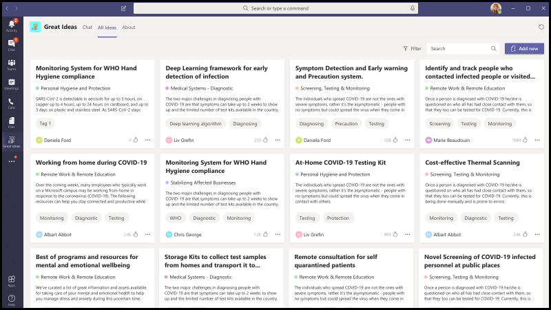  
:::column-end:::
:::row-end:::
:::row:::
:::column span="2":::
    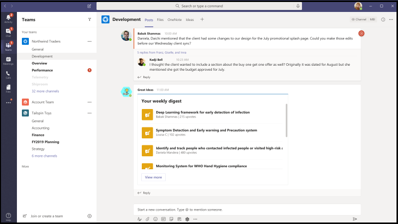
:::column-end:::
:::row-end:::

## Групповые действияGroup Activities

Group Activities — это Microsoft Teams приложение, которое позволяет владельцам групп быстро создавать группы действий и управлять рабочими процессами совместной работы в контексте Microsoft Teams.Group Activities is a Microsoft Teams app that makes it easy for team owners to quickly create activity groups and manage collaboration workflows within the context of Microsoft Teams. Авторы действий могут создавать действия, случайным образом распределять членов группы по группам и необязательно отправлять напоминания боту до завершения действий.Activity authors are enabled to create activities, randomly distribute team members in groups, and optionally have the bot send reminders until activities are complete.

[Получите его на GitHubGet it on GitHub](https://github.com/OfficeDev/microsoft-teams-apps-groupactivities)

:::row:::
  :::column span="2":::
    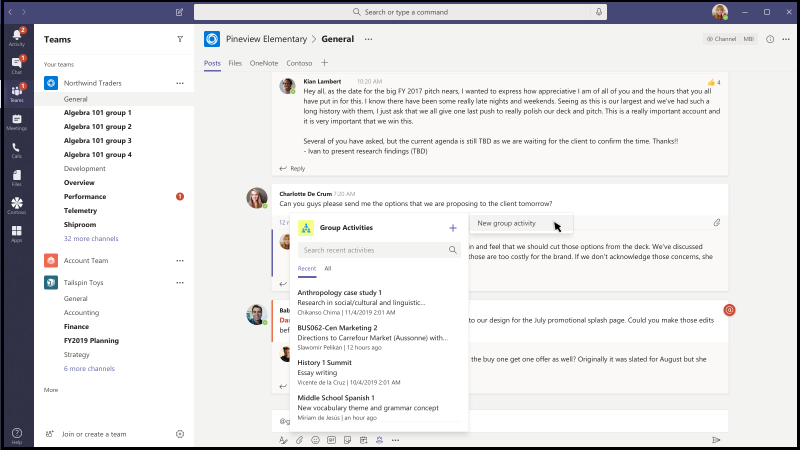  
:::column-end:::
:::row-end:::
:::row:::
:::column span="2":::
    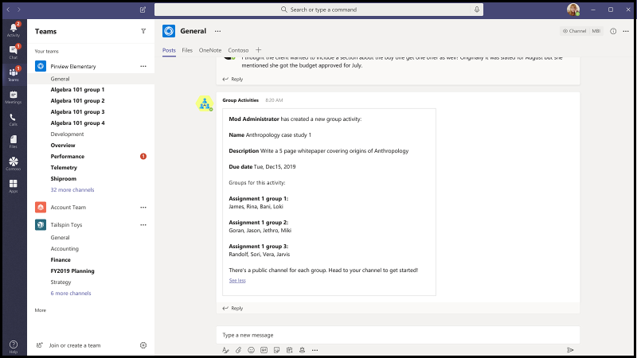
:::column-end:::
:::row-end:::

## Групповой Подключение &#9734;Group Connect &#9734;

Group Подключение — это Microsoft Teams, которое помогает участникам организации находить группы сотрудников и находить сведения, соответствующие группам сотрудников.Group Connect is a Microsoft Teams app that helps organization members discover employee groups and find information relevant to employee groups. Приложение встроено с богатыми возможностями для руководителей организаций для общения со своими сотрудниками в отношении групп, событий и ресурсов.The app comes built-in with rich capabilities for organization leaders to communicate with their employees regarding groups, events, and resources. Приложение Group Подключение также совпадает с участниками группы на их нужной частоте, чтобы стимулировать сетевое взаимодействие и сплоченность в группе.The Group Connect app also matches group members with each other at their desired frequency to encourage networking and cohesion within a group. Дополнительные сведения о том, как использовать приложение Group Подключение, чтобы помочь группам сотрудников развиваться в организации, см. в GitHub.For more information on how you can leverage the Group Connect app to help employee groups foster within your organization, see the app on GitHub.

[Получите его на GitHubGet it on GitHub](https://github.com/OfficeDev/microsoft-teams-apps-groupconnect)

## Вырастите свои навыкиGrow Your Skills

Приложение Grow Your Skills поддерживает профессиональный рост и развитие, позволяя сотрудникам вносить вклад в дополнительные проекты для вашей организации, одновременно изучая новые навыки.The Grow Your Skills app supports professional growth and development by enabling employees to contribute to supplemental projects for your organization while simultaneously learning new skills. Сотрудники могут использовать приложение для поиска возможностей, которые отвечают их интересам, эффективного взаимодействия с коллегами и приобретения новых уровней знаний и возможностей в Teams среде.Employees can use the app to locate opportunities that meet their interests, enjoy meaningful collaboration with peers, and acquire new levels of expertise and capabilities, all within the Teams environment.

[Получите его на GitHubGet it on GitHub](https://github.com/OfficeDev/microsoft-teams-apps-growyourskills)

:::row:::
  :::column span="2":::
      
:::column-end:::
:::row-end:::
:::row:::
:::column span="2":::
    
:::column-end:::
:::row-end:::

## Поддержка управления персоналомHR Support

Бот поддержки кадров — это дружественный Q&бот, который привозит специалиста или специалиста по поддержке из группы hr в цикл, когда он не может помочь.HR Support bot is a friendly Q&A bot that brings a support professional or expert from the HR team in the loop when it is unable to help. Можно задать боту вопрос, и бот отвечает ответом, если он содержится в базе знаний.One can ask the bot a question and the bot responds with an answer if it is contained in the knowledge base. Если нет, бот позволяет пользователю отправить запрос, который затем будет размещен в предварительно настроенной группе экспертов, которые помогают оказывать поддержку, действуя на уведомления из самой команды.If not, the bot allows the user to submit a query which then gets posted in a pre-configured team of experts who are help to provide support by acting upon the notifications from within their team itself. Кроме того, бот предлагает ссылки на рекомендуемые политики кадров или вопросы, ища предварительно настроенные теги в этом вопросе.Additionally, the bot suggests links to recommended HR policies or questions by searching for pre-configured tags in the question. Эти плитки находятся на связанной вкладке в качестве быстрой ссылки.These tiles are found in the associated tab as a quick reference. Поддержка отдела кадров хорошо работает для&Q&A и обеспечивает быструю поддержку при запуске новых проектов или инициатив в организации.HR Support works well for light weight Q&A and to provide quick support when launching new projects or initiatives in the organization.

[Получите его на GitHubGet it on GitHub](https://github.com/OfficeDev/microsoft-teams-hrsupport-app)

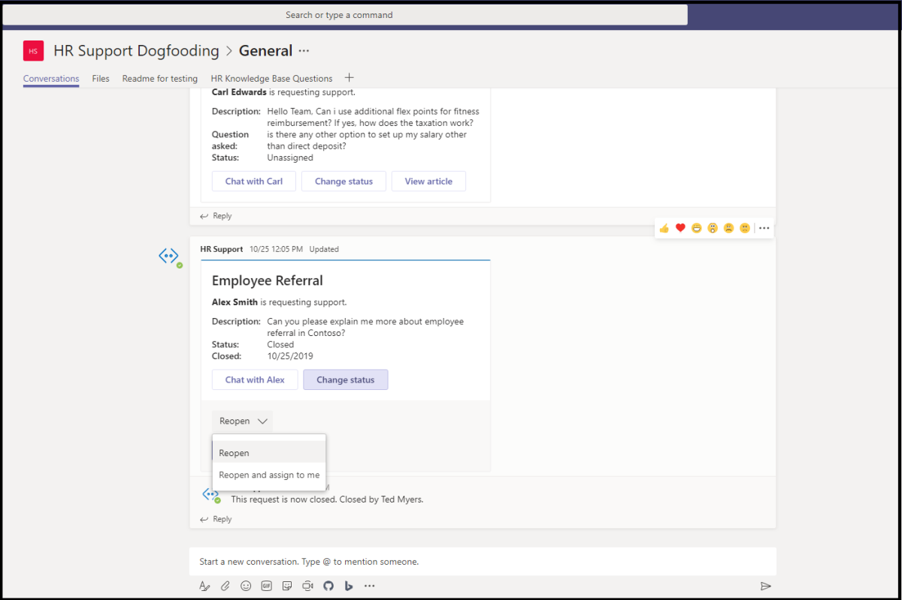

## Точки соприкосновенияIcebreaker

Icebreaker — это [Microsoft Teams,](../bots/what-are-bots.md) который помогает вашей команде приблизиться, спарив двух случайных членов команды каждую неделю для встречи.Icebreaker is a [Microsoft Teams bot](../bots/what-are-bots.md) that helps your team get closer by pairing two random team members up every week to meet. Бот упрощает планирование, автоматически предлагая свободное время, которое работает для обоих участников.The bot makes scheduling easy by automatically suggesting free times that work for both members. Укрепляйте личные связи и создайте тесное сообщество с помощью этого приложения.Strengthen personal connections and build a tightly knit community with this app.

Помимо поощрения личных подключений всей вашей команды, приложение Icebreaker может помочь развивать сообщества, основанные на интересах вашей организации.In addition to encouraging personal connections across your entire team, the Icebreaker app can help cultivate interest-based communities within your organization. Например, это приложение можно использовать для группы DevOps, чтобы помочь идеям и лучшим практикам органично распространяться по всей организации.For example, you can use this app for a DevOps interest group to help ideas and best practices organically spread across your organization.

[Получите его на GitHubGet it on GitHub](https://github.com/OfficeDev/microsoft-teams-icebreaker-app)

## СтимулыIncentives

Стимулы — это шаблон [Power Apps,](/powerapps/maker/canvas-apps/embed-teams-app) который управляет и отслеживает стимулирование участия сотрудников в назначенных мероприятиях, таких как тренинги и инициативы по управлению изменениями.Incentives is a [Power Apps](/powerapps/maker/canvas-apps/embed-teams-app) template that manages and tracks incentivized employee participation in designated activities, such as trainings and change management initiatives. Администраторы используют приложение для создания назначенных действий, назначения точек для завершения и указания необходимых уровней точки права на вознаграждение.Admins use the app to establish designated activities, assign points for completion, and specify required eligibility point levels for rewards. Сотрудники используют приложение для просмотра накопленных баллов и по достижении допустимости запрашивать и требовать выкупаемых вознаграждений.Employees use the app to view their accumulated points and, upon reaching eligibility, request and claim redeemable rewards.

[Получите его на GitHubGet it on GitHub](https://github.com/OfficeDev/microsoft-teams-apps-incentives)

## Репортер инцидентовIncident Reporter

Incident Reporter — это [Microsoft Teams бот,](../bots/what-are-bots.md) который оптимизирует управление инцидентами в организации.Incident Reporter is a [Microsoft Teams bot](../bots/what-are-bots.md)  that optimizes the management of incidents in your organization. Бот упрощает автоматизированный сбор данных об инцидентах, настраиваемые отчеты об инцидентах, соответствующие уведомления заинтересованных лиц и отслеживание инцидентов в конце концов.The bot facilitates automated incident data collection, customized incident reports, relevant stakeholder notifications, and end-to-end incident tracking.

[Получите его на GitHubGet it on GitHub](https://github.com/OfficeDev/microsoft-teams-apps-incidentreport)

:::row:::
  :::column span="2":::
      
:::column-end:::
:::row-end:::
:::row:::
:::column span="2":::
    
:::column-end:::
:::row-end:::

## ПроверкаInspection 

 Inspection — это Microsoft Teams приложение, которое позволяет сотрудникам первой линии проверять все, что угодно от расположения до активов и оборудования.Inspection is a Microsoft Teams app that enables front line workers to inspect anything from  locations to assets and equipments. Например, розничный магазин, завод по производству или транспортные средства и машины.For example, a retail store, manufacturing plant, or vehicles and machines. В этом решении есть два приложения, каждое из которых предназначено для разных типов пользователей.There are two apps in this solution, each intended for different types of users.

Приложение предоставляет сотрудникам передней линии возможность проверять актив или область, управлять качеством продуктов и услуг или поддерживать безопасность на рабочем месте.The app empowers the front line workers to inspect an asset or area, to manage quality of products and services, or maintain safety at workplace. Это облегчает связь между членами группы для решения проблем, найденных во время проверки.It facilitates communication between team members to address issues found during inspection. Приложение предоставляет простые отчеты для руководителей, чтобы ускорить решение проблем и выделить тенденции.The app provides simple reports for managers to expedite issue resolution and highlight trends.

[Получите его на GitHubGet it on GitHub](https://github.com/OfficeDev/microsoft-teams-apps-inspection)

   

## Отчеты о проблемахIssue Reporting

Приложение Отчеты о проблемах позволяет сотрудникам и руководителям поднимать и управлять вопросами.The Issue Reporting app empowers the employees and managers to raise and manage issues. Она состоит из двух приложений: приложения для отчетов о проблемах и приложения "Управление вопросами" для управления вопросами.It consists of two apps, Issue reporting app for reporting issues and Manage Issues app for managing issues.

Руководители группы используют приложение Manage Issues для настройки приложения, в том числе канала, в котором Microsoft Teams сообщений и задач планировщика, созданных приложением.The team managers use the Manage Issues app to configure the app experience, including the channel in which Microsoft Teams messages and Planner tasks are created by the app. Менеджеры также используют приложение для создания форм шаблонов для сбора сведений, когда пользователь сообщает о проблеме.Managers also use the app to create template forms to collect details when a user reports an issue. Например, просмотрите, отредактируете или удалите формы шаблона проблем.For example, review, edit, or delete issue template forms. Приложение также используется для проверки проблем группы, отчета об истории проблем и эффективного управления решением проблем.The app is also used to review team issues, report on issue history, and efficiently manage issue resolution.

Сотрудники используют приложение отчетов о проблемах для журналов проблем и сведений, необходимых для их устранения.The employees use the Issue reporting app to log issues and details required to resolve them. Приложение также используется для изменения и решения существующих проблем и получения высокого уровня представления об отдельных или командных проблемах.The app is also used to modify and resolve existing issues and get a high-level view of individual or team issues.

[Получите его на GitHubGet it on GitHub](https://github.com/OfficeDev/microsoft-teams-apps-issuereporting)

  

## Новые возможности для сотрудниковNew Employee Onboarding 

Новая интеграция сотрудников — это интегрированное решение Microsoft Teams [и SharePoint](https://lookbook.microsoft.com/details/75e60a32-9849-4ed4-b83e-b2b08983ad19) для новых сотрудников, которое позволяет вашей организации предоставлять сотрудникам последовательную и качественную интеграцию во время их нового путешествия по службе.New Employee Onboarding is an integrated Microsoft Teams and [SharePoint New Employee Onboarding Solution](https://lookbook.microsoft.com/details/75e60a32-9849-4ed4-b83e-b2b08983ad19) that enables your organization to provide a consistent, high-quality onboarding experience for employees on their new-hire journey. Приложение используется группами кадров и менеджерами по найму для предоставления соответствующих сведений в процессе ориентации и индукции, а также для обмена отзывами, предоставления представлений и выполнения задач бортового ввода.The app is used by human resource teams and hiring managers to provide relevant information throughout the orientation and induction process and by new hires to share feedback, provide introductions, and complete onboarding tasks.

[Получите его на GitHubGet it on GitHub](https://github.com/OfficeDev/microsoft-teams-apps-newemployeeonboarding)

:::row:::
  :::column span="2":::
    **Новая приветствие сотрудника** **New employee welcome card** 
:::column-end:::
:::row-end:::
:::row:::
:::column span="2":::
    **Новый контрольный список сотрудников** **New employee checklist**   
:::column-end:::
:::row-end:::

## Открыть значкиOpen Badges

Open Badges — это Microsoft Teams, которое позволяет пользователям получать цифровые значки учетных данных для обучения в контексте Teams и делиться ими во всем мире.Open Badges is a Microsoft Teams app that enables individuals to earn digital learning credential badges within the Teams context and share them everywhere. Использование возможностей сторонних органов по выдаче цифровых значков [Badgr](https://badgr.org/), отмеченных значками, записывается в профиле Badgr получателя и доступно для создания и обмена богатой картиной путешествий по обучению в течение всей жизни.Using capabilities from the third-party digital badge issuing authority, [Badgr](https://badgr.org/), awarded badges are recorded in a recipient's Badgr profile and available to build and share a rich picture of lifetime learning journeys.

[Получите его на GitHubGet it on GitHub](https://github.com/OfficeDev/microsoft-teams-apps-openbadges)

:::row:::
  :::column span="2":::
    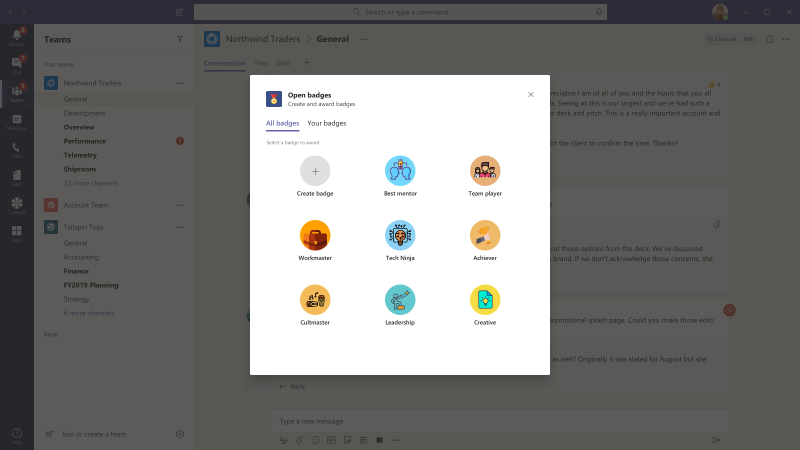  
:::column-end:::
:::row-end:::
:::row:::
:::column span="2":::
    
:::column-end:::
:::row-end:::

## ОпросPoll 

Poll — это настраиваемая программа расширения Microsoft Teams обмена сообщениями, которая позволяет быстро создавать и отправлять опросы в чате или канале для сбора мнений и предпочтений группы. Poll is a custom Microsoft Teams [messaging extension](../messaging-extensions/what-are-messaging-extensions.md) app that enables you to quickly create and send polls in a chat or a channel to gather team opinions and preferences. Приложение поддерживается во всех Teams платформах, таких как настольный компьютер, браузер, iOS и Android, и готово к развертыванию в рамках Microsoft 365 подписки.The app is supported across all Teams platform clients, such as desktop, browser, iOS, and Android and is ready for deployment as part of your Microsoft 365 subscription.

[Получите его на GitHubGet it on GitHub](https://github.com/OfficeDev/microsoft-teams-poll-app)

:::row:::
  :::column span="1":::
      
:::column-end:::
:::row-end:::

## Быстрые ответыQuick Responses

Quick Responses — это Microsoft Teams приложение, которое предоставляет надежное решение для эффективного ответа на часто задаваемые вопросы.Quick Responses is a Microsoft Teams app that delivers a robust solution for effectively answering users' commonly asked questions FAQs. Вместо того, чтобы отвечать на каждый запрос вручную и непрерывно повторять информацию, приложение создает библиотеку ответов для интерактивного пользовательского интерфейса с помощью Teams [расширений обмена сообщениями.](../messaging-extensions/what-are-messaging-extensions.md)Instead of answering each query manually and continuously repeating information, the app builds a library of responses for an interactive user experience through Teams [messaging extensions](../messaging-extensions/what-are-messaging-extensions.md).

[Получите его на GitHubGet it on GitHub](https://github.com/OfficeDev/microsoft-teams-apps-quickresponses)

## Тест &#9734;Quiz  &#9734;

Quiz — это настраиваемая [Teams](../messaging-extensions/what-are-messaging-extensions.md) приложение для расширения обмена сообщениями, которое позволяет создавать викторину в чате или канале проверки знаний и мгновенных результатов.Quiz is a custom [Teams messaging extension](../messaging-extensions/what-are-messaging-extensions.md) app that enables you to create a quiz within a chat or a channel for knowledge check and instantaneous results. Вы можете использовать тесты для экзаменов в классе и автономном режиме, проверку знаний в команде и забавные викторины в команде.You can use Quiz for, In-class and offline exams, Knowledge check within team, and for fun quizzes within a team. Приложение викторины поддерживается на нескольких платформах, таких как Teams, браузер, iOS и Android-клиенты.Quiz app is supported across multiple platforms, such as Teams desktop, browser, iOS, and Android clients. Это приложение готово к развертыванию в рамках существующей Microsoft 365 подписки.This app is ready for deployment as part of your existing Microsoft 365 subscription.

[Получите его на GitHubGet it on GitHub](https://github.com/OfficeDev/microsoft-teams-apps-quiz)

:::row:::
  :::column span="1":::
      
:::column-end:::
:::row-end:::

## Rapid AssistRapid Assist

Rapid Assist — это приложение, основанное на платформе Microsoft [Power Platform,](https://powerapps.microsoft.com/blog/now-in-preview-customize-teams-with-built-in-power-platform-capabilities/) которое позволяет партнерам с клиентами быстро подключаться к экспертам, получать быстрые ответы, искать информацию, выполнять открытые запросы и получать уведомления, чтобы быстро получить вызов, чтобы помочь ответить на вопросы.Rapid Assist is a Microsoft [Power Platform](https://powerapps.microsoft.com/blog/now-in-preview-customize-teams-with-built-in-power-platform-capabilities/) based app that allows customer facing associates to rapidly connect with the experts to get quick answers, search for information, follow up open requests, and allow experts to receive notifications to quickly get on a call to help answer questions. Приложение, построенное  с Power Apps и [Power Automate](/power-automate/getting-started)Microsoft, глубоко интегрируется с Microsoft Teams, чтобы организации могли легко подключать сотрудников frontline с корпоративными связями для решения запросов клиентов и предоставления отличного обслуживания клиентов.The app built using Microsoft [Power Apps](/powerapps/powerapps-overview) and [Power Automate](/power-automate/getting-started), deeply integrates with Microsoft Teams to enable organizations to easily connect frontline workers with corporate liaisons to resolve customer queries and deliver a great customer experience. 

[Получите его на GitHubGet it on GitHub](https://github.com/OfficeDev/microsoft-teams-apps-rapid-assist)

:::row:::
   :::column span="":::
     
   :::column-end:::
   :::column span="":::
      
   :::column-end:::
:::row-end:::

## ОтражениеReflect 

Reflect — это настраиваемая программа расширения Microsoft Teams обмена сообщениями, которая предоставляет безопасный и инклюзивный ресурс для членов вашей команды, чтобы поделиться состоянием своего эмоционального благополучия с коллегами или руководителями групп непосредственно в Teams. Reflect is a custom Microsoft Teams [messaging extension](../messaging-extensions/what-are-messaging-extensions.md) app that provides a safe and inclusive resource for your team members to share the state of their emotional well-being with colleagues or group leaders directly within Teams. Приложение доступно в чатах каналов, групп, собраний и 1:1, а ответ на регистрацию устанавливается для общедоступных, частных и полностью анонимных.The app is available in channel, group, meeting, and 1:1 chats and the check-in response is set to public, private-to-sender, or fully anonymous.

[Получите его на GitHubGet it on GitHub](https://github.com/OfficeDev/Microsoft-Teams-App-Reflect)

:::row:::
    :::column:::
    **Опрос благополучия****Well-being poll**
    
    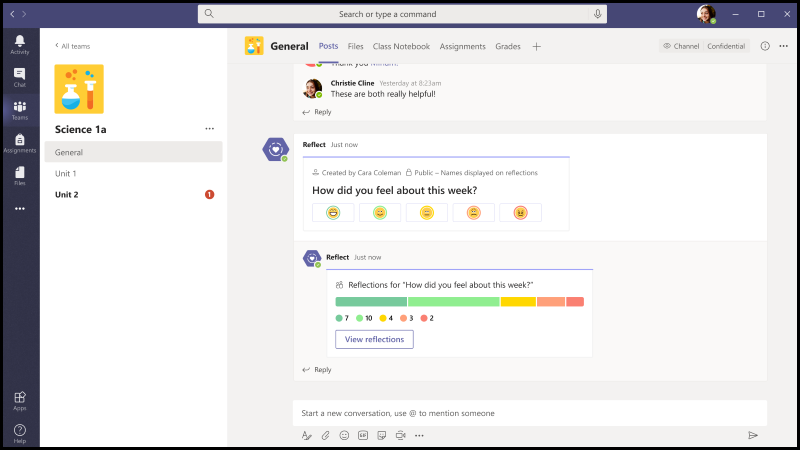
    :::column-end:::
:::row-end:::

## Удаленная поддержкаRemote Support

Remote Support — это [Microsoft Teams бот,](../bots/what-are-bots.md) который обеспечивает целенаправленный интерфейс между запрашивателями поддержки по всей организации и внутренней группе поддержки.Remote Support is a [Microsoft Teams bot](../bots/what-are-bots.md) that provides a focused interface between support requesters throughout your organization and the internal support team.  Конечные пользователи могут отправлять, редактировать или отзывать запросы на поддержку, а группа поддержки может отвечать, управлять и обновлять запросы в Teams платформе.End-users can submit, edit, or withdraw requests for support and the support team can respond, manage, and update requests all within the Teams platform.

[Получите его на GitHubGet it on GitHub](https://github.com/OfficeDev/microsoft-teams-apps-remotesupport)

:::row:::
  :::column span="2":::
      
:::column-end:::
:::row-end:::
:::row:::
:::column span="2":::
    
:::column-end:::
:::row-end:::

## Request-a-teamRequest-a-team

Request-a-team — это приложение Microsoft Teams которое оптимизирует создание новых команд для организации предприятия.Request-a-team is a Microsoft Teams app that optimizes new team creation for your enterprise organization. Приложение поддерживает стандартизацию и передовую практику при создании новых экземпляров группы с помощью интеграции формы запроса с управляемым мастером, встроенного процесса утверждения, панели мониторинга состояния запроса и создания автоматизированной группы.The app supports standardization and best practices when creating new team instances through the integration of a wizard-guided request form, an embedded approval process, a request status dashboard, and automated team builds.

[Получите его на GitHubGet it on GitHub](https://github.com/OfficeDev/microsoft-teams-apps-requestateam)

:::row:::
  :::column span="2":::
    
:::column-end:::
:::row-end:::
:::row:::
:::column span="2":::
    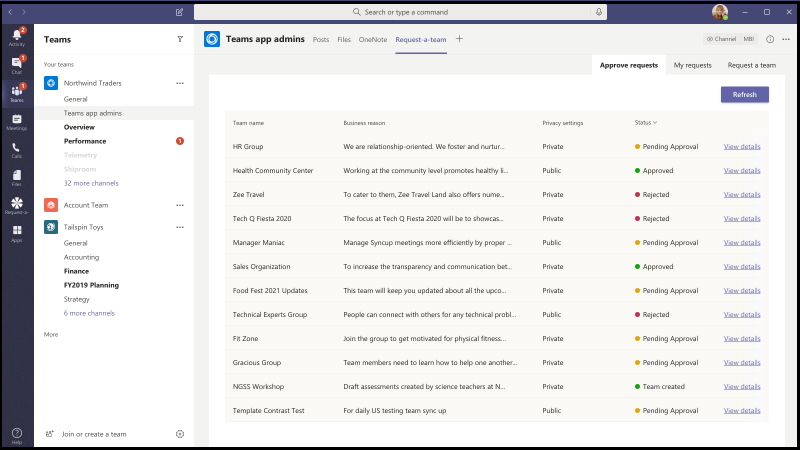
:::column-end:::
:::row-end:::

## Scrums для каналовScrums for Channels

Scrums for Channels — это приложение-помощник scrum, которое позволяет пользователям планировать и запускать scrums в каналах в Microsoft Teams.Scrums for Channels is a scrum assistant app that enables users to schedule and run scrums in channels within Microsoft Teams. Приложение отлично подходит для удаленных групп и групп, состоящих из участников из различных географических расположений и часовых поясов, чтобы обмениваться ежедневными обновлениями и обеспечивать участие в заседаниях стендап scrum.The app is great for remote teams and teams comprised of members from varied geographical locations and time zones to share daily updates and ensure participation in scrum stand-up meetings.

[Получите его на GitHubGet it on GitHub](https://github.com/OfficeDev/microsoft-teams-apps-scrumsforchannels)

> [!NOTE]
> Для проведения собраний по scrum в групповом чате см. [шаблон приложения Scrums for Group Chat.](#scrums-for-group-chat)To conduct scrum meetings in a group chat, see [Scrums for Group Chat](#scrums-for-group-chat) app template.

:::row:::
  :::column span="2":::
    
:::column-end:::
:::row-end:::
:::row:::
:::column span="2":::
    
:::column-end:::
:::row-end:::

## Scrums для группового чатаScrums for Group Chat

> [!NOTE]
> Шаблон приложения Состояния Scrums обновляется и теперь является Scrums для группового чата.The Scrums Status app template is updated and is now Scrums for Group Chat.

Scrums для группового чата является вспомогательным помощником scrum, который позволяет участникам группового чата запускать асинхронные собрания и легко делиться своими ежедневными обновлениями.Scrums for Group Chat is a supportive scrum assistant that enables group chat members to run asynchronous stand-up meetings and easily share their daily updates. Это позволяет всем участникам группового чата вносить вклад в схватку и просматривать обновления, сделанные другими пользователями в рабочей схватке.It allows all members of the group chat to contribute to the scrum and view the updates made by others in the running scrum.

[Получите его на GitHubGet it on GitHub](https://github.com/OfficeDev/microsoft-teams-apps-scrumsforgroupchat)

## Share NowShare Now 

Приложение Share Now способствует позитивному обмену информацией между коллегами, позволяя пользователям легко обмениваться контентом в Teams среде.The Share Now app promotes the positive exchange of information between colleagues by enabling your users to easily share content within the Teams environment. Пользователи вовлекли приложение в обмен элементами, которые интересуют участников группы, обнаруживая новое общее содержимое, задав предпочтения и закладки для более позднего чтения.Users engage the app to share items of interest with team members, discover new shared content, set preferences, and bookmark favorites for later reading.

[Получите его на GitHubGet it on GitHub](https://github.com/OfficeDev/microsoft-teams-apps-sharenow)

## Поиск в списке SharePointSharePoint List Search

Совместная Microsoft Teams часто ссылается на сведения, содержащиеся в элементов в SharePoint списке.Collaboration in Microsoft Teams quite often references information contained within items in a SharePoint list. Вклей ссылку на этот элемент заставляет всех переключать контекст из беседы, находить необходимые сведения, а затем возвращаться Teams для продолжения беседы.Paste a link to the item in question forces everyone to switch context away from the conversation, find the needed information, then return to Teams to continue the conversation. По мере того как беседа продолжается, люди должны несколько раз переключаться на справочный элемент, чтобы проверить новые комментарии и обновить воспоминания о сведениях, содержащихся в элементе.As the conversation continues  people have to switch back to the reference item multiple times to verify new comments and refresh their memories of the information contained within the item. Это переключение контекста создает барьер для плавного взаимодействия.This context switching creates a barrier to smooth collaboration.
Для решения этой проблемы используется шаблон приложения поиска списков.To resolve this problem, the List Search app template is used. Многие пользователи используют SharePoint для питания некоторых основных процессов в своих организациях.Many users use SharePoint to power some of the core workflows in their organizations. Однако совместная работа со списками затруднена.However, collaborating around lists is difficult. Используя шаблон приложения поиска списка в Microsoft Teams, пользователи могут вставлять сведения из SharePoint элементов списка непосредственно в чате, чтобы облегчить переключение контекста, вызванное при простом включении ссылки в чат.Using the List Search app template in Microsoft Teams, users can insert information from SharePoint list items directly within a chat conversation to alleviate the context-switching caused when simply inserting a link into a chat. Эти сведения вставляются в виде легко читаемой автоформатной карты, помогая пользователям оставаться в стороне от беседы.The information is inserted as an easy-to-read auto-formatted card, helping the users stay engaged in the conversation.

[Получите его на GitHubGet it on GitHub](https://github.com/OfficeDev/microsoft-teams-list-search-app)

## Регистрация персоналаStaff Check-ins

Регистрация персонала — это приложение [на](/powerapps/powerapps-overview) Power Apps, которое позволяет контролировать связь между бизнесом и персоналом на местах.Staff Check-ins is a [Power Apps](/powerapps/powerapps-overview) based app that enables oversight communication between your business and field personnel. Сотрудники могут легко предоставлять критически важные для времени сведения и обновления состояния непосредственно из Teams.Staff can easily provide time-critical information and status updates on either a scheduled or ad-hoc basis directly from Teams. Приложение поддерживает расположение в режиме реального времени, фотографии, заметки, уведомления о напоминаниях и автоматизированные процессы работы.The app supports real-time location, photos, notes, reminder notifications, and automated workflows.

[Получите его на GitHubGet it on GitHub](https://github.com/OfficeDev/microsoft-teams-apps-staffcheckins)

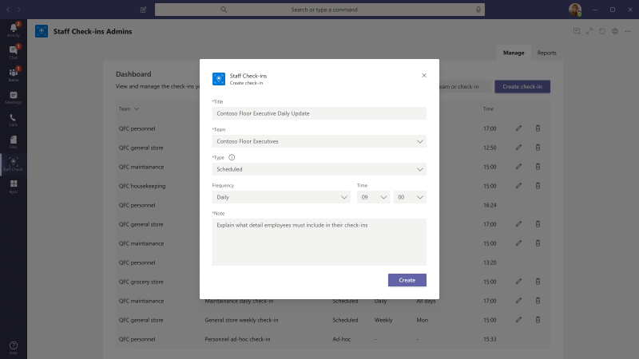

## ОпросSurvey

Survey — это настраиваемое приложение Microsoft Teams для расширения обмена сообщениями, которое позволяет создавать опрос в чате или канале для сбора данных и получения информации. Survey is a custom Microsoft Teams [messaging extension](../messaging-extensions/what-are-messaging-extensions.md) app that enables you to create a survey in a chat or a channel to gather data and gain actionable insight. Приложение поддерживается во всех Teams платформах, таких как настольный компьютер, браузер, iOS и Android, и готово к развертыванию в рамках Microsoft 365 подписки.The app is supported across all Teams platform clients, such as desktop, browser, iOS, and Android and is ready for deployment as part of your Microsoft 365 subscription.  

[Получите его на GitHubGet it on GitHub](https://github.com/OfficeDev/Microsoft-Teams-Survey-app)

:::row:::
  :::column span="2":::
    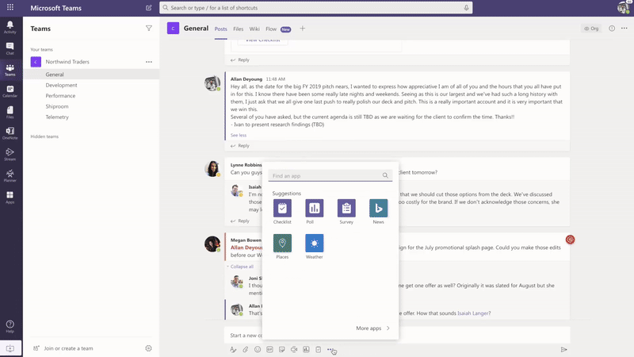
:::column-end:::
:::row-end:::

## Время TallyTime Tally 

Проект может включать несколько задач, а сотрудникам могут быть назначены различные проекты.A project can include multiple tasks, and various projects can be assigned to employees. Руководители должны понимать ход выполнения проекта за время, затраченное сотрудниками на выполнение этих задач.Managers are required to understand the project progress through the time spent by the employees on these tasks. Это может быть громоздким действием, так как сотрудникам необходимо заполнить таблицы.This can be a cumbersome activity, as the employees need to fill in the timesheets. Приложение Time Tally позволяет сотрудникам быстро заполнять свои таблицы с помощью мобильного устройства, а руководителям не нужно следить за сотрудниками во время записи.Time Tally app enables employees to fill their timesheets quickly, using the mobile device, and managers do not have to follow up with employees on the timesheet entry. Руководители получают возможность просматривать использование проекта на основе ресурсов и могут утверждать или отклонить записи.Managers get to view the project utilization based on resources, and they can approve or reject the entries. Уведомления о напоминаниях отправляются для обеспечения соответствия времени.Reminder notifications are sent to ensure timesheet compliance. Кроме того, для аналитики доступны исторические данные и использование.Also, historical data and utilizations are available for analytics.

[Получите его на GitHubGet it on GitHub](https://github.com/OfficeDev/microsoft-teams-apps-timetally)

## Обучение &#9734;Training  &#9734;

Обучение — это настраиваемая программа расширения [Teams](../messaging-extensions/what-are-messaging-extensions.md) обмена сообщениями, которая позволяет пользователям публиковать обучение в чате или канале для автономного обмена знаниями и upskilling.Training is a custom [Teams messaging extension](../messaging-extensions/what-are-messaging-extensions.md) app that enables users to publish a training within a chat or a channel for offline knowledge sharing and upskilling. Приложение поддерживается несколькими Teams платформами, такими как настольный компьютер, браузер, iOS и Android.The app is supported across multiple Teams platform clients, such as desktop, browser, iOS, and Android. Это приложение готово к развертыванию в рамках Microsoft 365 подписки.This app is ready for deployment as part of your Microsoft 365 subscription.

[Получите его на GitHubGet it on GitHub](https://github.com/OfficeDev/microsoft-teams-apps-training)

:::row:::
  :::column span="1":::
      
:::column-end:::
:::row-end:::

## Виртуальное округлениеVirtual Rounding

Поставщики больничных и экстренных служб делают много **обходов** в день.Hospital and emergency room providers make many **rounds** per day. Эти быстрые проверки для пациентов предназначены для проверки состояния пациента и обеспечения решения проблем пациента.These quick check-ins on patients are intended to provide a status check on how the patient is doing and ensure that the patient’s concerns are addressed. Хотя округление является важной практикой для обеспечения контроля за пациентами несколькими типами поставщиков, они представляют собой огромную утечку на PPE, так как для каждого посещения, от каждого поставщика, новая маска и новый набор перчаток используются.While rounding is an essential practice to ensure patients are being monitored by multiple types of providers, they represent a huge drain on PPE, because for each visit, from each provider, a new mask, and new set of gloves are used. С помощью этих шаблонов приложений медицинские работники могут легко проводить обходы виртуально, Microsoft Teams встречу между поставщиком и пациентом.With this app templates, medical workers can easily conduct rounds virtually, through a Microsoft Teams meeting between the provider and the patient.

Решение виртуального округлиния также ссылается в блоге Microsoft Health и Life [Sciences.](https://aka.ms/teamsvirtualrounding)The Virtual Rounding solution is also referenced in the Microsoft Health and Life Sciences [blog post](https://aka.ms/teamsvirtualrounding).

[Получите его на GitHubGet it on GitHub](https://github.com/SmartterHealth/Virtual-Rounding)

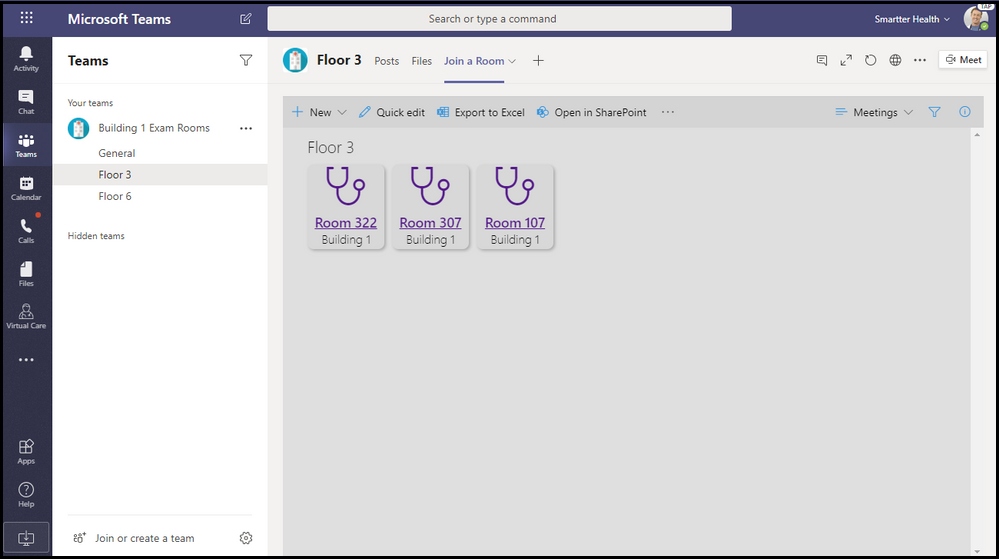

## Управление посетителямиVisitor Management

Приложение Управления посетителями позволяет вашей организации и сотрудникам легко и эффективно управлять процессом посетителей на месте непосредственно из Microsoft Teams.The Visitor Management app enables your organization and employees to easily and efficiently manage the on-site visitor process, directly from Microsoft Teams. Приложение позволяет сотрудникам создавать запросы посетителей, централизованно отслеживать состояние запроса через панель мониторинга посетителей и получать уведомления в режиме реального времени при прибытии посетителя.The app enables employees to create visitor requests, centrally track a request status through the visitor dashboard, and receive real-time notifications when a visitor arrives.

[Получите его на GitHubGet it on GitHub](https://github.com/OfficeDev/microsoft-teams-app-visitormanagement)

:::row:::
  :::column span="2":::
    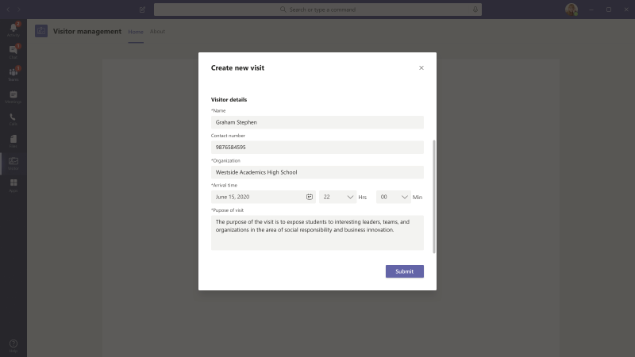
:::column-end:::
:::row-end:::
:::row:::
:::column span="2":::
    
:::column-end:::
:::row-end:::

## Награды на рабочем местеWorkplace Awards

Workplace Awards — это шаблон Teams, который обеспечивает положительные рамки, которые способствуют признанию и развитию культуры оценки сотрудников на современном рабочем месте.Workplace Awards is a Teams app template that provides a positive framework to foster recognition and encourage the culture of employee appreciation in the modern workplace. Приложение позволяет настроить и управлять наградами и распознаванием сотрудников под названием R&R, где сотрудники могут легко назначать и поддерживать коллег, а лидер R&R может просматривать представленные номинации, гранты и объявлять получателей.The app enables you to setup and manage an employee rewards and recognition, called R&R program where employees can easily nominate and endorse colleagues and your R&R leader can view submitted nominations, grant awards, and announce recipients.

[Получите его на GitHubGet it on GitHub](https://github.com/OfficeDev/microsoft-teams-apps-workplaceawards)

:::row:::
  :::column span="2":::
    
:::column-end:::
:::row-end:::
:::row:::
:::column span="2":::
    
:::column-end:::
:::row-end:::

Дополнительные сведения о шаблоне приложений см. в [шаблоне App.](https://forms.office.com/Pages/ResponsePage.aspx?id=v4j5cvGGr0GRqy180BHbR2_7qFm_lcZAr4eqEhnLsZ9UMVZGT1lCT0FXUDdZMUM0RkpBS1BESTAwWC4u)For more information on app template, see [App template](https://forms.office.com/Pages/ResponsePage.aspx?id=v4j5cvGGr0GRqy180BHbR2_7qFm_lcZAr4eqEhnLsZ9UMVZGT1lCT0FXUDdZMUM0RkpBS1BESTAwWC4u).

## См. такжеSee also

[Интеграция веб-приложенийIntegrate web apps](~/samples/integrate-web-apps-overview.md)
