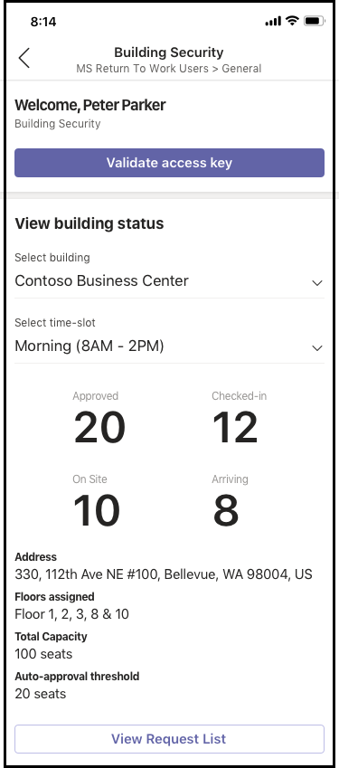
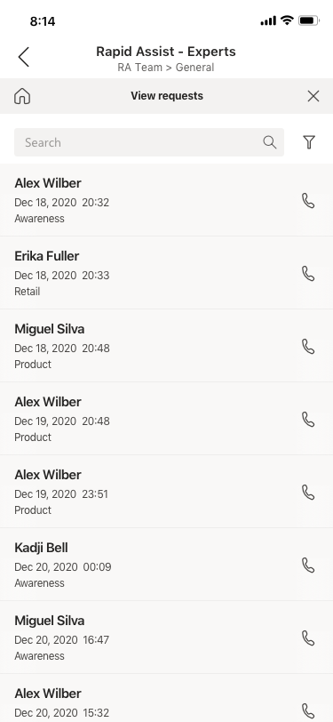

# Шаблоны приложений для Microsoft TeamsApp Templates for Microsoft Teams

Шаблоны приложений — это готовые к выпуску приложения для Microsoft Teams, управляемые сообществом, с открытым кодом и доступные на GitHub.App templates are production-ready apps for Microsoft Teams that are community driven, open-source, and available on GitHub. Каждый из них содержит подробные инструкции по развертыванию и установке этого приложения для вашей организации, предоставляя готовое приложение, которое можно установить и начать использовать немедленно.Each contains detailed instructions for deploying and installing that app for your organization, providing a ready-to-use app that you can install and begin using immediately. Кроме того, доступен полный исходный код, чтобы вы могли подробно изучить его или разветвить код и изменить его для удовлетворения конкретных потребностей.The complete source code is available as well, so you can explore it in detail, or fork the code and alter it to meet your specific needs.

**&#9734; указывает только что выпущенные шаблоны приложений.****&#9734; Indicates newly released app templates.**

### Основные преимуществаKey benefits

* **Подключаемый модуль и игровое подключение:** Все шаблоны приложений включают сценарии развертывания, которые позволят вам размещение всех необходимых служб в Microsoft Azure.**Plug and play experience:** All app templates include deployments scripts that will allow you to host all necessary services in Microsoft Azure. Для развертывания приложений не требуется кодирование.No coding is required to deploy the apps.
* **Код, готовый к выпуску:** Шаблоны приложений соответствуют рекомендациям по безопасности и инфраструктуре, и все внесенные в них изменения, внесенные сообществом, проверяются на соответствие требованиям.**Production-ready code:** The app templates conform to recommended best practices around security and infrastructure, and all community submitted changes to them are reviewed to ensure continued conformance.
* **Настраиваемые и extensible:** Хотя все шаблоны приложений готовы к развертыванию в полном формате, мы предоставляем всю базу кода и скрипты развертывания, чтобы вы могли легко настраивать или расширять их в своих уникальных потребностях.**Customizable and extensible:** While all app templates are ready to deploy as they are, we provide the entire code base and deployment scripts so that you can easily customize or extend them to fit your unique needs.
* **Подробная документация & поддержки:** Все шаблоны приложений сопровождаются всей документацией по архитектуре, развертыванию и настройке решения.**Detailed documentation & support:** All app templates are accompanied by end-to-end documentation on solution architecture, deployment, and configuration steps. Также отслеживаются репозитории, поэтому сообщайте о любых проблемах, с которыми вы столкнулись, выдав сообщение о проблеме на GitHub.The repositories are monitored as well, so please report any issues you encounter by raising an Issue on GitHub.

## Диспетчер &#9734;Appointment Manager &#9734;

Диспетчер встреч — это шаблон приложения Teams, который помогает предприятиям создавать, управлять и проводить виртуальные встречи с клиентами через Teams.Appointment Manager is a Teams app template to help businesses create, manage, and conduct virtual appointments with consumers through Teams. Новые запросы на встречи от потребителей видны в каналах Teams, где их можно быстро назначить и переназначить сотрудникам в команде.New appointment requests from consumers are visible in Teams channels, where they can quickly be assigned and reassigned to staff in a team. Запросы на встречу можно просматривать на уровне команды или на личном уровне с помощью настраиваемой вкладки.Appointment requests can be viewed at team or personal levels through custom tabs. Каждая встреча связана с онлайн-собранием Teams, поэтому сотрудники и пользователи могут легко присоединиться к собранию в запланированное время.Every appointment is associated with a Teams online meeting, hence the staff and consumers can easily join the meeting at the scheduled time.

Шаблон приложения интегрируется с Microsoft Bookings для простого управления встречами.The app template integrates with Microsoft Bookings for easy appointment management. Запланированные встречи автоматически отображаются в календарях сотрудников, а пользователи получают настраиваемые уведомления и напоминания по электронной почте с внедренными ссылками на собрания.Scheduled appointments automatically appear on assigned staff members' calendars, and consumers receive customizable email notifications and reminders with embedded meeting links.

[Get it on GitHubGet it on GitHub](https://github.com/OfficeDev/microsoft-teams-apps-appointment-manager)

 

## Ask AwayAsk Away

Ask Away — это [бот Microsoft Teams,](../bots/what-are-bots.md) который позволяет пользователям проводить&вопросов и ответов в Teams.Ask Away is a [Microsoft Teams bot](../bots/what-are-bots.md) that enables users to conduct Q&A (Question and Answer) sessions within Teams. С помощью бота Ask Away участники команды могут отправлять и голосовать вопросы, общие коллегами, позволяя Q&Ведущих, чтобы легко собирать вопросы с самых разных ответов в канале или чате.Using the Ask Away bot, team members can submit and up-vote questions shared by colleagues allowing Q&A hosts to easily gather top-of-mind questions within a channel or chat. Бот можно использовать для проведения Q-&в режиме реального времени в собрании Teams и позволяет участникам отправлять вопросы в режиме реального времени через чат.The bot can be used to conduct a real-time Q&A session in a Teams meeting and allows attendees to submit questions live via chat.

[Get it on GitHubGet it on GitHub](https://github.com/OfficeDev/microsoft-teams-apps-askaway)

:::row:::
  :::column span="2":::
      
:::column-end:::
:::row-end:::

## Вспомогательная аналитикаAssociate Insights

Associate Insights — это шаблон [Power Apps,](/powerapps/maker/canvas-apps/embed-teams-app) который позволяет сотрудникам без труда напрямую фиксировать и отправлять отзывы клиентов, тональности и восприятие.Associate Insights is a [Power Apps](/powerapps/maker/canvas-apps/embed-teams-app) template that empowers firstline workers to directly capture and submit customer opinion, sentiment, and perception. Сотрудники firstline часто являются первым представителем компании, который участвует с клиентами в контактной точке "один к одному".Firstline workers are often the first company representative to engage with customers in a one-to-one point-of contact. Собранные данные могут совместно использоваться бизнес-командами, например с помощью вкладки Power BI Teams, для улучшения продукта и улучшения качества взаимодействия с клиентом.The collected data can be shared and used collaboratively by business teams, e.g., via a Power BI Teams tab, for product improvement and enhancing the customer experience.

[Get it on GitHubGet it on GitHub](https://github.com/OfficeDev/microsoft-teams-apps-associateinsights)

:::row:::
  :::column span="2":::
      
:::column-end:::
:::row-end:::
:::row:::
:::column span="2":::
    
:::column-end:::
:::row-end:::

## ПрисутствиеAttendance

Приложение "Присутствие" — это [вкладка Power Apps,](/powerapps/maker/canvas-apps/embed-teams-app) которую можно закрепить в команде.The Attendance app is a [Power Apps](/powerapps/maker/canvas-apps/embed-teams-app) tab that can be pinned in a team. Он предназначен для записи присутствия, как правило, в таких параметрах, как учебные и учебные среды.It is designed to record presence, typically in settings such as learning and training environments. Пользователи могут пометить или изменить присутствие в течение 30 дней в прошлом и просматривать итоги отчетов о посещении для всей группы или отдельных участников.Users can mark or edit attendance for up to 30 days in the past and view summarized attendance reports for an entire group or individual attendees.

[Get it on GitHubGet it on GitHub](https://github.com/OfficeDev/microsoft-teams-apps-attendance)

## Book-a-roomBook-a-room

Book-a-room — это бот [Microsoft Teams,](../bots/what-are-bots.md) который позволяет пользователям быстро находить и резервировать комнату для собраний на 30 (по умолчанию), 60 или 90 минут, начиная с текущего времени.Book-a-room is a [Microsoft Teams bot](../bots/what-are-bots.md) that lets users quickly find and reserve a meeting room for 30 (default), 60, or 90 minutes starting from the current  time. Бот book-a-room имеет область личных или 1:1 бесед.The Book-a-room bot scopes to personal or 1:1 conversations.

[Get it on GitHubGet it on GitHub](https://github.com/OfficeDev/microsoft-teams-apps-bookaroom)

## Доступ к построениюBuilding Access

Building Access — это приложение на основе Платформы Microsoft [Power Platform,](https://powerapps.microsoft.com/blog/now-in-preview-customize-teams-with-built-in-power-platform-capabilities/)которое поддерживает администрирование порогов занятости и социальных сетей, позволяя директорам объектов управлять присутствием сотрудников на сайте, отслеживать и сообщать о них.Building Access is a Microsoft [Power Platform](https://powerapps.microsoft.com/blog/now-in-preview-customize-teams-with-built-in-power-platform-capabilities/)-based app that supports the administration of building occupancy thresholds and social distancing norms by enabling facilities directors to manage, track, and report employee on-site presence. Приложение, построенное с помощью Microsoft [Power Apps](/powerapps/powerapps-overview)и [Power Automate,](/power-automate/getting-started)глубоко интегрируется с Microsoft Teams и позволяет организациям определять готовность к построению, устанавливать критерии соответствия для доступа на сайте и собирать сведения для будущего планирования.The app, built using Microsoft [Power Apps](/powerapps/powerapps-overview), and [Power Automate](/power-automate/getting-started), deeply integrates with Microsoft Teams and enables organizations to determine building readiness, establish eligibility criteria for on-site access, and gather insights for future planning.

[Get it on GitHubGet it on GitHub](https://github.com/OfficeDev/microsoft-teams-apps-buildingaccess)

:::row:::
   :::column span="":::
     
   :::column-end:::
   :::column span="":::
      
   :::column-end:::
:::row-end:::

## ПраздникиCelebrations

Праздники — это приложение Teams, которое помогает участникам команды отмечать дни рождения, годовщины и другие повторяющиеся события.Celebrations is a Teams app that helps team members celebrate each others' birthdays, anniversaries, and other recurring events. Он запоминает особые случаи для всех участников команды и отправляет приветственное сообщение во всех командах, выбранных на момент создания события, чтобы участники команды были особенными в свой день.It remembers special occasions of all the team members and sends a friendly message in all the teams selected at the time of event creation, to make the team members feel special on their day.

Приложение предоставляет простой интерфейс для всех участников команды, которые могут добавлять и просматривать свои события, а также позволяет пользователю выбирать команды, в которых будут делиться событиями.The app provides an easy interface for all the team members to personally add and view their events and also allows the user to select the teams in which the events gets shared.

[Get it on GitHubGet it on GitHub](https://github.com/OfficeDev/microsoft-teams-celebrations-app)

## Контрольный списокChecklist

Контрольный список — это пользовательское приложение расширения обмена сообщениями Microsoft [Teams,](../messaging-extensions/what-are-messaging-extensions.md) которое позволяет вам сотрудничать с командой путем создания общего контрольного списка в чате или канале.Checklist is a custom Microsoft Teams [messaging extension](../messaging-extensions/what-are-messaging-extensions.md) app that enables you to collaborate with your team by creating a shared checklist in a chat or channel. Приложение поддерживается во всех клиентах платформы Teams ( настольных компьютерах, браузерах, iOS и Android) и готово к развертыванию в рамках подписки на Microsoft 365.The app is supported across all Teams platform clients —  desktop, browser, iOS, and Android — and is ready for deployment as part of your Microsoft 365 subscription.  

[Get it on GitHubGet it on GitHub](https://github.com/OfficeDev/microsoft-teams-checklist-app )

:::row:::
:::column span="2":::
      
:::column-end:::
:::row-end:::

## Аудитории для &#9734;Classroom Drop-in &#9734;

"Класс" — это приложение на основе Платформы Microsoft [Power Platform,](https://powerapps.microsoft.com/blog/now-in-preview-customize-teams-with-built-in-power-platform-capabilities/)которое позволяет руководителям систем находить группы класса (виртуальные аудитории) и добавлять себя или других в эти группы класса в течение указанного периода, если это необходимо.Classroom Drop-in is a Microsoft [Power Platform](https://powerapps.microsoft.com/blog/now-in-preview-customize-teams-with-built-in-power-platform-capabilities/)-based app that enables system leaders to find class teams (virtual classrooms) and add themselves or others to these class teams for a specified drop-in period, as needed. Приложение, построенное с помощью Microsoft [Power Apps](/powerapps/powerapps-overview) и [Power Automate,](/power-automate/getting-started)глубоко интегрируется с Microsoft Teams, чтобы убедиться, что образовательные учреждения могут оптимизировать свою работу в гибридной среде обучения, предоставляя доступ соответствующим заинтересованным лицам для учебных групп по бизнес-требованиям.The app built using Microsoft [Power Apps](/powerapps/powerapps-overview) and [Power Automate](/power-automate/getting-started), deeply integrates with Microsoft Teams to ensure educational institutes can optimize their operations in a hybrid learning environment by providing access to relevant stakeholders for class teams per business requirements.

[Get it on GitHubGet it on GitHub](https://github.com/OfficeDev/microsoft-teams-apps-classroom-dropin)

## Корпоративный CommunicatorCompany Communicator

Приложение корпоративной Communicator позволяет корпоративным командам создавать и отправлять сообщения, предназначенные для нескольких команд или большого количества сотрудников, через чат, позволяя организации связаться с сотрудниками прямо там, где они взаимодействуют.The Company Communicator app enables corporate teams to create and send messages intended for multiple teams or large number of employees over chat allowing organization to reach employees right where they collaborate. Используйте этот шаблон для нескольких сценариев, таких как новые объявления по инициативе, въеха сотрудников, современное обучение и разработка или широковещательные трансляции на всей организации.Utilize this template for multiple scenarios such as new initiative announcements, employee onboarding, modern learning and development or organization-wide broadcasts.

Приложение предоставляет простой интерфейс для создания, предварительного просмотра, совместной работы и отправки сообщений.The app provides an easy interface for designated users to create, preview, collaborate and send messages.

Он предоставляет основу для создания специальных целевых возможностей связи, таких как настраиваемая телеметрия, о том, сколько пользователей подтверждали или взаимодействовали с сообщением.It provides a foundation to build custom targeted communication capabilities such as custom telemetry on how many users acknowledged or interacted with a message.

[Get it on GitHubGet it on GitHub](https://github.com/OfficeDev/microsoft-teams-company-communicator-app)

## Подыском группы контактовContact Group Lookup

Приложение "Подыском группы контактов" предоставляет удобный и полезный подход к созданию, доступу и управлению группами контактов организации (прежнее название — списки рассылки или группы связи).The Contact Group Lookup app provides a convenient and useful approach to creating, accessing, and managing your organization's contact groups (formerly known as distribution lists or communication groups). Пользователи могут быстро просматривать и общаться в чате с участниками группы, просматривать состояние участников и создавать групповой чат с выбранными участниками в группе контактов в среде Teams.Users can quickly view and chat with group members, view member status, and create a group chat with selected members in the contact group, all within the Teams environment.

[Get it on GitHubGet it on GitHub](https://github.com/OfficeDev/microsoft-teams-app-contactgrouplookup)

:::row:::
:::column span="2":::
      
:::column-end:::
:::row-end:::
:::row:::
:::column span="2":::
    
:::column-end:::
:::row-end:::

## Совместное рабочего &#9734;Co-worker Appreciation &#9734;

С помощью шаблона шаблона рабочего процесса в Microsoft Teams пользователи могут распознавать достижения коллег в контексте Teams.Using the co-worker appreciation template in Microsoft Teams, users can recognize their colleagues' achievements within the Teams’ context. Когда коллеги выбирают, чтобы вознаградить коллегу, получатели и другие участники команды помечаются в беседе канала и получают уведомление о сведениях о награде канала.When co-workers select to reward a colleague, recipients and other team members are tagged in a channel conversation and they receive a notification about the channel's award details. Эти данные записывают в приложение Teams, которое является безопасным, переносимым и легкодоступным.The awards are recorded in the Teams app, which is secure, portable, and easily shareable. Это может рассматриваться как версия шаблона приложения "Открытые индикаторы событий" на основе PowerApps с таблицей лидеров.This can be considered as the PowerApps based version of the Open Badges app template, with a leaderboard.

[Get it on GitHubGet it on GitHub](https://github.com/OfficeDev/microsoft-teams-apps-coworker-appreciation)

## CrowdSourcerCrowdSourcer

CrowdSourcer — это бот [Microsoft Teams,](../bots/what-are-bots.md) который предоставляет участникам группы запрашиваемую информацию, которую совместно запрашивают участники группы.CrowdSourcer is a [Microsoft Teams bot](../bots/what-are-bots.md) that gives teams queried information sourced collaboratively from group members. Это отличный способ ответить на часто задамые вопросы, позволяя участникам активно участвовать и вносить свой вклад в интересный и полезный информационный ресурс.It's a great way to answer frequently asked questions while enabling participants to actively engage in and contribute to a fun and helpful information resource.

[Get it on GithubGet it on Github](https://github.com/OfficeDev/microsoft-teams-crowdsourcer-app)

## Пользовательские наклейкиCustom Stickers

Самостоятельное выражение является основой для правильной культуры команды.Self-expression is core to a healthy team culture. Этот шаблон приложения является расширением [обмена](~/messaging-extensions/what-are-messaging-extensions.md) сообщениями, которое позволяет пользователям использовать пользовательские стикеры и GIF в Microsoft Teams.This app template is a [messaging extension](~/messaging-extensions/what-are-messaging-extensions.md) that enables your users to use custom stickers and GIFs within Microsoft Teams. Этот шаблон обеспечивает простую веб-настройку, в которой любой пользователь с доступом к конфигурации может отправить GIF- или стикеры/изображения, которые должны иметь конечные пользователи, позволяя всей команде использовать любой выбранный вами набор стикеров.This template provides an easy web-based configuration experience where anyone with configuration access can upload the GIFs/stickers/images they want their end-users to have, allowing your entire team to use any set of stickers you chose.

Это приложение также обеспечивает простой общий доступ к изображениям, GIF-изображениям и стикерам в командах без доступа к сайтам SharePoint или отдельным каналам в качестве механизмов хранения и общего доступа.This app also enables easy sharing of images/GIFs/stickers across teams without needing access to SharePoint sites or individual channels as storage and sharing mechanisms. Например, группы продуктов могут легко делиться изображениями продуктов и GIF-изображениями с социальными медиа, маркетингом и группами продаж программными средствами.For example, product teams can easily share product images and GIFs to social media, marketing and sales teams programmatically. Можно также расширить это приложение, активирует поток уведомлений для определенных групп или отдельных пользователей, когда доступны новые изображения/GIF.One can also extend this app by triggering a notification flow to specific teams/individuals when new images/GIFs are made available.

[Get it on GitHubGet it on GitHub](https://github.com/OfficeDev/microsoft-teams-stickers-app)

## Идеи сотрудников &#9734;Employee Ideas &#9734;

Приложение "Идеи сотрудников" — это версия PowerApps шаблона приложения "Отличные идеи" на основе Azure.The Employee Ideas app is the PowerApps version of the Azure based Great Ideas app template. Приложение позволяет пользователям Teams настраивать и настраивать кампанию идеи.The app enables the Teams users to set up and configure an idea campaign. Идею кампании — это категория для группировки идей по общим темам.An idea campaign is a category for grouping ideas around common themes.

Пользователи Teams также могут выполнять следующие действия:Teams users can also perform following activities:
* Настройте стандартную форму отправки, которую сотрудники должны отправить для каждой идеи.Configure a standard submission form that employees need to submit for each idea. 
* Просмотрите идеи и список кампаний и управляйте ими.Review and manage the ideas and list of campaigns.
* Изменение и удаление кампаний.Modify and delete campaigns.
* Просмотрите советы лидеров по идеям.Review leader boards of ideas.
* Проголосуйте за и разделяйте приоритетные идеи.Vote for and share prioritized ideas.
* Отправка идей для кампании.Submit ideas for a campaign.
* Просмотр идеи другого участника команды.View other team member's idea.
* Проголосуйте за наиболее понравились идеи.Vote on most liked ideas.
* Просмотрите эффективность их идей по сравнению с другими в рамках кампании.Review the performance of their ideas compared with others within a campaign.

[Get it on GitHubGet it on GitHub](https://github.com/OfficeDev/microsoft-teams-apps-employeeideas)

 

## Электронные рецептыE-Prescriptions 

E-Рецепты — это приложение на основе [Power Apps,](/powerapps/maker/canvas-apps/embed-teams-app)которое улучшает телеметрию и виртуальную помощь, автоматизирующее процесс выдачи рецептов для пациентов.E-Prescriptions is a [Power Apps](/powerapps/maker/canvas-apps/embed-teams-app)-based app that enhances telemedicine and virtual care by automating the process of issuing e-prescriptions to patients. Медицинские специалисты могут быстро просмотреть встречи, создать электронные рецепты и отправлять письма с вложениями по электронной почте непосредственно на платформе Teams.Medical professionals can quickly review appointments, generate e-prescriptions, and send emails with e-prescription attachments to patients directly within the Teams platform.

[Get it on GitHubGet it on GitHub](https://github.com/OfficeDev/microsoft-teams-apps-eprescription) 

:::row:::
:::column span="2":::
      
:::column-end:::
:::row-end:::
:::row:::
:::column span="2":::
    
:::column-end:::
:::row-end:::

## Обучение сотрудниковEmployee Training 

Обучение сотрудников — это приложение Microsoft Teams, которое позволяет организаторам легко публиковать, отслеживать и продвигать учебные мероприятия для вашей организации.Employee training is a Microsoft Teams app that enables organizers to easily publish,  track, and promote learning and training events for your organization.  С помощью приложения планировщики событий могут отправлять напоминания и уведомления регистраторам событий, а сотрудники могут указывать на интерес к предстоящим событиям, обновлять текущие события и делиться сведениями о событиях с коллегами через расширение обмена сообщениями Teams.With the app, event planners can send reminders and notifications to event registrants and employees can indicate interest in upcoming events, stay updated on current events, and share event details with colleagues via the Teams messaging extension.

[Get it on GitHubGet it on GitHub](https://github.com/OfficeDev/microsoft-teams-apps-employeetraining)

:::row:::
:::column span="2":::
    **Просмотр событий обучения сотрудников** **View employee training events**   
:::column-end:::
:::row-end:::
:::row:::
:::column span="2":::
    **Создание обучающего события для сотрудников** **Create employee training event** 
:::column-end:::
:::row-end:::

## Expert FinderExpert Finder

"Поиск экспертов" — это бот [Microsoft Teams,](../bots/what-are-bots.md) который идентифицирует определенных членов организации на основе их навыков, интересов и атрибутов обучения.Expert Finder is a [Microsoft Teams bot](../bots/what-are-bots.md) that identifies specific organization members based on their skills, interests, and education attributes. Участники находят в организации экспертов, которые соответствуют поиску по ключевым словам профилей пользователей Azure Active Directory.Members find experts within an organization  that match a keyword search of Azure Active Directory user profiles.

[Get it on GitHubGet it on GitHub](https://github.com/OfficeDev/microsoft-teams-apps-expertfinder)

## Вопросы и ответы плюсFAQ Plus

Вопросы и ответы&боты — это простой способ предоставления ответов на часто задамые вопросы пользователей.Conversational Q&A bots are an easy way to provide answers to frequently asked questions by users. Однако большинство ботов не могут взаимодействовать с пользователями осмысленно, так как при сбойе бота в цикле нет человека.However, most bots fail to engage with users in meaningful way because there is no human in the loop when the bot fails. Бот вопросы и вопросы — это&бот, который вызывает человека в цикле, когда не может помочь.FAQ bot is a friendly Q&A bot that brings a human in the loop when it is unable to help. Можно задать боту вопрос, а бот отвечает ответом, если он содержится в базе знаний.One can ask the bot a question and the bot responds with an answer if it is contained in the knowledge base. В этом случае бот позволяет пользователю отправить запрос, который затем будет опубликован предварительно настроенной группе экспертов, которые помогут обеспечить поддержку, выступая на основе уведомлений из самой команды.If not, the bot allows the user to submit a query which then gets posted to a pre-configured team of experts who help to provide support by acting upon the notifications from within the team itself.

> [!NOTE]
> Последний выпуск **faq Plus** поддерживает улучшенные вопросы и&решения, позволяя группе экспертов выполнить следующие действия:The latest release of **FAQ Plus** supports improved Q&A resolutions by enabling a team of experts to complete the following:
>
> &#x2714; добавить новые вопросы&как непосредственно в базу знаний с помощью расширений сообщений.&#x2714; Add new Q&As directly to the knowledge base using message extensions.
>
> &#x2714; изменения и удаления Q&пары, добавленные ботом.&#x2714; Edit and delete Q&A pairs added by a bot.
>
> &#x2714; отслеживание истории редакций Q&As.&#x2714; Track the revision history of Q&As.
>
> &#x2714; настроить ответ с дополнительными сведениями для отображения в качестве [адаптивной карточки.](../task-modules-and-cards/cards/cards-reference.md#adaptive-card)&#x2714; Configure an answer with additional details to display as an [adaptive card](../task-modules-and-cards/cards/cards-reference.md#adaptive-card).
>
[Get it on GitHubGet it on GitHub](https://github.com/OfficeDev/microsoft-teams-apps-faqplusv2)

## Отслеживание целиGoal Tracker

Приложение "Отслеживание целей" — это комплексное решение для вашей организации, которое поддерживает установление целей, отслеживание хода выполнения и подтверждение успеха в Microsoft Teams.The Goal Tracker app is a comprehensive solution for your organization to support establishing goals, observing progress, and acknowledging success within Microsoft Teams. Приложение позволяет пользователям устанавливать, отслеживать и обновлять цели на профессиональном, личном и командном уровне.The app enables users to set, track, and update objectives on a professional, personal, and team level. Участники группы также получают уведомления о времени и обновления состояния, чтобы оставаться в фокусе и отслеживать их.Team members also receive timely reminders and status updates to remain focused and stay on track.

[Get it on GitHubGet it on GitHub](https://github.com/OfficeDev/microsoft-teams-app-goaltracker)

:::row:::
  :::column span="2":::
      
:::column-end:::
:::row-end:::
:::row:::
:::column span="2":::
    
:::column-end:::
:::row-end:::

## Отличные идеиGreat Ideas

Приложение "Отличные идеи" поддерживает и расширяет возможности инноваций и творчества в организации.The Great Ideas app supports and empowers innovation and creativity within your organization. Это приложение позволяет вашим сотрудникам обмениваться идеями с коллегами и руководством, обнаруживая новые отправки, вклад в прожекторную работу для рассмотрения в одноранговом оке и голосуя за лучшие предложения в Microsoft Teams.The app enables your employees to share ideas with colleagues and leadership, discover new submissions, spotlight contributions for peer consideration, and cast their vote for the best proposals within Microsoft Teams.

[Get it on GitHubGet it on GitHub](https://github.com/OfficeDev/microsoft-teams-apps-greatideas)

:::row:::
  :::column span="2":::
      
:::column-end:::
:::row-end:::
:::row:::
:::column span="2":::
    
:::column-end:::
:::row-end:::

## Групповые действияGroup Activities

Групповые действия — это приложение Microsoft Teams, которое позволяет владельцам команд быстро создавать группы действий и управлять рабочими процессами совместной работы в контексте Microsoft Teams.Group Activities is a Microsoft Teams app that makes it easy for team owners to quickly create activity groups and manage collaboration workflows within the context of Microsoft Teams. Авторы действий могут создавать действия, случайным образом распределять участников команды по группам и при желании отправлять напоминания боту, пока действия не будут завершены.Activity authors are enabled to create activities, randomly distribute team members in groups, and optionally have the bot send reminders until activities are complete.

[Get it on GitHubGet it on GitHub](https://github.com/OfficeDev/microsoft-teams-apps-groupactivities)

:::row:::
  :::column span="2":::
      
:::column-end:::
:::row-end:::
:::row:::
:::column span="2":::
    
:::column-end:::
:::row-end:::

## Развивать навыкиGrow Your Skills

Приложение "Развитие навыков" поддерживает профессиональный рост и развитие, позволяя сотрудникам участвовать в дополнительных проектах для вашей организации, одновременно изучая новые навыки.The Grow Your Skills app supports professional growth and development by enabling employees to contribute to supplemental projects for your organization while simultaneously learning new skills. Сотрудники могут использовать приложение, чтобы находить возможности, которые соответствуют их интересам, получать осмысленные возможности совместной работы с коллегами и получать новые уровни знаний и возможностей в среде Teams.Employees can use the app to locate opportunities that meet their interests, enjoy meaningful collaboration with peers, and acquire new levels of expertise and capabilities, all within the Teams environment.

[Get it on GitHubGet it on GitHub](https://github.com/OfficeDev/microsoft-teams-apps-growyourskills)

:::row:::
  :::column span="2":::
      
:::column-end:::
:::row-end:::
:::row:::
:::column span="2":::
    
:::column-end:::
:::row-end:::

## Поддержка управления персоналомHR Support

Бот службы поддержки отдела кадров — это приветственное решение для&бота, который помогает специалисту или специалисту отдела кадров в цикле, когда не может помочь.HR Support bot is a friendly Q&A bot that brings a support professional/expert from the HR team in the loop when it is unable to help. Можно задать боту вопрос, а бот отвечает ответом, если он содержится в базе знаний.One can ask the bot a question and the bot responds with an answer if it is contained in the knowledge base. Если это не так, бот позволяет пользователю отправить запрос, который затем будет опубликован в предварительно настроенной группе экспертов, которые помогают предоставлять поддержку, действуя на основе уведомлений из самой команды.If not, the bot allows the user to submit a query which then gets posted in a pre-configured team of experts who are help to provide support by acting upon the notifications from within their team itself. Кроме того, бот предлагает ссылки на рекомендуемые политики и вопросы отдела кадров путем поиска предварительно настроенных тегов в вопросе.Additionally, the bot suggests links to recommended HR policies/questions by searching for pre-configured tags in the question. Эти плитки также можно найти на связанной вкладке в качестве краткой ссылки.These tiles can also be found in the associated tab as a quick reference. Поддержка отдела кадров хорошо работает для легкого QnA и быстрой поддержки при запуске новых проектов и инициатив в организации.HR Support works well for light weight QnA and to provide quick support when launching new projects/initiatives in the organization.

[Get it on GitHubGet it on GitHub](https://github.com/OfficeDev/microsoft-teams-hrsupport-app)

## Точки соприкосновенияIcebreaker

Icebreaker — это бот [Microsoft Teams,](../bots/what-are-bots.md) который помогает команде сближаться путем сопряжения двух случайных участников команды каждую неделю для встречи.Icebreaker is a [Microsoft Teams bot](../bots/what-are-bots.md) that helps your team get closer by pairing two random team members up every week to meet. Бот упрощает планирование, автоматически предлагая свободное время для обоих участников.The bot makes scheduling easy by automatically suggesting free times that work for both members. Укрепляйте личные подключения и создайте тесное сообщество с помощью этого приложения.Strengthen personal connections and build a tightly knit community with this app.

Помимо личных подключений во всей команде, приложение Icebreaker может помочь в построении сообществ, основанных на интересах, в организации.In addition to encouraging personal connections across your entire team, the Icebreaker app can help cultivate interest-based communities within your organization. Например, вы можете использовать это приложение для группы по интересам DevOps, чтобы помочь идеи и лучшие методики органично распространяться по всей организации.For example, you can use this app for a DevOps interest group to help ideas and best practices organically spread across your organization.

[Get it on GitHubGet it on GitHub](https://github.com/OfficeDev/microsoft-teams-icebreaker-app)

## ПоощренияIncentives

Программы поощрений — это шаблон [Power Apps,](/powerapps/maker/canvas-apps/embed-teams-app) который управляет и отслеживает участие сотрудников в назначенных мероприятиях, таких как учебные курсы и инициативы по управлению изменениями.Incentives is a [Power Apps](/powerapps/maker/canvas-apps/embed-teams-app) template that manages and tracks incentivized employee participation in designated activities such as trainings and change management initiatives. Администраторы используют приложение для создания назначенных действий, назначения баллов для завершения и указания требуемой точки права для поощрения.Admins use the app to establish designated activities, assign points for completion, and specify required eligibility point levels for rewards. Сотрудники используют приложение для просмотра своих накопившихся баллов и, по достижении прав, запрашивают и запрашивают выкупаемые поощрения.Employees use the app to view their accumulated points and, upon reaching eligibility, request and claim redeemable rewards.

[Get it on GitHubGet it on GitHub](https://github.com/OfficeDev/microsoft-teams-apps-incentives)

## Incident ReporterIncident Reporter

Incident Reporter — это [бот Microsoft Teams,](../bots/what-are-bots.md)  который оптимизирует управление инцидентами в вашей организации.Incident Reporter is a [Microsoft Teams bot](../bots/what-are-bots.md)  that optimizes the management of incidents in your organization. Бот упрощает автоматическое сбор данных об инциденте, настраиваемые отчеты об инцидентах, соответствующие уведомления заинтересованных лиц и комплексную процедуру отслеживания инцидентов.The bot facilitates automated incident data collection, customized incident reports, relevant stakeholder notifications, and end-to-end incident tracking.

[Get it on GitHubGet it on GitHub](https://github.com/OfficeDev/microsoft-teams-apps-incidentreport)

:::row:::
  :::column span="2":::
      
:::column-end:::
:::row-end:::
:::row:::
:::column span="2":::
    
:::column-end:::
:::row-end:::

## Проверка &#9734;Inspection &#9734;

 Проверка — это приложение Microsoft Teams, которое позволяет сотрудникам переднего линия проверять все, что угодно— от местоположений до активов и оборудования.Inspection is a Microsoft Teams app that enables front line workers to inspect anything from  locations to assets and equipments. Например, розничный магазин, производственный комбинат, транспортные средства и компьютеры.For example, a retail store, manufacturing plant, or vehicles and machines. В этом решении есть два приложения, каждое из которых предназначено для разных типов пользователей.There are two apps in this solution, each intended for different types of users.

Приложение позволяет сотрудникам переднего уровня проверять ресурс или область, управлять качеством продуктов и услуг или поддерживать безопасность на рабочем месте.The app empowers the front line workers to inspect an asset or area, to manage quality of products and services, or maintain safety at workplace. Это упрощает взаимодействие между участниками группы для решения проблем, найденных во время проверки.It facilitates communication between team members to address issues found during inspection. Приложение предоставляет простые отчеты для менеджеров, ускоряя разрешение проблем и выделяя тенденции.The app provides simple reports for managers to expedite issue resolution and highlight trends.

[Get it on GitHubGet it on GitHub](https://github.com/OfficeDev/microsoft-teams-apps-inspection)

   

## Отчеты о проблемах &#9734;Issue Reporting &#9734;

Приложение "Отчеты о проблемах" позволяет сотрудникам и менеджерам повышать уровень проблем и управлять ими.The Issue Reporting app empowers the employees and managers to raise and manage issues. Она состоит из двух приложений: приложения "Отчеты о проблемах" для отчетов о проблемах и приложения "Управление вопросами" для управления ими.It consists of two apps, Issue reporting app for reporting issues and Manage Issues app for managing issues.

Руководители групп используют приложение "Управление вопросами" для настройки работы приложения, включая канал, в котором приложение создает сообщения Microsoft Teams и задачи Планировщика.The team managers use the Manage Issues app to configure the app experience, including the channel in which Microsoft Teams messages and Planner tasks are created by the app. Менеджеры также используют приложение для создания форм шаблонов для сбора сведений, когда пользователь сообщает о проблеме.Managers also use the app to create template forms to collect details when a user reports an issue. Например, просмотрите, отредактируете или удалите формы шаблонов проблем.For example, review, edit, or delete issue template forms. Приложение также можно использовать для просмотра вопросов группы, отчетов об истории проблем и эффективного управления решением проблем.The app can also be used to review team issues, report on issue history, and efficiently manage issue resolution.

Сотрудники используют приложение "Отчеты о проблемах" для регистрации проблем и сведений, необходимых для их устранения.The employees use the Issue reporting app to log issues and details required to resolve them. Приложение также используется для изменения и устранения существующих проблем, а также для получения высокоуровневого представления отдельных или командных проблем.The app is also used to modify and resolve existing issues and get a high-level view of individual or team issues.

[Get it on GitHubGet it on GitHub](https://github.com/OfficeDev/microsoft-teams-apps-issuereporting)

  

## Новая подменая для сотрудниковNew Employee Onboarding 

Новая въеха сотрудников — это интегрированное решение microsoft Teams и [SharePoint](https://lookbook.microsoft.com/details/75e60a32-9849-4ed4-b83e-b2b08983ad19) Для новых сотрудников, которое позволяет организации обеспечить единую и качественную веху для сотрудников при приеме на работу.New Employee Onboarding is an integrated Microsoft Teams and [SharePoint New Employee Onboarding Solution](https://lookbook.microsoft.com/details/75e60a32-9849-4ed4-b83e-b2b08983ad19) that enables your organization to provide a consistent, high-quality onboarding experience for employees on their new-hire journey. Приложение может использоваться группами управления персоналом и менеджерами по найму для предоставления релевантной информации на протяжении всего процесса обучения и ввода, а также новыми наемными персоналами для обмена отзывами, предоставления введение и выполнения задач по внедрению.The app can be used by human resource teams and hiring managers to provide relevant information throughout the orientation and induction process and by new hires to share feedback, provide introductions, and complete onboarding tasks.

[Get it on GitHubGet it on GitHub](https://github.com/OfficeDev/microsoft-teams-apps-newemployeeonboarding)

:::row:::
  :::column span="2":::
    **Карточка приветствия нового сотрудника** **New employee welcome card** 
:::column-end:::
:::row-end:::
:::row:::
:::column span="2":::
    **Контрольный список новых сотрудников** **New employee checklist**   
:::column-end:::
:::row-end:::

## Открытые индикаторы событийOpen Badges

Открытые индикаторы событий — это приложение Microsoft Teams, которое позволяет пользователям получать цифровые эмблемы учетных данных обучения в контексте Teams и делиться ими везде.Open Badges is a Microsoft Teams app that enables individuals to earn digital learning credential badges within the Teams context and share them everywhere. Использование возможностей сторонних служб выдачи цифровых индикаторов событий, [Badgr](https://badgr.org/), отмеченных индикаторов событий, записываются в профиль Badgr получателя и доступны для создания и обмена богатыми возможностями жизненного обучения.Using capabilities from the third-party digital badge issuing authority, [Badgr](https://badgr.org/), awarded badges are recorded in a recipient's Badgr profile and available to build and share a rich picture of lifetime learning journeys.

[Get it on GitHubGet it on GitHub](https://github.com/OfficeDev/microsoft-teams-apps-openbadges)

:::row:::
  :::column span="2":::
      
:::column-end:::
:::row-end:::
:::row:::
:::column span="2":::
    
:::column-end:::
:::row-end:::

## ОпросPoll 

Опрос — это пользовательское приложение расширения обмена сообщениями Microsoft [Teams,](../messaging-extensions/what-are-messaging-extensions.md) которое позволяет быстро создавать и отправлять опросы в чате или канале для сбора мнений и предпочтений команды.Poll is a custom Microsoft Teams [messaging extension](../messaging-extensions/what-are-messaging-extensions.md) app that enables you to quickly create and send polls in a chat or a channel to gather team opinions and preferences. Приложение поддерживается во всех клиентах платформы Teams ( настольных компьютерах, браузерах, iOS и Android) и готово к развертыванию в рамках подписки на Microsoft 365.The app is supported across all Teams platform clients — desktop, browser, iOS, and Android  — and is ready for deployment as part of your Microsoft 365 subscription.

[Get it on GitHubGet it on GitHub](https://github.com/OfficeDev/microsoft-teams-poll-app)

:::row:::
  :::column span="1":::
      
:::column-end:::
:::row-end:::

## Быстрые ответыQuick Responses

Быстрые ответы — это приложение Microsoft Teams, которое предоставляет надежное решение для эффективного ответа на часто задаваемые вопросы и ответы пользователей.Quick Responses is a Microsoft Teams app that delivers a robust solution for effectively answering users' commonly asked questions (FAQs). Вместо того чтобы отвечать на каждый запрос вручную и постоянно повторяясь сведения, приложение создает библиотеку ответов для интерактивного пользовательского интерфейса с помощью расширений обмена [сообщениями](../messaging-extensions/what-are-messaging-extensions.md)Teams.Instead of answering each query manually and  continuously repeating information, the app will build a library of responses for an interactive user experience via Teams [messaging extensions](../messaging-extensions/what-are-messaging-extensions.md).

[Get it on GitHubGet it on GitHub](https://github.com/OfficeDev/microsoft-teams-apps-quickresponses)

## Быстрая помощь &#9734;Rapid Assist &#9734;

Быстрая поддержка — это приложение на основе Платформы Microsoft [Power Platform,](https://powerapps.microsoft.com/blog/now-in-preview-customize-teams-with-built-in-power-platform-capabilities/) которое позволяет клиентам быстро общаться со специалистами, получать быстрые ответы, искать информацию, выполнять открытые запросы и позволять экспертам получать уведомления, чтобы быстро получать ответы на вопросы.Rapid Assist is a Microsoft [Power Platform](https://powerapps.microsoft.com/blog/now-in-preview-customize-teams-with-built-in-power-platform-capabilities/) based app that allows customer facing associates to rapidly connect with the experts to get quick answers, search for information, follow up open requests, and allow experts to receive notifications to quickly get on a call to help answer questions. Приложение, построенное с помощью Microsoft [Power Apps](/powerapps/powerapps-overview) и [Power Automate,](/power-automate/getting-started)глубоко интегрируется с Microsoft Teams, что позволяет организациям легко подключать сотрудников переднего звена с корпоративными связями для разрешения запросов клиентов и предоставления отличного впечатления от работы с клиентами.The app built using Microsoft [Power Apps](/powerapps/powerapps-overview) and [Power Automate](/power-automate/getting-started), deeply integrates with Microsoft Teams to enable organizations to easily connect frontline workers with corporate liaisons to resolve customer queries and deliver a great customer experience. 

[Get it on GitHubGet it on GitHub](https://github.com/OfficeDev/microsoft-teams-apps-rapid-assist)

:::row:::
   :::column span="":::
     
   :::column-end:::
   :::column span="":::
      
   :::column-end:::
:::row-end:::

## ReflectReflect 

Reflect — это пользовательское приложение расширения обмена сообщениями Microsoft [Teams,](../messaging-extensions/what-are-messaging-extensions.md) которое предоставляет участникам команды безопасный и инклюзивный ресурс, который позволяет делиться своим состоянием с коллегами и/или руководителями групп непосредственно в Teams.Reflect is a custom Microsoft Teams [messaging extension](../messaging-extensions/what-are-messaging-extensions.md) app that provides a safe and inclusive resource for your team members to share the state of their emotional well-being with colleagues and/or group leaders directly within Teams. Приложение доступно в каналах, группах, собраниях и чатах 1:1, а для ответа на регистрацию можно установить общедоступный, закрытый или полностью анонимный.The app is available in channel, group, meeting, and 1:1 chats and the check-in response can be set to public, private-to-sender, or fully anonymous.

[Get it on GitHubGet it on GitHub](https://github.com/OfficeDev/Microsoft-Teams-App-Reflect)

:::row:::
    :::column:::
    **Опрос для well-being****Well-being poll**
    
    
    :::column-end:::
:::row-end:::

## Удаленная поддержкаRemote Support

Удаленная поддержка — это [бот Microsoft Teams,](../bots/what-are-bots.md) который обеспечивает сфокусированный интерфейс между запрашивателями поддержки во всей организации и внутренней командой поддержки.Remote Support is a [Microsoft Teams bot](../bots/what-are-bots.md) that provides a focused interface between support requesters throughout your organization and the internal support team.  Конечные пользователи могут отправлять, редактировать или отзывать запросы на поддержку, а группа поддержки может отвечать на запросы, управлять ими и обновлять их на всех платформах Teams.End-users can submit, edit, or withdraw requests for support and the support team can respond, manage, and update requests all within the Teams platform.

[Get it on GitHubGet it on GitHub](https://github.com/OfficeDev/microsoft-teams-apps-remotesupport)

:::row:::
  :::column span="2":::
      
:::column-end:::
:::row-end:::
:::row:::
:::column span="2":::
    
:::column-end:::
:::row-end:::

## Request-a-teamRequest-a-team

Request-a-team — это приложение Microsoft Teams, которое оптимизирует создание новой команды для вашей корпоративной организации.Request-a-team is a Microsoft Teams app that optimizes new team creation for your enterprise organization. Приложение поддерживает стандартизацию и лучшие методики при создании новых экземпляров группы с помощью интеграции формы запроса, управляемой мастером, внедренного процесса утверждения, панели мониторинга состояния запроса и автоматизированных сборок группы.The app supports standardization and best practices when creating new team instances through the integration of a wizard-guided request form, an embedded approval process, a request status dashboard, and automated team builds.

[Get it on GitHubGet it on GitHub](https://github.com/OfficeDev/microsoft-teams-apps-requestateam)

:::row:::
  :::column span="2":::
    
:::column-end:::
:::row-end:::
:::row:::
:::column span="2":::
    
:::column-end:::
:::row-end:::

## Scrums for ChannelsScrums for Channels

Scrums for Channels — это приложение помощника по скайму, которое позволяет пользователям планировать и запускать scrum-команды в каналах в Microsoft Teams.Scrums for Channels is a scrum assistant app that enables users to schedule and run scrums in channels within Microsoft Teams. Приложение отлично подходит для удаленных команд и групп, состоящих из участников из различных географических расположений и часовых поясов, чтобы обмениваться ежедневными обновлениями и обеспечивать участие в собраниях скайма.The app is great for remote teams and teams comprised of members from varied geographical locations and time zones to share daily updates and ensure participation in scrum stand-up meetings.

[Get it on GitHubGet it on GitHub](https://github.com/OfficeDev/microsoft-teams-apps-scrumsforchannels)

> [!NOTE]
> Чтобы провести собрания скаймы в групповом чате, см. шаблон приложения [Scrums для группового](#scrums-for-group-chat) чата.To conduct scrum meetings in a group chat, please see our [Scrums for Group Chat](#scrums-for-group-chat) app template.

:::row:::
  :::column span="2":::
    
:::column-end:::
:::row-end:::
:::row:::
:::column span="2":::
    
:::column-end:::
:::row-end:::

## Scrums for Group ChatScrums for Group Chat

> [!NOTE]
> Шаблон приложения "Состояние scrums" обновлен и теперь является scrums для группового чата.The Scrums Status app template has been updated and is now Scrums for Group Chat.

Scrums for Group Chat is a supporting scrum assistant that enables group chat members to run asynchronous stand-up meetings and easily share their daily updates.Scrums for Group Chat is a supportive scrum assistant that enables group chat members to run asynchronous stand-up meetings and easily share their daily updates. Он позволяет всем участникам группового чата внести свой вклад в скайп и просматривать обновления, сделанные другими участниками в запущенном скайме.It allows all members of the group chat to contribute to the scrum and view the updates made by others in the running scrum.

[Get it on GitHubGet it on GitHub](https://github.com/OfficeDev/microsoft-teams-apps-scrumsforgroupchat)

## Теперь поделитесьShare Now 

Приложение "Поделиться теперь" способствует положительному обмену информацией между коллегами, позволяя пользователям легко обмениваться содержимым в среде Teams.The Share Now app promotes the positive exchange of information between colleagues by enabling your users to easily share content within the Teams environment. Пользователи привяжет приложение к совместному доступу к интересуым элементами с участниками группы, обнаружению нового общего содержимого, задают параметры и закладки избранного для чтения в дальнейшем.Users engage the app to share items of interest with team members, discover new shared content, set preferences, and bookmark favorites for later reading.

[Get it on GitHubGet it on GitHub](https://github.com/OfficeDev/microsoft-teams-apps-sharenow)

## Поиск в списке SharePointSharePoint List Search

Совместная работа в Microsoft Teams довольно часто ссылается на сведения, содержащиеся в элементов в списке SharePoint.Collaboration in Microsoft Teams quite often references information contained within items in a SharePoint list. Простое включении ссылки на нужный элемент заставляет всех переключиться с контекста на беседу, найти необходимые сведения, а затем вернуться в Teams, чтобы продолжить беседу.Simply pasting a link to the item in question forces everyone to switch context away from the conversation, find the needed information, then return to Teams to continue the conversation. По мере того как беседа продолжается, обычно людям придется вернуться к эталонным элементам несколько раз, чтобы проверить новые комментарии и обновить свои впечатления от сведений, содержащихся в элементе.As the conversation continues typically people will have to switch back to the reference item multiple times to verify new comments and refresh their memories of the information contained within the item. Такое переключение контекста создает барьер для плавной совместной работы и является рецептом для того, что проходит через взломы.This context switching creates a barrier to smooth collaboration, and is a recipe for things falling through the cracks.

Чтобы облегчить эту проблему, мы рады сообщить вам шаблон приложения поиска списков.To help alleviate this pain, we are happy to bring to you the List Search app template. Миллионы пользователей используют SharePoint для ключевых процессов в своих организациях.Millions of users use SharePoint to power some of the core workflows in their organizations. Однако совместная работа над списками может быть особенно трудоемкой.However, collaborating around lists can be especially tedious. С помощью шаблона приложения "Поиск списка" в Microsoft Teams пользователи могут вставлять данные из элементов списка SharePoint непосредственно в беседе чата, чтобы уменьшить переключение контекста, вызванное простой вставкой ссылки в чат.Using the List Search app template in Microsoft Teams, users can insert information from SharePoint list items directly within a chat conversation to alleviate the context-switching caused when simply inserting a link into a chat. Эти сведения вставляются в виде легко читаемой карточки с автоматическим форматированием, помогая пользователям оставаться в диалоге.The information is inserted as an easy-to-read auto-formatted card, helping your users stay engaged in the conversation.

[Get it on GitHubGet it on GitHub](https://github.com/OfficeDev/microsoft-teams-list-search-app)

## Проверка сотрудниковStaff Check-ins

Проверки персонала — это приложение на основе [Power Apps,](/powerapps/powerapps-overview)которое позволяет контролировать взаимодействие между вашим бизнес-персоналом и полевым персоналом.Staff Check-ins is a [Power Apps](/powerapps/powerapps-overview)-based app that enables oversight communication between your business and field personnel. Сотрудники могут легко предоставлять критически важные сведения и обновления состояния непосредственно из Teams по расписанию или по расписанию.Staff can easily provide time-critical information and status updates on either a scheduled or ad-hoc basis directly from Teams. Приложение поддерживает расположение, фотографии и заметки в режиме реального времени, а также уведомления напоминаний и автоматизированные процессы.The app supports real-time location, photos, and notes as well as reminder notifications and automated workflows.

[Get it on GitHubGet it on GitHub](https://github.com/OfficeDev/microsoft-teams-apps-staffcheckins)

## ОпросSurvey

Опрос — это пользовательское приложение расширения обмена сообщениями Microsoft [Teams,](../messaging-extensions/what-are-messaging-extensions.md) которое позволяет создавать опрос в чате или канале для сбора данных и получения информации с действиями.Survey is a custom Microsoft Teams [messaging extension](../messaging-extensions/what-are-messaging-extensions.md) app that enables you to create a survey in a chat or a channel to gather data and gain actionable insight.  Приложение поддерживается во всех клиентах платформы Teams ( настольных компьютерах, браузерах, iOS и Android) и готово к развертыванию в рамках подписки на Microsoft 365.The app is supported across all Teams platform clients — desktop, browser, iOS, and Android — and is ready for deployment as part of your Microsoft 365 subscription.  

[Get it on GitHubGet it on GitHub](https://github.com/OfficeDev/Microsoft-Teams-Survey-app)

:::row:::
  :::column span="2":::
    
:::column-end:::
:::row-end:::

## Виртуальные &#9734;Virtual Rounding &#9734;

Поставщики медицинских учреждений и экстренных служб делают десятки и часто сотни "округов" в день.Hospital and emergency room providers make dozens, and often hundreds of “rounds” per day. Эти быстрые проверки состояния пациентов призваны предоставить проверку состояния и убедиться, что проблемы с этим человеком решены.These quick check-ins on patients are intended to provide a status check on how the patient is doing and ensure that the patient’s concerns are addressed. Хотя округление является важной практикой для отслеживания пациентов несколькими типами поставщиков, они представляют собой огромное сток на PPE, так как для каждого посещения, от каждого поставщика, необходимо использовать новую маску и новый набор перчаток.While rounding is an essential practice to ensure patients are being monitored by multiple types of providers, they represent a huge drain on PPE, because for each visit, from each provider, a new mask, and new set of gloves must be used. С помощью этих шаблонов приложений медицинские работники могут без труда проводить круги виртуально через собрание Microsoft Teams между поставщиком и пациентов.With this app templates, medical workers can easily conduct rounds virtually, through a Microsoft Teams meeting between the provider and the patient.

На решение virtual Rounding также ссылается запись блога Microsoft Health and Life [Sciences.](https://aka.ms/teamsvirtualrounding)The Virtual Rounding solution is also referenced in the Microsoft Health and Life Sciences [blog post](https://aka.ms/teamsvirtualrounding).

[Get it on GitHubGet it on GitHub](https://github.com/SmartterHealth/Virtual-Rounding)

## Управление посетителямиVisitor Management

Приложение "Управление посетителями" позволяет вашей организации и сотрудникам легко и эффективно управлять процессом посетителей на сайте непосредственно из Microsoft Teams.The Visitor Management app enables your organization and employees to easily and efficiently manage the on-site visitor process, directly from Microsoft Teams. Приложение позволяет сотрудникам создавать запросы посетителей, централизованно отслеживать состояние запроса через панель мониторинга посетителей и получать уведомления в режиме реального времени, когда посетитель поступает.The app enables employees to create visitor requests, centrally track a request status through the visitor dashboard, and receive real-time notifications when a visitor arrives.

[Get it on GitHubGet it on GitHub](https://github.com/OfficeDev/microsoft-teams-app-visitormanagement)

:::row:::
  :::column span="2":::
    
:::column-end:::
:::row-end:::
:::row:::
:::column span="2":::
    
:::column-end:::
:::row-end:::

## Рабочие местаWorkplace Awards

Рабочая компания — это шаблон приложения Teams, который обеспечивает положительные основы для распознавания и поощрения культуры сотрудников на современном рабочем месте.Workplace Awards is a Teams app template that provides a positive framework to foster recognition and encourage the culture of employee appreciation in the modern workplace. Приложение позволяет настроить программу поощрений и распознавания сотрудников (R&R), в которой сотрудники могут легко назначать и поддерживать коллег, а ваш лидер R&R может просматривать отправленные назначения, предоставлять награды и объявлять получателей.The app enables you to setup and manage an employee rewards and recognition (R&R) program where employees can easily nominate and endorse colleagues and your R&R leader can view submitted nominations, grant awards, and announce recipients.

[Get it on GitHubGet it on GitHub](https://github.com/OfficeDev/microsoft-teams-apps-workplaceawards)

:::row:::
  :::column span="2":::
    
:::column-end:::
:::row-end:::
:::row:::
:::column span="2":::
    
:::column-end:::
:::row-end:::

Есть идеи о шаблоне приложения, который вы хотите увидеть?Have an idea for an app template you'd like to see? [Сообщите нам.](https://forms.office.com/Pages/ResponsePage.aspx?id=v4j5cvGGr0GRqy180BHbR2_7qFm_lcZAr4eqEhnLsZ9UMVZGT1lCT0FXUDdZMUM0RkpBS1BESTAwWC4u)[Please let us know](https://forms.office.com/Pages/ResponsePage.aspx?id=v4j5cvGGr0GRqy180BHbR2_7qFm_lcZAr4eqEhnLsZ9UMVZGT1lCT0FXUDdZMUM0RkpBS1BESTAwWC4u).
