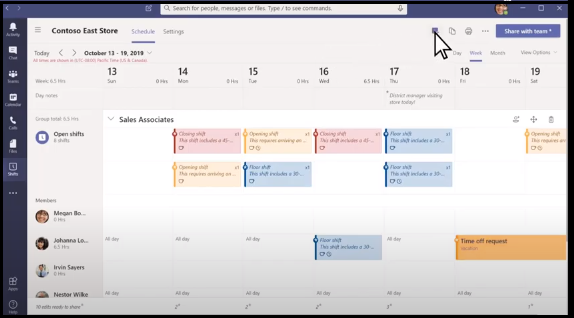

# Готовые к работе соединители  

Teams shifts Workforce Management (WFM) — это готовые к работе интеграции с открытым кодом и интеграции на основе сообщества, которые полезны для сотрудников без компьютеров. Они обеспечивают простой интерфейс и быстрый процесс цифрового преобразования сотрудников первой Teams смен.

Каждый соединитатель содержит подробные инструкции по развертыванию и интеграции в организации. Полный исходный код доступен в репозитории GitHub. Вы можете подробно изучить или разветвить и настроить в соответствии с вашими конкретными потребностями.

В этом документе представлен обзор основных преимуществ соединителей Teams Shifts WFM, соединителя Kronos-to-Teams Shifts и соединителя JDA-to-Teams Shifts.

## Ключевые преимущества соединителей Teams Shifts WFM

Ниже приведены основные преимущества соединителей Teams Shifts WFM:

* **Подключи и работай**: все соединители Shifts WFM включают сценарии развертывания ARM Azure, которые позволяют размещать все необходимые службы в Microsoft Azure. Для развертывания приложений не требуется кодирование.

* **Готовый к производству код:** все соединители Shifts соответствуют рекомендуемым рекомендациям по безопасности и инфраструктуре, а все внесенные сообществом изменения проверяются для обеспечения постоянного соответствия.

* **Настраиваемость и расширяемость:** Хотя все коннекторы Shifts WFM готовы к немедленному развертыванию, при этом вся кодовая база и сценарии развертывания легко доступны. Вы можете легко настроить или расширить их в соответствии с вашими уникальными потребностями.

* **Подробная документация и поддержка**. Все коннекторы Shifts WFM сопровождаются полной документацией по архитектуре решения, этапам развертывания и настройки. Репозитории соединителей отслеживаются, поэтому вы можете сообщать о любых проблемах, проблемах или трудностях, с которыми вы сталкиваетесь, через трекер GitHub Issues репозитория.

* **Простая интеграция:** Интеграция решений WFM и Teams Shifts позволяет сотрудникам первой линии использовать приложение Teams Shifts для просмотра расписаний и времени смены и управления ими, а также использовать все остальные функции расширенной совместной работы, предоставляемые в Teams прямо с мобильного устройства или рабочего стола, без переключения контекста на другое приложение.  

Открыть представление смен в Teams:

Представление смен в Teams показано на следующем изображении:

## Дополнительные ресурсы

[Интеграция веб-приложений](~/samples/integrate-web-apps-overview.md)
