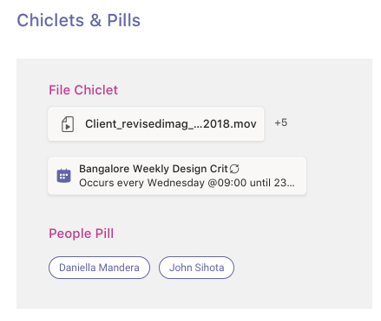

# Вкладки на мобильных устройствах

> [!NOTE]
> Если вкладка "Канал/группа" будет отображаться на мобильных клиентах Teams, конфигурация должна иметь значение свойства `setSettings()` `websiteUrl` (см. ниже).

Настраиваемые вкладки могут быть частью канала, группового чата или личного приложения (приложений, содержащих статические вкладки и/или бота "один к одному").

Личные приложения доступны на мобильных клиентах в средстве "Ящик приложения". Приложение может быть установлено только с настольного компьютера или веб-клиента и может отображаться на мобильных клиентах в течение 24 часов.

Вкладки канала также доступны на мобильных устройствах. Поведение по умолчанию в настоящее время используется для запуска вкладки `websiteUrl` в окне браузера. Однако их можно загрузить на мобильный клиент, щелкнув меню переполнения рядом с вкладкой и выбрав команду `...` **"Открыть",** которая будет использовать вашу вкладку для загрузки в мобильном клиенте `contentUrl` Teams.

## Доступ к личным вкладкам

На следующем рисунке показано, как получить доступ к личной вкладке на мобильном устройстве.

:::image type="content" source="../../assets/images/tabs/mobile-app-drawer.png" alt-text="Иллюстрация, показывающая ящик мобильного приложения Teams." border="false":::

## Доступ к вкладке канала

На следующем рисунке показано, как получить доступ к вкладке канала на мобильном устройстве.

:::image type="content" source="../../assets/images/tabs/mobile-tab.png" alt-text="Иллюстрация, на которой показана вкладка &quot;Teams для мобильных устройств&quot;." border="false":::

## Особенности дизайна

Наша мобильная платформа позволяет приложениям иммерсивно работать с содержимым приложения, отбирая весь экран отдельно от основной навигации Teams. Чтобы создать иммерсивное впечатление, отличное от Teams, следуйте этим рекомендациям.

### Адаптивный дизайн

Так как вкладку можно открыть на устройствах с широким диапазоном размеров экрана, она должна следовать принципам [адаптивного дизайна.](https://www.w3schools.com/html/html_responsive.asp) Все ключевые конструкции должны быть доступны на мобильных устройствах, и представления не должны быть искажены. Убедитесь, что при загрузке вкладки на мобильном устройстве все кнопки и ссылки легко доступны с помощью навигации с помощью пальцев.

### макеты;

Важно выбрать правильный макет для вкладки. Следует рассмотреть тип представляемой информации и выбрать макет, который упорядочитает ее для простого использования. Некоторые возможные варианты описаны ниже.

#### Один холст

Это одна большая область, в которой нужно сделать работу. Приложение вики-сайта Teams следует этому шаблону. Если у вас есть приложение, которое не разделяет содержимое на более мелкие компоненты, это будет хорошим местом.

:::image type="content" source="../../assets/images/tabs/mobile-tab-single-canvas.png" alt-text="Иллюстрация, на которой показана вкладка &quot;Один холст&quot; для мобильных устройств Teams." border="false":::

#### Перечисление

Списки отлично подходит для сортировки и фильтрации больших объемов данных и отлично по-настоящему важны. Полезно использовать столбцы с возможностью сортировки. Действия можно добавить к каждому элементу списка в меню многоязыков.

:::image type="content" source="../../assets/images/tabs/mobile-tab-list.png" alt-text="Иллюстрация, на которой показана вкладка списка для мобильных устройств Teams." border="false":::

#### Grid

Сетки полезны для демонстрации элементов с высокой наглядности. Он помогает включить фильтр или управление поиском в верхней части.

:::image type="content" source="../../assets/images/tabs/mobile-tab-grid.png" alt-text="Иллюстрация, на которой показана вкладка &quot;Teams для мобильных устройств&quot; с макетом сетки." border="false":::

### Вкладки с ботами на мобильных устройствах

В следующем примере это личное приложение с вкладками и ботом.

:::image type="content" source="../../assets/images/tabs/mobile-tab-with-bot.png" alt-text="Иллюстрация, показывающая, как мобильное приложение Teams с вкладками и ботом." border="false":::

## Компоненты пользовательского интерфейса

### Цветовые палитры

Использование нашей утвержденной нейтральной палитры для фонов, уведомлений, текста и кнопок поможет вашему приложению работать как дома в Teams. Так как на мобильных устройствах Teams есть две темы (светлая и темная), лучше убедиться, что ваше приложение хорошо выглядит в обоих этих приложениях.

#### Цвет света

#### Темный цвет

### Кнопки и элементы управления

Стиль кнопок помогает сообщить, какие действия они запускают. Мы поддерживаем широкий спектр кнопок, отформатированные для показа различных уровней акцента. Кнопки могут иметь текст, значок или сочетание текста и значка. Для связи с разными уровнями иерархии мы разработали основные и дополнительные кнопки в каждой категории.

#### Кнопки

Основные и дополнительные кнопки.

#### Элементы управления выбором

Radio buttons, checkboxes, and toggles.

#### Неугомные и неугомные

### Шрифтовое оформление

Оформление должно быть понятным и целеустремленным. Подчеркивать важную информацию и избегать использования нескольких шрифтов и размеров, чтобы уменьшить путаницу. Мы рекомендуем использовать пример предложения и избегать использования всех caps для локализации и разчетности.

### Поля и flyouts

Поля — это области, в которых пользователи могут вводить текст. Flyouts are more lightweight than dialogs and appear from the top pane.

#### Список элементов управления

#### Элементы управления полями

## Вопросы для разработчиков

При создании приложения, которое включает вкладку, необходимо учесть (и протестировать) работу вкладки на клиентах Microsoft Teams для Android и iOS. В разделах ниже описаны некоторые ключевые сценарии, которые необходимо учесть.

### Тестирование на мобильных клиентах

Необходимо проверить, правильно ли работает вкладка на мобильных устройствах различных размеров и качества. Для устройств с Android можно использовать [DevTools](~/tabs/how-to/developer-tools.md) для отладки вкладки во время ее работы. Рекомендуется тестировать как на высокой, так и на малой скорости, а также на планшете.

### Проверка подлинности

Чтобы проверка подлинности работала на мобильных клиентах, необходимо обновить SDK JavaScript для Teams по крайней мере до версии 1.4.1.

### Низкая пропускная способность и периодические подключения

Мобильные клиенты регулярно должны работать с низкой пропускной способностью и периодическими подключениями. Ваше приложение должно правильно обрабатывать времявыдающие действия, предоставляя пользователю контекстное сообщение. Кроме того, индикаторы хода выполнения следует использовать для предоставления пользователям отзывов о любых длительных процессах.
