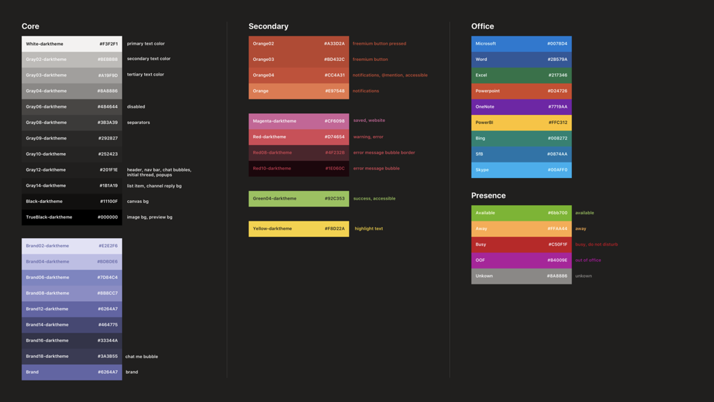

# Вкладки на мобильных устройствах

Вы можете включить вкладки в мобильных каналах Teams, чатах и личных приложениях.

## Доступ к личным вкладкам

Вы можете получить доступ к личным вкладкам в ящике приложения.

:::image type="content" source="../../assets/images/tabs/mobile-app-drawer.png" alt-text="Иллюстрация, показывающая ящик мобильного приложения Teams." border="false":::

## Доступ к вкладке канала

Вы можете получить доступ к вкладке канала и группы, выбрав кнопку **More** в канале или в чате, в котором они были добавлены.

:::image type="content" source="../../assets/images/tabs/mobile-tab.png" alt-text="Иллюстрация, показывающая вкладку Teams для мобильных устройств." border="false":::

## Особенности дизайна

Наша мобильная платформа позволяет приложениям быть иммерсивным опытом с контентом приложения, за исключением основной навигации Teams. Чтобы создать иммерсивный опыт, который подходит для Teams, следуйте этим рекомендациям.

### Адаптивный дизайн

Так как вкладка может быть открыта на устройствах с широким диапазоном размеров экрана, она должна следовать принципам [гибкого проектирования.](https://www.w3schools.com/html/html_responsive.asp) Все ключевые конструкции должны быть доступны на мобильных устройствах, и представления не должны искажаться. Убедитесь, что при загрузке вкладки на мобильном устройстве все кнопки и ссылки легко доступны с помощью навигации на основе пальцев.

### макеты;

Важно выбрать правильный макет вкладки. Необходимо рассмотреть тип представляемой информации и выбрать макет, который организует ее для легкого потребления. Ниже описаны некоторые возможные варианты.

#### Одно полотно

Это одна большая область, в которой делается работа. Приложение Teams Wiki следует этому шаблону. Если у вас есть приложение, которое не разделяет контент на более мелкие компоненты, это будет подходящим.

:::image type="content" source="../../assets/images/tabs/mobile-tab-single-canvas.png" alt-text="Иллюстрация, на которой показана вкладка &quot;Одно полотно Для мобильных групп&quot;." border="false":::

#### List

Списки отлично подходит для сортировки и фильтрации больших объемов данных и отлично подходит для хранения наиболее важных вещей в верхней части. Полезно использовать сортируемые столбцы. Действия могут быть добавлены к каждому элементу списка в меню ellipsis.

:::image type="content" source="../../assets/images/tabs/mobile-tab-list.png" alt-text="Иллюстрация, показывающая вкладку список мобильных групп." border="false":::

#### Grid

Сетки полезны для демонстрации элементов с высокой наглядности. Это помогает включить фильтр или управление поиском в верхней части.

:::image type="content" source="../../assets/images/tabs/mobile-tab-grid.png" alt-text="На рисунке показана вкладка для мобильных устройств Teams с макетом сетки." border="false":::

### Вкладки с ботами на мобильных устройствах

Ниже приводится личный пример приложения с вкладками и ботом.

:::image type="content" source="../../assets/images/tabs/mobile-tab-with-bot.png" alt-text="На рисунке показывая, как мобильное приложение Teams с вкладками и ботом." border="false":::

## Компоненты пользовательского интерфейса

### Цветовые палитры

Использование нашей утвержденной нейтральной палитры фонов, уведомлений, текста и кнопок поможет приложению чувствовать себя как дома в Teams. Так как мобильный телефон Teams имеет две цветовые темы (светлый и темный), лучше убедиться, что ваше приложение отлично выглядит в обоих.

#### Светлый цвет

#### Темный цвет

### Кнопки и элементы управления

Стиль кнопок позволяет сообщить, какие действия они запускают. Мы поддерживаем широкий диапазон кнопок, которые отформатированы, чтобы показать различные уровни акцента. Кнопки могут иметь текст, значок или сочетание текста и значка. Чтобы общаться на разных уровнях в иерархии, мы разработали основные и вторичные кнопки в каждой категории.

#### Кнопки

Основные и вторичные кнопки.

#### Элементы управления выбором

Кнопки радио, почтовые ящики и очки.

#### Шиклеты и таблетки

### Шрифтовое оформление

Типография должна быть четкой и целенаправленной. Подчеркивать важные сведения и избегать использования нескольких шрифтов и размеров для уменьшения путаницы. Рекомендуется использовать пример предложения и избегать использования всех колпачок для локализации и разнонабности.

### Поля и вылеты

Поля — это области, в которых пользователи могут вводить текст. Вылеты более легкие, чем диалоги, и отображаются на верхней области.

#### Список элементов управления

#### Элементы управления полями

## Соображения разработчика

При создании приложения, включаемого в вкладку, необходимо учитывать (и тестировать) функции вкладки на клиентах Android и iOS Microsoft Teams. В разделах ниже описаны некоторые ключевые сценарии, которые необходимо рассмотреть.

### Проверка подлинности

Для проверки подлинности для мобильных клиентов необходимо обновить команду JavaScript SDK по крайней мере до версии 1.4.1.

### Низкая пропускная способность и периодические подключения

Мобильные клиенты регулярно должны работать с низкой пропускной способностью и периодическими подключениями. Ваше приложение должно надлежащим образом обрабатывать любые периоды времени, предоставляя пользователю контекстное сообщение. Кроме того, необходимо использовать индикаторы прогресса пользователей, чтобы предоставить пользователям обратную связь для любых длительных процессов.

> [!NOTE]
> Вкладки включены на мобильных устройствах только после того, как приложение будет добавлено в список разрешений на основе ввода группы утверждения. Чтобы проверить отзывчивость мобильных устройств, обратитесь к teamsubm@microsoft.com.

### Тестирование мобильных клиентов

Необходимо проверить правильность функции вкладки на мобильных устройствах различных размеров и качеств. Для устройств с Android можно использовать [DevTools](~/tabs/how-to/developer-tools.md) для отладки вкладки во время ее работы. Рекомендуется протестировать как на высокой, так и на низкой скорости, а также на планшете.

### Распределение

Приложения, перечисленные в магазине Teams, должны быть утверждены для использования на мобильных устройствах для правильного функционирования в мобильном клиенте Teams. Поведение вкладок зависит от того, утверждено ли ваше приложение.

#### Поведение вкладки канала и группы

* **Поведение при одобрении:** открывается в мобильном клиенте Teams с помощью конфигурации `contentUrl` приложения.
* **Поведение, если** не утверждено. Откроется в браузере по умолчанию устройства с помощью конфигурации приложения (которая также должна быть включена в функцию `websiteUrl` исходный `setSettings()` код). Тем не менее, пользователи по-прежнему могут загружать  вкладку в мобильном клиенте Teams, выбрав Дополнительные рядом с приложением и выбрав **Open,** что вызывает конфигурацию `contentUrl` приложения.

#### Поведение личного приложения

* **Поведение при одобрении:** Каждая вкладка в личном приложении отображает в мобильном клиенте Teams с помощью соответствующей `contentUrl` конфигурации.
* **Поведение, если не утверждено.** Личное приложение недоступно в мобильном клиенте Teams.

#### Поведение приложений, не в командных магазинах

Если вы перезагружаете приложение или публикацию в каталоге приложений организации, поведение вкладок будет таким же, как и приложения магазина Teams, утвержденные Корпорацией Майкрософт для мобильных устройств.
