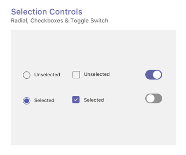

# Вкладки на мобильных устройствахTabs on mobile

> [!NOTE]
> Если вкладка "Канал/группа" будет отображаться на мобильных клиентах Teams, конфигурация должна иметь значение свойства `setSettings()` `websiteUrl` (см. ниже).If you choose to have your channel/group tab appear on Teams mobile clients, the `setSettings()` configuration must have a value for the `websiteUrl` property (see below).

Настраиваемые вкладки могут быть частью канала, группового чата или личного приложения (приложений, содержащих статические вкладки и/или бота "один к одному").Custom tabs can be part of a channel, group chat, or personal app (apps that contain static tabs and/or a one-to-one bot).

Личные приложения доступны на мобильных клиентах в средстве "Ящик приложения".Personal apps are available on mobile clients in the app drawer. Приложение может быть установлено только с настольного компьютера или веб-клиента и может отображаться на мобильных клиентах в течение 24 часов.The app can only be installed from a desktop or web client, and can take up to 24 hours to appear on mobile clients.

Вкладки канала также доступны на мобильных устройствах.Channel tabs are also available on mobile. Поведение по умолчанию в настоящее время используется для запуска вкладки `websiteUrl` в окне браузера.The default behavior is currently to use your `websiteUrl` to launch your tab in a browser window. Однако их можно загрузить на мобильный клиент, щелкнув меню переполнения рядом с вкладкой и выбрав команду `...` **"Открыть",** которая будет использовать вашу вкладку для загрузки в мобильном клиенте `contentUrl` Teams.However, they can be loaded on a mobile client by clicking the `...` overflow menu next to the tab and choosing **Open**, which will use your `contentUrl` to load the tab inside the Teams mobile client.

## Доступ к личным вкладкамAccessing personal tabs

На следующем рисунке показано, как получить доступ к личной вкладке на мобильном устройстве.The following illustration shows how you access a personal tab on mobile.

:::image type="content" source="../../assets/images/tabs/mobile-app-drawer.png" alt-text="Иллюстрация, показывающая ящик мобильного приложения Teams." border="false":::

## Доступ к вкладке каналаAccessing channel tabs

На следующем рисунке показано, как получить доступ к вкладке канала на мобильном устройстве.The following illustration shows how you access a channel tab on mobile.

:::image type="content" source="../../assets/images/tabs/mobile-tab.png" alt-text="Иллюстрация, на которой показана вкладка &quot;Teams для мобильных устройств&quot;." border="false":::

## Особенности дизайнаDesign considerations

Наша мобильная платформа позволяет приложениям иммерсивно работать с содержимым приложения, отбирая весь экран отдельно от основной навигации Teams.Our mobile platform allows apps to be an immersive experience with the app content taking up all of the screen apart from main Teams navigation. Чтобы создать иммерсивное впечатление, отличное от Teams, следуйте этим рекомендациям.To create an immersive experience that fits with Teams, follow these guidelines.

### Адаптивный дизайнResponsive design

Так как вкладку можно открыть на устройствах с широким диапазоном размеров экрана, она должна следовать принципам [адаптивного дизайна.](https://www.w3schools.com/html/html_responsive.asp)Because your tab can be opened on devices with a wide range of screen sizes, it needs to follow [responsive design](https://www.w3schools.com/html/html_responsive.asp) principles. Все ключевые конструкции должны быть доступны на мобильных устройствах, и представления не должны быть искажены.All of the key constructs should be accessible on mobile devices, and the views should not be distorted. Убедитесь, что при загрузке вкладки на мобильном устройстве все кнопки и ссылки легко доступны с помощью навигации с помощью пальцев.Ensure that when your tab is loaded on a mobile device, all buttons and links are easily accessible using finger-based navigation.

### макеты;Layouts

Важно выбрать правильный макет для вкладки.Choosing the correct layout for your tab is important. Следует рассмотреть тип представляемой информации и выбрать макет, который упорядочитает ее для простого использования.You should consider the kind of information you're presenting, and choose a layout that organizes it for easy consumption. Некоторые возможные варианты описаны ниже.Some potential options are outlined below.

#### Один холстSingle canvas

Это одна большая область, в которой нужно сделать работу.This is one large area where work gets done. Приложение вики-сайта Teams следует этому шаблону.The Teams Wiki app follows this pattern. Если у вас есть приложение, которое не разделяет содержимое на более мелкие компоненты, это будет хорошим местом.If you have an app that doesn’t separate content into smaller components this would be a good fit.

:::image type="content" source="../../assets/images/tabs/mobile-tab-single-canvas.png" alt-text="Иллюстрация, на которой показана вкладка &quot;Один холст&quot; для мобильных устройств Teams." border="false":::

#### ПеречислениеList

Списки отлично подходит для сортировки и фильтрации больших объемов данных и отлично по-настоящему важны.Lists are great for sorting and filtering large quantities of data and are great at keeping the most important things at the top. Полезно использовать столбцы с возможностью сортировки.It is helpful to use sortable columns. Действия можно добавить к каждому элементу списка в меню с многолипсом.Actions can be added to each list item under the ellipsis menu.

:::image type="content" source="../../assets/images/tabs/mobile-tab-list.png" alt-text="Иллюстрация, на которой показана вкладка списка для мобильных устройств Teams." border="false":::

#### GridGrid

Сетки полезны для показа элементов с высокой наглядности.Grids are useful for showing elements which are highly visual. Он помогает включить фильтр или управление поиском в верхней части.It helps to include a filter or search control at the top.

:::image type="content" source="../../assets/images/tabs/mobile-tab-grid.png" alt-text="Иллюстрация с мобильной вкладкой Teams с макетом сетки." border="false":::

### Вкладки с ботами на мобильных устройствахTabs with bots on mobile

В следующем примере это личное приложение с вкладками и ботом.The following example is a personal app that has tabs and a bot.

:::image type="content" source="../../assets/images/tabs/mobile-tab-with-bot.png" alt-text="Иллюстрация, показывающая, как мобильное приложение Teams с вкладками и ботом." border="false":::

## Компоненты пользовательского интерфейсаUI components

### Цветовые палитрыColor palettes

Использование нашей утвержденной нейтральной палитры для фонов, уведомлений, текста и кнопок поможет вашему приложению лучше работать дома в Teams.Using our approved neutral palette for backgrounds, notifications, text, and buttons will help your app feel more at home in Teams. Так как на мобильных устройствах Teams есть две темы (светлая и темная), лучше убедиться, что ваше приложение хорошо выглядит в обоих этих приложениях.Since Teams mobile has two colour themes (light and dark), it’s a good idea to make sure your app looks great in both.

#### Цвет светаLight color

#### Темный цветDark color

### Кнопки и элементы управленияButtons and controls

Стиль кнопок помогает сообщить, какие действия они запускают.The way buttons are styled helps communicate what kind of action they trigger. Мы поддерживаем широкий спектр кнопок, отформатированные для показа различных уровней акцента.We maintain a wide range of buttons that are formatted to show different levels of emphasis. Кнопки могут иметь текст, значок или сочетание текста и значка.Buttons can have text, an icon, or a combination of text and an icon. Для связи разных уровней в иерархии мы разработали основные и дополнительные кнопки в каждой категории.To communicate different levels in a hierarchy, we designed primary and secondary buttons within each category.

#### КнопкиButtons

Основные и дополнительные кнопки.Primary and secondary buttons.

#### Элементы управления выборомSelection controls

Radio buttons, checkboxes, and toggles.Radio buttons, checkboxes, and toggles.

#### Податки и ветвиChiclets and pills

### Шрифтовое оформлениеTypography

Оформление должно быть понятным и целеустремленным.Typography should be clear and purposeful. Подчеркивать важную информацию и избегать использования нескольких шрифтов и размеров, чтобы уменьшить путаницу.Emphasize important information and avoid using multiple fonts and sizes to reduce confusion. Мы рекомендуем использовать случай предложения и избегать использования всех caps для локализации и различивости.We recommend using sentence case and avoiding the usage of all caps for localization and legibility.

### Поля и flyoutsFields and flyouts

Поля — это области, в которых пользователи могут вводить текст.Fields are areas where users can input text. Flyouts are more lightweight than dialogs and appear from the top pane.Flyouts are more lightweight than dialogs and appear from the top pane.

#### Список элементов управленияList controls

#### Элементы управления полямиField controls

## Вопросы для разработчиковDeveloper considerations

При создании приложения, которое включает вкладку, необходимо учесть (и протестировать) работу вкладки на клиентах Microsoft Teams для Android и iOS.When you're building an app that includes a tab, you need to consider (and test) how your tab will function on both the Android and iOS Microsoft Teams clients. В разделах ниже описаны некоторые ключевые сценарии, которые необходимо учесть.The sections below outline some of the key scenarios you need to consider.

### Тестирование на мобильных клиентахTesting on mobile clients

Необходимо проверить, правильно ли работает вкладка на мобильных устройствах различных размеров и качества.You need to validate that your tab functions properly on mobile devices of various sizes and qualities. Для устройств с Android можно использовать [DevTools](~/tabs/how-to/developer-tools.md) для отладки вкладки во время ее работы.For Android devices, you can use the [DevTools](~/tabs/how-to/developer-tools.md) to debug your tab while it is running. Рекомендуется тестировать как на высокой, так и на малой скорости, а также на планшете.We recommend that you test on both high and low performing devices, as well as on a tablet.

### Проверка подлинностиAuthentication

Чтобы проверка подлинности работала на мобильных клиентах, необходимо обновить SDK JavaScript для Teams по крайней мере до версии 1.4.1.For authentication to work on mobile clients, you must upgrade you Teams JavaScript SDK to at least version 1.4.1.

### Низкая пропускная способность и периодические подключенияLow bandwidth and intermittent connections

Мобильные клиенты регулярно должны работать с низкой пропускной способностью и периодическими подключениями.Mobile clients regularly need to function with low bandwidth and intermittent connections. Ваше приложение должно правильно обрабатывать времявыдающие действия, предоставляя пользователю контекстное сообщение.Your app should handle any timeouts appropriately by providing a contextual message to the user. Кроме того, индикаторы хода выполнения следует использовать для предоставления пользователям отзывов о любых длительных процессах.You should also user progress indicators to provide feedback to your users for any long-running processes.

> [!NOTE]
> Вкладки включены на мобильных устройствах только после того, как приложение будет добавлено в список разрешений на основе входных данных группы утверждения.Tabs are enabled on mobile only after the application is added to an allow list, based on the input of the approval team. Чтобы проверить отклик мобильных устройств, обратитесь к teamsubm@microsoft.com.To check mobile responsiveness, reach out to teamsubm@microsoft.com. 