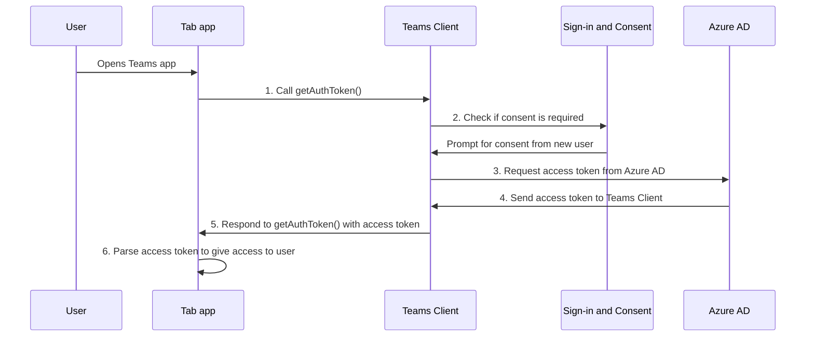

# Включение единого входа для приложения вкладки

<!--Single sign-on (SSO) allows a user to access an application or a web service after signing-in only once. The app users never have to go through authentication again.-->

Благодаря единому входу в Teams пользователи приложений могут использовать Teams для доступа к приложениям. После входа в Teams с помощью учетной записи Майкрософт или Microsoft 365 пользователи приложения могут использовать ваше приложение без необходимости повторного входа. Ваше приложение доступно пользователям приложения на любом устройстве с доступом, предоставленным через Azure AD.

Вот что вы узнаете в этом разделе:

1. **Взаимодействие с пользователем единого входа**: Teams предлагает пользователям приложения истинное единое вход. Пользователи приложения могут использовать ваше приложение без повторного входа.
2. **Единый вход в Teams** во время выполнения. Приложение табуляции взаимодействует с Azure AD во время выполнения для однофакторной проверки подлинности и авторизации для пользователей приложения.
3. **Включите единый вход для приложения вкладки**. Реализуйте задачи, связанные с реализацией единого входа в приложении вкладки.

## Взаимодействие с пользователем единого входа в Teams

Пользователи приложений войдите в Teams с помощью личной учетной записи Майкрософт или Учетной записи Microsoft 365. Вы можете воспользоваться этим преимуществом и использовать единый вход для проверки подлинности и авторизации пользователей приложения.

&nbsp;&nbsp;&nbsp;&nbsp;:::image type="content" source="../../../assets/images/authentication/teams-sso-tabs/teams-sso-ux.png" alt-text="Взаимодействие с пользователем единого входа в приложении вкладки Teams" border="false":::

- Teams выполняет проверку подлинности и сохраняет удостоверение пользователя приложения.
- Приложение вкладки использует сохраненные удостоверения пользователя приложения, который уже проверен Teams.
- Пользователю приложения необходимо предоставить согласие Teams на использование удостоверения для доступа к приложению табуляции.
- Пользователь приложения может получить доступ к приложению в Интернете, на рабочем столе или в мобильном клиенте.

Здесь можно просмотреть пример взаимодействия с пользователем с единым входом в приложении вкладки:

:::image type="content" source="../../../assets/images/authentication/teams-sso-tabs/sso-tab.gif" alt-text="Единый вход в приложении табуляции":::

### Улучшение взаимодействия с пользователем с помощью единого входа

Вот что пользователи приложения получают с помощью единого входа:

- Teams получает маркер доступа для текущего пользователя приложения из Azure AD. Это взаимодействие с Azure AD невидимо для пользователя приложения. Он преобразуется в получение доступа к приложению без необходимости выходить из среды Teams.
- Пользователь приложения должен дать согласие только в мультитенантной среде. Если пользователь приложения и приложение находятся в одном клиенте, пользователю приложения не нужно предоставлять согласие на использование приложения.
- После первого предоставления согласия в Teams пользователь приложения может использовать ваше приложение без дополнительного согласия, даже на любом другом устройстве. По этой причине она обеспечивает более эффективное взаимодействие с пользователем.
  - Кроме того, администратор клиента может предоставить согласие от имени пользователей приложения. В этом сценарии, когда администратор клиента дает согласие пользователям приложения в клиенте, пользователям приложения не нужно запрашивать согласие. Это означает, что пользователи приложения не видят диалоги согласия и могут легко получить доступ к приложению.
- Teams предварительно получает маркер доступа, чтобы повысить производительность и время загрузки приложения в среде Teams.
- Пользователям приложений не нужно запоминать или записывать несколько паролей для доступа к приложениям и их использования в среде Teams.

> [!NOTE]
> Пользователи приложений не могут предоставлять разрешения для некоторых областей разрешений, `Sites.ReadWrite.All`таких как , что позволяет пользователю приложения читать и записывать все ресурсы SharePoint и OneDrive в клиенте. В таких областях только администратор клиента, кроме предоставления согласия от имени пользователя приложения.

Теперь давайте посмотрим, что происходит в серверной части во время выполнения для обеспечения единого входа в Teams.

## Единый вход в Teams во время выполнения

Обеспечение единого входа в приложении на вкладке путем получения маркера доступа для пользователя приложения Teams, который в настоящее время выполнил вход. Этот процесс включает клиент приложения табуляции и сервер, клиент Teams и Azure AD. Во время этого взаимодействия пользователь приложения должен предоставить согласие на использование удостоверения Teams для получения маркера доступа в мультитенантной среде.

На следующем рисунке показано, как работает единый вход, когда пользователь приложения Teams пытается получить доступ к приложению вкладки:

:::image type="content" source="../../../assets/images/authentication/teams-sso-tabs/sso-runtime-seqd.png" alt-text="Схема единого входа в tab" border="false" lightbox="../../../assets/images/authentication/teams-sso-tabs/sso-runtime-seqd.png":::

| # | Взаимодействие | Что происходит |
| --- | --- | --- |
| 1 | Вкладка приложения → Клиента Teams | Приложение вкладки выполняет вызов JavaScript `getAuthToken()`, который сообщает Teams о получении маркера доступа. |
| 2 | Клиентские → Azure AD | Teams запрашивает Azure AD конечной точке для маркера доступа для текущего пользователя приложения на основе удостоверения Teams. |
| 3 | Azure AD → согласия | Если текущий пользователь приложения использует ваше приложение вкладки в первый раз, Teams отображает запрос на согласие, если приложению требуется доступ к некоторым защищенным данным. Пользователь приложения (или администратор) должен предоставить teams согласие на использование удостоверения Teams пользователя приложения для получения маркера доступа из Azure AD.   Кроме того, появляется запрос на обработку пошаговой проверки подлинности, например, двухфакторную проверку подлинности. |
| 4 | Azure AD → Клиента Teams | Azure AD отправляет маркер доступа клиенту Teams. Маркер является веб-маркером JSON (JWT), и его проверка работает так же, как проверка маркера в большинстве стандартных потоков OAuth. Teams кэширует маркер от вашего имени, чтобы будущие вызовы `getAuthToken()` возвращали кэшированный маркер. |
| 5 | Клиент teams → tab | Teams отправляет маркер доступа в приложение вкладки как часть объекта результата, возвращенного вызовом `getAuthToken()` . |
| 6  | Приложение tab (между сервером & клиента) | Приложение вкладки анализирует маркер доступа с помощью JavaScript для извлечения необходимых сведений, таких как адрес электронной почты пользователя приложения. Маркер, возвращаемый приложению табуляции, является маркером доступа и маркером удостоверения. |

Дополнительные сведения см. в [разделе "Обновление кода для включения единого входа"](tab-sso-code.md).

> [!IMPORTANT]
> Допустимо `getAuthToken()` только для предоставления согласия на ограниченный набор API на уровне пользователя, таких как электронная почта, профиль, offline_access и OpenId. Он не используется для других областей Графа, таких как `User.Read` или `Mail.Read`. Рекомендуемые обходные пути см. в статье ["Расширение приложения с помощью разрешений Microsoft Graph"](tab-sso-graph-api.md).

Вкладки — это веб-страницы с поддержкой Teams. Чтобы включить единый вход на веб-странице, размещенной в приложении-вкладке, добавьте [клиентский пакет SDK JavaScript для Teams](/javascript/api/overview/msteams-client?view=msteams-client-js-latest&preserve-view=true) и вызовите его `microsoftTeams.initialize()`. После инициализации вызовите `microsoftTeams.getAuthToken()` , чтобы получить маркер доступа для приложения.

### Варианты использования для включения единого входа

Вы можете включить единый вход в Teams для всех приложений, Azure AD в качестве поставщика удостоверений. Помимо использования единого входа для проверки подлинности пользователей приложения в приложении-вкладке, его также можно использовать для обеспечения бесперебойного доступа в Teams.

Ниже перечислены некоторые сценарии, в которых можно использовать API единого входа для проверки подлинности пользователей приложения.

- Если вы хотите проверить подлинность пользователей приложения в приложении на вкладке Teams, API единого входа позволяет пользователям приложения использовать приложение в Teams без дополнительной проверки подлинности. На основе удостоверения Пользователя приложения Teams вы можете получить маркер доступа для них из Azure AD.
- Если приложение использует модуль задач из бота, вкладки, расширения сообщения или адаптивных карточек, вы можете использовать API единого входа для проверки подлинности пользователей приложения.
- Вы также можете использовать API единого входа для проверки подлинности пользователей приложения, которые хотят получить доступ к представлению стадии без повторной проверки.

> [!TIP]
> Вы также можете использовать API единого входа для проверки подлинности пользователей приложения  в модулях задач, внедряя веб-содержимое.

Чтобы обеспечить единый вход во время выполнения, настройте приложение, чтобы включить единый вход для проверки подлинности и авторизации пользователей приложения.

## Включение единого входа для приложения вкладки

В этом разделе описываются задачи, связанные с реализацией единого входа для приложения вкладки. Эти задачи не зависит от языка и структуры.

Чтобы включить единый вход для приложения вкладки:

&nbsp;&nbsp;&nbsp;&nbsp;&nbsp;:::image type="content" source="../../../assets/images/authentication/teams-sso-tabs/enable-sso.png" alt-text="Действия по включению единого входа для tab" border="false" lightbox="../../../assets/images/authentication/teams-sso-tabs/enable-sso.png":::

1. **Зарегистрируйтесь Azure AD**: создайте Azure AD для создания идентификатора приложения и URI идентификатора приложения. Для создания маркера доступа необходимо настроить области и авторизовать доверенные клиентские приложения.
2. Код **обновления: добавьте** код для обработки маркера доступа, `getAuthToken()` вызов, когда пользователь приложения получает доступ к приложению вкладки, отправляет этот маркер в код сервера приложения в заголовке авторизации и проверяет маркер доступа при его получении.
3. **Обновление манифеста приложения Teams**. Обновите манифест клиентского приложения Teams, используя идентификатор приложения и URI идентификатора приложения, созданные на Azure AD чтобы разрешить Teams запрашивать маркеры доступа от имени вашего приложения.

## Сторонние файлы cookie на iOS

После обновления iOS 14 Apple по умолчанию заблокируют доступ [к](https://webkit.org/blog/10218/full-third-party-cookie-blocking-and-more/) файлам cookie сторонних разработчиков для всех приложений. Таким образом, приложения, использующие сторонние файлы cookie для проверки подлинности на вкладке "Канал" или "Чат" и в личных приложениях, не смогут завершить свои рабочие процессы проверки подлинности на клиентах Teams iOS. Чтобы соответствовать требованиям конфиденциальности и безопасности, вы должны перейти на систему на основе токенов или использовать собственные файлы cookie для рабочих процессов проверки подлинности пользователей.

### Поддержка мобильных клиентов Teams

Для мобильных устройств Teams поддерживаются следующие клиентские версии:

- Teams для Android (1416/1.0.0.2020073101 и более поздние версии)
- Teams для iOS (версия: 2.0.18 и более поздние версии)  
- Пакет SDK JavaScript для Teams (версия 1.11 и более поздние версии) для работы единого входа на боковой панели собрания

Для лучшего взаимодействия с Teams используйте последнюю версию iOS и Android.

## Рекомендации

Ниже приведен список рекомендаций.

- **Вызовите маркер доступа только в том случае**, если он вам нужен: вызов `getAuthToken()` только в том случае, если вам нужен маркер доступа. Его можно вызвать, когда пользователь приложения получает доступ к приложению вкладки или для использования определенной функции, требующего проверки пользователя приложения.
- **Не храните маркер** доступа в клиентском коде: не кэшировать и не сохранять маркер доступа в клиентском коде приложения. Клиент Teams кэширует маркер доступа (или запрашивает новый, если срок его действия истек). Это гарантирует отсутствие случайной утечки маркера из веб-приложения.
- **Используйте серверный код** для вызовов Microsoft Graph: всегда используйте код на стороне сервера для выполнения вызовов Microsoft Graph или других вызовов, которые требуют передачи маркера доступа. Никогда не возвращайте маркер OBO клиенту, чтобы клиент мог выполнять прямые вызовы в Microsoft Graph. Это помогает защитить маркер от перехвата или утечки. Дополнительные сведения см. в [разделе "Расширение приложения табуляции с помощью разрешений и области Microsoft Graph"](tab-sso-graph-api.md).

## Известные ограничения

- В настоящее время единый вход в Teams поддерживает только токен OAuth 2.0. Он не поддерживает токен SAML.
- Несколько доменов на приложение не поддерживаются. Дополнительные сведения см. в [разделе бизнес-приложений](tab-sso-register-aad.md#before-you-register-with-azure-ad).

## Следующий этап

> [!div class="nextstepaction"]
> [Регистрация приложения табуляции в Azure AD](tab-sso-register-aad.md)

## См. также

[Настройка кода для включения единого входа в приложении табуляции](tab-sso-code.md)

<!--
### Use cases for enabling SSO for tab app

Here are some use cases where enabling SSO is beneficial. Call `getAuthToken()` in these scenarios to use Teams identity for obtaining access token for your app users:

- To get an app user’s identity from Teams if you have an existing app that you want to be available within a tab app in Teams.

- To authenticate an app user by reusing the Team’s identity inside your tab app.

- To authenticate and get an app user’s Teams identity inside configurable tabs. The app users don't need to sign in again. It's applicable to some settings that need to be configured at a configuration stage.

- To obtain an access token inside a task module, when it's invoked from a tab app, a bot app, a messaging extension app, or adaptive cards.

- To authenticate an app user in Stage view.

- To authenticate users for [task modules](../../../task-modules-and-cards/what-are-task-modules.md) that embed web content.
-->

<!--

-->

<!--
- Tenant admin consent: A simple way of [consenting on behalf of an organization as a tenant admin](/azure/active-directory/develop/v2-permissions-and-consent.md#requesting-consent-for-an-entire-tenant) is by getting [consent from admin](/azure/active-directory/manage-apps/grant-admin-consent).
  
    You can ask for consent using the Auth API. Another approach for getting Graph scopes is to present a consent dialog using our existing [third party OAuth provider authentication approach](~/tabs/how-to/authentication/auth-tab-aad.md#navigate-to-the-authorization-page-from-your-pop-up-page). This approach involves popping up an Azure AD consent dialog box.

  

  
To ask for additional consent using the Auth API, follow these steps:

    1. The token retrieved using `getAuthToken()` must be exchanged on the server-side using Azure AD [on-behalf-of flow (OBO)](/azure/active-directory/develop/v2-oauth2-on-behalf-of-flow) to get access to those other Graph APIs. Ensure you use the v2 Graph endpoint for this exchange.
    2. If the exchange fails, Azure AD returns an invalid grant exception. It usually responds with one of the two error messages, `invalid_grant` or `interaction_required`.
    3. When the exchange fails, you must ask for consent. Use the user interface (UI) to ask the app user to grant other consent. This UI must include a button that triggers an Azure AD consent dialog using [Silent authentication](~/concepts/authentication/auth-silent-aad.md).
    4. When asking for more consent from Azure AD, you must include `prompt=consent` in your [query-string-parameter](~/tabs/how-to/authentication/auth-silent-aad.md#get-the-user-context) to Azure AD, otherwise Azure AD wouldn't ask for other scopes.

        - Instead of `?scope={scopes}`, use `?prompt=consent&scope={scopes}`
        - Ensure that `{scopes}` includes all the scopes you're prompting the user for, for example, `Mail.Read` or `User.Read`.
    5. After the app user has granted more permissions, retry the OBO flow to get access to these other APIs.

    

-->
<!--
- If you want your existing app to be available within a Teams tab app, the SSO API allows your signed-in app users to use your app in Teams with no additional authentication needed. Based on the app user's Teams identity, you can obtain access token for them from Azure AD.
- If your app has configurable tabs, you can use `getAuthToken()` to allow app users into the tab app without signing in again. SSO is applicable to some settings that need to be configured at a configuration stage.
- Your app may have a bot, a tab, a message extension, or Adaptive Cards, and allows your app users to invoke task module from within a tab or a bot. The SSO API will authenticate your app users who attempt to access the task module. Teams can use the app user's Teams identity and obtain an access token from Azure AD.

- You can also use the SSO API for authenticating your app users who want to access to Stage view without need to be validated again. The access token obtained for the app user when they first used your app can be used to allow them to use Stage view. -->
