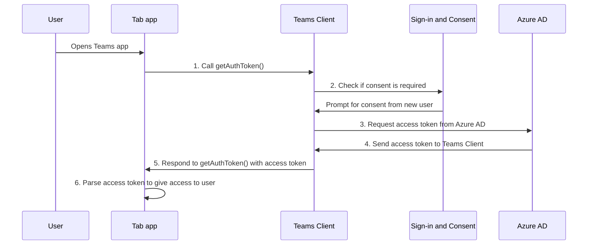

# Включение единого входа для приложения вкладки

<!--Single sign-on (SSO) allows a user to access an application or a web service after signing-in only once. The app users never have to go through authentication again.-->

Благодаря единому входу в Teams пользователи приложений могут использовать Teams для доступа к приложениям. После входа в Teams с помощью учетной записи Майкрософт или Microsoft 365 пользователи приложения могут использовать ваше приложение без необходимости снова выполнять вход. Ваше приложение доступно пользователям на любом устройстве, где доступ предоставляется с помощью Azure AD.

В этом разделе вы узнаете следующее:

1. **Пользовательский интерфейс единого входа**: Teams предоставляет пользователям вашего приложения настоящие возможности единого входа. Пользователи приложения могут использовать приложение, не выполняя повторный вход.
2. **Единый вход в Teams во время выполнения**: ваше приложение вкладки взаимодействует с Azure AD во время выполнения, чтобы однократно выполнить проверку подлинности и авторизации для пользователей приложения.
3. **Включение единого входа для приложения вкладки**: реализация задач для внедрения единого входа в приложении вкладки.

## Пользовательский интерфейс единого входа в Teams

Пользователи приложения входят в Teams с помощью личной учетной записи Майкрософт или учетной записи Microsoft 365. Можно воспользоваться этим методом и применять единый вход для проверки подлинности и авторизации пользователей приложения.

&nbsp;&nbsp;&nbsp;&nbsp; :::image type="content" source="../../../assets/images/authentication/teams-sso-tabs/teams-sso-ux.png" alt-text="Пользовательский интерфейс единого входа в приложении вкладки Teams":::

- Teams выполняет проверку подлинности и сохраняет удостоверение пользователя приложения.
- Приложение вкладки использует сохраненное удостоверение пользователя, который уже проверен в Teams.
- Пользователь должен предоставить системе Teams согласие на использование удостоверения для доступа к приложению вкладки.
- Пользователь приложения может получить доступ к приложению, используя веб-интерфейс, классическое приложение или мобильный клиент.

Здесь можно увидеть пример пользовательского интерфейса с единым входом в приложении вкладки:

:::image type="content" source="../../../assets/images/authentication/teams-sso-tabs/sso-tab.gif" alt-text="Единый вход в приложении вкладки":::

### Улучшенный пользовательский интерфейс с единым входом

Вот что пользователи приложения получают благодаря единому входу:

- Teams получает маркер доступа для текущего пользователя приложения из Azure AD. Это взаимодействие с Azure AD невидимо для пользователя приложения. В результате предоставляется доступ к приложению без необходимости выходить из среды Teams.
- Согласие пользователя приложения требуется только в среде с несколькими клиентами. Если пользователь и приложение находятся в одном и том же клиенте, пользователю нет необходимости давать согласие, чтобы использовать приложение.
- После первого предоставления согласия для Teams пользователь сможет использовать приложение без необходимости снова давать согласие, даже на других устройствах. В силу этого повышается удобство использования.
  - Кроме того, администратор клиента может дать согласие от имени пользователей приложения. В этом сценарии администратор клиента дает согласие от имени пользователей приложения в клиенте, а у пользователей согласие вообще не будет запрашиваться. Это означает, что пользователи приложения не увидят диалоговые окна запроса согласия и смогут беспрепятственно получать доступ к приложению.
- Teams заблаговременно получает маркер доступа, чтобы повысить производительность и ускорить загрузку приложения в среде Teams.
- Пользователям приложений не нужно запоминать или записывать несколько паролей для доступа к приложениям и для их использования в среде Teams.

> [!NOTE]
> Пользователи приложений не могут предоставлять разрешения для некоторых областей разрешений, таких как `Sites.ReadWrite.All` (в этом случае пользователи приложения получили бы доступ на чтение и запись для всех ресурсов SharePoint и OneDrive в клиенте). В таких областях только администратор клиента может предоставить согласие от имени пользователя приложения.

Теперь посмотрим, что происходит в серверной части во время выполнения для поддержки единого входа в среде Teams.

## Единый вход в Teams во время выполнения

Единый вход реализуется в приложении вкладки путем получения маркера доступа для пользователя приложения Teams, который в настоящее время вошел в систему. В этом процессе участвуют клиентская и серверная часть приложения вкладки, клиент Teams и Azure AD. Во время этого взаимодействия пользователь приложения должен дать согласие на использование удостоверения Teams для получения маркера доступа в среде с несколькими клиентами.

На следующем рисунке показано, как работает единый вход, когда пользователь приложения Teams пытается получить доступ к приложению вкладки:

:::image type="content" source="../../../assets/images/authentication/teams-sso-tabs/sso-runtime-seqd.png" alt-text="Схема единого входа для вкладки" lightbox="../../../assets/images/authentication/teams-sso-tabs/sso-runtime-seqd.png":::

| # | Взаимодействие | Что происходит? |
| --- | --- | --- |
| 1 | Вкладка приложения → клиент Teams | Приложение вкладки совершает вызов JavaScript к `getAuthToken()`, при этом Teams получает команду на получение маркера доступа. |
| 2 | Клиент Teams → Azure AD | Teams обращается в конечную точку Azure AD за маркером доступа для текущего пользователя приложения на основе удостоверения Teams. |
| 3 | Azure AD → форма согласия | Если текущий пользователь впервые использует ваше приложение вкладки, в Teams отображается запрос согласия, если приложению требуется доступ к защищенным данным. Пользователь приложения (или администратор) должен дать согласие на использование удостоверения пользователя приложения Teams для получения маркера доступа в Azure AD.   Кроме того, появляется запрос на обработку пошаговой проверки подлинности, например, двухфакторную проверку подлинности. |
| 4 | Azure AD → клиент Teams | Azure AD отправляет маркер доступа в клиент Teams. Этот маркер представляет собой веб-маркер JSON (JWT), его проверка проводится таким же образом, как проверка маркеров в стандартных потоках OAuth. Teams кэширует маркер от вашего имени, поэтому все будущие вызовы к `getAuthToken()` будут возвращать кэшированный маркер. |
| 5 | Клиент Teams → клиент приложения вкладки | Teams отправляет маркер доступа в приложение вкладки в качестве объекта результата, возвращенного вызовом `getAuthToken()`. |
| 6  | Приложение вкладки (между клиентом и сервером) | Приложение вкладки анализирует маркер доступа с помощью JavaScript, чтобы извлечь необходимые сведения, например адрес электронной почты пользователя приложения. Маркер, возвращенный в приложение вкладки, является одновременно маркером доступа и маркером удостоверения. |

Дополнительные сведения см. в статье [Обновление кода для включения единого входа](tab-sso-code.md).

> [!IMPORTANT]
> Метод `getAuthToken()` можно использовать только для согласия в ограниченном наборе интерфейсов API на уровне пользователя, таких как email, profile, offline_access и OpenId. Он не используется для других областей Graph, таких как `User.Read` или `Mail.Read`. Рекомендуемые обходные пути см. в статье [Расширение возможностей приложения с помощью разрешений Microsoft Graph](tab-sso-graph-api.md).

Вкладки — это веб-страницы с поддержкой Teams. Чтобы включить единый вход на веб-странице, размещенной в приложении вкладки, добавьте [клиентский пакет SDK JavaScript для Teams](/javascript/api/overview/msteams-client?view=msteams-client-js-latest&preserve-view=true) и вызовите `microsoftTeams.initialize()`. После инициализации вызовите `microsoftTeams.getAuthToken()`, чтобы получить маркер доступа для приложения.

### Сценарии использования для включения единого входа

Можно включить единый вход в Teams для всех приложений, поддерживающих Azure AD в качестве поставщика удостоверений. Единый вход можно использовать не только для проверки подлинности пользователей приложения вкладки, но и для бесперебойного доступа к различным ресурсам в среде Teams.

Ниже перечислены некоторые сценарии, в которых можно использовать API единого входа для проверки подлинности пользователей приложения:

- Если нужно проверять подлинность пользователей в приложении вкладки Teams, API единого входа дает возможность пользователям использовать ваше приложение в Teams, при этом не требуется дополнительная проверка подлинности. Можно получить маркер доступа для таких пользователей в Azure AD на основе удостоверения пользователя приложения в Teams.
- Если приложение использует модуль задач из бота, вкладки, расширения для сообщений или адаптивных карточек, можно проверять подлинность пользователей приложения с помощью API единого входа.
- Также можно использовать API единого входа для проверки подлинности пользователей приложения, которым требуется получить доступ к представлению "Экран" без повторной проверки.

> [!TIP]
> С помощью API единого входа также можно проверять подлинность пользователей приложения в [модулях задач](../../../task-modules-and-cards/what-are-task-modules.md) с внедренным веб-содержимым.

Чтобы реализовать единый вход во время выполнения, настройте приложение так, чтобы использовать единый вход для проверки подлинности и авторизации пользователей приложения.

## Включение единого входа для приложения вкладки

В этом разделе описываются задачи, необходимые для реализации единого входа для приложения вкладки. Эти задачи не зависит от языка и структуры.

Включение единого входа для приложения вкладки:

&nbsp;&nbsp;&nbsp;&nbsp;&nbsp;:::image type="content" source="../../../assets/images/authentication/teams-sso-tabs/enable-sso.png" alt-text="Действия по включению единого входа для вкладки" lightbox="../../../assets/images/authentication/teams-sso-tabs/enable-sso.png":::

1. **Регистрация в Azure AD**: создайте приложение Azure AD, чтобы сформировать идентификатор приложения и URI идентификатора приложения. Для создания маркера доступа необходимо настроить области и авторизовать доверенные клиентские приложения.
2. **Обновление кода**: добавьте код для обработки маркера доступа. Код должен вызывать `getAuthToken()`, когда пользователь обращается к приложению вкладки, отправлять этот маркер серверному коду приложения в заголовке "Authorization" и проверять маркер доступа при получении.
3. **Обновление манифеста приложения Teams**: обновите манифест клиентского приложения Teams, используя идентификатор приложения и URI идентификатора приложения, созданные в Azure AD, чтобы разрешить системе Teams запрашивать маркеры доступа от имени вашего приложения.

## Сторонние файлы cookie на iOS

После выпуска обновления iOS 14 корпорация Apple по умолчанию заблокировала доступ всех приложений к [сторонним файлам cookie](https://webkit.org/blog/10218/full-third-party-cookie-blocking-and-more/). Поэтому приложения, использующие сторонние файлы cookie для проверки подлинности на вкладках "Канал" и "Чат", а также в личных приложениях, не смогут выполнять рабочие процессы проверки подлинности на клиентах Teams в iOS. Чтобы соответствовать требованиям конфиденциальности и безопасности, вы должны перейти на систему на основе токенов или использовать собственные файлы cookie для рабочих процессов проверки подлинности пользователей.

### Поддержка мобильного клиента Teams

Единый вход поддерживается в следующих версиях мобильных приложений Teams:

- Teams для Android (1416/1.0.0.2020073101 и более поздние версии)
- Teams для iOS (версия 2.0.18 и более поздние версии)  
- SDK JavaScript Teams (версия 1.11 и более поздние версии), чтобы единый вход работал на боковой панели собраний

Для лучшего взаимодействия с Teams используйте последнюю версию iOS и Android.

## Рекомендации

Ниже приведены рекомендуемые методики:

- **Вызывайте маркер доступа только в случае, если он нужен**: вызывайте `getAuthToken()` только в случае, если вам требуется маркер доступа. Его можно вызвать, когда пользователь обращается к приложению вкладки, а также для использования определенной функции, для которой требуется проверка пользователя.
- **Не храните маркер доступа в коде на стороне клиента**: не кэшируйте и не храните маркер доступа в коде клиента приложения. Клиент Teams кэширует маркер доступа (или запрашивает новый, если срок действия маркера истек). Это помогает избежать случайных утечек маркера из веб-приложения.
- **Используйте серверный код для вызовов Microsoft Graph**: всегда используйте код на стороне сервера для вызовов Microsoft Graph или других вызовов, которым требуется передавать маркер доступа. Никогда не возвращайте маркер OBO клиенту, чтобы клиент мог выполнять прямые вызовы в Microsoft Graph. Это помогает защитить маркер от перехвата или утечки. Дополнительные сведения см. в статье [Расширение возможностей приложения вкладки с помощью разрешений и области Microsoft Graph](tab-sso-graph-api.md).

## Известные ограничения

- В настоящее время единый вход в Teams поддерживает только маркеры OAuth 2.0. Маркеры SAML не поддерживаются.
- Несколько доменов для приложения не поддерживаются. Дополнительные сведения см. в статье [Бизнес-приложения](tab-sso-register-aad.md#before-you-register-with-azure-ad).

## Следующий этап

> [!div class="nextstepaction"]
> [Регистрация приложения вкладки в Azure AD](tab-sso-register-aad.md)

## См. также

[Настройка кода для включения единого входа в приложении вкладки](tab-sso-code.md)

<!--
### Use cases for enabling SSO for tab app

Here are some use cases where enabling SSO is beneficial. Call `getAuthToken()` in these scenarios to use Teams identity for obtaining access token for your app users:

- To get an app user’s identity from Teams if you have an existing app that you want to be available within a tab app in Teams.

- To authenticate an app user by reusing the Team’s identity inside your tab app.

- To authenticate and get an app user’s Teams identity inside configurable tabs. The app users don't need to sign in again. It's applicable to some settings that need to be configured at a configuration stage.

- To obtain an access token inside a task module, when it's invoked from a tab app, a bot app, a messaging extension app, or adaptive cards.

- To authenticate an app user in Stage view.

- To authenticate users for [task modules](../../../task-modules-and-cards/what-are-task-modules.md) that embed web content.
-->

<!--

-->

<!--
- Tenant admin consent: A simple way of [consenting on behalf of an organization as a tenant admin](/azure/active-directory/develop/v2-permissions-and-consent.md#requesting-consent-for-an-entire-tenant) is by getting [consent from admin](/azure/active-directory/manage-apps/grant-admin-consent).
  
    You can ask for consent using the Auth API. Another approach for getting Graph scopes is to present a consent dialog using our existing [third party OAuth provider authentication approach](~/tabs/how-to/authentication/auth-tab-aad.md#navigate-to-the-authorization-page-from-your-pop-up-page). This approach involves popping up an Azure AD consent dialog box.

  

  
To ask for additional consent using the Auth API, follow these steps:

    1. The token retrieved using `getAuthToken()` must be exchanged on the server-side using Azure AD [on-behalf-of flow (OBO)](/azure/active-directory/develop/v2-oauth2-on-behalf-of-flow) to get access to those other Graph APIs. Ensure you use the v2 Graph endpoint for this exchange.
    2. If the exchange fails, Azure AD returns an invalid grant exception. It usually responds with one of the two error messages, `invalid_grant` or `interaction_required`.
    3. When the exchange fails, you must ask for consent. Use the user interface (UI) to ask the app user to grant other consent. This UI must include a button that triggers an Azure AD consent dialog using [Silent authentication](~/concepts/authentication/auth-silent-aad.md).
    4. When asking for more consent from Azure AD, you must include `prompt=consent` in your [query-string-parameter](~/tabs/how-to/authentication/auth-silent-aad.md#get-the-user-context) to Azure AD, otherwise Azure AD wouldn't ask for other scopes.

        - Instead of `?scope={scopes}`, use `?prompt=consent&scope={scopes}`
        - Ensure that `{scopes}` includes all the scopes you're prompting the user for, for example, `Mail.Read` or `User.Read`.
    5. After the app user has granted more permissions, retry the OBO flow to get access to these other APIs.

    

-->
<!--
- If you want your existing app to be available within a Teams tab app, the SSO API allows your signed-in app users to use your app in Teams with no additional authentication needed. Based on the app user's Teams identity, you can obtain access token for them from Azure AD.
- If your app has configurable tabs, you can use `getAuthToken()` to allow app users into the tab app without signing in again. SSO is applicable to some settings that need to be configured at a configuration stage.
- Your app may have a bot, a tab, a message extension, or Adaptive Cards, and allows your app users to invoke task module from within a tab or a bot. The SSO API will authenticate your app users who attempt to access the task module. Teams can use the app user's Teams identity and obtain an access token from Azure AD.

- You can also use the SSO API for authenticating your app users who want to access to Stage view without need to be validated again. The access token obtained for the app user when they first used your app can be used to allow them to use Stage view. -->
