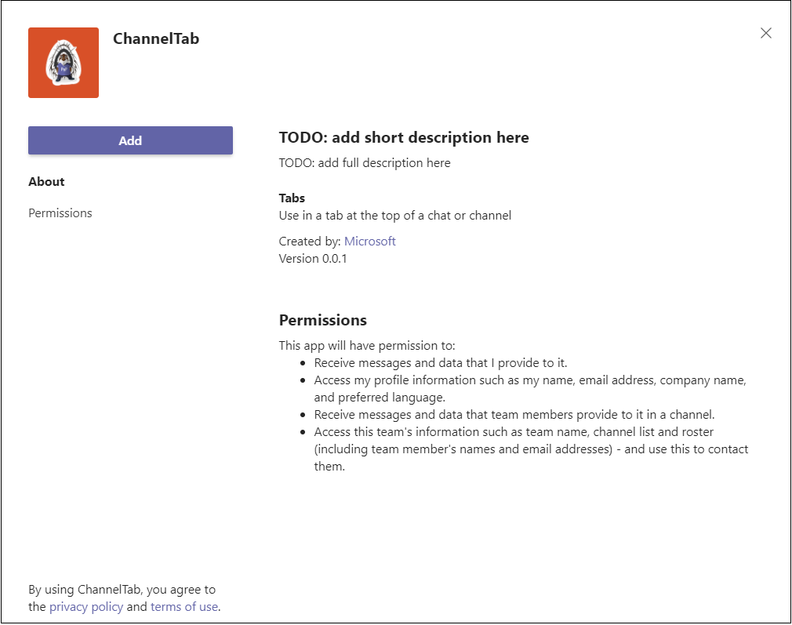

# <a name="create-a-channel-or-group-tab"></a>Создание вкладки канала или группы

## <a name="create-a-custom-channel-or-group-tab"></a>Создание настраиваемой вкладки канала или группы

Вы можете создать вкладку канала или группы с Node.js и генератора Yeoman, ASP. NETCore или ASP. MVC NETCore. Для вкладки канала или группы на Microsoft Teams см. [вкладки на мобильных устройствах](~/tabs/design/tabs-mobile.md).

# <a name="nodejs"></a>[Node.js](#tab/nodejs)

### <a name="create-a-custom-channel-and-group-tab-using-nodejs-and-the-yeoman-generator"></a>Создание настраиваемой вкладки канала и группы с Node.js и генератора Yeoman

> [!NOTE]
> В этой статье описаны действия, описанные в сборке первого Microsoft Teams [приложения Wiki,](https://github.com/OfficeDev/generator-teams/wiki/Build-Your-First-Microsoft-Teams-App) найденного в репозитории Microsoft OfficeDev GitHub.

Вы можете создать настраиваемую вкладку канала или группы с Teams [генератора Yeoman](https://github.com/OfficeDev/generator-teams/).

### <a name="prerequisites-for-apps"></a>Необходимые условия для приложений

Необходимо иметь представление о следующих предпосылках:

- Необходимо иметь клиента Office 365 и команду, настроенную с **включенной возможностью загрузки настраиваемых приложений**. Дополнительные сведения см. в [Office 365 клиента](~/concepts/build-and-test/prepare-your-o365-tenant.md).

    > [!NOTE]
    > Если у вас нет учетной записи Office 365, вы можете зарегистрироваться для бесплатной подписки через программу Office 365 разработчика. Подписка остается активной до тех пор, пока вы используете ее для текущей разработки. См[. добро пожаловать в программу Office 365 разработчиков](/office/developer-program/microsoft-365-developer-program).

Кроме того, для этого проекта необходимо установить следующее в среде разработки:

- Любой редактор текста или IDE. Вы можете установить и [использовать Microsoft Visual Studio код](https://code.visualstudio.com/download) бесплатно.

- [Node.js/npm](https://nodejs.org/en/). Используйте последнюю версию LTS. Узел диспетчер пакетов (npm) устанавливается в системе с установкой Node.js.

- После успешной установки Node.js установите [пакеты Yeoman](https://yeoman.io/) и [gulp-cli](https://www.npmjs.com/package/gulp-cli) , введите следующее в командной подсказке:

    ```bash
    npm install yo gulp-cli --global
    ```

- Установите генератор Microsoft Teams приложений, введите следующее в командной подсказке:

    ```bash
    npm install generator-teams --global
    ```

### <a name="generate-your-project"></a>Создание проекта

**Создание проекта**

1. В командной подсказке создайте новый каталог для проекта вкладки.

1. Чтобы запустить генератор, перейдите в новый каталог и введите следующую команду:

    ```bash
    yo teams
    ```

1. Далее укажи ряд значений, используемых в файле **manifest.json** приложения:

    

    **Как называется решение?**

    Это имя проекта. Вы можете принять предложенное имя, выбрав ключ **Enter** .

    **Где следует разместить файлы?**

    В настоящее время вы находитесь в каталоге проектов. Выберите **Ввод**.

    **Название проекта Microsoft Teams приложения?**

    Это имя пакета приложений, которое будет использоваться в манифесте и описании приложения. Введите название или выберите **Ввод,** чтобы принять имя по умолчанию.

    **Ваше (компания) имя? (максимум 32 символа)**

    Имя вашей компании будет использоваться в манифесте приложения. Введите имя компании или выберите **Ввод,** чтобы принять имя по умолчанию.

    **Какую версию манифеста вы бы хотели использовать?**

    Выберите схему по умолчанию.

    **Быстрый строительный лес? (Y/n)**

    По умолчанию — да; **введите n** , чтобы ввести свой microsoft Partner Id.

    **Введите свой microsoft Partner Id, если он у вас есть? (Оставьте пустым, чтобы пропустить)**

    Это поле не требуется и должно использоваться только в том случае, если вы уже входите в [партнерской сети Майкрософт](https://partner.microsoft.com).

    **Что нужно добавить в проект?**

    Выберите **( &ast; ) Вкладка**.

    **URL-адрес, на котором будет организовано это решение?**

    По умолчанию генератор предлагает URL-адрес веб-сайтов Azure. Вы тестируете приложение только локально, поэтому допустимый URL-адрес не требуется.

    **Хотите показать индикатор загрузки при загрузке приложения и вкладки?**

    Выберите **не** включать индикатор загрузки при загрузке приложения или вкладки. По умолчанию нет, введите **n**.

   **Вы хотите, чтобы личные приложения отображались без строки заголовков вкладок?**

    Не **следует** включать личные приложения, которые будут отрисовки без заглавной панели вкладок. По умолчанию нет, введите **n**.

    **Хотите включить тестовые рамки и начальные тесты? (y/N)**

    Выберите **не** включать тестовую базу для этого проекта. По умолчанию — да; **введите n**.

    **Хотите использовать приложения Azure Аналитика для телеметрии? (y/N)**

    Выберите **не включать** [приложения Azure Аналитика](/azure/azure-monitor/app/app-insights-overview). По умолчанию нет; **введите n**.

    **Имя вкладки по умолчанию (максимум 16 символов)?**

    Назови свою вкладку. Это имя вкладки будет использоваться во всем проекте в качестве компонента пути к файлу или URL-адресу.

    **Какую вкладку вы хотели бы создать?**

    Используйте клавиши со стрелками, чтобы выбрать **вкладку Configurable** .

    **Какие области вы собираетесь использовать для вкладки?**

    Вы можете выбрать группу или групповой чат.

    **Требуется ли Microsoft Azure Active Directory (Azure AD) для единой входной поддержки вкладки?**

    Не **включай** Microsoft Azure Active Directory (Azure AD) для вкладки с одним входом. По умолчанию — да, введите **n**.

    **Хотите, чтобы эта вкладка была доступна в SharePoint Online? (Y/n)**

    **Введите n**.

    > [!IMPORTANT]
    > Компонент пути **yourDefaultTabNameTab** — это значение, которое вы ввели в генератор имени вкладки по **умолчанию плюс слово** **Tab**.
    >
    > Например: DefaultTabName: **MyTab** > **/MyTabTab/**

1. В Visual Studio Code редакторе кода перейдите в каталог проекта и откройте следующий файл:

    ```bash
    ./src/app/scripts/<yourDefaultTabNameTab>/<yourDefaultTabNameTab>.tsx
    ```

1. Найдите `render()` метод и добавьте следующий `<div>` тег и содержимое в верхнюю часть кода `<PanelBody>` контейнера:

    ```html
        <PanelBody>
            <div style={styles.section}>
                Hello World! Yo Teams rocks!
            </div>
        </PanelBody>
    ```

1. Обязательно сохраните обновленный файл.

### <a name="build-and-run-your-application"></a>Сборка и запуск приложения

В командной подсказке откройте каталог проекта для выполнения следующих задач.

#### <a name="create-the-app-package"></a>Создание пакета приложений

Для проверки вкладки в Teams необходимо иметь пакет Teams. Это папка zip, которая содержит следующие необходимые файлы:

- **Значок полного цвета** размером 192 x 192 пикселя.
- **Прозрачный значок контура** размером 32 x 32 пикселя.
- Файл **manifest.json** , который указывает атрибуты вашего приложения.

Пакет создается с помощью задачи gulp, которая проверяет файл manifest.json и создает папку zip в **каталоге ./package**. В командной подсказке введите следующую команду:

```bash
gulp manifest
```

#### <a name="build-your-application"></a>Сборка приложения

Команда сборки перекладывания решения в **папку ./dist** . Введите следующую команду в командной подсказке:

```bash
gulp build
```

#### <a name="run-your-application-in-localhost"></a>Запустите приложение в localhost

1. Запустите локальный веб-сервер, введя в командную подсказку следующее:

    ```bash
    gulp serve
    ```

1. Введите `http://localhost:3007/<yourDefaultAppNameTab>/` в браузере, замените имя вкладки **на имя** вкладки и просмотреть домашняя страница приложения, как показано на следующем изображении:

    

1. Чтобы просмотреть страницу конфигурации вкладок, перейдите к `https://localhost:3007/<yourDefaultAppNameTab>/config.html`. Ниже показано:

    

### <a name="establish-a-secure-tunnel-to-your-tab"></a>Создание безопасного туннеля на вкладке

Microsoft Teams является облачным продуктом и требует, чтобы содержимое вкладки было доступно в облаке с помощью конечных точек HTTPS. Teams не разрешает локальный хостинг. Необходимо либо опубликовать вкладку на общедоступный URL-адрес, либо использовать прокси-сервер, который предоставляет локальный порт URL-адресу, относящаяся к Интернету.

Чтобы проверить расширение вкладки, используйте [ngrok](https://ngrok.com/docs), встроенный в это приложение. Ngrok — это средство обратного прокси-программного обеспечения, которое создает туннель к общедоступным конечным точкам HTTPS локального веб-сервера. Веб-точки сервера доступны во время текущего сеанса на компьютере. Когда компьютер выключен или заснул, служба перестает быть доступной.

В командной подсказке выйдите из localhost и введите следующее:

```bash
gulp ngrok-serve
```

> [!IMPORTANT]
> После того как вкладка была загружена в Microsoft Teams и успешно сохранена, ее можно просмотреть в галерее вкладок, добавить ее в планку вкладок и взаимодействовать с ней до окончания сеанса туннеля ngrok. Если вы перезапустите сеанс ngrok, необходимо обновить приложение с помощью нового URL-адреса.

### <a name="upload-your-application-to-teams"></a>Upload приложение для Teams

**Чтобы загрузить приложение в Teams**

1. Перейдите в Microsoft Teams. Если вы используете [веб-версию](https://teams.microsoft.com) , вы можете проверить исходный код с помощью средств разработчика [браузера](~/tabs/how-to/developer-tools.md).
1. На левой стороне группы выберите эллипсы &#x25CF;&#x25CF;&#x25CF; рядом с командой, которую вы используете для тестирования вкладки, и выберите команду **Manage**.
1. В главной области выберите **Приложения** из **панели вкладок** и Upload настраиваемого приложения, расположенного в нижнем правом углу страницы.
1. Перейдите в каталог проектов, просмотрите **папку ./package**, выберите папку почтовый индекс пакета приложений **и откройте.**

    

1. Выберите **Добавить** в диалоговом окне всплывающее окно. Вкладка загружается в Teams.
1. Вернись в свою команду, выберите канал, в котором нужно отобразить вкладку, ➕ выберите из панели вкладок и выберите вкладку из галереи.
1. Следуйте указаниям для добавления вкладки. Существует настраиваемый диалоговое окно конфигурации для канала или вкладки группы.
1. Выберите **Сохранить** и вкладка добавляется в вкладку канала.

    

# <a name="aspnet-core"></a>[ASP.NET Core](#tab/aspnetcore)

### <a name="create-a-custom-channel-or-group-tab-with-aspnet-core"></a>Создание настраиваемой вкладки канала или группы с помощью ASP.NET Core

Вы можете создать настраиваемую вкладку канала или группы с помощью C# и ASP.Net страницы Core Razor. [App Studio для Microsoft Teams](~/concepts/build-and-test/app-studio-overview.md) также используется для окончательного развертывания манифеста приложения и развертывания вкладки Teams.

### <a name="prerequisites-for-teams-apps"></a>Необходимые условия для Teams приложений

Необходимо иметь представление о следующих предпосылках:

- Необходимо иметь клиента Office 365 и команду, настроенную с **включенной возможностью загрузки настраиваемых приложений**. Дополнительные сведения см. в [Office 365 клиента](~/concepts/build-and-test/prepare-your-o365-tenant.md).

    > [!NOTE]
    > Если у вас в настоящее время нет Microsoft 365 учетной записи, вы можете зарегистрироваться для бесплатной подписки через [Программу разработчиков Майкрософт](https://developer.microsoft.com/en-us/microsoft-365/dev-program). Подписка остается активной до тех пор, пока вы используете ее для текущей разработки.

- Используйте App Studio для импорта приложения для Teams. Чтобы установить App Studio, выберите **App Store**  в левом нижнем углу Teams и выберите **App Studio**. После того как вы найдете плитку, выберите ее и выберите **Добавить** в всплывающее диалоговое окно, чтобы установить его.

Кроме того, для этого проекта необходимо установить следующее в среде разработки:

- Текущая версия Visual Studio IDE с установленной рабочей нагрузкой на межплатформу **.NET CORE**. Если у вас еще нет Visual Studio, вы можете скачать и установить последнюю версию Microsoft Visual Studio Community бесплатно.[](https://visualstudio.microsoft.com/downloads)

- Средство [обратного прокси ngrok](https://ngrok.com) . Используйте ngrok для создания туннеля для локальных конечных точек HTTPS на локальном веб-сервере, доступных для общего пользования. Вы можете [скачать ngrok](https://ngrok.com/download).

### <a name="get-the-source-code"></a>Получить исходный код

В командной подсказке создайте новый каталог для проекта вкладки. Для начала работы предоставляется простой проект. Клонировать репозиторий образца в новый каталог с помощью следующей команды:

```bash
git clone https://github.com/OfficeDev/microsoft-teams-sample-tabs.git
```

Кроме того, вы можете получить исходный код, скачав папку zip и извлекая файлы.

**Создание и запуск проекта вкладки**

1. После того как у вас есть исходный код, перейдите Visual Studio и выберите **Открыть проект или решение**.
1. Перейдите к каталогу приложений вкладок и откройте **ChannelGroupTab.sln**.
1. Чтобы создать и запустить приложение, нажмите **кнопку F5** или выберите **начало** отладки из **меню отладки** .
1. В браузере перейдите к следующим URL-адресам и убедитесь, что приложение загружено правильно:

    - `http://localhost:44355`
    - `http://localhost:44355/privacy`
    - `http://localhost:44355/tou`

### <a name="review-the-source-code"></a>Просмотр исходных кодов

#### <a name="startupcs"></a>Startup.cs

Этот проект был создан из пустого шаблона ASP.NET Core 2.2 веб-приложения с расширенным **- Настройка для контрольного окна HTTPS**, выбранного при установке. Службы MVC регистрируются методом впрыскивания зависимостей `ConfigureServices()` . Кроме того, пустой шаблон не позволяет обслуживать статическое содержимое по умолчанию, `Configure()` поэтому в метод добавляется среднее по статическим файлам с помощью следующего кода:

```csharp
public void ConfigureServices(IServiceCollection services)
  {
    services.AddMvc().SetCompatibilityVersion(CompatibilityVersion.Version_2_2);
  }
public void Configure(IApplicationBuilder app)
  {
    app.UseStaticFiles();
    app.UseMvc();
  }
```

#### <a name="wwwroot-folder"></a>папка wwwroot

В ASP.NET Core веб-корневой папке приложение ищет статические файлы.

#### <a name="indexcshtml"></a>Index.cshtml

ASP.NET Core относится к файлам, называемым **Index**, как к домашней странице по умолчанию для сайта. Когда URL-адрес браузера указывает на корень сайта, **Index.cshtml** отображается в качестве домашней страницы приложения.

#### <a name="tabcs"></a>Tab.cs

Этот C# содержит метод, который вызван из **Tab.cshtml** во время настройки.

#### <a name="appmanifest-folder"></a>Папка AppManifest

Эта папка содержит следующие необходимые файлы пакета приложений:

- **Значок полного цвета** размером 192 x 192 пикселя.
- **Прозрачный значок контура** размером 32 x 32 пикселя.
- Файл **manifest.json** , который указывает атрибуты вашего приложения.

Эти файлы необходимо использовать в пакете приложений для загрузки вкладки в Teams. Когда пользователь выбирает добавить или обновить вкладку, `configurationUrl` Microsoft Teams загружает указанные в манифесте данные, встраив ее в IFrame и отрисовка ее на вкладке.

#### <a name="csproj"></a>.csproj

В окне Visual Studio обозревателя решений щелкните правой кнопкой мыши по проекту и выберите **изменить Project файл**. В конце файла вы увидите следующий код, который создает и обновляет папку zip при создании приложения:

```xml
<PropertyGroup>
    <PostBuildEvent>powershell.exe Compress-Archive -Path \"$(ProjectDir)AppManifest\*\" -DestinationPath \"$(TargetDir)tab.zip\" -Force</PostBuildEvent>
  </PropertyGroup>

  <ItemGroup>
    <EmbeddedResource Include="AppManifest\icon-outline.png">
      <CopyToOutputDirectory>Always</CopyToOutputDirectory>
    </EmbeddedResource>
    <EmbeddedResource Include="AppManifest\icon-color.png">
      <CopyToOutputDirectory>Always</CopyToOutputDirectory>
    </EmbeddedResource>
    <EmbeddedResource Include="AppManifest\manifest.json">
      <CopyToOutputDirectory>Always</CopyToOutputDirectory>
    </EmbeddedResource>
  </ItemGroup>
```

### <a name="establish-a-secure-tunnel-to-your-tab-for-teams"></a>Создание безопасного туннеля на вкладке для Teams

Microsoft Teams является облачным продуктом и требует, чтобы содержимое вкладки было доступно в облаке с помощью конечных точек HTTPS. Teams не разрешает локальный хостинг. Необходимо либо опубликовать вкладку на общедоступный URL-адрес, либо использовать прокси-сервер, который предоставляет локальный порт URL-адресу, относящаяся к Интернету.

Чтобы проверить вкладку, используйте [ngrok](https://ngrok.com/docs). Веб-точки сервера доступны во время запуска ngrok на компьютере. В бесплатной версии ngrok при закрытии ngrok URL-адреса отличаются при следующем запуске.

- По командной подсказке в корневом каталоге проекта запустите следующую команду:

    ```bash
    ngrok http https://localhost:44355 -host-header="localhost:44355"
    ```

- Ngrok прослушивает запросы из Интернета и передает их в приложение при работе в порту 44355. Он должен напоминать `https://y8rCgT2b.ngrok.io/` , где **y8rCgT2b** заменяется url-адресом https ngrok alpha-numeric HTTPS.

- Убедитесь, что командная подсказка будет запущена с помощью ngrok, и сделайте примечание URL-адреса.

### <a name="update-your-application"></a>Обновление приложения

В **Tab.cshtml** приложение представляет пользователю две кнопки параметра для отображения вкладки с красным или серым значком. Выбор триггеров **выберите серый** или **выберите** `saveGray()` `saveRed()`красный или, соответственно, `settings.setValidityState(true)`наборы и включает кнопку **Сохранить** на странице конфигурации. Этот код позволяет Teams, что вы выполнили требования к конфигурации и установка может продолжиться. Параметры `settings.setSettings` заданы. Наконец, `saveEvent.notifySuccess()` называется, чтобы указать, что URL-адрес контента успешно решен.

#### <a name="_layoutcshtml"></a>_Layout.cshtml

Чтобы вкладка отображалась в Teams, необходимо включить Microsoft Teams **клиента JavaScript** `microsoftTeams.initialize()` и включить вызов после загрузки страницы. Это то, как ваша вкладка и Teams клиент:

Перейдите в **общую** папку, **откройте _Layout.cshtml** и `<head>` добавьте в тег следующее:

```html
<script src="https://ajax.aspnetcdn.com/ajax/jQuery/jquery-3.4.1.min.js"></script>
<script src="https://statics.teams.cdn.office.net/sdk/v1.6.0/js/MicrosoftTeams.min.js"></script>
```

> [!IMPORTANT]
> Не копируйте и не вделайте `<script src="...">` URL-адреса на этой странице, так как они не представляют последнюю версию. Чтобы получить последнюю версию SDK, всегда Microsoft Teams [API JavaScript](https://www.npmjs.com/package/@microsoft/teams-js).

#### <a name="tabcshtml"></a>Tab.cshtml

**Обновление Tab.cshtml**

1. Откройте **tab.cshtml** в Visual Studio и обновим встроенную `<script>`.

1. В верхней части сценария позвоните `microsoftTeams.initialize()`.

1. Обновление значений `websiteUrl` `contentUrl` и значений в каждой функции с ПОМОЩЬЮ URL-адреса https ngrok на вкладке.

    Теперь в коде должны быть указаны следующие **y8rCgT2b** , замененные URL-адресом ngrok:

    ```javascript
        microsoftTeams.initialize();

        let saveGray = () => {
            microsoftTeams.settings.registerOnSaveHandler(function (saveEvent) {
                microsoftTeams.settings.setSettings({
                    websiteUrl: `https://y8rCgT2b.ngrok.io`,
                    contentUrl: `https://y8rCgT2b.ngrok.io/gray/`,
                    entityId: "grayIconTab",
                    suggestedDisplayName: "MyNewTab"
                });
                saveEvent.notifySuccess();
            });
        }

        let saveRed = () => {
            microsoftTeams.settings.registerOnSaveHandler(function (saveEvent) {
                microsoftTeams.settings.setSettings({
                    websiteUrl: `https://y8rCgT2b.ngrok.io`,
                    contentUrl: `https://y8rCgT2b.ngrok.io/red/`,
                    entityId: "redIconTab",
                    suggestedDisplayName: "MyNewTab"
                });
                saveEvent.notifySuccess();
        });
        }
    ```

1. Сохраните обновленный **Tab.cshtml**.

### <a name="build-and-run-your-application-for-teams"></a>Сборка и запуск приложения для Teams

**Создание и запуск приложения**

1. В Visual Studio нажмите **кнопку F5** или выберите **Пуск** отладки из меню **отладки**.
1. Убедитесь, что ngrok работает и работает должным образом, открыв браузер и переехав на страницу контента через URL-адрес https **ngrok** , который был представлен в окне командной подсказки.

> [!TIP]
> Для выполнения действий, предусмотренных в этой статье, необходимо Visual Studio и ngrok. Если для работы с приложением необходимо прекратить Visual Studio, продолжайте **работать с ngrok**. Он прослушивает и возобновляет маршрутизаку запроса приложения при его перезапуске в Visual Studio. Если вам нужно перезапустить службу ngrok, она возвращает новый URL-адрес, и вам необходимо обновить приложение с помощью нового URL-адреса.

### <a name="upload-your-tab-for-teams"></a>Upload вкладку для Teams

> [!NOTE]
> App Studio можно использовать для редактирования файла **manifest.json** и отправки завершенного пакета в Teams. Вы также можете вручную изменить **файл manifest.json** . Если это так, убедитесь, что вы создайте решение снова, чтобы создать **tab.zipфайл для** загрузки.

**Для загрузки вкладки в App Studio**

1. Перейдите в Microsoft Teams. Если вы используете [веб-версию](https://teams.microsoft.com), вы можете проверить исходный код с помощью средств разработки [браузера](~/tabs/how-to/developer-tools.md).

1. Перейдите **в App Studio и** выберите **вкладку Редактор Манифеста** .

1. Выберите **импорт существующего приложения в** **редакторе Манифеста** , чтобы приступить к обновлению пакета приложений для вкладки. Исходный код поставляется со своим частично полным манифестом. Имя вашего пакета **приложенийtab.zip.** Он доступен по следующему пути:

    ```bash
    /bin/Debug/netcoreapp2.2/tab.zip
    ```

1. Upload **tab.zip** App Studio.

#### <a name="update-your-app-package-with-manifest-editor"></a>Обновление пакета приложений с помощью редактора Manifest

После отправки пакета приложений в App Studio необходимо настроить его.

Выберите плитку для недавно импортируемой вкладки в правой панели приветствия редактора Манифеста.

Слева от редактора Манифеста имеется список действий, а справа — список свойств, которые должны иметь значения для каждого из этих действий. Большая часть сведений была предоставлена вашим **manifest.json** , но есть поля, которые необходимо обновить.

##### <a name="details-app-details"></a>Сведения: сведения о приложении

В разделе **Сведения о приложении** :

1. В **статье Идентификация** выберите **Создание** для замены удостоверения замещающего удостоверения на необходимый GUID для вкладки.

1. В **соответствии с сведениями разработчика** **обновите веб-сайт** **url-адресом https ngrok** .

1. В **URL-адресах** приложений обновим заявление **Конфиденциальность** `https://<yourngrokurl>/privacy` и условия использования **для** `https://<yourngrokurl>/tou`>.

##### <a name="capabilities-tabs"></a>Возможности: Вкладки

В разделе **Tabs** :

1. В **вкладке Team** выберите **Добавить**.

1. В **всплывающее** окно вкладки "Команда" обнови **URL-адрес конфигурации** до `https://<yourngrokurl>/tab`.

1. Убедитесь **, что конфигурация can update?**, **командные** и **групповые** почтовые ящики чата выбраны и выберите **Сохранить**.

##### <a name="finish-domains-and-permissions"></a>Finish: Домены и разрешения

В разделе **Домены и разрешения** домены с  вкладок должны содержать URL-адрес ngrok без префикса `<yourngrokurl>.ngrok.io/`HTTPS.

##### <a name="finish-test-and-distribute"></a>Finish: Test and distribute

> [!IMPORTANT]
> Справа, в **Описании**, вы видите следующее предупреждение:
>
> &#9888; массив **"validDomains" не может содержать сайт тоннелей...**"
>
> Это предупреждение можно игнорировать при тестировании вкладки.

1. В разделе **Тест и Распространение** выберите **Установите**.

1. В диалоговом окне всплывающее окно выберите **Добавить** в команду или из выпадающее окно, выберите **Добавить в чат**.

1. Выберите команду или чат, в котором нужно отобразить вкладку, и выберите **Настройка вкладки**.

1. В следующем диалоговом окне всплывающее окно выберите **выберите серый** или **красный** цвет и выберите **Сохранить**.

1. Чтобы просмотреть вкладку, перейдите в команду или чат, где установлена вкладка, и выберите ее из панели вкладок. Отображается страница, выбранная во время настройки.

    

# <a name="aspnet-core-mvc"></a>[ASP.NET Core MVC](#tab/aspnetcoremvc)

### <a name="create-a-custom-channel-or-group-tab-with-aspnet-core-mvc"></a>Создание настраиваемой вкладки канала или группы с помощью ASP.NET Core MVC

Вы можете создать настраиваемую вкладку канала или группы с C# и ASP.Net MVC Core. [App Studio для Microsoft Teams](~/concepts/build-and-test/app-studio-overview.md) также используется для окончательного развертывания манифеста приложения и развертывания вкладки Teams.

### <a name="prerequisites-for-custom-channel-or-group-tab"></a>Необходимые условия для настраиваемой вкладки канала или группы

- Необходимо иметь клиента Microsoft 365 и команду, настроенную с **включенной возможностью загрузки настраиваемых приложений**. Дополнительные сведения см. в [Office 365 клиента](~/concepts/build-and-test/prepare-your-o365-tenant.md).

    > [!NOTE]
    > Если у вас в настоящее время нет Microsoft 365 учетной записи, вы можете зарегистрироваться для бесплатной подписки через [Программу разработчиков Майкрософт](https://developer.microsoft.com/en-us/microsoft-365/dev-program). Подписка остается активной до тех пор, пока вы используете ее для текущей разработки.

- Используйте App Studio для импорта приложения для Teams. Чтобы установить App Studio, выберите **App Store**  в левом нижнем углу Teams и выберите **App Studio**. После того как вы найдете плитку, выберите ее и выберите **Добавить** в всплывающее диалоговое окно, чтобы установить его.

Кроме того, для этого проекта необходимо установить следующее в среде разработки:

- Текущая версия Visual Studio IDE с установленной рабочей нагрузкой на межплатформу **.NET CORE**. Если у вас еще нет Visual Studio, вы можете скачать и установить последнюю версию Microsoft Visual Studio Community бесплатно.[](https://visualstudio.microsoft.com/downloads)

- Средство [обратного прокси ngrok](https://ngrok.com) . Используйте ngrok для создания туннеля для локальных конечных точек HTTPS на локальном веб-сервере, доступных для общего пользования. Вы можете [скачать ngrok](https://ngrok.com/download).

### <a name="get-the-source-code"></a>Получить исходный код

В командной подсказке создайте новый каталог для проекта вкладки. Для начала [работы](https://github.com/OfficeDev/microsoft-teams-sample-tabs/tree/master/ChannelGroupTabMVC) предоставляется простой проект Вкладки группы каналов. Клонировать репозиторий образца в новый каталог с помощью следующей команды:

```bash
git clone https://github.com/OfficeDev/microsoft-teams-sample-tabs.git
```

Кроме того, вы можете получить исходный код, скачав папку zip и извлекая файлы.

**Создание и запуск проекта вкладки**

1. После того как у вас есть исходный код, перейдите Visual Studio и выберите **Открыть проект или решение**.
1. Перейдите к каталогу приложений вкладок и откройте **ChannelGroupTabMVC.sln**.
1. Чтобы создать и запустить приложение, нажмите **кнопку F5** или выберите **начало** отладки из **меню отладки** .
1. В браузере перейдите к следующим URL-адресам и убедитесь, что приложение загружено правильно:

    - `http://localhost:44360`
    - `http://localhost:44360/privacy`
    - `http://localhost:44360/tou`

### <a name="review-the-source-code"></a>Просмотр исходных кодов

#### <a name="startupcs"></a>Startup.cs

Этот проект был создан из пустого шаблона ASP.NET Core 2.2 веб-приложения с расширенным **- Настройка для контрольного окна HTTPS**, выбранного при установке. Службы MVC регистрируются методом впрыскивания зависимостей `ConfigureServices()` . Кроме того, пустой шаблон не позволяет обслуживать статическое содержимое по умолчанию, `Configure()` поэтому в метод добавляется среднее по статическим файлам с помощью следующего кода:

```csharp
public void ConfigureServices(IServiceCollection services)
  {
    services.AddMvc().SetCompatibilityVersion(CompatibilityVersion.Version_2_2);
  }
public void Configure(IApplicationBuilder app)
  {
    app.UseStaticFiles();
    app.UseMvc();
  }
```

#### <a name="wwwroot-folder"></a>папка wwwroot

В ASP.NET Core веб-корневой папке приложение ищет статические файлы.

#### <a name="appmanifest-folder"></a>Папка AppManifest

Эта папка содержит следующие необходимые файлы пакета приложений:

- **Значок полного цвета** размером 192 x 192 пикселя.
- **Прозрачный значок контура** размером 32 x 32 пикселя.
- Файл **manifest.json** , который указывает атрибуты вашего приложения.

Эти файлы необходимо использовать в пакете приложений для загрузки вкладки в Teams.

#### <a name="csproj"></a>.csproj

В окне Visual Studio обозревателя решений щелкните правой кнопкой мыши по проекту и выберите **изменить Project файл**. В конце файла вы увидите следующий код, который создает и обновляет папку zip при создании приложения:

```xml
<PropertyGroup>
    <PostBuildEvent>powershell.exe Compress-Archive -Path \"$(ProjectDir)AppManifest\*\" -DestinationPath \"$(TargetDir)tab.zip\" -Force</PostBuildEvent>
  </PropertyGroup>

  <ItemGroup>
    <EmbeddedResource Include="AppManifest\icon-outline.png">
      <CopyToOutputDirectory>Always</CopyToOutputDirectory>
    </EmbeddedResource>
    <EmbeddedResource Include="AppManifest\icon-color.png">
      <CopyToOutputDirectory>Always</CopyToOutputDirectory>
    </EmbeddedResource>
    <EmbeddedResource Include="AppManifest\manifest.json">
      <CopyToOutputDirectory>Always</CopyToOutputDirectory>
    </EmbeddedResource>
  </ItemGroup>
```

#### <a name="models"></a>Модели

**ChannelGroup.cs представляет** объект Сообщения и методы, которые будут вызваны из контроллеров во время настройки.

#### <a name="views"></a>Представления

Это различные представления в ASP.NET Core MVC:

* Главная: ASP.NET Core обрабатывает файлы под названием **Index** в качестве домашней страницы или по умолчанию для сайта. Когда URL-адрес браузера указывает на корень сайта, **Index.cshtml** будет отображаться в качестве домашней страницы приложения.

* Общий доступ. Частичная разметка **_Layout.cshtml** содержит общую структуру страницы приложения и общие визуальные элементы. Он также будет ссылаться на Teams библиотеку.

#### <a name="controllers"></a>Контроллеры

Контроллеры используют свойство `ViewBag` для динамического переноса значений в представления.

[!INCLUDE [dotnet-ngrok-intro](~/includes/tabs/dotnet-ngrok-intro.md)]

* Откройте командную подсказку в корневом каталоге проекта и запустите следующую команду:

    ```bash
    ngrok http https://localhost:443560 -host-header="localhost:44360"
    ```

* Ngrok будет прослушивать запросы из Интернета и перенанастрает их в ваше приложение, когда оно запущено в порту 44355. Он должен напоминать `https://y8rCgT2b.ngrok.io/` , где **y8rCgT2b** заменяется url-адресом https ngrok alpha-numeric HTTPS.

* Убедитесь, что командная подсказка будет запущена с помощью ngrok, и сделайте примечание URL-адреса.

### <a name="update-your-application"></a>Обновление приложения

В **Tab.cshtml** приложение представляет пользователю две кнопки параметра для отображения вкладки с красным или серым значком. Выбор кнопки **Выберите серый** или **выберите** красный, `saveGray()` `saveRed()`триггеры или, соответственно, `settings.setValidityState(true)`задает и включает кнопку **Сохранить** на странице конфигурации. Этот код позволяет Teams, что вы выполнили требования к конфигурации и установка может продолжиться. При сохранения заданы `settings.setSettings` параметры. Наконец, `saveEvent.notifySuccess()` называется, чтобы указать, что URL-адрес контента успешно решен.

[!INCLUDE [dotnet-update-app](~/includes/tabs/dotnet-update-chan-grp-app.md)]

---

## <a name="next-step"></a>Следующий этап

> [!div class="nextstepaction"]
> [Создать страницу контента](~/tabs/how-to/create-tab-pages/content-page.md)

## <a name="see-also"></a>См. также

* [Teams вкладки](~/tabs/what-are-tabs.md)
* [Создание личной вкладки](~/tabs/how-to/create-personal-tab.md)
* [Вкладки на мобильных устройствах](~/tabs/design/tabs-mobile.md)
* [Создание вкладок с использованием адаптивных карточек](~/tabs/how-to/build-adaptive-card-tabs.md)
* [Создать страницу удаления](~/tabs/how-to/create-tab-pages/removal-page.md)
