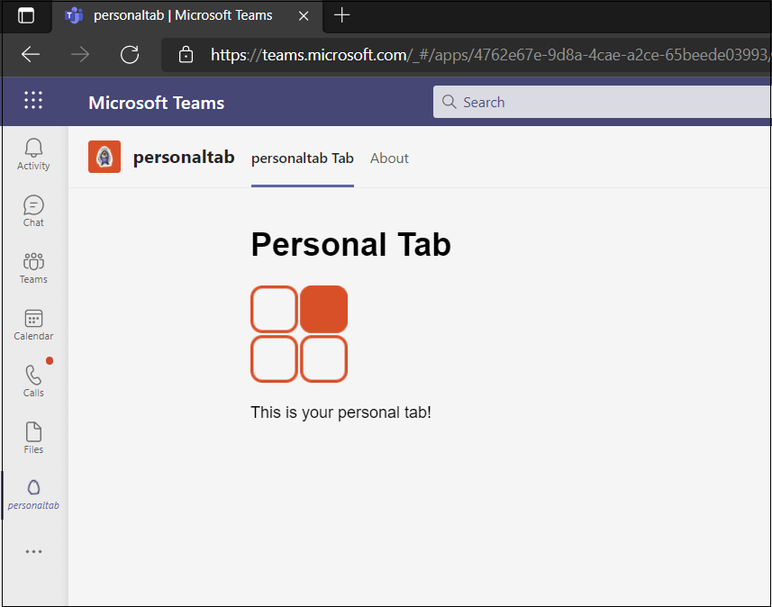
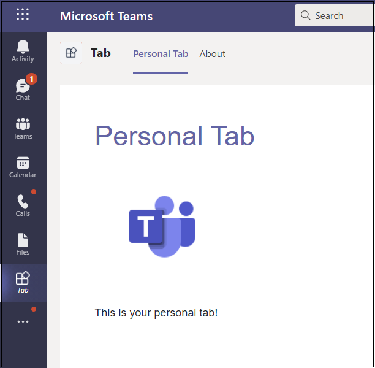

# <a name="create-a-personal-tab"></a><span data-ttu-id="be210-103">Создание личной вкладки</span><span class="sxs-lookup"><span data-stu-id="be210-103">Create a personal tab</span></span>

## <a name="create-a-custom-personal-tab"></a><span data-ttu-id="be210-104">Создание настраиваемой личной вкладки</span><span class="sxs-lookup"><span data-stu-id="be210-104">Create a custom personal tab</span></span>

<span data-ttu-id="be210-105">Вы можете создать личную вкладку с помощью Node.js и генератора Yeoman, ASP.NET Core или ASP.NET Core MVC.</span><span class="sxs-lookup"><span data-stu-id="be210-105">You can create a personal tab using Node.js and the Yeoman Generator, ASP.NET Core, or ASP.NET Core MVC.</span></span>

# <a name="nodejs"></a>[<span data-ttu-id="be210-106">Node.js</span><span class="sxs-lookup"><span data-stu-id="be210-106">Node.js</span></span>](#tab/nodejs)

### <a name="create-a-custom-personal-tab-using-nodejs-and-the-yeoman-generator"></a><span data-ttu-id="be210-107">Создание настраиваемой личной вкладки Node.js и генератора Yeoman</span><span class="sxs-lookup"><span data-stu-id="be210-107">Create a custom personal tab using Node.js and the Yeoman Generator</span></span>

> [!NOTE]
> <span data-ttu-id="be210-108">В этой статье описаны действия, описанные в создании первого Microsoft Teams приложения [Wiki,](https://github.com/OfficeDev/generator-teams/wiki/Build-Your-First-Microsoft-Teams-App) найденного в репозитории Microsoft OfficeDev GitHub.</span><span class="sxs-lookup"><span data-stu-id="be210-108">This article follows the steps outlined in the [build your first Microsoft Teams app](https://github.com/OfficeDev/generator-teams/wiki/Build-Your-First-Microsoft-Teams-App) Wiki found in the Microsoft OfficeDev GitHub repository.</span></span>

<span data-ttu-id="be210-109">Вы можете создать настраиваемую личную вкладку с [помощью Teams Yeoman.](https://github.com/OfficeDev/generator-teams/wiki/Build-Your-First-Microsoft-Teams-App)</span><span class="sxs-lookup"><span data-stu-id="be210-109">You can create a custom personal tab using the [Teams Yeoman generator](https://github.com/OfficeDev/generator-teams/wiki/Build-Your-First-Microsoft-Teams-App).</span></span> <span data-ttu-id="be210-110">Приложение также загружается в Teams.</span><span class="sxs-lookup"><span data-stu-id="be210-110">The application is also uploaded to Teams.</span></span>

### <a name="prerequisites-for-teams-apps"></a><span data-ttu-id="be210-111">Необходимые условия для Teams приложений</span><span class="sxs-lookup"><span data-stu-id="be210-111">Prerequisites for Teams apps</span></span>

<span data-ttu-id="be210-112">Необходимо иметь представление о следующих предпосылках:</span><span class="sxs-lookup"><span data-stu-id="be210-112">You must have an understanding of the following prerequisites:</span></span>

- <span data-ttu-id="be210-113">Необходимо иметь клиента Office 365 и команду с **включенной возможностью загрузки настраиваемых приложений.**</span><span class="sxs-lookup"><span data-stu-id="be210-113">You must have an Office 365 tenant and a team configured with **Allow uploading custom apps** enabled.</span></span> <span data-ttu-id="be210-114">Дополнительные сведения см. в [Office 365 клиента.](~/concepts/build-and-test/prepare-your-o365-tenant.md)</span><span class="sxs-lookup"><span data-stu-id="be210-114">For more information, see [prepare your Office 365 tenant](~/concepts/build-and-test/prepare-your-o365-tenant.md).</span></span>

    > [!NOTE]
    > <span data-ttu-id="be210-115">Если у вас нет Office 365 учетной записи, вы можете зарегистрироваться для бесплатной подписки через программу Office 365 разработчика.</span><span class="sxs-lookup"><span data-stu-id="be210-115">If you do not have an Office 365 account, you can sign up for a free subscription through the Office 365 Developer Program.</span></span> <span data-ttu-id="be210-116">Подписка остается активной до тех пор, пока вы используете ее для текущей разработки.</span><span class="sxs-lookup"><span data-stu-id="be210-116">The subscription remains active as long as you are using it for ongoing development.</span></span> <span data-ttu-id="be210-117">См. [добро пожаловать в программу Office 365 разработчика](/office/developer-program/microsoft-365-developer-program).</span><span class="sxs-lookup"><span data-stu-id="be210-117">See [welcome to the Office 365 Developer Program](/office/developer-program/microsoft-365-developer-program).</span></span>

<span data-ttu-id="be210-118">Кроме того, для этого проекта необходимо установить следующее в среде разработки:</span><span class="sxs-lookup"><span data-stu-id="be210-118">In addition, this project requires that you have the following installed in your development environment:</span></span>

- <span data-ttu-id="be210-119">Любой редактор текста или IDE.</span><span class="sxs-lookup"><span data-stu-id="be210-119">Any text editor or IDE.</span></span> <span data-ttu-id="be210-120">Вы можете установить и [использовать Visual Studio Code](https://code.visualstudio.com/download) бесплатно.</span><span class="sxs-lookup"><span data-stu-id="be210-120">You can install and use [Visual Studio Code](https://code.visualstudio.com/download) for free.</span></span>

- <span data-ttu-id="be210-121">[Node.js/npm](https://nodejs.org/en/).</span><span class="sxs-lookup"><span data-stu-id="be210-121">[Node.js/npm](https://nodejs.org/en/).</span></span> <span data-ttu-id="be210-122">Используйте последнюю версию LTS.</span><span class="sxs-lookup"><span data-stu-id="be210-122">Use the latest LTS version.</span></span> <span data-ttu-id="be210-123">Узел диспетчер пакетов (npm) устанавливается в системе с установкой Node.js.</span><span class="sxs-lookup"><span data-stu-id="be210-123">The Node Package Manager (npm) is installed in your system with the installation of Node.js.</span></span>

- <span data-ttu-id="be210-124">После успешной установки Node.js установите [пакеты Yeoman](https://yeoman.io/) и [gulp-cli,](https://www.npmjs.com/package/gulp-cli) введите следующее в командной подсказке:</span><span class="sxs-lookup"><span data-stu-id="be210-124">After you have successfully installed Node.js, install the [Yeoman](https://yeoman.io/) and [gulp-cli](https://www.npmjs.com/package/gulp-cli) packages by entering the following in your command prompt:</span></span>

    ```bash
    npm install yo gulp-cli --global
    ```

- <span data-ttu-id="be210-125">Установите генератор Microsoft Teams приложений, введите следующее в командной подсказке:</span><span class="sxs-lookup"><span data-stu-id="be210-125">Install the Microsoft Teams Apps generator by entering the following in your command prompt:</span></span>

    ```bash
    npm install generator-teams --global
    ```

### <a name="generate-your-project"></a><span data-ttu-id="be210-126">Создание проекта</span><span class="sxs-lookup"><span data-stu-id="be210-126">Generate your project</span></span>

<span data-ttu-id="be210-127">**Создание проекта**</span><span class="sxs-lookup"><span data-stu-id="be210-127">**To generate your project**</span></span>

1. <span data-ttu-id="be210-128">В командной подсказке создайте новый каталог для проекта вкладки.</span><span class="sxs-lookup"><span data-stu-id="be210-128">At a command prompt, create a new directory for your tab project.</span></span>

1. <span data-ttu-id="be210-129">Чтобы запустить генератор, перейдите в новый каталог и введите следующую команду:</span><span class="sxs-lookup"><span data-stu-id="be210-129">To start the generator, go to your new directory and enter the following command:</span></span>

    ```bash
    yo teams
    ```

1. <span data-ttu-id="be210-130">Далее укайте ряд значений, используемых в файле **manifest.jsприложения:**</span><span class="sxs-lookup"><span data-stu-id="be210-130">Next, provide a series of values that are used in your application's **manifest.json** file:</span></span>

    

    <span data-ttu-id="be210-132">**Как называется ваше решение?**</span><span class="sxs-lookup"><span data-stu-id="be210-132">**What is your solution name?**</span></span>

    <span data-ttu-id="be210-133">Это имя проекта.</span><span class="sxs-lookup"><span data-stu-id="be210-133">This is your project name.</span></span> <span data-ttu-id="be210-134">Вы можете принять предложенное имя, выбрав ключ **Enter.**</span><span class="sxs-lookup"><span data-stu-id="be210-134">You can accept the suggested name by selecting the **Enter** key.</span></span>

    <span data-ttu-id="be210-135">**Где следует разместить файлы?**</span><span class="sxs-lookup"><span data-stu-id="be210-135">**Where do you want to place the files?**</span></span>

    <span data-ttu-id="be210-136">В настоящее время вы находитесь в каталоге проектов.</span><span class="sxs-lookup"><span data-stu-id="be210-136">You are currently in your project directory.</span></span> <span data-ttu-id="be210-137">Выберите **Ввод**.</span><span class="sxs-lookup"><span data-stu-id="be210-137">Select **Enter**.</span></span>

    <span data-ttu-id="be210-138">**Название проекта Microsoft Teams приложения?**</span><span class="sxs-lookup"><span data-stu-id="be210-138">**Title of your Microsoft Teams app project?**</span></span>

    <span data-ttu-id="be210-139">Это имя пакета приложений, которое будет использоваться в манифесте и описании приложения.</span><span class="sxs-lookup"><span data-stu-id="be210-139">This is your app package name and will be used in the app manifest and description.</span></span> <span data-ttu-id="be210-140">Введите название или выберите **Ввод,** чтобы принять имя по умолчанию.</span><span class="sxs-lookup"><span data-stu-id="be210-140">Enter a title or select **Enter** to accept the default name.</span></span>

    <span data-ttu-id="be210-141">**Ваше (компания) имя? (максимум 32 символа)**</span><span class="sxs-lookup"><span data-stu-id="be210-141">**Your (company) name? (max 32 characters)**</span></span>

    <span data-ttu-id="be210-142">Имя вашей компании будет использоваться в манифесте приложения.</span><span class="sxs-lookup"><span data-stu-id="be210-142">Your company name will be used in the app manifest.</span></span> <span data-ttu-id="be210-143">Введите имя компании или выберите **Ввод,** чтобы принять имя по умолчанию.</span><span class="sxs-lookup"><span data-stu-id="be210-143">Enter a company name or select **Enter** to accept the default name.</span></span>

    <span data-ttu-id="be210-144">**Какую версию манифеста вы бы хотели использовать?**</span><span class="sxs-lookup"><span data-stu-id="be210-144">**Which manifest version would you like to use?**</span></span>

    <span data-ttu-id="be210-145">Выберите схему по умолчанию.</span><span class="sxs-lookup"><span data-stu-id="be210-145">Select the default schema.</span></span>

    <span data-ttu-id="be210-146">**Быстрый строительный лес? (Y/n)**</span><span class="sxs-lookup"><span data-stu-id="be210-146">**Quick scaffolding? (Y/n)**</span></span>

    <span data-ttu-id="be210-147">По умолчанию — да; введите **n,** чтобы ввести свой microsoft Partner Id.</span><span class="sxs-lookup"><span data-stu-id="be210-147">The default is yes; enter **n** to enter your Microsoft Partner Id.</span></span>

    <span data-ttu-id="be210-148">**Введите свой microsoft Partner Id, если он у вас есть? (Оставьте пустым, чтобы пропустить)**</span><span class="sxs-lookup"><span data-stu-id="be210-148">**Enter your Microsoft Partner Id, if you have one? (Leave blank to skip)**</span></span>

    <span data-ttu-id="be210-149">Это поле не требуется и должно использоваться только в том случае, если вы уже входите в [партнерской сети Майкрософт.](https://partner.microsoft.com)</span><span class="sxs-lookup"><span data-stu-id="be210-149">This field is not required and should only be used if you are already part of the [Microsoft Partner Network](https://partner.microsoft.com).</span></span>

    <span data-ttu-id="be210-150">**Что нужно добавить в проект?**</span><span class="sxs-lookup"><span data-stu-id="be210-150">**What do you want to add to your project?**</span></span>

    <span data-ttu-id="be210-151">Выберите **&ast; () Вкладка**.</span><span class="sxs-lookup"><span data-stu-id="be210-151">Select **( &ast; ) A Tab**.</span></span>

    <span data-ttu-id="be210-152">**URL-адрес, на котором будет организовано это решение?**</span><span class="sxs-lookup"><span data-stu-id="be210-152">**The URL where you will host this solution?**</span></span>

    <span data-ttu-id="be210-153">По умолчанию генератор предлагает URL-адрес веб-сайтов Azure.</span><span class="sxs-lookup"><span data-stu-id="be210-153">By default the generator suggests an Azure Web Sites URL.</span></span> <span data-ttu-id="be210-154">Вы тестируете приложение только локально, поэтому допустимый URL-адрес не требуется.</span><span class="sxs-lookup"><span data-stu-id="be210-154">You are only testing your app locally, therefore, a valid URL is not necessary.</span></span>

    <span data-ttu-id="be210-155">**Хотите показать индикатор загрузки при загрузке приложения и вкладки?**</span><span class="sxs-lookup"><span data-stu-id="be210-155">**Would you like show a loading indicator when your app/tab loads?**</span></span>

    <span data-ttu-id="be210-156">Выберите **не** включать индикатор загрузки при загрузке приложения или вкладки.</span><span class="sxs-lookup"><span data-stu-id="be210-156">Choose **not** to include a loading indicator when your app or tab loads.</span></span> <span data-ttu-id="be210-157">По умолчанию нет, введите **n**.</span><span class="sxs-lookup"><span data-stu-id="be210-157">The default is no, enter **n**.</span></span>

    <span data-ttu-id="be210-158">**Вы хотите, чтобы личные приложения отображались без строки заголовков вкладок?**</span><span class="sxs-lookup"><span data-stu-id="be210-158">**Would you like personal apps to be rendered without a tab header-bar?**</span></span>

    <span data-ttu-id="be210-159">Не **следует** включать личные приложения, которые будут отрисовки без заглавной панели вкладок.</span><span class="sxs-lookup"><span data-stu-id="be210-159">Choose **not** to include personal apps to be rendered without a tab header-bar.</span></span> <span data-ttu-id="be210-160">По умолчанию нет, введите **n**.</span><span class="sxs-lookup"><span data-stu-id="be210-160">Default is no, enter **n**.</span></span>

    <span data-ttu-id="be210-161">**Хотите включить тестовые рамки и начальные тесты? (y/N)**</span><span class="sxs-lookup"><span data-stu-id="be210-161">**Would you like to include Test framework and initial tests? (y/N)**</span></span>

    <span data-ttu-id="be210-162">Выберите **не** включать тестовую базу для этого проекта.</span><span class="sxs-lookup"><span data-stu-id="be210-162">Choose **not** to include a test framework for this project.</span></span> <span data-ttu-id="be210-163">По умолчанию — да, введите **n**.</span><span class="sxs-lookup"><span data-stu-id="be210-163">The default is yes, enter **n**.</span></span>

    <span data-ttu-id="be210-164">**Хотите использовать приложения Azure Аналитика для телеметрии? (y/N)**</span><span class="sxs-lookup"><span data-stu-id="be210-164">**Would you like to use Azure Applications Insights for telemetry? (y/N)**</span></span>

    <span data-ttu-id="be210-165">Не **включать** приложения [Azure Аналитика.](/azure/azure-monitor/app/app-insights-overview)</span><span class="sxs-lookup"><span data-stu-id="be210-165">Choose **not** to include [Azure Application Insights](/azure/azure-monitor/app/app-insights-overview).</span></span> <span data-ttu-id="be210-166">По умолчанию нет; введите **n**.</span><span class="sxs-lookup"><span data-stu-id="be210-166">The default is no; enter **n**.</span></span>

    <span data-ttu-id="be210-167">**Имя вкладки по умолчанию (максимум 16 символов)?**</span><span class="sxs-lookup"><span data-stu-id="be210-167">**Default Tab Name (max 16 characters)?**</span></span>

    <span data-ttu-id="be210-168">Назови свою вкладку. Это имя вкладки используется во всем проекте в качестве компонента пути к файлу или URL-адресу.</span><span class="sxs-lookup"><span data-stu-id="be210-168">Name your tab. This tab name is used throughout your project as a file or URL path component.</span></span>

    <span data-ttu-id="be210-169">**Какую вкладку вы хотели бы создать?**</span><span class="sxs-lookup"><span data-stu-id="be210-169">**What kind of Tab would you like to create?**</span></span>

    <span data-ttu-id="be210-170">Используйте клавиши стрелки для выбора **Личного (статического)**.</span><span class="sxs-lookup"><span data-stu-id="be210-170">Use the arrow keys to select **Personal (static)**.</span></span>

    <span data-ttu-id="be210-171">**Требуется ли поддержка единого входа Azure AD для этой вкладки?**</span><span class="sxs-lookup"><span data-stu-id="be210-171">**Do you require Azure AD Single-Sign-On support for the tab?**</span></span>

    <span data-ttu-id="be210-172">Не  включай поддержку для вкладки Azure AD с одним входом. По умолчанию — да, введите **n**.</span><span class="sxs-lookup"><span data-stu-id="be210-172">Choose **not** to include Azure AD Single-Sign-On support for the tab. The default is yes, enter **n**.</span></span>

    > [!IMPORTANT]
    > <span data-ttu-id="be210-173">Компонент пути **yourDefaultTabNameTab** — это значение, которое вы ввели в генератор имени вкладки по умолчанию **плюс** слово **Tab**.</span><span class="sxs-lookup"><span data-stu-id="be210-173">The path component **yourDefaultTabNameTab** is the value that you entered in the generator for **Default Tab Name** plus the word **Tab**.</span></span>
    >
    > <span data-ttu-id="be210-174">Например: DefaultTabName: **MyTab**  >  **/MyTabTab/**</span><span class="sxs-lookup"><span data-stu-id="be210-174">For example: DefaultTabName: **MyTab** > **/MyTabTab/**</span></span>

### <a name="add-a-personal-tab"></a><span data-ttu-id="be210-175">Добавление личной вкладки</span><span class="sxs-lookup"><span data-stu-id="be210-175">Add a personal tab</span></span>

<span data-ttu-id="be210-176">**Чтобы добавить личную вкладку в это приложение, создайте страницу контента и обновим существующие файлы**</span><span class="sxs-lookup"><span data-stu-id="be210-176">**To add a personal tab to this application, create a content page, and update existing files**</span></span>

1. <span data-ttu-id="be210-177">В редакторе кода создайте новый HTML-файлpersonal.htm **l** и добавьте следующую разметку:</span><span class="sxs-lookup"><span data-stu-id="be210-177">In your code editor, create a new HTML file, **personal.html** and add the following markup:</span></span>

    ```html
    <!DOCTYPE html>
    <html>
        <head>
            <meta charset="UTF-8">
            <title>
                <!-- Todo: add your a title here -->
            </title>
            <meta name="viewport" content="width=device-width, initial-scale=1.0">
            <!-- inject:css -->
            <!-- endinject -->
        </head>
            <body>
                <h1>Personal Tab</h1>
                <p></p>
                <p>This is your personal tab!</p>
            </body>
    </html>
    ```

1. <span data-ttu-id="be210-178">Сохраните **personal.html** в **веб-папке** приложения в следующем расположении:</span><span class="sxs-lookup"><span data-stu-id="be210-178">Save **personal.html** in your application's **web** folder in the following location:</span></span>

    ```bash
    ./src/app/web/<yourDefaultTabNameTab>/personal.html
    ```

1. <span data-ttu-id="be210-179">Откройте **manifest.jsиз** следующего расположения в редакторе кода:</span><span class="sxs-lookup"><span data-stu-id="be210-179">Open **manifest.json** from the following location in your code editor:</span></span>

    ```bash
    ./src/manifest/manifest.json/
    ```

1. <span data-ttu-id="be210-180">Добавьте следующее в пустой массив `staticTabs` () и `staticTabs":[]` добавьте следующий объект JSON:</span><span class="sxs-lookup"><span data-stu-id="be210-180">Add the following to the empty `staticTabs` array (`staticTabs":[]`) and add the following JSON object:</span></span>

    ```json
    {
        "entityId": "personalTab",
        "name": "Personal Tab ",
        "contentUrl": "https://{{HOSTNAME}}/<yourDefaultTabNameTab>/personal.html",
        "websiteUrl": "https://{{HOSTNAME}}",
        "scopes": ["personal"]
    }
    ```

1. <span data-ttu-id="be210-181">**Обновите компонент пути contentURL** **yourDefaultTabNameTab с** фактическим именем вкладки.</span><span class="sxs-lookup"><span data-stu-id="be210-181">Update the **contentURL** path component **yourDefaultTabNameTab** with your actual tab name.</span></span>

1. <span data-ttu-id="be210-182">Сохраните обновленный **manifest.jsв** файле.</span><span class="sxs-lookup"><span data-stu-id="be210-182">Save the updated **manifest.json** file.</span></span>

1. <span data-ttu-id="be210-183">Чтобы предоставить страницу контента в IFrame, откройте **Tab.ts** в редакторе кода следующим образом:</span><span class="sxs-lookup"><span data-stu-id="be210-183">To provide your content page in an IFrame, open **Tab.ts** in your code editor from the following path:</span></span>

    ```bash
    ./src/app/<yourDefaultTabNameTab>/<yourDefaultTabNameTab>.ts
    ```

1. <span data-ttu-id="be210-184">Добавьте в список декораторов IFrame следующее:</span><span class="sxs-lookup"><span data-stu-id="be210-184">Add the following to the list of IFrame decorators:</span></span>

    ```typescript
     @PreventIframe("/<yourDefaultAppName>TabNameTab>/personal.html")
    ```

1. <span data-ttu-id="be210-185">Сохраните обновленный **файл Tab.ts.**</span><span class="sxs-lookup"><span data-stu-id="be210-185">Save the updated **Tab.ts** file.</span></span> <span data-ttu-id="be210-186">Код вкладки завершен.</span><span class="sxs-lookup"><span data-stu-id="be210-186">Your tab code is complete.</span></span>

### <a name="build-and-run-your-application"></a><span data-ttu-id="be210-187">Сборка и запуск приложения</span><span class="sxs-lookup"><span data-stu-id="be210-187">Build and run your application</span></span>

<span data-ttu-id="be210-188">В командной подсказке откройте каталог проекта для выполнения следующих задач.</span><span class="sxs-lookup"><span data-stu-id="be210-188">At a command prompt, open your project directory to complete the next tasks.</span></span>

#### <a name="create-the-app-package"></a><span data-ttu-id="be210-189">Создание пакета приложений</span><span class="sxs-lookup"><span data-stu-id="be210-189">Create the app package</span></span>

<span data-ttu-id="be210-190">Чтобы проверить вкладку в Teams, необходимо иметь пакет Teams.</span><span class="sxs-lookup"><span data-stu-id="be210-190">You must have an app package to test your tab in Teams.</span></span> <span data-ttu-id="be210-191">Это папка zip, которая содержит следующие необходимые файлы:</span><span class="sxs-lookup"><span data-stu-id="be210-191">It is a zip folder that contains the following required files:</span></span>

- <span data-ttu-id="be210-192">Значок **полного цвета** размером 192 x 192 пикселя.</span><span class="sxs-lookup"><span data-stu-id="be210-192">A **full color icon** measuring 192 x 192 pixels.</span></span>
- <span data-ttu-id="be210-193">Прозрачный **значок контура** размером 32 x 32 пикселя.</span><span class="sxs-lookup"><span data-stu-id="be210-193">A **transparent outline icon** measuring 32 x 32 pixels.</span></span>
- <span data-ttu-id="be210-194">Файл **manifest.js,** который указывает атрибуты приложения.</span><span class="sxs-lookup"><span data-stu-id="be210-194">A **manifest.json** file that specifies the attributes of your app.</span></span>

<span data-ttu-id="be210-195">Пакет создается с помощью задачи gulp, которая проверяет manifest.jsфайл и создает папку zip в **каталоге ./package.**</span><span class="sxs-lookup"><span data-stu-id="be210-195">The package is created through a gulp task that validates the manifest.json file and generates the zip folder in the **./package directory**.</span></span> <span data-ttu-id="be210-196">В командной подсказке введите следующую команду:</span><span class="sxs-lookup"><span data-stu-id="be210-196">In the command prompt, enter the following command:</span></span>

```bash
gulp manifest
```

#### <a name="build-your-application"></a><span data-ttu-id="be210-197">Сборка приложения</span><span class="sxs-lookup"><span data-stu-id="be210-197">Build your application</span></span>

<span data-ttu-id="be210-198">Команда сборки перекладывания решения в **папку ./dist.**</span><span class="sxs-lookup"><span data-stu-id="be210-198">The build command transpiles your solution into the **./dist** folder.</span></span> <span data-ttu-id="be210-199">Введите следующую команду в командной подсказке:</span><span class="sxs-lookup"><span data-stu-id="be210-199">Enter the following command in the command prompt:</span></span>

```bash
gulp build
```

#### <a name="run-your-application-in-localhost"></a><span data-ttu-id="be210-200">Запустите приложение в localhost</span><span class="sxs-lookup"><span data-stu-id="be210-200">Run your application in localhost</span></span>

1. <span data-ttu-id="be210-201">Запустите локальный веб-сервер, введя в командную подсказку следующее:</span><span class="sxs-lookup"><span data-stu-id="be210-201">Start a local web server by entering the following in the command prompt:</span></span>

    ```bash
    gulp serve
    ```

1. <span data-ttu-id="be210-202">Введите в браузере, замените имя вкладки и просмотр домашней страницы приложения, как показано на `http://localhost:3007/<yourDefaultAppNameTab>/` **<yourDefaultAppNameTab>** следующем изображении:</span><span class="sxs-lookup"><span data-stu-id="be210-202">Enter `http://localhost:3007/<yourDefaultAppNameTab>/` in your browser, replace **<yourDefaultAppNameTab>** with your tab name, and view your application's home page as shown in the following image:</span></span>

    

1. <span data-ttu-id="be210-204">Чтобы просмотреть личную вкладку, перейдите к `http://localhost:3007/<yourDefaultAppNameTab>/personal.html` .</span><span class="sxs-lookup"><span data-stu-id="be210-204">To view your personal tab, go to `http://localhost:3007/<yourDefaultAppNameTab>/personal.html`.</span></span>

    >

### <a name="establish-a-secure-tunnel-to-your-tab"></a><span data-ttu-id="be210-206">Создание безопасного туннеля на вкладке</span><span class="sxs-lookup"><span data-stu-id="be210-206">Establish a secure tunnel to your tab</span></span>

<span data-ttu-id="be210-207">Microsoft Teams является облачным продуктом и требует, чтобы содержимое вкладки было доступно в облаке с помощью конечных точек HTTPS.</span><span class="sxs-lookup"><span data-stu-id="be210-207">Microsoft Teams is a cloud-based product and requires that your tab content be available from the cloud using HTTPS endpoints.</span></span> <span data-ttu-id="be210-208">Teams не разрешает локальный хостинг.</span><span class="sxs-lookup"><span data-stu-id="be210-208">Teams does not allow local hosting.</span></span> <span data-ttu-id="be210-209">Необходимо либо опубликовать вкладку на общедоступный URL-адрес, либо использовать прокси-сервер, который предоставляет локальный порт URL-адресу, относящаяся к Интернету.</span><span class="sxs-lookup"><span data-stu-id="be210-209">You must either publish your tab to a public URL or use a proxy that exposes your local port to an internet-facing URL.</span></span>

<span data-ttu-id="be210-210">Чтобы проверить расширение вкладки, можно использовать [ngrok,](https://ngrok.com/docs)встроенный в это приложение.</span><span class="sxs-lookup"><span data-stu-id="be210-210">To test your tab extension, you can use [ngrok](https://ngrok.com/docs), which is built into this application.</span></span> <span data-ttu-id="be210-211">Ngrok — это средство обратного прокси-программного обеспечения, которое создает туннель к общедоступным конечным точкам HTTPS локального веб-сервера.</span><span class="sxs-lookup"><span data-stu-id="be210-211">Ngrok is a reverse proxy software tool that creates a tunnel to your locally running web server's publicly-available HTTPS endpoints.</span></span> <span data-ttu-id="be210-212">Веб-точки сервера доступны во время текущего сеанса на компьютере.</span><span class="sxs-lookup"><span data-stu-id="be210-212">Your server's web endpoints are available during the current session on your computer.</span></span> <span data-ttu-id="be210-213">Когда компьютер выключен или заснул, служба перестает быть доступной.</span><span class="sxs-lookup"><span data-stu-id="be210-213">When the computer is shut down or goes to sleep, the service is no longer available.</span></span>

<span data-ttu-id="be210-214">В командной подсказке выйдите из localhost и введите следующее:</span><span class="sxs-lookup"><span data-stu-id="be210-214">In your command prompt, exit localhost and enter the following:</span></span>

```bash
gulp ngrok-serve
```

> [!IMPORTANT]
> <span data-ttu-id="be210-215">После того как вкладка была загружена в Microsoft Teams **ngrok** и успешно сохранена, ее можно просмотреть в Teams до окончания сеанса туннеля.</span><span class="sxs-lookup"><span data-stu-id="be210-215">After your tab has been uploaded to Microsoft Teams through **ngrok**, and successfully saved, you can view it in Teams until your tunnel session ends.</span></span>

### <a name="upload-your-application-to-teams"></a><span data-ttu-id="be210-216">Upload приложение для Teams</span><span class="sxs-lookup"><span data-stu-id="be210-216">Upload your application to Teams</span></span>

<span data-ttu-id="be210-217">**Отправка приложения в Teams**</span><span class="sxs-lookup"><span data-stu-id="be210-217">**To upload your application to Teams**</span></span>

1. <span data-ttu-id="be210-218">Перейдите Microsoft Teams.</span><span class="sxs-lookup"><span data-stu-id="be210-218">Go to Microsoft Teams.</span></span> <span data-ttu-id="be210-219">Если вы используете [веб-версию,](https://teams.microsoft.com) вы можете проверить исходный код с помощью средств разработчика [браузера.](~/tabs/how-to/developer-tools.md)</span><span class="sxs-lookup"><span data-stu-id="be210-219">If you use the [web-based version](https://teams.microsoft.com) you can inspect your front-end code using your browser's [developer tools](~/tabs/how-to/developer-tools.md).</span></span>
1. <span data-ttu-id="be210-220">В левом нижнем углу выберите **Приложения.**</span><span class="sxs-lookup"><span data-stu-id="be210-220">From the lower left corner, select **Apps**.</span></span>
1. <span data-ttu-id="be210-221">В левом нижнем углу **выберите Upload настраиваемого приложения.**</span><span class="sxs-lookup"><span data-stu-id="be210-221">From the lower left corner, choose **Upload a custom app**.</span></span>
1. <span data-ttu-id="be210-222">Перейдите в каталог проекта, просмотрите **папку ./package,** выберите папку zip и **откройте.**</span><span class="sxs-lookup"><span data-stu-id="be210-222">Go to your project directory, browse to the **./package** folder, select the zip folder, and choose **Open**.</span></span>

    

1. <span data-ttu-id="be210-224">Выберите **Добавить** в диалоговом окне всплывающее окно.</span><span class="sxs-lookup"><span data-stu-id="be210-224">Select **Add** in the pop-up dialog box.</span></span> <span data-ttu-id="be210-225">Вкладка загружается в Teams.</span><span class="sxs-lookup"><span data-stu-id="be210-225">Your tab is uploaded to Teams.</span></span>

    

### <a name="view-your-personal-tab"></a><span data-ttu-id="be210-227">Просмотр личной вкладки</span><span class="sxs-lookup"><span data-stu-id="be210-227">View your personal tab</span></span>

<span data-ttu-id="be210-228">В панели навигации, расположенной слева Teams, выберите &#x25CF;&#x25CF;&#x25CF; и выберите приложение из списка.</span><span class="sxs-lookup"><span data-stu-id="be210-228">In the navigation bar located at the far left in Teams, select the ellipses &#x25CF;&#x25CF;&#x25CF; and choose your app from the list.</span></span>

# <a name="aspnet-core"></a>[<span data-ttu-id="be210-229">ASP.NET Core</span><span class="sxs-lookup"><span data-stu-id="be210-229">ASP.NET Core</span></span>](#tab/aspnetcore)

### <a name="create-a-custom-personal-tab-using-aspnet-core"></a><span data-ttu-id="be210-230">Создайте настраиваемую личную вкладку с ASP.NET Core</span><span class="sxs-lookup"><span data-stu-id="be210-230">Create a custom personal tab using ASP.NET Core</span></span>

<span data-ttu-id="be210-231">Вы можете создать настраиваемую личную вкладку с помощью C# и ASP.NET Core страниц Razor.</span><span class="sxs-lookup"><span data-stu-id="be210-231">You can create a custom personal tab using C# and ASP.NET Core Razor pages.</span></span> <span data-ttu-id="be210-232">[App Studio для Microsoft Teams](~/concepts/build-and-test/app-studio-overview.md) также используется для окончательного развертывания манифеста приложения и развертывания вкладки Teams.</span><span class="sxs-lookup"><span data-stu-id="be210-232">[App Studio for Microsoft Teams](~/concepts/build-and-test/app-studio-overview.md) is also used to finalize your app manifest and deploy your tab to Teams.</span></span>

### <a name="prerequisites-for-personal-tab"></a><span data-ttu-id="be210-233">Необходимые условия для личной вкладки</span><span class="sxs-lookup"><span data-stu-id="be210-233">Prerequisites for personal tab</span></span>

<span data-ttu-id="be210-234">Необходимо иметь представление о следующих предпосылках:</span><span class="sxs-lookup"><span data-stu-id="be210-234">You must have an understanding of the following prerequisites:</span></span>

- <span data-ttu-id="be210-235">Необходимо иметь клиента Office 365 и команду с **включенной возможностью загрузки настраиваемых приложений.**</span><span class="sxs-lookup"><span data-stu-id="be210-235">You must have an Office 365 tenant and a team configured with **Allow uploading custom apps** enabled.</span></span> <span data-ttu-id="be210-236">Дополнительные сведения см. в [Office 365 клиента.](~/concepts/build-and-test/prepare-your-o365-tenant.md)</span><span class="sxs-lookup"><span data-stu-id="be210-236">For more information, see [prepare your Office 365 tenant](~/concepts/build-and-test/prepare-your-o365-tenant.md).</span></span>

    > [!NOTE]
    > <span data-ttu-id="be210-237">Если у вас нет Microsoft 365 учетной записи, вы можете зарегистрироваться на бесплатную подписку через [программу разработчиков Майкрософт](https://developer.microsoft.com/en-us/microsoft-365/dev-program).</span><span class="sxs-lookup"><span data-stu-id="be210-237">If you do not have a Microsoft 365 account, you can sign up for a free subscription through the [Microsoft Developer Program](https://developer.microsoft.com/en-us/microsoft-365/dev-program).</span></span> <span data-ttu-id="be210-238">Подписка остается активной до тех пор, пока вы используете ее для текущей разработки.</span><span class="sxs-lookup"><span data-stu-id="be210-238">The subscription remains active as long as you are using it for ongoing development.</span></span>

- <span data-ttu-id="be210-239">Используйте App Studio для импорта приложения для Teams.</span><span class="sxs-lookup"><span data-stu-id="be210-239">Use App Studio to import your application to Teams.</span></span> <span data-ttu-id="be210-240">Чтобы установить App Studio, выберите **App Store** App в  **App Studio.**</span><span class="sxs-lookup"><span data-stu-id="be210-240">To install App Studio, select **Apps**  at the lower left corner of the Teams app, and search for **App Studio**.</span></span> <span data-ttu-id="be210-241">После того как вы найдете плитку, выберите ее и выберите **Добавить** в всплывающее диалоговое окно, чтобы установить его.</span><span class="sxs-lookup"><span data-stu-id="be210-241">After you find the tile, select it and choose **Add** in the pop-up dialog box to install it.</span></span>

<span data-ttu-id="be210-242">Кроме того, для этого проекта необходимо установить следующее в среде разработки:</span><span class="sxs-lookup"><span data-stu-id="be210-242">In addition, this project requires that you have the following installed in your development environment:</span></span>

- <span data-ttu-id="be210-243">Текущая версия Visual Studio IDE с установленной рабочей нагрузкой на межплатформу **.NET CORE.**</span><span class="sxs-lookup"><span data-stu-id="be210-243">The current version of the Visual Studio IDE with the **.NET CORE cross-platform development** workload installed.</span></span> <span data-ttu-id="be210-244">Если у вас еще нет Visual Studio, вы можете [](https://visualstudio.microsoft.com/downloads) скачать и установить последнюю версию Microsoft Visual Studio Community бесплатно.</span><span class="sxs-lookup"><span data-stu-id="be210-244">If you do not already have Visual Studio, you can download and install the latest [Microsoft Visual Studio Community](https://visualstudio.microsoft.com/downloads) version for free.</span></span>

- <span data-ttu-id="be210-245">Средство [обратного прокси ngrok.](https://ngrok.com)</span><span class="sxs-lookup"><span data-stu-id="be210-245">The [ngrok](https://ngrok.com) reverse proxy tool.</span></span> <span data-ttu-id="be210-246">Используйте ngrok для создания туннеля для локальных конечных точек HTTPS на локальном веб-сервере, доступных для общего пользования.</span><span class="sxs-lookup"><span data-stu-id="be210-246">Use ngrok to create a tunnel to your locally running web server's publicly-available HTTPS endpoints.</span></span> <span data-ttu-id="be210-247">Вы можете [скачать ngrok](https://ngrok.com/download).</span><span class="sxs-lookup"><span data-stu-id="be210-247">You can [download ngrok](https://ngrok.com/download).</span></span>

### <a name="get-the-source-code"></a><span data-ttu-id="be210-248">Получить исходный код</span><span class="sxs-lookup"><span data-stu-id="be210-248">Get the source code</span></span>

<span data-ttu-id="be210-249">В командной подсказке создайте новый каталог для проекта вкладки.</span><span class="sxs-lookup"><span data-stu-id="be210-249">At a command prompt, create a new directory for your tab project.</span></span> <span data-ttu-id="be210-250">Для начала работы предоставляется простой проект.</span><span class="sxs-lookup"><span data-stu-id="be210-250">A simple project is provided to get you started.</span></span> <span data-ttu-id="be210-251">Клонировать репозиторий образца в новый каталог с помощью следующей команды:</span><span class="sxs-lookup"><span data-stu-id="be210-251">Clone the sample repository into your new directory using the following command:</span></span>

```bash
git clone https://github.com/OfficeDev/microsoft-teams-sample-tabs.git
```

<span data-ttu-id="be210-252">Кроме того, вы можете получить исходный код, скачав папку zip и извлекая файлы.</span><span class="sxs-lookup"><span data-stu-id="be210-252">Alternately, you can retrieve the source code by downloading the zip folder and extracting the files.</span></span>

<span data-ttu-id="be210-253">**Создание и запуск проекта вкладки**</span><span class="sxs-lookup"><span data-stu-id="be210-253">**To build and run the tab project**</span></span>

1. <span data-ttu-id="be210-254">После получения исходных кодов перейдите в Visual Studio и выберите **Открыть проект или решение.**</span><span class="sxs-lookup"><span data-stu-id="be210-254">After you get the source code, go to Visual Studio and select **Open a project or solution**.</span></span>
1. <span data-ttu-id="be210-255">Перейдите в каталог приложений вкладок и откройте **PersonalTab.sln**.</span><span class="sxs-lookup"><span data-stu-id="be210-255">Go to the tab application directory and open **PersonalTab.sln**.</span></span>
1. <span data-ttu-id="be210-256">Чтобы создать и запустить приложение, нажмите **кнопку F5** или выберите **начало** отладки из **меню отладки.**</span><span class="sxs-lookup"><span data-stu-id="be210-256">To build and run your application, press **F5** or choose **Start Debugging** from the **Debug** menu.</span></span>
1. <span data-ttu-id="be210-257">В браузере перейдите к следующим URL-адресам, чтобы проверить правильно загруженные приложения:</span><span class="sxs-lookup"><span data-stu-id="be210-257">In a browser, go to the following URLs to verify the application loaded properly:</span></span>

    - `http://localhost:44325/`
    - `http://localhost:44325/personal`
    - `http://localhost:44325/privacy`
    - `http://localhost:44325/tou`

### <a name="review-the-source-code"></a><span data-ttu-id="be210-258">Просмотр исходных кодов</span><span class="sxs-lookup"><span data-stu-id="be210-258">Review the source code</span></span>

#### <a name="startupcs"></a><span data-ttu-id="be210-259">Startup.cs</span><span class="sxs-lookup"><span data-stu-id="be210-259">Startup.cs</span></span>

<span data-ttu-id="be210-260">Этот проект был создан из пустого шаблона ASP.NET Core 2.2 веб-приложения с расширенным — настройка для контрольного окна **HTTPS,** выбранного при установке.</span><span class="sxs-lookup"><span data-stu-id="be210-260">This project was created from an ASP.NET Core 2.2 Web Application empty template with the **Advanced - Configure for HTTPS** check box selected at setup.</span></span> <span data-ttu-id="be210-261">Службы MVC регистрируются методом впрыскивания `ConfigureServices()` зависимостей.</span><span class="sxs-lookup"><span data-stu-id="be210-261">The MVC services are registered by the dependency injection framework's `ConfigureServices()` method.</span></span> <span data-ttu-id="be210-262">Кроме того, пустой шаблон не позволяет обслуживать статическое содержимое по умолчанию, поэтому в метод добавляется среднее по статическим файлам с помощью `Configure()` следующего кода:</span><span class="sxs-lookup"><span data-stu-id="be210-262">Additionally, the empty template does not enable serving static content by default, so the static files middleware is added to the `Configure()` method using the following code:</span></span>

```csharp
public void ConfigureServices(IServiceCollection services)
  {
      services.AddMvc().SetCompatibilityVersion(CompatibilityVersion.Version_2_2);
  }
public void Configure(IApplicationBuilder app)
  {
    app.UseStaticFiles();
    app.UseMvc();
  }
```

#### <a name="wwwroot-folder"></a><span data-ttu-id="be210-263">папка wwwroot</span><span class="sxs-lookup"><span data-stu-id="be210-263">wwwroot folder</span></span>

<span data-ttu-id="be210-264">В ASP.NET Core веб-корневой папке приложение ищет статические файлы.</span><span class="sxs-lookup"><span data-stu-id="be210-264">In ASP.NET Core, the web root folder is where the application looks for static files.</span></span>

#### <a name="indexcshtml"></a><span data-ttu-id="be210-265">Index.cshtml</span><span class="sxs-lookup"><span data-stu-id="be210-265">Index.cshtml</span></span>

<span data-ttu-id="be210-266">ASP.NET Core обрабатывает файлы под названием **Index** в качестве домашней страницы по умолчанию для сайта.</span><span class="sxs-lookup"><span data-stu-id="be210-266">ASP.NET Core treats files called **Index** as the default or home page for the site.</span></span> <span data-ttu-id="be210-267">Когда URL-адрес браузера указывает на корень сайта, **Index.cshtml** отображается в качестве домашней страницы приложения.</span><span class="sxs-lookup"><span data-stu-id="be210-267">When your browser URL points to the root of the site, **Index.cshtml** is displayed as the home page for your application.</span></span>

#### <a name="appmanifest-folder"></a><span data-ttu-id="be210-268">Папка AppManifest</span><span class="sxs-lookup"><span data-stu-id="be210-268">AppManifest folder</span></span>

<span data-ttu-id="be210-269">Эта папка содержит следующие необходимые файлы пакета приложений:</span><span class="sxs-lookup"><span data-stu-id="be210-269">This folder contains the following required app package files:</span></span>

- <span data-ttu-id="be210-270">Значок **полного цвета** размером 192 x 192 пикселя.</span><span class="sxs-lookup"><span data-stu-id="be210-270">A **full color icon** measuring 192 x 192 pixels.</span></span>
- <span data-ttu-id="be210-271">Прозрачный **значок контура** размером 32 x 32 пикселя.</span><span class="sxs-lookup"><span data-stu-id="be210-271">A **transparent outline icon** measuring 32 x 32 pixels.</span></span>
- <span data-ttu-id="be210-272">Файл **manifest.js,** который указывает атрибуты приложения.</span><span class="sxs-lookup"><span data-stu-id="be210-272">A **manifest.json** file that specifies the attributes of your app.</span></span>

<span data-ttu-id="be210-273">Эти файлы необходимо использовать в пакете приложений для загрузки вкладки в Teams.</span><span class="sxs-lookup"><span data-stu-id="be210-273">These files need to be zipped in an app package for use in uploading your tab to Teams.</span></span> <span data-ttu-id="be210-274">Microsoft Teams загружает указанное в манифесте, встраив его в <iframe и отрисовка его `contentUrl` \> на вкладке.</span><span class="sxs-lookup"><span data-stu-id="be210-274">Microsoft Teams loads the `contentUrl` specified in your manifest, embeds it in an <iframe\>, and renders it in your tab.</span></span>

#### <a name="csproj"></a><span data-ttu-id="be210-275">.csproj</span><span class="sxs-lookup"><span data-stu-id="be210-275">.csproj</span></span>

<span data-ttu-id="be210-276">В окне Visual Studio обозревателя решений щелкните правой кнопкой мыши по проекту и выберите **Изменить Project Файл**.</span><span class="sxs-lookup"><span data-stu-id="be210-276">In the Visual Studio Solution Explorer window, right-click on the project and select **Edit Project File**.</span></span> <span data-ttu-id="be210-277">В конце файла вы увидите следующий код, который создает и обновляет папку zip при создании приложения:</span><span class="sxs-lookup"><span data-stu-id="be210-277">At the end of the file, you see the following code that creates and updates your zip folder when the application builds:</span></span>

```xml
<PropertyGroup>
    <PostBuildEvent>powershell.exe Compress-Archive -Path \"$(ProjectDir)AppManifest\*\" -DestinationPath \"$(TargetDir)tab.zip\" -Force</PostBuildEvent>
  </PropertyGroup>

  <ItemGroup>
    <EmbeddedResource Include="AppManifest\icon-outline.png">
      <CopyToOutputDirectory>Always</CopyToOutputDirectory>
    </EmbeddedResource>
    <EmbeddedResource Include="AppManifest\icon-color.png">
      <CopyToOutputDirectory>Always</CopyToOutputDirectory>
    </EmbeddedResource>
    <EmbeddedResource Include="AppManifest\manifest.json">
      <CopyToOutputDirectory>Always</CopyToOutputDirectory>
    </EmbeddedResource>
  </ItemGroup>
```

### <a name="update-your-application-for-teams"></a><span data-ttu-id="be210-278">Обновление приложения для Teams</span><span class="sxs-lookup"><span data-stu-id="be210-278">Update your application for Teams</span></span>

#### <a name="_layoutcshtml"></a><span data-ttu-id="be210-279">_Layout.cshtml</span><span class="sxs-lookup"><span data-stu-id="be210-279">_Layout.cshtml</span></span>

<span data-ttu-id="be210-280">Чтобы вкладка отображалась в Teams, необходимо включить Microsoft Teams **клиента JavaScript** и включить вызов после загрузки `microsoftTeams.initialize()` страницы.</span><span class="sxs-lookup"><span data-stu-id="be210-280">For your tab to display in Teams, you must include the **Microsoft Teams JavaScript client SDK** and include a call to `microsoftTeams.initialize()` after your page loads.</span></span> <span data-ttu-id="be210-281">Это то, как ваша вкладка и Teams приложение:</span><span class="sxs-lookup"><span data-stu-id="be210-281">This is how your tab and the Teams app communicate:</span></span>

<span data-ttu-id="be210-282">Перейдите в **общую** папку, **откройте _Layout.cshtml** и добавьте в раздел `<head>` теги следующее:</span><span class="sxs-lookup"><span data-stu-id="be210-282">Go to the **Shared** folder, open **_Layout.cshtml**, and add the following to the `<head>` tags section:</span></span>

```html
<script src="https://ajax.aspnetcdn.com/ajax/jQuery/jquery-3.4.1.min.js"></script>
<script src="https://statics.teams.cdn.office.net/sdk/v1.6.0/js/MicrosoftTeams.min.js"></script>
```

#### <a name="personaltabcshtml"></a><span data-ttu-id="be210-283">PersonalTab.cshtml</span><span class="sxs-lookup"><span data-stu-id="be210-283">PersonalTab.cshtml</span></span>

<span data-ttu-id="be210-284">Откройте **PersonalTab.cshtml** и обновите встроенные `<script>` теги, `microsoftTeams.initialize()` позвонив.</span><span class="sxs-lookup"><span data-stu-id="be210-284">Open **PersonalTab.cshtml** and update the embedded `<script>` tags by calling `microsoftTeams.initialize()`.</span></span>

<span data-ttu-id="be210-285">Убедитесь, что вы сохраните **обновленный PersonalTab.cshtml**.</span><span class="sxs-lookup"><span data-stu-id="be210-285">Ensure you save your updated **PersonalTab.cshtml**.</span></span>

### <a name="establish-a-secure-tunnel-to-your-tab-for-teams"></a><span data-ttu-id="be210-286">Создание безопасного туннеля на вкладке для Teams</span><span class="sxs-lookup"><span data-stu-id="be210-286">Establish a secure tunnel to your tab for Teams</span></span>

<span data-ttu-id="be210-287">Microsoft Teams является облачным продуктом и требует, чтобы содержимое вкладки было доступно в облаке с помощью конечных точек HTTPS.</span><span class="sxs-lookup"><span data-stu-id="be210-287">Microsoft Teams is a cloud-based product and requires that your tab content be available from the cloud using HTTPS endpoints.</span></span> <span data-ttu-id="be210-288">Teams не разрешает локальный хостинг.</span><span class="sxs-lookup"><span data-stu-id="be210-288">Teams does not allow local hosting.</span></span> <span data-ttu-id="be210-289">Необходимо либо опубликовать вкладку на общедоступный URL-адрес, либо использовать прокси-сервер, который предоставляет локальный порт URL-адресу, относящаяся к Интернету.</span><span class="sxs-lookup"><span data-stu-id="be210-289">You must either publish your tab to a public URL, or use a proxy that exposes your local port to an internet-facing URL.</span></span>

<span data-ttu-id="be210-290">Чтобы проверить вкладку, используйте [ngrok](https://ngrok.com/docs).</span><span class="sxs-lookup"><span data-stu-id="be210-290">To test your tab, use [ngrok](https://ngrok.com/docs).</span></span> <span data-ttu-id="be210-291">Веб-точки сервера доступны во время запуска ngrok на компьютере.</span><span class="sxs-lookup"><span data-stu-id="be210-291">Your server's web endpoints are available while ngrok is running on your computer.</span></span> <span data-ttu-id="be210-292">В бесплатной версии ngrok при закрытии ngrok URL-адреса отличаются при следующем запуске.</span><span class="sxs-lookup"><span data-stu-id="be210-292">In the free version of ngrok, if you close ngrok, the URLs are different the next time you start it.</span></span>

<span data-ttu-id="be210-293">**Создание безопасного туннеля на вкладке**</span><span class="sxs-lookup"><span data-stu-id="be210-293">**To establish a secure tunnel to your tab**</span></span>

1. <span data-ttu-id="be210-294">По командной подсказке в корневом каталоге проекта запустите следующую команду:</span><span class="sxs-lookup"><span data-stu-id="be210-294">At a command prompt in the root of your project directory, run the following command:</span></span>

    ```bash
    ngrok http https://localhost:44325 -host-header="localhost:44325"
    ```

    <span data-ttu-id="be210-295">Ngrok прослушивает запросы из Интернета и передает их в приложение при работе с портом 44325.</span><span class="sxs-lookup"><span data-stu-id="be210-295">Ngrok listens to requests from the internet and routes them to your application when it is running on port 44325.</span></span> <span data-ttu-id="be210-296">Он `https://y8rPrT2b.ngrok.io/` напоминает, где **y8rPrT2b** заменяется url-адресом https ngrok alpha-numeric HTTPS.</span><span class="sxs-lookup"><span data-stu-id="be210-296">It resembles `https://y8rPrT2b.ngrok.io/` where **y8rPrT2b** is replaced by your ngrok alpha-numeric HTTPS URL.</span></span>

    <span data-ttu-id="be210-297">Убедитесь, что командная подсказка будет запущена с помощью ngrok, и заметьте URL-адрес.</span><span class="sxs-lookup"><span data-stu-id="be210-297">Ensure that you keep the command prompt with ngrok running, and make a note of the URL.</span></span>

2. <span data-ttu-id="be210-298">Убедитесь, что ngrok работает и работает должным образом, открыв браузер и перейдите на страницу контента через **URL-адрес** https ngrok, который был представлен в окне командной подсказки.</span><span class="sxs-lookup"><span data-stu-id="be210-298">Verify that **ngrok** is running and working properly by opening your browser and going to your content page through the ngrok HTTPS URL that was provided in your command prompt window.</span></span>

> [!TIP]
> <span data-ttu-id="be210-299">Для выполнения действий, предусмотренных в этой статье, необходимо Visual Studio приложение в Visual Studio ngrok.</span><span class="sxs-lookup"><span data-stu-id="be210-299">You need to have both your application in Visual Studio and ngrok running to complete the steps provided in this article.</span></span> <span data-ttu-id="be210-300">Если для работы с приложением необходимо прекратить Visual Studio, продолжайте **работать с ngrok.**</span><span class="sxs-lookup"><span data-stu-id="be210-300">If you need to stop running your application in Visual Studio to work on it, **keep ngrok running**.</span></span> <span data-ttu-id="be210-301">Он прослушивает и возобновляет маршрутизаку запроса приложения при его перезапуске в Visual Studio.</span><span class="sxs-lookup"><span data-stu-id="be210-301">It listens and resumes routing your application's request when it restarts in Visual Studio.</span></span> <span data-ttu-id="be210-302">Если вам нужно перезапустить службу ngrok, она возвращает новый URL-адрес, и вам необходимо обновить каждое место, которое использует этот URL-адрес.</span><span class="sxs-lookup"><span data-stu-id="be210-302">If you have to restart the ngrok service, it returns a new URL and you have to update every place that uses that URL.</span></span>

#### <a name="run-your-application"></a><span data-ttu-id="be210-303">Запуск приложения</span><span class="sxs-lookup"><span data-stu-id="be210-303">Run your application</span></span>

<span data-ttu-id="be210-304">В Visual Studio нажмите **кнопку F5** или выберите **Пуск** отладки из меню отладки **приложения.**</span><span class="sxs-lookup"><span data-stu-id="be210-304">In Visual Studio, press **F5** or choose **Start Debugging** from your application's **Debug** menu.</span></span>

### <a name="upload-your-tab-with-app-studio-for-teams"></a><span data-ttu-id="be210-305">Upload вкладку в App Studio для Teams</span><span class="sxs-lookup"><span data-stu-id="be210-305">Upload your tab with App Studio for Teams</span></span>

> [!NOTE]
> <span data-ttu-id="be210-306">**App Studio** можно использовать для редактированияmanifest.js **файла** и отправки завершенного пакета в Teams.</span><span class="sxs-lookup"><span data-stu-id="be210-306">**App Studio** can be used to edit your **manifest.json** file and upload the completed package to Teams.</span></span> <span data-ttu-id="be210-307">Вы также можете вручную **редактироватьmanifest.js.**</span><span class="sxs-lookup"><span data-stu-id="be210-307">You can also manually edit **manifest.json**.</span></span> <span data-ttu-id="be210-308">Если это так, убедитесь, что вы создайте решение снова, чтобы создатьTab.zip **файл** для загрузки.</span><span class="sxs-lookup"><span data-stu-id="be210-308">If you do, ensure that you build the solution again to create the **Tab.zip** file to upload.</span></span>

<span data-ttu-id="be210-309">**Для загрузки вкладки в App Studio**</span><span class="sxs-lookup"><span data-stu-id="be210-309">**To upload your tab with App Studio**</span></span>

1. <span data-ttu-id="be210-310">Перейдите Microsoft Teams.</span><span class="sxs-lookup"><span data-stu-id="be210-310">Go to Microsoft Teams.</span></span> <span data-ttu-id="be210-311">Если вы используете [веб-версию,](https://teams.microsoft.com)вы можете проверить исходный код с помощью средств разработчика [браузера.](~/tabs/how-to/developer-tools.md)</span><span class="sxs-lookup"><span data-stu-id="be210-311">If you use the [web-based version](https://teams.microsoft.com), you can inspect your front-end code using your browser's [developer tools](~/tabs/how-to/developer-tools.md).</span></span>

1. <span data-ttu-id="be210-312">Перейдите **в App Studio и** выберите **вкладку Редактор Манифеста.**</span><span class="sxs-lookup"><span data-stu-id="be210-312">Go to **App Studio** and select the **Manifest editor** tab.</span></span>

1. <span data-ttu-id="be210-313">Выберите **импорт существующего приложения в** **редакторе Манифеста,** чтобы приступить к обновлению пакета приложений для вкладки. Исходный код поставляется со своим частично полным манифестом.</span><span class="sxs-lookup"><span data-stu-id="be210-313">Select **Import an existing app** in the **Manifest editor** to begin updating the app package for your tab. The source code comes with its own partially complete manifest.</span></span> <span data-ttu-id="be210-314">Имя вашего пакета приложений **tab.zip**.</span><span class="sxs-lookup"><span data-stu-id="be210-314">The name of your app package is **tab.zip**.</span></span> <span data-ttu-id="be210-315">Он доступен по следующему пути:</span><span class="sxs-lookup"><span data-stu-id="be210-315">It is available from the following path:</span></span>

    ```bash
    /bin/Debug/netcoreapp2.2/tab.zip
    ```

1. <span data-ttu-id="be210-316">Upload **tab.zip** **App Studio**.</span><span class="sxs-lookup"><span data-stu-id="be210-316">Upload **tab.zip** to **App Studio**.</span></span>

#### <a name="update-your-app-package-with-manifest-editor"></a><span data-ttu-id="be210-317">Обновление пакета приложений с помощью редактора Manifest</span><span class="sxs-lookup"><span data-stu-id="be210-317">Update your app package with Manifest editor</span></span>

<span data-ttu-id="be210-318">После отправки пакета приложений в App Studio необходимо настроить его.</span><span class="sxs-lookup"><span data-stu-id="be210-318">After you have uploaded your app package into App Studio, you must configure it.</span></span>

<span data-ttu-id="be210-319">Выберите плитку для недавно импортируемой вкладки в правой области приветствия редактора Манифеста.</span><span class="sxs-lookup"><span data-stu-id="be210-319">Select the tile for your newly imported tab in the right pane of the Manifest editor welcome page.</span></span>

<span data-ttu-id="be210-320">Слева от редактора Манифеста имеется список действий, а справа — список свойств, которые должны иметь значения для каждого из этих действий.</span><span class="sxs-lookup"><span data-stu-id="be210-320">There is a list of steps on the left side of the Manifest editor, and on the right, a list of properties that must have values for each of those steps.</span></span> <span data-ttu-id="be210-321">Большая часть сведений предоставлена вашими **manifest.js,** но есть поля, которые необходимо обновить.</span><span class="sxs-lookup"><span data-stu-id="be210-321">Much of the information has been provided by your **manifest.json** but there are fields that you must update.</span></span>

##### <a name="details-app-details"></a><span data-ttu-id="be210-322">Сведения: сведения о приложении</span><span class="sxs-lookup"><span data-stu-id="be210-322">Details: App details</span></span>

<span data-ttu-id="be210-323">В разделе **Сведения о приложении:**</span><span class="sxs-lookup"><span data-stu-id="be210-323">In the **App details** section:</span></span>

1. <span data-ttu-id="be210-324">В **статье Идентификация** выберите **Создание** для создания нового удостоверения приложения для вашего приложения.</span><span class="sxs-lookup"><span data-stu-id="be210-324">Under **Identification**, select **Generate** to generate a new App ID for your app.</span></span>

1. <span data-ttu-id="be210-325">В **соответствии с сведениями разработчика** **обновите веб-сайт** **url-адресом https ngrok.**</span><span class="sxs-lookup"><span data-stu-id="be210-325">Under **Developer information**, update **Website** with your **ngrok** HTTPS URL.</span></span>

    

1. <span data-ttu-id="be210-327">В **URL-адресах** приложений обнови заявление **конфиденциальности** и условия использования `https://<yourngrokurl>/privacy` **для** `https://<yourngrokurl>/tou`>.</span><span class="sxs-lookup"><span data-stu-id="be210-327">Under **App URLs**, update the **Privacy statement** to `https://<yourngrokurl>/privacy` and **Terms of use** to `https://<yourngrokurl>/tou`>.</span></span>

##### <a name="capabilities-tabs"></a><span data-ttu-id="be210-328">Возможности: Вкладки</span><span class="sxs-lookup"><span data-stu-id="be210-328">Capabilities: Tabs</span></span>

<span data-ttu-id="be210-329">В разделе **Tabs:**</span><span class="sxs-lookup"><span data-stu-id="be210-329">In the **Tabs** section:</span></span>

1. <span data-ttu-id="be210-330">В **статье Добавить личную вкладку** выберите **Добавить**.</span><span class="sxs-lookup"><span data-stu-id="be210-330">Under **Add a personal tab**, select **Add**.</span></span> <span data-ttu-id="be210-331">Появляется всплывающее диалоговое окно.</span><span class="sxs-lookup"><span data-stu-id="be210-331">A pop-up dialog box appears.</span></span>

1. <span data-ttu-id="be210-332">Введите имя личной вкладки в **Name**.</span><span class="sxs-lookup"><span data-stu-id="be210-332">Enter a name for the personal tab in **Name**.</span></span>

1. <span data-ttu-id="be210-333">Введите **ID объекта**.</span><span class="sxs-lookup"><span data-stu-id="be210-333">Enter the **Entity ID**.</span></span>

1. <span data-ttu-id="be210-334">Обновление **URL-адреса** контента `https://<yourngrokurl>/personalTab` с помощью .</span><span class="sxs-lookup"><span data-stu-id="be210-334">Update **Content URL** with `https://<yourngrokurl>/personalTab`.</span></span>

    <span data-ttu-id="be210-335">Оставьте **поле URL-адрес веб-сайта** пустым.</span><span class="sxs-lookup"><span data-stu-id="be210-335">Leave the **Website URL** field blank.</span></span>

    

1. <span data-ttu-id="be210-337">Нажмите **Сохранить**.</span><span class="sxs-lookup"><span data-stu-id="be210-337">Select **Save**.</span></span>

##### <a name="finish-domains-and-permissions"></a><span data-ttu-id="be210-338">Finish: Домены и разрешения</span><span class="sxs-lookup"><span data-stu-id="be210-338">Finish: Domains and permissions</span></span>

<span data-ttu-id="be210-339">В разделе **Домены и**  разрешения домены с вкладок должны содержать URL-адрес ngrok без префикса `<yourngrokurl>.ngrok.io/` HTTPS.</span><span class="sxs-lookup"><span data-stu-id="be210-339">In the **Domains and permissions** section, **Domains from your tabs** must contain your ngrok URL without the HTTPS prefix `<yourngrokurl>.ngrok.io/`.</span></span>

###### <a name="finish-test-and-distribute"></a><span data-ttu-id="be210-340">Finish: Test and distribute</span><span class="sxs-lookup"><span data-stu-id="be210-340">Finish: Test and distribute</span></span>

> [!IMPORTANT]
> <span data-ttu-id="be210-341">Справа в **описании** см. следующее предупреждение:</span><span class="sxs-lookup"><span data-stu-id="be210-341">On the right, in **Description**, you see the following warning:</span></span>
>
> <span data-ttu-id="be210-342">&#9888; массив **"validDomains" не может содержать сайт тоннелей...**</span><span class="sxs-lookup"><span data-stu-id="be210-342">&#9888; **The 'validDomains' array cannot contain a tunneling site...**</span></span>
>
> <span data-ttu-id="be210-343">Это предупреждение можно игнорировать при тестировании вкладки.</span><span class="sxs-lookup"><span data-stu-id="be210-343">This warning can be ignored while testing your tab.</span></span>

1. <span data-ttu-id="be210-344">В разделе **Тест и распространение** выберите **Установите**.</span><span class="sxs-lookup"><span data-stu-id="be210-344">In the **Test and Distribute** section, select **Install**.</span></span>

1. <span data-ttu-id="be210-345">В диалоговом окне всплывающее окно выберите **Добавить** и отображается вкладка.</span><span class="sxs-lookup"><span data-stu-id="be210-345">In the pop-up dialog box, select **Add** and your tab is displayed.</span></span>

    

### <a name="view-your-personal-tab-in-teams"></a><span data-ttu-id="be210-347">Просмотр личной вкладки в Teams</span><span class="sxs-lookup"><span data-stu-id="be210-347">View your personal tab in Teams</span></span>

1. <span data-ttu-id="be210-348">В панели навигации, расположенной слева от Teams, выберите &#x25CF;&#x25CF;&#x25CF;.</span><span class="sxs-lookup"><span data-stu-id="be210-348">In the navigation bar located at the far left of the Teams app, select the ellipses &#x25CF;&#x25CF;&#x25CF;.</span></span> <span data-ttu-id="be210-349">Показан список личных приложений.</span><span class="sxs-lookup"><span data-stu-id="be210-349">A list of personal apps is shown.</span></span>

1. <span data-ttu-id="be210-350">Выберите вкладку из списка, чтобы просмотреть ее.</span><span class="sxs-lookup"><span data-stu-id="be210-350">Select your tab from the list to view it.</span></span>

# <a name="aspnet-core-mvc"></a>[<span data-ttu-id="be210-351">ASP.NET Core MVC</span><span class="sxs-lookup"><span data-stu-id="be210-351">ASP.NET Core MVC</span></span>](#tab/aspnetcoremvc)

### <a name="create-a-custom-personal-tab-with-aspnet-core-mvc"></a><span data-ttu-id="be210-352">Создание настраиваемой личной вкладки с ASP.NET Core MVC</span><span class="sxs-lookup"><span data-stu-id="be210-352">Create a custom personal tab with ASP.NET Core MVC</span></span>

<span data-ttu-id="be210-353">Вы можете создать настраиваемую личную вкладку с C# и ASP.NET Core MVC.</span><span class="sxs-lookup"><span data-stu-id="be210-353">You can create a custom personal tab using C# and ASP.NET Core MVC.</span></span> <span data-ttu-id="be210-354">[App Studio для Microsoft Teams](~/concepts/build-and-test/app-studio-overview.md) также используется для окончательного развертывания манифеста приложения и развертывания вкладки Teams.</span><span class="sxs-lookup"><span data-stu-id="be210-354">[App Studio for Microsoft Teams](~/concepts/build-and-test/app-studio-overview.md) is also used to finalize your app manifest and deploy your tab to Teams.</span></span>

### <a name="prerequisites-for-personal-tab-with-aspnet-core-mvc"></a><span data-ttu-id="be210-355">Необходимые условия для личной вкладки с ASP.NET Core MVC</span><span class="sxs-lookup"><span data-stu-id="be210-355">Prerequisites for personal tab with ASP.NET Core MVC</span></span>

- <span data-ttu-id="be210-356">Необходимо иметь клиента Microsoft 365 и команду, настроенную с **включенной возможностью загрузки настраиваемых приложений.**</span><span class="sxs-lookup"><span data-stu-id="be210-356">You must have a Microsoft 365 tenant and a team configured with **Allow uploading custom apps** enabled.</span></span> <span data-ttu-id="be210-357">Дополнительные сведения см. в [Office 365 клиента.](~/concepts/build-and-test/prepare-your-o365-tenant.md)</span><span class="sxs-lookup"><span data-stu-id="be210-357">For more information, see [prepare your Office 365 tenant](~/concepts/build-and-test/prepare-your-o365-tenant.md).</span></span>

    > [!NOTE]
    > <span data-ttu-id="be210-358">Если у вас нет Microsoft 365 учетной записи, вы можете зарегистрироваться на бесплатную подписку через [программу разработчиков Майкрософт](https://developer.microsoft.com/en-us/microsoft-365/dev-program).</span><span class="sxs-lookup"><span data-stu-id="be210-358">If you do not have a Microsoft 365 account, you can sign up for a free subscription through the [Microsoft Developer Program](https://developer.microsoft.com/en-us/microsoft-365/dev-program).</span></span> <span data-ttu-id="be210-359">Подписка остается активной до тех пор, пока вы используете ее для текущей разработки.</span><span class="sxs-lookup"><span data-stu-id="be210-359">The subscription remains active as long as you are using it for ongoing development.</span></span>

- <span data-ttu-id="be210-360">Используйте App Studio для импорта приложения для Teams.</span><span class="sxs-lookup"><span data-stu-id="be210-360">Use App Studio to import your application to Teams.</span></span> <span data-ttu-id="be210-361">Чтобы установить App Studio, выберите **App Store** App в  **App Studio.**</span><span class="sxs-lookup"><span data-stu-id="be210-361">To install App Studio, select **Apps**  at the lower left corner of the Teams app, and search for **App Studio**.</span></span> <span data-ttu-id="be210-362">После того как вы найдете плитку, выберите ее и выберите **Добавить** в всплывающее диалоговое окно, чтобы установить его.</span><span class="sxs-lookup"><span data-stu-id="be210-362">After you find the tile, select it and choose **Add** in the pop-up dialog box to install it.</span></span>

<span data-ttu-id="be210-363">Кроме того, для этого проекта необходимо установить следующее в среде разработки:</span><span class="sxs-lookup"><span data-stu-id="be210-363">In addition, this project requires that you have the following installed in your development environment:</span></span>

- <span data-ttu-id="be210-364">Текущая версия Visual Studio IDE с установленной рабочей нагрузкой на межплатформу **.NET CORE.**</span><span class="sxs-lookup"><span data-stu-id="be210-364">The current version of the Visual Studio IDE with the **.NET CORE cross-platform development** workload installed.</span></span> <span data-ttu-id="be210-365">Если у вас еще нет Visual Studio, вы можете [](https://visualstudio.microsoft.com/downloads) скачать и установить последнюю версию Microsoft Visual Studio Community бесплатно.</span><span class="sxs-lookup"><span data-stu-id="be210-365">If you do not already have Visual Studio, you can download and install the latest [Microsoft Visual Studio Community](https://visualstudio.microsoft.com/downloads) version for free.</span></span>

- <span data-ttu-id="be210-366">Средство [обратного прокси ngrok.](https://ngrok.com)</span><span class="sxs-lookup"><span data-stu-id="be210-366">The [ngrok](https://ngrok.com) reverse proxy tool.</span></span> <span data-ttu-id="be210-367">Используйте ngrok для создания туннеля для локальных конечных точек HTTPS на локальном веб-сервере, доступных для общего пользования.</span><span class="sxs-lookup"><span data-stu-id="be210-367">Use ngrok to create a tunnel to your locally running web server's publicly-available HTTPS endpoints.</span></span> <span data-ttu-id="be210-368">Вы можете [скачать ngrok](https://ngrok.com/download).</span><span class="sxs-lookup"><span data-stu-id="be210-368">You can [download ngrok](https://ngrok.com/download).</span></span>

### <a name="get-the-source-code"></a><span data-ttu-id="be210-369">Получить исходный код</span><span class="sxs-lookup"><span data-stu-id="be210-369">Get the source code</span></span>

<span data-ttu-id="be210-370">В командной подсказке создайте новый каталог для проекта вкладки.</span><span class="sxs-lookup"><span data-stu-id="be210-370">At a command prompt, create a new directory for your tab project.</span></span> <span data-ttu-id="be210-371">Для начала работы предоставляется простой проект.</span><span class="sxs-lookup"><span data-stu-id="be210-371">A simple project is provided to get you started.</span></span> <span data-ttu-id="be210-372">Клонировать репозиторий образца в новый каталог с помощью следующей команды:</span><span class="sxs-lookup"><span data-stu-id="be210-372">Clone the sample repository into your new directory using the following command:</span></span>

``` bash
git clone https://github.com/OfficeDev/microsoft-teams-sample-tabs.git
```

<span data-ttu-id="be210-373">Кроме того, вы можете получить исходный код, скачав папку zip и извлекая файлы.</span><span class="sxs-lookup"><span data-stu-id="be210-373">Alternately, you can retrieve the source code by downloading the zip folder and extracting the files.</span></span>

<span data-ttu-id="be210-374">**Создание и запуск проекта вкладки**</span><span class="sxs-lookup"><span data-stu-id="be210-374">**To build and run the tab project**</span></span>

1. <span data-ttu-id="be210-375">После того как у вас есть исходный код, перейдите Visual Studio и выберите **Открыть проект или решение**.</span><span class="sxs-lookup"><span data-stu-id="be210-375">After you have the source code, go to Visual Studio and select **Open a project or solution**.</span></span>
1. <span data-ttu-id="be210-376">Перейдите к каталогу приложений вкладок и откройте **PersonalTabMVC.sln**.</span><span class="sxs-lookup"><span data-stu-id="be210-376">Go to the tab application directory and open **PersonalTabMVC.sln**.</span></span>
1. <span data-ttu-id="be210-377">Чтобы создать и запустить приложение, нажмите **кнопку F5** или выберите **начало** отладки из **меню отладки.**</span><span class="sxs-lookup"><span data-stu-id="be210-377">To build and run your application, press **F5** or choose **Start Debugging** from the **Debug** menu.</span></span>
1. <span data-ttu-id="be210-378">В браузере перейдите к следующим URL-адресам, чтобы убедиться в правильной загрузке приложения:</span><span class="sxs-lookup"><span data-stu-id="be210-378">In a browser, go to the following URLs to verify that the application loaded properly:</span></span>

    * `http://localhost:44335`
    * `http://localhost:44335/privacy`
    * `http://localhost:44335/tou`

### <a name="review-the-source-code"></a><span data-ttu-id="be210-379">Просмотр исходных кодов</span><span class="sxs-lookup"><span data-stu-id="be210-379">Review the source code</span></span>

#### <a name="startupcs"></a><span data-ttu-id="be210-380">Startup.cs</span><span class="sxs-lookup"><span data-stu-id="be210-380">Startup.cs</span></span>

<span data-ttu-id="be210-381">Этот проект был создан из пустого шаблона ASP.NET Core 2.2 веб-приложения с расширенным — настройка для контрольного окна **HTTPS,** выбранного при установке.</span><span class="sxs-lookup"><span data-stu-id="be210-381">This project was created from an ASP.NET Core 2.2 Web Application empty template with the **Advanced - Configure for HTTPS** check box selected at setup.</span></span> <span data-ttu-id="be210-382">Службы MVC регистрируются методом впрыскивания `ConfigureServices()` зависимостей.</span><span class="sxs-lookup"><span data-stu-id="be210-382">The MVC services are registered by the dependency injection framework's `ConfigureServices()` method.</span></span> <span data-ttu-id="be210-383">Кроме того, пустой шаблон не позволяет обслуживать статическое содержимое по умолчанию, поэтому в метод добавляется среднее по статическим файлам с помощью `Configure()` следующего кода:</span><span class="sxs-lookup"><span data-stu-id="be210-383">Additionally, the empty template does not enable serving static content by default, so the static files middleware is added to the `Configure()` method using the following code:</span></span>

``` csharp
public void ConfigureServices(IServiceCollection services)
  {
    services.AddMvc().SetCompatibilityVersion(CompatibilityVersion.Version_2_2);
  }
public void Configure(IApplicationBuilder app)
  {
    app.UseStaticFiles();
    app.UseMvc();
  }
```

#### <a name="wwwroot-folder"></a><span data-ttu-id="be210-384">папка wwwroot</span><span class="sxs-lookup"><span data-stu-id="be210-384">wwwroot folder</span></span>

<span data-ttu-id="be210-385">В ASP.NET Core веб-корневой папке приложение ищет статические файлы.</span><span class="sxs-lookup"><span data-stu-id="be210-385">In ASP.NET Core, the web root folder is where the application looks for static files.</span></span>

#### <a name="appmanifest-folder"></a><span data-ttu-id="be210-386">Папка AppManifest</span><span class="sxs-lookup"><span data-stu-id="be210-386">AppManifest folder</span></span>

<span data-ttu-id="be210-387">Эта папка содержит следующие необходимые файлы пакета приложений:</span><span class="sxs-lookup"><span data-stu-id="be210-387">This folder contains the following required app package files:</span></span>

* <span data-ttu-id="be210-388">Значок **полного цвета** размером 192 x 192 пикселя.</span><span class="sxs-lookup"><span data-stu-id="be210-388">A **full color icon** measuring 192 x 192 pixels.</span></span>
* <span data-ttu-id="be210-389">Прозрачный **значок контура** размером 32 x 32 пикселя.</span><span class="sxs-lookup"><span data-stu-id="be210-389">A **transparent outline icon** measuring 32 x 32 pixels.</span></span>
* <span data-ttu-id="be210-390">Файл **manifest.js,** который указывает атрибуты приложения.</span><span class="sxs-lookup"><span data-stu-id="be210-390">A **manifest.json** file that specifies the attributes of your app.</span></span>

<span data-ttu-id="be210-391">Эти файлы необходимо использовать в пакете приложений для загрузки вкладки в Teams.</span><span class="sxs-lookup"><span data-stu-id="be210-391">These files need to be zipped in an app package for use in uploading your tab to Teams.</span></span> <span data-ttu-id="be210-392">Microsoft Teams загружает указанное в манифесте, встраив его в IFrame и отрисовка `contentUrl` его на вкладке.</span><span class="sxs-lookup"><span data-stu-id="be210-392">Microsoft Teams loads the `contentUrl` specified in your manifest, embeds it in an IFrame, and renders it in your tab.</span></span>

#### <a name="csproj"></a><span data-ttu-id="be210-393">.csproj</span><span class="sxs-lookup"><span data-stu-id="be210-393">.csproj</span></span>

<span data-ttu-id="be210-394">В окне Visual Studio обозревателя решений щелкните правой кнопкой мыши по проекту и выберите **Изменить Project Файл**.</span><span class="sxs-lookup"><span data-stu-id="be210-394">In the Visual Studio Solution Explorer window, right-click on the project and select **Edit Project File**.</span></span> <span data-ttu-id="be210-395">В конце файла вы увидите следующий код, который создает и обновляет папку zip при создании приложения:</span><span class="sxs-lookup"><span data-stu-id="be210-395">At the end of the file, you see the following code that creates and updates your zip folder when the application builds:</span></span>

``` xml
<PropertyGroup>
    <PostBuildEvent>powershell.exe Compress-Archive -Path \"$(ProjectDir)AppManifest\*\" -DestinationPath \"$(TargetDir)tab.zip\" -Force</PostBuildEvent>
  </PropertyGroup>

  <ItemGroup>
    <EmbeddedResource Include="AppManifest\icon-outline.png">
      <CopyToOutputDirectory>Always</CopyToOutputDirectory>
    </EmbeddedResource>
    <EmbeddedResource Include="AppManifest\icon-color.png">
      <CopyToOutputDirectory>Always</CopyToOutputDirectory>
    </EmbeddedResource>
    <EmbeddedResource Include="AppManifest\manifest.json">
      <CopyToOutputDirectory>Always</CopyToOutputDirectory>
    </EmbeddedResource>
  </ItemGroup>
```

#### <a name="models"></a><span data-ttu-id="be210-396">Модели</span><span class="sxs-lookup"><span data-stu-id="be210-396">Models</span></span>

<span data-ttu-id="be210-397">**PersonalTab.cs** представляет объект Сообщения и методы, которые вызваны из **PersonalTabController,** когда пользователь выбирает кнопку в **представлении PersonalTab.**</span><span class="sxs-lookup"><span data-stu-id="be210-397">**PersonalTab.cs** presents a Message object and methods that are called from **PersonalTabController** when a user selects a button in the **PersonalTab** View.</span></span>

#### <a name="views"></a><span data-ttu-id="be210-398">Представления</span><span class="sxs-lookup"><span data-stu-id="be210-398">Views</span></span>

<span data-ttu-id="be210-399">Это различные представления в ASP.NET Core MVC:</span><span class="sxs-lookup"><span data-stu-id="be210-399">These are the different views in ASP.NET Core MVC:</span></span>

* <span data-ttu-id="be210-400">Главная: ASP.NET Core обрабатывает файлы под названием **Index** в качестве домашней страницы по умолчанию для сайта.</span><span class="sxs-lookup"><span data-stu-id="be210-400">Home: ASP.NET Core treats files called **Index** as the default or home page for the site.</span></span> <span data-ttu-id="be210-401">Когда URL-адрес браузера указывает на корень сайта, **Index.cshtml** отображается в качестве домашней страницы приложения.</span><span class="sxs-lookup"><span data-stu-id="be210-401">When your browser URL points to the root of the site, **Index.cshtml** is displayed as the home page for your application.</span></span>

* <span data-ttu-id="be210-402">Общий доступ. Частичная разметка **_Layout.cshtml** содержит общую структуру страниц приложения и общие визуальные элементы.</span><span class="sxs-lookup"><span data-stu-id="be210-402">Shared: The partial view markup **_Layout.cshtml** contains the application's overall page structure and shared visual elements.</span></span> <span data-ttu-id="be210-403">Он также ссылается на Teams библиотеку.</span><span class="sxs-lookup"><span data-stu-id="be210-403">It also references the Teams Library.</span></span>

#### <a name="controllers"></a><span data-ttu-id="be210-404">Контроллеры</span><span class="sxs-lookup"><span data-stu-id="be210-404">Controllers</span></span>

<span data-ttu-id="be210-405">Контроллеры используют свойство для динамической передачи значений `ViewBag` в Представления.</span><span class="sxs-lookup"><span data-stu-id="be210-405">The controllers use the `ViewBag` property to transfer values dynamically to the Views.</span></span>

[!INCLUDE [dotnet-update-personal-app](~/includes/tabs/dotnet-update-personal-app.md)]

[!INCLUDE [dotnet-ngrok-intro](~/includes/tabs/dotnet-ngrok-intro.md)]

<span data-ttu-id="be210-406">**Запуск ngrok и проверка страницы контента**</span><span class="sxs-lookup"><span data-stu-id="be210-406">**To run ngrok and verify the content page**</span></span>

1. <span data-ttu-id="be210-407">По командной подсказке в корневом каталоге проекта запустите следующую команду:</span><span class="sxs-lookup"><span data-stu-id="be210-407">At a command prompt in the root of your project directory, run the following command:</span></span>

    ``` bash
    ngrok http https://localhost:44345 -host-header="localhost:44345"
    ```

    <span data-ttu-id="be210-408">Ngrok прослушивает запросы из Интернета и передает их в приложение при работе с портом 44325.</span><span class="sxs-lookup"><span data-stu-id="be210-408">Ngrok listens to requests from the internet and routes them to your application when it is running on port 44325.</span></span> <span data-ttu-id="be210-409">Он `https://y8rPrT2b.ngrok.io/` напоминает, где **y8rPrT2b** заменяется url-адресом https ngrok alpha-numeric HTTPS.</span><span class="sxs-lookup"><span data-stu-id="be210-409">It resembles `https://y8rPrT2b.ngrok.io/` where **y8rPrT2b** is replaced by your ngrok alpha-numeric HTTPS URL.</span></span>

    <span data-ttu-id="be210-410">Убедитесь, что командная подсказка будет запущена с помощью ngrok, и заметьте URL-адрес.</span><span class="sxs-lookup"><span data-stu-id="be210-410">Ensure you keep the command prompt with ngrok running, and make a note of the URL.</span></span>

1. <span data-ttu-id="be210-411">Убедитесь, что ngrok работает и работает должным образом, открыв браузер и перейдите на страницу контента через **URL-адрес** https ngrok, который был представлен в окне командной подсказки.</span><span class="sxs-lookup"><span data-stu-id="be210-411">Verify that **ngrok** is running and working properly by opening your browser and going to your content page through the ngrok HTTPS URL that was provided in your command prompt window.</span></span>

> [!TIP]
> <span data-ttu-id="be210-412">Для выполнения действий, предусмотренных в этой статье, необходимо Visual Studio приложение в Visual Studio ngrok.</span><span class="sxs-lookup"><span data-stu-id="be210-412">You need to have both your application in Visual Studio and ngrok running to complete the steps provided in this article.</span></span> <span data-ttu-id="be210-413">Если для работы с приложением необходимо прекратить Visual Studio, продолжайте **работать с ngrok.**</span><span class="sxs-lookup"><span data-stu-id="be210-413">If you need to stop running your application in Visual Studio to work on it, **keep ngrok running**.</span></span> <span data-ttu-id="be210-414">Он прослушивает и возобновляет маршрутизаку запроса приложения при его перезапуске в Visual Studio.</span><span class="sxs-lookup"><span data-stu-id="be210-414">It listens and resumes routing your application's request when it restarts in Visual Studio.</span></span> <span data-ttu-id="be210-415">Если вам нужно перезапустить службу ngrok, она возвращает новый URL-адрес, и вам необходимо обновить каждое место, использующее этот URL-адрес.</span><span class="sxs-lookup"><span data-stu-id="be210-415">If you have to restart the ngrok service it returns a new URL and you have to update every place that uses that URL.</span></span>

#### <a name="run-your-application"></a><span data-ttu-id="be210-416">Запуск приложения</span><span class="sxs-lookup"><span data-stu-id="be210-416">Run your application</span></span>

<span data-ttu-id="be210-417">В Visual Studio нажмите **кнопку F5** или выберите **Пуск** отладки из меню отладки **приложения.**</span><span class="sxs-lookup"><span data-stu-id="be210-417">In Visual Studio, press **F5** or choose **Start Debugging** from your application's **Debug** menu.</span></span>

[!INCLUDE [dotnet-personal-use-appstudio](~/includes/tabs/dotnet-personal-use-appstudio.md)]

---

## <a name="reorder-static-personal-tabs"></a><span data-ttu-id="be210-418">Reorder static personal tabs</span><span class="sxs-lookup"><span data-stu-id="be210-418">Reorder static personal tabs</span></span>

<span data-ttu-id="be210-419">Начиная с манифеста версии 1.7, разработчики могут изменить все вкладки в своем личном приложении.</span><span class="sxs-lookup"><span data-stu-id="be210-419">Starting with manifest version 1.7, developers can rearrange all tabs in their personal app.</span></span> <span data-ttu-id="be210-420">В частности, разработчик может  переместить вкладку чата бота, которая всегда по умолчанию, в первую позицию, в любом месте в личном загонах вкладки приложения.</span><span class="sxs-lookup"><span data-stu-id="be210-420">In particular, a developer can move the **bot chat** tab, which always defaults to the first position, anywhere in the personal app tab header.</span></span> <span data-ttu-id="be210-421">Объявлены два `entityId` зарезервированных ключевых слова вкладки, **беседы** и **около**.</span><span class="sxs-lookup"><span data-stu-id="be210-421">Two reserved tab `entityId` keywords are declared, **conversations** and **about**.</span></span>

<span data-ttu-id="be210-422">Если вы создаете бот с личной **областью,** он появляется на первой позиции вкладки в личном приложении по умолчанию.</span><span class="sxs-lookup"><span data-stu-id="be210-422">If you create a bot with a **personal** scope, it appears in the first tab position in a personal app by default.</span></span> <span data-ttu-id="be210-423">Если вы хотите переместить его в другую позицию, необходимо добавить в манифест статичный объект вкладки с зарезервированным ключевым словом **, беседами.**</span><span class="sxs-lookup"><span data-stu-id="be210-423">If you want to move it to another position, you must add a static tab object to your manifest with the reserved keyword, **conversations**.</span></span> <span data-ttu-id="be210-424">Вкладка **беседы** отображается на веб-сайте или на рабочем столе в зависимости от того, где вы добавляете вкладку **беседы** в `staticTabs` массиве.</span><span class="sxs-lookup"><span data-stu-id="be210-424">The **conversation** tab appears on web or desktop depending on where you add the **conversation** tab in the `staticTabs` array.</span></span>

```json
{
   "staticTabs":[
      {
         
      },
      {
         "entityId":"conversations",
         "scopes":[
            "personal"
         ]
      }
   ]
}
```

## <a name="see-also"></a><span data-ttu-id="be210-425">См. также</span><span class="sxs-lookup"><span data-stu-id="be210-425">See also</span></span>

* [<span data-ttu-id="be210-426">Teams вкладки</span><span class="sxs-lookup"><span data-stu-id="be210-426">Teams tabs</span></span>](~/tabs/what-are-tabs.md)
* [<span data-ttu-id="be210-427">Вкладки на мобильных устройствах</span><span class="sxs-lookup"><span data-stu-id="be210-427">Tabs on mobile</span></span>](~/tabs/design/tabs-mobile.md)
* [<span data-ttu-id="be210-428">Создание вкладок с использованием адаптивных карточек</span><span class="sxs-lookup"><span data-stu-id="be210-428">Build tabs with Adaptive Cards</span></span>](~/tabs/how-to/build-adaptive-card-tabs.md)
* [<span data-ttu-id="be210-429">Создание вкладок бесед</span><span class="sxs-lookup"><span data-stu-id="be210-429">Create conversational tabs</span></span>](~/tabs/how-to/conversational-tabs.md)

## <a name="next-step"></a><span data-ttu-id="be210-430">Следующий этап</span><span class="sxs-lookup"><span data-stu-id="be210-430">Next step</span></span>

> [!div class="nextstepaction"]
> [<span data-ttu-id="be210-431">Создание вкладки канала или группы</span><span class="sxs-lookup"><span data-stu-id="be210-431">Create a channel or group tab</span></span>](~/tabs/how-to/create-channel-group-tab.md)
