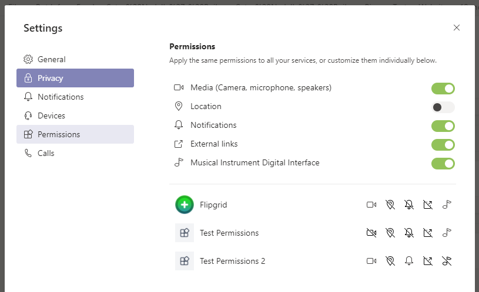

# <a name="request-device-permissions-for-your-microsoft-teams-tab"></a>Запрос разрешений устройства для вкладки Microsoft Teams

Вам может потребоваться расширить вкладки с помощью функций, требующих встроенных функций для доступа к устройствам, таких как:

> [!div class="checklist"]
>
> * Видеокамер
> * Специальный
> * Расположение
> * Уведомления

> [!IMPORTANT]
>
> * В настоящее время клиент Teams для мобильных устройств поддерживает только `camera` `location` встроенные возможности устройств и доступен во всех конструкциях приложений, в том числе на вкладках. </br>
> * Поддержка `camera` захвата образов включена с помощью [**API каптуреимаже**](/javascript/api/@microsoft/teams-js/microsoftteams?view=msteams-client-js-latest#captureimage--error--sdkerror--files--file-------void-).
> * В настоящее время [**API географического расположения**](../../resources/schema/manifest-schema.md#devicepermissions) не полностью поддерживается для всех настольных клиентов.

## <a name="device-permissions"></a>Разрешения для устройств

Доступ к разрешениям для устройств пользователя позволяет создавать более широкие возможности, например:

* Запись и совместное использование коротких видеороликов
* Запись коротких звуковых заметок и их сохранение для последующего использования
* Использование сведений о местонахождении пользователя для отображения релевантных сведений

Несмотря на то, что доступ к этим функциям имеют стандартные в большинстве современных веб-браузеров, необходимо разрешить командам знать, какие функции вы хотите использовать, обновив манифест приложения. Это позволит вам запросить разрешения так же, как и в браузере, а ваше приложение запущено на настольном клиенте Teams.

## <a name="manage-permissions"></a>Управление разрешениями

# <a name="desktop"></a>[Desktop](#tab/desktop)

1. Откройте Teams.
1. В правом верхнем углу окна выберите свой значок профиля.
1. В раскрывающемся меню выберите пункт **Параметры**  ->  **разрешений** .
1. Выберите нужные параметры.



# <a name="mobile"></a>[Мобильные устройства](#tab/mobile)

1. Откройте Teams.
1. В левом верхнем углу экрана выберите значок меню &#9776;.
1. Выберите **Параметры**  ->  **устройства**.
1. Выберите нужные параметры.


---

## <a name="properties"></a>Свойства

Обновите свое приложение `manifest.json` , добавив `devicePermissions` и указав, какие из пяти свойств вы хотите использовать в вашем приложении:

``` json
"devicePermissions": [
    "media",
    "geolocation",
    "notifications",
    "midi",
    "openExternal"
],
```
> [!Note]
>
> Мультимедиа также используется для разрешений камеры на мобильных устройствах.

Каждое свойство позволит пользователю запросить согласие пользователя.

| Свойство      | Описание   |
| --- | --- |
| СМИ         | разрешение на использование камеры, микрофона и динамиков |
| географическое положение   | разрешение на возврат расположения пользователя      |
| уведомления | разрешение на отправку уведомлений пользователей      |
| MIDI          | разрешение на отправку и получение информации MIDI из цифрового музыкального инструмента   |
| опенекстернал  | разрешение на открытие ссылок во внешних приложениях  |

## <a name="checking-permissions-from-your-tab"></a>Проверка разрешений на вкладке

После добавления `devicePermissions` в манифест приложения вы можете проверить разрешения с помощью API-интерфейса HTML5, не вызывая запрос.

``` Javascript
// Different query options:
navigator.permissions.query({ name: 'camera' });
navigator.permissions.query({ name: 'microphone' });
navigator.permissions.query({ name: 'geolocation' });
navigator.permissions.query({ name: 'notifications' });
navigator.permissions.query({ name: 'midi', sysex: true });

// Example:
navigator.permissions.query({name:'geolocation'}).then(function(result) {
  if (result.state == 'granted') {
    // Access granted
  } else if (result.state == 'prompt') {
    // Access has not been granted
  }
});
```

## <a name="prompting-the-user"></a>Запрос пользователя

Чтобы показать запрос на получение согласия на доступ к разрешениям для устройств, необходимо использовать соответствующий HTML5 или API Teams. Например, чтобы запросить у пользователя доступ к камере, которую нужно позвонить`getCurrentPosition`

```Javascript
navigator.geolocation.getCurrentPosition(function (position) { /*... */ });
```

Чтобы использовать камеру на настольном компьютере или в Интернете, при вызове Жетусермедиа Teams будет показывать запрос о разрешении.

```Javascript
navigator.mediaDevices.getUserMedia({ audio: true, video: true });
```

Чтобы записать изображение на мобильном устройстве, Teams будет запрашивать разрешение при вызове Каптуреимаже ().

```Typescript
function captureImage(callback: (error: SdkError, files: File[]) => void)
```

Уведомления будут запрашивать пользователя при вызове`requestPermission`

```Javascript
Notification.requestPermission(function(result) { /* ... */ });
```


## <a name="permission-behavior-across-login-sessions"></a>Поведение разрешений в сеансах входа

Встроенные разрешения устройств хранятся на каждом сеансе входа. Это означает, что если вы входите в другой экземпляр Teams (например, на другом компьютере), ваши разрешения на доступ к устройствам из предыдущих сеансов станут недоступными. Вместо этого вам потребуется повторное согласие с разрешениями на устройство для нового сеанса входа. Это также означает, что при выходе из Teams (или переключении клиентов в Teams) разрешения для этого устройства будут удалены для этого предыдущего сеанса. Помните об этом при разработке собственных разрешений на устройства: встроенные возможности, на которые вы согласны, относятся только к _текущему_ сеансу входа в систему.
