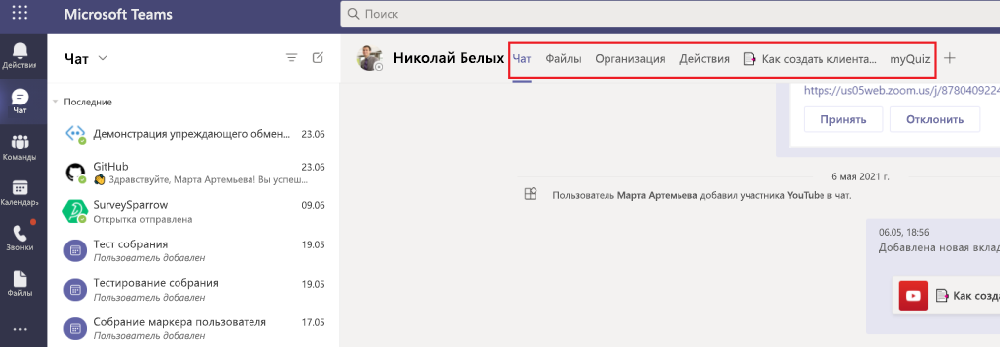
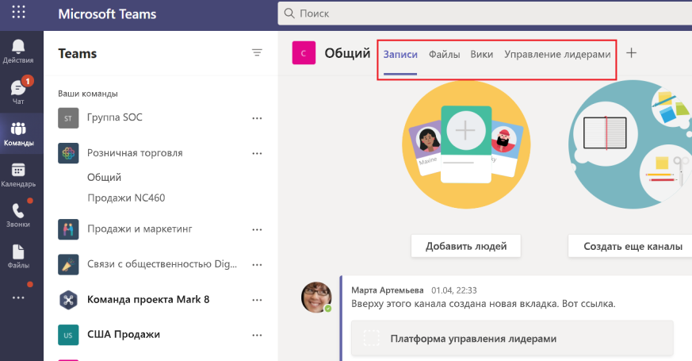

# Вкладки Microsoft Teams

Вкладки — это Teams веб-страницы, встроенные в Microsoft Teams. Это простые html-теги <iframe, которые указывают на домены, объявленные в манифесте приложения, и могут быть добавлены как часть канала внутри группы, группового чата или личного приложения для отдельного \> пользователя. Вы можете включить настраиваемые вкладки с приложением, чтобы встраить собственный веб-контент в Teams или добавить Teams-конкретные функции в веб-контент. Дополнительные сведения см. [в Teams клиентской SDK javaScript.](/javascript/api/overview/msteams-client)

> [!IMPORTANT]
> В настоящее время настраиваемые вкладки доступны в облако сообщества для государственных организаций (GCC), GCC-High и Department of Defense (DoD).

На следующем изображении показаны личные вкладки:

На следующем изображении показаны вкладки канала Contoso:

> [!VIDEO https://www.youtube-nocookie.com/embed/Jw6i7Mkt0dg]

> [!VIDEO https://www.youtube-nocookie.com/embed/T2a8yJC3VcQ]

Перед работой над вкладками необходимо пройти несколько необходимых условий.

Существует два типа вкладок, доступных в Teams, личных и каналов или групп. [Личные вкладки,](~/tabs/how-to/create-personal-tab.md)наряду с персональными ботами, являются частью личных приложений и доступны одному пользователю. Их можно прикрепить к левой панели навигации для легкого доступа. [Вкладки каналов](~/tabs/how-to/create-channel-group-tab.md) или групп доставляют контент в каналы и групповые чаты, и это отличный способ создания пространства для совместной работы вокруг выделенного веб-контента.

Страницу [контента можно создать](~/tabs/how-to/create-tab-pages/content-page.md) в составе личной вкладки, вкладки канала или группы или модуля задач. Вы можете [создать](~/tabs/how-to/create-tab-pages/configuration-page.md) страницу конфигурации, которая позволяет пользователям настраивать Microsoft Teams приложение и использовать его для настройки вкладки чата канала или группы, расширения обмена сообщениями или Office 365 соединители. Вы можете разрешить пользователям перенастройку вкладки после установки и [создать страницу](~/tabs/how-to/create-tab-pages/removal-page.md) удаления вкладок для приложения. При создании приложения Teams, которое включает вкладку, необходимо проверить, как ваша вкладка функционирует как на Android, так и [на Teams iOS.](~/tabs/design/tabs-mobile.md) Вкладка должна [получать контекст с](~/tabs/how-to/access-teams-context.md) помощью базовых сведений, сведений о локалике и теме, а также определяет, что находится на `entityId` `subEntityId` вкладке.

Вы можете создавать вкладки с адаптивными картами и централизовать все возможности Teams приложения, устраняя необходимость в другой задней части для ботов и вкладок. [Представление stage](~/tabs/tabs-link-unfurling.md) — это новый компонент пользовательского интерфейса, который позволяет отрисовки контента, открытого на полном экране Teams и закрепленного в качестве вкладки. Существующая [служба разгрузки](~/tabs/tabs-link-unfurling.md) ссылок обновляется таким образом, чтобы она использовалась для того, чтобы превратить URL-адреса в вкладку с помощью служб адаптивной карты и чата. Вы  можете создавать беседующие вкладки с помощью разговорных суб-сущностями, которые позволяют пользователям беседы о под-сущностям на вкладке, например о конкретных задачах, пациенте и возможности продаж, а не обсуждать всю вкладку. Вы можете внести изменения в поля [вкладок,](~/resources/removing-tab-margins.md) чтобы повысить качество работы разработчика при создании приложений.

## Функции Tab

Функции вкладки представлены следующим образом:

* Если вкладка добавляется в приложение с ботом, бот также добавляется в команду.
* Осведомленность Azure Active Directory (AAD) iD текущего пользователя.
* Локализуй для пользователя, чтобы указать язык, который `en-us` является .
* Возможность единого входного (SSO) при поддержке.
* Возможность использования ботов или уведомлений приложений для глубокой ссылки на вкладку или на под-объект в службе, например отдельный рабочий элемент.
* Возможность открыть модуль задач из ссылок на вкладке.
* Повторное использование SharePoint веб-частей в вкладке.

## Сценарии пользователей Tabs

**Сценарий:** Принесите существующий веб-ресурс внутри Teams. \
**Пример:** Вы создаете личную вкладку в Teams, которая представляет пользователям информационный корпоративный веб-сайт.

**Сценарий:** Добавьте страницы поддержки в Teams или расширение обмена сообщениями. \
**Пример:** Вы создаете личные  вкладки, которые предоставляют пользователям содержимое **веб-страницы** и помогают им.

**Сценарий:** Предоставление доступа к пунктам, с которые пользователи регулярно взаимодействуют для совместной работы и совместной работы. \
**Пример:** Создается вкладка канала или группы с глубокой ссылкой на отдельные элементы.

## Понимание работы вкладок

Для создания вкладок можно использовать один из следующих методов:

* [Объявление настраиваемой вкладки в манифесте приложения](#declare-custom-tab-in-app-manifest)
* [Использование адаптивной карты для создания вкладок](~/tabs/how-to/build-adaptive-card-tabs.md)

### Объявление настраиваемой вкладки в манифесте приложения

Настраиваемая вкладка объявляется в манифесте приложения вашего пакета приложений. Для каждой веб-страницы, включенной в качестве вкладки в приложении, вы определяете URL-адрес и область. Кроме того, вы можете добавить на страницу Teams [клиента JavaScript SDK](/javascript/api/overview/msteams-client) и позвонить после `microsoftTeams.initialize()` загрузки страницы. Teams отображает страницу и предоставляет Teams сведения, например Teams клиент работает на темную тему.

Независимо от того, хотите ли вы выставить вкладку в канале или группе или в личной области, необходимо представить страницу контента <iframe HTML на \> вкладке.  Для личных вкладок URL-адрес контента задается непосредственно Teams манифеста приложения в `contentUrl` `staticTabs` массиве. Содержимое вкладки одинаково для всех пользователей.

Для вкладок канала или группы можно также создать дополнительную страницу конфигурации. Эта страница позволяет настроить URL-адрес страницы контента, как правило, с помощью параметров строки URL-запроса для загрузки соответствующего контента для этого контекста. Это потому, что вкладку канала или группы можно добавить в несколько групп или групповых чатов. При каждой последующей установке пользователи могут настраивать вкладку, что позволяет настраивать необходимый опыт. При добавлении или настройке вкладки URL-адрес связан с вкладками, представленными Teams пользовательского интерфейса (пользовательского интерфейса). Настройка вкладки просто добавляет дополнительные параметры в этот URL-адрес. Например, при добавлении вкладки Azure Boards, страница конфигурации позволяет выбрать, на какую доску вкладка загружается. URL-адрес страницы конфигурации указывается  `configurationUrl` свойством в `configurableTabs` массиве манифеста приложения.

Вы можете иметь несколько каналов или групповых вкладок и до 16 личных вкладок для каждого приложения.

### Средства, которые можно использовать для создания вкладок
* [Наборы средств Teams для Visual Studio Code](../toolkit/visual-studio-code-overview.md)
* [Наборы средств Teams для Visual Studio](../toolkit/visual-studio-overview.md)

## См. также

* [Запрос разрешений устройства](../concepts/device-capabilities/native-device-permissions.md)
* [Интеграция возможностей мультимедиа](../concepts/device-capabilities/mobile-camera-image-permissions.md)
* [Интеграция сканера QR или штрихкода](../concepts/device-capabilities/qr-barcode-scanner-capability.md)
* [Интеграция функций местонахождения](../concepts/device-capabilities/location-capability.md)

## Следующий этап

> [!div class="nextstepaction"]
> [Предварительные требования](~/tabs/how-to/tab-requirements.md)
