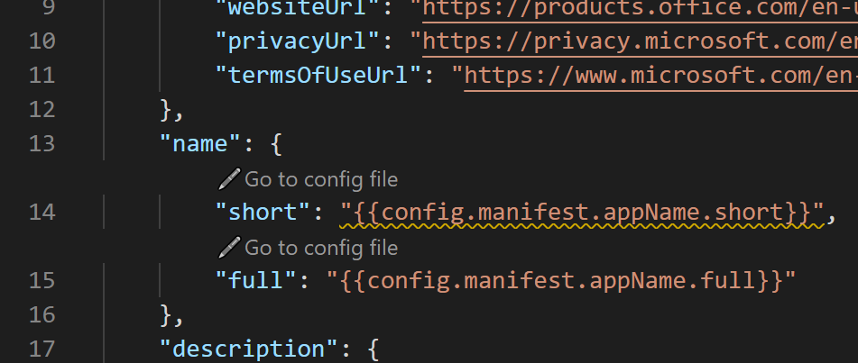

# <a name="customize-teams-app-manifest-in-teams-toolkit"></a>Настройка манифеста Teams в Teams набор средств

Teams набор средств состоит из двух файлов шаблонов манифеста в `templates/appPackage` папке:

- `manifest.local.template.json` - локальное приложение команд отлаговки
- `manifest.remote.template.json` — общий доступ во всех средах

## <a name="prerequisite"></a>Предварительное условие

* [Установка Teams набор средств](https://marketplace.visualstudio.com/items?itemName=TeamsDevApp.ms-teams-vscode-extension) версии v3.0.0+.

> [!TIP]
> Вы уже должны иметь проект Teams приложения, открытый в коде VS.

Во время предоставления Teams набор средств будет загружать манифест `manifest.remote.template.json` из , в сочетании с конфигурациями от и `state.{env}.json` `config.{env}.json` . Затем создается приложение teams на [портале Dev с](https://dev.teams.microsoft.com/apps) этим манифестом.

Во время локального отлажений Teams набор средств будет загружать манифест `manifest.local.template.json` из , в сочетании с конфигурациями от `localSettings.json` . Затем создается приложение teams на [портале Dev с](https://dev.teams.microsoft.com/apps) этим манифестом.

## <a name="supported-placeholder-in-manifestremotetemplatejson"></a>Поддерживаемый placeholder в manifest.remote.template.json

- `{{state.xx}}`является заранее определенным местоопределителям, значение которого определяется Teams набор средств, определенным в `state.{env}.json` . Не следует изменять значения в состоянии. {env}.json.
- `{{config.manifest.xx}}` является настраиваемым местообладателям, значение которого решается из `config.{env}.json` .
  - Настраиваемый параметр можно добавить следующим образом:
    - Добавьте местообладатель в manifest.remote.template.json с шаблоном: `{{config.manifest.xx}}`
    - Добавьте значение config в config. {env}.json

        ```json
        {
            "manifest": {
                "KEY": "VALUE"
            }
        }
        ```

    Кроме каждого замещатель config `manifest.remote.template.json` в, есть `Go to config file` кнопка. Вы можете перейти к файлу конфигурации, выбрав его, как показано на изображении:

    

## <a name="supported-placeholder-in-manifestlocaltemplatejson"></a>Поддерживаемый placeholder в manifest.local.template.json

`{{localSettings.xx}}`является заранее определенным местоопределителям, значение которого определяется Teams набор средств, определенным в `localSettings.json` . Не следует изменять значения в localSettings.json.

 > [!NOTE]
 > Настройка локального манифеста не предлагается.

## <a name="see-also"></a>См. также

> [!div class="nextstepaction"]
> [Предварительный Teams Манифест приложения в Teams набор средств](TeamsFx-manifest-preview.md)
