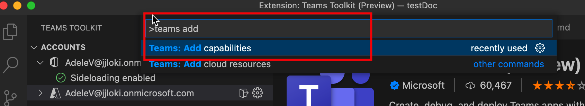
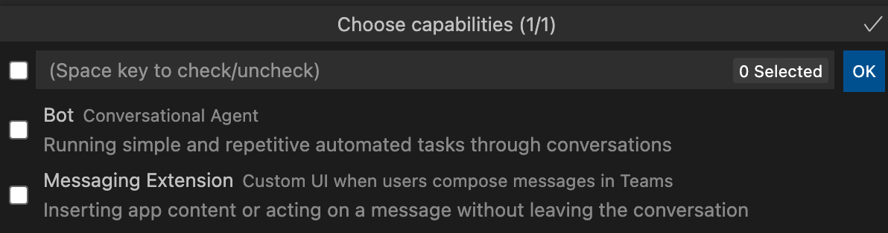

# Добавление возможностей в Teams приложения

Можно приступить к созданию приложения Teams с одним из Teams приложений. Во время разработки приложения можно использовать Teams набор средств, чтобы гибко добавлять дополнительные возможности в Teams приложение. В следующей таблице описываются Teams приложения:

|**Возможность**|**Описание**|
|--------|-------------|
| Вкладки |  Вкладки — это простые HTML-теги, которые указывают на домены, объявленные в манифесте приложения. Вкладки можно добавлять как часть канала внутри группы, группового чата или личного приложения для отдельного пользователя.|
| боты; |  Боты помогают взаимодействовать с веб-службой с помощью текстовых, интерактивных карт и модулей задач.|
| Расширения для система обмена сообщениями | Расширения обмена сообщениями помогают взаимодействовать с веб-службой с помощью кнопок и форм Microsoft Teams клиента.|

## Предварительное условие

* [Установка Teams набор средств](https://marketplace.visualstudio.com/items?itemName=TeamsDevApp.ms-teams-vscode-extension) версии v3.0.0+.

> [!TIP]
> Вы уже должны иметь проект Teams приложения, открытый в коде VS.

## Добавление возможностей с помощью Teams набор средств

> [!IMPORTANT]
> Необходимо выполнить предоставление для каждой среды после успешного добавления возможностей в Teams приложение.

1. Выберите **Teams набор средств** левой панели:

    
  
1. Выберите **дополнительные возможности:**

    

      Вы также можете открыть палитру команд и ввести **Teams: Add Capabilities:** 
      
      > [!NOTE]
      > Это эквивалентно триггеру из Tree View.

    

1. В всплывающее всплывающее всплывающее число выберите возможности, которые необходимо включить в проект:

    

1. Нажмите кнопку **ОК**.

Выбранные возможности слаженно добавляются в проект. В Teams набор средств создается исходный код для вновь добавленных возможностей.

## Добавление возможностей с помощью CLI TeamsFx в командном окне

1. Изменение каталога в **каталог проекта.**
1. Выполните следующую команду, чтобы добавить в проект различные возможности:

   |Возможности и сценарий| Команда|
   |-----------------------|----------|
   |Добавление вкладки|`teamsfx capability add tab`|
   |Добавление бота|`teamsfx capability add bot`|
   |Добавление расширения обмена сообщениями|`teamsfx capability add messaging-extension`|

## Матрица поддерживаемых возможностей

Помимо возможностей, которые у Teams уже есть, вы можете добавить различные возможности в Teams приложение. В следующей таблице различного Teams приложений: 

|Существующие возможности|Можно добавить другие возможности|
|--------------------|--------------------|
|Вкладки с SPFx|Нет|
|Вкладки с Azure|Расширения ботов и сообщений|
|Боты|Вкладки|
|расширения для обмена сообщениями;|вкладки;|
|Вкладки и боты|Нет|
|Расширения вкладок и сообщений|Нет|
|Расширения вкладок, ботов и сообщений|Нет|

## Что происходит при добавлении возможностей

После добавления расширения бота и обмена сообщениями в проекте будут внесены следующие изменения:

- Код шаблона бота добавляется в подмостки с пути `yourProjectFolder/bot` . Это включает шаблон приложения-бота "hello world" в проект.
- `launch.json` и `task.json` под `.vscode` папкой обновляются. Это включает в себя необходимые сценарии для Visual Studio Code, которые выполняются при локальном отключе приложения. 
- `manifest.remote.template.json` и `manifest.local.template.json` файл под `templates/appPackage` папкой обновляются. Это включает сведения, связанные с ботом, в файл манифеста, который представляет ваше приложение в Teams Платформе. Это изменение включает в себя:
  - ID вашего бота.
  - Области бота.
  - Команды, на которые может отвечать приложение-бот hello world.
- Файлы под `templates/azure/teamsfx` файлами будут обновлены, а шаблоны/azure/provision/xxx.bicep-файл будут регенерированы.
- Файл под `.fx/config` регенерируется. Это обеспечивает набор проектов с правильными конфигурациями для вновь добавленных возможностей.

После добавленной вкладки в проекте будут внесены следующие изменения:

- Код шаблона передней панели вкладок добавляется в подмостки с пути `yourProjectFolder/tab` . Это включает шаблон приложения вкладок "Hello World" в проект.
- `launch.json` и `task.json` под `.vscode` папкой обновляются. Это включает в себя необходимые сценарии для Visual Studio Code, которые выполняются при локальном отключе приложения. 
- `manifest.remote.template.json` и `manifest.local.template.json` файл под `templates/appPackage` папкой обновляются. Это включает сведения, связанные с вкладками, в файл манифеста, который представляет ваше приложение в платформе Teams, изменения включают:
  - Настраиваемые и статические вкладки.
  - Области вкладок.
- Файлы под `templates/azure/teamsfx` файлами будут обновлены, а шаблоны/azure/provision/xxx.bicep-файл будут регенерированы.
- Файл под `.fx/config` регенерируется. Это обеспечивает набор проектов с правильными конфигурациями для вновь добавленных возможностей.

## Ограничения

В настоящее время существуют ограничения с TeamsFx при добавлении дополнительных возможностей. Ограничения:

- Возможности каждого проекта несколько раз
- Любые возможности, если вы начинаете с приложения Tab с SPFx
- Дополнительные возможности бота, если проект содержит расширение обмена сообщениями
- Дополнительные расширения обмена сообщениями, если в проекте есть бот.

> [!NOTE]
> Если вы хотите включить возможности расширения бота и обмена сообщениями, выберите их одновременно. Их можно добавить при создании нового проекта или приложения-вкладки.

## См. также

> [!div class="nextstepaction"]
> [Предоставление облачных ресурсов](provision.md)

> [!div class="nextstepaction"]
> [Создание нового Teams проекта](create-new-project.md)
