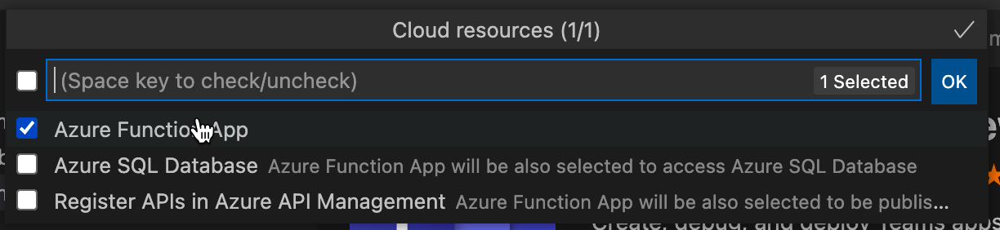

# Добавление облачных ресурсов в Teams приложение

TeamsFx помогает в предоставлении облачных ресурсов для размещения приложений. Кроме того, можно дополнительно добавить облачные ресурсы, которые подходят для разработки.

## Предварительное условие

* [Установка Teams набор средств](https://marketplace.visualstudio.com/items?itemName=TeamsDevApp.ms-teams-vscode-extension) версии v3.0.0+.

> [!TIP]
> У вас уже должен быть проект Teams приложения.

## Добавление облачных ресурсов с Teams набор средств

> [!IMPORTANT]
> Необходимо уложить каждую среду после добавления ресурса.

1. Откройте **Visual Studio Code**.
1. Выберите **Teams набор средств** левой панели:

    

1. В панели Teams набор средств панели выберите **Добавить облачные ресурсы:**

    

    Вы также можете открыть палитру команд и ввести **Teams: Добавить облачные ресурсы:**
    
    > [!NOTE]
    > Следуйте за тем же процессом, что и при запуске из Tree View:

    

1. Во всплывающее приложение выберите любые облачные ресурсы, которые необходимо добавить в проект Teams приложения:

     

1. Нажмите кнопку **ОК**.

## Добавление облачных ресурсов с помощью CLI TeamsFx в командном окне

1. Изменение каталога в **каталог проекта.**
1. Выполните команду, чтобы добавить различные возможности.

В следующей таблице описываются облачные ресурсы и соответствующие команды для их добавления:

|Облачные ресурсы|Команда|
|---------------|----------|
| Функция Azure|`teamsfx resource add azure-function --function-name your-func-name`|
| База данных Azure SQL|`teamsfx resource add --function-name your-func-name`|
| Управление API Azure|`teamsfx resource add azure-apim`|

## Какие облачные ресурсы можно добавить

TeamsFx обеспечивает бесшовную интеграцию с службами Azure, которые являются общими для следующих сценариев приложений:

- [Функции Azure:](/azure/azure-functions/functions-overview)решение без серверов для удовлетворения требований по запросу, например создание веб-API для Teams приложений.
- [База SQL Azure](/azure/azure-sql/database/sql-database-paas-overview): полностью управляемой платформы в качестве двигателя базы данных службы (PaaS), чтобы служить в качестве Teams хранения данных приложений.
- [Управление API](/azure/azure-sql/database/sql-database-paas-overview)Azure: шлюз API, который можно использовать для администрирования API, созданных для Teams приложений, и публикации их для использования в других приложениях, например Power Apps.

## Что происходит при добавлении ресурсов

При добавлении ресурсов в проект будут внесены следующие изменения:

- В Azure.parameter могут быть добавлены новые параметры. {env}.json для предоставления необходимых сведений для предоставления.
- Новое содержимое добавляется в ARM в папке (кроме файлов в папке) для `templates/azure` `templates/azure/teamsfx` создания добавленных ресурсов Azure.
- Файлы в папке регенерированы, чтобы убедиться, что необходимая конфигурация TeamsFx является новой для добавленных `templates/azure/teamsfx` ресурсов Azure.
- `.fx/projectSettings.json` обновляется для отслеживания ресурсов, присутствующих в проекте.

В то же время для каждого типа ресурса есть некоторые дополнительные изменения:

|Добавлены ресурсы|Что изменилось|Почему внесены эти изменения|
|---------------|---------------|-----------------------------|
|Функции Azure|Код шаблона Azure Functions добавляется в подмостки с пути `yourProjectFolder/api`  `launch.json` и `task.json` обновляется в `.vscode` папке.| Включите шаблон триггера hello world http в проект.   Чтобы включить необходимые сценарии для Visual Studio Code, которые необходимо отключить приложение локально.|
|Управление API Azure|Файл спецификации Открытого API, добавленный в подмостки с пути `yourProjectFolder/openapi`|Это файл спецификации API, определяющий API после публикации.|

## Ограничения

- В проект можно добавить только одно приложение функции База данных SQL Azure/AIM-службу.
- Нельзя добавлять ресурсы, если в проекте не содержится приложение вкладки.

## См. также

> [!div class="nextstepaction"]
> [Предоставление облачных ресурсов](provision.md)
