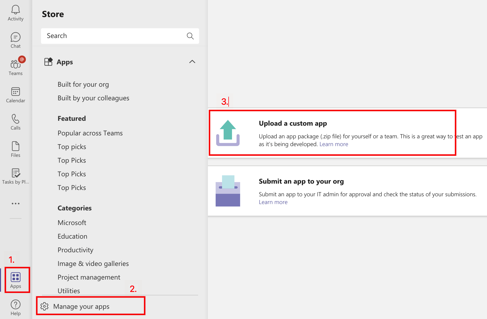

# Публикация Teams с помощью Teams набор средств

После создания приложения вы можете распространить приложение в различные области, такие как отдельные, группы, организации или любой другой. Распределение зависит от нескольких факторов, в том числе потребностей, бизнес-и технических требований, и вашей цели для приложения. Для распространения в различных сферах может потребоваться другой процесс проверки. В общем, чем больше область, тем больше обзор приложения необходимо пройти для обеспечения безопасности и соответствия требованиям.

## Предварительное условие

* [Установка Teams набор средств](https://marketplace.visualstudio.com/items?itemName=TeamsDevApp.ms-teams-vscode-extension) версии v3.0.0+.

> [!TIP]
> У вас уже должен быть проект Teams приложения.

## Публикация в отдельной области (разрешение на загрузку)

Пользователи могут добавлять настраиваемые приложения в Teams, загрузив пакет приложения в файл .zip непосредственно в команду или в личном контексте. Добавление настраиваемого приложения путем загрузки пакета приложений, также известного как боковая загрузка, позволяет протестировать приложение в его разработке, прежде чем оно будет готово к широкому распространению, как упоминалось в следующих сценариях:

* Тестирование и отлагивание приложения на локальном уровне или с другими разработчиками.
* Выстроили приложение только для себя. Например, автоматизировать рабочий процесс.
* Вы создали приложение для небольшого набора пользователей, например рабочей группы.

Это также позволяет создавать приложение только для внутреннего использования и делиться им с командой без отправки его в каталог Teams приложения в Teams магазине приложений.

* Создайте приложение в файл пакета *.zip приложения

    Вы можете создать пакет приложений, выбрав панель `Zip Teams metadata package` DEPLOYMENT в Treeview Teams набор средств. Сначала может потребоваться `Provision in the cloud` запустить. Созданный пакет приложений будет расположен в следующем `{your project folder}/build/appPackage/appPackage.{env}.zip` изображении:

 

## Публикация в организации 

Когда приложение готово к использованию в производстве, разработчик может отправить приложение с помощью API отправки Teams приложения, который называется из API Graph, интегрированной среды разработки (IDE), например Visual Studio Code, установленной с Teams инструментарием. Вы можете выбрать публикацию **Teams** панели DEPLOYMENT в TreeView Teams набор средств или вызвать **Teams:** Опубликовать Teams из палитры команд. Затем выберите **Установите для организации,** как показано на следующем изображении:

Это делает приложение доступным на странице Управление приложениями центра администрирования Microsoft Teams, где вы и администратор можете просмотреть и утвердить его.

В качестве администратора страница управления  приложениями в центре администрирования Microsoft Teams, на которой просматривается и управляется Teams приложений для вашей организации. Здесь вы можете просмотреть состояние и свойства приложений на уровне организации, утвердить или загрузить новые настраиваемые приложения в магазин приложений организации, заблокировать или разрешить приложения на уровне организации, добавить приложения в группы, приобрести службы для сторонних приложений, просмотреть разрешения, запрашиваемые приложениями, предоставить согласие администратора приложениям и управлять настройками приложений по всей организации.

[Управление](https://admin.teams.microsoft.com/policies/manage-apps) страницей приложений в центре администрирования команд Teams набор средств для Visual Studio Code, построенный поверх API отправки приложений Teams, и это позволяет автоматизировать процесс отправки на утверждение для настраиваемого приложения на Teams.

> [!NOTE]
> Имейте в виду, что это приложение еще не публикуется в магазине приложений организации. На этом этапе приложение передается в центр администрирования Microsoft Teams, где вы можете утвердить его для публикации в магазине приложений вашей организации.

## Утверждение администратора для Teams приложений

Затем администратор клиента Teams может перейти на страницу Управление приложениями в центре администрирования Microsoft Teams (в левой навигации перейдите в Teams приложения > Управление приложениями), чтобы просмотреть все Teams приложения для вашей организации. Виджет "Ожидание утверждения" в верхней части страницы позволяет узнать, когда настраиваемые приложения будут отправлены на утверждение.
В таблице новое приложение автоматически отображает состояние публикации "Отправлено" и "Состояние заблокировано". Чтобы быстро найти приложение, можно отсортировать столбец состояние публикации в порядке убывания:

 

Выберите имя приложения, чтобы перейти на страницу сведений о приложении. На вкладке About можно просмотреть сведения о приложении, включая описание, состояние, отправку и ID приложения:

 

Когда вы будете готовы сделать приложение доступным для пользователей, выполните следующие действия, чтобы опубликовать приложение:

1. В левой навигации центра администрирования Microsoft Teams перейдите в Teams приложения > управление приложениями.
2. Выберите имя приложения, чтобы перейти на страницу сведений о приложении, а затем в поле Состояние публикации выберите Опубликовать.
После публикации приложения состояние публикации изменяется в Published, а состояние автоматически изменяется на Разрешено.

## Публикация в Microsoft Store

Вы можете распространять приложение непосредственно в магазине Microsoft Teams и охватить миллионы пользователей по всему миру. Если приложение также находится в магазине, вы можете мгновенно охватить потенциальных клиентов.
Приложения, опубликованные в Teams, также автоматически перечисляются в Microsoft AppSource, которая является официальным рынком Microsoft 365 приложений и решений.
Поймите процесс публикации, когда вы чувствуете, что ваше приложение готово, вы можете начать процесс его перечисления в Teams магазине.

>[!Tip]
> Внимательно следуя за этапами предварительной отправки, можно увеличить вероятность того, что Корпорация Майкрософт одобрит ваше приложение для публикации.

* Просмотрите Teams проверки хранения, чтобы убедиться, что ваше приложение соответствует Teams и стандартам магазина.
* Создание учетной записи разработчика Центра партнеров.
* Подготовка отправки в магазин, которая включает в себя запуск автоматических тестов, компиляторию тестовых заметок, создание списка магазинов, а также другие важные задачи, которые помогут ускорить процесс проверки.
* Отправка приложения через Центр партнеров.
* Работайте с Корпорацией Майкрософт напрямую, чтобы устранить проблемы и повторно переподпустить приложение (ссылка на устранение проблем и повторное сообщение).

## См. также

> [!div class="nextstepaction"]
> [Управление несколькими средами](TeamsFx-multi-env.md)

> [!div class="nextstepaction"]
> [Сотрудничество с другими разработчиками в Teams проекте](TeamsFx-collaboration.md)