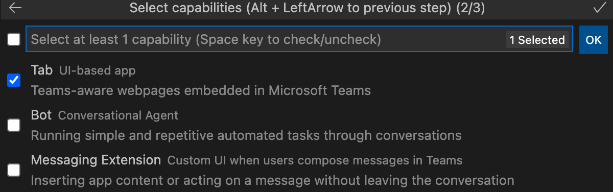
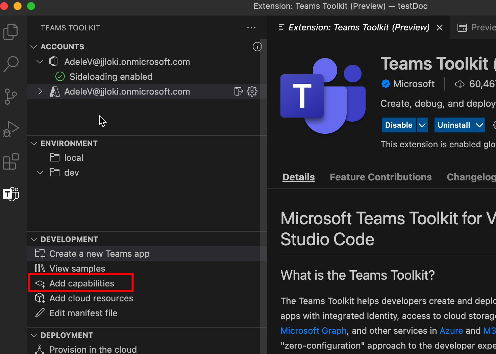
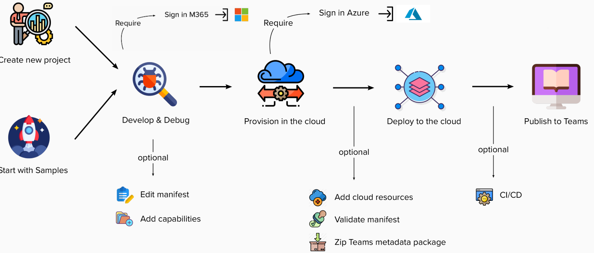
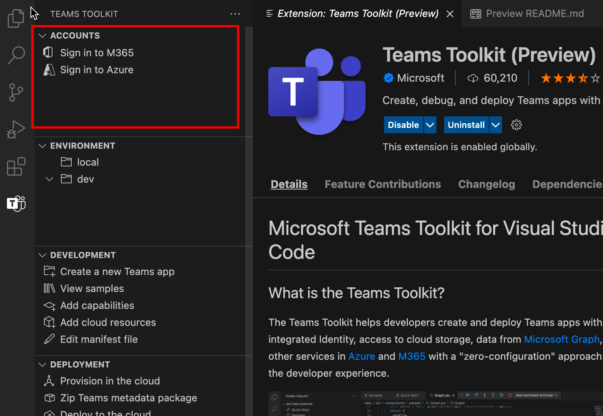
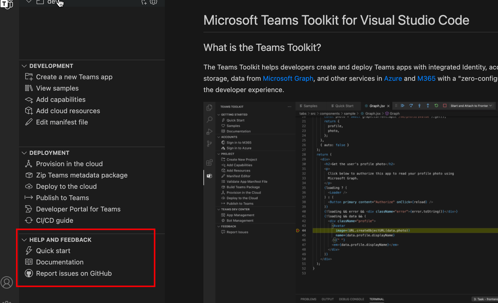

# Teams набор средств

> [!NOTE]
> В настоящее время эта функция доступна только **для предварительного просмотра общедоступных** разработчиков.

Teams набор средств для Visual Studio Code помогает разработчикам создавать и развертывать приложения Teams с интегрированным удостоверением, доступом к облачному хранилище, данным Microsoft Graph и другим службам в Azure и Microsoft 365 с подходом нулевой конфигурации к разработчику опыт.  

Существует средство Teams набор средств для Visual Studio [cLI](https://github.com/OfficeDev/TeamsFx/blob/dev/docs/cli/user-manual.md) для разработки Teams приложений (называется `teamsfx` ).

## Установите Teams набор средств для Visual Studio Code

1. Откройте **Visual Studio Code.**

1. Выберите представление Расширения **(Ctrl+Shift+X**  /  **⌘⇧-X** или **> расширения).**

1. В поле поиска введите **Teams набор средств**.

1. Выберите **кнопку** установки рядом с Teams набор средств.

Или вы можете найти Teams набор средств на Visual Studio Code [Marketplace](https://marketplace.visualstudio.com/items?itemName=TeamsDevApp.ms-teams-vscode-extension).

## Поддержка Teams приложений

[Microsoft Teams возможности](../concepts/capabilities-overview.md) приложения Teams точки раздвимости.Teams набор средств для Visual Studio Code позволяет разработчикам работать над проектом со следующими возможностями Teams приложения:

* [Вкладки](../tabs/what-are-tabs.md#microsoft-teams-tabs)

* [Боты](../bots/what-are-bots.md#bots-in-microsoft-teams)

* [Расширения для системы обмена сообщениями](../messaging-extensions/what-are-messaging-extensions.md#messaging-extensions) 

Ваш Teams может содержать как одну из возможностей, так и все три возможности сверху. Вы можете выбрать любую возможность при создании Teams Project.

Teams набор средств предоставляет гибкость, чтобы добавить дополнительные возможности в дальнейшем процессе разработки Teams приложения.

## Пользовательский путь Teams набор средств

Teams набор средств предоставляет функции разработки Teams, чтобы удоборазумить отлагивание, развертывание и публикацию. Teams набор средств автоматизирует ручную работу и обеспечивает большую интеграцию ресурсов Teams Azure. На следующем рисунке Teams набор средств путь пользователя:

## Экскурсия по Teams набор средств для Visual Studio Code

Если вы не откроете Teams проекта в VS Code или откроете проект, не созданный с помощью Teams набор средств v2.+, вы увидите пользовательский интерфейс Teams набор средств с ограниченными функциональными возможностями, как показано на следующем изображении:

:::image type="content" source="./images/teams-toolkit-beforestart.png" alt-text="Перед началом Teams набор средств":::

Вы можете выбрать **быстрый** запуск для изучения Teams набор средств или создать новое **приложение Teams** для создания одного Teams проекта. Если Teams Project Teams набор средств v2.+ открыт в VS Code, Teams набор средств пользовательского интерфейса с дополнительными функциональными возможностями, как показано на следующем изображении:

:::image type="content" source="./images/teams-toolkit-overview.png" alt-text="Съехай Teams набор средств":::

Рассмотрим функциональные возможности, доступные в Teams набор средств:

* [Accounts](#accounts)

* [Среда](#environment)

* [Development](#development)

* [Развертывание](#deployment)

* [Справка и отзывы](#help-and-feedback)

### Учетные записи

Разработчики должны иметь Microsoft 365 учетную запись для создания Teams приложения. Если у вас его нет, вы можете получить бесплатную учетную запись Teams, присоединившись к программе Microsoft 365 [разработчика:](https://developer.microsoft.com/microsoft-365/dev-program)

Учетная запись Azure обычно используется в Teams разработке приложения. Если вы хотите, чтобы Teams или доступ к ресурсам в Azure, необходимо иметь учетную запись Azure. Teams набор средств интегрированный опыт для регистрации, обеспечения и развертывания ресурсов Azure. Перед [началом можно создать бесплатную учетную запись Azure.](https://azure.microsoft.com/free/)

 Дополнительные сведения см. [в записи подготовки учетных записей к созданию Teams приложения](accounts.md)

### Среда

Teams набор средств помогает управлять несколькими средами. Можно добавлять, настраивать и настраивать среды. Вы можете добавить сотрудников для каждой среды:

 Дополнительные сведения [см.](TeamsFx-multi-env.md) в нескольких средах и совместной работе с другими разработчиками Teams [проекта.](TeamsFx-collaboration.md)

### Development

Teams набор средств обеспечивает удобство для создания и настройки Teams проекта приложения, что позволяет Teams разработки приложения легко и быстро: 

1. **Создание нового приложения Teams** помогает начать Teams разработки приложения с помощью проекта шаблона "Hello World" или примера проекта. Дополнительные сведения см. в [Teams проекте](create-new-project.md)
1. **Просмотр примеров**, показывает набор Teams для изучения, ссылки и разработки.
1. **Добавление возможностей,** помогает добавить еще Teams возможности для Teams приложения в любое время в процессе разработки. Дополнительные сведения [см. в дополнительных сведениях о](add-capability.md) добавлении возможностей в Teams приложение
1. **Добавление облачных ресурсов** позволяет добавлять дополнительные облачные ресурсы в соответствии с изменением требований. Дополнительные сведения см. [в добавлении облачных ресурсов для Teams приложения](add-resource.md)
1. **Файл манифеста** редактирования позволяет легко изменять интеграцию Teams приложения с Teams клиентом. Дополнительные сведения см. в [Teams манифеста](TeamsFx-manifest-preview.md) и [редактировании Teams манифеста.](TeamsFx-manifest-customization.md)

### Развертывание

Во время или после разработки следует следить за процессом обеспечения, развертывания и публикации приложения Teams, прежде чем оно будет доступно для пользователей:

1. Если вы хотите Teams приложение в Azure или вам необходимо использовать ресурсы **Azure,** подготовка в облаке поможет автоматизировать процесс создания ресурсов Azure. Чтобы использовать его, необходимо иметь подписку Azure. Дополнительные сведения см. в [дополнительных сведениях о предоставлении облачных ресурсов.](provision.md)

1. Перед публикацией приложения или общего доступа вы можете Teams приложение в пакеты, выбрав пакет метаданных **zip Teams** zip.

1. **Развертывание в облаке** помогает развернуть исходный код в Azure. Обязательным условием для развертывания является подготовка ресурсов путем запуска Provision **в** облаке или создание ресурсов Azure вручную и указание параметра ресурса в параметрах среды проекта. Дополнительные сведения см. в [Teams приложения в облаке.](deploy.md)

1. Вместо вручную публикации настраиваемого Teams приложения можно использовать функцию **Teams** для вызова Teams api для публикации Teams приложения. Вам нужно разрешение для Teams приложения. Дополнительные сведения см. [в публикации приложения Teams.](publish.md)

1. Портал разработчика для Teams это место, где можно управлять и распространять Teams приложение. Дополнительные сведения см. на [портале разработчиков](/microsoftteams/platform/concepts/build-and-test/teams-developer-portal)

1. Teams набор средств также предоставляет шаблон CI/CD для ci/CD-инструментов, таких как GitHub, Azure Devops и Jenkins. Дополнительные сведения см. в [дополнительных сведениях о создании конвейеров ci/CD для Teams приложения](use-CICD-template.md)

### Справка и отзывы

В этом разделе можно легко найти необходимую документацию и ресурсы. Чтобы получить быструю поддержку от эксперта **по продуктам,** GitHub в Teams набор средств отчете.  Просмотрите проблему перед созданием нового или посетите [тег `teams-toolkit` StackOverflow,](https://stackoverflow.com/questions/tagged/teams-toolkit) чтобы просмотреть и задать вопросы:

## См. также

> [!div class="nextstepaction"]
> [Создание новых Teams набор средств](create-new-project.md)

> [!div class="nextstepaction"]
>[Подготовка учетных записей для создания Teams приложений](accounts.md)
