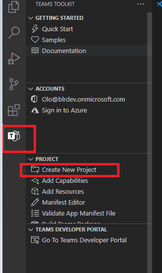

# Создание приложений с помощью Teams набор средств и Visual Studio

Набор средств Microsoft Teams Toolkit позволяет создавать пользовательские приложения Teams непосредственно в интегрированной среде разработки (IDE) Visual Studio. Этот набор средств Microsoft Teams предоставит вам пошаговые инструкции в процессе создания приложения, а также все необходимое для сборки, отладки и запуска вашего приложения Teams.

## Необходимые компоненты

1. [Включить предварительный просмотр разработчика.](../resources/dev-preview/developer-preview-intro.md#enable-developer-preview)

1. Убедитесь, что **ASP.NET** и модуль веб-разработки добавлены в экземпляр Visual Studio. Вы можете проверить, следуя шагам в изменении Visual Studio путем добавления или удаления рабочих нагрузок [и документации по компонентам.](/visualstudio/install/modify-visual-studio?view=vs-2019&preserve-view=true)

3. Если вы хотите проверить приложение, развернув его из Visual Studio, необходимо установить службы IIS (IIS)) в среде разработки. Visual Studio не включает IIS и не входит в конфигурацию Windows 10, Windows 8 или Windows 7; Однако вы можете скачать последнюю версию из [центра загрузки Майкрософт.](https://www.microsoft.com/download/details.aspx?id=48264)

## Установка Teams набор средств

Приложение Microsoft Teams набор средств для Visual Studio доступно для скачивания с [Visual Studio Marketplace](https://marketplace.visualstudio.com/items?itemName=TeamsDevApp.vsteamstemplate) или непосредственно  из меню Расширения в Visual Studio. С Visual Studio Marketplace также [скачайте Teams набор средств для Visual Studio 2019](https://marketplace.visualstudio.com/items?itemName=msft-vsteamstoolkit.vsteamstoolkit).

## Использование инструментария

- [Настройка нового проекта](#set-up-a-new-teams-project)
- [Настройка приложения](#configure-your-app)
- [Пакет приложения](#package-your-app)
- [Установите и запустите приложение в Teams](#install-and-run-your-app-locally)
- [Проверка приложения](#validate-your-app)
- [Публикация приложения](#publish-your-app-to-teams)

## Настройка нового проекта Teams

1. Выберите **Создать проект**.

    

1. Выберите средство quickstart для **Microsoft Teams App и** выберите **Далее**.
1. На странице **Настройка новой страницы проекта** введите имя Project, **расположение** и **имя решения.** 
1. Выберите решение и проект Place в том же почтовом **ящике каталога.**
1. В **всплывающее** окно Add Capabilities выберите одну или несколько возможностей для установки проекта.
1. Выберите **кнопку Далее** для завершения процесса настройки.
1. В **всплывающее** окно Add Capabilities выберите свойства для каждой выбранной возможности.
1. Нажмите **Готово**. Показана **Microsoft Teams набор средств** страница.

    

## Настройка приложения

В основе приложения Teams три компонента:

  1. Клиент Microsoft Teams веб,настольный компьютер или мобильный, где пользователи взаимодействуют с вашим приложением.
  1. Сервер, который отвечает на запросы контента, отображаемого в Teams, например, контента вкладок HTML или адаптивной карты бота.
  1. Пакет Teams состоит из трех файлов:

      - В manifest.js
      - Значок [цвета](../resources/schema/manifest-schema.md#icons) для отображения приложения в каталоге общедоступных или организаций.
      - Значок [плана](../resources/schema/manifest-schema.md#icons) для отображения на панели Teams действий.

При установке приложения клиент Teams определяет файл манифеста, чтобы определить необходимые сведения, такие как имя приложения и URL-адрес, в котором находятся службы.

> [!NOTE]
>Если вы еще этого не сделали, необходимо войти в Microsoft 365 учетную запись, чтобы продолжить процесс разработки.
>
> Если у вас нет Microsoft 365 учетной записи, вы можете подписаться на подписку [Microsoft 365 разработчика.](https://developer.microsoft.com/microsoft-365/dev-program) Он бесплатный в течение 90 дней и обновляется до тех пор, пока вы используете его для разработки. Если у вас есть подписка Visual Studio Enterprise или Professional, обе программы включают бесплатную подписку Microsoft 365 [разработчика,](https://aka.ms/MyVisualStudioBenefits)активную для Visual Studio подписки. Дополнительные сведения см. [в Microsoft 365 подписки разработчика.](/office/developer-program/office-365-developer-program-get-started)

### Этапы конфигурации

1. Чтобы настроить приложение на Microsoft Teams набор средств **странице,** выберите **пакет изменить приложение.**
1. Из **выпадаемого** меню My Environments выберите **разработку.**
1. На странице **Сведения о приложении** отредактируете поля свойств вашего приложения.
    
    Редактирование полей на странице сведения Приложения обновляет содержимое manifest.jsфайла, который будет отгрузка в составе пакета приложений. Дополнительные сведения см. [в Teams набор средств манифесте](https://aka.ms/teams-toolkit-manifest).

## Пакет приложения

Изменение страницы **сведений** о приложении или обновление манифеста **или** **.env-файлов** в папке **.publish** вашего приложения автоматически создаетDevelopment.zip **файл.** Файл Development.zip содержит три необходимых файла, **manifest.jsи** два [значка.](../concepts/build-and-test/apps-package.md#app-icons)

## Установка и локальное запуск приложения

1. Из меню **выпадаемой** конфигурации решений выберите **Развертывание,** как показано на следующем изображении:

    

1. Выберите **кнопку IIS Express + Teams.**

    Диалоговое окно установки приложения отображается в Teams клиенте.

## Проверка приложения

Страница **Проверка** позволяет проверить пакет приложений перед отправкой приложения в AppSource. Просто загрузите пакет манифеста, а средство проверки проверит ваше приложение на всех связанных с манифестом тестовых случаях. Для каждого неудачного тестирования описание предоставляет ссылку на документацию, которая поможет устранить ошибку. Для тестов, которые трудно автоматизировать, в предварительном контрольном списке 7 наиболее распространенных неудачных тестовых случаев, а также ссылки на полный контрольный список отправки. 

## Опубликуйте свое приложение в Teams

* На домашней странице проекта можно передать приложение в команду, отправить приложение в настраиваемый магазин приложений вашей компании, чтобы приложением смогли воспользоваться пользователи вашей организации, или отправить приложение в AppSource для всех пользователей Teams.

* ИТ-администратор проверит эти отправленные приложения.

* Вы можете вернуться на страницу **Публикация,** чтобы проверить состояние отправки и узнать, было ли ваше приложение утверждено или отклонено вашим ИТ-администратором. Здесь также можно отправлять обновления в приложение или отменять активные в настоящее время отправки.

## Следующий этап

> [!div class="nextstepaction"]
> [Ведение и поддержка опубликованного приложения](../concepts/deploy-and-publish/appsource/post-publish/overview.md)
>
